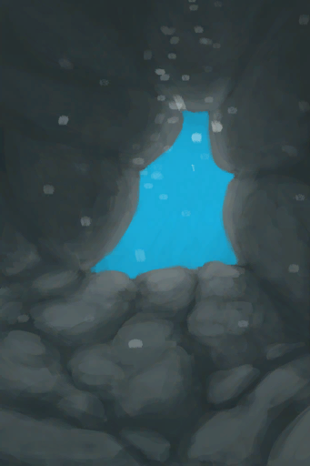

# Swimming(Skill)  
> Shows how good you are at swimming. Increases your chances of reaching difficult places and finding good things when diving   
> Swimming is a skill to allows you to find things while <b>diving</b> and increases your chances of success when doing things in the water.  This skill lowers your chances of getting hurt by animals underwater or of failing long-distance swimming actions.  
  

<b>Base Value: </b> 0 
  

<b>Value Range: </b> 0 ~ 150 
  

<b>Base Rate: </b> - 
  

<b>Staleness: </b>Staleness multiplier 80% in 3h(stack:2) 
  
## Change By  
<table class="table table-bordered" data-toggle="table"  ><thead style=""><tr ><th  style="text-align:left;vertical-align:top;"  >From</th><th  style="text-align:left;vertical-align:top;"  >Operation</th><th  style="text-align:left;vertical-align:top;"  data-sortable="true"  >Value</th></tr></thead><tr ><td  style="text-align:left;vertical-align:top;"  >[

[Secret Cove](Path_BirdRockToCove.md)](Path_BirdRockToCove.md)</td><td  style="text-align:left;vertical-align:top;"  >Swim</td><td  style="text-align:left;vertical-align:top;"  >1</td></tr><tr ><td  style="text-align:left;vertical-align:top;"  >[

[Desolate Beach(Bird Rock)](Path_BirdRockToDesolateBeach.md)](Path_BirdRockToDesolateBeach.md)</td><td  style="text-align:left;vertical-align:top;"  >Swim</td><td  style="text-align:left;vertical-align:top;"  >1</td></tr><tr ><td  style="text-align:left;vertical-align:top;"  >[

[Rocks(Bird Rock)](Path_BirdRockToRocks.md)](Path_BirdRockToRocks.md)</td><td  style="text-align:left;vertical-align:top;"  >Swim</td><td  style="text-align:left;vertical-align:top;"  >1</td></tr><tr ><td  style="text-align:left;vertical-align:top;"  >[

[Bird Rock(Secret Cove)](Path_CoveToBirdRock.md)](Path_CoveToBirdRock.md)</td><td  style="text-align:left;vertical-align:top;"  >Swim</td><td  style="text-align:left;vertical-align:top;"  >1</td></tr><tr ><td  style="text-align:left;vertical-align:top;"  >[

[Bird Rock(Desolate Beach)](Path_DesolateBeachToBirdRock.md)](Path_DesolateBeachToBirdRock.md)</td><td  style="text-align:left;vertical-align:top;"  >Swim</td><td  style="text-align:left;vertical-align:top;"  >1</td></tr><tr ><td  style="text-align:left;vertical-align:top;"  >[

[Bird Rock](Path_RocksToBirdRock.md)](Path_RocksToBirdRock.md)</td><td  style="text-align:left;vertical-align:top;"  >Swim</td><td  style="text-align:left;vertical-align:top;"  >1</td></tr><tr ><td  style="text-align:left;vertical-align:top;"  >[

[Seawater(Flooded Chamber)](Sea_Cave.md)](Sea_Cave.md)</td><td  style="text-align:left;vertical-align:top;"  >Dive</td><td  style="text-align:left;vertical-align:top;"  >1</td></tr><tr ><td  style="text-align:left;vertical-align:top;"  >[

[Sea(Atoll)](Sea_Atoll.md)](Sea_Atoll.md)</td><td  style="text-align:left;vertical-align:top;"  >Dive</td><td  style="text-align:left;vertical-align:top;"  >1</td></tr><tr ><td  style="text-align:left;vertical-align:top;"  >[

[Sea(Bay)](Sea_Bay.md)](Sea_Bay.md)</td><td  style="text-align:left;vertical-align:top;"  >Dive</td><td  style="text-align:left;vertical-align:top;"  >1</td></tr><tr ><td  style="text-align:left;vertical-align:top;"  >[

[Sea(Beach)](Sea_Beach.md)](Sea_Beach.md)</td><td  style="text-align:left;vertical-align:top;"  >Dive</td><td  style="text-align:left;vertical-align:top;"  >1</td></tr><tr ><td  style="text-align:left;vertical-align:top;"  >[

[Sea(Secret Cove)](Sea_Cove.md)](Sea_Cove.md)</td><td  style="text-align:left;vertical-align:top;"  >Dive</td><td  style="text-align:left;vertical-align:top;"  >1</td></tr><tr ><td  style="text-align:left;vertical-align:top;"  >[

[Sea(Desolate Beach)](Sea_DesolateBeach.md)](Sea_DesolateBeach.md)</td><td  style="text-align:left;vertical-align:top;"  >Dive</td><td  style="text-align:left;vertical-align:top;"  >1</td></tr><tr ><td  style="text-align:left;vertical-align:top;"  >[

[Sea(Mangrove Forest)](Sea_Mangroves.md)](Sea_Mangroves.md)</td><td  style="text-align:left;vertical-align:top;"  >Dive</td><td  style="text-align:left;vertical-align:top;"  >1</td></tr><tr ><td  style="text-align:left;vertical-align:top;"  >[

[Sea](Sea_Raft.md)](Sea_Raft.md)</td><td  style="text-align:left;vertical-align:top;"  >Dive</td><td  style="text-align:left;vertical-align:top;"  >1</td></tr><tr ><td  style="text-align:left;vertical-align:top;"  >[

[Sea(Bird Rock)](Sea_Rocks.md)](Sea_Rocks.md)</td><td  style="text-align:left;vertical-align:top;"  >Dive</td><td  style="text-align:left;vertical-align:top;"  >1</td></tr><tr ><td  style="text-align:left;vertical-align:top;"  >[

[Shipwreck(Bird Rock)](Shipwreck.md)](Shipwreck.md)</td><td  style="text-align:left;vertical-align:top;"  >Explore the shipwreck</td><td  style="text-align:left;vertical-align:top;"  >1</td></tr><tr ><td  style="text-align:left;vertical-align:top;"  >[

[Underwater Cave](UnderwaterEntrance.md)](UnderwaterEntrance.md)</td><td  style="text-align:left;vertical-align:top;"  >Enter</td><td  style="text-align:left;vertical-align:top;"  >0.5</td></tr><tr ><td  style="text-align:left;vertical-align:top;"  >[

[Underwater Exit](UnderwaterExit.md)](UnderwaterExit.md)</td><td  style="text-align:left;vertical-align:top;"  >Exit</td><td  style="text-align:left;vertical-align:top;"  >0.5</td></tr></tbody></table>  
  
## Required By  
<table class="table table-bordered" data-toggle="table"  ><thead style=""><tr ><th  style="text-align:left;vertical-align:top;"  >From</th><th  style="text-align:left;vertical-align:top;"  >Operation</th><th  style="text-align:left;vertical-align:top;"  data-sortable="true"  >Value</th></tr></thead><tr ><td  style="text-align:left;vertical-align:top;"  >[A Sea Krait!!(Event)](Event_SeaKraitSwim.md)</td><td  style="text-align:left;vertical-align:top;"  >I avoided it!</td><td  style="text-align:left;vertical-align:top;"  >100 ~ 150</td></tr><tr ><td  style="text-align:left;vertical-align:top;"  >[Secret Cove](Path_BirdRockToCove.md)</td><td  style="text-align:left;vertical-align:top;"  >影响</td><td  style="text-align:left;vertical-align:top;"  >75 ~ 150</td></tr><tr ><td  style="text-align:left;vertical-align:top;"  >[Desolate Beach(Bird Rock)](Path_BirdRockToDesolateBeach.md)</td><td  style="text-align:left;vertical-align:top;"  >影响</td><td  style="text-align:left;vertical-align:top;"  >75 ~ 150</td></tr><tr ><td  style="text-align:left;vertical-align:top;"  >[Rocks(Bird Rock)](Path_BirdRockToRocks.md)</td><td  style="text-align:left;vertical-align:top;"  >影响</td><td  style="text-align:left;vertical-align:top;"  >75 ~ 150</td></tr><tr ><td  style="text-align:left;vertical-align:top;"  >[Bird Rock(Secret Cove)](Path_CoveToBirdRock.md)</td><td  style="text-align:left;vertical-align:top;"  >影响</td><td  style="text-align:left;vertical-align:top;"  >75 ~ 150</td></tr><tr ><td  style="text-align:left;vertical-align:top;"  >[Bird Rock(Desolate Beach)](Path_DesolateBeachToBirdRock.md)</td><td  style="text-align:left;vertical-align:top;"  >影响</td><td  style="text-align:left;vertical-align:top;"  >75 ~ 150</td></tr><tr ><td  style="text-align:left;vertical-align:top;"  >[Bird Rock](Path_RocksToBirdRock.md)</td><td  style="text-align:left;vertical-align:top;"  >影响</td><td  style="text-align:left;vertical-align:top;"  >75 ~ 150</td></tr><tr ><td  style="text-align:left;vertical-align:top;"  >[Underwater Cave](UnderwaterEntrance.md)</td><td  style="text-align:left;vertical-align:top;"  >影响</td><td  style="text-align:left;vertical-align:top;"  >75 ~ 150</td></tr><tr ><td  style="text-align:left;vertical-align:top;"  >[Underwater Exit](UnderwaterExit.md)</td><td  style="text-align:left;vertical-align:top;"  >影响</td><td  style="text-align:left;vertical-align:top;"  >75 ~ 150</td></tr><tr ><td  style="text-align:left;vertical-align:top;"  >[Secret Cove](Path_BirdRockToCove.md)</td><td  style="text-align:left;vertical-align:top;"  >影响</td><td  style="text-align:left;vertical-align:top;"  >30 ~ 150</td></tr><tr ><td  style="text-align:left;vertical-align:top;"  >[Desolate Beach(Bird Rock)](Path_BirdRockToDesolateBeach.md)</td><td  style="text-align:left;vertical-align:top;"  >影响</td><td  style="text-align:left;vertical-align:top;"  >30 ~ 150</td></tr><tr ><td  style="text-align:left;vertical-align:top;"  >[Rocks(Bird Rock)](Path_BirdRockToRocks.md)</td><td  style="text-align:left;vertical-align:top;"  >影响</td><td  style="text-align:left;vertical-align:top;"  >30 ~ 150</td></tr><tr ><td  style="text-align:left;vertical-align:top;"  >[Bird Rock(Secret Cove)](Path_CoveToBirdRock.md)</td><td  style="text-align:left;vertical-align:top;"  >Swim</td><td  style="text-align:left;vertical-align:top;"  >30 ~ 150</td></tr><tr ><td  style="text-align:left;vertical-align:top;"  >[Bird Rock(Secret Cove)](Path_CoveToBirdRock.md)</td><td  style="text-align:left;vertical-align:top;"  >影响</td><td  style="text-align:left;vertical-align:top;"  >30 ~ 150</td></tr><tr ><td  style="text-align:left;vertical-align:top;"  >[Bird Rock(Desolate Beach)](Path_DesolateBeachToBirdRock.md)</td><td  style="text-align:left;vertical-align:top;"  >Swim</td><td  style="text-align:left;vertical-align:top;"  >30 ~ 150</td></tr><tr ><td  style="text-align:left;vertical-align:top;"  >[Bird Rock(Desolate Beach)](Path_DesolateBeachToBirdRock.md)</td><td  style="text-align:left;vertical-align:top;"  >影响</td><td  style="text-align:left;vertical-align:top;"  >30 ~ 150</td></tr><tr ><td  style="text-align:left;vertical-align:top;"  >[Bird Rock](Path_RocksToBirdRock.md)</td><td  style="text-align:left;vertical-align:top;"  >Swim</td><td  style="text-align:left;vertical-align:top;"  >30 ~ 150</td></tr><tr ><td  style="text-align:left;vertical-align:top;"  >[Bird Rock](Path_RocksToBirdRock.md)</td><td  style="text-align:left;vertical-align:top;"  >影响</td><td  style="text-align:left;vertical-align:top;"  >30 ~ 150</td></tr><tr ><td  style="text-align:left;vertical-align:top;"  >[Underwater Cave](UnderwaterEntrance.md)</td><td  style="text-align:left;vertical-align:top;"  >影响</td><td  style="text-align:left;vertical-align:top;"  >30 ~ 150</td></tr><tr ><td  style="text-align:left;vertical-align:top;"  >[Underwater Exit](UnderwaterExit.md)</td><td  style="text-align:left;vertical-align:top;"  >影响</td><td  style="text-align:left;vertical-align:top;"  >30 ~ 150</td></tr><tr ><td  style="text-align:left;vertical-align:top;"  >[Secret Cove](Path_BirdRockToCove.md)</td><td  style="text-align:left;vertical-align:top;"  >影响</td><td  style="text-align:left;vertical-align:top;"  >10 ~ 150</td></tr><tr ><td  style="text-align:left;vertical-align:top;"  >[Desolate Beach(Bird Rock)](Path_BirdRockToDesolateBeach.md)</td><td  style="text-align:left;vertical-align:top;"  >影响</td><td  style="text-align:left;vertical-align:top;"  >10 ~ 150</td></tr><tr ><td  style="text-align:left;vertical-align:top;"  >[Rocks(Bird Rock)](Path_BirdRockToRocks.md)</td><td  style="text-align:left;vertical-align:top;"  >影响</td><td  style="text-align:left;vertical-align:top;"  >10 ~ 150</td></tr><tr ><td  style="text-align:left;vertical-align:top;"  >[Bird Rock(Secret Cove)](Path_CoveToBirdRock.md)</td><td  style="text-align:left;vertical-align:top;"  >影响</td><td  style="text-align:left;vertical-align:top;"  >10 ~ 150</td></tr><tr ><td  style="text-align:left;vertical-align:top;"  >[Bird Rock(Desolate Beach)](Path_DesolateBeachToBirdRock.md)</td><td  style="text-align:left;vertical-align:top;"  >影响</td><td  style="text-align:left;vertical-align:top;"  >10 ~ 150</td></tr><tr ><td  style="text-align:left;vertical-align:top;"  >[Bird Rock](Path_RocksToBirdRock.md)</td><td  style="text-align:left;vertical-align:top;"  >影响</td><td  style="text-align:left;vertical-align:top;"  >10 ~ 150</td></tr><tr ><td  style="text-align:left;vertical-align:top;"  >[Underwater Cave](UnderwaterEntrance.md)</td><td  style="text-align:left;vertical-align:top;"  >影响</td><td  style="text-align:left;vertical-align:top;"  >10 ~ 150</td></tr><tr ><td  style="text-align:left;vertical-align:top;"  >[Underwater Exit](UnderwaterExit.md)</td><td  style="text-align:left;vertical-align:top;"  >影响</td><td  style="text-align:left;vertical-align:top;"  >10 ~ 150</td></tr><tr ><td  style="text-align:left;vertical-align:top;"  >[A Shark!(Event)](Event_SharkFight.md)</td><td  style="text-align:left;vertical-align:top;"  >影响</td><td  style="text-align:left;vertical-align:top;"  >1 ~ 150</td></tr><tr ><td  style="text-align:left;vertical-align:top;"  >[A Shark!(Event)](Event_SharkFight.md)</td><td  style="text-align:left;vertical-align:top;"  >影响</td><td  style="text-align:left;vertical-align:top;"  >0 ~ 150</td></tr><tr ><td  style="text-align:left;vertical-align:top;"  >[A Sea Krait!!(Event)](Event_SeaKraitSwim.md)</td><td  style="text-align:left;vertical-align:top;"  >It bit me...</td><td  style="text-align:left;vertical-align:top;"  >0 ~ 99</td></tr><tr ><td  style="text-align:left;vertical-align:top;"  >[Seawater(Flooded Chamber)](Sea_Cave.md)</td><td  style="text-align:left;vertical-align:top;"  >影响</td><td  style="text-align:left;vertical-align:top;"  >0 ~ 150</td></tr><tr ><td  style="text-align:left;vertical-align:top;"  >[Sea(Atoll)](Sea_Atoll.md)</td><td  style="text-align:left;vertical-align:top;"  >影响</td><td  style="text-align:left;vertical-align:top;"  >0 ~ 150</td></tr><tr ><td  style="text-align:left;vertical-align:top;"  >[Sea(Bay)](Sea_Bay.md)</td><td  style="text-align:left;vertical-align:top;"  >影响</td><td  style="text-align:left;vertical-align:top;"  >0 ~ 150</td></tr><tr ><td  style="text-align:left;vertical-align:top;"  >[Sea(Beach)](Sea_Beach.md)</td><td  style="text-align:left;vertical-align:top;"  >影响</td><td  style="text-align:left;vertical-align:top;"  >0 ~ 150</td></tr><tr ><td  style="text-align:left;vertical-align:top;"  >[Sea(Secret Cove)](Sea_Cove.md)</td><td  style="text-align:left;vertical-align:top;"  >影响</td><td  style="text-align:left;vertical-align:top;"  >0 ~ 150</td></tr><tr ><td  style="text-align:left;vertical-align:top;"  >[Sea(Desolate Beach)](Sea_DesolateBeach.md)</td><td  style="text-align:left;vertical-align:top;"  >影响</td><td  style="text-align:left;vertical-align:top;"  >0 ~ 150</td></tr><tr ><td  style="text-align:left;vertical-align:top;"  >[Sea(Mangrove Forest)](Sea_Mangroves.md)</td><td  style="text-align:left;vertical-align:top;"  >影响</td><td  style="text-align:left;vertical-align:top;"  >0 ~ 150</td></tr><tr ><td  style="text-align:left;vertical-align:top;"  >[Sea(Bird Rock)](Sea_Rocks.md)</td><td  style="text-align:left;vertical-align:top;"  >影响</td><td  style="text-align:left;vertical-align:top;"  >0 ~ 150</td></tr><tr ><td  style="text-align:left;vertical-align:top;"  >[Shipwreck(Bird Rock)](Shipwreck.md)</td><td  style="text-align:left;vertical-align:top;"  >影响</td><td  style="text-align:left;vertical-align:top;"  >0 ~ 100</td></tr><tr ><td  style="text-align:left;vertical-align:top;"  >[Shark](SharkVisitor.md)</td><td  style="text-align:left;vertical-align:top;"  >影响</td><td  style="text-align:left;vertical-align:top;"  >0 ~ 150</td></tr></tbody></table>  
  

