# Tailoring(Skill)  
> Shows how good you are at working with cloth and leather. Unlocks new recipes as it gets higher.  
> "This skill allows you to craft a good number of different <b>clothing and utility</b> items.  It can be trained by weaving cord and cloth  
  

<b>Base Value: </b> 0 
  

<b>Value Range: </b> 0 ~ 150 
  

<b>Base Rate: </b> - 
  

<b>Staleness: </b>Staleness multiplier 80% in 3h(stack:2) 
  
## Change By  
<table class="table table-bordered" data-toggle="table"  ><thead style=""><tr ><th  style="text-align:left;vertical-align:top;"  >From</th><th  style="text-align:left;vertical-align:top;"  >Operation</th><th  style="text-align:left;vertical-align:top;"  data-sortable="true"  >Value</th></tr></thead><tr ><td  style="text-align:left;vertical-align:top;"  >[
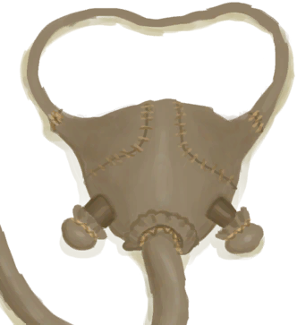
[Gas Mask(BluePrint)](Bp_GasMask.md)](Bp_GasMask.md)</td><td  style="text-align:left;vertical-align:top;"  >Craft BluePrint</td><td  style="text-align:left;vertical-align:top;"  >2</td></tr><tr ><td  style="text-align:left;vertical-align:top;"  >[

[Leather Gloves(BluePrint)](Bp_LeatherGloves.md)](Bp_LeatherGloves.md)</td><td  style="text-align:left;vertical-align:top;"  >Craft BluePrint</td><td  style="text-align:left;vertical-align:top;"  >2</td></tr><tr ><td  style="text-align:left;vertical-align:top;"  >[

[Leather Shoes(BluePrint)](Bp_LeatherShoes.md)](Bp_LeatherShoes.md)</td><td  style="text-align:left;vertical-align:top;"  >Craft BluePrint</td><td  style="text-align:left;vertical-align:top;"  >2</td></tr><tr ><td  style="text-align:left;vertical-align:top;"  >[
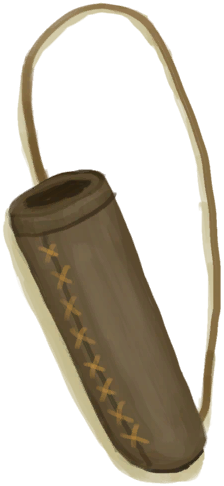
[Quiver(BluePrint)](Bp_Quiver.md)](Bp_Quiver.md)</td><td  style="text-align:left;vertical-align:top;"  >Craft BluePrint</td><td  style="text-align:left;vertical-align:top;"  >2</td></tr><tr ><td  style="text-align:left;vertical-align:top;"  >[
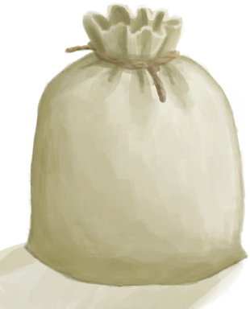
[Sack(BluePrint)](Bp_Sack.md)](Bp_Sack.md)</td><td  style="text-align:left;vertical-align:top;"  >Craft BluePrint</td><td  style="text-align:left;vertical-align:top;"  >2</td></tr><tr ><td  style="text-align:left;vertical-align:top;"  >[

[Satchel(BluePrint)](Bp_Satchel.md)](Bp_Satchel.md)</td><td  style="text-align:left;vertical-align:top;"  >Craft BluePrint</td><td  style="text-align:left;vertical-align:top;"  >2</td></tr><tr ><td  style="text-align:left;vertical-align:top;"  >[

[Waterskin(BluePrint)](Bp_Waterskin.md)](Bp_Waterskin.md)</td><td  style="text-align:left;vertical-align:top;"  >Craft BluePrint</td><td  style="text-align:left;vertical-align:top;"  >2</td></tr><tr ><td  style="text-align:left;vertical-align:top;"  >[

[Sling(BluePrint)](Bp_Sling.md)](Bp_Sling.md)</td><td  style="text-align:left;vertical-align:top;"  >Craft BluePrint</td><td  style="text-align:left;vertical-align:top;"  >1</td></tr><tr ><td  style="text-align:left;vertical-align:top;"  >[
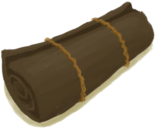
[Bedroll(BluePrint)](Bp_Bedroll.md)](Bp_Bedroll.md)</td><td  style="text-align:left;vertical-align:top;"  >Craft BluePrint</td><td  style="text-align:left;vertical-align:top;"  >1</td></tr><tr ><td  style="text-align:left;vertical-align:top;"  >[
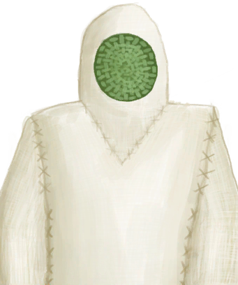
[Bee Suit(BluePrint)](Bp_BeeSuit.md)](Bp_BeeSuit.md)</td><td  style="text-align:left;vertical-align:top;"  >Craft BluePrint</td><td  style="text-align:left;vertical-align:top;"  >1</td></tr><tr ><td  style="text-align:left;vertical-align:top;"  >[

[Bellows(BluePrint)](Bp_Bellows.md)](Bp_Bellows.md)</td><td  style="text-align:left;vertical-align:top;"  >Craft BluePrint</td><td  style="text-align:left;vertical-align:top;"  >1</td></tr><tr ><td  style="text-align:left;vertical-align:top;"  >[
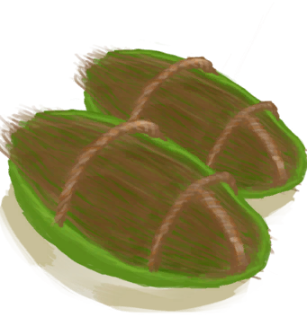
[Coconut Sandals(BluePrint)](Bp_CoconutSandals.md)](Bp_CoconutSandals.md)</td><td  style="text-align:left;vertical-align:top;"  >Craft BluePrint</td><td  style="text-align:left;vertical-align:top;"  >1</td></tr><tr ><td  style="text-align:left;vertical-align:top;"  >[

[Hammock(BluePrint)](Bp_Hammock.md)](Bp_Hammock.md)</td><td  style="text-align:left;vertical-align:top;"  >Craft BluePrint</td><td  style="text-align:left;vertical-align:top;"  >1</td></tr><tr ><td  style="text-align:left;vertical-align:top;"  >[
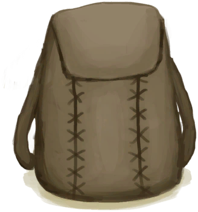
[Leather Backpack(BluePrint)](Bp_LeatherBackpack.md)](Bp_LeatherBackpack.md)</td><td  style="text-align:left;vertical-align:top;"  >Craft BluePrint</td><td  style="text-align:left;vertical-align:top;"  >1</td></tr><tr ><td  style="text-align:left;vertical-align:top;"  >[
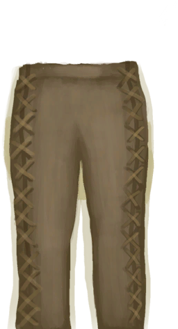
[Leather Pants(BluePrint)](Bp_LeatherPants.md)](Bp_LeatherPants.md)</td><td  style="text-align:left;vertical-align:top;"  >Craft BluePrint</td><td  style="text-align:left;vertical-align:top;"  >1</td></tr><tr ><td  style="text-align:left;vertical-align:top;"  >[

[Raincoat(BluePrint)](Bp_Raincoat.md)](Bp_Raincoat.md)</td><td  style="text-align:left;vertical-align:top;"  >Craft BluePrint</td><td  style="text-align:left;vertical-align:top;"  >1</td></tr><tr ><td  style="text-align:left;vertical-align:top;"  >[

[Shark Headpiece(BluePrint)](Bp_SharkHeadpiece.md)](Bp_SharkHeadpiece.md)</td><td  style="text-align:left;vertical-align:top;"  >Craft BluePrint</td><td  style="text-align:left;vertical-align:top;"  >1</td></tr><tr ><td  style="text-align:left;vertical-align:top;"  >[
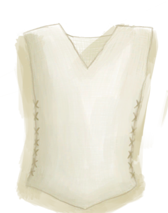
[Shirt(BluePrint)](Bp_Shirt.md)](Bp_Shirt.md)</td><td  style="text-align:left;vertical-align:top;"  >Craft BluePrint</td><td  style="text-align:left;vertical-align:top;"  >1</td></tr><tr ><td  style="text-align:left;vertical-align:top;"  >[
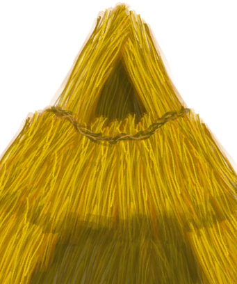
[Straw Cape(BluePrint)](Bp_StrawCape.md)](Bp_StrawCape.md)</td><td  style="text-align:left;vertical-align:top;"  >Craft BluePrint</td><td  style="text-align:left;vertical-align:top;"  >1</td></tr><tr ><td  style="text-align:left;vertical-align:top;"  >[

[Spindled Cord](SpindleFiber.md)](SpindleFiber.md)</td><td  style="text-align:left;vertical-align:top;"  >Get Cord</td><td  style="text-align:left;vertical-align:top;"  >1</td></tr><tr ><td  style="text-align:left;vertical-align:top;"  >[

[Spindled Cord](SpindleFiber.md)](SpindleFiber.md)</td><td  style="text-align:left;vertical-align:top;"  >Get Yarn</td><td  style="text-align:left;vertical-align:top;"  >1</td></tr><tr ><td  style="text-align:left;vertical-align:top;"  >[
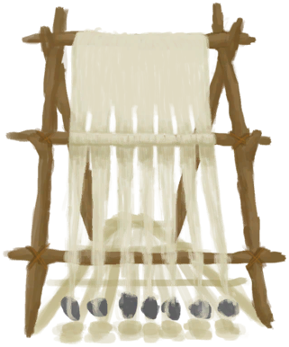
[Loom](Loom.md)](Loom.md)</td><td  style="text-align:left;vertical-align:top;"  >Make Cloth</td><td  style="text-align:left;vertical-align:top;"  >0.5</td></tr><tr ><td  style="text-align:left;vertical-align:top;"  >[

[Loom](Loom.md)](Loom.md)</td><td  style="text-align:left;vertical-align:top;"  >Enlarge Cloth ** With：**[Small Cloth](ClothSmall.md)</td><td  style="text-align:left;vertical-align:top;"  >0.5</td></tr><tr ><td  style="text-align:left;vertical-align:top;"  >[

[Loom](Loom.md)](Loom.md)</td><td  style="text-align:left;vertical-align:top;"  >Enlarge Cloth ** With：**[Cloth](Cloth.md)</td><td  style="text-align:left;vertical-align:top;"  >0.5</td></tr><tr ><td  style="text-align:left;vertical-align:top;"  >[

[Loom](Loom.md)](Loom.md)</td><td  style="text-align:left;vertical-align:top;"  >Enlarge Cloth ** With：**[Large Cloth](ClothLarge.md)</td><td  style="text-align:left;vertical-align:top;"  >0.5</td></tr><tr ><td  style="text-align:left;vertical-align:top;"  >[

[Loom (Empty)(Empty)](LoomEmpty.md)](LoomEmpty.md)</td><td  style="text-align:left;vertical-align:top;"  >Place thread on Loom ** With：**[Yarn](YarnFiber.md)</td><td  style="text-align:left;vertical-align:top;"  >0.5</td></tr><tr ><td  style="text-align:left;vertical-align:top;"  >[

[Loom (Empty)(Empty)](LoomEmpty.md)](LoomEmpty.md)</td><td  style="text-align:left;vertical-align:top;"  >Unweave Cloth ** With：**[Small Cloth](ClothSmall.md)</td><td  style="text-align:left;vertical-align:top;"  >0.5</td></tr><tr ><td  style="text-align:left;vertical-align:top;"  >[

[Loom (Empty)(Empty)](LoomEmpty.md)](LoomEmpty.md)</td><td  style="text-align:left;vertical-align:top;"  >Unweave Cloth ** With：**[Cloth](Cloth.md)</td><td  style="text-align:left;vertical-align:top;"  >0.5</td></tr><tr ><td  style="text-align:left;vertical-align:top;"  >[

[Loom (Empty)(Empty)](LoomEmpty.md)](LoomEmpty.md)</td><td  style="text-align:left;vertical-align:top;"  >Unweave Cloth ** With：**[Large Cloth](ClothLarge.md)</td><td  style="text-align:left;vertical-align:top;"  >0.5</td></tr><tr ><td  style="text-align:left;vertical-align:top;"  >[
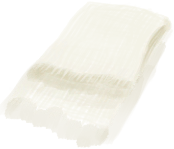
[Cloth](Cloth.md)](Cloth.md)</td><td  style="text-align:left;vertical-align:top;"  >Craft Bandage</td><td  style="text-align:left;vertical-align:top;"  >0.5</td></tr><tr ><td  style="text-align:left;vertical-align:top;"  >[

[Cloth](Cloth.md)](Cloth.md)</td><td  style="text-align:left;vertical-align:top;"  >Craft Foot Wrappings</td><td  style="text-align:left;vertical-align:top;"  >0.5</td></tr><tr ><td  style="text-align:left;vertical-align:top;"  >[

[Cloth](Cloth.md)](Cloth.md)</td><td  style="text-align:left;vertical-align:top;"  >Craft Hand Wrappings</td><td  style="text-align:left;vertical-align:top;"  >0.5</td></tr><tr ><td  style="text-align:left;vertical-align:top;"  >[

[Fiber Cord](CordFiber.md)](CordFiber.md)</td><td  style="text-align:left;vertical-align:top;"  >Make Yarn ** With：**[Fiber Cord](CordFiber.md)</td><td  style="text-align:left;vertical-align:top;"  >0.5</td></tr><tr ><td  style="text-align:left;vertical-align:top;"  >[

[Fibers](Fibers.md)](Fibers.md)</td><td  style="text-align:left;vertical-align:top;"  >Cord ** With：**[Fibers](Fibers.md)</td><td  style="text-align:left;vertical-align:top;"  >0.5</td></tr><tr ><td  style="text-align:left;vertical-align:top;"  >[
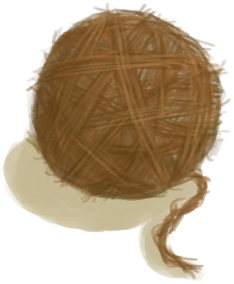
[Yarn](YarnFiber.md)](YarnFiber.md)</td><td  style="text-align:left;vertical-align:top;"  >Make rope ** With：**[Yarn](YarnFiber.md)</td><td  style="text-align:left;vertical-align:top;"  >0.25</td></tr></tbody></table>  
  
## Required By  
<table class="table table-bordered" data-toggle="table"  ><thead style=""><tr ><th  style="text-align:left;vertical-align:top;"  >From</th><th  style="text-align:left;vertical-align:top;"  >Operation</th><th  style="text-align:left;vertical-align:top;"  data-sortable="true"  >Value</th></tr></thead><tr ><td  style="text-align:left;vertical-align:top;"  >[Tailoring Improved!(Event)](Event_SkillTailoring4.md)</td><td  style="text-align:left;vertical-align:top;"  >Event</td><td  style="text-align:left;vertical-align:top;"  >150</td></tr><tr ><td  style="text-align:left;vertical-align:top;"  >[Tailoring Improved!(Event)](Event_SkillTailoring3.md)</td><td  style="text-align:left;vertical-align:top;"  >Event</td><td  style="text-align:left;vertical-align:top;"  >70 ~ 150</td></tr><tr ><td  style="text-align:left;vertical-align:top;"  >[Tailoring Improved!(Event)](Event_SkillTailoring2.md)</td><td  style="text-align:left;vertical-align:top;"  >Event</td><td  style="text-align:left;vertical-align:top;"  >30 ~ 150</td></tr><tr ><td  style="text-align:left;vertical-align:top;"  >[Tailoring Improved!(Event)](Event_SkillTailoring1.md)</td><td  style="text-align:left;vertical-align:top;"  >Event</td><td  style="text-align:left;vertical-align:top;"  >10 ~ 150</td></tr></tbody></table>  
  

