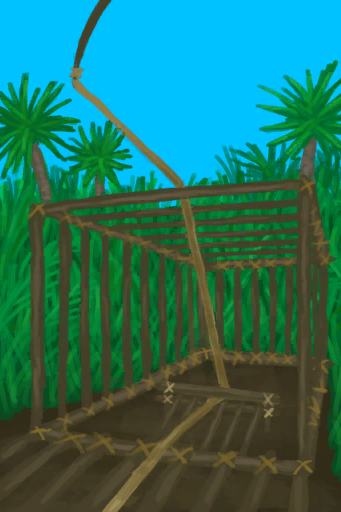
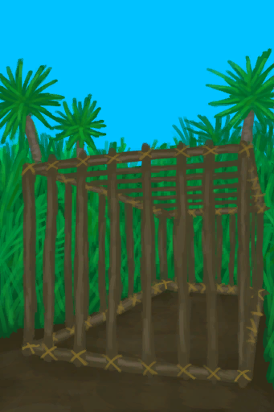
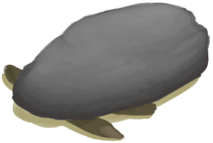
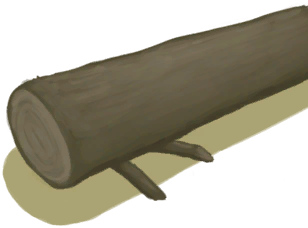
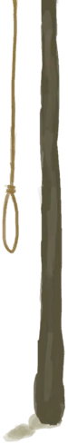
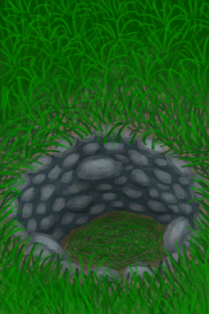
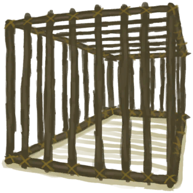
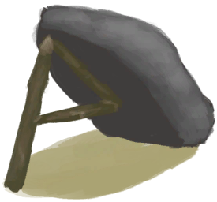
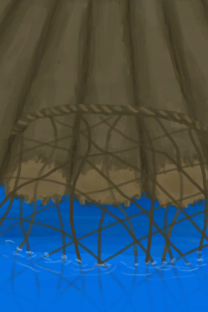
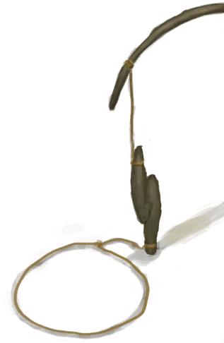

# Trapping(Skill)  
> Shows how good you are at trapping. Increases your success chances with traps and unlocks new blueprints as it gets higher.  
> "Your trapping skill determines which trap blueprints are at your disposal as well as your <b>Chances</b> of actually catching prey.  Most traps need <b>Bait</b> to work. Make sure you use the appropriate bait for the <b>Animal</b> you're trying to catch.   Do not change <b>Bait</b> unless you really think it's necessary  
  

<b>Base Value: </b> 0 
  

<b>Value Range: </b> 0 ~ 150 
  

<b>Base Rate: </b> - 
  

<b>Staleness: </b>Staleness multiplier 80% in 3h(stack:2) 
  
## Change By  
<table class="table table-bordered" data-toggle="table"  ><thead style=""><tr ><th  style="text-align:left;vertical-align:top;"  >From</th><th  style="text-align:left;vertical-align:top;"  >Operation</th><th  style="text-align:left;vertical-align:top;"  data-sortable="true"  >Value</th></tr></thead><tr ><td  style="text-align:left;vertical-align:top;"  >[

[Cage Trap](CageTrapPlaced.md)](CageTrapPlaced.md)</td><td  style="text-align:left;vertical-align:top;"  >Trap Triggered</td><td  style="text-align:left;vertical-align:top;"  >0.5</td></tr><tr ><td  style="text-align:left;vertical-align:top;"  >[

[Disarmed Cage Trap](CageTrapPlacedTriggered.md)](CageTrapPlacedTriggered.md)</td><td  style="text-align:left;vertical-align:top;"  >Rearm Trap</td><td  style="text-align:left;vertical-align:top;"  >0.5</td></tr><tr ><td  style="text-align:left;vertical-align:top;"  >[

[Disarmed Cage Trap](CageTrapPlacedTriggeredPartridgeFemale.md)](CageTrapPlacedTriggeredPartridgeFemale.md)</td><td  style="text-align:left;vertical-align:top;"  >Rearm Trap</td><td  style="text-align:left;vertical-align:top;"  >0.5</td></tr><tr ><td  style="text-align:left;vertical-align:top;"  >[

[Disarmed Cage Trap](CageTrapPlacedTriggeredPartridgeMale.md)](CageTrapPlacedTriggeredPartridgeMale.md)</td><td  style="text-align:left;vertical-align:top;"  >Rearm Trap</td><td  style="text-align:left;vertical-align:top;"  >0.5</td></tr><tr ><td  style="text-align:left;vertical-align:top;"  >[

[Disarmed Cage Trap](CageTrapPlacedTriggeredSeagull.md)](CageTrapPlacedTriggeredSeagull.md)</td><td  style="text-align:left;vertical-align:top;"  >Rearm Trap</td><td  style="text-align:left;vertical-align:top;"  >0.5</td></tr><tr ><td  style="text-align:left;vertical-align:top;"  >[

[Deadfall Trap](DeadfallTrapTriggered.md)](DeadfallTrapTriggered.md)</td><td  style="text-align:left;vertical-align:top;"  >Rearm Trap</td><td  style="text-align:left;vertical-align:top;"  >0.5</td></tr><tr ><td  style="text-align:left;vertical-align:top;"  >[

[Log Trap](LogTrapTriggered.md)](LogTrapTriggered.md)</td><td  style="text-align:left;vertical-align:top;"  >Rearm Trap</td><td  style="text-align:left;vertical-align:top;"  >0.5</td></tr><tr ><td  style="text-align:left;vertical-align:top;"  >[

[Snare Trap](SnareTrapTriggered.md)](SnareTrapTriggered.md)</td><td  style="text-align:left;vertical-align:top;"  >Rearm Trap</td><td  style="text-align:left;vertical-align:top;"  >0.5</td></tr><tr ><td  style="text-align:left;vertical-align:top;"  >[

[Trapping Pit](TrappingPitTriggered.md)](TrappingPitTriggered.md)</td><td  style="text-align:left;vertical-align:top;"  >Rearm Trap</td><td  style="text-align:left;vertical-align:top;"  >0.5</td></tr><tr ><td  style="text-align:left;vertical-align:top;"  >[

[Cage Trap(BluePrint)](Bp_CageTrap.md)](Bp_CageTrap.md)</td><td  style="text-align:left;vertical-align:top;"  >Craft BluePrint</td><td  style="text-align:left;vertical-align:top;"  >0.5</td></tr><tr ><td  style="text-align:left;vertical-align:top;"  >[

[Deadfall Trap(BluePrint)](Bp_DeadfallTrap.md)](Bp_DeadfallTrap.md)</td><td  style="text-align:left;vertical-align:top;"  >Craft BluePrint</td><td  style="text-align:left;vertical-align:top;"  >0.5</td></tr><tr ><td  style="text-align:left;vertical-align:top;"  >[

[Fish Trap(BluePrint)](Bp_FishTrap.md)](Bp_FishTrap.md)</td><td  style="text-align:left;vertical-align:top;"  >Craft BluePrint</td><td  style="text-align:left;vertical-align:top;"  >0.5</td></tr><tr ><td  style="text-align:left;vertical-align:top;"  >[

[Fish Trap(BluePrint)](Bp_RaftFishTrap.md)](Bp_RaftFishTrap.md)</td><td  style="text-align:left;vertical-align:top;"  >Craft BluePrint</td><td  style="text-align:left;vertical-align:top;"  >0.5</td></tr><tr ><td  style="text-align:left;vertical-align:top;"  >[

[Snare Trap(BluePrint)](Bp_SnareTrap.md)](Bp_SnareTrap.md)</td><td  style="text-align:left;vertical-align:top;"  >Craft BluePrint</td><td  style="text-align:left;vertical-align:top;"  >0.5</td></tr><tr ><td  style="text-align:left;vertical-align:top;"  >[

[Trapping Pit(BluePrint)](Bp_TrappingPit.md)](Bp_TrappingPit.md)</td><td  style="text-align:left;vertical-align:top;"  >Craft BluePrint</td><td  style="text-align:left;vertical-align:top;"  >0.5</td></tr></tbody></table>  
  
## Required By  
<table class="table table-bordered" data-toggle="table"  ><thead style=""><tr ><th  style="text-align:left;vertical-align:top;"  >From</th><th  style="text-align:left;vertical-align:top;"  >Operation</th><th  style="text-align:left;vertical-align:top;"  data-sortable="true"  >Value</th></tr></thead><tr ><td  style="text-align:left;vertical-align:top;"  >[Trapping Improved!(Event)](Event_SkillTrapping4.md)</td><td  style="text-align:left;vertical-align:top;"  >Event</td><td  style="text-align:left;vertical-align:top;"  >150</td></tr><tr ><td  style="text-align:left;vertical-align:top;"  >[Trapping Improved!(Event)](Event_SkillTrapping3.md)</td><td  style="text-align:left;vertical-align:top;"  >Event</td><td  style="text-align:left;vertical-align:top;"  >70 ~ 150</td></tr><tr ><td  style="text-align:left;vertical-align:top;"  >[Trapping Improved!(Event)](Event_SkillTrapping2.md)</td><td  style="text-align:left;vertical-align:top;"  >Event</td><td  style="text-align:left;vertical-align:top;"  >30 ~ 150</td></tr><tr ><td  style="text-align:left;vertical-align:top;"  >[Trapping Improved!(Event)](Event_SkillTrapping1.md)</td><td  style="text-align:left;vertical-align:top;"  >Event</td><td  style="text-align:left;vertical-align:top;"  >10 ~ 150</td></tr><tr ><td  style="text-align:left;vertical-align:top;"  >[Cage Trap](CageTrapPlaced.md)</td><td  style="text-align:left;vertical-align:top;"  >影响</td><td  style="text-align:left;vertical-align:top;"  >0 ~ 150</td></tr><tr ><td  style="text-align:left;vertical-align:top;"  >[Deadfall Trap](DeadfallTrap.md)</td><td  style="text-align:left;vertical-align:top;"  >影响</td><td  style="text-align:left;vertical-align:top;"  >0 ~ 150</td></tr><tr ><td  style="text-align:left;vertical-align:top;"  >[Fish Trap](FishTrapDeployed.md)</td><td  style="text-align:left;vertical-align:top;"  >影响</td><td  style="text-align:left;vertical-align:top;"  >0 ~ 150</td></tr><tr ><td  style="text-align:left;vertical-align:top;"  >[Log Trap](LogTrap.md)</td><td  style="text-align:left;vertical-align:top;"  >影响</td><td  style="text-align:left;vertical-align:top;"  >0 ~ 150</td></tr><tr ><td  style="text-align:left;vertical-align:top;"  >[Fish Trap](RaftFishTrap.md)</td><td  style="text-align:left;vertical-align:top;"  >影响</td><td  style="text-align:left;vertical-align:top;"  >0 ~ 150</td></tr><tr ><td  style="text-align:left;vertical-align:top;"  >[Snare Trap](SnareTrap.md)</td><td  style="text-align:left;vertical-align:top;"  >影响</td><td  style="text-align:left;vertical-align:top;"  >0 ~ 150</td></tr><tr ><td  style="text-align:left;vertical-align:top;"  >[Trapping Pit](TrappingPit.md)</td><td  style="text-align:left;vertical-align:top;"  >影响</td><td  style="text-align:left;vertical-align:top;"  >0 ~ 150</td></tr></tbody></table>  
  

