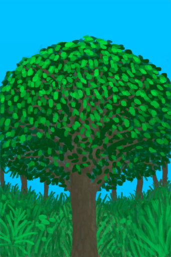
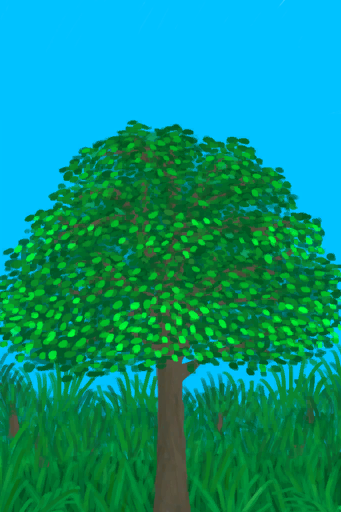
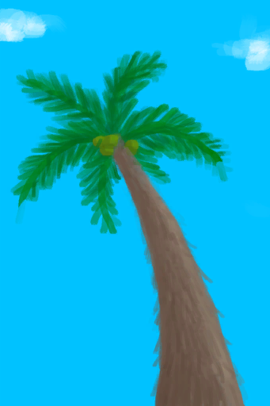

# Woodworking(Skill)  
> Shows how good you are at working with wood. Unlocks new recipes as it gets higher.  
> "This skill unlocks multiple utility  
  

<b>Base Value: </b> 0 
  

<b>Value Range: </b> 0 ~ 150 
  

<b>Base Rate: </b> - 
  

<b>Staleness: </b>Staleness multiplier 80% in 3h(stack:2) 
  
## Change By  
<table class="table table-bordered" data-toggle="table"  ><thead style=""><tr ><th  style="text-align:left;vertical-align:top;"  >From</th><th  style="text-align:left;vertical-align:top;"  >Operation</th><th  style="text-align:left;vertical-align:top;"  data-sortable="true"  >Value</th></tr></thead><tr ><td  style="text-align:left;vertical-align:top;"  >[

[Wooden Bed(BluePrint)](Bp_BedWooden.md)](Bp_BedWooden.md)</td><td  style="text-align:left;vertical-align:top;"  >Craft BluePrint</td><td  style="text-align:left;vertical-align:top;"  >2</td></tr><tr ><td  style="text-align:left;vertical-align:top;"  >[

[Boar Feeder(BluePrint)](Bp_BoarFeeder.md)](Bp_BoarFeeder.md)</td><td  style="text-align:left;vertical-align:top;"  >Craft BluePrint</td><td  style="text-align:left;vertical-align:top;"  >2</td></tr><tr ><td  style="text-align:left;vertical-align:top;"  >[

[Chair(BluePrint)](Bp_Chair.md)](Bp_Chair.md)</td><td  style="text-align:left;vertical-align:top;"  >Craft BluePrint</td><td  style="text-align:left;vertical-align:top;"  >2</td></tr><tr ><td  style="text-align:left;vertical-align:top;"  >[

[Drum(BluePrint)](Bp_Drum.md)](Bp_Drum.md)</td><td  style="text-align:left;vertical-align:top;"  >Craft BluePrint</td><td  style="text-align:left;vertical-align:top;"  >2</td></tr><tr ><td  style="text-align:left;vertical-align:top;"  >[

[Lizard Drum(BluePrint)](Bp_LizardDrum.md)](Bp_LizardDrum.md)</td><td  style="text-align:left;vertical-align:top;"  >Craft BluePrint</td><td  style="text-align:left;vertical-align:top;"  >2</td></tr><tr ><td  style="text-align:left;vertical-align:top;"  >[

[Pottery Wheel(BluePrint)](Bp_PotteryWheel.md)](Bp_PotteryWheel.md)</td><td  style="text-align:left;vertical-align:top;"  >Craft BluePrint</td><td  style="text-align:left;vertical-align:top;"  >2</td></tr><tr ><td  style="text-align:left;vertical-align:top;"  >[

[Shower(BluePrint)](Bp_Shower.md)](Bp_Shower.md)</td><td  style="text-align:left;vertical-align:top;"  >Craft BluePrint</td><td  style="text-align:left;vertical-align:top;"  >2</td></tr><tr ><td  style="text-align:left;vertical-align:top;"  >[

[Table(BluePrint)](Bp_Table.md)](Bp_Table.md)</td><td  style="text-align:left;vertical-align:top;"  >Craft BluePrint</td><td  style="text-align:left;vertical-align:top;"  >2</td></tr><tr ><td  style="text-align:left;vertical-align:top;"  >[

[Shield(BluePrint)](Bp_Shield.md)](Bp_Shield.md)</td><td  style="text-align:left;vertical-align:top;"  >Craft BluePrint</td><td  style="text-align:left;vertical-align:top;"  >1.5</td></tr><tr ><td  style="text-align:left;vertical-align:top;"  >[

[Bow(BluePrint)](Bp_Bow.md)](Bp_Bow.md)</td><td  style="text-align:left;vertical-align:top;"  >Craft BluePrint</td><td  style="text-align:left;vertical-align:top;"  >1</td></tr><tr ><td  style="text-align:left;vertical-align:top;"  >[

[Wooden Planks(BluePrint)](Bp_Planks.md)](Bp_Planks.md)</td><td  style="text-align:left;vertical-align:top;"  >Craft BluePrint</td><td  style="text-align:left;vertical-align:top;"  >1</td></tr><tr ><td  style="text-align:left;vertical-align:top;"  >[

[Wooden Shovel(BluePrint)](Bp_WoodenShovel.md)](Bp_WoodenShovel.md)</td><td  style="text-align:left;vertical-align:top;"  >Craft BluePrint</td><td  style="text-align:left;vertical-align:top;"  >1</td></tr><tr ><td  style="text-align:left;vertical-align:top;"  >[

[Unfinished Wood Carving](WoodCarving_Unfinished.md)](WoodCarving_Unfinished.md)</td><td  style="text-align:left;vertical-align:top;"  >Carve ** With：**[“Cutter Advanced”](tag_CutterAdv.md)</td><td  style="text-align:left;vertical-align:top;"  >1</td></tr><tr ><td  style="text-align:left;vertical-align:top;"  >[

[Large Tree](LargeTree.md)](LargeTree.md)</td><td  style="text-align:left;vertical-align:top;"  >Cut Tree ** With：**[Stone Axe](StoneAxe.md)</td><td  style="text-align:left;vertical-align:top;"  >1</td></tr><tr ><td  style="text-align:left;vertical-align:top;"  >[

[Large Tree](LargeTree.md)](LargeTree.md)</td><td  style="text-align:left;vertical-align:top;"  >Cut Tree ** With：**[“Hammer”](tag_AxeAdv.md)</td><td  style="text-align:left;vertical-align:top;"  >1</td></tr><tr ><td  style="text-align:left;vertical-align:top;"  >[

[Felled Large Tree](LargeTreeFelled.md)](LargeTreeFelled.md)</td><td  style="text-align:left;vertical-align:top;"  >Clean Log of braches ** With：**[Stone Axe](StoneAxe.md)</td><td  style="text-align:left;vertical-align:top;"  >1</td></tr><tr ><td  style="text-align:left;vertical-align:top;"  >[

[Felled Large Tree](LargeTreeFelled.md)](LargeTreeFelled.md)</td><td  style="text-align:left;vertical-align:top;"  >Clean Log of braches ** With：**[“Axe”](tag_Axe.md)</td><td  style="text-align:left;vertical-align:top;"  >1</td></tr><tr ><td  style="text-align:left;vertical-align:top;"  >[

[Cleared Mango Tree](MangoTreeCleared.md)](MangoTreeCleared.md)</td><td  style="text-align:left;vertical-align:top;"  >Cut Down Tree ** With：**[Stone Axe](StoneAxe.md)</td><td  style="text-align:left;vertical-align:top;"  >1</td></tr><tr ><td  style="text-align:left;vertical-align:top;"  >[

[Cleared Mango Tree](MangoTreeCleared.md)](MangoTreeCleared.md)</td><td  style="text-align:left;vertical-align:top;"  >Cut Down Tree ** With：**[“Hammer”](tag_AxeAdv.md)</td><td  style="text-align:left;vertical-align:top;"  >1</td></tr><tr ><td  style="text-align:left;vertical-align:top;"  >[

[Cleared Tropical Almond Tree](TropicalAlmondTreeCleared.md)](TropicalAlmondTreeCleared.md)</td><td  style="text-align:left;vertical-align:top;"  >Cut Down Tree ** With：**[Stone Axe](StoneAxe.md)</td><td  style="text-align:left;vertical-align:top;"  >1</td></tr><tr ><td  style="text-align:left;vertical-align:top;"  >[

[Cleared Tropical Almond Tree](TropicalAlmondTreeCleared.md)](TropicalAlmondTreeCleared.md)</td><td  style="text-align:left;vertical-align:top;"  >Cut Down Tree ** With：**[“Hammer”](tag_AxeAdv.md)</td><td  style="text-align:left;vertical-align:top;"  >1</td></tr><tr ><td  style="text-align:left;vertical-align:top;"  >[

[Felled Tropical Almond Tree](TropicalAlmondTreeFelled.md)](TropicalAlmondTreeFelled.md)(未实装)</td><td  style="text-align:left;vertical-align:top;"  >Clean Branches ** With：**[Stone Axe](StoneAxe.md)</td><td  style="text-align:left;vertical-align:top;"  >1</td></tr><tr ><td  style="text-align:left;vertical-align:top;"  >[

[Felled Tropical Almond Tree](TropicalAlmondTreeFelled.md)](TropicalAlmondTreeFelled.md)(未实装)</td><td  style="text-align:left;vertical-align:top;"  >Clean Branches ** With：**[“Axe”](tag_Axe.md)</td><td  style="text-align:left;vertical-align:top;"  >1</td></tr><tr ><td  style="text-align:left;vertical-align:top;"  >[

[Half Log](HalfLog.md)](HalfLog.md)</td><td  style="text-align:left;vertical-align:top;"  >Cut into Wood ** With：**[Stone Axe](StoneAxe.md)</td><td  style="text-align:left;vertical-align:top;"  >0.5</td></tr><tr ><td  style="text-align:left;vertical-align:top;"  >[

[Log](Log.md)](Log.md)</td><td  style="text-align:left;vertical-align:top;"  >Split into two ** With：**[Stone Axe](StoneAxe.md)</td><td  style="text-align:left;vertical-align:top;"  >0.5</td></tr><tr ><td  style="text-align:left;vertical-align:top;"  >[

[Arrows(BluePrint)](Bp_Arrow.md)](Bp_Arrow.md)</td><td  style="text-align:left;vertical-align:top;"  >Craft BluePrint</td><td  style="text-align:left;vertical-align:top;"  >0.5</td></tr><tr ><td  style="text-align:left;vertical-align:top;"  >[

[Bookshelf(BluePrint)](Bp_Bookshelf.md)](Bp_Bookshelf.md)</td><td  style="text-align:left;vertical-align:top;"  >Craft BluePrint</td><td  style="text-align:left;vertical-align:top;"  >0.5</td></tr><tr ><td  style="text-align:left;vertical-align:top;"  >[

[Bow Drill(BluePrint)](Bp_BowDrill.md)](Bp_BowDrill.md)</td><td  style="text-align:left;vertical-align:top;"  >Craft BluePrint</td><td  style="text-align:left;vertical-align:top;"  >0.5</td></tr><tr ><td  style="text-align:left;vertical-align:top;"  >[

[Wooden Eating Utensils(BluePrint)](Bp_EatingUtensilsWooden.md)](Bp_EatingUtensilsWooden.md)</td><td  style="text-align:left;vertical-align:top;"  >Craft BluePrint</td><td  style="text-align:left;vertical-align:top;"  >0.5</td></tr><tr ><td  style="text-align:left;vertical-align:top;"  >[

[Hand Drill(BluePrint)](Bp_HandDrill.md)](Bp_HandDrill.md)</td><td  style="text-align:left;vertical-align:top;"  >Craft BluePrint</td><td  style="text-align:left;vertical-align:top;"  >0.5</td></tr><tr ><td  style="text-align:left;vertical-align:top;"  >[

[Rustic Spear(BluePrint)](Bp_RusticSpear.md)](Bp_RusticSpear.md)</td><td  style="text-align:left;vertical-align:top;"  >Craft BluePrint</td><td  style="text-align:left;vertical-align:top;"  >0.5</td></tr><tr ><td  style="text-align:left;vertical-align:top;"  >[

[Shelf(BluePrint)](Bp_Shelf.md)](Bp_Shelf.md)</td><td  style="text-align:left;vertical-align:top;"  >Craft BluePrint</td><td  style="text-align:left;vertical-align:top;"  >0.5</td></tr><tr ><td  style="text-align:left;vertical-align:top;"  >[

[Treenails(BluePrint)](Bp_Treenails.md)](Bp_Treenails.md)</td><td  style="text-align:left;vertical-align:top;"  >Craft BluePrint</td><td  style="text-align:left;vertical-align:top;"  >0.5</td></tr><tr ><td  style="text-align:left;vertical-align:top;"  >[

[Wood Carvings(BluePrint)](Bp_WoodCarvings.md)](Bp_WoodCarvings.md)</td><td  style="text-align:left;vertical-align:top;"  >Craft BluePrint</td><td  style="text-align:left;vertical-align:top;"  >0.5</td></tr><tr ><td  style="text-align:left;vertical-align:top;"  >[

[Wood Shavings(BluePrint)](Bp_WoodShavings.md)](Bp_WoodShavings.md)</td><td  style="text-align:left;vertical-align:top;"  >Craft BluePrint</td><td  style="text-align:left;vertical-align:top;"  >0.5</td></tr><tr ><td  style="text-align:left;vertical-align:top;"  >[

[Wooden Needles(BluePrint)](Bp_WoodenNeedles.md)](Bp_WoodenNeedles.md)</td><td  style="text-align:left;vertical-align:top;"  >Craft BluePrint</td><td  style="text-align:left;vertical-align:top;"  >0.5</td></tr><tr ><td  style="text-align:left;vertical-align:top;"  >[

[Unfinished  Wooden Flute](FluteWooden_Unfinished.md)](FluteWooden_Unfinished.md)</td><td  style="text-align:left;vertical-align:top;"  >Carve ** With：**[“Cutter Advanced”](tag_CutterAdv.md)</td><td  style="text-align:left;vertical-align:top;"  >0.5</td></tr><tr ><td  style="text-align:left;vertical-align:top;"  >[

[Sticks](Sticks.md)](Sticks.md)</td><td  style="text-align:left;vertical-align:top;"  >Craft Hand Drill ** With：**[“Cutter”](tag_Cutter.md)</td><td  style="text-align:left;vertical-align:top;"  >0.5</td></tr><tr ><td  style="text-align:left;vertical-align:top;"  >[

[Boar Tusk](Tusk.md)](Tusk.md)</td><td  style="text-align:left;vertical-align:top;"  >Carve ** With：**[“Cutter Advanced”](tag_CutterAdv.md)</td><td  style="text-align:left;vertical-align:top;"  >0.5</td></tr><tr ><td  style="text-align:left;vertical-align:top;"  >[

[Wood](Wood.md)](Wood.md)</td><td  style="text-align:left;vertical-align:top;"  >Cut Shavings ** With：**[“Cutter Advanced”](tag_CutterAdv.md)</td><td  style="text-align:left;vertical-align:top;"  >0.5</td></tr><tr ><td  style="text-align:left;vertical-align:top;"  >[

[Deep Jungle(Jungle)](DeepJungle.md)](DeepJungle.md)</td><td  style="text-align:left;vertical-align:top;"  >Cut Wood ** With：**[“Hammer”](tag_AxeAdv.md)</td><td  style="text-align:left;vertical-align:top;"  >0.5</td></tr><tr ><td  style="text-align:left;vertical-align:top;"  >[

[Deep Jungle(Jungle)](DeepJungle.md)](DeepJungle.md)</td><td  style="text-align:left;vertical-align:top;"  >Cut Wood ** With：**[“Axe”](tag_Axe.md)</td><td  style="text-align:left;vertical-align:top;"  >0.5</td></tr><tr ><td  style="text-align:left;vertical-align:top;"  >[

[Jungle](Jungle.md)](Jungle.md)</td><td  style="text-align:left;vertical-align:top;"  >Cut Wood ** With：**[“Hammer”](tag_AxeAdv.md)</td><td  style="text-align:left;vertical-align:top;"  >0.5</td></tr><tr ><td  style="text-align:left;vertical-align:top;"  >[

[Jungle](Jungle.md)](Jungle.md)</td><td  style="text-align:left;vertical-align:top;"  >Cut Wood ** With：**[“Axe”](tag_Axe.md)</td><td  style="text-align:left;vertical-align:top;"  >0.5</td></tr><tr ><td  style="text-align:left;vertical-align:top;"  >[

[Jungle Highlands](JungleHighlands.md)](JungleHighlands.md)</td><td  style="text-align:left;vertical-align:top;"  >Cut Wood ** With：**[“Hammer”](tag_AxeAdv.md)</td><td  style="text-align:left;vertical-align:top;"  >0.5</td></tr><tr ><td  style="text-align:left;vertical-align:top;"  >[

[Jungle Highlands](JungleHighlands.md)](JungleHighlands.md)</td><td  style="text-align:left;vertical-align:top;"  >Cut Wood ** With：**[“Axe”](tag_Axe.md)</td><td  style="text-align:left;vertical-align:top;"  >0.5</td></tr><tr ><td  style="text-align:left;vertical-align:top;"  >[

[Jungle Outskirts(Outskirts)](Outskirts.md)](Outskirts.md)</td><td  style="text-align:left;vertical-align:top;"  >Cut Wood ** With：**[“Hammer”](tag_AxeAdv.md)</td><td  style="text-align:left;vertical-align:top;"  >0.5</td></tr><tr ><td  style="text-align:left;vertical-align:top;"  >[

[Jungle Outskirts(Outskirts)](Outskirts.md)](Outskirts.md)</td><td  style="text-align:left;vertical-align:top;"  >Cut Wood ** With：**[“Axe”](tag_Axe.md)</td><td  style="text-align:left;vertical-align:top;"  >0.5</td></tr><tr ><td  style="text-align:left;vertical-align:top;"  >[

[Wetland Jungle(Wetlands)](Wetlands.md)](Wetlands.md)</td><td  style="text-align:left;vertical-align:top;"  >Cut Wood ** With：**[“Hammer”](tag_AxeAdv.md)</td><td  style="text-align:left;vertical-align:top;"  >0.5</td></tr><tr ><td  style="text-align:left;vertical-align:top;"  >[

[Wetland Jungle(Wetlands)](Wetlands.md)](Wetlands.md)</td><td  style="text-align:left;vertical-align:top;"  >Cut Wood ** With：**[“Axe”](tag_Axe.md)</td><td  style="text-align:left;vertical-align:top;"  >0.5</td></tr><tr ><td  style="text-align:left;vertical-align:top;"  >[

[Cleared Palm Tree](PalmTreeCleared.md)](PalmTreeCleared.md)</td><td  style="text-align:left;vertical-align:top;"  >Cut Down ** With：**[Stone Axe](StoneAxe.md)</td><td  style="text-align:left;vertical-align:top;"  >0.5</td></tr><tr ><td  style="text-align:left;vertical-align:top;"  >[

[Cleared Palm Tree](PalmTreeCleared.md)](PalmTreeCleared.md)</td><td  style="text-align:left;vertical-align:top;"  >Cut Down ** With：**[“Hammer”](tag_AxeAdv.md)</td><td  style="text-align:left;vertical-align:top;"  >0.5</td></tr><tr ><td  style="text-align:left;vertical-align:top;"  >[

[Felled Palm Tree](PalmTreeFelled.md)](PalmTreeFelled.md)</td><td  style="text-align:left;vertical-align:top;"  >Clear ** With：**[Stone Axe](StoneAxe.md)</td><td  style="text-align:left;vertical-align:top;"  >0.5</td></tr><tr ><td  style="text-align:left;vertical-align:top;"  >[

[Felled Palm Tree](PalmTreeFelled.md)](PalmTreeFelled.md)</td><td  style="text-align:left;vertical-align:top;"  >Clear ** With：**[“Axe”](tag_Axe.md)</td><td  style="text-align:left;vertical-align:top;"  >0.5</td></tr><tr ><td  style="text-align:left;vertical-align:top;"  >[

[Palm Tree](PalmTreeNew.md)](PalmTreeNew.md)</td><td  style="text-align:left;vertical-align:top;"  >Cut Down ** With：**[Stone Axe](StoneAxe.md)</td><td  style="text-align:left;vertical-align:top;"  >0.5</td></tr><tr ><td  style="text-align:left;vertical-align:top;"  >[

[Palm Tree](PalmTreeNew.md)](PalmTreeNew.md)</td><td  style="text-align:left;vertical-align:top;"  >Cut Down ** With：**[“Hammer”](tag_AxeAdv.md)</td><td  style="text-align:left;vertical-align:top;"  >0.5</td></tr><tr ><td  style="text-align:left;vertical-align:top;"  >[

[Palm Tree](PalmTreeNewMultiEventOld.md)](PalmTreeNewMultiEventOld.md)</td><td  style="text-align:left;vertical-align:top;"  >Cut Down ** With：**[Stone Axe](StoneAxe.md)</td><td  style="text-align:left;vertical-align:top;"  >0.5</td></tr><tr ><td  style="text-align:left;vertical-align:top;"  >[

[Palm Tree](PalmTreeNewMultiEventOld.md)](PalmTreeNewMultiEventOld.md)</td><td  style="text-align:left;vertical-align:top;"  >Cut Down ** With：**[“Hammer”](tag_AxeAdv.md)</td><td  style="text-align:left;vertical-align:top;"  >0.5</td></tr><tr ><td  style="text-align:left;vertical-align:top;"  >[

[Palm Tree](PalmTreeOld.md)](PalmTreeOld.md)(未实装)</td><td  style="text-align:left;vertical-align:top;"  >Cut Down ** With：**[Stone Axe](StoneAxe.md)</td><td  style="text-align:left;vertical-align:top;"  >0.5</td></tr><tr ><td  style="text-align:left;vertical-align:top;"  >[

[Palm Tree](PalmTreeOld.md)](PalmTreeOld.md)(未实装)</td><td  style="text-align:left;vertical-align:top;"  >Cut Down ** With：**[“Hammer”](tag_AxeAdv.md)</td><td  style="text-align:left;vertical-align:top;"  >0.5</td></tr><tr ><td  style="text-align:left;vertical-align:top;"  >[

[Eastern Highlands](HighlandsEastern.md)](HighlandsEastern.md)</td><td  style="text-align:left;vertical-align:top;"  >Cut Wood ** With：**[“Hammer”](tag_AxeAdv.md)</td><td  style="text-align:left;vertical-align:top;"  >0.25</td></tr><tr ><td  style="text-align:left;vertical-align:top;"  >[

[Eastern Highlands](HighlandsEastern.md)](HighlandsEastern.md)</td><td  style="text-align:left;vertical-align:top;"  >Cut Wood ** With：**[“Axe”](tag_Axe.md)</td><td  style="text-align:left;vertical-align:top;"  >0.25</td></tr><tr ><td  style="text-align:left;vertical-align:top;"  >[

[Western Highlands](HighlandsWestern.md)](HighlandsWestern.md)</td><td  style="text-align:left;vertical-align:top;"  >Cut Wood ** With：**[“Hammer”](tag_AxeAdv.md)</td><td  style="text-align:left;vertical-align:top;"  >0.25</td></tr><tr ><td  style="text-align:left;vertical-align:top;"  >[

[Western Highlands](HighlandsWestern.md)](HighlandsWestern.md)</td><td  style="text-align:left;vertical-align:top;"  >Cut Wood ** With：**[“Axe”](tag_Axe.md)</td><td  style="text-align:left;vertical-align:top;"  >0.25</td></tr><tr ><td  style="text-align:left;vertical-align:top;"  >[

[Mangrove Forest](Mangroves.md)](Mangroves.md)</td><td  style="text-align:left;vertical-align:top;"  >Cut Wood ** With：**[“Hammer”](tag_AxeAdv.md)</td><td  style="text-align:left;vertical-align:top;"  >0.25</td></tr><tr ><td  style="text-align:left;vertical-align:top;"  >[

[Mangrove Forest](Mangroves.md)](Mangroves.md)</td><td  style="text-align:left;vertical-align:top;"  >Cut Wood ** With：**[“Axe”](tag_Axe.md)</td><td  style="text-align:left;vertical-align:top;"  >0.25</td></tr></tbody></table>  
  
## Required By  
<table class="table table-bordered" data-toggle="table"  ><thead style=""><tr ><th  style="text-align:left;vertical-align:top;"  >From</th><th  style="text-align:left;vertical-align:top;"  >Operation</th><th  style="text-align:left;vertical-align:top;"  data-sortable="true"  >Value</th></tr></thead><tr ><td  style="text-align:left;vertical-align:top;"  >[Woodworking Improved!(Event)](Event_SkillWoodworking4.md)</td><td  style="text-align:left;vertical-align:top;"  >Event</td><td  style="text-align:left;vertical-align:top;"  >150</td></tr><tr ><td  style="text-align:left;vertical-align:top;"  >[Woodworking Improved!(Event)](Event_SkillWoodworking3.md)</td><td  style="text-align:left;vertical-align:top;"  >Event</td><td  style="text-align:left;vertical-align:top;"  >70 ~ 150</td></tr><tr ><td  style="text-align:left;vertical-align:top;"  >[Unfinished  Wooden Flute](FluteWooden_Unfinished.md)</td><td  style="text-align:left;vertical-align:top;"  >影响</td><td  style="text-align:left;vertical-align:top;"  >30 ~ 150</td></tr><tr ><td  style="text-align:left;vertical-align:top;"  >[Woodworking Improved!(Event)](Event_SkillWoodworking2.md)</td><td  style="text-align:left;vertical-align:top;"  >Event</td><td  style="text-align:left;vertical-align:top;"  >30 ~ 150</td></tr><tr ><td  style="text-align:left;vertical-align:top;"  >[Woodworking Improved!(Event)](Event_SkillWoodworking1.md)</td><td  style="text-align:left;vertical-align:top;"  >Event</td><td  style="text-align:left;vertical-align:top;"  >10 ~ 150</td></tr><tr ><td  style="text-align:left;vertical-align:top;"  >[Boar Tusk](Tusk.md)</td><td  style="text-align:left;vertical-align:top;"  >影响</td><td  style="text-align:left;vertical-align:top;"  >1 ~ 150</td></tr><tr ><td  style="text-align:left;vertical-align:top;"  >[Unfinished Wood Carving](WoodCarving_Unfinished.md)</td><td  style="text-align:left;vertical-align:top;"  >影响</td><td  style="text-align:left;vertical-align:top;"  >1 ~ 150</td></tr></tbody></table>  
  

