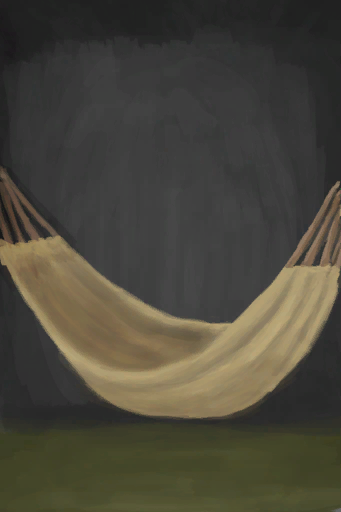

# Sleep Clock  
  

<b>Base Value: </b> 0 
  

<b>Value Range: </b> 0 ~ 999 
  

<b>Base Rate: </b> -1 / /TP 
  
## Statuses  

<table><tr style="height:2em;"><td style="background-color:#F0F0F0;text-align:center;width:180px;font-size:1.4em;font-weight:bold;vertical-align:middle;">
1 ～ 999

0% ～ 100%
</td><td colspan=2 style="font-size:1.1em;vertical-align:middle;background-color:#F9F9F9;">
<b></b>

</td></tr><tr><td colspan=2><b>Effect：</b>[

[Temperature](TemperaturePerceived.md)](TemperaturePerceived.md)<b>-2</b></td></tr><tr><td colspan=2></td></tr></table>
  
## Change By  
<table class="table table-bordered" data-toggle="table"  ><thead style=""><tr ><th  style="text-align:left;vertical-align:top;"  >From</th><th  style="text-align:left;vertical-align:top;"  >Operation</th><th  style="text-align:left;vertical-align:top;"  data-sortable="true"  >Value</th></tr></thead><tr ><td  style="text-align:left;vertical-align:top;"  >[

[Bedroll](BedRoll.md)](BedRoll.md)</td><td  style="text-align:left;vertical-align:top;"  >Sleep</td><td  style="text-align:left;vertical-align:top;"  >31</td></tr><tr ><td  style="text-align:left;vertical-align:top;"  >[

[Rustic Bed](BedRustic.md)](BedRustic.md)</td><td  style="text-align:left;vertical-align:top;"  >Sleep</td><td  style="text-align:left;vertical-align:top;"  >31</td></tr><tr ><td  style="text-align:left;vertical-align:top;"  >[

[Wooden Bed](BedWooden.md)](BedWooden.md)</td><td  style="text-align:left;vertical-align:top;"  >Sleep</td><td  style="text-align:left;vertical-align:top;"  >31</td></tr><tr ><td  style="text-align:left;vertical-align:top;"  >[

[Hammock](Hammock.md)](Hammock.md)</td><td  style="text-align:left;vertical-align:top;"  >Sleep</td><td  style="text-align:left;vertical-align:top;"  >31</td></tr><tr ><td  style="text-align:left;vertical-align:top;"  >[

[Leaf Bed](LeafBed.md)](LeafBed.md)</td><td  style="text-align:left;vertical-align:top;"  >Sleep</td><td  style="text-align:left;vertical-align:top;"  >31</td></tr><tr ><td  style="text-align:left;vertical-align:top;"  >[

[Mermaid nest](MermaidNest.md)](MermaidNest.md)</td><td  style="text-align:left;vertical-align:top;"  >Sleep</td><td  style="text-align:left;vertical-align:top;"  >31</td></tr><tr ><td  style="text-align:left;vertical-align:top;"  >[

[Shelter](Shelter.md)](Shelter.md)</td><td  style="text-align:left;vertical-align:top;"  >Sleep</td><td  style="text-align:left;vertical-align:top;"  >31</td></tr><tr ><td  style="text-align:left;vertical-align:top;"  >[

[Sheltered Leaf Bed](ShelteredLeafBed.md)](ShelteredLeafBed.md)</td><td  style="text-align:left;vertical-align:top;"  >Sleep</td><td  style="text-align:left;vertical-align:top;"  >31</td></tr><tr ><td  style="text-align:left;vertical-align:top;"  >[

[Tent](TentDeployed.md)](TentDeployed.md)</td><td  style="text-align:left;vertical-align:top;"  >Sleep</td><td  style="text-align:left;vertical-align:top;"  >31</td></tr><tr ><td  style="text-align:left;vertical-align:top;"  >[

[Raft Shelter](RaftShelter.md)](RaftShelter.md)</td><td  style="text-align:left;vertical-align:top;"  >Sleep</td><td  style="text-align:left;vertical-align:top;"  >31</td></tr><tr ><td  style="text-align:left;vertical-align:top;"  >[

[Bedroll](BedRoll.md)](BedRoll.md)</td><td  style="text-align:left;vertical-align:top;"  >Nap</td><td  style="text-align:left;vertical-align:top;"  >15</td></tr><tr ><td  style="text-align:left;vertical-align:top;"  >[

[Rustic Bed](BedRustic.md)](BedRustic.md)</td><td  style="text-align:left;vertical-align:top;"  >Nap</td><td  style="text-align:left;vertical-align:top;"  >15</td></tr><tr ><td  style="text-align:left;vertical-align:top;"  >[

[Wooden Bed](BedWooden.md)](BedWooden.md)</td><td  style="text-align:left;vertical-align:top;"  >Nap</td><td  style="text-align:left;vertical-align:top;"  >15</td></tr><tr ><td  style="text-align:left;vertical-align:top;"  >[

[Hammock](Hammock.md)](Hammock.md)</td><td  style="text-align:left;vertical-align:top;"  >Nap</td><td  style="text-align:left;vertical-align:top;"  >15</td></tr><tr ><td  style="text-align:left;vertical-align:top;"  >[

[Leaf Bed](LeafBed.md)](LeafBed.md)</td><td  style="text-align:left;vertical-align:top;"  >Nap</td><td  style="text-align:left;vertical-align:top;"  >15</td></tr><tr ><td  style="text-align:left;vertical-align:top;"  >[

[Mermaid nest](MermaidNest.md)](MermaidNest.md)</td><td  style="text-align:left;vertical-align:top;"  >Nap</td><td  style="text-align:left;vertical-align:top;"  >15</td></tr><tr ><td  style="text-align:left;vertical-align:top;"  >[

[Shelter](Shelter.md)](Shelter.md)</td><td  style="text-align:left;vertical-align:top;"  >Nap</td><td  style="text-align:left;vertical-align:top;"  >15</td></tr><tr ><td  style="text-align:left;vertical-align:top;"  >[

[Sheltered Leaf Bed](ShelteredLeafBed.md)](ShelteredLeafBed.md)</td><td  style="text-align:left;vertical-align:top;"  >Nap</td><td  style="text-align:left;vertical-align:top;"  >15</td></tr><tr ><td  style="text-align:left;vertical-align:top;"  >[

[Tent](TentDeployed.md)](TentDeployed.md)</td><td  style="text-align:left;vertical-align:top;"  >Nap</td><td  style="text-align:left;vertical-align:top;"  >15</td></tr><tr ><td  style="text-align:left;vertical-align:top;"  >[

[You fell asleep!(Event)](Event_FallingAsleep.md)](Event_FallingAsleep.md)</td><td  style="text-align:left;vertical-align:top;"  >Zzz...</td><td  style="text-align:left;vertical-align:top;"  >15</td></tr><tr ><td  style="text-align:left;vertical-align:top;"  >[

[Raft Shelter](RaftShelter.md)](RaftShelter.md)</td><td  style="text-align:left;vertical-align:top;"  >Nap</td><td  style="text-align:left;vertical-align:top;"  >15</td></tr><tr ><td  style="text-align:left;vertical-align:top;"  >[

[Nightmare!(Event)](Event_Nightmare.md)](Event_Nightmare.md)</td><td  style="text-align:left;vertical-align:top;"  >Try to calm down...</td><td  style="text-align:left;vertical-align:top;"  >-999</td></tr><tr ><td  style="text-align:left;vertical-align:top;"  >[

[A Spider bit me!(Event)](Event_SpiderNight.md)](Event_SpiderNight.md)</td><td  style="text-align:left;vertical-align:top;"  >Push Spider away!</td><td  style="text-align:left;vertical-align:top;"  >-999</td></tr></tbody></table>  
  
## Required By  
<table class="table table-bordered" data-toggle="table"  ><thead style=""><tr ><th  style="text-align:left;vertical-align:top;"  >From</th><th  style="text-align:left;vertical-align:top;"  >Operation</th><th  style="text-align:left;vertical-align:top;"  data-sortable="true"  >Value</th></tr></thead><tr ><td  style="text-align:left;vertical-align:top;"  >[Captain(Special1a)(Event)](Event_CaptainSpecial1a.md)</td><td  style="text-align:left;vertical-align:top;"  >Event</td><td  style="text-align:left;vertical-align:top;"  >1 ~ 999</td></tr><tr ><td  style="text-align:left;vertical-align:top;"  >[Nightmare!(Event)](Event_Nightmare.md)</td><td  style="text-align:left;vertical-align:top;"  >Event</td><td  style="text-align:left;vertical-align:top;"  >1 ~ 14</td></tr><tr ><td  style="text-align:left;vertical-align:top;"  >[Weston(Special1a)(Event)](Event_WestonSpecial1a.md)</td><td  style="text-align:left;vertical-align:top;"  >Event</td><td  style="text-align:left;vertical-align:top;"  >1 ~ 999</td></tr></tbody></table>  
  

