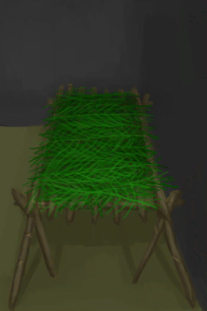
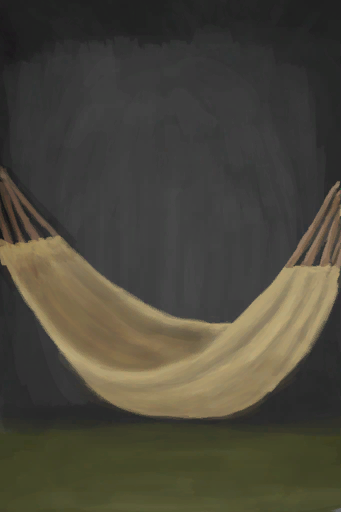
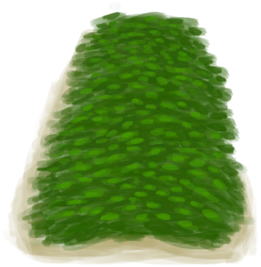
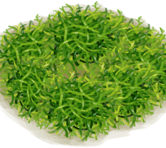
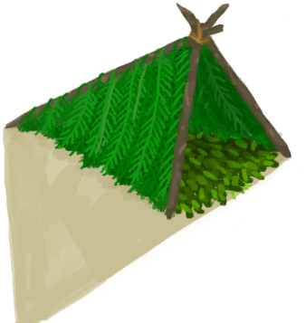
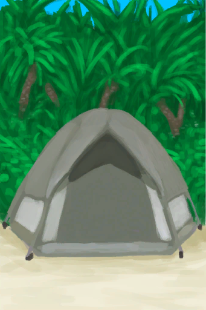
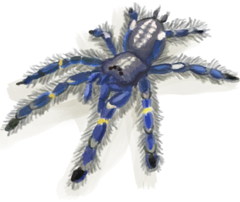
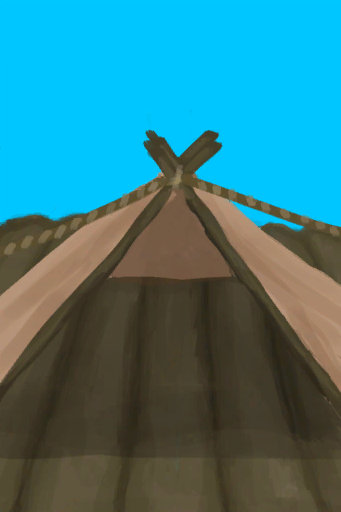

# Sleep Interrupt  
  

<b>Base Value: </b> 0 
  

<b>Value Range: </b> 0 ~ 1 
  

<b>Base Rate: </b> - 
  
## Change By  
<table class="table table-bordered" data-toggle="table"  ><thead style=""><tr ><th  style="text-align:left;vertical-align:top;"  >From</th><th  style="text-align:left;vertical-align:top;"  >Operation</th><th  style="text-align:left;vertical-align:top;"  data-sortable="true"  >Value</th></tr></thead><tr ><td  style="text-align:left;vertical-align:top;"  >[

[The wind is too strong!(Event)](Event_Flood.md)](Event_Flood.md)(未实装)</td><td  style="text-align:left;vertical-align:top;"  >Take Shelter</td><td  style="text-align:left;vertical-align:top;"  >1</td></tr><tr ><td  style="text-align:left;vertical-align:top;"  >[

[The wind is too strong!(Event)](Event_Storm.md)](Event_Storm.md)</td><td  style="text-align:left;vertical-align:top;"  >Take Shelter</td><td  style="text-align:left;vertical-align:top;"  >1</td></tr><tr ><td  style="text-align:left;vertical-align:top;"  >[

[Ship Incoming!(Event)](Event_ShipRescueDistance.md)](Event_ShipRescueDistance.md)</td><td  style="text-align:left;vertical-align:top;"  >Event</td><td  style="text-align:left;vertical-align:top;"  >1</td></tr><tr ><td  style="text-align:left;vertical-align:top;"  >[

[Captain(Special1a)(Event)](Event_CaptainSpecial1a.md)](Event_CaptainSpecial1a.md)</td><td  style="text-align:left;vertical-align:top;"  >Event</td><td  style="text-align:left;vertical-align:top;"  >1</td></tr><tr ><td  style="text-align:left;vertical-align:top;"  >[

[The Hunter is here(Event)](Event_HunterFight.md)](Event_HunterFight.md)</td><td  style="text-align:left;vertical-align:top;"  >Event</td><td  style="text-align:left;vertical-align:top;"  >1</td></tr><tr ><td  style="text-align:left;vertical-align:top;"  >[

[Nightmare!(Event)](Event_Nightmare.md)](Event_Nightmare.md)</td><td  style="text-align:left;vertical-align:top;"  >Event</td><td  style="text-align:left;vertical-align:top;"  >1</td></tr><tr ><td  style="text-align:left;vertical-align:top;"  >[

[Watcher(Event)](Event_WatchedExperience1a.md)](Event_WatchedExperience1a.md)</td><td  style="text-align:left;vertical-align:top;"  >Event</td><td  style="text-align:left;vertical-align:top;"  >1</td></tr><tr ><td  style="text-align:left;vertical-align:top;"  >[

[Weston(Special1a)(Event)](Event_WestonSpecial1a.md)](Event_WestonSpecial1a.md)</td><td  style="text-align:left;vertical-align:top;"  >Event</td><td  style="text-align:left;vertical-align:top;"  >1</td></tr><tr ><td  style="text-align:left;vertical-align:top;"  >[

[Bedroll](BedRoll.md)](BedRoll.md)</td><td  style="text-align:left;vertical-align:top;"  >Nap</td><td  style="text-align:left;vertical-align:top;"  >-1</td></tr><tr ><td  style="text-align:left;vertical-align:top;"  >[

[Bedroll](BedRoll.md)](BedRoll.md)</td><td  style="text-align:left;vertical-align:top;"  >Sleep</td><td  style="text-align:left;vertical-align:top;"  >-1</td></tr><tr ><td  style="text-align:left;vertical-align:top;"  >[

[Rustic Bed](BedRustic.md)](BedRustic.md)</td><td  style="text-align:left;vertical-align:top;"  >Nap</td><td  style="text-align:left;vertical-align:top;"  >-1</td></tr><tr ><td  style="text-align:left;vertical-align:top;"  >[

[Rustic Bed](BedRustic.md)](BedRustic.md)</td><td  style="text-align:left;vertical-align:top;"  >Sleep</td><td  style="text-align:left;vertical-align:top;"  >-1</td></tr><tr ><td  style="text-align:left;vertical-align:top;"  >[

[Wooden Bed](BedWooden.md)](BedWooden.md)</td><td  style="text-align:left;vertical-align:top;"  >Nap</td><td  style="text-align:left;vertical-align:top;"  >-1</td></tr><tr ><td  style="text-align:left;vertical-align:top;"  >[

[Wooden Bed](BedWooden.md)](BedWooden.md)</td><td  style="text-align:left;vertical-align:top;"  >Sleep</td><td  style="text-align:left;vertical-align:top;"  >-1</td></tr><tr ><td  style="text-align:left;vertical-align:top;"  >[

[Hammock](Hammock.md)](Hammock.md)</td><td  style="text-align:left;vertical-align:top;"  >Nap</td><td  style="text-align:left;vertical-align:top;"  >-1</td></tr><tr ><td  style="text-align:left;vertical-align:top;"  >[

[Hammock](Hammock.md)](Hammock.md)</td><td  style="text-align:left;vertical-align:top;"  >Sleep</td><td  style="text-align:left;vertical-align:top;"  >-1</td></tr><tr ><td  style="text-align:left;vertical-align:top;"  >[

[Leaf Bed](LeafBed.md)](LeafBed.md)</td><td  style="text-align:left;vertical-align:top;"  >Nap</td><td  style="text-align:left;vertical-align:top;"  >-1</td></tr><tr ><td  style="text-align:left;vertical-align:top;"  >[

[Leaf Bed](LeafBed.md)](LeafBed.md)</td><td  style="text-align:left;vertical-align:top;"  >Sleep</td><td  style="text-align:left;vertical-align:top;"  >-1</td></tr><tr ><td  style="text-align:left;vertical-align:top;"  >[

[Mermaid nest](MermaidNest.md)](MermaidNest.md)</td><td  style="text-align:left;vertical-align:top;"  >Nap</td><td  style="text-align:left;vertical-align:top;"  >-1</td></tr><tr ><td  style="text-align:left;vertical-align:top;"  >[

[Mermaid nest](MermaidNest.md)](MermaidNest.md)</td><td  style="text-align:left;vertical-align:top;"  >Sleep</td><td  style="text-align:left;vertical-align:top;"  >-1</td></tr><tr ><td  style="text-align:left;vertical-align:top;"  >[

[Shelter](Shelter.md)](Shelter.md)</td><td  style="text-align:left;vertical-align:top;"  >Nap</td><td  style="text-align:left;vertical-align:top;"  >-1</td></tr><tr ><td  style="text-align:left;vertical-align:top;"  >[

[Shelter](Shelter.md)](Shelter.md)</td><td  style="text-align:left;vertical-align:top;"  >Sleep</td><td  style="text-align:left;vertical-align:top;"  >-1</td></tr><tr ><td  style="text-align:left;vertical-align:top;"  >[

[Sheltered Leaf Bed](ShelteredLeafBed.md)](ShelteredLeafBed.md)</td><td  style="text-align:left;vertical-align:top;"  >Nap</td><td  style="text-align:left;vertical-align:top;"  >-1</td></tr><tr ><td  style="text-align:left;vertical-align:top;"  >[

[Sheltered Leaf Bed](ShelteredLeafBed.md)](ShelteredLeafBed.md)</td><td  style="text-align:left;vertical-align:top;"  >Sleep</td><td  style="text-align:left;vertical-align:top;"  >-1</td></tr><tr ><td  style="text-align:left;vertical-align:top;"  >[

[Tent](TentDeployed.md)](TentDeployed.md)</td><td  style="text-align:left;vertical-align:top;"  >Nap</td><td  style="text-align:left;vertical-align:top;"  >-1</td></tr><tr ><td  style="text-align:left;vertical-align:top;"  >[

[Tent](TentDeployed.md)](TentDeployed.md)</td><td  style="text-align:left;vertical-align:top;"  >Sleep</td><td  style="text-align:left;vertical-align:top;"  >-1</td></tr><tr ><td  style="text-align:left;vertical-align:top;"  >[

[Captain(Special1a)(Event)](Event_CaptainSpecial1a.md)](Event_CaptainSpecial1a.md)</td><td  style="text-align:left;vertical-align:top;"  >What?? Now??</td><td  style="text-align:left;vertical-align:top;"  >-1</td></tr><tr ><td  style="text-align:left;vertical-align:top;"  >[

[You fell asleep!(Event)](Event_FallingAsleep.md)](Event_FallingAsleep.md)</td><td  style="text-align:left;vertical-align:top;"  >Zzz...</td><td  style="text-align:left;vertical-align:top;"  >-1</td></tr><tr ><td  style="text-align:left;vertical-align:top;"  >[

[Nightmare!(Event)](Event_Nightmare.md)](Event_Nightmare.md)</td><td  style="text-align:left;vertical-align:top;"  >Try to calm down...</td><td  style="text-align:left;vertical-align:top;"  >-1</td></tr><tr ><td  style="text-align:left;vertical-align:top;"  >[

[A Spider bit me!(Event)](Event_SpiderNight.md)](Event_SpiderNight.md)</td><td  style="text-align:left;vertical-align:top;"  >Push Spider away!</td><td  style="text-align:left;vertical-align:top;"  >-1</td></tr><tr ><td  style="text-align:left;vertical-align:top;"  >[

[Weston(Special1a)(Event)](Event_WestonSpecial1a.md)](Event_WestonSpecial1a.md)</td><td  style="text-align:left;vertical-align:top;"  >Well... I am now.</td><td  style="text-align:left;vertical-align:top;"  >-1</td></tr><tr ><td  style="text-align:left;vertical-align:top;"  >[

[Raft Shelter](RaftShelter.md)](RaftShelter.md)</td><td  style="text-align:left;vertical-align:top;"  >Nap</td><td  style="text-align:left;vertical-align:top;"  >-1</td></tr><tr ><td  style="text-align:left;vertical-align:top;"  >[

[Raft Shelter](RaftShelter.md)](RaftShelter.md)</td><td  style="text-align:left;vertical-align:top;"  >Sleep</td><td  style="text-align:left;vertical-align:top;"  >-1</td></tr></tbody></table>  
  
## Required By  
<table class="table table-bordered" data-toggle="table"  ><thead style=""><tr ><th  style="text-align:left;vertical-align:top;"  >From</th><th  style="text-align:left;vertical-align:top;"  >Operation</th><th  style="text-align:left;vertical-align:top;"  data-sortable="true"  >Value</th></tr></thead><tr ><td  style="text-align:left;vertical-align:top;"  >[Bedroll](BedRoll.md)</td><td  style="text-align:left;vertical-align:top;"  >Nap</td><td  style="text-align:left;vertical-align:top;"  >1</td></tr><tr ><td  style="text-align:left;vertical-align:top;"  >[Bedroll](BedRoll.md)</td><td  style="text-align:left;vertical-align:top;"  >Sleep</td><td  style="text-align:left;vertical-align:top;"  >1</td></tr><tr ><td  style="text-align:left;vertical-align:top;"  >[Rustic Bed](BedRustic.md)</td><td  style="text-align:left;vertical-align:top;"  >Nap</td><td  style="text-align:left;vertical-align:top;"  >1</td></tr><tr ><td  style="text-align:left;vertical-align:top;"  >[Rustic Bed](BedRustic.md)</td><td  style="text-align:left;vertical-align:top;"  >Sleep</td><td  style="text-align:left;vertical-align:top;"  >1</td></tr><tr ><td  style="text-align:left;vertical-align:top;"  >[Wooden Bed](BedWooden.md)</td><td  style="text-align:left;vertical-align:top;"  >Nap</td><td  style="text-align:left;vertical-align:top;"  >1</td></tr><tr ><td  style="text-align:left;vertical-align:top;"  >[Wooden Bed](BedWooden.md)</td><td  style="text-align:left;vertical-align:top;"  >Sleep</td><td  style="text-align:left;vertical-align:top;"  >1</td></tr><tr ><td  style="text-align:left;vertical-align:top;"  >[Hammock](Hammock.md)</td><td  style="text-align:left;vertical-align:top;"  >Nap</td><td  style="text-align:left;vertical-align:top;"  >1</td></tr><tr ><td  style="text-align:left;vertical-align:top;"  >[Hammock](Hammock.md)</td><td  style="text-align:left;vertical-align:top;"  >Sleep</td><td  style="text-align:left;vertical-align:top;"  >1</td></tr><tr ><td  style="text-align:left;vertical-align:top;"  >[Leaf Bed](LeafBed.md)</td><td  style="text-align:left;vertical-align:top;"  >Nap</td><td  style="text-align:left;vertical-align:top;"  >1</td></tr><tr ><td  style="text-align:left;vertical-align:top;"  >[Leaf Bed](LeafBed.md)</td><td  style="text-align:left;vertical-align:top;"  >Sleep</td><td  style="text-align:left;vertical-align:top;"  >1</td></tr><tr ><td  style="text-align:left;vertical-align:top;"  >[Mermaid nest](MermaidNest.md)</td><td  style="text-align:left;vertical-align:top;"  >Nap</td><td  style="text-align:left;vertical-align:top;"  >1</td></tr><tr ><td  style="text-align:left;vertical-align:top;"  >[Mermaid nest](MermaidNest.md)</td><td  style="text-align:left;vertical-align:top;"  >Sleep</td><td  style="text-align:left;vertical-align:top;"  >1</td></tr><tr ><td  style="text-align:left;vertical-align:top;"  >[Shelter](Shelter.md)</td><td  style="text-align:left;vertical-align:top;"  >Nap</td><td  style="text-align:left;vertical-align:top;"  >1</td></tr><tr ><td  style="text-align:left;vertical-align:top;"  >[Shelter](Shelter.md)</td><td  style="text-align:left;vertical-align:top;"  >Sleep</td><td  style="text-align:left;vertical-align:top;"  >1</td></tr><tr ><td  style="text-align:left;vertical-align:top;"  >[Sheltered Leaf Bed](ShelteredLeafBed.md)</td><td  style="text-align:left;vertical-align:top;"  >Nap</td><td  style="text-align:left;vertical-align:top;"  >1</td></tr><tr ><td  style="text-align:left;vertical-align:top;"  >[Sheltered Leaf Bed](ShelteredLeafBed.md)</td><td  style="text-align:left;vertical-align:top;"  >Sleep</td><td  style="text-align:left;vertical-align:top;"  >1</td></tr><tr ><td  style="text-align:left;vertical-align:top;"  >[Tent](TentDeployed.md)</td><td  style="text-align:left;vertical-align:top;"  >Nap</td><td  style="text-align:left;vertical-align:top;"  >1</td></tr><tr ><td  style="text-align:left;vertical-align:top;"  >[Tent](TentDeployed.md)</td><td  style="text-align:left;vertical-align:top;"  >Sleep</td><td  style="text-align:left;vertical-align:top;"  >1</td></tr><tr ><td  style="text-align:left;vertical-align:top;"  >[You fell asleep!(Event)](Event_FallingAsleep.md)</td><td  style="text-align:left;vertical-align:top;"  >Zzz...</td><td  style="text-align:left;vertical-align:top;"  >1</td></tr><tr ><td  style="text-align:left;vertical-align:top;"  >[Raft Shelter](RaftShelter.md)</td><td  style="text-align:left;vertical-align:top;"  >Nap</td><td  style="text-align:left;vertical-align:top;"  >1</td></tr><tr ><td  style="text-align:left;vertical-align:top;"  >[Raft Shelter](RaftShelter.md)</td><td  style="text-align:left;vertical-align:top;"  >Sleep</td><td  style="text-align:left;vertical-align:top;"  >1</td></tr></tbody></table>  
  

