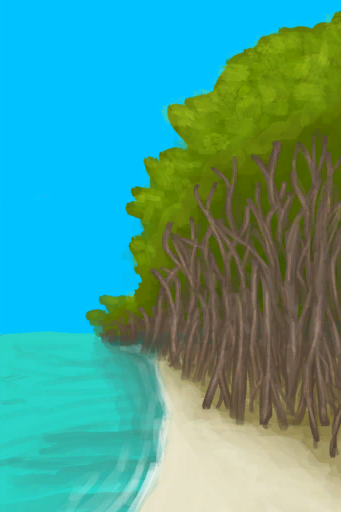
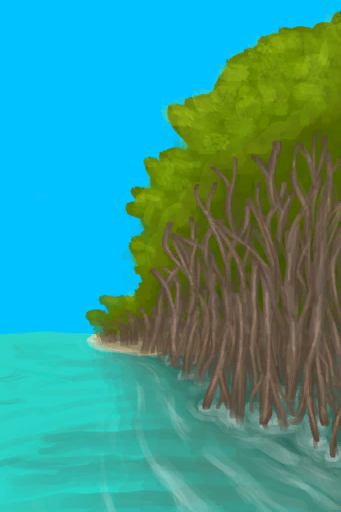

# “SlipperyAction(Group)”  

Explore [

[Bird Rock](BirdRock.md)](BirdRock.md)

Explore [

[Desolate Beach](DesolateBeach.md)](DesolateBeach.md)

Explore [

[Rocks](Rocks.md)](Rocks.md)

Go [

[To Beach(Bay)](Path_BayToBeach.md)](Path_BayToBeach.md)

Go [

[To Mangrove Forest](Path_BayToMangroves.md)](Path_BayToMangroves.md)

Go [

[To Jungle Outskirts(Beach)](Path_BeachToOutskirts.md)](Path_BeachToOutskirts.md)

Go [

[To Rocks(Beach)](Path_BeachToRocks.md)](Path_BeachToRocks.md)

Go [

[To Desolate Beach(Eastern Grasslands)](Path_GrasslandsEToDesolateBeach.md)](Path_GrasslandsEToDesolateBeach.md)

Go [

[To Bay](Path_MangrovesToBay.md)](Path_MangrovesToBay.md)

Go [

[To Desolate Beach](Path_MangrovesToDesolateBeach.md)](Path_MangrovesToDesolateBeach.md)

Go [

[To Grasslands(Mangrove Forest)](Path_MangrovesToGrasslandsW.md)](Path_MangrovesToGrasslandsW.md)

Go [

[To Beach(Outskirts)](Path_OutskirtsToBeach.md)](Path_OutskirtsToBeach.md)

Go [

[To Jungle Path](Path_OutskirtsToJungle.md)](Path_OutskirtsToJungle.md)

Go [

[To Beach(Rocks)](Path_RocksToBeach.md)](Path_RocksToBeach.md)

Go [

[To Desolate Beach(Volcano)](Path_VolcanoToDesolateBeach.md)](Path_VolcanoToDesolateBeach.md)

  
  

