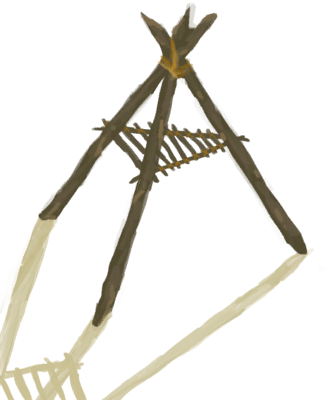

# Smoker Frame  
> I should add some large cloth or plastic sheet to complete it.  
  
<table class="table table-bordered" data-toggle="table"  data-show-header="false"><thead style="display:none"><tr ><th  style="width:50%;text-align:left;vertical-align:top;"  >title</th><th  style="width:50%;text-align:left;vertical-align:top;"  ></th></tr></thead><tr ><td  style="width:50%;text-align:left;vertical-align:top;"  >** Cannot Be Trashed **</td><td  style="width:50%;text-align:left;vertical-align:top;"  >

<a href="SmokerFrame.md" style="color:black">Smoker Frame</a>

</td></tr></tbody></table>  
  
## Got From  

Remove Cloth

[Smoker](SmokerNoFire.md)

Remove Plastic Sheet

[Smoker](SmokerNoFirePlastic.md)

  
  
## Action  

<table><tr><td rowspan="2" style="width:200px;text-align:center;font-size:1.3em;font-weight:bold">

Remove Sticks

15m

</td><td></td></tr><tr><td></td></tr><tr><td colspan="2"><b>Require：</b>[

[Light](Light.md)](Light.md): <b>10-100</b></td></tr><tr><td colspan="2">[

[Sticks](Sticks.md)](Sticks.md)(<b>+1</b>)</td></tr></table>
  
  
  
## Drag With  

<table style="margin-bottom:0px;"><tr><td style="width:40%;text-align:left; background-color:#FEFEFE"><b>With：</b>[

[Plastic Sheet](PlasticSheet.md)](PlasticSheet.md)</td><td style="width:40%;font-size:1em;font-weight:bold;background-color:#FEFEFE">Cover Smoker (30m) </td></tr><tr><td colspan="2"><b>Require：</b>[

[Light](Light.md)](Light.md): <b>10-100</b></td></tr><tr style="background-color:#FFFFFF"><td style=""><b>Receiving：</b>→Dismiss</td><td style=""><b>Self：</b>→ [

[Smoker](SmokerNoFirePlastic.md)](SmokerNoFirePlastic.md)</td></tr></table>
  
  

