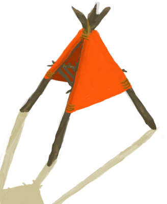
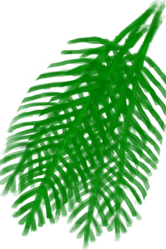

# Smoker  
> I can cook and smoke food here.  
  
<table class="table table-bordered" data-toggle="table"  data-show-header="false"><thead style="display:none"><tr ><th  style="width:50%;text-align:left;vertical-align:top;"  >title</th><th  style="width:50%;text-align:left;vertical-align:top;"  ></th></tr></thead><tr ><td  style="width:50%;text-align:left;vertical-align:top;"  >** Cannot Be Trashed **  **Slots：**4  **过滤器：**[“Cookable”](tag_Cookable.md) , [“Water Container”](tag_WaterContainer.md)  ** Effect: ** [

[Cold Insulation](InsulationCold.md)](InsulationCold.md)<b>+20</b> [

[Wetness](Wetness.md)](Wetness.md)addition<b>-1</b> [

[Wetness](Wetness.md)](Wetness.md)addition<b>-1</b> [

[Light](Light.md)](Light.md)<b>+20</b></td><td  style="width:50%;text-align:left;vertical-align:top;"  >

<a href="SmokerPlastic.md" style="color:black">Smoker</a>

</td></tr></tbody></table>  
  
## Got From  

** With：**[Lit Tinder](TinderLit.md)Light Fire

[Smoker](SmokerExtinguishedPlastic.md)

  
  
## Action  

<table><tr><td rowspan="2" style="width:200px;text-align:center;font-size:1.3em;font-weight:bold">

Take Embers

</td><td></td></tr><tr><td><b>Self：</b>Fuel  <b>-4(-4.17%)</b></td></tr><tr><td colspan="2">[

[Embers](Embers.md)](Embers.md)(<b>+1</b>)</td></tr></table>
  

<table><tr><td rowspan="2" style="width:200px;text-align:center;font-size:1.3em;font-weight:bold">

Extinguish Fire

</td><td></td></tr><tr><td><b>Self：</b>→ [

[Smoker](SmokerExtinguishedPlastic.md)](SmokerExtinguishedPlastic.md)</td></tr></table>
  

<table><tr><td rowspan="2" style="width:200px;text-align:center;font-size:1.3em;font-weight:bold">

Remove Smoker

30m

</td><td></td></tr><tr><td><b>Self：</b>→ [

[Campfire](Campfire.md)](Campfire.md)</td></tr><tr><td colspan="2">[

[Smoker](SmokerNoFirePlastic.md)](SmokerNoFirePlastic.md)(<b>+1</b>)</td></tr></table>
  
  
  
## Drag With  

<table style="margin-bottom:0px;"><tr><td style="width:40%;text-align:left; background-color:#FEFEFE"><b>With：</b>[

[Wood](Wood.md)](Wood.md)</td><td style="width:40%;font-size:1em;font-weight:bold;background-color:#FEFEFE">Feed Firewood  </td></tr><tr style="background-color:#FFFFFF"><td style=""><b>Receiving：</b>→Dismiss</td><td style=""><b>Self：</b>Fuel  <b>+28(29.17%)</b></td></tr></table>
  

<table style="margin-bottom:0px;"><tr><td style="width:40%;text-align:left; background-color:#FEFEFE"><b>With：</b>[

[Charcoal](Charcoal.md)](Charcoal.md)</td><td style="width:40%;font-size:1em;font-weight:bold;background-color:#FEFEFE">Feed Charcoal  </td></tr><tr style="background-color:#FFFFFF"><td style=""><b>Receiving：</b>→Dismiss</td><td style=""><b>Self：</b>Fuel  <b>+25(26.04%)</b></td></tr></table>
  

<table style="margin-bottom:0px;"><tr><td style="width:40%;text-align:left; background-color:#FEFEFE"><b>With：</b>[

[Sticks](Sticks.md)](Sticks.md)</td><td style="width:40%;font-size:1em;font-weight:bold;background-color:#FEFEFE">Feed Kindling  </td></tr><tr style="background-color:#FFFFFF"><td style=""><b>Receiving：</b>→Dismiss</td><td style=""><b>Self：</b>Fuel  <b>+4(4.17%)</b></td></tr></table>
  

<table style="margin-bottom:0px;"><tr><td style="width:40%;text-align:left; background-color:#FEFEFE"><b>With：</b>[

[Dry Leaves](LeavesDry.md)](LeavesDry.md) | [

[Lit Tinder](TinderLit.md)](TinderLit.md) | [

[Fibers](Fibers.md)](Fibers.md)</td><td style="width:40%;font-size:1em;font-weight:bold;background-color:#FEFEFE">Feed Tinder  </td></tr><tr style="background-color:#FFFFFF"><td style=""><b>Receiving：</b>→Dismiss</td><td style=""><b>Self：</b>Fuel  <b>+1(1.04%)</b></td></tr></table>
  

<table style="margin-bottom:0px;"><tr><td style="width:40%;text-align:left; background-color:#FEFEFE"><b>With：</b>[

[Long Stick](StickLong.md)](StickLong.md)</td><td style="width:40%;font-size:1em;font-weight:bold;background-color:#FEFEFE">Make Rustic Spear (45m) </td></tr><tr style="background-color:#FFFFFF"><td style=""><b>Receiving：</b>→ [

[Rustic Spear](SpearRustic.md)](SpearRustic.md)</td><td style=""><b>Self：</b></td></tr><tr><td colspan="2"><b>StatChange：</b>[

[Morale](Morale.md)](Morale.md)<b>+1</b></td></tr></table>
  

<table style="margin-bottom:0px;"><tr><td style="width:40%;text-align:left; background-color:#FEFEFE"><b>With：</b>[

[Egg](Egg.md)](Egg.md)</td><td style="width:40%;font-size:1em;font-weight:bold;background-color:#FEFEFE">Cook Egg (15m) </td></tr><tr style="background-color:#FFFFFF"><td style=""><b>Receiving：</b>→ [

[Roasted Egg](EggCooked.md)](EggCooked.md)</td><td style=""><b>Self：</b></td></tr><tr><td colspan="2"><b>StatChange：</b>[

[Morale](Morale.md)](Morale.md)<b>+1</b></td></tr></table>
  

<table style="margin-bottom:0px;"><tr><td style="width:40%;text-align:left; background-color:#FEFEFE"><b>With：</b>[

[Goatfish](Goatfish.md)](Goatfish.md)</td><td style="width:40%;font-size:1em;font-weight:bold;background-color:#FEFEFE">Cook Goatfish (30m) </td></tr><tr style="background-color:#FFFFFF"><td style=""><b>Receiving：</b>→ [

[Cooked Goatfish](GoatfishCooked.md)](GoatfishCooked.md)</td><td style=""><b>Self：</b></td></tr><tr><td colspan="2"><b>StatChange：</b>[

[Morale](Morale.md)](Morale.md)<b>+1</b></td></tr></table>
  

<table style="margin-bottom:0px;"><tr><td style="width:40%;text-align:left; background-color:#FEFEFE"><b>With：</b>[

[Grouper Meat](GrouperMeat.md)](GrouperMeat.md)</td><td style="width:40%;font-size:1em;font-weight:bold;background-color:#FEFEFE">Cook Grouper (30m) </td></tr><tr style="background-color:#FFFFFF"><td style=""><b>Receiving：</b>→ [

[Cooked Grouper](GrouperMeatCooked.md)](GrouperMeatCooked.md)</td><td style=""><b>Self：</b></td></tr><tr><td colspan="2"><b>StatChange：</b>[

[Morale](Morale.md)](Morale.md)<b>+1</b></td></tr></table>
  

<table style="margin-bottom:0px;"><tr><td style="width:40%;text-align:left; background-color:#FEFEFE"><b>With：</b>[

[Boar Meat](BoarMeat.md)](BoarMeat.md)</td><td style="width:40%;font-size:1em;font-weight:bold;background-color:#FEFEFE">Cook Boar Meat (30m) </td></tr><tr style="background-color:#FFFFFF"><td style=""><b>Receiving：</b>→ [

[Cooked Boar Meat](BoarMeatCooked.md)](BoarMeatCooked.md)</td><td style=""><b>Self：</b></td></tr><tr><td colspan="2"><b>StatChange：</b>[

[Morale](Morale.md)](Morale.md)<b>+1</b></td></tr></table>
  

<table style="margin-bottom:0px;"><tr><td style="width:40%;text-align:left; background-color:#FEFEFE"><b>With：</b>[

[Bonefish Meat](BonefishMeat.md)](BonefishMeat.md)</td><td style="width:40%;font-size:1em;font-weight:bold;background-color:#FEFEFE">Cook Bonefish (30m) </td></tr><tr style="background-color:#FFFFFF"><td style=""><b>Receiving：</b>→ [

[Cooked Bonefish](BonefishCooked.md)](BonefishCooked.md)</td><td style=""><b>Self：</b></td></tr><tr><td colspan="2"><b>StatChange：</b>[

[Morale](Morale.md)](Morale.md)<b>+1</b></td></tr></table>
  

<table style="margin-bottom:0px;"><tr><td style="width:40%;text-align:left; background-color:#FEFEFE"><b>With：</b>[

[Crab](Crab.md)](Crab.md)</td><td style="width:40%;font-size:1em;font-weight:bold;background-color:#FEFEFE">Cook Crab (30m) </td></tr><tr style="background-color:#FFFFFF"><td style=""><b>Receiving：</b>→ [

[Cooked Crab](CrabCooked.md)](CrabCooked.md)</td><td style=""><b>Self：</b>Fuel  <b>+0～+2(0%～2.08%)</b></td></tr><tr><td colspan="2"><b>StatChange：</b>[

[Morale](Morale.md)](Morale.md)<b>+1</b></td></tr></table>
  

<table style="margin-bottom:0px;"><tr><td style="width:40%;text-align:left; background-color:#FEFEFE"><b>With：</b>[

[Conch Meat](ConchMeat.md)](ConchMeat.md)</td><td style="width:40%;font-size:1em;font-weight:bold;background-color:#FEFEFE">Cook Conch Meat (30m) </td></tr><tr style="background-color:#FFFFFF"><td style=""><b>Receiving：</b>→ [

[Cooked Conch Meat](ConchMeatCooked.md)](ConchMeatCooked.md)</td><td style=""><b>Self：</b>Fuel  <b>+0～+2(0%～2.08%)</b></td></tr><tr><td colspan="2"><b>StatChange：</b>[

[Morale](Morale.md)](Morale.md)<b>+1</b></td></tr></table>
  

<table style="margin-bottom:0px;"><tr><td style="width:40%;text-align:left; background-color:#FEFEFE"><b>With：</b>[

[Soft Conch Meat](ConchMeatSoft.md)](ConchMeatSoft.md)</td><td style="width:40%;font-size:1em;font-weight:bold;background-color:#FEFEFE">Cook Soft Conch Meat (30m) </td></tr><tr style="background-color:#FFFFFF"><td style=""><b>Receiving：</b>→ [

[Cooked Soft Conch Meat](ConchMeatSoftCooked.md)](ConchMeatSoftCooked.md)</td><td style=""><b>Self：</b>Fuel  <b>+2(2.08%)</b></td></tr><tr><td colspan="2"><b>StatChange：</b>[

[Morale](Morale.md)](Morale.md)<b>+1</b></td></tr></table>
  

<table style="margin-bottom:0px;"><tr><td style="width:40%;text-align:left; background-color:#FEFEFE"><b>With：</b>[

[Unfired Clay Bowl](ClayBowlUnfired.md)](ClayBowlUnfired.md)</td><td style="width:40%;font-size:1em;font-weight:bold;background-color:#FEFEFE">Cook Clay Bowl (1h) </td></tr><tr style="background-color:#FFFFFF"><td style=""><b>Receiving：</b>→ [

[Clay Bowl](ClayBowl.md)](ClayBowl.md)</td><td style=""><b>Self：</b>Fuel  <b>+2(2.08%)</b></td></tr><tr><td colspan="2"><b>StatChange：</b>[

[Morale](Morale.md)](Morale.md)<b>+1</b></td></tr></table>
  

<table style="margin-bottom:0px;"><tr><td style="width:40%;text-align:left; background-color:#FEFEFE"><b>With：</b>[

[Unfired Clay Vase](ClayVaseUnfired.md)](ClayVaseUnfired.md)</td><td style="width:40%;font-size:1em;font-weight:bold;background-color:#FEFEFE">Cook Clay Vase (2h) </td></tr><tr style="background-color:#FFFFFF"><td style=""><b>Receiving：</b>→ [

[Clay Vase](ClayVase.md)](ClayVase.md)</td><td style=""><b>Self：</b>Fuel  <b>+2(2.08%)</b></td></tr><tr><td colspan="2"><b>StatChange：</b>[

[Morale](Morale.md)](Morale.md)<b>+2</b></td></tr></table>
  

<table style="margin-bottom:0px;"><tr><td style="width:40%;text-align:left; background-color:#FEFEFE"><b>With：</b>[

[Parrot Fish](ParrotFish.md)](ParrotFish.md)</td><td style="width:40%;font-size:1em;font-weight:bold;background-color:#FEFEFE">Cook Parrot Fish (30m) </td></tr><tr style="background-color:#FFFFFF"><td style=""><b>Receiving：</b>→ [

[Cooked Parrot Fish](ParrotFishCooked.md)](ParrotFishCooked.md)</td><td style=""><b>Self：</b>Fuel  <b>+0～+2(0%～2.08%)</b></td></tr><tr><td colspan="2"><b>StatChange：</b>[

[Morale](Morale.md)](Morale.md)<b>+1</b></td></tr></table>
  

<table style="margin-bottom:0px;"><tr><td style="width:40%;text-align:left; background-color:#FEFEFE"><b>With：</b>[

[Tropical Almond Kernels](TropicalAlmondKernels.md)](TropicalAlmondKernels.md)</td><td style="width:40%;font-size:1em;font-weight:bold;background-color:#FEFEFE">Cook Almonds (15m) </td></tr><tr style="background-color:#FFFFFF"><td style=""><b>Receiving：</b>→ [

[Roasted Tropical Almond](TropicalAlmondsRoasted.md)](TropicalAlmondsRoasted.md)</td><td style=""><b>Self：</b>Fuel  <b>+0～+2(0%～2.08%)</b></td></tr><tr><td colspan="2"><b>StatChange：</b>[

[Morale](Morale.md)](Morale.md)<b>+1</b></td></tr></table>
  

<table style="margin-bottom:0px;"><tr><td style="width:40%;text-align:left; background-color:#FEFEFE"><b>With：</b>[

[Coconut Shell](CoconutShell.md)](CoconutShell.md)</td><td style="width:40%;font-size:1em;font-weight:bold;background-color:#FEFEFE">Feed Coconut Half to the Fire  </td></tr><tr style="background-color:#FFFFFF"><td style=""><b>Receiving：</b>→Dismiss</td><td style=""><b>Self：</b>Fuel  <b>+2(2.08%)</b></td></tr></table>
  

<table style="margin-bottom:0px;"><tr><td style="width:40%;text-align:left; background-color:#FEFEFE"><b>With：</b>[

[Palm Fronds](PalmFronds.md)](PalmFronds.md)</td><td style="width:40%;font-size:1em;font-weight:bold;background-color:#FEFEFE">Feed Palm Leaves to the Fire  </td></tr><tr style="background-color:#FFFFFF"><td style=""><b>Receiving：</b>→Dismiss</td><td style=""><b>Self：</b>Fuel  <b>+2(2.08%)</b></td></tr></table>
  
  
## Transform  

<table style="margin-bottom:0px;"><tr><td  colspan=2 style="font-size:1em;font-weight:bold;background-color:#FEFEFE">Conch Meat</td><td style="text-align:right; background-color:#FEFEFE"></td></tr><tr style="background-color:#FFFFFF"><td style="width:30%;font-size:1em;text-align:right;vertical-align:middle;">[

[Conch Meat](ConchMeat.md)](ConchMeat.md)</td><td style="text-align:center;width:20%;vertical-align:middle;">
30m

Conch Meat
</td><td style="text-align:left;vertical-align:middle;">[

[Cooked Conch Meat](ConchMeatCooked.md)](ConchMeatCooked.md)(<b>+1</b>)</td></tr></table>
  

<table style="margin-bottom:0px;"><tr><td  colspan=2 style="font-size:1em;font-weight:bold;background-color:#FEFEFE">Soft Conch Meat</td><td style="text-align:right; background-color:#FEFEFE"></td></tr><tr style="background-color:#FFFFFF"><td style="width:30%;font-size:1em;text-align:right;vertical-align:middle;">[

[Soft Conch Meat](ConchMeatSoft.md)](ConchMeatSoft.md)</td><td style="text-align:center;width:20%;vertical-align:middle;">
30m

Soft Conch Meat
</td><td style="text-align:left;vertical-align:middle;">[

[Cooked Soft Conch Meat](ConchMeatSoftCooked.md)](ConchMeatSoftCooked.md)(<b>+1</b>)</td></tr></table>
  

<table style="margin-bottom:0px;"><tr><td  colspan=2 style="font-size:1em;font-weight:bold;background-color:#FEFEFE">Crab</td><td style="text-align:right; background-color:#FEFEFE"></td></tr><tr style="background-color:#FFFFFF"><td style="width:30%;font-size:1em;text-align:right;vertical-align:middle;">[

[Crab](Crab.md)](Crab.md)</td><td style="text-align:center;width:20%;vertical-align:middle;">
30m

Crab
</td><td style="text-align:left;vertical-align:middle;">[

[Cooked Crab](CrabCooked.md)](CrabCooked.md)(<b>+1</b>)</td></tr></table>
  

<table style="margin-bottom:0px;"><tr><td  colspan=2 style="font-size:1em;font-weight:bold;background-color:#FEFEFE">Boar</td><td style="text-align:right; background-color:#FEFEFE"></td></tr><tr style="background-color:#FFFFFF"><td style="width:30%;font-size:1em;text-align:right;vertical-align:middle;">[

[Boar Meat](BoarMeat.md)](BoarMeat.md)</td><td style="text-align:center;width:20%;vertical-align:middle;">
30m

Boar
</td><td style="text-align:left;vertical-align:middle;">[

[Cooked Boar Meat](BoarMeatCooked.md)](BoarMeatCooked.md)(<b>+1</b>)</td></tr></table>
  

<table style="margin-bottom:0px;"><tr><td  colspan=2 style="font-size:1em;font-weight:bold;background-color:#FEFEFE">Boar Smoked</td><td style="text-align:right; background-color:#FEFEFE"></td></tr><tr style="background-color:#FFFFFF"><td style="width:30%;font-size:1em;text-align:right;vertical-align:middle;">[

[Cooked Boar Meat](BoarMeatCooked.md)](BoarMeatCooked.md)</td><td style="text-align:center;width:20%;vertical-align:middle;">
30m

Boar Smoked
</td><td style="text-align:left;vertical-align:middle;">[

[Smoked Boar Meat](BoarMeatSmoked.md)](BoarMeatSmoked.md)(<b>+1</b>)</td></tr></table>
  

<table style="margin-bottom:0px;"><tr><td  colspan=2 style="font-size:1em;font-weight:bold;background-color:#FEFEFE">Grouper</td><td style="text-align:right; background-color:#FEFEFE"></td></tr><tr style="background-color:#FFFFFF"><td style="width:30%;font-size:1em;text-align:right;vertical-align:middle;">[

[Grouper Meat](GrouperMeat.md)](GrouperMeat.md)</td><td style="text-align:center;width:20%;vertical-align:middle;">
30m

Grouper
</td><td style="text-align:left;vertical-align:middle;">[

[Cooked Grouper](GrouperMeatCooked.md)](GrouperMeatCooked.md)(<b>+1</b>)</td></tr></table>
  

<table style="margin-bottom:0px;"><tr><td  colspan=2 style="font-size:1em;font-weight:bold;background-color:#FEFEFE">Grouper Smoked</td><td style="text-align:right; background-color:#FEFEFE"></td></tr><tr style="background-color:#FFFFFF"><td style="width:30%;font-size:1em;text-align:right;vertical-align:middle;">[

[Cooked Grouper](GrouperMeatCooked.md)](GrouperMeatCooked.md)</td><td style="text-align:center;width:20%;vertical-align:middle;">
30m

Grouper Smoked
</td><td style="text-align:left;vertical-align:middle;">[

[Smoked Grouper](GrouperMeatSmoked.md)](GrouperMeatSmoked.md)(<b>+1</b>)</td></tr></table>
  

<table style="margin-bottom:0px;"><tr><td  colspan=2 style="font-size:1em;font-weight:bold;background-color:#FEFEFE">Egg</td><td style="text-align:right; background-color:#FEFEFE"></td></tr><tr style="background-color:#FFFFFF"><td style="width:30%;font-size:1em;text-align:right;vertical-align:middle;">[

[Egg](Egg.md)](Egg.md)</td><td style="text-align:center;width:20%;vertical-align:middle;">
15m

Egg
</td><td style="text-align:left;vertical-align:middle;">[

[Roasted Egg](EggCooked.md)](EggCooked.md)(<b>+1</b>)</td></tr></table>
  

<table style="margin-bottom:0px;"><tr><td  colspan=2 style="font-size:1em;font-weight:bold;background-color:#FEFEFE">Goatfish</td><td style="text-align:right; background-color:#FEFEFE"></td></tr><tr style="background-color:#FFFFFF"><td style="width:30%;font-size:1em;text-align:right;vertical-align:middle;">[

[Goatfish](Goatfish.md)](Goatfish.md)</td><td style="text-align:center;width:20%;vertical-align:middle;">
30m

Goatfish
</td><td style="text-align:left;vertical-align:middle;">[

[Cooked Goatfish](GoatfishCooked.md)](GoatfishCooked.md)(<b>+1</b>)</td></tr></table>
  

<table style="margin-bottom:0px;"><tr><td  colspan=2 style="font-size:1em;font-weight:bold;background-color:#FEFEFE">Goatfish Smoked</td><td style="text-align:right; background-color:#FEFEFE"></td></tr><tr style="background-color:#FFFFFF"><td style="width:30%;font-size:1em;text-align:right;vertical-align:middle;">[

[Cooked Goatfish](GoatfishCooked.md)](GoatfishCooked.md)</td><td style="text-align:center;width:20%;vertical-align:middle;">
3h

Goatfish Smoked
</td><td style="text-align:left;vertical-align:middle;">[

[Smoked Goatfish](GoatfishSmoked.md)](GoatfishSmoked.md)(<b>+1</b>)</td></tr></table>
  

<table style="margin-bottom:0px;"><tr><td  colspan=2 style="font-size:1em;font-weight:bold;background-color:#FEFEFE">Bonefish</td><td style="text-align:right; background-color:#FEFEFE"></td></tr><tr style="background-color:#FFFFFF"><td style="width:30%;font-size:1em;text-align:right;vertical-align:middle;">[

[Bonefish Meat](BonefishMeat.md)](BonefishMeat.md)</td><td style="text-align:center;width:20%;vertical-align:middle;">
30m

Bonefish
</td><td style="text-align:left;vertical-align:middle;">[

[Cooked Bonefish](BonefishCooked.md)](BonefishCooked.md)(<b>+1</b>)</td></tr></table>
  

<table style="margin-bottom:0px;"><tr><td  colspan=2 style="font-size:1em;font-weight:bold;background-color:#FEFEFE">Bonefish Smoked</td><td style="text-align:right; background-color:#FEFEFE"></td></tr><tr style="background-color:#FFFFFF"><td style="width:30%;font-size:1em;text-align:right;vertical-align:middle;">[

[Cooked Bonefish](BonefishCooked.md)](BonefishCooked.md)</td><td style="text-align:center;width:20%;vertical-align:middle;">
3h

Bonefish Smoked
</td><td style="text-align:left;vertical-align:middle;">[

[Smoked Bonefish](BonefishSmoked.md)](BonefishSmoked.md)(<b>+1</b>)</td></tr></table>
  

<table style="margin-bottom:0px;"><tr><td  colspan=2 style="font-size:1em;font-weight:bold;background-color:#FEFEFE">Parrotfish</td><td style="text-align:right; background-color:#FEFEFE"></td></tr><tr style="background-color:#FFFFFF"><td style="width:30%;font-size:1em;text-align:right;vertical-align:middle;">[

[Parrot Fish](ParrotFish.md)](ParrotFish.md)</td><td style="text-align:center;width:20%;vertical-align:middle;">
30m

Parrotfish
</td><td style="text-align:left;vertical-align:middle;">[

[Cooked Parrot Fish](ParrotFishCooked.md)](ParrotFishCooked.md)(<b>+1</b>)</td></tr></table>
  

<table style="margin-bottom:0px;"><tr><td  colspan=2 style="font-size:1em;font-weight:bold;background-color:#FEFEFE">Parrotfish Smoked</td><td style="text-align:right; background-color:#FEFEFE"></td></tr><tr style="background-color:#FFFFFF"><td style="width:30%;font-size:1em;text-align:right;vertical-align:middle;">[

[Cooked Parrot Fish](ParrotFishCooked.md)](ParrotFishCooked.md)</td><td style="text-align:center;width:20%;vertical-align:middle;">
3h

Parrotfish Smoked
</td><td style="text-align:left;vertical-align:middle;">[

[Smoked Parrot Fish](ParrotFishSmoked.md)](ParrotFishSmoked.md)(<b>+1</b>)</td></tr></table>
  

<table style="margin-bottom:0px;"><tr><td  colspan=2 style="font-size:1em;font-weight:bold;background-color:#FEFEFE">Tropical Almonds</td><td style="text-align:right; background-color:#FEFEFE"></td></tr><tr style="background-color:#FFFFFF"><td style="width:30%;font-size:1em;text-align:right;vertical-align:middle;">[

[Tropical Almond Kernels](TropicalAlmondKernels.md)](TropicalAlmondKernels.md)</td><td style="text-align:center;width:20%;vertical-align:middle;">
30m

Tropical Almonds
</td><td style="text-align:left;vertical-align:middle;">[

[Roasted Tropical Almond](TropicalAlmondsRoasted.md)](TropicalAlmondsRoasted.md)(<b>+1</b>)</td></tr></table>
  

<table style="margin-bottom:0px;"><tr><td  colspan=2 style="font-size:1em;font-weight:bold;background-color:#FEFEFE">Stone</td><td style="text-align:right; background-color:#FEFEFE"></td></tr><tr style="background-color:#FFFFFF"><td style="width:30%;font-size:1em;text-align:right;vertical-align:middle;">[

[Stone](Stone.md)](Stone.md)</td><td style="text-align:center;width:20%;vertical-align:middle;">
30m

Stone
</td><td style="text-align:left;vertical-align:middle;"></td></tr></table>
  

<table style="margin-bottom:0px;"><tr><td  colspan=2 style="font-size:1em;font-weight:bold;background-color:#FEFEFE">Charred Remains</td><td style="text-align:right; background-color:#FEFEFE"></td></tr><tr style="background-color:#FFFFFF"><td style="width:30%;font-size:1em;text-align:right;vertical-align:middle;">[

[Cooked Conch Meat](ConchMeatCooked.md)](ConchMeatCooked.md) [

[Cooked Soft Conch Meat](ConchMeatSoftCooked.md)](ConchMeatSoftCooked.md) [

[Cooked Crab](CrabCooked.md)](CrabCooked.md) [

[Roasted Tropical Almond](TropicalAlmondsRoasted.md)](TropicalAlmondsRoasted.md) [

[Roasted Egg](EggCooked.md)](EggCooked.md) [

[Boiled Egg](EggBoiled.md)](EggBoiled.md)</td><td style="text-align:center;width:20%;vertical-align:middle;">
1h

Charred Remains
</td><td style="text-align:left;vertical-align:middle;">[

[Charred Remains](CharredRemains.md)](CharredRemains.md)(<b>+1</b>)</td></tr></table>
  

<table style="margin-bottom:0px;"><tr><td  colspan=2 style="font-size:1em;font-weight:bold;background-color:#FEFEFE">Boiling Coconut Bowl</td><td style="text-align:right; background-color:#FEFEFE"></td></tr><tr style="background-color:#FFFFFF"><td style="width:30%;font-size:1em;text-align:right;vertical-align:middle;"></td><td style="text-align:center;width:20%;vertical-align:middle;">
30m

Boiling Coconut Bowl
</td><td style="text-align:left;vertical-align:middle;"></td></tr></table>
  

<table style="margin-bottom:0px;"><tr><td  colspan=2 style="font-size:1em;font-weight:bold;background-color:#FEFEFE">Boiling Salt Coconut</td><td style="text-align:right; background-color:#FEFEFE"></td></tr><tr style="background-color:#FFFFFF"><td style="width:30%;font-size:1em;text-align:right;vertical-align:middle;"></td><td style="text-align:center;width:20%;vertical-align:middle;">
1h

Boiling Salt Coconut
</td><td style="text-align:left;vertical-align:middle;">[

[Coconut Shell](CoconutShell.md)](CoconutShell.md)(<b>+1</b>) [

[Salt](Salt.md)](Salt.md)(<b>+1</b>)</td></tr></table>
  

<table style="margin-bottom:0px;"><tr><td  colspan=2 style="font-size:1em;font-weight:bold;background-color:#FEFEFE">Boiling Clay Bowl</td><td style="text-align:right; background-color:#FEFEFE"></td></tr><tr style="background-color:#FFFFFF"><td style="width:30%;font-size:1em;text-align:right;vertical-align:middle;"></td><td style="text-align:center;width:20%;vertical-align:middle;">
30m

Boiling Clay Bowl
</td><td style="text-align:left;vertical-align:middle;"></td></tr></table>
  

<table style="margin-bottom:0px;"><tr><td  colspan=2 style="font-size:1em;font-weight:bold;background-color:#FEFEFE">Boiling Clay Salt Bowl</td><td style="text-align:right; background-color:#FEFEFE"></td></tr><tr style="background-color:#FFFFFF"><td style="width:30%;font-size:1em;text-align:right;vertical-align:middle;"></td><td style="text-align:center;width:20%;vertical-align:middle;">
1h

Boiling Clay Salt Bowl
</td><td style="text-align:left;vertical-align:middle;">[

[Salt](Salt.md)](Salt.md)(<b>+1</b>)</td></tr></table>
  

<table style="margin-bottom:0px;"><tr><td  colspan=2 style="font-size:1em;font-weight:bold;background-color:#FEFEFE">Boiling Jerrycan</td><td style="text-align:right; background-color:#FEFEFE"></td></tr><tr style="background-color:#FFFFFF"><td style="width:30%;font-size:1em;text-align:right;vertical-align:middle;"></td><td style="text-align:center;width:20%;vertical-align:middle;">
30m

Boiling Jerrycan
</td><td style="text-align:left;vertical-align:middle;"></td></tr></table>
  

<table style="margin-bottom:0px;"><tr><td  colspan=2 style="font-size:1em;font-weight:bold;background-color:#FEFEFE">Boiling Clay Vase</td><td style="text-align:right; background-color:#FEFEFE"></td></tr><tr style="background-color:#FFFFFF"><td style="width:30%;font-size:1em;text-align:right;vertical-align:middle;"></td><td style="text-align:center;width:20%;vertical-align:middle;">
45m

Boiling Clay Vase
</td><td style="text-align:left;vertical-align:middle;"></td></tr></table>
  
## Durability   

<table style="margin-bottom:0px;"><tr><td style="width:30%;text-align:left; background-color:#FEFEFE;font-size:1.3em;font-weight:bold;">Fuel</td><td style="font-size:1em;background-color:#FEFEFE">Starting：1 , Max：96 -1/TP , Duration ：1d</td></tr><tr style="background-color:#FFFFFF"><td colspan=2>** On Zero： ** Self: → [

[Smoker](SmokerExtinguishedPlastic.md)](SmokerExtinguishedPlastic.md)</td></tr></table>
  

