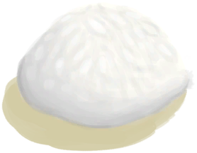

# Soap  
> "I could clean myself with it  
  
<table class="table table-bordered" data-toggle="table"  data-show-header="false"><thead style="display:none"><tr ><th  style="width:50%;text-align:left;vertical-align:top;"  >title</th><th  style="width:50%;text-align:left;vertical-align:top;"  ></th></tr></thead><tr ><td  style="width:50%;text-align:left;vertical-align:top;"  >**Weight：**25  **Usage：**15</td><td  style="width:50%;text-align:left;vertical-align:top;"  >

<a href="SoapDry.md" style="color:black">Soap</a>

"Soap can help clean your body and wounds much more efficiently</td></tr></tbody></table>  
  
## Got From  

Make Soap

[Soap Mix](LQ_SoapMix.md)

Make Soap

[Soap Mix](LQ_SoapMix.md)

Make Soap

[Soap Mix](LQ_SoapMix.md)

Make Soap

[Soap Mix](LQ_SoapMix.md)

Make Soap

[Soap Mix](LQ_SoapMix.md)

Transform

[Wet Soap](SoapWet.md)

  
  
## Drag With  

<table style="margin-bottom:0px;"><tr><td style="width:40%;text-align:left; background-color:#FEFEFE"><b>With：</b>[“Water”](tag_WaterAny.md) | [“Sea”](tag_Sea.md)</td><td style="width:40%;font-size:1em;font-weight:bold;background-color:#FEFEFE">Wet  </td></tr><tr style="background-color:#FFFFFF"><td style=""><b>Receiving：</b></td><td style=""><b>Self：</b>→ [

[Wet Soap](SoapWet.md)](SoapWet.md)</td></tr></table>
  
  
## Use In BluePrint  

<a href="Bp_PesticideChilli.md" style="color:black">Chilli Pesticide</a>

  
  
  
## Durability   

<table style="margin-bottom:0px;"><tr><td style="width:30%;text-align:left; background-color:#FEFEFE;font-size:1.3em;font-weight:bold;">Usage</td><td style="font-size:1em;background-color:#FEFEFE">Starting：15 -</td></tr><tr style="background-color:#FFFFFF"><td colspan=2>** On Zero： ** Self: →Dismiss</td></tr></table>
  

