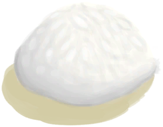

# Wet Soap  
> I can use it to clean myself while it's wet.  
  
<table class="table table-bordered" data-toggle="table"  data-show-header="false"><thead style="display:none"><tr ><th  style="width:50%;text-align:left;vertical-align:top;"  >title</th><th  style="width:50%;text-align:left;vertical-align:top;"  ></th></tr></thead><tr ><td  style="width:50%;text-align:left;vertical-align:top;"  >**Weight：**25  **Usage：**15</td><td  style="width:50%;text-align:left;vertical-align:top;"  >

<a href="SoapWet.md" style="color:black">Wet Soap</a>

"Soap can help clean your body and wounds much more efficiently</td></tr></tbody></table>  
  
## Got From  

** With：**[“Water”](tag_WaterAny.md) , [“Sea”](tag_Sea.md)Wet

[Soap](SoapDry.md)

** With：**[“Water”](tag_WaterAny.md) , [“Sea”](tag_Sea.md)Wet

[Wet Soap](SoapWet.md)

  
  
## Action  

<table><tr><td rowspan="2" style="width:200px;text-align:center;font-size:1.3em;font-weight:bold">

Wash yourself

15m

</td><td>[“HandAction(Group)”](HandAction.md)</td></tr><tr><td><b>Self：</b>Spoilage  <b>-3(-75%)</b>, Usage  <b>-1</b></td></tr><tr><td colspan="2"><b>StatChange：</b>[

[Wetness](Wetness.md)](Wetness.md)<b>+15</b>, [

[Filth](Filth.md)](Filth.md)<b>-300</b>, [

[Mud Protection](MudProtection.md)](MudProtection.md)<b>-50</b>, [

[Aloe Gel Protection](AloeVeraGelProtection.md)](AloeVeraGelProtection.md)<b>-50</b>, [

[Bug Repellent](BugRepellentApplied.md)](BugRepellentApplied.md)<b>-50</b></td></tr></table>
  
  
  
## Drag With  

<table style="margin-bottom:0px;"><tr><td style="width:40%;text-align:left; background-color:#FEFEFE"><b>With：</b>[“Water”](tag_WaterAny.md) | [“Sea”](tag_Sea.md)</td><td style="width:40%;font-size:1em;font-weight:bold;background-color:#FEFEFE">Wet  </td></tr><tr style="background-color:#FFFFFF"><td style=""><b>Receiving：</b></td><td style=""><b>Self：</b>→ [

[Wet Soap](SoapWet.md)](SoapWet.md), Spoilage  <b>+4(100%)</b></td></tr></table>
  
  
## Drag To  

[Abrasion](W_Abrasion.md)

[Arm Laceration](W_ArmLacerationL.md)

[Stitched Arm Laceration](W_ArmLacerationLStitched.md)

[Arm Laceration](W_ArmLacerationR.md)

[Arm Laceration](W_ArmLacerationRStitched.md)

[Dog Bite](W_DogBite.md)

[Leg Laceration](W_LegLacerationL.md)

[Leg Laceration](W_LegLacerationLStitched.md)

[Leg Laceration](W_LegLacerationR.md)

[Leg Laceration](W_LegLacerationRStitched.md)

[Macaque Bite](W_MacaqueBite.md)

[Minor Laceration](W_MinorLaceration.md)

[Minor Laceration](W_MinorLacerationStitched.md)

[Lizard Bite](W_MonitorBite.md)

[Seahound Sting](W_SeahoundSting.md)

[Shark Bite](W_SharkBite.md)

[Spider Bite](W_SpiderBite.md)

[Urchin Wound](W_UrchinWound.md)

  
  
## Use In BluePrint  

<a href="Bp_PesticideChilli.md" style="color:black">Chilli Pesticide</a>

  
  
  
## Durability   

<table style="margin-bottom:0px;"><tr><td style="width:30%;text-align:left; background-color:#FEFEFE;font-size:1.3em;font-weight:bold;">Spoilage</td><td style="font-size:1em;background-color:#FEFEFE">Starting：4 , Max：4 -1/TP , Duration ：1h</td></tr><tr style="background-color:#FFFFFF"><td colspan=2>** On Zero： ** Self: → [

[Soap](SoapDry.md)](SoapDry.md)</td></tr></table>
  

<table style="margin-bottom:0px;"><tr><td style="width:30%;text-align:left; background-color:#FEFEFE;font-size:1.3em;font-weight:bold;">Usage</td><td style="font-size:1em;background-color:#FEFEFE">Starting：15 -</td></tr><tr style="background-color:#FFFFFF"><td colspan=2>** On Zero： ** Self: →Dismiss</td></tr></table>
  

