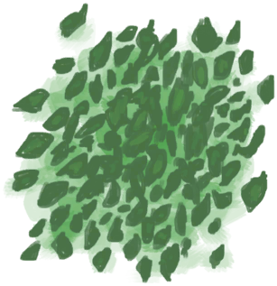

# Ground Spider Lily  
> Can be boiled for an antibiotic decoction.  
  
<table class="table table-bordered" data-toggle="table"  data-show-header="false"><thead style="display:none"><tr ><th  style="width:50%;text-align:left;vertical-align:top;"  >title</th><th  style="width:50%;text-align:left;vertical-align:top;"  ></th></tr></thead><tr ><td  style="width:50%;text-align:left;vertical-align:top;"  >**Weight：**50  **Tag：**	[“Cookable”](tag_Cookable.md), [“Poor Fibers”](tag_FibersPoor.md)</td><td  style="width:50%;text-align:left;vertical-align:top;"  >

<a href="SpiderLilyGround.md" style="color:black">Ground Spider Lily</a>

The leaves from these flowers can be ground and mixed into a bowl of boiling water to make an Antibiotic tea which can be used to treat Bacterial and Parasitic infections.</td></tr></tbody></table>  
  
## Got From  

** With：**[“Hammer”](tag_Hammer.md)Grind Leaves

[Spider Lily Leaves](SpiderLilyLeaves.md)

** With：**[“Hammer”](tag_Hammer.md)Grind Leaves

[Dried Spider Lily Leaves](SpiderLilyLeavesDried.md)

  
  
## Action  

<table><tr><td rowspan="2" style="width:200px;text-align:center;font-size:1.3em;font-weight:bold">

Eat

15m

</td><td>[“VegetarianAction(Group)”](VegetarianAction.md), [“EatingAction(Group)”](EatingAction.md)</td></tr><tr><td><b>Self：</b>→Dismiss</td></tr><tr><td colspan="2"><b>StatChange：</b>[

[Satiation](Satiation.md)](Satiation.md)<b>+10</b>, [

[Stomach](Stomach.md)](Stomach.md)<b>+2</b>, [

[Hydration ](Hydration.md)](Hydration.md)<b>+4</b>, [

[Morale](Morale.md)](Morale.md)<b>-10</b>, [

[Saturation Vegetables](SaturationVegetables.md)](SaturationVegetables.md)<b>+30</b>, [

[Stool Liquidity](Diarrhoea.md)](Diarrhoea.md)<b>+150</b>, [

[Bacteria Fever](BacteriaFever.md)](BacteriaFever.md)<b>-50</b>, [

[Filth](Filth.md)](Filth.md)<b>+4</b></td></tr></table>
  
  
  
## Drag With  

<table style="margin-bottom:0px;"><tr><td style="width:40%;text-align:left; background-color:#FEFEFE"><b>With：</b>[

[Boiling Water](LQ_WaterBoiling.md)](LQ_WaterBoiling.md)</td><td style="width:40%;font-size:1em;font-weight:bold;background-color:#FEFEFE">Soak  </td></tr><tr style="background-color:#FFFFFF"><td style=""><b>Receiving：</b>→ [

[Spider Lily Tea](LQ_SpiderLily.md)](LQ_SpiderLily.md)</td><td style=""><b>Self：</b>→Dismiss</td></tr></table>
  
  
## Drag To  

[Goat Feeder](GoatFeeder.md)

[Goat Feeder(Empty)](GoatFeederEmpty.md)

[Goat](GoatEnclosureFemale.md)

[Juvenile Goat](GoatEnclosureKid.md)

[Lactating Goat](GoatEnclosureLactating.md)

[Male Goat](GoatEnclosureMale.md)

[Goat](GoatTiedFemale.md)

[Lactating Goat](GoatTiedFemaleLactating.md)

[Juvenile Goat](GoatTiedKid.md)

[Male Goat](GoatTiedMale.md)

  
  
## Durability   

<table style="margin-bottom:0px;"><tr><td style="width:30%;text-align:left; background-color:#FEFEFE;font-size:1.3em;font-weight:bold;">Spoilage</td><td style="font-size:1em;background-color:#FEFEFE">Starting：672 -1/TP , Duration ：7d</td></tr><tr style="background-color:#FFFFFF"><td colspan=2>** On Zero： ** Self: →Dismiss</td></tr></table>
  

