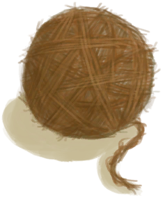

# Spindle  
> I can turn fibers into cord here.   
  
<table class="table table-bordered" data-toggle="table"  data-show-header="false"><thead style="display:none"><tr ><th  style="width:50%;text-align:left;vertical-align:top;"  >title</th><th  style="width:50%;text-align:left;vertical-align:top;"  ></th></tr></thead><tr ><td  style="width:50%;text-align:left;vertical-align:top;"  >**Weight：**50  **Tag：**	[“Cord”](tag_Cord.md)</td><td  style="width:50%;text-align:left;vertical-align:top;"  >

<a href="Spindle.md" style="color:black">Spindle</a>

</td></tr></tbody></table>  
  
## Got From  

Craft BluePrint

[Spindle(BluePrint)](Bp_Spindle.md)

Get Cord

[Spindled Cord](SpindleFiber.md)

Get Yarn

[Spindled Cord](SpindleFiber.md)

  
  
## Drag With  

<table style="margin-bottom:0px;"><tr><td style="width:40%;text-align:left; background-color:#FEFEFE"><b>With：</b>[

[Fibers](Fibers.md)](Fibers.md)</td><td style="width:40%;font-size:1em;font-weight:bold;background-color:#FEFEFE">Spin Cord  </td></tr><tr><td colspan="2"><b>Require：</b>[

[Light](Light.md)](Light.md): <b>10-100</b></td></tr><tr style="background-color:#FFFFFF"><td style=""><b>Receiving：</b>→Dismiss</td><td style=""><b>Self：</b>Progress  <b>+1(33.33%)</b></td></tr></table>
  

<table style="margin-bottom:0px;"><tr><td style="width:40%;text-align:left; background-color:#FEFEFE"><b>With：</b>[

[Yarn](YarnFiber.md)](YarnFiber.md)</td><td style="width:40%;font-size:1em;font-weight:bold;background-color:#FEFEFE">Spin Cord  </td></tr><tr><td colspan="2"><b>Require：</b>[

[Light](Light.md)](Light.md): <b>10-100</b></td></tr><tr style="background-color:#FFFFFF"><td style=""><b>Receiving：</b>→Dismiss</td><td style=""><b>Self：</b>→ [

[Spindled Cord](SpindleFiber.md)](SpindleFiber.md), Progress  <b>+3(100%)</b></td></tr></table>
  
  
## Durability   

<table style="margin-bottom:0px;"><tr><td style="width:30%;text-align:left; background-color:#FEFEFE;font-size:1.3em;font-weight:bold;">Progress</td><td style="font-size:1em;background-color:#FEFEFE">Starting：0 , Max：3 -</td></tr><tr style="background-color:#FFFFFF"><td colspan=2>** On Full：Ready ** Self: → [

[Spindled Cord](SpindleFiber.md)](SpindleFiber.md)</td></tr></table>
  

