# Stamina  
> "Shows how tired you are. A low stamina will increase your appetite  
> "Stamina decreases as you engage in physical activity  
  

<b>Base Value: </b> 32 
  

<b>Value Range: </b> 0 ~ 32 
  

<b>Base Rate: </b> +2 / /TP 
  
## Statuses  

<table><tr style="height:2em;"><td style="background-color:#F0F0F0;text-align:center;width:180px;font-size:1.4em;font-weight:bold;vertical-align:middle;">
0

0%
</td><td colspan=2 style="font-size:1.1em;vertical-align:middle;background-color:#F9F9F9;">
<b>

Passed Out</b>

&nbsp;&nbsp;zzz...
</td></tr><tr><td colspan=2><b>Effect：</b>[

[Weight](Weight.md)](Weight.md)addition<b>-4</b>, [

[Appetite](Appetite.md)](Appetite.md)<b>+100</b></td></tr><tr><td colspan=2></td></tr><tr style="height:2em;"><td style="background-color:#F0F0F0;text-align:center;width:180px;font-size:1.4em;font-weight:bold;vertical-align:middle;">
1 ～ 15

3% ～ 46%
</td><td colspan=2 style="font-size:1.1em;vertical-align:middle;background-color:#F9F9F9;">
<b>

Exhausted</b>

&nbsp;&nbsp;"I'm exhausted
</td></tr><tr><td colspan=2><b>Effect：</b>[

[Weight](Weight.md)](Weight.md)addition<b>-4</b>, [

[Appetite](Appetite.md)](Appetite.md)<b>+100</b>, [

[Temperature](TemperaturePerceived.md)](TemperaturePerceived.md)<b>+10</b></td></tr><tr><td colspan=2></td></tr><tr style="height:2em;"><td style="background-color:#F0F0F0;text-align:center;width:180px;font-size:1.4em;font-weight:bold;vertical-align:middle;">
16 ～ 25

50% ～ 78%
</td><td colspan=2 style="font-size:1.1em;vertical-align:middle;background-color:#F9F9F9;">
<b>

Tired</b>

&nbsp;&nbsp;So much physical activity is getting me tired.
</td></tr><tr><td colspan=2><b>Effect：</b>[

[Weight](Weight.md)](Weight.md)addition<b>-2</b>, [

[Appetite](Appetite.md)](Appetite.md)<b>+75</b>, [

[Temperature](TemperaturePerceived.md)](TemperaturePerceived.md)<b>+5</b></td></tr><tr><td colspan=2></td></tr><tr style="height:2em;"><td style="background-color:#F0F0F0;text-align:center;width:180px;font-size:1.4em;font-weight:bold;vertical-align:middle;">
26 ～ 31

81% ～ 96%
</td><td colspan=2 style="font-size:1.1em;vertical-align:middle;background-color:#F9F9F9;">
<b>Active</b>

</td></tr><tr><td colspan=2><b>Effect：</b>[

[Weight](Weight.md)](Weight.md)addition<b>-1</b>, [

[Appetite](Appetite.md)](Appetite.md)<b>+50</b>, [

[Temperature](TemperaturePerceived.md)](TemperaturePerceived.md)<b>+2</b></td></tr><tr><td colspan=2></td></tr><tr style="height:2em;"><td style="background-color:#F0F0F0;text-align:center;width:180px;font-size:1.4em;font-weight:bold;vertical-align:middle;">
32

100%
</td><td colspan=2 style="font-size:1.1em;vertical-align:middle;background-color:#F9F9F9;">
<b>Resting</b>

</td></tr><tr><td colspan=2></td></tr></table>
  
## Related Cards  
[Lung Damage](LungDamage.md)  |  [Fever](Fever.md)  |  [Parasite Malaria](ParasiteMalaria.md)  
## Change By  
<table class="table table-bordered" data-toggle="table"  ><thead style=""><tr ><th  style="text-align:left;vertical-align:top;"  >From</th><th  style="text-align:left;vertical-align:top;"  >Operation</th><th  style="text-align:left;vertical-align:top;"  >Value</th></tr></thead><tr ><td  style="text-align:left;vertical-align:top;"  >[

[You Pass Out(Event)](Event_FaintDizzy.md)](Event_FaintDizzy.md)</td><td  style="text-align:left;vertical-align:top;"  >Continue</td><td  style="text-align:left;vertical-align:top;"  >100</td></tr><tr ><td  style="text-align:left;vertical-align:top;"  >[

[You Pass Out(Event)](Event_FaintExhaustion.md)](Event_FaintExhaustion.md)</td><td  style="text-align:left;vertical-align:top;"  >Continue</td><td  style="text-align:left;vertical-align:top;"  >100</td></tr><tr ><td  style="text-align:left;vertical-align:top;"  >[
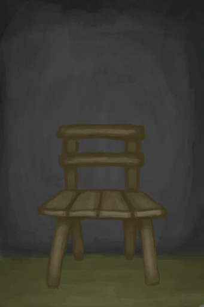
[Chair](ChairPlaced.md)](ChairPlaced.md)</td><td  style="text-align:left;vertical-align:top;"  >Meditate</td><td  style="text-align:left;vertical-align:top;"  >40</td></tr><tr ><td  style="text-align:left;vertical-align:top;"  >[
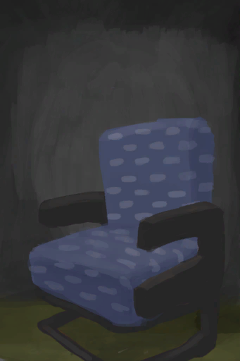
[Seat](SeatAttached.md)](SeatAttached.md)</td><td  style="text-align:left;vertical-align:top;"  >Meditate</td><td  style="text-align:left;vertical-align:top;"  >40</td></tr><tr ><td  style="text-align:left;vertical-align:top;"  >[

[Seat](SeatPlaced.md)](SeatPlaced.md)</td><td  style="text-align:left;vertical-align:top;"  >Meditate</td><td  style="text-align:left;vertical-align:top;"  >40</td></tr><tr ><td  style="text-align:left;vertical-align:top;"  >[

[Darkness(Dark Chamber)](DarkChamber.md)](DarkChamber.md)</td><td  style="text-align:left;vertical-align:top;"  >Meditate</td><td  style="text-align:left;vertical-align:top;"  >40</td></tr><tr ><td  style="text-align:left;vertical-align:top;"  >[
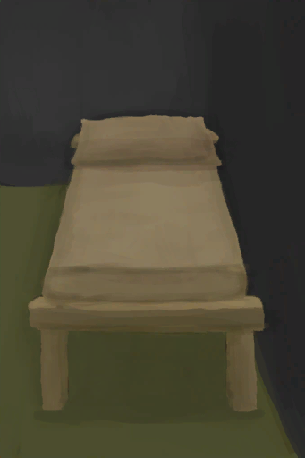
[Wooden Bed](BedWooden.md)](BedWooden.md)</td><td  style="text-align:left;vertical-align:top;"  >Sleep</td><td  style="text-align:left;vertical-align:top;"  >30</td></tr><tr ><td  style="text-align:left;vertical-align:top;"  >[

[Chair](ChairPlaced.md)](ChairPlaced.md)</td><td  style="text-align:left;vertical-align:top;"  >Rest</td><td  style="text-align:left;vertical-align:top;"  >15</td></tr><tr ><td  style="text-align:left;vertical-align:top;"  >[

[Seat](SeatAttached.md)](SeatAttached.md)</td><td  style="text-align:left;vertical-align:top;"  >Rest</td><td  style="text-align:left;vertical-align:top;"  >15</td></tr><tr ><td  style="text-align:left;vertical-align:top;"  >[

[Seat](SeatPlaced.md)](SeatPlaced.md)</td><td  style="text-align:left;vertical-align:top;"  >Rest</td><td  style="text-align:left;vertical-align:top;"  >15</td></tr><tr ><td  style="text-align:left;vertical-align:top;"  >[
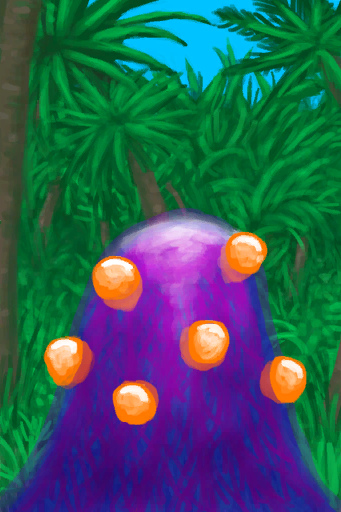
[Blooming Alien Growth](AlienGrowth.md)](AlienGrowth.md)</td><td  style="text-align:left;vertical-align:top;"  >Cut Down ** With：**[“Axe”](tag_Axe.md)</td><td  style="text-align:left;vertical-align:top;"  >-1</td></tr><tr ><td  style="text-align:left;vertical-align:top;"  >[
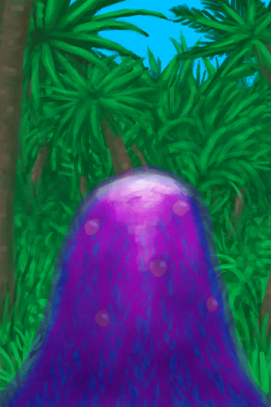
[Alien Growth](AlienGrowthCleared.md)](AlienGrowthCleared.md)</td><td  style="text-align:left;vertical-align:top;"  >Cut Down ** With：**[“Axe”](tag_Axe.md)</td><td  style="text-align:left;vertical-align:top;"  >-1</td></tr><tr ><td  style="text-align:left;vertical-align:top;"  >[
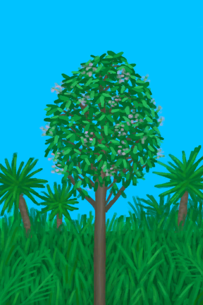
[Cinchona Tree](CinchonaTree.md)](CinchonaTree.md)</td><td  style="text-align:left;vertical-align:top;"  >Cut Tree ** With：**[“Axe”](tag_Axe.md)</td><td  style="text-align:left;vertical-align:top;"  >-1</td></tr><tr ><td  style="text-align:left;vertical-align:top;"  >[

[Cinchona Tree](CinchonaTree.md)](CinchonaTree.md)</td><td  style="text-align:left;vertical-align:top;"  >Harvest Bark ** With：**[“Cutter”](tag_Cutter.md)</td><td  style="text-align:left;vertical-align:top;"  >-1</td></tr><tr ><td  style="text-align:left;vertical-align:top;"  >[

[Cleared Cinchona Tree](CinchonaTreeCleared.md)](CinchonaTreeCleared.md)</td><td  style="text-align:left;vertical-align:top;"  >Cut Tree ** With：**[“Axe”](tag_Axe.md)</td><td  style="text-align:left;vertical-align:top;"  >-1</td></tr><tr ><td  style="text-align:left;vertical-align:top;"  >[
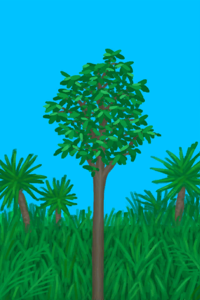
[Young Mango Tree](MangoTreeYoung.md)](MangoTreeYoung.md)</td><td  style="text-align:left;vertical-align:top;"  >Cut Tree ** With：**[“Axe”](tag_Axe.md)</td><td  style="text-align:left;vertical-align:top;"  >-1</td></tr><tr ><td  style="text-align:left;vertical-align:top;"  >[

[Atoll](Atoll.md)](Atoll.md)</td><td  style="text-align:left;vertical-align:top;"  >Explore</td><td  style="text-align:left;vertical-align:top;"  >-1</td></tr><tr ><td  style="text-align:left;vertical-align:top;"  >[
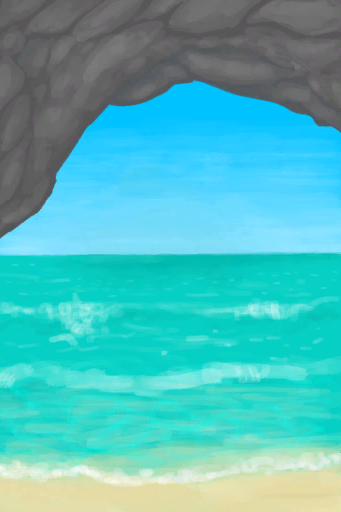
[Secret Cove](Cove.md)](Cove.md)</td><td  style="text-align:left;vertical-align:top;"  >Explore</td><td  style="text-align:left;vertical-align:top;"  >-1</td></tr><tr ><td  style="text-align:left;vertical-align:top;"  >[
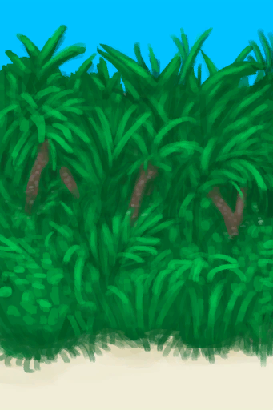
[Jungle Outskirts(Outskirts)](Outskirts.md)](Outskirts.md)</td><td  style="text-align:left;vertical-align:top;"  >Explore</td><td  style="text-align:left;vertical-align:top;"  >-1</td></tr><tr ><td  style="text-align:left;vertical-align:top;"  >[
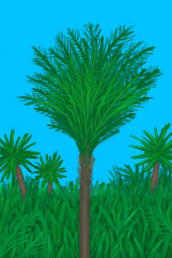
[Young palm Tree](PalmTreeYoung.md)](PalmTreeYoung.md)</td><td  style="text-align:left;vertical-align:top;"  >Cut Tree ** With：**[“Axe”](tag_Axe.md)</td><td  style="text-align:left;vertical-align:top;"  >-1</td></tr><tr ><td  style="text-align:left;vertical-align:top;"  >[

[Small Palm](SmallPalm.md)](SmallPalm.md)</td><td  style="text-align:left;vertical-align:top;"  >Cut Tree ** With：**[“Axe”](tag_Axe.md)</td><td  style="text-align:left;vertical-align:top;"  >-1</td></tr><tr ><td  style="text-align:left;vertical-align:top;"  >[

[Small Tree](SmallTree.md)](SmallTree.md)</td><td  style="text-align:left;vertical-align:top;"  >Cut Tree ** With：**[“Axe”](tag_Axe.md)</td><td  style="text-align:left;vertical-align:top;"  >-1</td></tr><tr ><td  style="text-align:left;vertical-align:top;"  >[

[Young Almond Tree](TropicalAlmondTreeYoung.md)](TropicalAlmondTreeYoung.md)</td><td  style="text-align:left;vertical-align:top;"  >Cut Tree ** With：**[“Axe”](tag_Axe.md)</td><td  style="text-align:left;vertical-align:top;"  >-1</td></tr><tr ><td  style="text-align:left;vertical-align:top;"  >[
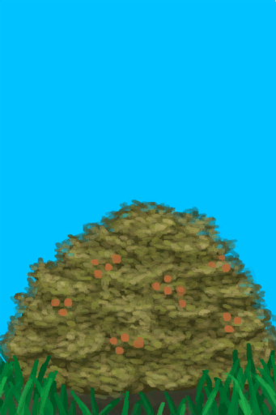
[Wild Jujube](WildJujube.md)](WildJujube.md)</td><td  style="text-align:left;vertical-align:top;"  >Cut Down ** With：**[“Axe”](tag_Axe.md)</td><td  style="text-align:left;vertical-align:top;"  >-1</td></tr><tr ><td  style="text-align:left;vertical-align:top;"  >[

[Cleared Wild Jujube](WildJujubeCleared.md)](WildJujubeCleared.md)</td><td  style="text-align:left;vertical-align:top;"  >Cut Down ** With：**[“Axe”](tag_Axe.md)</td><td  style="text-align:left;vertical-align:top;"  >-1</td></tr><tr ><td  style="text-align:left;vertical-align:top;"  >[
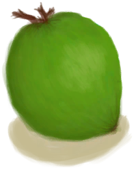
[Husked Coconut](CoconutHusked.md)](CoconutHusked.md)</td><td  style="text-align:left;vertical-align:top;"  >Peel ** With：**[“Cutter”](tag_Cutter.md) , [“Spear T1”](tag_Spear.md)</td><td  style="text-align:left;vertical-align:top;"  >-2</td></tr><tr ><td  style="text-align:left;vertical-align:top;"  >[

[Husked Coconut](CoconutHusked.md)](CoconutHusked.md)</td><td  style="text-align:left;vertical-align:top;"  >Peel ** With：**[“Axe”](tag_Axe.md)</td><td  style="text-align:left;vertical-align:top;"  >-2</td></tr><tr ><td  style="text-align:left;vertical-align:top;"  >[
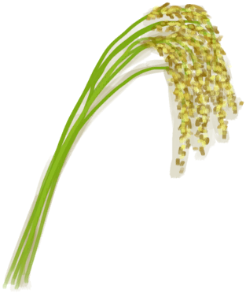
[Rice Stalks](RiceStalks.md)](RiceStalks.md)</td><td  style="text-align:left;vertical-align:top;"  >Thresh</td><td  style="text-align:left;vertical-align:top;"  >-2</td></tr><tr ><td  style="text-align:left;vertical-align:top;"  >[
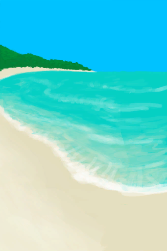
[Bay](Bay.md)](Bay.md)</td><td  style="text-align:left;vertical-align:top;"  >Go for a Walk</td><td  style="text-align:left;vertical-align:top;"  >-2</td></tr><tr ><td  style="text-align:left;vertical-align:top;"  >[

[Beach](Beach.md)](Beach.md)</td><td  style="text-align:left;vertical-align:top;"  >Go for a Walk</td><td  style="text-align:left;vertical-align:top;"  >-2</td></tr><tr ><td  style="text-align:left;vertical-align:top;"  >[

[To Jungle Outskirts(Beach)](Path_BeachToOutskirts.md)](Path_BeachToOutskirts.md)</td><td  style="text-align:left;vertical-align:top;"  >Go</td><td  style="text-align:left;vertical-align:top;"  >-2</td></tr><tr ><td  style="text-align:left;vertical-align:top;"  >[
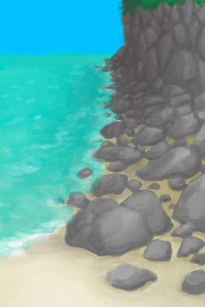
[To Rocks(Beach)](Path_BeachToRocks.md)](Path_BeachToRocks.md)</td><td  style="text-align:left;vertical-align:top;"  >Go</td><td  style="text-align:left;vertical-align:top;"  >-2</td></tr><tr ><td  style="text-align:left;vertical-align:top;"  >[
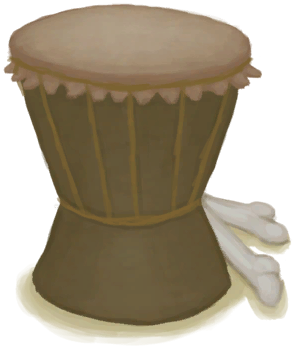
[Drum(Event)](Event_DrumMenu.md)](Event_DrumMenu.md)(未实装)</td><td  style="text-align:left;vertical-align:top;"  >Flowing Rythm</td><td  style="text-align:left;vertical-align:top;"  >-2.5 / /TP</td></tr><tr ><td  style="text-align:left;vertical-align:top;"  >[

[Page 1(Event)](Event_FluteTunes1.md)](Event_FluteTunes1.md)</td><td  style="text-align:left;vertical-align:top;"  >Simple Tune</td><td  style="text-align:left;vertical-align:top;"  >-2.5 / /TP</td></tr><tr ><td  style="text-align:left;vertical-align:top;"  >[

[Page 1(Event)](Event_FluteTunes1.md)](Event_FluteTunes1.md)</td><td  style="text-align:left;vertical-align:top;"  >Happy Tune</td><td  style="text-align:left;vertical-align:top;"  >-2.5 / /TP</td></tr><tr ><td  style="text-align:left;vertical-align:top;"  >[

[Page 1(Event)](Event_FluteTunes1.md)](Event_FluteTunes1.md)</td><td  style="text-align:left;vertical-align:top;"  >Sad Tune</td><td  style="text-align:left;vertical-align:top;"  >-2.5 / /TP</td></tr><tr ><td  style="text-align:left;vertical-align:top;"  >[

[Page 2(Event)](Event_FluteTunes2.md)](Event_FluteTunes2.md)</td><td  style="text-align:left;vertical-align:top;"  >Lonely Tune</td><td  style="text-align:left;vertical-align:top;"  >-2.5 / /TP</td></tr><tr ><td  style="text-align:left;vertical-align:top;"  >[

[Page 2(Event)](Event_FluteTunes2.md)](Event_FluteTunes2.md)</td><td  style="text-align:left;vertical-align:top;"  >Weston's Tune</td><td  style="text-align:left;vertical-align:top;"  >-2.5 / /TP</td></tr><tr ><td  style="text-align:left;vertical-align:top;"  >[

[Page 2(Event)](Event_FluteTunes2.md)](Event_FluteTunes2.md)</td><td  style="text-align:left;vertical-align:top;"  >Advanced Tune</td><td  style="text-align:left;vertical-align:top;"  >-2.5 / /TP</td></tr><tr ><td  style="text-align:left;vertical-align:top;"  >[

[Page 3(Event)](Event_FluteTunes3.md)](Event_FluteTunes3.md)</td><td  style="text-align:left;vertical-align:top;"  >Sea Tune</td><td  style="text-align:left;vertical-align:top;"  >-2.5 / /TP</td></tr><tr ><td  style="text-align:left;vertical-align:top;"  >[

[Page 3(Event)](Event_FluteTunes3.md)](Event_FluteTunes3.md)</td><td  style="text-align:left;vertical-align:top;"  >Jungle Tune</td><td  style="text-align:left;vertical-align:top;"  >-2.5 / /TP</td></tr><tr ><td  style="text-align:left;vertical-align:top;"  >[

[Page 3(Event)](Event_FluteTunes3.md)](Event_FluteTunes3.md)</td><td  style="text-align:left;vertical-align:top;"  >Cave Tune</td><td  style="text-align:left;vertical-align:top;"  >-2.5 / /TP</td></tr><tr ><td  style="text-align:left;vertical-align:top;"  >[

[Drum](Drum.md)](Drum.md)</td><td  style="text-align:left;vertical-align:top;"  >Flowing Rhythm</td><td  style="text-align:left;vertical-align:top;"  >-2.5 / /TP</td></tr><tr ><td  style="text-align:left;vertical-align:top;"  >[

[Drum](Drum.md)](Drum.md)</td><td  style="text-align:left;vertical-align:top;"  >Drum Trance</td><td  style="text-align:left;vertical-align:top;"  >-2.5 / /TP</td></tr><tr ><td  style="text-align:left;vertical-align:top;"  >[
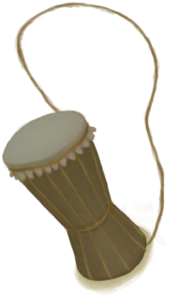
[Lizard Drum](LizardDrum.md)](LizardDrum.md)</td><td  style="text-align:left;vertical-align:top;"  >Flowing Rhythm</td><td  style="text-align:left;vertical-align:top;"  >-2.5 / /TP</td></tr><tr ><td  style="text-align:left;vertical-align:top;"  >[

[Lizard Drum](LizardDrum.md)](LizardDrum.md)</td><td  style="text-align:left;vertical-align:top;"  >Drum Trance</td><td  style="text-align:left;vertical-align:top;"  >-2.5 / /TP</td></tr><tr ><td  style="text-align:left;vertical-align:top;"  >[

[Drum(Event)](Event_DrumMenu.md)](Event_DrumMenu.md)(未实装)</td><td  style="text-align:left;vertical-align:top;"  >Practice</td><td  style="text-align:left;vertical-align:top;"  >-3 / /TP</td></tr><tr ><td  style="text-align:left;vertical-align:top;"  >[

[Drum](Drum.md)](Drum.md)</td><td  style="text-align:left;vertical-align:top;"  >Practice</td><td  style="text-align:left;vertical-align:top;"  >-3 / /TP</td></tr><tr ><td  style="text-align:left;vertical-align:top;"  >[
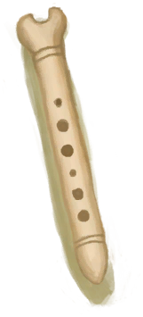
[Bone Flute](FluteBone.md)](FluteBone.md)</td><td  style="text-align:left;vertical-align:top;"  >Practice</td><td  style="text-align:left;vertical-align:top;"  >-3 / /TP</td></tr><tr ><td  style="text-align:left;vertical-align:top;"  >[

[Bone Flute](FluteBone.md)](FluteBone.md)</td><td  style="text-align:left;vertical-align:top;"  >Compose</td><td  style="text-align:left;vertical-align:top;"  >-3 / /TP</td></tr><tr ><td  style="text-align:left;vertical-align:top;"  >[
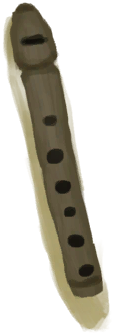
[Wooden Flute](FluteWooden.md)](FluteWooden.md)</td><td  style="text-align:left;vertical-align:top;"  >Practice</td><td  style="text-align:left;vertical-align:top;"  >-3 / /TP</td></tr><tr ><td  style="text-align:left;vertical-align:top;"  >[

[Wooden Flute](FluteWooden.md)](FluteWooden.md)</td><td  style="text-align:left;vertical-align:top;"  >Compose</td><td  style="text-align:left;vertical-align:top;"  >-3 / /TP</td></tr><tr ><td  style="text-align:left;vertical-align:top;"  >[

[Lizard Drum](LizardDrum.md)](LizardDrum.md)</td><td  style="text-align:left;vertical-align:top;"  >Practice</td><td  style="text-align:left;vertical-align:top;"  >-3 / /TP</td></tr><tr ><td  style="text-align:left;vertical-align:top;"  >[
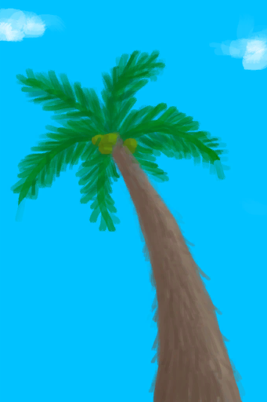
[Palm Tree](PalmTreeNew.md)](PalmTreeNew.md)</td><td  style="text-align:left;vertical-align:top;"  >Throw Rock ** With：**[Stone](Stone.md)</td><td  style="text-align:left;vertical-align:top;"  >-3</td></tr><tr ><td  style="text-align:left;vertical-align:top;"  >[
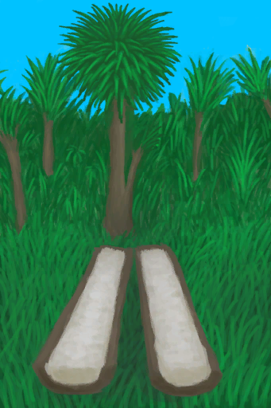
[Split Log](SagoSplitLog.md)](SagoSplitLog.md)</td><td  style="text-align:left;vertical-align:top;"  >Extract Sawdust ** With：**[“Cutter”](tag_Cutter.md) , [“Axe”](tag_Axe.md)</td><td  style="text-align:left;vertical-align:top;"  >-3</td></tr><tr ><td  style="text-align:left;vertical-align:top;"  >[

[Husked Coconut](CoconutHusked.md)](CoconutHusked.md)</td><td  style="text-align:left;vertical-align:top;"  >Peel ** With：**[“Hammer”](tag_Hammer.md)</td><td  style="text-align:left;vertical-align:top;"  >-4</td></tr><tr ><td  style="text-align:left;vertical-align:top;"  >[
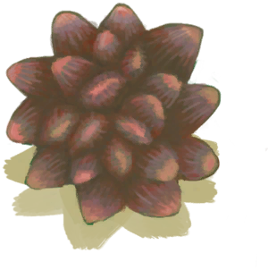
[Nipa Fruit](NipaFruit.md)](NipaFruit.md)</td><td  style="text-align:left;vertical-align:top;"  >Extract Seeds ** With：**[“Axe”](tag_Axe.md)</td><td  style="text-align:left;vertical-align:top;"  >-4</td></tr><tr ><td  style="text-align:left;vertical-align:top;"  >[
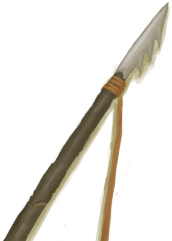
[Harpoon](HarpoonBone.md)](HarpoonBone.md)</td><td  style="text-align:left;vertical-align:top;"  >Train</td><td  style="text-align:left;vertical-align:top;"  >-4</td></tr><tr ><td  style="text-align:left;vertical-align:top;"  >[
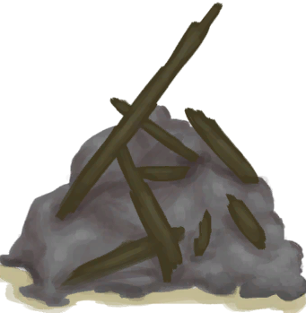
[Debris(Mud Hut)](Debris.md)](Debris.md)</td><td  style="text-align:left;vertical-align:top;"  >Clear ** With：**[“Shovel”](tag_Shovel.md)</td><td  style="text-align:left;vertical-align:top;"  >-4</td></tr><tr ><td  style="text-align:left;vertical-align:top;"  >[
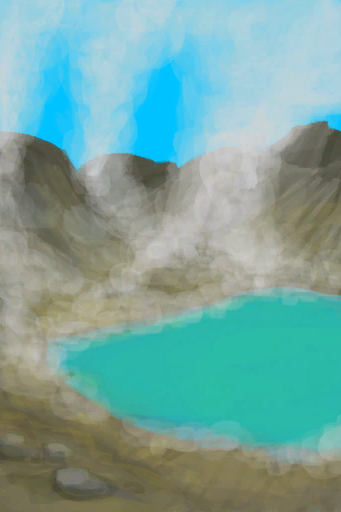
[Acid Lake(Volcano)](AcidLake.md)](AcidLake.md)</td><td  style="text-align:left;vertical-align:top;"  >Explore</td><td  style="text-align:left;vertical-align:top;"  >-4</td></tr><tr ><td  style="text-align:left;vertical-align:top;"  >[
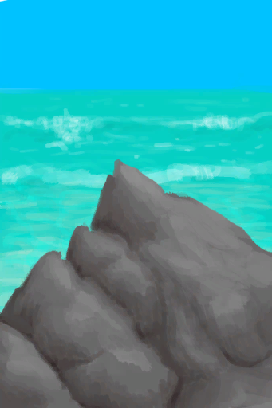
[Bird Rock](BirdRock.md)](BirdRock.md)</td><td  style="text-align:left;vertical-align:top;"  >Explore</td><td  style="text-align:left;vertical-align:top;"  >-4</td></tr><tr ><td  style="text-align:left;vertical-align:top;"  >[
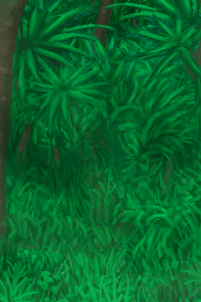
[Deep Jungle(Jungle)](DeepJungle.md)](DeepJungle.md)</td><td  style="text-align:left;vertical-align:top;"  >Explore</td><td  style="text-align:left;vertical-align:top;"  >-4</td></tr><tr ><td  style="text-align:left;vertical-align:top;"  >[

[Deep Jungle(Jungle)](DeepJungle.md)](DeepJungle.md)</td><td  style="text-align:left;vertical-align:top;"  >Cut Wood ** With：**[“Hammer”](tag_AxeAdv.md)</td><td  style="text-align:left;vertical-align:top;"  >-4</td></tr><tr ><td  style="text-align:left;vertical-align:top;"  >[

[Deep Jungle(Jungle)](DeepJungle.md)](DeepJungle.md)</td><td  style="text-align:left;vertical-align:top;"  >Cut Wood ** With：**[“Axe”](tag_Axe.md)</td><td  style="text-align:left;vertical-align:top;"  >-4</td></tr><tr ><td  style="text-align:left;vertical-align:top;"  >[
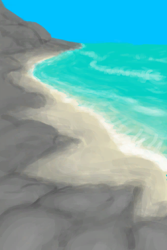
[Desolate Beach](DesolateBeach.md)](DesolateBeach.md)</td><td  style="text-align:left;vertical-align:top;"  >Explore</td><td  style="text-align:left;vertical-align:top;"  >-4</td></tr><tr ><td  style="text-align:left;vertical-align:top;"  >[
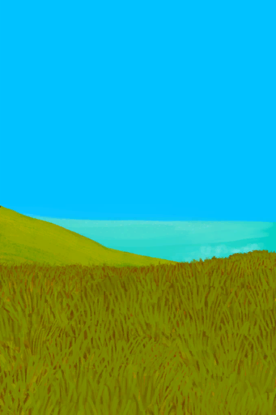
[Eastern Grasslands](GrasslandsE.md)](GrasslandsE.md)</td><td  style="text-align:left;vertical-align:top;"  >Explore</td><td  style="text-align:left;vertical-align:top;"  >-4</td></tr><tr ><td  style="text-align:left;vertical-align:top;"  >[

[Eastern Grasslands](GrasslandsE.md)](GrasslandsE.md)</td><td  style="text-align:left;vertical-align:top;"  >Dig Up Soil ** With：**[“Shovel”](tag_Shovel.md)</td><td  style="text-align:left;vertical-align:top;"  >-4</td></tr><tr ><td  style="text-align:left;vertical-align:top;"  >[
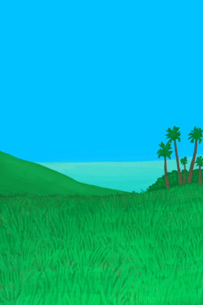
[Western Grasslands](GrasslandsW.md)](GrasslandsW.md)</td><td  style="text-align:left;vertical-align:top;"  >Explore</td><td  style="text-align:left;vertical-align:top;"  >-4</td></tr><tr ><td  style="text-align:left;vertical-align:top;"  >[

[Western Grasslands](GrasslandsW.md)](GrasslandsW.md)</td><td  style="text-align:left;vertical-align:top;"  >Dig Up Soil ** With：**[“Shovel”](tag_Shovel.md)</td><td  style="text-align:left;vertical-align:top;"  >-4</td></tr><tr ><td  style="text-align:left;vertical-align:top;"  >[
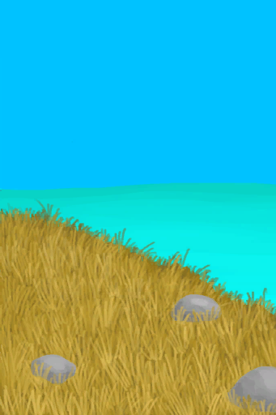
[Eastern Highlands](HighlandsEastern.md)](HighlandsEastern.md)</td><td  style="text-align:left;vertical-align:top;"  >Explore</td><td  style="text-align:left;vertical-align:top;"  >-4</td></tr><tr ><td  style="text-align:left;vertical-align:top;"  >[

[Eastern Highlands](HighlandsEastern.md)](HighlandsEastern.md)</td><td  style="text-align:left;vertical-align:top;"  >Cut Wood ** With：**[“Hammer”](tag_AxeAdv.md)</td><td  style="text-align:left;vertical-align:top;"  >-4</td></tr><tr ><td  style="text-align:left;vertical-align:top;"  >[

[Eastern Highlands](HighlandsEastern.md)](HighlandsEastern.md)</td><td  style="text-align:left;vertical-align:top;"  >Cut Wood ** With：**[“Axe”](tag_Axe.md)</td><td  style="text-align:left;vertical-align:top;"  >-4</td></tr><tr ><td  style="text-align:left;vertical-align:top;"  >[
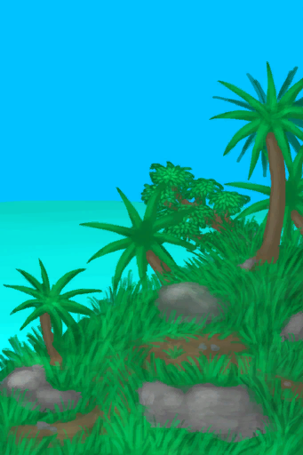
[Western Highlands](HighlandsWestern.md)](HighlandsWestern.md)</td><td  style="text-align:left;vertical-align:top;"  >Explore</td><td  style="text-align:left;vertical-align:top;"  >-4</td></tr><tr ><td  style="text-align:left;vertical-align:top;"  >[

[Western Highlands](HighlandsWestern.md)](HighlandsWestern.md)</td><td  style="text-align:left;vertical-align:top;"  >Cut Wood ** With：**[“Hammer”](tag_AxeAdv.md)</td><td  style="text-align:left;vertical-align:top;"  >-4</td></tr><tr ><td  style="text-align:left;vertical-align:top;"  >[

[Western Highlands](HighlandsWestern.md)](HighlandsWestern.md)</td><td  style="text-align:left;vertical-align:top;"  >Cut Wood ** With：**[“Axe”](tag_Axe.md)</td><td  style="text-align:left;vertical-align:top;"  >-4</td></tr><tr ><td  style="text-align:left;vertical-align:top;"  >[

[Jungle](Jungle.md)](Jungle.md)</td><td  style="text-align:left;vertical-align:top;"  >Explore</td><td  style="text-align:left;vertical-align:top;"  >-4</td></tr><tr ><td  style="text-align:left;vertical-align:top;"  >[

[Jungle](Jungle.md)](Jungle.md)</td><td  style="text-align:left;vertical-align:top;"  >Cut Wood ** With：**[“Hammer”](tag_AxeAdv.md)</td><td  style="text-align:left;vertical-align:top;"  >-4</td></tr><tr ><td  style="text-align:left;vertical-align:top;"  >[

[Jungle](Jungle.md)](Jungle.md)</td><td  style="text-align:left;vertical-align:top;"  >Cut Wood ** With：**[“Axe”](tag_Axe.md)</td><td  style="text-align:left;vertical-align:top;"  >-4</td></tr><tr ><td  style="text-align:left;vertical-align:top;"  >[
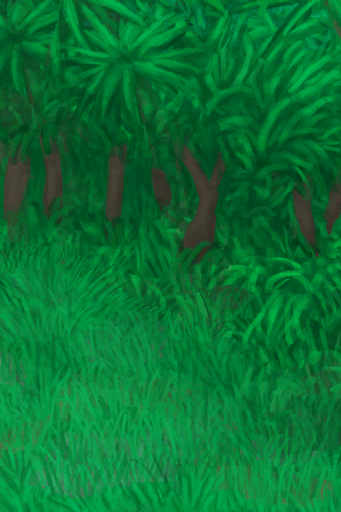
[Jungle Highlands](JungleHighlands.md)](JungleHighlands.md)</td><td  style="text-align:left;vertical-align:top;"  >Explore</td><td  style="text-align:left;vertical-align:top;"  >-4</td></tr><tr ><td  style="text-align:left;vertical-align:top;"  >[

[Jungle Highlands](JungleHighlands.md)](JungleHighlands.md)</td><td  style="text-align:left;vertical-align:top;"  >Cut Wood ** With：**[“Hammer”](tag_AxeAdv.md)</td><td  style="text-align:left;vertical-align:top;"  >-4</td></tr><tr ><td  style="text-align:left;vertical-align:top;"  >[

[Jungle Highlands](JungleHighlands.md)](JungleHighlands.md)</td><td  style="text-align:left;vertical-align:top;"  >Cut Wood ** With：**[“Axe”](tag_Axe.md)</td><td  style="text-align:left;vertical-align:top;"  >-4</td></tr><tr ><td  style="text-align:left;vertical-align:top;"  >[
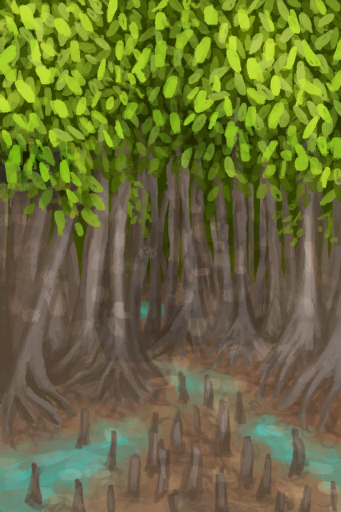
[Mangrove Forest](Mangroves.md)](Mangroves.md)</td><td  style="text-align:left;vertical-align:top;"  >Explore</td><td  style="text-align:left;vertical-align:top;"  >-4</td></tr><tr ><td  style="text-align:left;vertical-align:top;"  >[

[Mangrove Forest](Mangroves.md)](Mangroves.md)</td><td  style="text-align:left;vertical-align:top;"  >Cut Wood ** With：**[“Hammer”](tag_AxeAdv.md)</td><td  style="text-align:left;vertical-align:top;"  >-4</td></tr><tr ><td  style="text-align:left;vertical-align:top;"  >[

[Mangrove Forest](Mangroves.md)](Mangroves.md)</td><td  style="text-align:left;vertical-align:top;"  >Cut Wood ** With：**[“Axe”](tag_Axe.md)</td><td  style="text-align:left;vertical-align:top;"  >-4</td></tr><tr ><td  style="text-align:left;vertical-align:top;"  >[

[Jungle Outskirts(Outskirts)](Outskirts.md)](Outskirts.md)</td><td  style="text-align:left;vertical-align:top;"  >Cut Wood ** With：**[“Hammer”](tag_AxeAdv.md)</td><td  style="text-align:left;vertical-align:top;"  >-4</td></tr><tr ><td  style="text-align:left;vertical-align:top;"  >[

[Jungle Outskirts(Outskirts)](Outskirts.md)](Outskirts.md)</td><td  style="text-align:left;vertical-align:top;"  >Cut Wood ** With：**[“Axe”](tag_Axe.md)</td><td  style="text-align:left;vertical-align:top;"  >-4</td></tr><tr ><td  style="text-align:left;vertical-align:top;"  >[
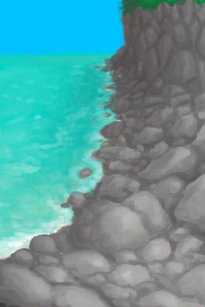
[Rocks](Rocks.md)](Rocks.md)</td><td  style="text-align:left;vertical-align:top;"  >Explore</td><td  style="text-align:left;vertical-align:top;"  >-4</td></tr><tr ><td  style="text-align:left;vertical-align:top;"  >[
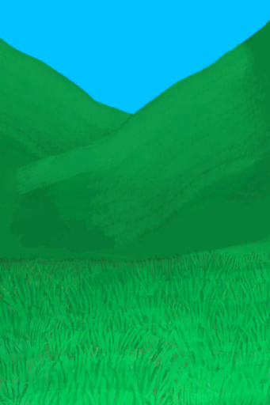
[Secret Valley](SecretValley.md)](SecretValley.md)</td><td  style="text-align:left;vertical-align:top;"  >Explore</td><td  style="text-align:left;vertical-align:top;"  >-4</td></tr><tr ><td  style="text-align:left;vertical-align:top;"  >[

[Secret Valley](SecretValley.md)](SecretValley.md)</td><td  style="text-align:left;vertical-align:top;"  >Dig Up Soil ** With：**[“Shovel”](tag_Shovel.md)</td><td  style="text-align:left;vertical-align:top;"  >-4</td></tr><tr ><td  style="text-align:left;vertical-align:top;"  >[
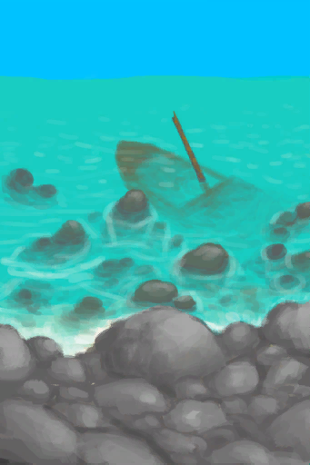
[Shipwreck(Bird Rock)](Shipwreck.md)](Shipwreck.md)</td><td  style="text-align:left;vertical-align:top;"  >Explore the shipwreck</td><td  style="text-align:left;vertical-align:top;"  >-4</td></tr><tr ><td  style="text-align:left;vertical-align:top;"  >[
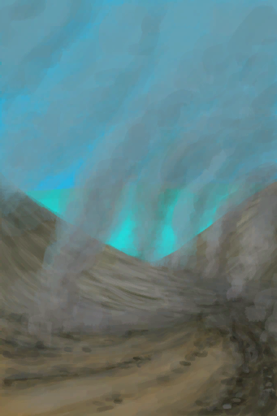
[Volcano](Volcano.md)](Volcano.md)</td><td  style="text-align:left;vertical-align:top;"  >Explore</td><td  style="text-align:left;vertical-align:top;"  >-4</td></tr><tr ><td  style="text-align:left;vertical-align:top;"  >[
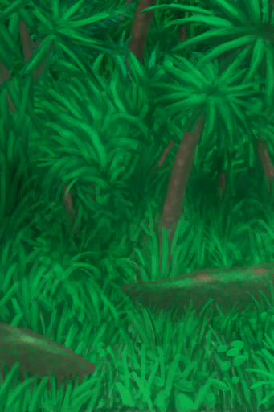
[Wetland Jungle(Wetlands)](Wetlands.md)](Wetlands.md)</td><td  style="text-align:left;vertical-align:top;"  >Explore</td><td  style="text-align:left;vertical-align:top;"  >-4</td></tr><tr ><td  style="text-align:left;vertical-align:top;"  >[

[Wetland Jungle(Wetlands)](Wetlands.md)](Wetlands.md)</td><td  style="text-align:left;vertical-align:top;"  >Cut Wood ** With：**[“Hammer”](tag_AxeAdv.md)</td><td  style="text-align:left;vertical-align:top;"  >-4</td></tr><tr ><td  style="text-align:left;vertical-align:top;"  >[

[Wetland Jungle(Wetlands)](Wetlands.md)](Wetlands.md)</td><td  style="text-align:left;vertical-align:top;"  >Cut Wood ** With：**[“Axe”](tag_Axe.md)</td><td  style="text-align:left;vertical-align:top;"  >-4</td></tr><tr ><td  style="text-align:left;vertical-align:top;"  >[

[To Volcano](Path_AcidLakeToVolcano.md)](Path_AcidLakeToVolcano.md)</td><td  style="text-align:left;vertical-align:top;"  >Go</td><td  style="text-align:left;vertical-align:top;"  >-4</td></tr><tr ><td  style="text-align:left;vertical-align:top;"  >[

[To Beach(Bay)](Path_BayToBeach.md)](Path_BayToBeach.md)</td><td  style="text-align:left;vertical-align:top;"  >Go</td><td  style="text-align:left;vertical-align:top;"  >-4</td></tr><tr ><td  style="text-align:left;vertical-align:top;"  >[
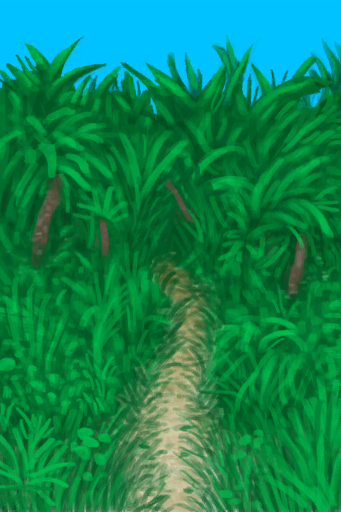
[To Jungle Path(Bay)](Path_BayToJungle.md)](Path_BayToJungle.md)</td><td  style="text-align:left;vertical-align:top;"  >Go</td><td  style="text-align:left;vertical-align:top;"  >-4</td></tr><tr ><td  style="text-align:left;vertical-align:top;"  >[
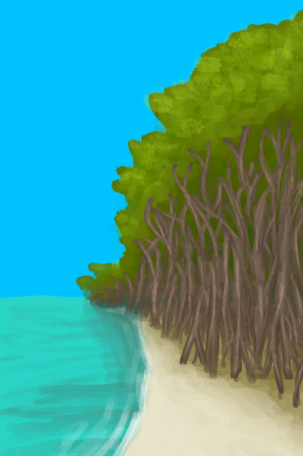
[To Mangrove Forest](Path_BayToMangroves.md)](Path_BayToMangroves.md)</td><td  style="text-align:left;vertical-align:top;"  >Go</td><td  style="text-align:left;vertical-align:top;"  >-4</td></tr><tr ><td  style="text-align:left;vertical-align:top;"  >[

[To Bay](Path_BeachToBay.md)](Path_BeachToBay.md)</td><td  style="text-align:left;vertical-align:top;"  >Go</td><td  style="text-align:left;vertical-align:top;"  >-4</td></tr><tr ><td  style="text-align:left;vertical-align:top;"  >[

[To Jungle Highlands(Jungle)](Path_DeepJungleToJungleHighlands.md)](Path_DeepJungleToJungleHighlands.md)</td><td  style="text-align:left;vertical-align:top;"  >Go</td><td  style="text-align:left;vertical-align:top;"  >-4</td></tr><tr ><td  style="text-align:left;vertical-align:top;"  >[

[To Secret Valley(Jungle)](Path_DeepJungleToValley.md)](Path_DeepJungleToValley.md)</td><td  style="text-align:left;vertical-align:top;"  >Go</td><td  style="text-align:left;vertical-align:top;"  >-4</td></tr><tr ><td  style="text-align:left;vertical-align:top;"  >[

[To Wetlands(Jungle)](Path_DeepJungleToWetlands.md)](Path_DeepJungleToWetlands.md)</td><td  style="text-align:left;vertical-align:top;"  >Go</td><td  style="text-align:left;vertical-align:top;"  >-4</td></tr><tr ><td  style="text-align:left;vertical-align:top;"  >[

[To Eastern Grasslands(Desolate Beach)](Path_DesolateBeachToGrasslandsE.md)](Path_DesolateBeachToGrasslandsE.md)</td><td  style="text-align:left;vertical-align:top;"  >Go</td><td  style="text-align:left;vertical-align:top;"  >-4</td></tr><tr ><td  style="text-align:left;vertical-align:top;"  >[

[To Mangrove Forest(Desolate Beach)](Path_DesolateBeachToMangroves.md)](Path_DesolateBeachToMangroves.md)</td><td  style="text-align:left;vertical-align:top;"  >Go</td><td  style="text-align:left;vertical-align:top;"  >-4</td></tr><tr ><td  style="text-align:left;vertical-align:top;"  >[

[To Volcano(Desolate Beach)](Path_DesolateBeachToVolcano.md)](Path_DesolateBeachToVolcano.md)</td><td  style="text-align:left;vertical-align:top;"  >Go</td><td  style="text-align:left;vertical-align:top;"  >-4</td></tr><tr ><td  style="text-align:left;vertical-align:top;"  >[

[To Desolate Beach(Eastern Grasslands)](Path_GrasslandsEToDesolateBeach.md)](Path_GrasslandsEToDesolateBeach.md)</td><td  style="text-align:left;vertical-align:top;"  >Go</td><td  style="text-align:left;vertical-align:top;"  >-4</td></tr><tr ><td  style="text-align:left;vertical-align:top;"  >[
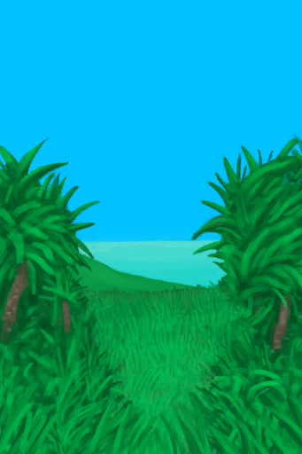
[To Western Grasslands(Eastern Grasslands)](Path_GrasslandsEToGrasslandsW.md)](Path_GrasslandsEToGrasslandsW.md)</td><td  style="text-align:left;vertical-align:top;"  >Go</td><td  style="text-align:left;vertical-align:top;"  >-4</td></tr><tr ><td  style="text-align:left;vertical-align:top;"  >[

[To Eastern Grasslands(Western Grasslands)](Path_GrasslandsWToGrasslandsE.md)](Path_GrasslandsWToGrasslandsE.md)</td><td  style="text-align:left;vertical-align:top;"  >Go</td><td  style="text-align:left;vertical-align:top;"  >-4</td></tr><tr ><td  style="text-align:left;vertical-align:top;"  >[

[To Jungle Path](Path_GrasslandsWToJungle.md)](Path_GrasslandsWToJungle.md)</td><td  style="text-align:left;vertical-align:top;"  >Go</td><td  style="text-align:left;vertical-align:top;"  >-4</td></tr><tr ><td  style="text-align:left;vertical-align:top;"  >[

[To Mangrove Forest(Western Grasslands)](Path_GrasslandsWToMangroves.md)](Path_GrasslandsWToMangroves.md)</td><td  style="text-align:left;vertical-align:top;"  >Go</td><td  style="text-align:left;vertical-align:top;"  >-4</td></tr><tr ><td  style="text-align:left;vertical-align:top;"  >[

[To Eastern Grasslands(Eastern Highlands)](Path_HighlandsEToGrasslandsE.md)](Path_HighlandsEToGrasslandsE.md)</td><td  style="text-align:left;vertical-align:top;"  >Go</td><td  style="text-align:left;vertical-align:top;"  >-4</td></tr><tr ><td  style="text-align:left;vertical-align:top;"  >[

[To Western Highlands](Path_HighlandsEToHighlandsW.md)](Path_HighlandsEToHighlandsW.md)</td><td  style="text-align:left;vertical-align:top;"  >Go</td><td  style="text-align:left;vertical-align:top;"  >-4</td></tr><tr ><td  style="text-align:left;vertical-align:top;"  >[

[To Volcano(Eastern Highlands)](Path_HighlandsEToVolcano.md)](Path_HighlandsEToVolcano.md)</td><td  style="text-align:left;vertical-align:top;"  >Go</td><td  style="text-align:left;vertical-align:top;"  >-4</td></tr><tr ><td  style="text-align:left;vertical-align:top;"  >[

[To Western Grasslands(Western Highlands)](Path_HighlandsWToGrasslandsW.md)](Path_HighlandsWToGrasslandsW.md)</td><td  style="text-align:left;vertical-align:top;"  >Go</td><td  style="text-align:left;vertical-align:top;"  >-4</td></tr><tr ><td  style="text-align:left;vertical-align:top;"  >[

[To Eastern Highlands(Western Highlands)](Path_HighlandsWToHighlandsE.md)](Path_HighlandsWToHighlandsE.md)</td><td  style="text-align:left;vertical-align:top;"  >Go</td><td  style="text-align:left;vertical-align:top;"  >-4</td></tr><tr ><td  style="text-align:left;vertical-align:top;"  >[
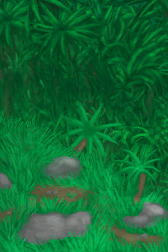
[To Jungle Highlands(Western Highlands)](Path_HighlandsWToJungleHighlands.md)](Path_HighlandsWToJungleHighlands.md)</td><td  style="text-align:left;vertical-align:top;"  >Go</td><td  style="text-align:left;vertical-align:top;"  >-4</td></tr><tr ><td  style="text-align:left;vertical-align:top;"  >[

[To Deep Jungle(Jungle Highlands)](Path_JungleHighlandsToDeepJungle.md)](Path_JungleHighlandsToDeepJungle.md)</td><td  style="text-align:left;vertical-align:top;"  >Go</td><td  style="text-align:left;vertical-align:top;"  >-4</td></tr><tr ><td  style="text-align:left;vertical-align:top;"  >[

[To Western Highlands(Jungle Highlands)](Path_JungleHighlandsToHighlandsW.md)](Path_JungleHighlandsToHighlandsW.md)</td><td  style="text-align:left;vertical-align:top;"  >Go</td><td  style="text-align:left;vertical-align:top;"  >-4</td></tr><tr ><td  style="text-align:left;vertical-align:top;"  >[
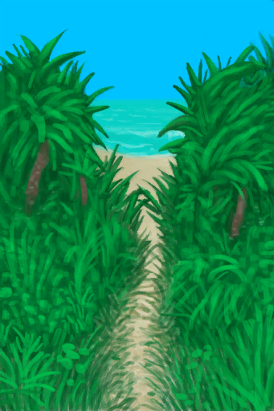
[To Bay(Jungle)](Path_JungleToBay.md)](Path_JungleToBay.md)</td><td  style="text-align:left;vertical-align:top;"  >Go</td><td  style="text-align:left;vertical-align:top;"  >-4</td></tr><tr ><td  style="text-align:left;vertical-align:top;"  >[

[To Western Grasslands(Jungle)](Path_JungleToGrasslandsW.md)](Path_JungleToGrasslandsW.md)</td><td  style="text-align:left;vertical-align:top;"  >Go</td><td  style="text-align:left;vertical-align:top;"  >-4</td></tr><tr ><td  style="text-align:left;vertical-align:top;"  >[

[To Jungle Outskirts(Jungle)](Path_JungleToOutskirts.md)](Path_JungleToOutskirts.md)</td><td  style="text-align:left;vertical-align:top;"  >Go</td><td  style="text-align:left;vertical-align:top;"  >-4</td></tr><tr ><td  style="text-align:left;vertical-align:top;"  >[

[To Wetlands(Jungle)](Path_JungleToWetlands.md)](Path_JungleToWetlands.md)</td><td  style="text-align:left;vertical-align:top;"  >Go</td><td  style="text-align:left;vertical-align:top;"  >-4</td></tr><tr ><td  style="text-align:left;vertical-align:top;"  >[
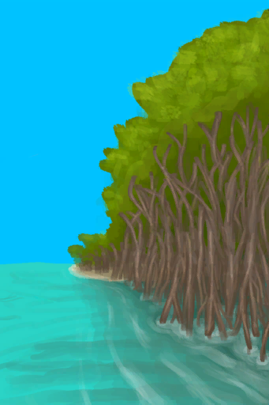
[To Bay](Path_MangrovesToBay.md)](Path_MangrovesToBay.md)</td><td  style="text-align:left;vertical-align:top;"  >Go</td><td  style="text-align:left;vertical-align:top;"  >-4</td></tr><tr ><td  style="text-align:left;vertical-align:top;"  >[

[To Desolate Beach](Path_MangrovesToDesolateBeach.md)](Path_MangrovesToDesolateBeach.md)</td><td  style="text-align:left;vertical-align:top;"  >Go</td><td  style="text-align:left;vertical-align:top;"  >-4</td></tr><tr ><td  style="text-align:left;vertical-align:top;"  >[

[To Beach(Outskirts)](Path_OutskirtsToBeach.md)](Path_OutskirtsToBeach.md)</td><td  style="text-align:left;vertical-align:top;"  >Go</td><td  style="text-align:left;vertical-align:top;"  >-4</td></tr><tr ><td  style="text-align:left;vertical-align:top;"  >[

[To Jungle Path](Path_OutskirtsToJungle.md)](Path_OutskirtsToJungle.md)</td><td  style="text-align:left;vertical-align:top;"  >Go</td><td  style="text-align:left;vertical-align:top;"  >-4</td></tr><tr ><td  style="text-align:left;vertical-align:top;"  >[
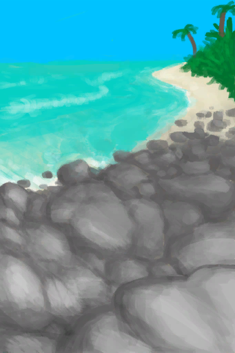
[To Beach(Rocks)](Path_RocksToBeach.md)](Path_RocksToBeach.md)</td><td  style="text-align:left;vertical-align:top;"  >Go</td><td  style="text-align:left;vertical-align:top;"  >-4</td></tr><tr ><td  style="text-align:left;vertical-align:top;"  >[

[To Deep Jungle(Secret Valley)](Path_ValleyToDeepJungle.md)](Path_ValleyToDeepJungle.md)</td><td  style="text-align:left;vertical-align:top;"  >Go</td><td  style="text-align:left;vertical-align:top;"  >-4</td></tr><tr ><td  style="text-align:left;vertical-align:top;"  >[

[To Acid Lake(Volcano)](Path_VolcanoToAcidLake.md)](Path_VolcanoToAcidLake.md)</td><td  style="text-align:left;vertical-align:top;"  >Go</td><td  style="text-align:left;vertical-align:top;"  >-4</td></tr><tr ><td  style="text-align:left;vertical-align:top;"  >[

[To Desolate Beach(Volcano)](Path_VolcanoToDesolateBeach.md)](Path_VolcanoToDesolateBeach.md)</td><td  style="text-align:left;vertical-align:top;"  >Go</td><td  style="text-align:left;vertical-align:top;"  >-4</td></tr><tr ><td  style="text-align:left;vertical-align:top;"  >[

[To Eastern Highlands(Volcano)](Path_VolcanoToHighlandsE.md)](Path_VolcanoToHighlandsE.md)</td><td  style="text-align:left;vertical-align:top;"  >Go</td><td  style="text-align:left;vertical-align:top;"  >-4</td></tr><tr ><td  style="text-align:left;vertical-align:top;"  >[

[To Deep Jungle(Wetlands)](Path_WetlandsToDeepJungle.md)](Path_WetlandsToDeepJungle.md)</td><td  style="text-align:left;vertical-align:top;"  >Go</td><td  style="text-align:left;vertical-align:top;"  >-4</td></tr><tr ><td  style="text-align:left;vertical-align:top;"  >[

[To Jungle Path(Wetlands)](Path_WetlandsToJungle.md)](Path_WetlandsToJungle.md)</td><td  style="text-align:left;vertical-align:top;"  >Go</td><td  style="text-align:left;vertical-align:top;"  >-4</td></tr><tr ><td  style="text-align:left;vertical-align:top;"  >[
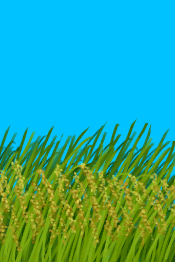
[Rice](RicePlant.md)](RicePlant.md)</td><td  style="text-align:left;vertical-align:top;"  >Harvest ** With：**[“Cutter”](tag_Cutter.md)</td><td  style="text-align:left;vertical-align:top;"  >-4</td></tr><tr ><td  style="text-align:left;vertical-align:top;"  >[
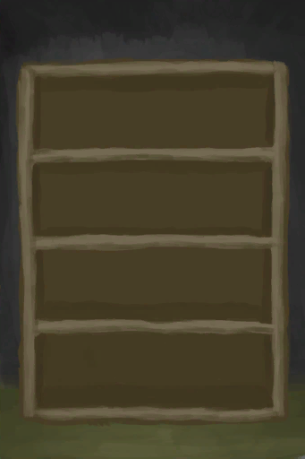
[Bookshelf(BluePrint)](Bp_Bookshelf.md)](Bp_Bookshelf.md)</td><td  style="text-align:left;vertical-align:top;"  >Craft BluePrint</td><td  style="text-align:left;vertical-align:top;"  >-5</td></tr><tr ><td  style="text-align:left;vertical-align:top;"  >[
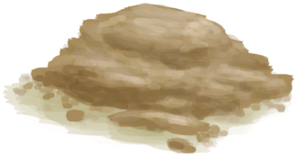
[Mortar(BluePrint)](Bp_Mortar.md)](Bp_Mortar.md)</td><td  style="text-align:left;vertical-align:top;"  >Craft BluePrint</td><td  style="text-align:left;vertical-align:top;"  >-5</td></tr><tr ><td  style="text-align:left;vertical-align:top;"  >[

[Shelf(BluePrint)](Bp_Shelf.md)](Bp_Shelf.md)</td><td  style="text-align:left;vertical-align:top;"  >Craft BluePrint</td><td  style="text-align:left;vertical-align:top;"  >-5</td></tr><tr ><td  style="text-align:left;vertical-align:top;"  >[

[Drum(Event)](Event_DrumMenu.md)](Event_DrumMenu.md)(未实装)</td><td  style="text-align:left;vertical-align:top;"  >Intense Rythm</td><td  style="text-align:left;vertical-align:top;"  >-5 / /TP</td></tr><tr ><td  style="text-align:left;vertical-align:top;"  >[

[Drum](Drum.md)](Drum.md)</td><td  style="text-align:left;vertical-align:top;"  >Intense Rhythm</td><td  style="text-align:left;vertical-align:top;"  >-5 / /TP</td></tr><tr ><td  style="text-align:left;vertical-align:top;"  >[

[Lizard Drum](LizardDrum.md)](LizardDrum.md)</td><td  style="text-align:left;vertical-align:top;"  >Intense Rhythm</td><td  style="text-align:left;vertical-align:top;"  >-5 / /TP</td></tr><tr ><td  style="text-align:left;vertical-align:top;"  >[

[Lizard Drum](LizardDrum.md)](LizardDrum.md)</td><td  style="text-align:left;vertical-align:top;"  >Summoning Rhythm</td><td  style="text-align:left;vertical-align:top;"  >-5 / /TP</td></tr><tr ><td  style="text-align:left;vertical-align:top;"  >[

[Narrow Passage(High Chamber)](CrystalChamberEntranceClosed.md)](CrystalChamberEntranceClosed.md)</td><td  style="text-align:left;vertical-align:top;"  >Dig ** With：**[“Hammer”](tag_Hammer.md)</td><td  style="text-align:left;vertical-align:top;"  >-5</td></tr><tr ><td  style="text-align:left;vertical-align:top;"  >[

[Narrow Passage(Damp Chamber)](DarkCaveCaveEntranceClosed.md)](DarkCaveCaveEntranceClosed.md)</td><td  style="text-align:left;vertical-align:top;"  >Dig ** With：**[“Hammer”](tag_Hammer.md)</td><td  style="text-align:left;vertical-align:top;"  >-5</td></tr><tr ><td  style="text-align:left;vertical-align:top;"  >[

[Narrow Passage(High Chamber)](DarkChamberCaveEntranceClosed.md)](DarkChamberCaveEntranceClosed.md)</td><td  style="text-align:left;vertical-align:top;"  >Dig ** With：**[“Hammer”](tag_Hammer.md)</td><td  style="text-align:left;vertical-align:top;"  >-5</td></tr><tr ><td  style="text-align:left;vertical-align:top;"  >[

[Narrow Passage(High Chamber)](FloodedChamberEntranceClosed.md)](FloodedChamberEntranceClosed.md)</td><td  style="text-align:left;vertical-align:top;"  >Dig ** With：**[“Hammer”](tag_Hammer.md)</td><td  style="text-align:left;vertical-align:top;"  >-5</td></tr><tr ><td  style="text-align:left;vertical-align:top;"  >[

[Narrow Passage(Tunnel)](HighChamberEntranceClosed.md)](HighChamberEntranceClosed.md)</td><td  style="text-align:left;vertical-align:top;"  >Dig ** With：**[“Hammer”](tag_Hammer.md)</td><td  style="text-align:left;vertical-align:top;"  >-5</td></tr><tr ><td  style="text-align:left;vertical-align:top;"  >[
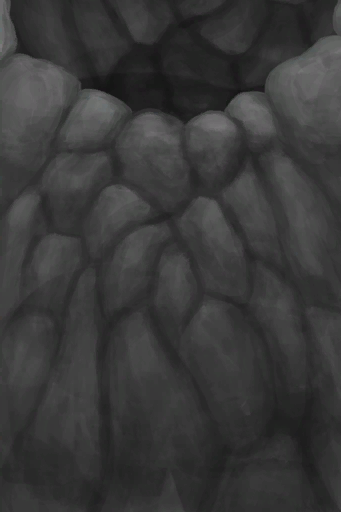
[Shaft](ShaftFloodedChamberToCrystalChamber.md)](ShaftFloodedChamberToCrystalChamber.md)</td><td  style="text-align:left;vertical-align:top;"  >Climb Up</td><td  style="text-align:left;vertical-align:top;"  >-5</td></tr><tr ><td  style="text-align:left;vertical-align:top;"  >[

[Shaft](ShaftLowChamberToMidChamber.md)](ShaftLowChamberToMidChamber.md)</td><td  style="text-align:left;vertical-align:top;"  >Climb Up</td><td  style="text-align:left;vertical-align:top;"  >-5</td></tr><tr ><td  style="text-align:left;vertical-align:top;"  >[

[Shaft](ShaftMidChamberToHighChamber.md)](ShaftMidChamberToHighChamber.md)</td><td  style="text-align:left;vertical-align:top;"  >Climb Up</td><td  style="text-align:left;vertical-align:top;"  >-5</td></tr><tr ><td  style="text-align:left;vertical-align:top;"  >[

[Collapsed Tunnel Entrance(Eastern Highlands)](TunnelEntranceClosed.md)](TunnelEntranceClosed.md)</td><td  style="text-align:left;vertical-align:top;"  >Dig</td><td  style="text-align:left;vertical-align:top;"  >-5</td></tr><tr ><td  style="text-align:left;vertical-align:top;"  >[

[Underwater Cave](UnderwaterEntrance.md)](UnderwaterEntrance.md)</td><td  style="text-align:left;vertical-align:top;"  >Enter</td><td  style="text-align:left;vertical-align:top;"  >-5</td></tr><tr ><td  style="text-align:left;vertical-align:top;"  >[

[Underwater Exit](UnderwaterExit.md)](UnderwaterExit.md)</td><td  style="text-align:left;vertical-align:top;"  >Exit</td><td  style="text-align:left;vertical-align:top;"  >-5</td></tr><tr ><td  style="text-align:left;vertical-align:top;"  >[

[Nipa Fruit](NipaFruit.md)](NipaFruit.md)</td><td  style="text-align:left;vertical-align:top;"  >Extract Seeds ** With：**[“Cutter”](tag_Cutter.md)</td><td  style="text-align:left;vertical-align:top;"  >-6</td></tr><tr ><td  style="text-align:left;vertical-align:top;"  >[

[Shaft](ShaftFloodedChamberToCrystalChamber.md)](ShaftFloodedChamberToCrystalChamber.md)</td><td  style="text-align:left;vertical-align:top;"  >Train Climbing</td><td  style="text-align:left;vertical-align:top;"  >-6</td></tr><tr ><td  style="text-align:left;vertical-align:top;"  >[

[Shaft](ShaftLowChamberToMidChamber.md)](ShaftLowChamberToMidChamber.md)</td><td  style="text-align:left;vertical-align:top;"  >Train Climbing</td><td  style="text-align:left;vertical-align:top;"  >-6</td></tr><tr ><td  style="text-align:left;vertical-align:top;"  >[

[To Jungle Highlands(Secret Cove)](Path_CoveToJungleHighlands.md)](Path_CoveToJungleHighlands.md)</td><td  style="text-align:left;vertical-align:top;"  >Train Climbing</td><td  style="text-align:left;vertical-align:top;"  >-6</td></tr><tr ><td  style="text-align:left;vertical-align:top;"  >[

[To Eastern Highlands(Eastern Grasslands)](Path_GrasslandsEToHighlandsE.md)](Path_GrasslandsEToHighlandsE.md)</td><td  style="text-align:left;vertical-align:top;"  >Go</td><td  style="text-align:left;vertical-align:top;"  >-6</td></tr><tr ><td  style="text-align:left;vertical-align:top;"  >[

[To Western Highlands(Western Grasslands)](Path_GrasslandsWToHighlandsW.md)](Path_GrasslandsWToHighlandsW.md)</td><td  style="text-align:left;vertical-align:top;"  >Go</td><td  style="text-align:left;vertical-align:top;"  >-6</td></tr><tr ><td  style="text-align:left;vertical-align:top;"  >[

[To Grasslands(Mangrove Forest)](Path_MangrovesToGrasslandsW.md)](Path_MangrovesToGrasslandsW.md)</td><td  style="text-align:left;vertical-align:top;"  >Go</td><td  style="text-align:left;vertical-align:top;"  >-6</td></tr><tr ><td  style="text-align:left;vertical-align:top;"  >[

[To Jungle Highlands](Path_ValleyToJungleHighlands.md)](Path_ValleyToJungleHighlands.md)(未实装)</td><td  style="text-align:left;vertical-align:top;"  >Train Climbing</td><td  style="text-align:left;vertical-align:top;"  >-6</td></tr><tr ><td  style="text-align:left;vertical-align:top;"  >[

[To Jungle Highlands(Wetlands)](Path_WetlandsToJungleHighlands.md)](Path_WetlandsToJungleHighlands.md)</td><td  style="text-align:left;vertical-align:top;"  >Train Climbing</td><td  style="text-align:left;vertical-align:top;"  >-6</td></tr><tr ><td  style="text-align:left;vertical-align:top;"  >[

[Large Tree](LargeTree.md)](LargeTree.md)</td><td  style="text-align:left;vertical-align:top;"  >Cut Tree ** With：**[“Hammer”](tag_AxeAdv.md)</td><td  style="text-align:left;vertical-align:top;"  >-6</td></tr><tr ><td  style="text-align:left;vertical-align:top;"  >[

[Felled Large Tree](LargeTreeFelled.md)](LargeTreeFelled.md)</td><td  style="text-align:left;vertical-align:top;"  >Clean Log of braches ** With：**[“Axe”](tag_Axe.md)</td><td  style="text-align:left;vertical-align:top;"  >-6</td></tr><tr ><td  style="text-align:left;vertical-align:top;"  >[

[Cleared Mango Tree](MangoTreeCleared.md)](MangoTreeCleared.md)</td><td  style="text-align:left;vertical-align:top;"  >Cut Down Tree ** With：**[“Hammer”](tag_AxeAdv.md)</td><td  style="text-align:left;vertical-align:top;"  >-6</td></tr><tr ><td  style="text-align:left;vertical-align:top;"  >[

[Cleared Palm Tree](PalmTreeCleared.md)](PalmTreeCleared.md)</td><td  style="text-align:left;vertical-align:top;"  >Train Climbing</td><td  style="text-align:left;vertical-align:top;"  >-6</td></tr><tr ><td  style="text-align:left;vertical-align:top;"  >[

[Cleared Palm Tree](PalmTreeCleared.md)](PalmTreeCleared.md)</td><td  style="text-align:left;vertical-align:top;"  >Cut Down ** With：**[“Hammer”](tag_AxeAdv.md)</td><td  style="text-align:left;vertical-align:top;"  >-6</td></tr><tr ><td  style="text-align:left;vertical-align:top;"  >[

[Felled Palm Tree](PalmTreeFelled.md)](PalmTreeFelled.md)</td><td  style="text-align:left;vertical-align:top;"  >Clear ** With：**[“Axe”](tag_Axe.md)</td><td  style="text-align:left;vertical-align:top;"  >-6</td></tr><tr ><td  style="text-align:left;vertical-align:top;"  >[

[Palm Tree](PalmTreeNew.md)](PalmTreeNew.md)</td><td  style="text-align:left;vertical-align:top;"  >Climb</td><td  style="text-align:left;vertical-align:top;"  >-6</td></tr><tr ><td  style="text-align:left;vertical-align:top;"  >[

[Palm Tree](PalmTreeNew.md)](PalmTreeNew.md)</td><td  style="text-align:left;vertical-align:top;"  >Train Climbing</td><td  style="text-align:left;vertical-align:top;"  >-6</td></tr><tr ><td  style="text-align:left;vertical-align:top;"  >[

[Palm Tree](PalmTreeNew.md)](PalmTreeNew.md)</td><td  style="text-align:left;vertical-align:top;"  >Cut Down ** With：**[“Hammer”](tag_AxeAdv.md)</td><td  style="text-align:left;vertical-align:top;"  >-6</td></tr><tr ><td  style="text-align:left;vertical-align:top;"  >[

[Palm Tree](PalmTreeNewMultiEventOld.md)](PalmTreeNewMultiEventOld.md)</td><td  style="text-align:left;vertical-align:top;"  >Climb</td><td  style="text-align:left;vertical-align:top;"  >-6</td></tr><tr ><td  style="text-align:left;vertical-align:top;"  >[

[Palm Tree](PalmTreeNewMultiEventOld.md)](PalmTreeNewMultiEventOld.md)</td><td  style="text-align:left;vertical-align:top;"  >Train Climbing</td><td  style="text-align:left;vertical-align:top;"  >-6</td></tr><tr ><td  style="text-align:left;vertical-align:top;"  >[

[Palm Tree](PalmTreeNewMultiEventOld.md)](PalmTreeNewMultiEventOld.md)</td><td  style="text-align:left;vertical-align:top;"  >Cut Down ** With：**[“Hammer”](tag_AxeAdv.md)</td><td  style="text-align:left;vertical-align:top;"  >-6</td></tr><tr ><td  style="text-align:left;vertical-align:top;"  >[

[Palm Tree](PalmTreeOld.md)](PalmTreeOld.md)(未实装)</td><td  style="text-align:left;vertical-align:top;"  >Climb</td><td  style="text-align:left;vertical-align:top;"  >-6</td></tr><tr ><td  style="text-align:left;vertical-align:top;"  >[

[Palm Tree](PalmTreeOld.md)](PalmTreeOld.md)(未实装)</td><td  style="text-align:left;vertical-align:top;"  >Train Climbing</td><td  style="text-align:left;vertical-align:top;"  >-6</td></tr><tr ><td  style="text-align:left;vertical-align:top;"  >[

[Palm Tree](PalmTreeOld.md)](PalmTreeOld.md)(未实装)</td><td  style="text-align:left;vertical-align:top;"  >Cut Down ** With：**[“Hammer”](tag_AxeAdv.md)</td><td  style="text-align:left;vertical-align:top;"  >-6</td></tr><tr ><td  style="text-align:left;vertical-align:top;"  >[

[Sap Station](PalmTreeSapStation.md)](PalmTreeSapStation.md)(未实装)</td><td  style="text-align:left;vertical-align:top;"  >Climb</td><td  style="text-align:left;vertical-align:top;"  >-6</td></tr><tr ><td  style="text-align:left;vertical-align:top;"  >[

[Sap Station](PalmTreeSapStation.md)](PalmTreeSapStation.md)(未实装)</td><td  style="text-align:left;vertical-align:top;"  >Train Climbing</td><td  style="text-align:left;vertical-align:top;"  >-6</td></tr><tr ><td  style="text-align:left;vertical-align:top;"  >[

[Sap Station](PalmTreeSapStation.md)](PalmTreeSapStation.md)(未实装)</td><td  style="text-align:left;vertical-align:top;"  >Cut Down ** With：**[“Axe”](tag_Axe.md)</td><td  style="text-align:left;vertical-align:top;"  >-6</td></tr><tr ><td  style="text-align:left;vertical-align:top;"  >[

[Empty Sap Station(Empty)](PalmTreeSapStationEmpty.md)](PalmTreeSapStationEmpty.md)(未实装)</td><td  style="text-align:left;vertical-align:top;"  >Climb</td><td  style="text-align:left;vertical-align:top;"  >-6</td></tr><tr ><td  style="text-align:left;vertical-align:top;"  >[

[Empty Sap Station(Empty)](PalmTreeSapStationEmpty.md)](PalmTreeSapStationEmpty.md)(未实装)</td><td  style="text-align:left;vertical-align:top;"  >Train Climbing</td><td  style="text-align:left;vertical-align:top;"  >-6</td></tr><tr ><td  style="text-align:left;vertical-align:top;"  >[

[Empty Sap Station(Empty)](PalmTreeSapStationEmpty.md)](PalmTreeSapStationEmpty.md)(未实装)</td><td  style="text-align:left;vertical-align:top;"  >Cut Down ** With：**[“Axe”](tag_Axe.md)</td><td  style="text-align:left;vertical-align:top;"  >-6</td></tr><tr ><td  style="text-align:left;vertical-align:top;"  >[

[Palm Tree](PalmTree_IH.md)](PalmTree_IH.md)(未实装)</td><td  style="text-align:left;vertical-align:top;"  >Climb</td><td  style="text-align:left;vertical-align:top;"  >-6</td></tr><tr ><td  style="text-align:left;vertical-align:top;"  >[

[Palm Tree](PalmTree_Unique.md)](PalmTree_Unique.md)(未实装)</td><td  style="text-align:left;vertical-align:top;"  >Climb fo Coconuts</td><td  style="text-align:left;vertical-align:top;"  >-6</td></tr><tr ><td  style="text-align:left;vertical-align:top;"  >[

[Palm Tree](PalmTree_Unique.md)](PalmTree_Unique.md)(未实装)</td><td  style="text-align:left;vertical-align:top;"  >Climb for Coconuts</td><td  style="text-align:left;vertical-align:top;"  >-6</td></tr><tr ><td  style="text-align:left;vertical-align:top;"  >[

[Sago Palm](SagoPalm.md)](SagoPalm.md)</td><td  style="text-align:left;vertical-align:top;"  >Cut Tree ** With：**[“Axe”](tag_Axe.md)</td><td  style="text-align:left;vertical-align:top;"  >-6</td></tr><tr ><td  style="text-align:left;vertical-align:top;"  >[

[Felled Sago Palm](SagoPalmFelled.md)](SagoPalmFelled.md)</td><td  style="text-align:left;vertical-align:top;"  >Split Log ** With：**[“Axe”](tag_Axe.md)</td><td  style="text-align:left;vertical-align:top;"  >-6</td></tr><tr ><td  style="text-align:left;vertical-align:top;"  >[

[Cleared Tropical Almond Tree](TropicalAlmondTreeCleared.md)](TropicalAlmondTreeCleared.md)</td><td  style="text-align:left;vertical-align:top;"  >Cut Down Tree ** With：**[“Hammer”](tag_AxeAdv.md)</td><td  style="text-align:left;vertical-align:top;"  >-6</td></tr><tr ><td  style="text-align:left;vertical-align:top;"  >[

[Felled Tropical Almond Tree](TropicalAlmondTreeFelled.md)](TropicalAlmondTreeFelled.md)(未实装)</td><td  style="text-align:left;vertical-align:top;"  >Clean Branches ** With：**[“Axe”](tag_Axe.md)</td><td  style="text-align:left;vertical-align:top;"  >-6</td></tr><tr ><td  style="text-align:left;vertical-align:top;"  >[

[Seagull Nest](SeagullNest.md)](SeagullNest.md)</td><td  style="text-align:left;vertical-align:top;"  >Climb</td><td  style="text-align:left;vertical-align:top;"  >-6</td></tr><tr ><td  style="text-align:left;vertical-align:top;"  >[

[Broom](Broom.md)](Broom.md)</td><td  style="text-align:left;vertical-align:top;"  >Train</td><td  style="text-align:left;vertical-align:top;"  >-8</td></tr><tr ><td  style="text-align:left;vertical-align:top;"  >[

[Copper Spear](SpearCopper.md)](SpearCopper.md)</td><td  style="text-align:left;vertical-align:top;"  >Train</td><td  style="text-align:left;vertical-align:top;"  >-8</td></tr><tr ><td  style="text-align:left;vertical-align:top;"  >[

[Fishing Spear](SpearFishing.md)](SpearFishing.md)</td><td  style="text-align:left;vertical-align:top;"  >Train</td><td  style="text-align:left;vertical-align:top;"  >-8</td></tr><tr ><td  style="text-align:left;vertical-align:top;"  >[

[Flint Spear](SpearFlint.md)](SpearFlint.md)</td><td  style="text-align:left;vertical-align:top;"  >Train</td><td  style="text-align:left;vertical-align:top;"  >-8</td></tr><tr ><td  style="text-align:left;vertical-align:top;"  >[

[Obsidian Spear](SpearObsidian.md)](SpearObsidian.md)</td><td  style="text-align:left;vertical-align:top;"  >Train</td><td  style="text-align:left;vertical-align:top;"  >-8</td></tr><tr ><td  style="text-align:left;vertical-align:top;"  >[

[Rustic Spear](SpearRustic.md)](SpearRustic.md)</td><td  style="text-align:left;vertical-align:top;"  >Train</td><td  style="text-align:left;vertical-align:top;"  >-8</td></tr><tr ><td  style="text-align:left;vertical-align:top;"  >[

[Scrap Spear](SpearScrap.md)](SpearScrap.md)</td><td  style="text-align:left;vertical-align:top;"  >Train</td><td  style="text-align:left;vertical-align:top;"  >-8</td></tr><tr ><td  style="text-align:left;vertical-align:top;"  >[

[Debris(Mud Hut)](Debris.md)](Debris.md)</td><td  style="text-align:left;vertical-align:top;"  >Clear</td><td  style="text-align:left;vertical-align:top;"  >-8</td></tr><tr ><td  style="text-align:left;vertical-align:top;"  >[

[Floating Debris](FloatingDebris.md)](FloatingDebris.md)</td><td  style="text-align:left;vertical-align:top;"  >Harvest</td><td  style="text-align:left;vertical-align:top;"  >-8</td></tr><tr ><td  style="text-align:left;vertical-align:top;"  >[

[Large Tree](LargeTree.md)](LargeTree.md)</td><td  style="text-align:left;vertical-align:top;"  >Cut Tree ** With：**[Stone Axe](StoneAxe.md)</td><td  style="text-align:left;vertical-align:top;"  >-8</td></tr><tr ><td  style="text-align:left;vertical-align:top;"  >[

[Felled Large Tree](LargeTreeFelled.md)](LargeTreeFelled.md)</td><td  style="text-align:left;vertical-align:top;"  >Clean Log of braches ** With：**[Stone Axe](StoneAxe.md)</td><td  style="text-align:left;vertical-align:top;"  >-8</td></tr><tr ><td  style="text-align:left;vertical-align:top;"  >[

[Cleared Mango Tree](MangoTreeCleared.md)](MangoTreeCleared.md)</td><td  style="text-align:left;vertical-align:top;"  >Cut Down Tree ** With：**[Stone Axe](StoneAxe.md)</td><td  style="text-align:left;vertical-align:top;"  >-8</td></tr><tr ><td  style="text-align:left;vertical-align:top;"  >[

[Cleared Palm Tree](PalmTreeCleared.md)](PalmTreeCleared.md)</td><td  style="text-align:left;vertical-align:top;"  >Cut Down ** With：**[Stone Axe](StoneAxe.md)</td><td  style="text-align:left;vertical-align:top;"  >-8</td></tr><tr ><td  style="text-align:left;vertical-align:top;"  >[

[Felled Palm Tree](PalmTreeFelled.md)](PalmTreeFelled.md)</td><td  style="text-align:left;vertical-align:top;"  >Clear ** With：**[Stone Axe](StoneAxe.md)</td><td  style="text-align:left;vertical-align:top;"  >-8</td></tr><tr ><td  style="text-align:left;vertical-align:top;"  >[

[Palm Tree](PalmTreeNew.md)](PalmTreeNew.md)</td><td  style="text-align:left;vertical-align:top;"  >Cut Down ** With：**[Stone Axe](StoneAxe.md)</td><td  style="text-align:left;vertical-align:top;"  >-8</td></tr><tr ><td  style="text-align:left;vertical-align:top;"  >[

[Palm Tree](PalmTreeNewMultiEventOld.md)](PalmTreeNewMultiEventOld.md)</td><td  style="text-align:left;vertical-align:top;"  >Cut Down ** With：**[Stone Axe](StoneAxe.md)</td><td  style="text-align:left;vertical-align:top;"  >-8</td></tr><tr ><td  style="text-align:left;vertical-align:top;"  >[

[Palm Tree](PalmTreeOld.md)](PalmTreeOld.md)(未实装)</td><td  style="text-align:left;vertical-align:top;"  >Cut Down ** With：**[Stone Axe](StoneAxe.md)</td><td  style="text-align:left;vertical-align:top;"  >-8</td></tr><tr ><td  style="text-align:left;vertical-align:top;"  >[

[Sap Station](PalmTreeSapStation.md)](PalmTreeSapStation.md)(未实装)</td><td  style="text-align:left;vertical-align:top;"  >Cut Down ** With：**[Stone Axe](StoneAxe.md)</td><td  style="text-align:left;vertical-align:top;"  >-8</td></tr><tr ><td  style="text-align:left;vertical-align:top;"  >[

[Empty Sap Station(Empty)](PalmTreeSapStationEmpty.md)](PalmTreeSapStationEmpty.md)(未实装)</td><td  style="text-align:left;vertical-align:top;"  >Cut Down ** With：**[Stone Axe](StoneAxe.md)</td><td  style="text-align:left;vertical-align:top;"  >-8</td></tr><tr ><td  style="text-align:left;vertical-align:top;"  >[

[Sago Palm](SagoPalm.md)](SagoPalm.md)</td><td  style="text-align:left;vertical-align:top;"  >Cut Tree ** With：**[Stone Axe](StoneAxe.md)</td><td  style="text-align:left;vertical-align:top;"  >-8</td></tr><tr ><td  style="text-align:left;vertical-align:top;"  >[

[Felled Sago Palm](SagoPalmFelled.md)](SagoPalmFelled.md)</td><td  style="text-align:left;vertical-align:top;"  >Split Log ** With：**[Stone Axe](StoneAxe.md)</td><td  style="text-align:left;vertical-align:top;"  >-8</td></tr><tr ><td  style="text-align:left;vertical-align:top;"  >[

[Cleared Tropical Almond Tree](TropicalAlmondTreeCleared.md)](TropicalAlmondTreeCleared.md)</td><td  style="text-align:left;vertical-align:top;"  >Cut Down Tree ** With：**[Stone Axe](StoneAxe.md)</td><td  style="text-align:left;vertical-align:top;"  >-8</td></tr><tr ><td  style="text-align:left;vertical-align:top;"  >[

[Felled Tropical Almond Tree](TropicalAlmondTreeFelled.md)](TropicalAlmondTreeFelled.md)(未实装)</td><td  style="text-align:left;vertical-align:top;"  >Clean Branches ** With：**[Stone Axe](StoneAxe.md)</td><td  style="text-align:left;vertical-align:top;"  >-8</td></tr><tr ><td  style="text-align:left;vertical-align:top;"  >[

[I'm not going to make it....(Event)](Event_SwimFail.md)](Event_SwimFail.md)</td><td  style="text-align:left;vertical-align:top;"  >Swim back</td><td  style="text-align:left;vertical-align:top;"  >-10</td></tr><tr ><td  style="text-align:left;vertical-align:top;"  >[

[Dog Friend](DogFriend.md)](DogFriend.md)</td><td  style="text-align:left;vertical-align:top;"  >Play</td><td  style="text-align:left;vertical-align:top;"  >-10</td></tr><tr ><td  style="text-align:left;vertical-align:top;"  >[

[Secret Cove](Path_BirdRockToCove.md)](Path_BirdRockToCove.md)</td><td  style="text-align:left;vertical-align:top;"  >Swim</td><td  style="text-align:left;vertical-align:top;"  >-10</td></tr><tr ><td  style="text-align:left;vertical-align:top;"  >[

[Desolate Beach(Bird Rock)](Path_BirdRockToDesolateBeach.md)](Path_BirdRockToDesolateBeach.md)</td><td  style="text-align:left;vertical-align:top;"  >Swim</td><td  style="text-align:left;vertical-align:top;"  >-10</td></tr><tr ><td  style="text-align:left;vertical-align:top;"  >[

[Rocks(Bird Rock)](Path_BirdRockToRocks.md)](Path_BirdRockToRocks.md)</td><td  style="text-align:left;vertical-align:top;"  >Swim</td><td  style="text-align:left;vertical-align:top;"  >-10</td></tr><tr ><td  style="text-align:left;vertical-align:top;"  >[

[Bird Rock(Secret Cove)](Path_CoveToBirdRock.md)](Path_CoveToBirdRock.md)</td><td  style="text-align:left;vertical-align:top;"  >Swim</td><td  style="text-align:left;vertical-align:top;"  >-10</td></tr><tr ><td  style="text-align:left;vertical-align:top;"  >[

[Bird Rock(Desolate Beach)](Path_DesolateBeachToBirdRock.md)](Path_DesolateBeachToBirdRock.md)</td><td  style="text-align:left;vertical-align:top;"  >Swim</td><td  style="text-align:left;vertical-align:top;"  >-10</td></tr><tr ><td  style="text-align:left;vertical-align:top;"  >[

[Bird Rock](Path_RocksToBirdRock.md)](Path_RocksToBirdRock.md)</td><td  style="text-align:left;vertical-align:top;"  >Swim</td><td  style="text-align:left;vertical-align:top;"  >-10</td></tr><tr ><td  style="text-align:left;vertical-align:top;"  >[

[Seawater(Flooded Chamber)](Sea_Cave.md)](Sea_Cave.md)</td><td  style="text-align:left;vertical-align:top;"  >Dive</td><td  style="text-align:left;vertical-align:top;"  >-10</td></tr><tr ><td  style="text-align:left;vertical-align:top;"  >[

[Shaft](ShaftCrystalChamberToFloodedChamber.md)](ShaftCrystalChamberToFloodedChamber.md)</td><td  style="text-align:left;vertical-align:top;"  >Climb Down</td><td  style="text-align:left;vertical-align:top;"  >-10</td></tr><tr ><td  style="text-align:left;vertical-align:top;"  >[

[Shaft(High Chamber)](ShaftHighChamberToMidChamber.md)](ShaftHighChamberToMidChamber.md)</td><td  style="text-align:left;vertical-align:top;"  >Climb Down</td><td  style="text-align:left;vertical-align:top;"  >-10</td></tr><tr ><td  style="text-align:left;vertical-align:top;"  >[

[Shaft(High Chamber)](ShaftMidChamberToLowChamber.md)](ShaftMidChamberToLowChamber.md)</td><td  style="text-align:left;vertical-align:top;"  >Climb Down</td><td  style="text-align:left;vertical-align:top;"  >-10</td></tr><tr ><td  style="text-align:left;vertical-align:top;"  >[

[Sea(Atoll)](Sea_Atoll.md)](Sea_Atoll.md)</td><td  style="text-align:left;vertical-align:top;"  >Dive</td><td  style="text-align:left;vertical-align:top;"  >-10</td></tr><tr ><td  style="text-align:left;vertical-align:top;"  >[

[Sea(Bay)](Sea_Bay.md)](Sea_Bay.md)</td><td  style="text-align:left;vertical-align:top;"  >Dive</td><td  style="text-align:left;vertical-align:top;"  >-10</td></tr><tr ><td  style="text-align:left;vertical-align:top;"  >[

[Sea(Beach)](Sea_Beach.md)](Sea_Beach.md)</td><td  style="text-align:left;vertical-align:top;"  >Dive</td><td  style="text-align:left;vertical-align:top;"  >-10</td></tr><tr ><td  style="text-align:left;vertical-align:top;"  >[

[Sea(Secret Cove)](Sea_Cove.md)](Sea_Cove.md)</td><td  style="text-align:left;vertical-align:top;"  >Dive</td><td  style="text-align:left;vertical-align:top;"  >-10</td></tr><tr ><td  style="text-align:left;vertical-align:top;"  >[

[Sea(Desolate Beach)](Sea_DesolateBeach.md)](Sea_DesolateBeach.md)</td><td  style="text-align:left;vertical-align:top;"  >Dive</td><td  style="text-align:left;vertical-align:top;"  >-10</td></tr><tr ><td  style="text-align:left;vertical-align:top;"  >[

[Sea(Mangrove Forest)](Sea_Mangroves.md)](Sea_Mangroves.md)</td><td  style="text-align:left;vertical-align:top;"  >Dive</td><td  style="text-align:left;vertical-align:top;"  >-10</td></tr><tr ><td  style="text-align:left;vertical-align:top;"  >[

[Sea](Sea_Raft.md)](Sea_Raft.md)</td><td  style="text-align:left;vertical-align:top;"  >Dive</td><td  style="text-align:left;vertical-align:top;"  >-10</td></tr><tr ><td  style="text-align:left;vertical-align:top;"  >[

[Sea(Bird Rock)](Sea_Rocks.md)](Sea_Rocks.md)</td><td  style="text-align:left;vertical-align:top;"  >Dive</td><td  style="text-align:left;vertical-align:top;"  >-10</td></tr><tr ><td  style="text-align:left;vertical-align:top;"  >[

[To Secret Cove(Jungle Highlands)](Path_JungleHighlandsToCove.md)](Path_JungleHighlandsToCove.md)</td><td  style="text-align:left;vertical-align:top;"  >Climb Down</td><td  style="text-align:left;vertical-align:top;"  >-10</td></tr><tr ><td  style="text-align:left;vertical-align:top;"  >[

[Half Log](HalfLog.md)](HalfLog.md)</td><td  style="text-align:left;vertical-align:top;"  >Cut into Wood ** With：**[“Axe”](tag_Axe.md)</td><td  style="text-align:left;vertical-align:top;"  >-12</td></tr><tr ><td  style="text-align:left;vertical-align:top;"  >[

[Log](Log.md)](Log.md)</td><td  style="text-align:left;vertical-align:top;"  >Split into two ** With：**[“Axe”](tag_Axe.md)</td><td  style="text-align:left;vertical-align:top;"  >-12</td></tr><tr ><td  style="text-align:left;vertical-align:top;"  >[

[Watering Trough](WateringTrough.md)](WateringTrough.md)</td><td  style="text-align:left;vertical-align:top;"  >Demolish ** With：**[“Hammer”](tag_Hammer.md)</td><td  style="text-align:left;vertical-align:top;"  >-15</td></tr><tr ><td  style="text-align:left;vertical-align:top;"  >[

[Narrow Tunnel(High Chamber)](NarrowTunnelEntrance.md)](NarrowTunnelEntrance.md)</td><td  style="text-align:left;vertical-align:top;"  >Enter</td><td  style="text-align:left;vertical-align:top;"  >-15</td></tr><tr ><td  style="text-align:left;vertical-align:top;"  >[

[Low Chamber](NarrowTunnelExit.md)](NarrowTunnelExit.md)</td><td  style="text-align:left;vertical-align:top;"  >Enter</td><td  style="text-align:left;vertical-align:top;"  >-15</td></tr><tr ><td  style="text-align:left;vertical-align:top;"  >[

[Half Log](HalfLog.md)](HalfLog.md)</td><td  style="text-align:left;vertical-align:top;"  >Cut into Wood ** With：**[Stone Axe](StoneAxe.md)</td><td  style="text-align:left;vertical-align:top;"  >-16</td></tr><tr ><td  style="text-align:left;vertical-align:top;"  >[

[Log](Log.md)](Log.md)</td><td  style="text-align:left;vertical-align:top;"  >Split into two ** With：**[Stone Axe](StoneAxe.md)</td><td  style="text-align:left;vertical-align:top;"  >-16</td></tr><tr ><td  style="text-align:left;vertical-align:top;"  >[

[Copper Vein(High Chamber)](CopperVein.md)](CopperVein.md)</td><td  style="text-align:left;vertical-align:top;"  >Mine ** With：**[“Hammer”](tag_Hammer.md)</td><td  style="text-align:left;vertical-align:top;"  >-20</td></tr><tr ><td  style="text-align:left;vertical-align:top;"  >[

[Stove(Off)](StoveExtinguished.md)](StoveExtinguished.md)</td><td  style="text-align:left;vertical-align:top;"  >Demolish ** With：**[“Hammer”](tag_Hammer.md)</td><td  style="text-align:left;vertical-align:top;"  >-20</td></tr><tr ><td  style="text-align:left;vertical-align:top;"  >[

[Wooden Planks(BluePrint)](Bp_Planks.md)](Bp_Planks.md)</td><td  style="text-align:left;vertical-align:top;"  >Craft BluePrint</td><td  style="text-align:left;vertical-align:top;"  >-20</td></tr><tr ><td  style="text-align:left;vertical-align:top;"  >[

[It's time!(Event)](Event_Pregnancy.md)](Event_Pregnancy.md)</td><td  style="text-align:left;vertical-align:top;"  >Give Birth!</td><td  style="text-align:left;vertical-align:top;"  >-20</td></tr><tr ><td  style="text-align:left;vertical-align:top;"  >[

[Hole](HighlandHoleEntrance.md)](HighlandHoleEntrance.md)</td><td  style="text-align:left;vertical-align:top;"  >Climb down</td><td  style="text-align:left;vertical-align:top;"  >-20</td></tr><tr ><td  style="text-align:left;vertical-align:top;"  >[

[Exit](HighlandHoleExit.md)](HighlandHoleExit.md)</td><td  style="text-align:left;vertical-align:top;"  >Climb Up</td><td  style="text-align:left;vertical-align:top;"  >-20</td></tr><tr ><td  style="text-align:left;vertical-align:top;"  >[

[To Jungle Highlands(Secret Cove)](Path_CoveToJungleHighlands.md)](Path_CoveToJungleHighlands.md)</td><td  style="text-align:left;vertical-align:top;"  >Climb Up</td><td  style="text-align:left;vertical-align:top;"  >-20</td></tr><tr ><td  style="text-align:left;vertical-align:top;"  >[

[To Valley Cliffs](Path_JungleHighlandsToValley.md)](Path_JungleHighlandsToValley.md)(未实装)</td><td  style="text-align:left;vertical-align:top;"  >Climb Down</td><td  style="text-align:left;vertical-align:top;"  >-20</td></tr><tr ><td  style="text-align:left;vertical-align:top;"  >[

[To Wetlands Cliff](Path_JungleHighlandsToWetlands.md)](Path_JungleHighlandsToWetlands.md)</td><td  style="text-align:left;vertical-align:top;"  >Climb</td><td  style="text-align:left;vertical-align:top;"  >-20</td></tr><tr ><td  style="text-align:left;vertical-align:top;"  >[

[To Jungle Highlands](Path_ValleyToJungleHighlands.md)](Path_ValleyToJungleHighlands.md)(未实装)</td><td  style="text-align:left;vertical-align:top;"  >Climb Up</td><td  style="text-align:left;vertical-align:top;"  >-20</td></tr><tr ><td  style="text-align:left;vertical-align:top;"  >[

[To Jungle Highlands(Wetlands)](Path_WetlandsToJungleHighlands.md)](Path_WetlandsToJungleHighlands.md)</td><td  style="text-align:left;vertical-align:top;"  >Climb Up</td><td  style="text-align:left;vertical-align:top;"  >-20</td></tr><tr ><td  style="text-align:left;vertical-align:top;"  >[

[Water Filter](WaterFilter.md)](WaterFilter.md)</td><td  style="text-align:left;vertical-align:top;"  >Demolish ** With：**[“Hammer”](tag_Hammer.md)</td><td  style="text-align:left;vertical-align:top;"  >-20</td></tr></tbody></table>  
  
## Required By  
<table class="table table-bordered" data-toggle="table"  ><thead style=""><tr ><th  style="text-align:left;vertical-align:top;"  >From</th><th  style="text-align:left;vertical-align:top;"  >Operation</th><th  style="text-align:left;vertical-align:top;"  data-sortable="true"  >Value</th></tr></thead><tr ><td  style="text-align:left;vertical-align:top;"  >[Seawater(Flooded Chamber)](Sea_Cave.md)</td><td  style="text-align:left;vertical-align:top;"  >Dive</td><td  style="text-align:left;vertical-align:top;"  >11 ~ 32</td></tr><tr ><td  style="text-align:left;vertical-align:top;"  >[Shaft](ShaftCrystalChamberToFloodedChamber.md)</td><td  style="text-align:left;vertical-align:top;"  >Climb Down</td><td  style="text-align:left;vertical-align:top;"  >11 ~ 32</td></tr><tr ><td  style="text-align:left;vertical-align:top;"  >[Shaft](ShaftFloodedChamberToCrystalChamber.md)</td><td  style="text-align:left;vertical-align:top;"  >Climb Up</td><td  style="text-align:left;vertical-align:top;"  >11 ~ 32</td></tr><tr ><td  style="text-align:left;vertical-align:top;"  >[Shaft](ShaftFloodedChamberToCrystalChamber.md)</td><td  style="text-align:left;vertical-align:top;"  >Train Climbing</td><td  style="text-align:left;vertical-align:top;"  >11 ~ 32</td></tr><tr ><td  style="text-align:left;vertical-align:top;"  >[Shaft(High Chamber)](ShaftHighChamberToMidChamber.md)</td><td  style="text-align:left;vertical-align:top;"  >Climb Down</td><td  style="text-align:left;vertical-align:top;"  >11 ~ 32</td></tr><tr ><td  style="text-align:left;vertical-align:top;"  >[Shaft](ShaftLowChamberToMidChamber.md)</td><td  style="text-align:left;vertical-align:top;"  >Climb Up</td><td  style="text-align:left;vertical-align:top;"  >11 ~ 32</td></tr><tr ><td  style="text-align:left;vertical-align:top;"  >[Shaft](ShaftLowChamberToMidChamber.md)</td><td  style="text-align:left;vertical-align:top;"  >Train Climbing</td><td  style="text-align:left;vertical-align:top;"  >11 ~ 32</td></tr><tr ><td  style="text-align:left;vertical-align:top;"  >[Shaft](ShaftMidChamberToHighChamber.md)</td><td  style="text-align:left;vertical-align:top;"  >Climb Up</td><td  style="text-align:left;vertical-align:top;"  >11 ~ 32</td></tr><tr ><td  style="text-align:left;vertical-align:top;"  >[Shaft(High Chamber)](ShaftMidChamberToLowChamber.md)</td><td  style="text-align:left;vertical-align:top;"  >Climb Down</td><td  style="text-align:left;vertical-align:top;"  >11 ~ 32</td></tr><tr ><td  style="text-align:left;vertical-align:top;"  >[Hole](HighlandHoleEntrance.md)</td><td  style="text-align:left;vertical-align:top;"  >Climb down</td><td  style="text-align:left;vertical-align:top;"  >11 ~ 32</td></tr><tr ><td  style="text-align:left;vertical-align:top;"  >[Exit](HighlandHoleExit.md)</td><td  style="text-align:left;vertical-align:top;"  >Climb Up</td><td  style="text-align:left;vertical-align:top;"  >11 ~ 32</td></tr><tr ><td  style="text-align:left;vertical-align:top;"  >[Deep Jungle(Jungle)](DeepJungle.md)</td><td  style="text-align:left;vertical-align:top;"  >Cut Wood ** With：**[“Hammer”](tag_AxeAdv.md)</td><td  style="text-align:left;vertical-align:top;"  >11 ~ 32</td></tr><tr ><td  style="text-align:left;vertical-align:top;"  >[Deep Jungle(Jungle)](DeepJungle.md)</td><td  style="text-align:left;vertical-align:top;"  >Cut Wood ** With：**[“Axe”](tag_Axe.md)</td><td  style="text-align:left;vertical-align:top;"  >11 ~ 32</td></tr><tr ><td  style="text-align:left;vertical-align:top;"  >[Eastern Grasslands](GrasslandsE.md)</td><td  style="text-align:left;vertical-align:top;"  >Dig Up Soil ** With：**[“Shovel”](tag_Shovel.md)</td><td  style="text-align:left;vertical-align:top;"  >11 ~ 32</td></tr><tr ><td  style="text-align:left;vertical-align:top;"  >[Western Grasslands](GrasslandsW.md)</td><td  style="text-align:left;vertical-align:top;"  >Dig Up Soil ** With：**[“Shovel”](tag_Shovel.md)</td><td  style="text-align:left;vertical-align:top;"  >11 ~ 32</td></tr><tr ><td  style="text-align:left;vertical-align:top;"  >[Eastern Highlands](HighlandsEastern.md)</td><td  style="text-align:left;vertical-align:top;"  >Cut Wood ** With：**[“Hammer”](tag_AxeAdv.md)</td><td  style="text-align:left;vertical-align:top;"  >11 ~ 32</td></tr><tr ><td  style="text-align:left;vertical-align:top;"  >[Eastern Highlands](HighlandsEastern.md)</td><td  style="text-align:left;vertical-align:top;"  >Cut Wood ** With：**[“Axe”](tag_Axe.md)</td><td  style="text-align:left;vertical-align:top;"  >11 ~ 32</td></tr><tr ><td  style="text-align:left;vertical-align:top;"  >[Western Highlands](HighlandsWestern.md)</td><td  style="text-align:left;vertical-align:top;"  >Cut Wood ** With：**[“Hammer”](tag_AxeAdv.md)</td><td  style="text-align:left;vertical-align:top;"  >11 ~ 32</td></tr><tr ><td  style="text-align:left;vertical-align:top;"  >[Western Highlands](HighlandsWestern.md)</td><td  style="text-align:left;vertical-align:top;"  >Cut Wood ** With：**[“Axe”](tag_Axe.md)</td><td  style="text-align:left;vertical-align:top;"  >11 ~ 32</td></tr><tr ><td  style="text-align:left;vertical-align:top;"  >[Jungle](Jungle.md)</td><td  style="text-align:left;vertical-align:top;"  >Cut Wood ** With：**[“Hammer”](tag_AxeAdv.md)</td><td  style="text-align:left;vertical-align:top;"  >11 ~ 32</td></tr><tr ><td  style="text-align:left;vertical-align:top;"  >[Jungle](Jungle.md)</td><td  style="text-align:left;vertical-align:top;"  >Cut Wood ** With：**[“Axe”](tag_Axe.md)</td><td  style="text-align:left;vertical-align:top;"  >11 ~ 32</td></tr><tr ><td  style="text-align:left;vertical-align:top;"  >[Jungle Highlands](JungleHighlands.md)</td><td  style="text-align:left;vertical-align:top;"  >Cut Wood ** With：**[“Hammer”](tag_AxeAdv.md)</td><td  style="text-align:left;vertical-align:top;"  >11 ~ 32</td></tr><tr ><td  style="text-align:left;vertical-align:top;"  >[Jungle Highlands](JungleHighlands.md)</td><td  style="text-align:left;vertical-align:top;"  >Cut Wood ** With：**[“Axe”](tag_Axe.md)</td><td  style="text-align:left;vertical-align:top;"  >11 ~ 32</td></tr><tr ><td  style="text-align:left;vertical-align:top;"  >[Mangrove Forest](Mangroves.md)</td><td  style="text-align:left;vertical-align:top;"  >Cut Wood ** With：**[“Hammer”](tag_AxeAdv.md)</td><td  style="text-align:left;vertical-align:top;"  >11 ~ 32</td></tr><tr ><td  style="text-align:left;vertical-align:top;"  >[Mangrove Forest](Mangroves.md)</td><td  style="text-align:left;vertical-align:top;"  >Cut Wood ** With：**[“Axe”](tag_Axe.md)</td><td  style="text-align:left;vertical-align:top;"  >11 ~ 32</td></tr><tr ><td  style="text-align:left;vertical-align:top;"  >[Jungle Outskirts(Outskirts)](Outskirts.md)</td><td  style="text-align:left;vertical-align:top;"  >Cut Wood ** With：**[“Hammer”](tag_AxeAdv.md)</td><td  style="text-align:left;vertical-align:top;"  >11 ~ 32</td></tr><tr ><td  style="text-align:left;vertical-align:top;"  >[Jungle Outskirts(Outskirts)](Outskirts.md)</td><td  style="text-align:left;vertical-align:top;"  >Cut Wood ** With：**[“Axe”](tag_Axe.md)</td><td  style="text-align:left;vertical-align:top;"  >11 ~ 32</td></tr><tr ><td  style="text-align:left;vertical-align:top;"  >[Sea(Atoll)](Sea_Atoll.md)</td><td  style="text-align:left;vertical-align:top;"  >Dive</td><td  style="text-align:left;vertical-align:top;"  >11 ~ 32</td></tr><tr ><td  style="text-align:left;vertical-align:top;"  >[Sea(Bay)](Sea_Bay.md)</td><td  style="text-align:left;vertical-align:top;"  >Dive</td><td  style="text-align:left;vertical-align:top;"  >11 ~ 32</td></tr><tr ><td  style="text-align:left;vertical-align:top;"  >[Sea(Beach)](Sea_Beach.md)</td><td  style="text-align:left;vertical-align:top;"  >Dive</td><td  style="text-align:left;vertical-align:top;"  >11 ~ 32</td></tr><tr ><td  style="text-align:left;vertical-align:top;"  >[Sea(Secret Cove)](Sea_Cove.md)</td><td  style="text-align:left;vertical-align:top;"  >Dive</td><td  style="text-align:left;vertical-align:top;"  >11 ~ 32</td></tr><tr ><td  style="text-align:left;vertical-align:top;"  >[Sea(Desolate Beach)](Sea_DesolateBeach.md)</td><td  style="text-align:left;vertical-align:top;"  >Dive</td><td  style="text-align:left;vertical-align:top;"  >11 ~ 32</td></tr><tr ><td  style="text-align:left;vertical-align:top;"  >[Sea(Mangrove Forest)](Sea_Mangroves.md)</td><td  style="text-align:left;vertical-align:top;"  >Dive</td><td  style="text-align:left;vertical-align:top;"  >11 ~ 32</td></tr><tr ><td  style="text-align:left;vertical-align:top;"  >[Sea](Sea_Raft.md)</td><td  style="text-align:left;vertical-align:top;"  >Dive</td><td  style="text-align:left;vertical-align:top;"  >11 ~ 32</td></tr><tr ><td  style="text-align:left;vertical-align:top;"  >[Sea(Bird Rock)](Sea_Rocks.md)</td><td  style="text-align:left;vertical-align:top;"  >Dive</td><td  style="text-align:left;vertical-align:top;"  >11 ~ 32</td></tr><tr ><td  style="text-align:left;vertical-align:top;"  >[Secret Valley](SecretValley.md)</td><td  style="text-align:left;vertical-align:top;"  >Dig Up Soil ** With：**[“Shovel”](tag_Shovel.md)</td><td  style="text-align:left;vertical-align:top;"  >11 ~ 32</td></tr><tr ><td  style="text-align:left;vertical-align:top;"  >[Shipwreck(Bird Rock)](Shipwreck.md)</td><td  style="text-align:left;vertical-align:top;"  >Explore the shipwreck</td><td  style="text-align:left;vertical-align:top;"  >11 ~ 32</td></tr><tr ><td  style="text-align:left;vertical-align:top;"  >[Wetland Jungle(Wetlands)](Wetlands.md)</td><td  style="text-align:left;vertical-align:top;"  >Cut Wood ** With：**[“Hammer”](tag_AxeAdv.md)</td><td  style="text-align:left;vertical-align:top;"  >11 ~ 32</td></tr><tr ><td  style="text-align:left;vertical-align:top;"  >[Wetland Jungle(Wetlands)](Wetlands.md)</td><td  style="text-align:left;vertical-align:top;"  >Cut Wood ** With：**[“Axe”](tag_Axe.md)</td><td  style="text-align:left;vertical-align:top;"  >11 ~ 32</td></tr><tr ><td  style="text-align:left;vertical-align:top;"  >[To Volcano](Path_AcidLakeToVolcano.md)</td><td  style="text-align:left;vertical-align:top;"  >Go</td><td  style="text-align:left;vertical-align:top;"  >11 ~ 32</td></tr><tr ><td  style="text-align:left;vertical-align:top;"  >[To Jungle Path(Bay)](Path_BayToJungle.md)</td><td  style="text-align:left;vertical-align:top;"  >Go</td><td  style="text-align:left;vertical-align:top;"  >11 ~ 32</td></tr><tr ><td  style="text-align:left;vertical-align:top;"  >[To Jungle Highlands(Secret Cove)](Path_CoveToJungleHighlands.md)</td><td  style="text-align:left;vertical-align:top;"  >Climb Up</td><td  style="text-align:left;vertical-align:top;"  >11 ~ 32</td></tr><tr ><td  style="text-align:left;vertical-align:top;"  >[To Jungle Highlands(Secret Cove)](Path_CoveToJungleHighlands.md)</td><td  style="text-align:left;vertical-align:top;"  >Train Climbing</td><td  style="text-align:left;vertical-align:top;"  >11 ~ 32</td></tr><tr ><td  style="text-align:left;vertical-align:top;"  >[To Jungle Highlands(Jungle)](Path_DeepJungleToJungleHighlands.md)</td><td  style="text-align:left;vertical-align:top;"  >Go</td><td  style="text-align:left;vertical-align:top;"  >11 ~ 32</td></tr><tr ><td  style="text-align:left;vertical-align:top;"  >[To Secret Valley(Jungle)](Path_DeepJungleToValley.md)</td><td  style="text-align:left;vertical-align:top;"  >Go</td><td  style="text-align:left;vertical-align:top;"  >11 ~ 32</td></tr><tr ><td  style="text-align:left;vertical-align:top;"  >[To Wetlands(Jungle)](Path_DeepJungleToWetlands.md)</td><td  style="text-align:left;vertical-align:top;"  >Go</td><td  style="text-align:left;vertical-align:top;"  >11 ~ 32</td></tr><tr ><td  style="text-align:left;vertical-align:top;"  >[To Western Grasslands(Eastern Grasslands)](Path_GrasslandsEToGrasslandsW.md)</td><td  style="text-align:left;vertical-align:top;"  >Go</td><td  style="text-align:left;vertical-align:top;"  >11 ~ 32</td></tr><tr ><td  style="text-align:left;vertical-align:top;"  >[To Eastern Highlands(Eastern Grasslands)](Path_GrasslandsEToHighlandsE.md)</td><td  style="text-align:left;vertical-align:top;"  >Go</td><td  style="text-align:left;vertical-align:top;"  >11 ~ 32</td></tr><tr ><td  style="text-align:left;vertical-align:top;"  >[To Eastern Grasslands(Western Grasslands)](Path_GrasslandsWToGrasslandsE.md)</td><td  style="text-align:left;vertical-align:top;"  >Go</td><td  style="text-align:left;vertical-align:top;"  >11 ~ 32</td></tr><tr ><td  style="text-align:left;vertical-align:top;"  >[To Western Highlands(Western Grasslands)](Path_GrasslandsWToHighlandsW.md)</td><td  style="text-align:left;vertical-align:top;"  >Go</td><td  style="text-align:left;vertical-align:top;"  >11 ~ 32</td></tr><tr ><td  style="text-align:left;vertical-align:top;"  >[To Jungle Path](Path_GrasslandsWToJungle.md)</td><td  style="text-align:left;vertical-align:top;"  >Go</td><td  style="text-align:left;vertical-align:top;"  >11 ~ 32</td></tr><tr ><td  style="text-align:left;vertical-align:top;"  >[To Eastern Grasslands(Eastern Highlands)](Path_HighlandsEToGrasslandsE.md)</td><td  style="text-align:left;vertical-align:top;"  >Go</td><td  style="text-align:left;vertical-align:top;"  >11 ~ 32</td></tr><tr ><td  style="text-align:left;vertical-align:top;"  >[To Western Highlands](Path_HighlandsEToHighlandsW.md)</td><td  style="text-align:left;vertical-align:top;"  >Go</td><td  style="text-align:left;vertical-align:top;"  >11 ~ 32</td></tr><tr ><td  style="text-align:left;vertical-align:top;"  >[To Volcano(Eastern Highlands)](Path_HighlandsEToVolcano.md)</td><td  style="text-align:left;vertical-align:top;"  >Go</td><td  style="text-align:left;vertical-align:top;"  >11 ~ 32</td></tr><tr ><td  style="text-align:left;vertical-align:top;"  >[To Western Grasslands(Western Highlands)](Path_HighlandsWToGrasslandsW.md)</td><td  style="text-align:left;vertical-align:top;"  >Go</td><td  style="text-align:left;vertical-align:top;"  >11 ~ 32</td></tr><tr ><td  style="text-align:left;vertical-align:top;"  >[To Eastern Highlands(Western Highlands)](Path_HighlandsWToHighlandsE.md)</td><td  style="text-align:left;vertical-align:top;"  >Go</td><td  style="text-align:left;vertical-align:top;"  >11 ~ 32</td></tr><tr ><td  style="text-align:left;vertical-align:top;"  >[To Jungle Highlands(Western Highlands)](Path_HighlandsWToJungleHighlands.md)</td><td  style="text-align:left;vertical-align:top;"  >Go</td><td  style="text-align:left;vertical-align:top;"  >11 ~ 32</td></tr><tr ><td  style="text-align:left;vertical-align:top;"  >[To Secret Cove(Jungle Highlands)](Path_JungleHighlandsToCove.md)</td><td  style="text-align:left;vertical-align:top;"  >Climb Down</td><td  style="text-align:left;vertical-align:top;"  >11 ~ 32</td></tr><tr ><td  style="text-align:left;vertical-align:top;"  >[To Deep Jungle(Jungle Highlands)](Path_JungleHighlandsToDeepJungle.md)</td><td  style="text-align:left;vertical-align:top;"  >Go</td><td  style="text-align:left;vertical-align:top;"  >11 ~ 32</td></tr><tr ><td  style="text-align:left;vertical-align:top;"  >[To Western Highlands(Jungle Highlands)](Path_JungleHighlandsToHighlandsW.md)</td><td  style="text-align:left;vertical-align:top;"  >Go</td><td  style="text-align:left;vertical-align:top;"  >11 ~ 32</td></tr><tr ><td  style="text-align:left;vertical-align:top;"  >[To Valley Cliffs](Path_JungleHighlandsToValley.md)</td><td  style="text-align:left;vertical-align:top;"  >Climb Down</td><td  style="text-align:left;vertical-align:top;"  >11 ~ 32</td></tr><tr ><td  style="text-align:left;vertical-align:top;"  >[To Wetlands Cliff](Path_JungleHighlandsToWetlands.md)</td><td  style="text-align:left;vertical-align:top;"  >Climb</td><td  style="text-align:left;vertical-align:top;"  >11 ~ 32</td></tr><tr ><td  style="text-align:left;vertical-align:top;"  >[To Bay(Jungle)](Path_JungleToBay.md)</td><td  style="text-align:left;vertical-align:top;"  >Go</td><td  style="text-align:left;vertical-align:top;"  >11 ~ 32</td></tr><tr ><td  style="text-align:left;vertical-align:top;"  >[To Western Grasslands(Jungle)](Path_JungleToGrasslandsW.md)</td><td  style="text-align:left;vertical-align:top;"  >Go</td><td  style="text-align:left;vertical-align:top;"  >11 ~ 32</td></tr><tr ><td  style="text-align:left;vertical-align:top;"  >[To Jungle Outskirts(Jungle)](Path_JungleToOutskirts.md)</td><td  style="text-align:left;vertical-align:top;"  >Go</td><td  style="text-align:left;vertical-align:top;"  >11 ~ 32</td></tr><tr ><td  style="text-align:left;vertical-align:top;"  >[To Wetlands(Jungle)](Path_JungleToWetlands.md)</td><td  style="text-align:left;vertical-align:top;"  >Go</td><td  style="text-align:left;vertical-align:top;"  >11 ~ 32</td></tr><tr ><td  style="text-align:left;vertical-align:top;"  >[To Grasslands(Mangrove Forest)](Path_MangrovesToGrasslandsW.md)</td><td  style="text-align:left;vertical-align:top;"  >Go</td><td  style="text-align:left;vertical-align:top;"  >11 ~ 32</td></tr><tr ><td  style="text-align:left;vertical-align:top;"  >[To Jungle Path](Path_OutskirtsToJungle.md)</td><td  style="text-align:left;vertical-align:top;"  >Go</td><td  style="text-align:left;vertical-align:top;"  >11 ~ 32</td></tr><tr ><td  style="text-align:left;vertical-align:top;"  >[To Deep Jungle(Secret Valley)](Path_ValleyToDeepJungle.md)</td><td  style="text-align:left;vertical-align:top;"  >Go</td><td  style="text-align:left;vertical-align:top;"  >11 ~ 32</td></tr><tr ><td  style="text-align:left;vertical-align:top;"  >[To Jungle Highlands](Path_ValleyToJungleHighlands.md)</td><td  style="text-align:left;vertical-align:top;"  >Climb Up</td><td  style="text-align:left;vertical-align:top;"  >11 ~ 32</td></tr><tr ><td  style="text-align:left;vertical-align:top;"  >[To Jungle Highlands](Path_ValleyToJungleHighlands.md)</td><td  style="text-align:left;vertical-align:top;"  >Train Climbing</td><td  style="text-align:left;vertical-align:top;"  >11 ~ 32</td></tr><tr ><td  style="text-align:left;vertical-align:top;"  >[To Acid Lake(Volcano)](Path_VolcanoToAcidLake.md)</td><td  style="text-align:left;vertical-align:top;"  >Go</td><td  style="text-align:left;vertical-align:top;"  >11 ~ 32</td></tr><tr ><td  style="text-align:left;vertical-align:top;"  >[To Eastern Highlands(Volcano)](Path_VolcanoToHighlandsE.md)</td><td  style="text-align:left;vertical-align:top;"  >Go</td><td  style="text-align:left;vertical-align:top;"  >11 ~ 32</td></tr><tr ><td  style="text-align:left;vertical-align:top;"  >[To Deep Jungle(Wetlands)](Path_WetlandsToDeepJungle.md)</td><td  style="text-align:left;vertical-align:top;"  >Go</td><td  style="text-align:left;vertical-align:top;"  >11 ~ 32</td></tr><tr ><td  style="text-align:left;vertical-align:top;"  >[To Jungle Path(Wetlands)](Path_WetlandsToJungle.md)</td><td  style="text-align:left;vertical-align:top;"  >Go</td><td  style="text-align:left;vertical-align:top;"  >11 ~ 32</td></tr><tr ><td  style="text-align:left;vertical-align:top;"  >[To Jungle Highlands(Wetlands)](Path_WetlandsToJungleHighlands.md)</td><td  style="text-align:left;vertical-align:top;"  >Climb Up</td><td  style="text-align:left;vertical-align:top;"  >11 ~ 32</td></tr><tr ><td  style="text-align:left;vertical-align:top;"  >[To Jungle Highlands(Wetlands)](Path_WetlandsToJungleHighlands.md)</td><td  style="text-align:left;vertical-align:top;"  >Train Climbing</td><td  style="text-align:left;vertical-align:top;"  >11 ~ 32</td></tr><tr ><td  style="text-align:left;vertical-align:top;"  >[Large Tree](LargeTree.md)</td><td  style="text-align:left;vertical-align:top;"  >Cut Tree ** With：**[Stone Axe](StoneAxe.md)</td><td  style="text-align:left;vertical-align:top;"  >11 ~ 32</td></tr><tr ><td  style="text-align:left;vertical-align:top;"  >[Large Tree](LargeTree.md)</td><td  style="text-align:left;vertical-align:top;"  >Cut Tree ** With：**[“Hammer”](tag_AxeAdv.md)</td><td  style="text-align:left;vertical-align:top;"  >11 ~ 32</td></tr><tr ><td  style="text-align:left;vertical-align:top;"  >[Cleared Mango Tree](MangoTreeCleared.md)</td><td  style="text-align:left;vertical-align:top;"  >Cut Down Tree ** With：**[Stone Axe](StoneAxe.md)</td><td  style="text-align:left;vertical-align:top;"  >11 ~ 32</td></tr><tr ><td  style="text-align:left;vertical-align:top;"  >[Cleared Mango Tree](MangoTreeCleared.md)</td><td  style="text-align:left;vertical-align:top;"  >Cut Down Tree ** With：**[“Hammer”](tag_AxeAdv.md)</td><td  style="text-align:left;vertical-align:top;"  >11 ~ 32</td></tr><tr ><td  style="text-align:left;vertical-align:top;"  >[Cleared Palm Tree](PalmTreeCleared.md)</td><td  style="text-align:left;vertical-align:top;"  >Train Climbing</td><td  style="text-align:left;vertical-align:top;"  >11 ~ 32</td></tr><tr ><td  style="text-align:left;vertical-align:top;"  >[Cleared Palm Tree](PalmTreeCleared.md)</td><td  style="text-align:left;vertical-align:top;"  >Cut Down ** With：**[Stone Axe](StoneAxe.md)</td><td  style="text-align:left;vertical-align:top;"  >11 ~ 32</td></tr><tr ><td  style="text-align:left;vertical-align:top;"  >[Cleared Palm Tree](PalmTreeCleared.md)</td><td  style="text-align:left;vertical-align:top;"  >Cut Down ** With：**[“Hammer”](tag_AxeAdv.md)</td><td  style="text-align:left;vertical-align:top;"  >11 ~ 32</td></tr><tr ><td  style="text-align:left;vertical-align:top;"  >[Felled Palm Tree](PalmTreeFelled.md)</td><td  style="text-align:left;vertical-align:top;"  >Clear ** With：**[Stone Axe](StoneAxe.md)</td><td  style="text-align:left;vertical-align:top;"  >11 ~ 32</td></tr><tr ><td  style="text-align:left;vertical-align:top;"  >[Felled Palm Tree](PalmTreeFelled.md)</td><td  style="text-align:left;vertical-align:top;"  >Clear ** With：**[“Axe”](tag_Axe.md)</td><td  style="text-align:left;vertical-align:top;"  >11 ~ 32</td></tr><tr ><td  style="text-align:left;vertical-align:top;"  >[Palm Tree](PalmTreeNew.md)</td><td  style="text-align:left;vertical-align:top;"  >Climb</td><td  style="text-align:left;vertical-align:top;"  >11 ~ 32</td></tr><tr ><td  style="text-align:left;vertical-align:top;"  >[Palm Tree](PalmTreeNew.md)</td><td  style="text-align:left;vertical-align:top;"  >Train Climbing</td><td  style="text-align:left;vertical-align:top;"  >11 ~ 32</td></tr><tr ><td  style="text-align:left;vertical-align:top;"  >[Palm Tree](PalmTreeNew.md)</td><td  style="text-align:left;vertical-align:top;"  >Cut Down ** With：**[Stone Axe](StoneAxe.md)</td><td  style="text-align:left;vertical-align:top;"  >11 ~ 32</td></tr><tr ><td  style="text-align:left;vertical-align:top;"  >[Palm Tree](PalmTreeNew.md)</td><td  style="text-align:left;vertical-align:top;"  >Cut Down ** With：**[“Hammer”](tag_AxeAdv.md)</td><td  style="text-align:left;vertical-align:top;"  >11 ~ 32</td></tr><tr ><td  style="text-align:left;vertical-align:top;"  >[Palm Tree](PalmTreeNew.md)</td><td  style="text-align:left;vertical-align:top;"  >Throw Rock ** With：**[Stone](Stone.md)</td><td  style="text-align:left;vertical-align:top;"  >11 ~ 32</td></tr><tr ><td  style="text-align:left;vertical-align:top;"  >[Palm Tree](PalmTreeNew.md)</td><td  style="text-align:left;vertical-align:top;"  >Send Macaque ** With：**[Macaque Friend](MacaqueFriend.md)</td><td  style="text-align:left;vertical-align:top;"  >11 ~ 32</td></tr><tr ><td  style="text-align:left;vertical-align:top;"  >[Palm Tree](PalmTreeNewMultiEventOld.md)</td><td  style="text-align:left;vertical-align:top;"  >Climb</td><td  style="text-align:left;vertical-align:top;"  >11 ~ 32</td></tr><tr ><td  style="text-align:left;vertical-align:top;"  >[Palm Tree](PalmTreeNewMultiEventOld.md)</td><td  style="text-align:left;vertical-align:top;"  >Train Climbing</td><td  style="text-align:left;vertical-align:top;"  >11 ~ 32</td></tr><tr ><td  style="text-align:left;vertical-align:top;"  >[Palm Tree](PalmTreeNewMultiEventOld.md)</td><td  style="text-align:left;vertical-align:top;"  >Cut Down ** With：**[Stone Axe](StoneAxe.md)</td><td  style="text-align:left;vertical-align:top;"  >11 ~ 32</td></tr><tr ><td  style="text-align:left;vertical-align:top;"  >[Palm Tree](PalmTreeNewMultiEventOld.md)</td><td  style="text-align:left;vertical-align:top;"  >Cut Down ** With：**[“Hammer”](tag_AxeAdv.md)</td><td  style="text-align:left;vertical-align:top;"  >11 ~ 32</td></tr><tr ><td  style="text-align:left;vertical-align:top;"  >[Palm Tree](PalmTreeOld.md)</td><td  style="text-align:left;vertical-align:top;"  >Climb</td><td  style="text-align:left;vertical-align:top;"  >11 ~ 32</td></tr><tr ><td  style="text-align:left;vertical-align:top;"  >[Palm Tree](PalmTreeOld.md)</td><td  style="text-align:left;vertical-align:top;"  >Train Climbing</td><td  style="text-align:left;vertical-align:top;"  >11 ~ 32</td></tr><tr ><td  style="text-align:left;vertical-align:top;"  >[Palm Tree](PalmTreeOld.md)</td><td  style="text-align:left;vertical-align:top;"  >Cut Down ** With：**[Stone Axe](StoneAxe.md)</td><td  style="text-align:left;vertical-align:top;"  >11 ~ 32</td></tr><tr ><td  style="text-align:left;vertical-align:top;"  >[Palm Tree](PalmTreeOld.md)</td><td  style="text-align:left;vertical-align:top;"  >Cut Down ** With：**[“Hammer”](tag_AxeAdv.md)</td><td  style="text-align:left;vertical-align:top;"  >11 ~ 32</td></tr><tr ><td  style="text-align:left;vertical-align:top;"  >[Sap Station](PalmTreeSapStation.md)</td><td  style="text-align:left;vertical-align:top;"  >Climb</td><td  style="text-align:left;vertical-align:top;"  >11 ~ 32</td></tr><tr ><td  style="text-align:left;vertical-align:top;"  >[Sap Station](PalmTreeSapStation.md)</td><td  style="text-align:left;vertical-align:top;"  >Train Climbing</td><td  style="text-align:left;vertical-align:top;"  >11 ~ 32</td></tr><tr ><td  style="text-align:left;vertical-align:top;"  >[Sap Station](PalmTreeSapStation.md)</td><td  style="text-align:left;vertical-align:top;"  >Cut Down ** With：**[Stone Axe](StoneAxe.md)</td><td  style="text-align:left;vertical-align:top;"  >11 ~ 32</td></tr><tr ><td  style="text-align:left;vertical-align:top;"  >[Sap Station](PalmTreeSapStation.md)</td><td  style="text-align:left;vertical-align:top;"  >Cut Down ** With：**[“Axe”](tag_Axe.md)</td><td  style="text-align:left;vertical-align:top;"  >11 ~ 32</td></tr><tr ><td  style="text-align:left;vertical-align:top;"  >[Empty Sap Station(Empty)](PalmTreeSapStationEmpty.md)</td><td  style="text-align:left;vertical-align:top;"  >Climb</td><td  style="text-align:left;vertical-align:top;"  >11 ~ 32</td></tr><tr ><td  style="text-align:left;vertical-align:top;"  >[Empty Sap Station(Empty)](PalmTreeSapStationEmpty.md)</td><td  style="text-align:left;vertical-align:top;"  >Train Climbing</td><td  style="text-align:left;vertical-align:top;"  >11 ~ 32</td></tr><tr ><td  style="text-align:left;vertical-align:top;"  >[Empty Sap Station(Empty)](PalmTreeSapStationEmpty.md)</td><td  style="text-align:left;vertical-align:top;"  >Cut Down ** With：**[Stone Axe](StoneAxe.md)</td><td  style="text-align:left;vertical-align:top;"  >11 ~ 32</td></tr><tr ><td  style="text-align:left;vertical-align:top;"  >[Empty Sap Station(Empty)](PalmTreeSapStationEmpty.md)</td><td  style="text-align:left;vertical-align:top;"  >Cut Down ** With：**[“Axe”](tag_Axe.md)</td><td  style="text-align:left;vertical-align:top;"  >11 ~ 32</td></tr><tr ><td  style="text-align:left;vertical-align:top;"  >[Palm Tree](PalmTree_IH.md)</td><td  style="text-align:left;vertical-align:top;"  >Climb</td><td  style="text-align:left;vertical-align:top;"  >11 ~ 32</td></tr><tr ><td  style="text-align:left;vertical-align:top;"  >[Palm Tree](PalmTree_IH.md)</td><td  style="text-align:left;vertical-align:top;"  >Cut Down ** With：**[Stone Axe](StoneAxe.md)</td><td  style="text-align:left;vertical-align:top;"  >11 ~ 32</td></tr><tr ><td  style="text-align:left;vertical-align:top;"  >[Palm Tree](PalmTree_IH.md)</td><td  style="text-align:left;vertical-align:top;"  >Cut Down ** With：**[Copper Axe](AxeCopper.md)</td><td  style="text-align:left;vertical-align:top;"  >11 ~ 32</td></tr><tr ><td  style="text-align:left;vertical-align:top;"  >[Palm Tree](PalmTree_Unique.md)</td><td  style="text-align:left;vertical-align:top;"  >Climb fo Coconuts</td><td  style="text-align:left;vertical-align:top;"  >11 ~ 32</td></tr><tr ><td  style="text-align:left;vertical-align:top;"  >[Palm Tree](PalmTree_Unique.md)</td><td  style="text-align:left;vertical-align:top;"  >Climb for Coconuts</td><td  style="text-align:left;vertical-align:top;"  >11 ~ 32</td></tr><tr ><td  style="text-align:left;vertical-align:top;"  >[Palm Tree](PalmTree_Unique.md)</td><td  style="text-align:left;vertical-align:top;"  >Cut Down ** With：**[Stone Axe](StoneAxe.md)</td><td  style="text-align:left;vertical-align:top;"  >11 ~ 32</td></tr><tr ><td  style="text-align:left;vertical-align:top;"  >[Palm Tree](PalmTree_Unique.md)</td><td  style="text-align:left;vertical-align:top;"  >Cut Down ** With：**[Copper Axe](AxeCopper.md)</td><td  style="text-align:left;vertical-align:top;"  >11 ~ 32</td></tr><tr ><td  style="text-align:left;vertical-align:top;"  >[Sago Palm](SagoPalm.md)</td><td  style="text-align:left;vertical-align:top;"  >Cut Tree ** With：**[Stone Axe](StoneAxe.md)</td><td  style="text-align:left;vertical-align:top;"  >11 ~ 32</td></tr><tr ><td  style="text-align:left;vertical-align:top;"  >[Sago Palm](SagoPalm.md)</td><td  style="text-align:left;vertical-align:top;"  >Cut Tree ** With：**[“Axe”](tag_Axe.md)</td><td  style="text-align:left;vertical-align:top;"  >11 ~ 32</td></tr><tr ><td  style="text-align:left;vertical-align:top;"  >[Felled Sago Palm](SagoPalmFelled.md)</td><td  style="text-align:left;vertical-align:top;"  >Split Log ** With：**[Stone Axe](StoneAxe.md)</td><td  style="text-align:left;vertical-align:top;"  >11 ~ 32</td></tr><tr ><td  style="text-align:left;vertical-align:top;"  >[Felled Sago Palm](SagoPalmFelled.md)</td><td  style="text-align:left;vertical-align:top;"  >Split Log ** With：**[“Axe”](tag_Axe.md)</td><td  style="text-align:left;vertical-align:top;"  >11 ~ 32</td></tr><tr ><td  style="text-align:left;vertical-align:top;"  >[Cleared Tropical Almond Tree](TropicalAlmondTreeCleared.md)</td><td  style="text-align:left;vertical-align:top;"  >Cut Down Tree ** With：**[Stone Axe](StoneAxe.md)</td><td  style="text-align:left;vertical-align:top;"  >11 ~ 32</td></tr><tr ><td  style="text-align:left;vertical-align:top;"  >[Cleared Tropical Almond Tree](TropicalAlmondTreeCleared.md)</td><td  style="text-align:left;vertical-align:top;"  >Cut Down Tree ** With：**[“Hammer”](tag_AxeAdv.md)</td><td  style="text-align:left;vertical-align:top;"  >11 ~ 32</td></tr><tr ><td  style="text-align:left;vertical-align:top;"  >[Felled Tropical Almond Tree](TropicalAlmondTreeFelled.md)</td><td  style="text-align:left;vertical-align:top;"  >Clean Branches ** With：**[Stone Axe](StoneAxe.md)</td><td  style="text-align:left;vertical-align:top;"  >11 ~ 32</td></tr><tr ><td  style="text-align:left;vertical-align:top;"  >[Felled Tropical Almond Tree](TropicalAlmondTreeFelled.md)</td><td  style="text-align:left;vertical-align:top;"  >Clean Branches ** With：**[“Axe”](tag_Axe.md)</td><td  style="text-align:left;vertical-align:top;"  >11 ~ 32</td></tr><tr ><td  style="text-align:left;vertical-align:top;"  >[Seagull Nest](SeagullNest.md)</td><td  style="text-align:left;vertical-align:top;"  >Climb</td><td  style="text-align:left;vertical-align:top;"  >11 ~ 32</td></tr><tr ><td  style="text-align:left;vertical-align:top;"  >[Split Log](SagoSplitLog.md)</td><td  style="text-align:left;vertical-align:top;"  >Extract Sawdust ** With：**[“Cutter”](tag_Cutter.md) , [“Axe”](tag_Axe.md)</td><td  style="text-align:left;vertical-align:top;"  >8 ~ 32</td></tr><tr ><td  style="text-align:left;vertical-align:top;"  >[You Pass Out(Event)](Event_FaintExhaustion.md)</td><td  style="text-align:left;vertical-align:top;"  >Event</td><td  style="text-align:left;vertical-align:top;"  >0</td></tr></tbody></table>  
  

