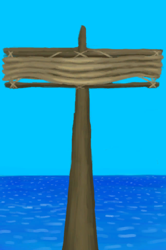

# Start Journey  
> "Can push the raft to the water once I'm ready. Should bring enough food and water supplies  
  
<table class="table table-bordered" data-toggle="table"  data-show-header="false"><thead style="display:none"><tr ><th  style="width:50%;text-align:left;vertical-align:top;"  >title</th><th  style="width:50%;text-align:left;vertical-align:top;"  ></th></tr></thead><tr ><td  style="width:50%;text-align:left;vertical-align:top;"  >** Unique On Board **</td><td  style="width:50%;text-align:left;vertical-align:top;"  >

<a href="Start_Raft.md" style="color:black">Start Journey</a>

"When stranded on a tropical island</td></tr></tbody></table>  
  
## Got From  

Board the Raft

[Raft](RaftEntrance.md)

  
  
## Action  

<table><tr><td rowspan="2" style="width:200px;text-align:center;font-size:1.3em;font-weight:bold">

Push raft to the water

1h

</td><td></td></tr><tr><td><b>Self：</b>→ [

[Lowered Sail](SailDown_Raft.md)](SailDown_Raft.md)</td></tr><tr><td colspan="2"><b>StatChange：</b>[Sailed](Sailed.md)<b>+1</b>, [

[Distance](Distance.md)](Distance.md)<b>+1</b></td></tr><tr><td colspan="2">[

[Sea](Sea_Raft.md)](Sea_Raft.md)(<b>+1</b>)</td></tr></table>
  
  
  

