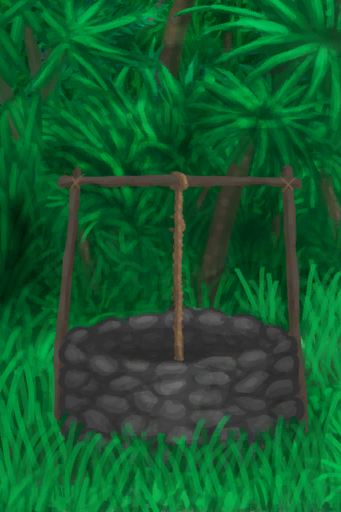
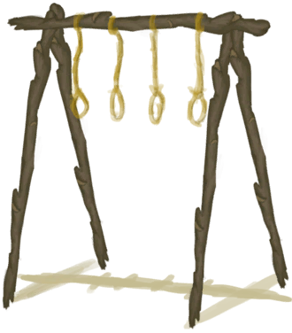
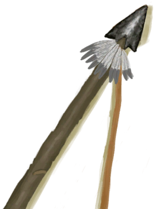
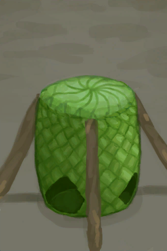

# Long Stick  
> "Many uses  
  
<table class="table table-bordered" data-toggle="table"  data-show-header="false"><thead style="display:none"><tr ><th  style="width:50%;text-align:left;vertical-align:top;"  >title</th><th  style="width:50%;text-align:left;vertical-align:top;"  ></th></tr></thead><tr ><td  style="width:50%;text-align:left;vertical-align:top;"  >**Weight：**250  **Tag：**	[“Large”](tag_Large.md)</td><td  style="width:50%;text-align:left;vertical-align:top;"  >

<a href="StickLong.md" style="color:black">Long Stick</a>

"A long stick can go a long way to help you survive!  Found in <b>Jungles</td></tr></tbody></table>  
  
## Got From  

Dismantle

[Rustic Bed](BedRustic.md)

Deconstruct

[Shelter](Shelter.md)

Transform

[Shelter](Shelter.md)

Deconstruct

[Sheltered Leaf Bed](ShelteredLeafBed.md)

Transform

[Sheltered Leaf Bed](ShelteredLeafBed.md)

Deconstruct

[Cage Trap](CageTrap.md)

Dissasemble

[Drying Rack](DryingRack.md)

Disassemble trap

[Log Trap](LogTrap.md)

Disassemble trap

[Log Trap](LogTrapTriggered.md)

Disassemble Loom

[Loom (Empty)(Empty)](LoomEmpty.md)

Deconstruct

[Scarecrow](Scarecrow.md)

Transform

[Scarecrow](Scarecrow.md)

Disassemble trap

[Trapping Pit](TrappingPit.md)

Disassemble trap

[Trapping Pit](TrappingPitTriggered.md)

Dismantle

[Rustic Bow](BowRustic.md)

Dismantle

[Travois](Travois.md)

Dismantle

[Broom](Broom.md)

The Broom broke!

[Broom](Broom.md)

Dismantle

[Copper Spear](SpearCopper.md)

Dismantle

[Flint Spear](SpearFlint.md)

Dismantle

[Obsidian Spear](SpearObsidian.md)

Dismantle

[Scrap Spear](SpearScrap.md)

** With：**[“Axe”](tag_Axe.md)Cut Tree

[Cinchona Tree](CinchonaTree.md)

** With：**[“Axe”](tag_Axe.md)Cut Tree

[Cleared Cinchona Tree](CinchonaTreeCleared.md)

Clear

[Debris(Mud Hut)](Debris.md)

** With：**[“Shovel”](tag_Shovel.md)Clear

[Debris(Mud Hut)](Debris.md)

** With：**[“Axe”](tag_Axe.md)Cut Tree

[Young Mango Tree](MangoTreeYoung.md)

Explore

[Deep Jungle(Jungle)](DeepJungle.md)

Explore

[Jungle](Jungle.md)

Explore

[Jungle Highlands](JungleHighlands.md)

Explore

[Wetland Jungle(Wetlands)](Wetlands.md)

** With：**[“Axe”](tag_Axe.md)Cut Tree

[Young palm Tree](PalmTreeYoung.md)

** With：**[“Axe”](tag_Axe.md)Cut Tree

[Small Palm](SmallPalm.md)

** With：**[“Axe”](tag_Axe.md)Cut Tree

[Small Tree](SmallTree.md)

** With：**[“Axe”](tag_Axe.md)Cut Tree

[Young Almond Tree](TropicalAlmondTreeYoung.md)

  
  
## Action  

<table><tr><td rowspan="2" style="width:200px;text-align:center;font-size:1.3em;font-weight:bold">

Break Long Stick

15m

</td><td>[“HandAction(Group)”](HandAction.md)</td></tr><tr><td><b>Self：</b>→ [

[Sticks](Sticks.md)](Sticks.md)</td></tr><tr><td colspan="2"><b>Require：</b>[

[Light](Light.md)](Light.md): <b>10-100</b></td></tr></table>
  
  
  
## Drag With  

<table style="margin-bottom:0px;"><tr><td style="width:40%;text-align:left; background-color:#FEFEFE"><b>With：</b>[“Cutter”](tag_Cutter.md)</td><td style="width:40%;font-size:1em;font-weight:bold;background-color:#FEFEFE">Craft Rustic Spear (1h) [“HandAction(Group)”](HandAction.md)</td></tr><tr><td colspan="2"><b>Require：</b>[

[Light](Light.md)](Light.md): <b>10-100</b></td></tr><tr style="background-color:#FFFFFF"><td style=""><b>Receiving：</b>Usage  <b>-1(-0.67%)</b></td><td style=""><b>Self：</b>→ [

[Rustic Spear](SpearRustic.md)](SpearRustic.md)</td></tr><tr><td colspan="2"><b>StatChange：</b>[

[Crafting(Skill)](Skill_Crafting.md)](Skill_Crafting.md)<b>+1</b></td></tr></table>
  
  
## Drag To  

[Campfire](Campfire.md)

[Clay Fire Pit](ClayFirePit.md)

[Fire](Fire.md)

[Smoker](Smoker.md)

[Smoker](SmokerPlastic.md)

  
  
## Use In BluePrint  

<a href="Bp_BedRustic.md" style="color:black">Rustic Bed</a>

<a href="Bp_Bow.md" style="color:black">Bow</a>

<a href="Bp_BowDrill.md" style="color:black">Bow Drill</a>

<a href="Bp_Broom.md" style="color:black">Broom</a>

<a href="Bp_CageTrap.md" style="color:black">Cage Trap</a>

<a href="Bp_Chest.md" style="color:black">Chest</a>

<a href="Bp_Cistern.md" style="color:black">Cistern</a>

<a href="Bp_CompostBin.md" style="color:black">Compost Bin</a>

<a href="Bp_CopperShovel.md" style="color:black">Copper Shovel</a>

<a href="Bp_CopperSpear.md" style="color:black">Copper Spear</a>

<a href="Bp_DryingRack.md" style="color:black">Drying Rack</a>

<a href="Bp_Enclosure.md" style="color:black">Enclosure</a>

<a href="Bp_FishingRod.md" style="color:black">Fishing Rod</a>

<a href="Bp_FishingSpear.md" style="color:black">Fishing Spear</a>

<a href="Bp_FlintSpear.md" style="color:black">Flint Spear</a>

<a href="Bp_GoatFeeder.md" style="color:black">Goat Feeder</a>

<a href="Bp_Harpoon.md" style="color:black">Harpoon</a>

<a href="Bp_LogTrap.md" style="color:black">Log Trap</a>

<a href="Bp_Loom.md" style="color:black">Loom</a>

<a href="Bp_MudHut.md" style="color:black">Mud Hut</a>

<a href="Bp_ObsidianSpear.md" style="color:black">Obsidian Spear</a>

<a href="Bp_PartridgeFeeder.md" style="color:black">Partridge Feeder</a>

<a href="Bp_PotteryWheel.md" style="color:black">Pottery Wheel</a>

<a href="Bp_Raft.md" style="color:black">Raft</a>

<a href="Bp_RaftFishTrap.md" style="color:black">Fish Trap</a>

<a href="Bp_RaftShelter.md" style="color:black">Raft Shelter</a>

<a href="Bp_RusticSpear.md" style="color:black">Rustic Spear</a>

<a href="Bp_Scarecrow.md" style="color:black">Scarecrow</a>

<a href="Bp_ScrapShovel.md" style="color:black">Scrap Shovel</a>

<a href="Bp_ScrapSpear.md" style="color:black">Scrap Spear</a>

<a href="Bp_Shed.md" style="color:black">Shed</a>

<a href="Bp_Shelter.md" style="color:black">Shelter</a>

<a href="Bp_Splint.md" style="color:black">Splint</a>

<a href="Bp_SupplyChest.md" style="color:black">Supply Chest</a>

<a href="Bp_TrappingPit.md" style="color:black">Trapping Pit</a>

<a href="Bp_Travois.md" style="color:black">Travois</a>

<a href="Bp_Well.md" style="color:black">Well</a>

<a href="Bp_WoodenShovel.md" style="color:black">Wooden Shovel</a>

  
  
  

