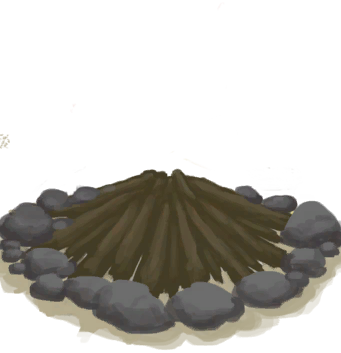
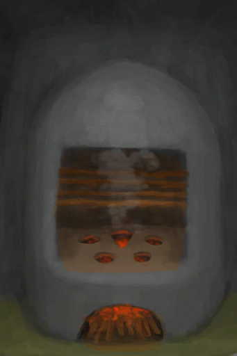

# Sticks  
> "Can be used as fuel or for crafting different things  
  
<table class="table table-bordered" data-toggle="table"  data-show-header="false"><thead style="display:none"><tr ><th  style="width:50%;text-align:left;vertical-align:top;"  >title</th><th  style="width:50%;text-align:left;vertical-align:top;"  ></th></tr></thead><tr ><td  style="width:50%;text-align:left;vertical-align:top;"  >**Weight：**150  **Tag：**	[“Fuel”](tag_Fuel.md), [“Fuel”](tag_Sticks.md)</td><td  style="width:50%;text-align:left;vertical-align:top;"  >

<a href="Sticks.md" style="color:black">Sticks</a>

"Sticks can be found almost  everywhere by <b>foraging</b>.  They can be carved with a <b>Cutting Tool</b> into a <b>Hand Drill</b></td></tr></tbody></table>  
  
## Got From  

Dismantle

[Rustic Bed](BedRustic.md)

Deconstruct

[Cage Trap](CageTrap.md)

Disassemble trap

[Deadfall Trap](DeadfallTrap.md)

Disassemble trap

[Deadfall Trap](DeadfallTrapTriggered.md)

Deconstruct

[Fish Trap](FishTrap.md)

Disassemble trap

[Log Trap](LogTrap.md)

Disassemble trap

[Log Trap](LogTrapTriggered.md)

Remove Sticks

[Smoker Frame](SmokerFrame.md)

Disassemble trap

[Snare Trap](SnareTrap.md)

Disassemble trap

[Snare Trap](SnareTrapTriggered.md)

Transform

[Rustic Bow](BowRustic.md)

Transform

[Loaded Rustic Bow](BowRustic_Copper.md)(未实装)

Transform

[Loaded Rustic Bow](BowRustic_Simple.md)(未实装)

Transform

[Splint](Splint.md)

Dismantle

[Tourniquet](Tourniquet.md)

Break Long Stick

[Long Stick](StickLong.md)

Transform

[Copper Axe](AxeCopper.md)

Transform

[Flint Axe](AxeFlint.md)

Break

[Scrap Axe](AxeScrap.md)

Transform

[Scrap Axe](AxeScrap.md)

The Harpoon Breaks

[Harpoon](HarpoonBone.md)

Transform

[Copper Shovel](ShovelCopper.md)

Break

[Scrap Shovel](ShovelScrap.md)

Transform

[Scrap Shovel](ShovelScrap.md)

Transform

[Wooden Shovel](ShovelWooden.md)

The Spear Breaks

[Copper Spear](SpearCopper.md)

Break Spear

[Fishing Spear](SpearFishing.md)

The Spear Breaks

[Fishing Spear](SpearFishing.md)

The Spear Breaks

[Flint Spear](SpearFlint.md)

The Spear Breaks

[Obsidian Spear](SpearObsidian.md)

The Spear Breaks

[Rustic Spear](SpearRustic.md)

The Spear Breaks

[Scrap Spear](SpearScrap.md)

Transform

[Stone Axe](StoneAxe.md)

** With：**[“Axe”](tag_Axe.md)Cut Tree

[Cinchona Tree](CinchonaTree.md)

** With：**[“Axe”](tag_Axe.md)Cut Tree

[Cleared Cinchona Tree](CinchonaTreeCleared.md)

Clear

[Debris(Mud Hut)](Debris.md)

** With：**[“Shovel”](tag_Shovel.md)Clear

[Debris(Mud Hut)](Debris.md)

Harvest

[Floating Debris](FloatingDebris.md)

** With：**[“Axe”](tag_Axe.md)Cut Tree

[Young Mango Tree](MangoTreeYoung.md)

Go for a Walk

[Bay](Bay.md)

Go for a Walk

[Beach](Beach.md)

Explore

[Deep Jungle(Jungle)](DeepJungle.md)

** With：**[“Hammer”](tag_AxeAdv.md)Cut Wood

[Deep Jungle(Jungle)](DeepJungle.md)

** With：**[“Axe”](tag_Axe.md)Cut Wood

[Deep Jungle(Jungle)](DeepJungle.md)

Explore

[Desolate Beach](DesolateBeach.md)

Explore

[Eastern Grasslands](GrasslandsE.md)

Explore

[Western Grasslands](GrasslandsW.md)

** With：**[“Hammer”](tag_AxeAdv.md)Cut Wood

[Eastern Highlands](HighlandsEastern.md)

** With：**[“Axe”](tag_Axe.md)Cut Wood

[Eastern Highlands](HighlandsEastern.md)

Explore

[Western Highlands](HighlandsWestern.md)

** With：**[“Hammer”](tag_AxeAdv.md)Cut Wood

[Western Highlands](HighlandsWestern.md)

** With：**[“Axe”](tag_Axe.md)Cut Wood

[Western Highlands](HighlandsWestern.md)

Explore

[Jungle](Jungle.md)

** With：**[“Hammer”](tag_AxeAdv.md)Cut Wood

[Jungle](Jungle.md)

** With：**[“Axe”](tag_Axe.md)Cut Wood

[Jungle](Jungle.md)

Explore

[Jungle Highlands](JungleHighlands.md)

** With：**[“Hammer”](tag_AxeAdv.md)Cut Wood

[Jungle Highlands](JungleHighlands.md)

** With：**[“Axe”](tag_Axe.md)Cut Wood

[Jungle Highlands](JungleHighlands.md)

** With：**[“Hammer”](tag_AxeAdv.md)Cut Wood

[Mangrove Forest](Mangroves.md)

** With：**[“Axe”](tag_Axe.md)Cut Wood

[Mangrove Forest](Mangroves.md)

Explore

[Jungle Outskirts(Outskirts)](Outskirts.md)

** With：**[“Hammer”](tag_AxeAdv.md)Cut Wood

[Jungle Outskirts(Outskirts)](Outskirts.md)

** With：**[“Axe”](tag_Axe.md)Cut Wood

[Jungle Outskirts(Outskirts)](Outskirts.md)

Explore

[Secret Valley](SecretValley.md)

Explore

[Wetland Jungle(Wetlands)](Wetlands.md)

** With：**[“Hammer”](tag_AxeAdv.md)Cut Wood

[Wetland Jungle(Wetlands)](Wetlands.md)

** With：**[“Axe”](tag_Axe.md)Cut Wood

[Wetland Jungle(Wetlands)](Wetlands.md)

Transform

[Large Tree](LargeTree.md)

** With：**[Stone Axe](StoneAxe.md)Clean Log of braches

[Felled Large Tree](LargeTreeFelled.md)

** With：**[“Axe”](tag_Axe.md)Clean Log of braches

[Felled Large Tree](LargeTreeFelled.md)

Transform

[Cleared Mango Tree](MangoTreeCleared.md)

Transform

[Cleared Tropical Almond Tree](TropicalAlmondTreeCleared.md)

** With：**[Stone Axe](StoneAxe.md)Clean Branches

[Felled Tropical Almond Tree](TropicalAlmondTreeFelled.md)(未实装)

** With：**[“Axe”](tag_Axe.md)Clean Branches

[Felled Tropical Almond Tree](TropicalAlmondTreeFelled.md)(未实装)

** With：**[“Axe”](tag_Axe.md)Cut Tree

[Small Tree](SmallTree.md)

** With：**[“Axe”](tag_Axe.md)Cut Tree

[Young Almond Tree](TropicalAlmondTreeYoung.md)

** With：**[“Axe”](tag_Axe.md)Cut Down

[Wild Jujube](WildJujube.md)

** With：**[“Axe”](tag_Axe.md)Cut Down

[Cleared Wild Jujube](WildJujubeCleared.md)

  
  
## Drag With  

<table style="margin-bottom:0px;"><tr><td style="width:40%;text-align:left; background-color:#FEFEFE"><b>With：</b>[“Cutter”](tag_Cutter.md)</td><td style="width:40%;font-size:1em;font-weight:bold;background-color:#FEFEFE">Craft Hand Drill (30m) [“HandAction(Group)”](HandAction.md), [“CraftAction(Group)”](CraftAction.md)</td></tr><tr><td colspan="2"><b>Require：</b>[

[Light](Light.md)](Light.md): <b>10-100</b></td></tr><tr style="background-color:#FFFFFF"><td style=""><b>Receiving：</b>Usage  <b>-1(-0.67%)</b></td><td style=""><b>Self：</b>→ [

[Hand Drill](HandDrill.md)](HandDrill.md)</td></tr><tr><td colspan="2"><b>StatChange：</b>[

[Crafting(Skill)](Skill_Crafting.md)](Skill_Crafting.md)<b>+0.25</b>, [

[Woodworking(Skill)](Skill_Woodworking.md)](Skill_Woodworking.md)<b>+0.5</b></td></tr></table>
  

<table style="margin-bottom:0px;"><tr><td style="width:40%;text-align:left; background-color:#FEFEFE"><b>With：</b>[

[Fiber Cord](CordFiber.md)](CordFiber.md)</td><td style="width:40%;font-size:1em;font-weight:bold;background-color:#FEFEFE">Craft Tourniquet (30m) [“HandAction(Group)”](HandAction.md)</td></tr><tr><td colspan="2"><b>Require：</b>[

[Light](Light.md)](Light.md): <b>10-100</b></td></tr><tr style="background-color:#FFFFFF"><td style=""><b>Receiving：</b>→Dismiss</td><td style=""><b>Self：</b>→ [

[Improvised Tourniquet](TourniquetRustic.md)](TourniquetRustic.md)</td></tr><tr><td colspan="2"><b>StatChange：</b>[

[Crafting(Skill)](Skill_Crafting.md)](Skill_Crafting.md)<b>+1</b></td></tr></table>
  
  
## Drag To  

[Alembic(Off)](AlembicOff.md)

[Alembic(On)](AlembicOn.md)

[Campfire](Campfire.md)

[Campfire(Off)](CampfireExtinguished.md)

[Clay Fire Pit](ClayFirePit.md)

[Clay Fire Pit(Off)](ClayFirePitExtinguished.md)

[Fire](Fire.md)

[Fire(Off)](FireExtinguished.md)

[Forge](Forge.md)

[Forge(Off)](ForgeExtinguished.md)

[Kiln](Kiln.md)

[Advanced Kiln](KilnAdvanced.md)

[Advanced Kiln(Off)](KilnAdvancedExtinguished.md)

[Kiln(Off)](KilnExtinguished.md)

[Stove](Stove.md)

[Stove(Off)](StoveExtinguished.md)

[Smoker](Smoker.md)

[Smoker(Off)](SmokerExtinguished.md)

[Smoker](SmokerExtinguishedPlastic.md)

[Smoker](SmokerPlastic.md)

[Cloth](Cloth.md)

[Wood](Wood.md)

  
  
## Use In BluePrint  

<a href="Bp_Arrow.md" style="color:black">Arrows</a>

<a href="Bp_BeeSkepEmpty.md" style="color:black">Empty Skep</a>

<a href="Bp_BoarFeeder.md" style="color:black">Boar Feeder</a>

<a href="Bp_CageTrap.md" style="color:black">Cage Trap</a>

<a href="Bp_Campfire.md" style="color:black">Campfire</a>

<a href="Bp_CropPlot.md" style="color:black">Crop Plot</a>

<a href="Bp_DeadfallTrap.md" style="color:black">Deadfall Trap</a>

<a href="Bp_Enclosure.md" style="color:black">Enclosure</a>

<a href="Bp_Fire.md" style="color:black">Fire</a>

<a href="Bp_FishTrap.md" style="color:black">Fish Trap</a>

<a href="Bp_HandDrill.md" style="color:black">Hand Drill</a>

<a href="Bp_Kiln.md" style="color:black">Kiln</a>

<a href="Bp_MudHut.md" style="color:black">Mud Hut</a>

<a href="Bp_SnareTrap.md" style="color:black">Snare Trap</a>

<a href="Bp_Spindle.md" style="color:black">Spindle</a>

<a href="Bp_Stove.md" style="color:black">Stove</a>

<a href="Bp_Tourniquet.md" style="color:black">Tourniquet</a>

<a href="Bp_TourniquetRustic.md" style="color:black">Improvised Tourniquet</a>

<a href="Bp_WaterFilter.md" style="color:black">Water Filter</a>

<a href="Bp_Butter.md" style="color:black">Butter</a>

<a href="Bp_MacaqueSkewers.md" style="color:black">Macaque Skewers</a>

<a href="Bp_Bellows.md" style="color:black">Bellows</a>

<a href="Bp_WoodenNeedles.md" style="color:black">Wooden Needles</a>

  
  
  

