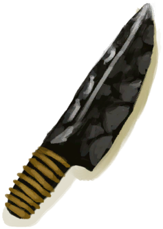
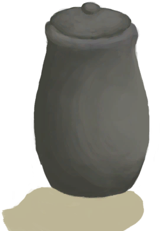

# Stone  
> "Useful as a hammer  
  
<table class="table table-bordered" data-toggle="table"  data-show-header="false"><thead style="display:none"><tr ><th  style="width:50%;text-align:left;vertical-align:top;"  >title</th><th  style="width:50%;text-align:left;vertical-align:top;"  ></th></tr></thead><tr ><td  style="width:50%;text-align:left;vertical-align:top;"  >**Weight：**100  **Tag：**	[“Hammer”](tag_Hammer.md), [“Cookable”](tag_Cookable.md), [“Heavy”](tag_Heavy.md)</td><td  style="width:50%;text-align:left;vertical-align:top;"  >

<a href="Stone.md" style="color:black">Stone</a>

"A small chunk of limestone.   It can be turned into<b>Sharpened Stone</b></td></tr></tbody></table>  
  
## Got From  

** With：**[Dynamite(On)](DynamiteOn.md)Boom!

[Copper Vein(High Chamber)](CopperVein.md)

Dismantle

[Campfire](Campfire.md)

Dismantle

[Campfire(Off)](CampfireExtinguished.md)

Disassemble trap

[Trapping Pit](TrappingPit.md)

Disassemble trap

[Trapping Pit](TrappingPitTriggered.md)

Check Gift

[A gift!(Event)](Event_MacaqueFriendGift.md)

** With：**[“Hammer”](tag_Hammer.md)Crack

[Geode](Geode.md)

Explore

[Crystal Chamber(High Chamber)](CrystalChamber.md)

** With：**[“Hammer”](tag_Hammer.md)Dig

[Narrow Passage(High Chamber)](CrystalChamberEntranceClosed.md)

** With：**[Dynamite(On)](DynamiteOn.md)Boom!

[Narrow Passage(High Chamber)](CrystalChamberEntranceClosed.md)

Explore

[Damp Chamber](DampChamber.md)

** With：**[“Hammer”](tag_Hammer.md)Dig

[Narrow Passage(Damp Chamber)](DarkCaveCaveEntranceClosed.md)

** With：**[Dynamite(On)](DynamiteOn.md)Boom!

[Narrow Passage(Damp Chamber)](DarkCaveCaveEntranceClosed.md)

** With：**[“Hammer”](tag_Hammer.md)Dig

[Narrow Passage(High Chamber)](DarkChamberCaveEntranceClosed.md)

** With：**[Dynamite(On)](DynamiteOn.md)Boom!

[Narrow Passage(High Chamber)](DarkChamberCaveEntranceClosed.md)

Explore

[Flooded Chamber](FloodedChamber.md)

** With：**[“Hammer”](tag_Hammer.md)Dig

[Narrow Passage(High Chamber)](FloodedChamberEntranceClosed.md)

** With：**[Dynamite(On)](DynamiteOn.md)Boom!

[Narrow Passage(High Chamber)](FloodedChamberEntranceClosed.md)

Explore

[High Chamber](HighChamber.md)

** With：**[“Hammer”](tag_Hammer.md)Dig

[Narrow Passage(Tunnel)](HighChamberEntranceClosed.md)

** With：**[Dynamite(On)](DynamiteOn.md)Boom!

[Narrow Passage(Tunnel)](HighChamberEntranceClosed.md)

Explore

[Low Chamber(High Chamber)](LowChamber.md)

Explore

[Medium Chamber(High Chamber)](MidChamber.md)

Explore

[Narrow Tunnel(High Chamber)](NarrowTunnel.md)

Dive

[Seawater(Flooded Chamber)](Sea_Cave.md)

Dig

[Collapsed Tunnel Entrance(Eastern Highlands)](TunnelEntranceClosed.md)

** With：**[Dynamite(On)](DynamiteOn.md)Boom!

[Collapsed Tunnel Entrance(Eastern Highlands)](TunnelEntranceClosed.md)

Explore

[Dark Cave](DarkCave.md)

Explore

[Acid Lake(Volcano)](AcidLake.md)

Explore

[Atoll](Atoll.md)

Go for a Walk

[Bay](Bay.md)

Go for a Walk

[Beach](Beach.md)

Explore

[Bird Rock](BirdRock.md)

Explore

[Secret Cove](Cove.md)

Explore

[Deep Jungle(Jungle)](DeepJungle.md)

Explore

[Desolate Beach](DesolateBeach.md)

Explore

[Eastern Grasslands](GrasslandsE.md)

Explore

[Western Grasslands](GrasslandsW.md)

Explore

[Eastern Highlands](HighlandsEastern.md)

Explore

[Western Highlands](HighlandsWestern.md)

Explore

[Jungle](Jungle.md)

Explore

[Jungle Highlands](JungleHighlands.md)

Explore

[Mangrove Forest](Mangroves.md)

Explore

[Rocks](Rocks.md)

Dive

[Sea(Atoll)](Sea_Atoll.md)

Dive

[Sea(Bay)](Sea_Bay.md)

Dive

[Sea(Beach)](Sea_Beach.md)

Dive

[Sea(Secret Cove)](Sea_Cove.md)

Dive

[Sea(Desolate Beach)](Sea_DesolateBeach.md)

Dive

[Sea(Mangrove Forest)](Sea_Mangroves.md)

Dive

[Sea(Bird Rock)](Sea_Rocks.md)

Explore

[Secret Valley](SecretValley.md)

Explore

[Volcano](Volcano.md)

Explore

[Wetland Jungle(Wetlands)](Wetlands.md)

Dismantle

[Rain Catcher](RainCatcher.md)

Dismantle

[Solar Still](SolarStill.md)

** With：**[“Hammer”](tag_Hammer.md)Demolish

[Water Filter](WaterFilter.md)

  
  
## Action  

<table><tr><td rowspan="2" style="width:200px;text-align:center;font-size:1.3em;font-weight:bold">

Practice Rock Throwing

1h

</td><td>[“HandAction(Group)”](HandAction.md)</td></tr><tr><td></td></tr><tr><td colspan="2"><b>Require：</b>[Hand Modifier](ModifierHand.md): <b>0-2</b></td></tr><tr><td colspan="2"><b>StatChange：</b>[

[Rock Throwing(Skill)](Skill_RockThrowing.md)](Skill_RockThrowing.md)<b>+1</b>, [

[Morale](Morale.md)](Morale.md)<b>+0.25</b></td></tr></table>
  
  
  
## Drag With  

<table style="margin-bottom:0px;"><tr><td style="width:40%;text-align:left; background-color:#FEFEFE"><b>With：</b>[

[Stone](Stone.md)](Stone.md)</td><td style="width:40%;font-size:1em;font-weight:bold;background-color:#FEFEFE">Sharpen Stone (2h) [“HandAction(Group)”](HandAction.md), [“CraftAction(Group)”](CraftAction.md)</td></tr><tr><td colspan="2"><b>Require：</b>[

[Light](Light.md)](Light.md): <b>10-100</b></td></tr><tr style="background-color:#FFFFFF"><td style=""><b>Receiving：</b></td><td style=""><b>Self：</b>→ [

[Sharpened Stone](StoneSharpened.md)](StoneSharpened.md)</td></tr><tr><td colspan="2"><b>StatChange：</b>[

[Hand Damage](HandDamage.md)](HandDamage.md)<b>+40</b>, [

[Crafting(Skill)](Skill_Crafting.md)](Skill_Crafting.md)<b>+1</b></td></tr></table>
  
  
## Drag To  

[Copper Vein(High Chamber)](CopperVein.md)

[Dirt Pile](DirtPile.md)

[Stove(Off)](StoveExtinguished.md)

[Mud Pile](MudPile.md)

[Watering Trough](WateringTrough.md)

[Bone Splinters](BoneSplinters.md)

[Bones](Bones.md)

[Charcoal](Charcoal.md)

[Coconut](Coconut.md)

[Husked Coconut](CoconutHusked.md)

[Perforated Coconut](CoconutPerforated.md)

[Rotten Coconut](CoconutRotten.md)

[Conch](Conch.md)

[Copper Decoration](CopperDecoration_Mold.md)

[Feathers](Feathers.md)

[Flint](Flint.md)

[Flint Slab](FlintSlab.md)

[Dried Chilies](ChiliesDried.md)

[Conch Meat](ConchMeat.md)

[Ginger](Ginger.md)

[Dried Ginger](GingerDried.md)

[Jasmine Flowers](JasmineFlowers.md)

[Kava Root](KavaRoot.md)

[Dried Kava Root](KavaRootDried.md)

[Lemongrass](LemongrassStalks.md)

[Snake Grass](SnakeGrass.md)

[Spider Lily Leaves](SpiderLilyLeaves.md)

[Dried Spider Lily Leaves](SpiderLilyLeavesDried.md)

[Geode](Geode.md)

[Giant Conch](GiantConch.md)

[Burnt Mortar](MortarBurnt.md)

[Mud Brick](MudBrick.md)

[Niter Crystals](NiterCrystals.md)

[Obsidian](Obsidian.md)

[Oyster](Oyster.md)

[Stone](Stone.md)

[Burnt Stone](StoneBurnt.md)

[Heavy Stone](StoneHeavy.md)

[Sulphurous Stone](StoneHeavyBrimstone.md)

[Burnt Heavy Stone](StoneHeavyBurnt.md)

[Blunt Axe Head](AxeHeadBlunt.md)

[Survival Axe](AxeSurvival.md)

[Blunt Survival Axe](AxeSurvivalBlunt.md)

[Copper Knife](KnifeCopper.md)

[Blunt Knife](KnifeCopperBlunt.md)

[Grandfather's Knife](KnifeGrandpa.md)

[Grandfather's Blunt Knife](KnifeGrandpaBlunt.md)

[Military Knife](KnifeMilitary.md)

[Blunt Knife](KnifeMilitaryBlunt.md)

[Blunt Spear Head](SpearHeadBlunt.md)

[Tropical Almonds](TropicalAlmonds.md)

[Urchin](Urchin.md)

[Brimstone Vent(Volcano)](VentBrimstone.md)

[Weston](Weston.md)

[Narrow Passage(High Chamber)](CrystalChamberEntranceClosed.md)

[Narrow Passage(Damp Chamber)](DarkCaveCaveEntranceClosed.md)

[Narrow Passage(High Chamber)](DarkChamberCaveEntranceClosed.md)

[Narrow Passage(High Chamber)](FloodedChamberEntranceClosed.md)

[Narrow Passage(Tunnel)](HighChamberEntranceClosed.md)

[Palm Tree](PalmTreeNew.md)

[Palm Tree](PalmTreeOld.md)

[Water Filter](WaterFilter.md)

  
  
## Use In BluePrint  

<a href="Bp_BrimstoneGel.md" style="color:black">Brimstone Gel</a>

<a href="Bp_BugRepellent.md" style="color:black">Bug Repellant</a>

<a href="Bp_Campfire.md" style="color:black">Campfire</a>

<a href="Bp_Cellar.md" style="color:black">Cellar</a>

<a href="Bp_CeremonialDagger.md" style="color:black">Ceremonial Dagger</a>

<a href="Bp_Cistern.md" style="color:black">Cistern</a>

<a href="Bp_CopperSheet.md" style="color:black">Copper Sheet</a>

<a href="Bp_FlintAxe.md" style="color:black">Flint Axe</a>

<a href="Bp_FlintKnife.md" style="color:black">Flint Knife</a>

<a href="Bp_FlintSpear.md" style="color:black">Flint Spear</a>

<a href="Bp_Honey.md" style="color:black">Honey</a>

<a href="Bp_Mortar.md" style="color:black">Mortar</a>

<a href="Bp_ObsidianKnife.md" style="color:black">Obsidian Knife</a>

<a href="Bp_ObsidianSpear.md" style="color:black">Obsidian Spear</a>

<a href="Bp_PesticideBrimstone.md" style="color:black">Brimstone Pesticide</a>

<a href="Bp_PotteryWheel.md" style="color:black">Pottery Wheel</a>

<a href="Bp_Quinine.md" style="color:black">Cinchona Powder</a>

<a href="Bp_Raincatcher.md" style="color:black">Raincatcher</a>

<a href="Bp_ScrapAxe.md" style="color:black">Scrap Axe</a>

<a href="Bp_ScrapKnife.md" style="color:black">Scrap Knife</a>

<a href="Bp_ScrapShovel.md" style="color:black">Scrap Shovel</a>

<a href="Bp_SharpenedStone.md" style="color:black">Sharpened Stone</a>

<a href="Bp_SolarStill.md" style="color:black">Solar Still</a>

<a href="Bp_StoneHut.md" style="color:black">Stone Hut</a>

<a href="Bp_Table.md" style="color:black">Table</a>

<a href="Bp_TrappingPit.md" style="color:black">Trapping Pit</a>

<a href="Bp_Vitriol.md" style="color:black">Vitriol</a>

<a href="Bp_WaterFilter.md" style="color:black">Water Filter</a>

<a href="Bp_Well.md" style="color:black">Well</a>

<a href="Bp_CoconutMilk.md" style="color:black">Coconut Milk</a>

<a href="Bp_CopperBottle.md" style="color:black">Copper Bottle</a>

<a href="Bp_CopperJar.md" style="color:black">Copper Jar</a>

  
  
  
## Use To Transform  
<table class="table table-bordered" data-toggle="table"  ><thead style=""><tr ><th  style="text-align:left;vertical-align:top;"  >Transform to</th><th  style="text-align:left;vertical-align:top;"  >Container</th></tr></thead><tr ><td  style="text-align:left;vertical-align:top;"  >[

[Burnt Stone](StoneBurnt.md)](StoneBurnt.md)</td><td  style="text-align:left;vertical-align:top;"  >[

[Kiln](Kiln.md)](Kiln.md)</td></tr><tr ><td  style="text-align:left;vertical-align:top;"  >[

[Burnt Stone](StoneBurnt.md)](StoneBurnt.md)</td><td  style="text-align:left;vertical-align:top;"  >[

[Advanced Kiln](KilnAdvanced.md)](KilnAdvanced.md)</td></tr></tbody></table>  
  

