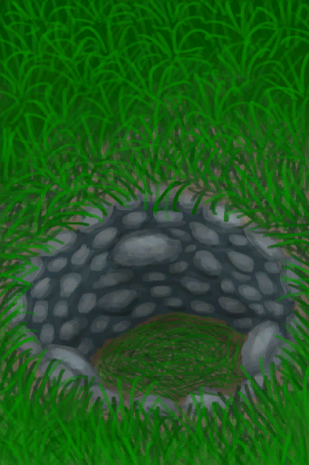

# Heavy Stone  
> "A large heavy stone  
  
<table class="table table-bordered" data-toggle="table"  data-show-header="false"><thead style="display:none"><tr ><th  style="width:50%;text-align:left;vertical-align:top;"  >title</th><th  style="width:50%;text-align:left;vertical-align:top;"  ></th></tr></thead><tr ><td  style="width:50%;text-align:left;vertical-align:top;"  >**Weight：**750  **Tag：**	[“Hammer”](tag_Hammer.md), [“Heavy”](tag_Heavy.md)</td><td  style="width:50%;text-align:left;vertical-align:top;"  >

<a href="StoneHeavy.md" style="color:black">Heavy Stone</a>

Large chunks of <b>Limestone</b>. Their weight makes them ideal for <b>Deadfall Traps</b>.  They can also be used to <b>Sharpen</b> tools or other stones or burnt on <b>Kilns</b> to turn them into <b>Quicklime</b>. They also come in a yellowish brimstone-rich variety that can be burnt to release their <b>Brimstone</b>.</td></tr></tbody></table>  
  
## Got From  

Disassemble trap

[Deadfall Trap](DeadfallTrap.md)

Disassemble trap

[Deadfall Trap](DeadfallTrapTriggered.md)

Disassemble trap

[Trapping Pit](TrappingPit.md)

Disassemble trap

[Trapping Pit](TrappingPitTriggered.md)

** With：**[“Hammer”](tag_Hammer.md)Dig

[Narrow Passage(High Chamber)](CrystalChamberEntranceClosed.md)

** With：**[“Hammer”](tag_Hammer.md)Dig

[Narrow Passage(Damp Chamber)](DarkCaveCaveEntranceClosed.md)

** With：**[“Hammer”](tag_Hammer.md)Dig

[Narrow Passage(High Chamber)](DarkChamberCaveEntranceClosed.md)

** With：**[“Hammer”](tag_Hammer.md)Dig

[Narrow Passage(High Chamber)](FloodedChamberEntranceClosed.md)

** With：**[“Hammer”](tag_Hammer.md)Dig

[Narrow Passage(Tunnel)](HighChamberEntranceClosed.md)

Dig

[Collapsed Tunnel Entrance(Eastern Highlands)](TunnelEntranceClosed.md)

Explore

[Acid Lake(Volcano)](AcidLake.md)

Go for a Walk

[Bay](Bay.md)

Go for a Walk

[Beach](Beach.md)

Explore

[Bird Rock](BirdRock.md)

Explore

[Secret Cove](Cove.md)

Explore

[Deep Jungle(Jungle)](DeepJungle.md)

Explore

[Desolate Beach](DesolateBeach.md)

Explore

[Eastern Grasslands](GrasslandsE.md)

Explore

[Western Grasslands](GrasslandsW.md)

Explore

[Eastern Highlands](HighlandsEastern.md)

Explore

[Western Highlands](HighlandsWestern.md)

Explore

[Jungle](Jungle.md)

Explore

[Jungle Highlands](JungleHighlands.md)

Explore

[Mangrove Forest](Mangroves.md)

Explore

[Jungle Outskirts(Outskirts)](Outskirts.md)

Explore

[Rocks](Rocks.md)

Explore

[Secret Valley](SecretValley.md)

Explore

[Volcano](Volcano.md)

Explore

[Wetland Jungle(Wetlands)](Wetlands.md)

  
  
## Drag With  

<table style="margin-bottom:0px;"><tr><td style="width:40%;text-align:left; background-color:#FEFEFE"><b>With：</b>[

[Stone](Stone.md)](Stone.md)</td><td style="width:40%;font-size:1em;font-weight:bold;background-color:#FEFEFE">Sharpen Stone (1h) [“HandAction(Group)”](HandAction.md)</td></tr><tr><td colspan="2"><b>Require：</b>[

[Light](Light.md)](Light.md): <b>10-100</b></td></tr><tr style="background-color:#FFFFFF"><td style=""><b>Receiving：</b>→ [

[Sharpened Stone](StoneSharpened.md)](StoneSharpened.md)</td><td style=""><b>Self：</b></td></tr><tr><td colspan="2"><b>StatChange：</b>[

[Hand Damage](HandDamage.md)](HandDamage.md)<b>+20</b>, [

[Crafting(Skill)](Skill_Crafting.md)](Skill_Crafting.md)<b>+1</b></td></tr></table>
  
  
## Drag To  

[Copper Vein(High Chamber)](CopperVein.md)

[Dirt Pile](DirtPile.md)

[Stove(Off)](StoveExtinguished.md)

[Mud Pile](MudPile.md)

[Watering Trough](WateringTrough.md)

[Bone Splinters](BoneSplinters.md)

[Bones](Bones.md)

[Charcoal](Charcoal.md)

[Coconut](Coconut.md)

[Husked Coconut](CoconutHusked.md)

[Perforated Coconut](CoconutPerforated.md)

[Rotten Coconut](CoconutRotten.md)

[Conch](Conch.md)

[Copper Decoration](CopperDecoration_Mold.md)

[Feathers](Feathers.md)

[Dried Chilies](ChiliesDried.md)

[Conch Meat](ConchMeat.md)

[Ginger](Ginger.md)

[Dried Ginger](GingerDried.md)

[Jasmine Flowers](JasmineFlowers.md)

[Kava Root](KavaRoot.md)

[Dried Kava Root](KavaRootDried.md)

[Sow](BoarEnclosureFemale.md)

[Boar](BoarEnclosureMale.md)

[Piglet](BoarEnclosurePiglet.md)

[Sow](BoarTiedFemale.md)

[Boar](BoarTiedMale.md)

[Piglet](BoarTiedPiglet.md)

[Goat](GoatEnclosureFemale.md)

[Juvenile Goat](GoatEnclosureKid.md)

[Lactating Goat](GoatEnclosureLactating.md)

[Male Goat](GoatEnclosureMale.md)

[Goat](GoatTiedFemale.md)

[Lactating Goat](GoatTiedFemaleLactating.md)

[Juvenile Goat](GoatTiedKid.md)

[Male Goat](GoatTiedMale.md)

[Lemongrass](LemongrassStalks.md)

[Snake Grass](SnakeGrass.md)

[Spider Lily Leaves](SpiderLilyLeaves.md)

[Dried Spider Lily Leaves](SpiderLilyLeavesDried.md)

[Geode](Geode.md)

[Giant Conch](GiantConch.md)

[Burnt Mortar](MortarBurnt.md)

[Mud Brick](MudBrick.md)

[Niter Crystals](NiterCrystals.md)

[Oyster](Oyster.md)

[Burnt Stone](StoneBurnt.md)

[Burnt Heavy Stone](StoneHeavyBurnt.md)

[Blunt Axe Head](AxeHeadBlunt.md)

[Blunt Survival Axe](AxeSurvivalBlunt.md)

[Blunt Knife](KnifeCopperBlunt.md)

[Grandfather's Knife](KnifeGrandpa.md)

[Grandfather's Blunt Knife](KnifeGrandpaBlunt.md)

[Blunt Knife](KnifeMilitaryBlunt.md)

[Blunt Spear Head](SpearHeadBlunt.md)

[Tropical Almonds](TropicalAlmonds.md)

[Urchin](Urchin.md)

[Brimstone Vent(Volcano)](VentBrimstone.md)

[Weston](Weston.md)

[Narrow Passage(High Chamber)](CrystalChamberEntranceClosed.md)

[Narrow Passage(Damp Chamber)](DarkCaveCaveEntranceClosed.md)

[Narrow Passage(High Chamber)](DarkChamberCaveEntranceClosed.md)

[Narrow Passage(High Chamber)](FloodedChamberEntranceClosed.md)

[Narrow Passage(Tunnel)](HighChamberEntranceClosed.md)

[Water Filter](WaterFilter.md)

  
  
## Use In BluePrint  

<a href="Bp_CopperSheet.md" style="color:black">Copper Sheet</a>

<a href="Bp_DeadfallTrap.md" style="color:black">Deadfall Trap</a>

<a href="Bp_EatingUtensilsWooden.md" style="color:black">Wooden Eating Utensils</a>

<a href="Bp_SharpenedStone.md" style="color:black">Sharpened Stone</a>

<a href="Bp_StoneHut.md" style="color:black">Stone Hut</a>

<a href="Bp_TrappingPit.md" style="color:black">Trapping Pit</a>

  
  
  
## Use To Transform  
<table class="table table-bordered" data-toggle="table"  ><thead style=""><tr ><th  style="text-align:left;vertical-align:top;"  >Transform to</th><th  style="text-align:left;vertical-align:top;"  >Container</th></tr></thead><tr ><td  style="text-align:left;vertical-align:top;"  >[

[Burnt Heavy Stone](StoneHeavyBurnt.md)](StoneHeavyBurnt.md)</td><td  style="text-align:left;vertical-align:top;"  >[

[Kiln](Kiln.md)](Kiln.md)</td></tr><tr ><td  style="text-align:left;vertical-align:top;"  >[

[Burnt Heavy Stone](StoneHeavyBurnt.md)](StoneHeavyBurnt.md)</td><td  style="text-align:left;vertical-align:top;"  >[

[Advanced Kiln](KilnAdvanced.md)](KilnAdvanced.md)</td></tr></tbody></table>  
  

