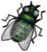

# Straw Cape  
> A rainproof cape to protect me from the weather. <b>MUST BE EQUIPPED ON EQUIPMENT SLOT TO WORK</b>  
  
<table class="table table-bordered" data-toggle="table"  data-show-header="false"><thead style="display:none"><tr ><th  style="width:50%;text-align:left;vertical-align:top;"  >title</th><th  style="width:50%;text-align:left;vertical-align:top;"  ></th></tr></thead><tr ><td  style="width:50%;text-align:left;vertical-align:top;"  >**Weight：**350  **装备时减重：**-200  **Tag：**	[“Torso (Outer)”](tag_OuterTorso.md), [“Legs (Inner)”](tag_Clothing.md)  **Equipped Cards：**[“Coat”](eTag_Coat.md)  **Usage：**2400  ** Effect: ** [

[Temperature](TemperaturePerceived.md)](TemperaturePerceived.md)<b>+3</b> [

[Sun Protection](SunProtection.md)](SunProtection.md)<b>+1</b> [

[Bug Protection](BugProtection.md)](BugProtection.md)<b>+1</b> [

[Rain Protection](RainProtection.md)](RainProtection.md)<b>+3</b></td><td  style="width:50%;text-align:left;vertical-align:top;"  >

<a href="StrawCape.md" style="color:black">Straw Cape</a>

</td></tr></tbody></table>  
  
## Got From  

Craft BluePrint

[Straw Cape(BluePrint)](Bp_StrawCape.md)

  
  
## Action  

<table><tr><td rowspan="2" style="width:200px;text-align:center;font-size:1.3em;font-weight:bold">

Dismantle

</td><td>[“HandAction(Group)”](HandAction.md)</td></tr><tr><td><b>Self：</b>→Dismiss</td></tr><tr><td colspan="2">[

[Rice Straw](RiceStraw.md)](RiceStraw.md)(<b>+3～+6</b>), [

[Fiber Cord](CordFiber.md)](CordFiber.md)(<b>+2～+4</b>)</td></tr></table>
  
  
  
## Durability   

<table style="margin-bottom:0px;"><tr><td style="width:30%;text-align:left; background-color:#FEFEFE;font-size:1.3em;font-weight:bold;">Usage</td><td style="font-size:1em;background-color:#FEFEFE">Starting：2400 , Max：2400 -</td></tr><tr style="background-color:#FFFFFF"><td colspan=2>** On Zero： ** Self: →Dismiss [

[Rice Straw](RiceStraw.md)](RiceStraw.md)(<b>+2～+4</b>), [

[Fiber Cord](CordFiber.md)](CordFiber.md)(<b>+4</b>)</td></tr></table>
  

