# Stress  
> Lowers your morale and mental structure. Can also upset your stomach if it gets too high.  
  

<b>Base Value: </b> 0 
  

<b>Value Range: </b> 0 ~ 240 
  

<b>Base Rate: </b> +1 / /TP 
  

<b>Staleness: </b>Staleness multiplier 50% in 12h(stack:2) 
  
## Statuses  

<table><tr style="height:2em;"><td style="background-color:#F0F0F0;text-align:center;width:180px;font-size:1.4em;font-weight:bold;vertical-align:middle;">
0 ～ 25

0% ～ 10%
</td><td colspan=2 style="font-size:1.1em;vertical-align:middle;background-color:#F9F9F9;">
<b>

Relaxed</b>

</td></tr><tr><td colspan=2><b>Effect：</b>[

[Mental Structure](Structure.md)](Structure.md)addition<b>+1</b></td></tr><tr><td colspan=2></td></tr><tr style="height:2em;"><td style="background-color:#F0F0F0;text-align:center;width:180px;font-size:1.4em;font-weight:bold;vertical-align:middle;">
97 ～ 144

40% ～ 60%
</td><td colspan=2 style="font-size:1.1em;vertical-align:middle;background-color:#F9F9F9;">
<b>

Tense</b>

</td></tr><tr><td colspan=2><b>Effect：</b>[

[Mental Structure](Structure.md)](Structure.md)addition<b>-1</b>, [

[Nausea](Nausea.md)](Nausea.md)addition<b>+0.25</b></td></tr><tr><td colspan=2></td></tr><tr style="height:2em;"><td style="background-color:#F0F0F0;text-align:center;width:180px;font-size:1.4em;font-weight:bold;vertical-align:middle;">
145 ～ 192

60% ～ 80%
</td><td colspan=2 style="font-size:1.1em;vertical-align:middle;background-color:#F9F9F9;">
<b>

Stressed</b>

</td></tr><tr><td colspan=2><b>Effect：</b>[

[Mental Structure](Structure.md)](Structure.md)addition<b>-1</b>, [

[Nausea](Nausea.md)](Nausea.md)addition<b>+0.5</b>, [

[Stool Liquidity](Diarrhoea.md)](Diarrhoea.md)addition<b>+0.25</b>, [

[Stress](Stress.md)](Stress.md)addition<b>-0.5</b>, [

[Morale](Morale.md)](Morale.md)addition<b>-0.5</b></td></tr><tr><td colspan=2><b>Effect on Action：</b>[“HandAction(Group)”](HandAction.md): , [“LegAction(Group)”](LegAction.md): , [

[Stress](Stress.md)](Stress.md)<b>-5</b>, , [“SleepAction(Group)”](SleepAction.md): , [Sleep Clock](SleepClock.md)<b>-2</b>, TimeCost-2</td></tr><tr><td colspan=2></td></tr><tr style="height:2em;"><td style="background-color:#F0F0F0;text-align:center;width:180px;font-size:1.4em;font-weight:bold;vertical-align:middle;">
193 ～ 240

80% ～ 100%
</td><td colspan=2 style="font-size:1.1em;vertical-align:middle;background-color:#F9F9F9;">
<b>

Extremely Stressed</b>

</td></tr><tr><td colspan=2><b>Effect：</b>[

[Mental Structure](Structure.md)](Structure.md)addition<b>-2</b>, [

[Nausea](Nausea.md)](Nausea.md)addition<b>+1</b>, [

[Stool Liquidity](Diarrhoea.md)](Diarrhoea.md)addition<b>+0.5</b>, [

[Stress](Stress.md)](Stress.md)addition<b>-1</b>, [

[Morale](Morale.md)](Morale.md)addition<b>-1</b></td></tr><tr><td colspan=2><b>Effect on Action：</b>[“HandAction(Group)”](HandAction.md): , [“LegAction(Group)”](LegAction.md): , [

[Stress](Stress.md)](Stress.md)<b>-10</b>, , [“SleepAction(Group)”](SleepAction.md): , [Sleep Clock](SleepClock.md)<b>-4</b>, TimeCost-4</td></tr><tr><td colspan=2></td></tr></table>
  
## Related Cards  
[Pain](Pain.md)  |  [Hydration ](Hydration.md)  |  [Mental Structure](Structure.md)  |  [Wakefulness](Wakefulness.md)  |  [Satiation](Satiation.md)  |  [Hyperthermia](Hyperthermia.md)  |  [Alien Cravings](AlienCravings.md)  |  [Loneliness](Loneliness.md)  |  [Alcohol](Alcohol.md)  |  [Analgesia](Analgesia.md)  |  [Blood Loss](BloodLoss.md)  |  [Caffeine](Caffeine.md)  |  [Chine Rose Effect](ChinaRoseEffect.md)  |  [Watcher's Glare](WatchersGlare.md)  |  [Jasmine](JasmineEffect.md)  |  [Comfort](Comfort.md)  |  [Discomfort](Discomfort.md)  |  [Enemy Prescence](EnemyDefeated.md)  |  [Entertainment](Entertainment.md)  |  [God Insight](GodInsight.md)  |  [Hunter's Proximity](HuntersProximity.md)  |  [Void Insight](VoidInsight.md)  |  [Quinine](Quinine.md)  
## Addition Change By  
<table class="table table-bordered" data-toggle="table"  ><thead style=""><tr ><th  style="text-align:left;vertical-align:top;"  >From</th><th  style="text-align:left;vertical-align:top;"  >Operation</th><th  style="text-align:left;vertical-align:top;"  >Value</th></tr></thead><tr ><td  style="text-align:left;vertical-align:top;"  >[Unravelling Mark](W_UnravellingMark.md)</td><td  style="text-align:left;vertical-align:top;"  >Passive</td><td  style="text-align:left;vertical-align:top;"  >addition+2</td></tr><tr ><td  style="text-align:left;vertical-align:top;"  >[Hunter Mark](W_HunterMark.md)</td><td  style="text-align:left;vertical-align:top;"  >Passive</td><td  style="text-align:left;vertical-align:top;"  >addition+1</td></tr><tr ><td  style="text-align:left;vertical-align:top;"  >[Narrow Tunnel(High Chamber)](NarrowTunnel.md)</td><td  style="text-align:left;vertical-align:top;"  >Passive Effects</td><td  style="text-align:left;vertical-align:top;"  >addition+1</td></tr><tr ><td  style="text-align:left;vertical-align:top;"  >[Copper Necklace](CopperNecklace.md)</td><td  style="text-align:left;vertical-align:top;"  >Passive Effects</td><td  style="text-align:left;vertical-align:top;"  >addition-0.25</td></tr><tr ><td  style="text-align:left;vertical-align:top;"  >[Flower Necklace](FlowerNecklace.md)</td><td  style="text-align:left;vertical-align:top;"  >Passive Effects</td><td  style="text-align:left;vertical-align:top;"  >addition-0.25</td></tr><tr ><td  style="text-align:left;vertical-align:top;"  >[Pearl Necklace](PearlNecklace.md)</td><td  style="text-align:left;vertical-align:top;"  >Passive Effects</td><td  style="text-align:left;vertical-align:top;"  >addition-0.25</td></tr><tr ><td  style="text-align:left;vertical-align:top;"  >[Citronella Candle(On)](CandleCitronellaOn.md)</td><td  style="text-align:left;vertical-align:top;"  >Passive Effects</td><td  style="text-align:left;vertical-align:top;"  >addition-0.25</td></tr><tr ><td  style="text-align:left;vertical-align:top;"  >[Jasmine Candle(On)](CandleJasmineOn.md)</td><td  style="text-align:left;vertical-align:top;"  >Passive Effects</td><td  style="text-align:left;vertical-align:top;"  >addition-0.5</td></tr></tbody></table>  
  
## Change By  
<table class="table table-bordered" data-toggle="table"  ><thead style=""><tr ><th  style="text-align:left;vertical-align:top;"  >From</th><th  style="text-align:left;vertical-align:top;"  >Operation</th><th  style="text-align:left;vertical-align:top;"  >Value</th></tr></thead><tr ><td  style="text-align:left;vertical-align:top;"  >[

[Nightmare!(Event)](Event_Nightmare.md)](Event_Nightmare.md)</td><td  style="text-align:left;vertical-align:top;"  >Try to calm down...</td><td  style="text-align:left;vertical-align:top;"  >50</td></tr><tr ><td  style="text-align:left;vertical-align:top;"  >[

[A Spider bit me!(Event)](Event_SpiderNight.md)](Event_SpiderNight.md)</td><td  style="text-align:left;vertical-align:top;"  >Push Spider away!</td><td  style="text-align:left;vertical-align:top;"  >50</td></tr><tr ><td  style="text-align:left;vertical-align:top;"  >[

[Captain(Special1f)(Event)](Event_CaptainSpecial1f.md)](Event_CaptainSpecial1f.md)</td><td  style="text-align:left;vertical-align:top;"  >The feeling is mutual!</td><td  style="text-align:left;vertical-align:top;"  >10</td></tr><tr ><td  style="text-align:left;vertical-align:top;"  >[

[Trapped Macaque](CageTrapMacaque.md)](CageTrapMacaque.md)</td><td  style="text-align:left;vertical-align:top;"  >Pet</td><td  style="text-align:left;vertical-align:top;"  >10</td></tr><tr ><td  style="text-align:left;vertical-align:top;"  >[

[Trapped Macaque](CageTrapMacaque.md)](CageTrapMacaque.md)</td><td  style="text-align:left;vertical-align:top;"  >Feed ** With：**[Fish Slices](FishSlices.md) , [Cooked Fish Slices](FishSlicesCooked.md) , [Prawns](Prawns.md) , [Roasted Prawns](PrawnsCooked.md) , [Fish Scraps](FishScraps.md) , [Cooked Fish Scraps](FishScrapsCooked.md)</td><td  style="text-align:left;vertical-align:top;"  >10</td></tr><tr ><td  style="text-align:left;vertical-align:top;"  >[

[Trapped Macaque](CageTrapMacaque.md)](CageTrapMacaque.md)</td><td  style="text-align:left;vertical-align:top;"  >Feed ** With：**[“Feed”](tag_Feed.md)</td><td  style="text-align:left;vertical-align:top;"  >10</td></tr><tr ><td  style="text-align:left;vertical-align:top;"  >[

[Macaque Friend](MacaqueFriend.md)](MacaqueFriend.md)</td><td  style="text-align:left;vertical-align:top;"  >Pet</td><td  style="text-align:left;vertical-align:top;"  >10</td></tr><tr ><td  style="text-align:left;vertical-align:top;"  >[

[Macaque Friend](MacaqueFriend.md)](MacaqueFriend.md)</td><td  style="text-align:left;vertical-align:top;"  >Feed ** With：**[Fish Slices](FishSlices.md) , [Cooked Fish Slices](FishSlicesCooked.md) , [Prawns](Prawns.md) , [Roasted Prawns](PrawnsCooked.md) , [Fish Scraps](FishScraps.md) , [Cooked Fish Scraps](FishScrapsCooked.md)</td><td  style="text-align:left;vertical-align:top;"  >10</td></tr><tr ><td  style="text-align:left;vertical-align:top;"  >[

[Macaque Friend](MacaqueFriend.md)](MacaqueFriend.md)</td><td  style="text-align:left;vertical-align:top;"  >Feed ** With：**[“Feed”](tag_Feed.md)</td><td  style="text-align:left;vertical-align:top;"  >10</td></tr><tr ><td  style="text-align:left;vertical-align:top;"  >[

[Wounded Macaque](MacaqueWounded.md)](MacaqueWounded.md)</td><td  style="text-align:left;vertical-align:top;"  >Pet</td><td  style="text-align:left;vertical-align:top;"  >10</td></tr><tr ><td  style="text-align:left;vertical-align:top;"  >[

[Wounded Macaque](MacaqueWounded.md)](MacaqueWounded.md)</td><td  style="text-align:left;vertical-align:top;"  >Feed ** With：**[Fish Slices](FishSlices.md) , [Cooked Fish Slices](FishSlicesCooked.md) , [Prawns](Prawns.md) , [Roasted Prawns](PrawnsCooked.md) , [Fish Scraps](FishScraps.md) , [Cooked Fish Scraps](FishScrapsCooked.md)</td><td  style="text-align:left;vertical-align:top;"  >10</td></tr><tr ><td  style="text-align:left;vertical-align:top;"  >[

[Wounded Macaque](MacaqueWounded.md)](MacaqueWounded.md)</td><td  style="text-align:left;vertical-align:top;"  >Feed ** With：**[“Feed”](tag_Feed.md)</td><td  style="text-align:left;vertical-align:top;"  >10</td></tr><tr ><td  style="text-align:left;vertical-align:top;"  >[

[Leaf Bed](LeafBed.md)](LeafBed.md)</td><td  style="text-align:left;vertical-align:top;"  >Nap</td><td  style="text-align:left;vertical-align:top;"  >-1 / /TP</td></tr><tr ><td  style="text-align:left;vertical-align:top;"  >[

[Leaf Bed](LeafBed.md)](LeafBed.md)</td><td  style="text-align:left;vertical-align:top;"  >Sleep</td><td  style="text-align:left;vertical-align:top;"  >-1 / /TP</td></tr><tr ><td  style="text-align:left;vertical-align:top;"  >[

[Mermaid nest](MermaidNest.md)](MermaidNest.md)</td><td  style="text-align:left;vertical-align:top;"  >Nap</td><td  style="text-align:left;vertical-align:top;"  >-1 / /TP</td></tr><tr ><td  style="text-align:left;vertical-align:top;"  >[

[Mermaid nest](MermaidNest.md)](MermaidNest.md)</td><td  style="text-align:left;vertical-align:top;"  >Sleep</td><td  style="text-align:left;vertical-align:top;"  >-1 / /TP</td></tr><tr ><td  style="text-align:left;vertical-align:top;"  >[

[Shelter](Shelter.md)](Shelter.md)</td><td  style="text-align:left;vertical-align:top;"  >Nap</td><td  style="text-align:left;vertical-align:top;"  >-1 / /TP</td></tr><tr ><td  style="text-align:left;vertical-align:top;"  >[

[Shelter](Shelter.md)](Shelter.md)</td><td  style="text-align:left;vertical-align:top;"  >Sleep</td><td  style="text-align:left;vertical-align:top;"  >-1 / /TP</td></tr><tr ><td  style="text-align:left;vertical-align:top;"  >[

[Sheltered Leaf Bed](ShelteredLeafBed.md)](ShelteredLeafBed.md)</td><td  style="text-align:left;vertical-align:top;"  >Nap</td><td  style="text-align:left;vertical-align:top;"  >-1 / /TP</td></tr><tr ><td  style="text-align:left;vertical-align:top;"  >[

[Sheltered Leaf Bed](ShelteredLeafBed.md)](ShelteredLeafBed.md)</td><td  style="text-align:left;vertical-align:top;"  >Sleep</td><td  style="text-align:left;vertical-align:top;"  >-1 / /TP</td></tr><tr ><td  style="text-align:left;vertical-align:top;"  >[

[Tent](TentDeployed.md)](TentDeployed.md)</td><td  style="text-align:left;vertical-align:top;"  >Sleep</td><td  style="text-align:left;vertical-align:top;"  >-1 / /TP</td></tr><tr ><td  style="text-align:left;vertical-align:top;"  >[

[Raft Shelter](RaftShelter.md)](RaftShelter.md)</td><td  style="text-align:left;vertical-align:top;"  >Nap</td><td  style="text-align:left;vertical-align:top;"  >-1 / /TP</td></tr><tr ><td  style="text-align:left;vertical-align:top;"  >[

[Raft Shelter](RaftShelter.md)](RaftShelter.md)</td><td  style="text-align:left;vertical-align:top;"  >Sleep</td><td  style="text-align:left;vertical-align:top;"  >-1 / /TP</td></tr><tr ><td  style="text-align:left;vertical-align:top;"  >[

[Bedroll](BedRoll.md)](BedRoll.md)</td><td  style="text-align:left;vertical-align:top;"  >Nap</td><td  style="text-align:left;vertical-align:top;"  >-1.5 / /TP</td></tr><tr ><td  style="text-align:left;vertical-align:top;"  >[

[Rustic Bed](BedRustic.md)](BedRustic.md)</td><td  style="text-align:left;vertical-align:top;"  >Nap</td><td  style="text-align:left;vertical-align:top;"  >-1.5 / /TP</td></tr><tr ><td  style="text-align:left;vertical-align:top;"  >[

[Tent](TentDeployed.md)](TentDeployed.md)</td><td  style="text-align:left;vertical-align:top;"  >Nap</td><td  style="text-align:left;vertical-align:top;"  >-1.5 / /TP</td></tr><tr ><td  style="text-align:left;vertical-align:top;"  >[

[Bedroll](BedRoll.md)](BedRoll.md)</td><td  style="text-align:left;vertical-align:top;"  >Sleep</td><td  style="text-align:left;vertical-align:top;"  >-2 / /TP</td></tr><tr ><td  style="text-align:left;vertical-align:top;"  >[

[Rustic Bed](BedRustic.md)](BedRustic.md)</td><td  style="text-align:left;vertical-align:top;"  >Sleep</td><td  style="text-align:left;vertical-align:top;"  >-2 / /TP</td></tr><tr ><td  style="text-align:left;vertical-align:top;"  >[

[Hammock](Hammock.md)](Hammock.md)</td><td  style="text-align:left;vertical-align:top;"  >Nap</td><td  style="text-align:left;vertical-align:top;"  >-2 / /TP</td></tr><tr ><td  style="text-align:left;vertical-align:top;"  >[

[You fell asleep!(Event)](Event_FallingAsleep.md)](Event_FallingAsleep.md)</td><td  style="text-align:left;vertical-align:top;"  >Zzz...</td><td  style="text-align:left;vertical-align:top;"  >-2 / /TP</td></tr><tr ><td  style="text-align:left;vertical-align:top;"  >[

[Wooden Bed](BedWooden.md)](BedWooden.md)</td><td  style="text-align:left;vertical-align:top;"  >Nap</td><td  style="text-align:left;vertical-align:top;"  >-2.5 / /TP</td></tr><tr ><td  style="text-align:left;vertical-align:top;"  >[

[Wooden Bed](BedWooden.md)](BedWooden.md)</td><td  style="text-align:left;vertical-align:top;"  >Sleep</td><td  style="text-align:left;vertical-align:top;"  >-3 / /TP</td></tr><tr ><td  style="text-align:left;vertical-align:top;"  >[

[Hammock](Hammock.md)](Hammock.md)</td><td  style="text-align:left;vertical-align:top;"  >Sleep</td><td  style="text-align:left;vertical-align:top;"  >-3 / /TP</td></tr><tr ><td  style="text-align:left;vertical-align:top;"  >[

[Bee Skep(BluePrint)](Bp_BeeSkep.md)](Bp_BeeSkep.md)</td><td  style="text-align:left;vertical-align:top;"  >Craft BluePrint</td><td  style="text-align:left;vertical-align:top;"  >-5</td></tr><tr ><td  style="text-align:left;vertical-align:top;"  >[

[Fire(BluePrint)](Bp_Fire.md)](Bp_Fire.md)</td><td  style="text-align:left;vertical-align:top;"  >Craft BluePrint</td><td  style="text-align:left;vertical-align:top;"  >-5</td></tr><tr ><td  style="text-align:left;vertical-align:top;"  >[

[Jujube Fruits](JujubeFruits.md)](JujubeFruits.md)</td><td  style="text-align:left;vertical-align:top;"  >Eat</td><td  style="text-align:left;vertical-align:top;"  >-5</td></tr><tr ><td  style="text-align:left;vertical-align:top;"  >[
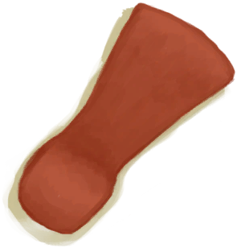
[Blunt Axe Head](AxeHeadBlunt.md)](AxeHeadBlunt.md)</td><td  style="text-align:left;vertical-align:top;"  >Sharpen ** With：**[Stone](Stone.md) , [Heavy Stone](StoneHeavy.md)</td><td  style="text-align:left;vertical-align:top;"  >-5</td></tr><tr ><td  style="text-align:left;vertical-align:top;"  >[

[Blunt Survival Axe](AxeSurvivalBlunt.md)](AxeSurvivalBlunt.md)</td><td  style="text-align:left;vertical-align:top;"  >Sharpen ** With：**[Stone](Stone.md) , [Heavy Stone](StoneHeavy.md)</td><td  style="text-align:left;vertical-align:top;"  >-5</td></tr><tr ><td  style="text-align:left;vertical-align:top;"  >[

[Blunt Knife](KnifeCopperBlunt.md)](KnifeCopperBlunt.md)</td><td  style="text-align:left;vertical-align:top;"  >Sharpen ** With：**[Stone](Stone.md) , [Heavy Stone](StoneHeavy.md)</td><td  style="text-align:left;vertical-align:top;"  >-5</td></tr><tr ><td  style="text-align:left;vertical-align:top;"  >[

[Grandfather's Blunt Knife](KnifeGrandpaBlunt.md)](KnifeGrandpaBlunt.md)</td><td  style="text-align:left;vertical-align:top;"  >Sharpen ** With：**[Stone](Stone.md) , [Heavy Stone](StoneHeavy.md) , [Sulphurous Stone](StoneHeavyBrimstone.md)</td><td  style="text-align:left;vertical-align:top;"  >-5</td></tr><tr ><td  style="text-align:left;vertical-align:top;"  >[

[Blunt Knife](KnifeMilitaryBlunt.md)](KnifeMilitaryBlunt.md)</td><td  style="text-align:left;vertical-align:top;"  >Sharpen ** With：**[Stone](Stone.md) , [Heavy Stone](StoneHeavy.md)</td><td  style="text-align:left;vertical-align:top;"  >-5</td></tr><tr ><td  style="text-align:left;vertical-align:top;"  >[

[Blunt Spear Head](SpearHeadBlunt.md)](SpearHeadBlunt.md)</td><td  style="text-align:left;vertical-align:top;"  >Sharpen ** With：**[Stone](Stone.md) , [Heavy Stone](StoneHeavy.md)</td><td  style="text-align:left;vertical-align:top;"  >-5</td></tr><tr ><td  style="text-align:left;vertical-align:top;"  >[

[Wood](Wood.md)](Wood.md)</td><td  style="text-align:left;vertical-align:top;"  >Cut Shavings ** With：**[“Cutter Advanced”](tag_CutterAdv.md)</td><td  style="text-align:left;vertical-align:top;"  >-5</td></tr><tr ><td  style="text-align:left;vertical-align:top;"  >[

[Wood](Wood.md)](Wood.md)</td><td  style="text-align:left;vertical-align:top;"  >Prepare Fire ** With：**[Sticks](Sticks.md)</td><td  style="text-align:left;vertical-align:top;"  >-5</td></tr><tr ><td  style="text-align:left;vertical-align:top;"  >[
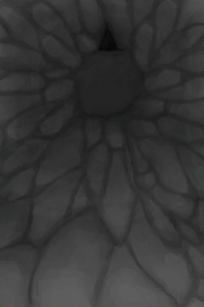
[Shaft](ShaftCrystalChamberToFloodedChamber.md)](ShaftCrystalChamberToFloodedChamber.md)</td><td  style="text-align:left;vertical-align:top;"  >Climb Down</td><td  style="text-align:left;vertical-align:top;"  >-5</td></tr><tr ><td  style="text-align:left;vertical-align:top;"  >[

[Shaft](ShaftFloodedChamberToCrystalChamber.md)](ShaftFloodedChamberToCrystalChamber.md)</td><td  style="text-align:left;vertical-align:top;"  >Climb Up</td><td  style="text-align:left;vertical-align:top;"  >-5</td></tr><tr ><td  style="text-align:left;vertical-align:top;"  >[

[Shaft(High Chamber)](ShaftHighChamberToMidChamber.md)](ShaftHighChamberToMidChamber.md)</td><td  style="text-align:left;vertical-align:top;"  >Climb Down</td><td  style="text-align:left;vertical-align:top;"  >-5</td></tr><tr ><td  style="text-align:left;vertical-align:top;"  >[

[Shaft](ShaftLowChamberToMidChamber.md)](ShaftLowChamberToMidChamber.md)</td><td  style="text-align:left;vertical-align:top;"  >Climb Up</td><td  style="text-align:left;vertical-align:top;"  >-5</td></tr><tr ><td  style="text-align:left;vertical-align:top;"  >[

[Shaft](ShaftMidChamberToHighChamber.md)](ShaftMidChamberToHighChamber.md)</td><td  style="text-align:left;vertical-align:top;"  >Climb Up</td><td  style="text-align:left;vertical-align:top;"  >-5</td></tr><tr ><td  style="text-align:left;vertical-align:top;"  >[

[Shaft(High Chamber)](ShaftMidChamberToLowChamber.md)](ShaftMidChamberToLowChamber.md)</td><td  style="text-align:left;vertical-align:top;"  >Climb Down</td><td  style="text-align:left;vertical-align:top;"  >-5</td></tr><tr ><td  style="text-align:left;vertical-align:top;"  >[

[Atoll](Atoll.md)](Atoll.md)</td><td  style="text-align:left;vertical-align:top;"  >Explore</td><td  style="text-align:left;vertical-align:top;"  >-5</td></tr><tr ><td  style="text-align:left;vertical-align:top;"  >[

[Secret Cove](Cove.md)](Cove.md)</td><td  style="text-align:left;vertical-align:top;"  >Explore</td><td  style="text-align:left;vertical-align:top;"  >-5</td></tr><tr ><td  style="text-align:left;vertical-align:top;"  >[

[Rice](RiceCooked.md)](RiceCooked.md)</td><td  style="text-align:left;vertical-align:top;"  >Eat</td><td  style="text-align:left;vertical-align:top;"  >-7</td></tr><tr ><td  style="text-align:left;vertical-align:top;"  >[

[Aloe Gel(BluePrint)](Bp_AloeGel.md)](Bp_AloeGel.md)</td><td  style="text-align:left;vertical-align:top;"  >Craft BluePrint</td><td  style="text-align:left;vertical-align:top;"  >-10</td></tr><tr ><td  style="text-align:left;vertical-align:top;"  >[

[Arrows(BluePrint)](Bp_Arrow.md)](Bp_Arrow.md)</td><td  style="text-align:left;vertical-align:top;"  >Craft BluePrint</td><td  style="text-align:left;vertical-align:top;"  >-10</td></tr><tr ><td  style="text-align:left;vertical-align:top;"  >[

[Ash Dressing(BluePrint)](Bp_AshDressing.md)](Bp_AshDressing.md)</td><td  style="text-align:left;vertical-align:top;"  >Craft BluePrint</td><td  style="text-align:left;vertical-align:top;"  >-10</td></tr><tr ><td  style="text-align:left;vertical-align:top;"  >[

[Rustic Bed(BluePrint)](Bp_BedRustic.md)](Bp_BedRustic.md)</td><td  style="text-align:left;vertical-align:top;"  >Craft BluePrint</td><td  style="text-align:left;vertical-align:top;"  >-10</td></tr><tr ><td  style="text-align:left;vertical-align:top;"  >[

[Wooden Bed(BluePrint)](Bp_BedWooden.md)](Bp_BedWooden.md)</td><td  style="text-align:left;vertical-align:top;"  >Craft BluePrint</td><td  style="text-align:left;vertical-align:top;"  >-10</td></tr><tr ><td  style="text-align:left;vertical-align:top;"  >[

[Empty Skep(BluePrint)(Empty)](Bp_BeeSkepEmpty.md)](Bp_BeeSkepEmpty.md)</td><td  style="text-align:left;vertical-align:top;"  >Craft BluePrint</td><td  style="text-align:left;vertical-align:top;"  >-10</td></tr><tr ><td  style="text-align:left;vertical-align:top;"  >[

[Bee Smoker(BluePrint)](Bp_BeeSmoker.md)](Bp_BeeSmoker.md)</td><td  style="text-align:left;vertical-align:top;"  >Craft BluePrint</td><td  style="text-align:left;vertical-align:top;"  >-10</td></tr><tr ><td  style="text-align:left;vertical-align:top;"  >[

[Boar Feeder(BluePrint)](Bp_BoarFeeder.md)](Bp_BoarFeeder.md)</td><td  style="text-align:left;vertical-align:top;"  >Craft BluePrint</td><td  style="text-align:left;vertical-align:top;"  >-10</td></tr><tr ><td  style="text-align:left;vertical-align:top;"  >[

[Bone Knife(BluePrint)](Bp_BoneKnife.md)](Bp_BoneKnife.md)</td><td  style="text-align:left;vertical-align:top;"  >Craft BluePrint</td><td  style="text-align:left;vertical-align:top;"  >-10</td></tr><tr ><td  style="text-align:left;vertical-align:top;"  >[

[Bow(BluePrint)](Bp_Bow.md)](Bp_Bow.md)</td><td  style="text-align:left;vertical-align:top;"  >Craft BluePrint</td><td  style="text-align:left;vertical-align:top;"  >-10</td></tr><tr ><td  style="text-align:left;vertical-align:top;"  >[

[Bow Drill(BluePrint)](Bp_BowDrill.md)](Bp_BowDrill.md)</td><td  style="text-align:left;vertical-align:top;"  >Craft BluePrint</td><td  style="text-align:left;vertical-align:top;"  >-10</td></tr><tr ><td  style="text-align:left;vertical-align:top;"  >[

[Brimstone Gel(BluePrint)](Bp_BrimstoneGel.md)](Bp_BrimstoneGel.md)</td><td  style="text-align:left;vertical-align:top;"  >Craft BluePrint</td><td  style="text-align:left;vertical-align:top;"  >-10</td></tr><tr ><td  style="text-align:left;vertical-align:top;"  >[

[Broom(BluePrint)](Bp_Broom.md)](Bp_Broom.md)</td><td  style="text-align:left;vertical-align:top;"  >Craft BluePrint</td><td  style="text-align:left;vertical-align:top;"  >-10</td></tr><tr ><td  style="text-align:left;vertical-align:top;"  >[

[Bug Repellant(BluePrint)](Bp_BugRepellent.md)](Bp_BugRepellent.md)</td><td  style="text-align:left;vertical-align:top;"  >Craft BluePrint</td><td  style="text-align:left;vertical-align:top;"  >-10</td></tr><tr ><td  style="text-align:left;vertical-align:top;"  >[

[Cage Trap(BluePrint)](Bp_CageTrap.md)](Bp_CageTrap.md)</td><td  style="text-align:left;vertical-align:top;"  >Craft BluePrint</td><td  style="text-align:left;vertical-align:top;"  >-10</td></tr><tr ><td  style="text-align:left;vertical-align:top;"  >[

[Campfire(BluePrint)](Bp_Campfire.md)](Bp_Campfire.md)</td><td  style="text-align:left;vertical-align:top;"  >Craft BluePrint</td><td  style="text-align:left;vertical-align:top;"  >-10</td></tr><tr ><td  style="text-align:left;vertical-align:top;"  >[

[Candles(BluePrint)](Bp_Candles.md)](Bp_Candles.md)</td><td  style="text-align:left;vertical-align:top;"  >Craft BluePrint</td><td  style="text-align:left;vertical-align:top;"  >-10</td></tr><tr ><td  style="text-align:left;vertical-align:top;"  >[

[Citronella Candles(BluePrint)](Bp_CandlesCitronella.md)](Bp_CandlesCitronella.md)</td><td  style="text-align:left;vertical-align:top;"  >Craft BluePrint</td><td  style="text-align:left;vertical-align:top;"  >-10</td></tr><tr ><td  style="text-align:left;vertical-align:top;"  >[

[Jasmine Candles(BluePrint)](Bp_CandlesJasmine.md)](Bp_CandlesJasmine.md)</td><td  style="text-align:left;vertical-align:top;"  >Craft BluePrint</td><td  style="text-align:left;vertical-align:top;"  >-10</td></tr><tr ><td  style="text-align:left;vertical-align:top;"  >[
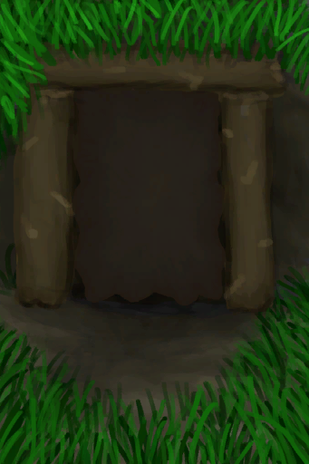
[Cellar(BluePrint)](Bp_Cellar.md)](Bp_Cellar.md)</td><td  style="text-align:left;vertical-align:top;"  >Craft BluePrint</td><td  style="text-align:left;vertical-align:top;"  >-10</td></tr><tr ><td  style="text-align:left;vertical-align:top;"  >[

[Ceremonial Dagger(BluePrint)](Bp_CeremonialDagger.md)](Bp_CeremonialDagger.md)</td><td  style="text-align:left;vertical-align:top;"  >Craft BluePrint</td><td  style="text-align:left;vertical-align:top;"  >-10</td></tr><tr ><td  style="text-align:left;vertical-align:top;"  >[

[Chair(BluePrint)](Bp_Chair.md)](Bp_Chair.md)</td><td  style="text-align:left;vertical-align:top;"  >Craft BluePrint</td><td  style="text-align:left;vertical-align:top;"  >-10</td></tr><tr ><td  style="text-align:left;vertical-align:top;"  >[

[Chest(BluePrint)](Bp_Chest.md)](Bp_Chest.md)</td><td  style="text-align:left;vertical-align:top;"  >Craft BluePrint</td><td  style="text-align:left;vertical-align:top;"  >-10</td></tr><tr ><td  style="text-align:left;vertical-align:top;"  >[

[Cistern(BluePrint)](Bp_Cistern.md)](Bp_Cistern.md)</td><td  style="text-align:left;vertical-align:top;"  >Craft BluePrint</td><td  style="text-align:left;vertical-align:top;"  >-10</td></tr><tr ><td  style="text-align:left;vertical-align:top;"  >[

[Compost Bin(BluePrint)](Bp_CompostBin.md)](Bp_CompostBin.md)</td><td  style="text-align:left;vertical-align:top;"  >Craft BluePrint</td><td  style="text-align:left;vertical-align:top;"  >-10</td></tr><tr ><td  style="text-align:left;vertical-align:top;"  >[

[Copper Axe(BluePrint)](Bp_CopperAxe.md)](Bp_CopperAxe.md)</td><td  style="text-align:left;vertical-align:top;"  >Craft BluePrint</td><td  style="text-align:left;vertical-align:top;"  >-10</td></tr><tr ><td  style="text-align:left;vertical-align:top;"  >[

[Copper Sheet(BluePrint)](Bp_CopperSheet.md)](Bp_CopperSheet.md)</td><td  style="text-align:left;vertical-align:top;"  >Craft BluePrint</td><td  style="text-align:left;vertical-align:top;"  >-10</td></tr><tr ><td  style="text-align:left;vertical-align:top;"  >[

[Copper Shovel(BluePrint)](Bp_CopperShovel.md)](Bp_CopperShovel.md)</td><td  style="text-align:left;vertical-align:top;"  >Craft BluePrint</td><td  style="text-align:left;vertical-align:top;"  >-10</td></tr><tr ><td  style="text-align:left;vertical-align:top;"  >[

[Copper Spear(BluePrint)](Bp_CopperSpear.md)](Bp_CopperSpear.md)</td><td  style="text-align:left;vertical-align:top;"  >Craft BluePrint</td><td  style="text-align:left;vertical-align:top;"  >-10</td></tr><tr ><td  style="text-align:left;vertical-align:top;"  >[

[Crop Plot(BluePrint)](Bp_CropPlot.md)](Bp_CropPlot.md)</td><td  style="text-align:left;vertical-align:top;"  >Craft BluePrint</td><td  style="text-align:left;vertical-align:top;"  >-10</td></tr><tr ><td  style="text-align:left;vertical-align:top;"  >[

[Deadfall Trap(BluePrint)](Bp_DeadfallTrap.md)](Bp_DeadfallTrap.md)</td><td  style="text-align:left;vertical-align:top;"  >Craft BluePrint</td><td  style="text-align:left;vertical-align:top;"  >-10</td></tr><tr ><td  style="text-align:left;vertical-align:top;"  >[

[Drum(BluePrint)](Bp_Drum.md)](Bp_Drum.md)</td><td  style="text-align:left;vertical-align:top;"  >Craft BluePrint</td><td  style="text-align:left;vertical-align:top;"  >-10</td></tr><tr ><td  style="text-align:left;vertical-align:top;"  >[

[Drying Rack(BluePrint)](Bp_DryingRack.md)](Bp_DryingRack.md)</td><td  style="text-align:left;vertical-align:top;"  >Craft BluePrint</td><td  style="text-align:left;vertical-align:top;"  >-10</td></tr><tr ><td  style="text-align:left;vertical-align:top;"  >[

[Dynamite(BluePrint)](Bp_Dynamite.md)](Bp_Dynamite.md)</td><td  style="text-align:left;vertical-align:top;"  >Craft BluePrint</td><td  style="text-align:left;vertical-align:top;"  >-10</td></tr><tr ><td  style="text-align:left;vertical-align:top;"  >[
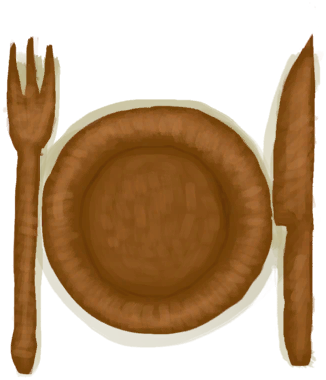
[Wooden Eating Utensils(BluePrint)](Bp_EatingUtensilsWooden.md)](Bp_EatingUtensilsWooden.md)</td><td  style="text-align:left;vertical-align:top;"  >Craft BluePrint</td><td  style="text-align:left;vertical-align:top;"  >-10</td></tr><tr ><td  style="text-align:left;vertical-align:top;"  >[

[Enclosure(BluePrint)](Bp_Enclosure.md)](Bp_Enclosure.md)</td><td  style="text-align:left;vertical-align:top;"  >Craft BluePrint</td><td  style="text-align:left;vertical-align:top;"  >-10</td></tr><tr ><td  style="text-align:left;vertical-align:top;"  >[

[Bird Feed(BluePrint)](Bp_FeedBird.md)](Bp_FeedBird.md)</td><td  style="text-align:left;vertical-align:top;"  >Craft BluePrint</td><td  style="text-align:left;vertical-align:top;"  >-10</td></tr><tr ><td  style="text-align:left;vertical-align:top;"  >[

[Boar Feed(BluePrint)](Bp_FeedBoar.md)](Bp_FeedBoar.md)</td><td  style="text-align:left;vertical-align:top;"  >Craft BluePrint</td><td  style="text-align:left;vertical-align:top;"  >-10</td></tr><tr ><td  style="text-align:left;vertical-align:top;"  >[

[Goat Feed(BluePrint)](Bp_FeedGoat.md)](Bp_FeedGoat.md)</td><td  style="text-align:left;vertical-align:top;"  >Craft BluePrint</td><td  style="text-align:left;vertical-align:top;"  >-10</td></tr><tr ><td  style="text-align:left;vertical-align:top;"  >[
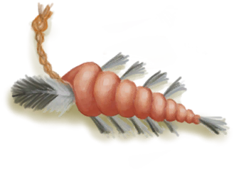
[Fish Bait(BluePrint)](Bp_FishBait.md)](Bp_FishBait.md)</td><td  style="text-align:left;vertical-align:top;"  >Craft BluePrint</td><td  style="text-align:left;vertical-align:top;"  >-10</td></tr><tr ><td  style="text-align:left;vertical-align:top;"  >[

[Fish Trap(BluePrint)](Bp_FishTrap.md)](Bp_FishTrap.md)</td><td  style="text-align:left;vertical-align:top;"  >Craft BluePrint</td><td  style="text-align:left;vertical-align:top;"  >-10</td></tr><tr ><td  style="text-align:left;vertical-align:top;"  >[
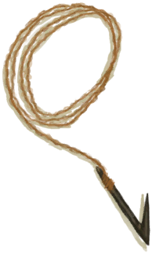
[Fishing Line(BluePrint)](Bp_FishingLine.md)](Bp_FishingLine.md)</td><td  style="text-align:left;vertical-align:top;"  >Craft BluePrint</td><td  style="text-align:left;vertical-align:top;"  >-10</td></tr><tr ><td  style="text-align:left;vertical-align:top;"  >[

[Fishing Rod(BluePrint)](Bp_FishingRod.md)](Bp_FishingRod.md)</td><td  style="text-align:left;vertical-align:top;"  >Craft BluePrint</td><td  style="text-align:left;vertical-align:top;"  >-10</td></tr><tr ><td  style="text-align:left;vertical-align:top;"  >[

[Fishing Spear(BluePrint)](Bp_FishingSpear.md)](Bp_FishingSpear.md)</td><td  style="text-align:left;vertical-align:top;"  >Craft BluePrint</td><td  style="text-align:left;vertical-align:top;"  >-10</td></tr><tr ><td  style="text-align:left;vertical-align:top;"  >[

[Flint Axe(BluePrint)](Bp_FlintAxe.md)](Bp_FlintAxe.md)</td><td  style="text-align:left;vertical-align:top;"  >Craft BluePrint</td><td  style="text-align:left;vertical-align:top;"  >-10</td></tr><tr ><td  style="text-align:left;vertical-align:top;"  >[

[Flint Knife(BluePrint)](Bp_FlintKnife.md)](Bp_FlintKnife.md)</td><td  style="text-align:left;vertical-align:top;"  >Craft BluePrint</td><td  style="text-align:left;vertical-align:top;"  >-10</td></tr><tr ><td  style="text-align:left;vertical-align:top;"  >[

[Flint Spear(BluePrint)](Bp_FlintSpear.md)](Bp_FlintSpear.md)</td><td  style="text-align:left;vertical-align:top;"  >Craft BluePrint</td><td  style="text-align:left;vertical-align:top;"  >-10</td></tr><tr ><td  style="text-align:left;vertical-align:top;"  >[

[Bone Flute(BluePrint)](Bp_FluteBone.md)](Bp_FluteBone.md)</td><td  style="text-align:left;vertical-align:top;"  >Craft BluePrint</td><td  style="text-align:left;vertical-align:top;"  >-10</td></tr><tr ><td  style="text-align:left;vertical-align:top;"  >[

[Wooden Flute(BluePrint)](Bp_FluteWooden.md)](Bp_FluteWooden.md)</td><td  style="text-align:left;vertical-align:top;"  >Craft BluePrint</td><td  style="text-align:left;vertical-align:top;"  >-10</td></tr><tr ><td  style="text-align:left;vertical-align:top;"  >[

[Forge(BluePrint)](Bp_Forge.md)](Bp_Forge.md)</td><td  style="text-align:left;vertical-align:top;"  >Craft BluePrint</td><td  style="text-align:left;vertical-align:top;"  >-10</td></tr><tr ><td  style="text-align:left;vertical-align:top;"  >[

[Glue(BluePrint)](Bp_Glue.md)](Bp_Glue.md)</td><td  style="text-align:left;vertical-align:top;"  >Craft BluePrint</td><td  style="text-align:left;vertical-align:top;"  >-10</td></tr><tr ><td  style="text-align:left;vertical-align:top;"  >[

[Goat Feeder(BluePrint)](Bp_GoatFeeder.md)](Bp_GoatFeeder.md)</td><td  style="text-align:left;vertical-align:top;"  >Craft BluePrint</td><td  style="text-align:left;vertical-align:top;"  >-10</td></tr><tr ><td  style="text-align:left;vertical-align:top;"  >[

[Hand Drill(BluePrint)](Bp_HandDrill.md)](Bp_HandDrill.md)</td><td  style="text-align:left;vertical-align:top;"  >Craft BluePrint</td><td  style="text-align:left;vertical-align:top;"  >-10</td></tr><tr ><td  style="text-align:left;vertical-align:top;"  >[

[Harpoon(BluePrint)](Bp_Harpoon.md)](Bp_Harpoon.md)</td><td  style="text-align:left;vertical-align:top;"  >Craft BluePrint</td><td  style="text-align:left;vertical-align:top;"  >-10</td></tr><tr ><td  style="text-align:left;vertical-align:top;"  >[

[Honey(BluePrint)](Bp_Honey.md)](Bp_Honey.md)</td><td  style="text-align:left;vertical-align:top;"  >Craft BluePrint</td><td  style="text-align:left;vertical-align:top;"  >-10</td></tr><tr ><td  style="text-align:left;vertical-align:top;"  >[

[Kiln(BluePrint)](Bp_Kiln.md)](Bp_Kiln.md)</td><td  style="text-align:left;vertical-align:top;"  >Craft BluePrint</td><td  style="text-align:left;vertical-align:top;"  >-10</td></tr><tr ><td  style="text-align:left;vertical-align:top;"  >[

[Advanced Kiln(BluePrint)](Bp_KilnAdvanced.md)](Bp_KilnAdvanced.md)</td><td  style="text-align:left;vertical-align:top;"  >Craft BluePrint</td><td  style="text-align:left;vertical-align:top;"  >-10</td></tr><tr ><td  style="text-align:left;vertical-align:top;"  >[

[Leaf Bed(BluePrint)](Bp_Leafbed.md)](Bp_Leafbed.md)</td><td  style="text-align:left;vertical-align:top;"  >Craft BluePrint</td><td  style="text-align:left;vertical-align:top;"  >-10</td></tr><tr ><td  style="text-align:left;vertical-align:top;"  >[

[Lizard Drum(BluePrint)](Bp_LizardDrum.md)](Bp_LizardDrum.md)</td><td  style="text-align:left;vertical-align:top;"  >Craft BluePrint</td><td  style="text-align:left;vertical-align:top;"  >-10</td></tr><tr ><td  style="text-align:left;vertical-align:top;"  >[

[Log Trap(BluePrint)](Bp_LogTrap.md)](Bp_LogTrap.md)</td><td  style="text-align:left;vertical-align:top;"  >Craft BluePrint</td><td  style="text-align:left;vertical-align:top;"  >-10</td></tr><tr ><td  style="text-align:left;vertical-align:top;"  >[

[Loom(BluePrint)](Bp_Loom.md)](Bp_Loom.md)</td><td  style="text-align:left;vertical-align:top;"  >Craft BluePrint</td><td  style="text-align:left;vertical-align:top;"  >-10</td></tr><tr ><td  style="text-align:left;vertical-align:top;"  >[

[Mermaid Nest(BluePrint)](Bp_MermaidNest.md)](Bp_MermaidNest.md)</td><td  style="text-align:left;vertical-align:top;"  >Craft BluePrint</td><td  style="text-align:left;vertical-align:top;"  >-10</td></tr><tr ><td  style="text-align:left;vertical-align:top;"  >[

[Axe Mold(BluePrint)](Bp_MoldAxe.md)](Bp_MoldAxe.md)</td><td  style="text-align:left;vertical-align:top;"  >Craft BluePrint</td><td  style="text-align:left;vertical-align:top;"  >-10</td></tr><tr ><td  style="text-align:left;vertical-align:top;"  >[

[Decoration Mold(BluePrint)](Bp_MoldDecoration.md)](Bp_MoldDecoration.md)</td><td  style="text-align:left;vertical-align:top;"  >Craft BluePrint</td><td  style="text-align:left;vertical-align:top;"  >-10</td></tr><tr ><td  style="text-align:left;vertical-align:top;"  >[

[Knife Mold(BluePrint)](Bp_MoldKnife.md)](Bp_MoldKnife.md)</td><td  style="text-align:left;vertical-align:top;"  >Craft BluePrint</td><td  style="text-align:left;vertical-align:top;"  >-10</td></tr><tr ><td  style="text-align:left;vertical-align:top;"  >[

[Shovel Mold(BluePrint)](Bp_MoldShovel.md)](Bp_MoldShovel.md)</td><td  style="text-align:left;vertical-align:top;"  >Craft BluePrint</td><td  style="text-align:left;vertical-align:top;"  >-10</td></tr><tr ><td  style="text-align:left;vertical-align:top;"  >[

[Spear Mold(BluePrint)](Bp_MoldSpear.md)](Bp_MoldSpear.md)</td><td  style="text-align:left;vertical-align:top;"  >Craft BluePrint</td><td  style="text-align:left;vertical-align:top;"  >-10</td></tr><tr ><td  style="text-align:left;vertical-align:top;"  >[

[Mortar(BluePrint)](Bp_Mortar.md)](Bp_Mortar.md)</td><td  style="text-align:left;vertical-align:top;"  >Craft BluePrint</td><td  style="text-align:left;vertical-align:top;"  >-10</td></tr><tr ><td  style="text-align:left;vertical-align:top;"  >[

[Mud Hut(BluePrint)](Bp_MudHut.md)](Bp_MudHut.md)</td><td  style="text-align:left;vertical-align:top;"  >Craft BluePrint</td><td  style="text-align:left;vertical-align:top;"  >-10</td></tr><tr ><td  style="text-align:left;vertical-align:top;"  >[

[Mushroom Bed(BluePrint)](Bp_MushroomBed.md)](Bp_MushroomBed.md)</td><td  style="text-align:left;vertical-align:top;"  >Craft BluePrint</td><td  style="text-align:left;vertical-align:top;"  >-10</td></tr><tr ><td  style="text-align:left;vertical-align:top;"  >[

[Niter Bed(BluePrint)](Bp_NiterBed.md)](Bp_NiterBed.md)</td><td  style="text-align:left;vertical-align:top;"  >Craft BluePrint</td><td  style="text-align:left;vertical-align:top;"  >-10</td></tr><tr ><td  style="text-align:left;vertical-align:top;"  >[

[Obsidian Knife(BluePrint)](Bp_ObsidianKnife.md)](Bp_ObsidianKnife.md)</td><td  style="text-align:left;vertical-align:top;"  >Craft BluePrint</td><td  style="text-align:left;vertical-align:top;"  >-10</td></tr><tr ><td  style="text-align:left;vertical-align:top;"  >[

[Obsidian Spear(BluePrint)](Bp_ObsidianSpear.md)](Bp_ObsidianSpear.md)</td><td  style="text-align:left;vertical-align:top;"  >Craft BluePrint</td><td  style="text-align:left;vertical-align:top;"  >-10</td></tr><tr ><td  style="text-align:left;vertical-align:top;"  >[

[Partridge Feeder(BluePrint)](Bp_PartridgeFeeder.md)](Bp_PartridgeFeeder.md)</td><td  style="text-align:left;vertical-align:top;"  >Craft BluePrint</td><td  style="text-align:left;vertical-align:top;"  >-10</td></tr><tr ><td  style="text-align:left;vertical-align:top;"  >[

[Brimstone Pesticide(BluePrint)](Bp_PesticideBrimstone.md)](Bp_PesticideBrimstone.md)</td><td  style="text-align:left;vertical-align:top;"  >Craft BluePrint</td><td  style="text-align:left;vertical-align:top;"  >-10</td></tr><tr ><td  style="text-align:left;vertical-align:top;"  >[

[Chilli Pesticide(BluePrint)](Bp_PesticideChilli.md)](Bp_PesticideChilli.md)</td><td  style="text-align:left;vertical-align:top;"  >Craft BluePrint</td><td  style="text-align:left;vertical-align:top;"  >-10</td></tr><tr ><td  style="text-align:left;vertical-align:top;"  >[

[Wooden Planks(BluePrint)](Bp_Planks.md)](Bp_Planks.md)</td><td  style="text-align:left;vertical-align:top;"  >Craft BluePrint</td><td  style="text-align:left;vertical-align:top;"  >-10</td></tr><tr ><td  style="text-align:left;vertical-align:top;"  >[

[Pottery Wheel(BluePrint)](Bp_PotteryWheel.md)](Bp_PotteryWheel.md)</td><td  style="text-align:left;vertical-align:top;"  >Craft BluePrint</td><td  style="text-align:left;vertical-align:top;"  >-10</td></tr><tr ><td  style="text-align:left;vertical-align:top;"  >[

[Cinchona Powder(BluePrint)](Bp_Quinine.md)](Bp_Quinine.md)</td><td  style="text-align:left;vertical-align:top;"  >Craft BluePrint</td><td  style="text-align:left;vertical-align:top;"  >-10</td></tr><tr ><td  style="text-align:left;vertical-align:top;"  >[

[Quinine Sulfate(BluePrint)](Bp_QuinineSulfate.md)](Bp_QuinineSulfate.md)</td><td  style="text-align:left;vertical-align:top;"  >Craft BluePrint</td><td  style="text-align:left;vertical-align:top;"  >-10</td></tr><tr ><td  style="text-align:left;vertical-align:top;"  >[

[Raft(BluePrint)](Bp_Raft.md)](Bp_Raft.md)</td><td  style="text-align:left;vertical-align:top;"  >Craft BluePrint</td><td  style="text-align:left;vertical-align:top;"  >-10</td></tr><tr ><td  style="text-align:left;vertical-align:top;"  >[

[Fish Trap(BluePrint)](Bp_RaftFishTrap.md)](Bp_RaftFishTrap.md)</td><td  style="text-align:left;vertical-align:top;"  >Craft BluePrint</td><td  style="text-align:left;vertical-align:top;"  >-10</td></tr><tr ><td  style="text-align:left;vertical-align:top;"  >[

[Raft Shelter(BluePrint)](Bp_RaftShelter.md)](Bp_RaftShelter.md)</td><td  style="text-align:left;vertical-align:top;"  >Craft BluePrint</td><td  style="text-align:left;vertical-align:top;"  >-10</td></tr><tr ><td  style="text-align:left;vertical-align:top;"  >[

[Raincatcher(BluePrint)](Bp_Raincatcher.md)](Bp_Raincatcher.md)</td><td  style="text-align:left;vertical-align:top;"  >Craft BluePrint</td><td  style="text-align:left;vertical-align:top;"  >-10</td></tr><tr ><td  style="text-align:left;vertical-align:top;"  >[

[Rice Paddy(BluePrint)](Bp_RicePaddy.md)](Bp_RicePaddy.md)</td><td  style="text-align:left;vertical-align:top;"  >Craft BluePrint</td><td  style="text-align:left;vertical-align:top;"  >-10</td></tr><tr ><td  style="text-align:left;vertical-align:top;"  >[

[Rustic Spear(BluePrint)](Bp_RusticSpear.md)](Bp_RusticSpear.md)</td><td  style="text-align:left;vertical-align:top;"  >Craft BluePrint</td><td  style="text-align:left;vertical-align:top;"  >-10</td></tr><tr ><td  style="text-align:left;vertical-align:top;"  >[
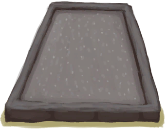
[Salt Bed(BluePrint)](Bp_SaltBed.md)](Bp_SaltBed.md)</td><td  style="text-align:left;vertical-align:top;"  >Craft BluePrint</td><td  style="text-align:left;vertical-align:top;"  >-10</td></tr><tr ><td  style="text-align:left;vertical-align:top;"  >[

[Scarecrow(BluePrint)](Bp_Scarecrow.md)](Bp_Scarecrow.md)</td><td  style="text-align:left;vertical-align:top;"  >Craft BluePrint</td><td  style="text-align:left;vertical-align:top;"  >-10</td></tr><tr ><td  style="text-align:left;vertical-align:top;"  >[

[Scrap Axe(BluePrint)](Bp_ScrapAxe.md)](Bp_ScrapAxe.md)</td><td  style="text-align:left;vertical-align:top;"  >Craft BluePrint</td><td  style="text-align:left;vertical-align:top;"  >-10</td></tr><tr ><td  style="text-align:left;vertical-align:top;"  >[

[Scrap Knife(BluePrint)](Bp_ScrapKnife.md)](Bp_ScrapKnife.md)</td><td  style="text-align:left;vertical-align:top;"  >Craft BluePrint</td><td  style="text-align:left;vertical-align:top;"  >-10</td></tr><tr ><td  style="text-align:left;vertical-align:top;"  >[

[Scrap Shovel(BluePrint)](Bp_ScrapShovel.md)](Bp_ScrapShovel.md)</td><td  style="text-align:left;vertical-align:top;"  >Craft BluePrint</td><td  style="text-align:left;vertical-align:top;"  >-10</td></tr><tr ><td  style="text-align:left;vertical-align:top;"  >[

[Scrap Spear(BluePrint)](Bp_ScrapSpear.md)](Bp_ScrapSpear.md)</td><td  style="text-align:left;vertical-align:top;"  >Craft BluePrint</td><td  style="text-align:left;vertical-align:top;"  >-10</td></tr><tr ><td  style="text-align:left;vertical-align:top;"  >[

[Sharpened Stone(BluePrint)](Bp_SharpenedStone.md)](Bp_SharpenedStone.md)</td><td  style="text-align:left;vertical-align:top;"  >Craft BluePrint</td><td  style="text-align:left;vertical-align:top;"  >-10</td></tr><tr ><td  style="text-align:left;vertical-align:top;"  >[

[Shed(BluePrint)](Bp_Shed.md)](Bp_Shed.md)</td><td  style="text-align:left;vertical-align:top;"  >Craft BluePrint</td><td  style="text-align:left;vertical-align:top;"  >-10</td></tr><tr ><td  style="text-align:left;vertical-align:top;"  >[

[Shelf(BluePrint)](Bp_Shelf.md)](Bp_Shelf.md)</td><td  style="text-align:left;vertical-align:top;"  >Craft BluePrint</td><td  style="text-align:left;vertical-align:top;"  >-10</td></tr><tr ><td  style="text-align:left;vertical-align:top;"  >[

[Shelter(BluePrint)](Bp_Shelter.md)](Bp_Shelter.md)</td><td  style="text-align:left;vertical-align:top;"  >Craft BluePrint</td><td  style="text-align:left;vertical-align:top;"  >-10</td></tr><tr ><td  style="text-align:left;vertical-align:top;"  >[

[Shield(BluePrint)](Bp_Shield.md)](Bp_Shield.md)</td><td  style="text-align:left;vertical-align:top;"  >Craft BluePrint</td><td  style="text-align:left;vertical-align:top;"  >-10</td></tr><tr ><td  style="text-align:left;vertical-align:top;"  >[

[Shower(BluePrint)](Bp_Shower.md)](Bp_Shower.md)</td><td  style="text-align:left;vertical-align:top;"  >Craft BluePrint</td><td  style="text-align:left;vertical-align:top;"  >-10</td></tr><tr ><td  style="text-align:left;vertical-align:top;"  >[

[Sling(BluePrint)](Bp_Sling.md)](Bp_Sling.md)</td><td  style="text-align:left;vertical-align:top;"  >Craft BluePrint</td><td  style="text-align:left;vertical-align:top;"  >-10</td></tr><tr ><td  style="text-align:left;vertical-align:top;"  >[

[Snare Trap(BluePrint)](Bp_SnareTrap.md)](Bp_SnareTrap.md)</td><td  style="text-align:left;vertical-align:top;"  >Craft BluePrint</td><td  style="text-align:left;vertical-align:top;"  >-10</td></tr><tr ><td  style="text-align:left;vertical-align:top;"  >[

[Soap(BluePrint)](Bp_Soap.md)](Bp_Soap.md)</td><td  style="text-align:left;vertical-align:top;"  >Craft BluePrint</td><td  style="text-align:left;vertical-align:top;"  >-10</td></tr><tr ><td  style="text-align:left;vertical-align:top;"  >[
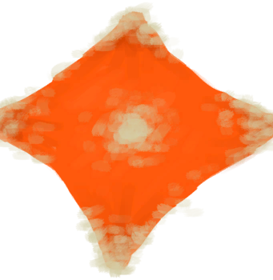
[Solar Still(BluePrint)](Bp_SolarStill.md)](Bp_SolarStill.md)</td><td  style="text-align:left;vertical-align:top;"  >Craft BluePrint</td><td  style="text-align:left;vertical-align:top;"  >-10</td></tr><tr ><td  style="text-align:left;vertical-align:top;"  >[

[Spindle(BluePrint)](Bp_Spindle.md)](Bp_Spindle.md)</td><td  style="text-align:left;vertical-align:top;"  >Craft BluePrint</td><td  style="text-align:left;vertical-align:top;"  >-10</td></tr><tr ><td  style="text-align:left;vertical-align:top;"  >[

[Splint(BluePrint)](Bp_Splint.md)](Bp_Splint.md)</td><td  style="text-align:left;vertical-align:top;"  >Craft BluePrint</td><td  style="text-align:left;vertical-align:top;"  >-10</td></tr><tr ><td  style="text-align:left;vertical-align:top;"  >[

[Stone Axe(BluePrint)](Bp_StoneAxe.md)](Bp_StoneAxe.md)</td><td  style="text-align:left;vertical-align:top;"  >Craft BluePrint</td><td  style="text-align:left;vertical-align:top;"  >-10</td></tr><tr ><td  style="text-align:left;vertical-align:top;"  >[

[Stone Hut(BluePrint)](Bp_StoneHut.md)](Bp_StoneHut.md)</td><td  style="text-align:left;vertical-align:top;"  >Craft BluePrint</td><td  style="text-align:left;vertical-align:top;"  >-10</td></tr><tr ><td  style="text-align:left;vertical-align:top;"  >[

[Stove(BluePrint)](Bp_Stove.md)](Bp_Stove.md)</td><td  style="text-align:left;vertical-align:top;"  >Craft BluePrint</td><td  style="text-align:left;vertical-align:top;"  >-10</td></tr><tr ><td  style="text-align:left;vertical-align:top;"  >[
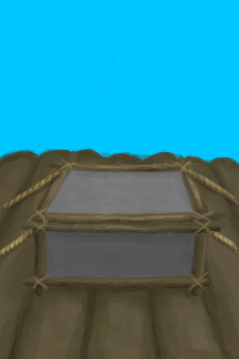
[Supply Chest(BluePrint)](Bp_SupplyChest.md)](Bp_SupplyChest.md)</td><td  style="text-align:left;vertical-align:top;"  >Craft BluePrint</td><td  style="text-align:left;vertical-align:top;"  >-10</td></tr><tr ><td  style="text-align:left;vertical-align:top;"  >[

[Table(BluePrint)](Bp_Table.md)](Bp_Table.md)</td><td  style="text-align:left;vertical-align:top;"  >Craft BluePrint</td><td  style="text-align:left;vertical-align:top;"  >-10</td></tr><tr ><td  style="text-align:left;vertical-align:top;"  >[

[Torch(BluePrint)](Bp_Torch.md)](Bp_Torch.md)</td><td  style="text-align:left;vertical-align:top;"  >Craft BluePrint</td><td  style="text-align:left;vertical-align:top;"  >-10</td></tr><tr ><td  style="text-align:left;vertical-align:top;"  >[

[Tourniquet(BluePrint)](Bp_Tourniquet.md)](Bp_Tourniquet.md)</td><td  style="text-align:left;vertical-align:top;"  >Craft BluePrint</td><td  style="text-align:left;vertical-align:top;"  >-10</td></tr><tr ><td  style="text-align:left;vertical-align:top;"  >[

[Improvised Tourniquet(BluePrint)](Bp_TourniquetRustic.md)](Bp_TourniquetRustic.md)</td><td  style="text-align:left;vertical-align:top;"  >Craft BluePrint</td><td  style="text-align:left;vertical-align:top;"  >-10</td></tr><tr ><td  style="text-align:left;vertical-align:top;"  >[

[Trapping Pit(BluePrint)](Bp_TrappingPit.md)](Bp_TrappingPit.md)</td><td  style="text-align:left;vertical-align:top;"  >Craft BluePrint</td><td  style="text-align:left;vertical-align:top;"  >-10</td></tr><tr ><td  style="text-align:left;vertical-align:top;"  >[

[Travois(BluePrint)](Bp_Travois.md)](Bp_Travois.md)</td><td  style="text-align:left;vertical-align:top;"  >Craft BluePrint</td><td  style="text-align:left;vertical-align:top;"  >-10</td></tr><tr ><td  style="text-align:left;vertical-align:top;"  >[

[Treenails(BluePrint)](Bp_Treenails.md)](Bp_Treenails.md)</td><td  style="text-align:left;vertical-align:top;"  >Craft BluePrint</td><td  style="text-align:left;vertical-align:top;"  >-10</td></tr><tr ><td  style="text-align:left;vertical-align:top;"  >[

[Vitriol(BluePrint)](Bp_Vitriol.md)](Bp_Vitriol.md)</td><td  style="text-align:left;vertical-align:top;"  >Craft BluePrint</td><td  style="text-align:left;vertical-align:top;"  >-10</td></tr><tr ><td  style="text-align:left;vertical-align:top;"  >[

[Water Filter(BluePrint)](Bp_WaterFilter.md)](Bp_WaterFilter.md)</td><td  style="text-align:left;vertical-align:top;"  >Craft BluePrint</td><td  style="text-align:left;vertical-align:top;"  >-10</td></tr><tr ><td  style="text-align:left;vertical-align:top;"  >[

[Water Reservoir(BluePrint)](Bp_WaterReservoir.md)](Bp_WaterReservoir.md)</td><td  style="text-align:left;vertical-align:top;"  >Craft BluePrint</td><td  style="text-align:left;vertical-align:top;"  >-10</td></tr><tr ><td  style="text-align:left;vertical-align:top;"  >[

[Watering Trough(BluePrint)](Bp_WateringTrough.md)](Bp_WateringTrough.md)</td><td  style="text-align:left;vertical-align:top;"  >Craft BluePrint</td><td  style="text-align:left;vertical-align:top;"  >-10</td></tr><tr ><td  style="text-align:left;vertical-align:top;"  >[

[Well(BluePrint)](Bp_Well.md)](Bp_Well.md)</td><td  style="text-align:left;vertical-align:top;"  >Craft BluePrint</td><td  style="text-align:left;vertical-align:top;"  >-10</td></tr><tr ><td  style="text-align:left;vertical-align:top;"  >[

[Weston(BluePrint)](Bp_Weston.md)](Bp_Weston.md)</td><td  style="text-align:left;vertical-align:top;"  >Craft BluePrint</td><td  style="text-align:left;vertical-align:top;"  >-10</td></tr><tr ><td  style="text-align:left;vertical-align:top;"  >[
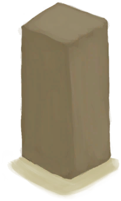
[Wood Carvings(BluePrint)](Bp_WoodCarvings.md)](Bp_WoodCarvings.md)</td><td  style="text-align:left;vertical-align:top;"  >Craft BluePrint</td><td  style="text-align:left;vertical-align:top;"  >-10</td></tr><tr ><td  style="text-align:left;vertical-align:top;"  >[

[Wood Shavings(BluePrint)](Bp_WoodShavings.md)](Bp_WoodShavings.md)</td><td  style="text-align:left;vertical-align:top;"  >Craft BluePrint</td><td  style="text-align:left;vertical-align:top;"  >-10</td></tr><tr ><td  style="text-align:left;vertical-align:top;"  >[

[Wooden Shovel(BluePrint)](Bp_WoodenShovel.md)](Bp_WoodenShovel.md)</td><td  style="text-align:left;vertical-align:top;"  >Craft BluePrint</td><td  style="text-align:left;vertical-align:top;"  >-10</td></tr><tr ><td  style="text-align:left;vertical-align:top;"  >[
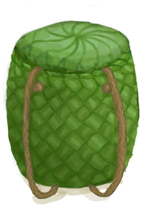
[Woven Backpack(BluePrint)](Bp_WovenBackpack.md)](Bp_WovenBackpack.md)</td><td  style="text-align:left;vertical-align:top;"  >Craft BluePrint</td><td  style="text-align:left;vertical-align:top;"  >-10</td></tr><tr ><td  style="text-align:left;vertical-align:top;"  >[

[Woven Basket(BluePrint)](Bp_WovenBasket.md)](Bp_WovenBasket.md)</td><td  style="text-align:left;vertical-align:top;"  >Craft BluePrint</td><td  style="text-align:left;vertical-align:top;"  >-10</td></tr><tr ><td  style="text-align:left;vertical-align:top;"  >[
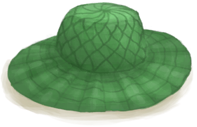
[Woven Hat(BluePrint)](Bp_WovenHat.md)](Bp_WovenHat.md)</td><td  style="text-align:left;vertical-align:top;"  >Craft BluePrint</td><td  style="text-align:left;vertical-align:top;"  >-10</td></tr><tr ><td  style="text-align:left;vertical-align:top;"  >[

[Bedroll(BluePrint)](Bp_Bedroll.md)](Bp_Bedroll.md)</td><td  style="text-align:left;vertical-align:top;"  >Craft BluePrint</td><td  style="text-align:left;vertical-align:top;"  >-10</td></tr><tr ><td  style="text-align:left;vertical-align:top;"  >[

[Bone Broth(BluePrint)](Bp_BoneBroth.md)](Bp_BoneBroth.md)</td><td  style="text-align:left;vertical-align:top;"  >Craft BluePrint</td><td  style="text-align:left;vertical-align:top;"  >-10</td></tr><tr ><td  style="text-align:left;vertical-align:top;"  >[

[Butter(BluePrint)](Bp_Butter.md)](Bp_Butter.md)</td><td  style="text-align:left;vertical-align:top;"  >Craft BluePrint</td><td  style="text-align:left;vertical-align:top;"  >-10</td></tr><tr ><td  style="text-align:left;vertical-align:top;"  >[

[Butter Baked Oysters(BluePrint)](Bp_ButterBakedOysters.md)](Bp_ButterBakedOysters.md)</td><td  style="text-align:left;vertical-align:top;"  >Craft BluePrint</td><td  style="text-align:left;vertical-align:top;"  >-10</td></tr><tr ><td  style="text-align:left;vertical-align:top;"  >[

[Candied Ginger(BluePrint)](Bp_CandiedGinger.md)](Bp_CandiedGinger.md)</td><td  style="text-align:left;vertical-align:top;"  >Craft BluePrint</td><td  style="text-align:left;vertical-align:top;"  >-10</td></tr><tr ><td  style="text-align:left;vertical-align:top;"  >[

[Cheese(BluePrint)](Bp_Cheese.md)](Bp_Cheese.md)</td><td  style="text-align:left;vertical-align:top;"  >Craft BluePrint</td><td  style="text-align:left;vertical-align:top;"  >-10</td></tr><tr ><td  style="text-align:left;vertical-align:top;"  >[

[Chicken Sandwich(BluePrint)](Bp_ChickenSandwich.md)](Bp_ChickenSandwich.md)</td><td  style="text-align:left;vertical-align:top;"  >Craft BluePrint</td><td  style="text-align:left;vertical-align:top;"  >-10</td></tr><tr ><td  style="text-align:left;vertical-align:top;"  >[

[Coconut Fish(BluePrint)](Bp_CoconutFish.md)](Bp_CoconutFish.md)</td><td  style="text-align:left;vertical-align:top;"  >Craft BluePrint</td><td  style="text-align:left;vertical-align:top;"  >-10</td></tr><tr ><td  style="text-align:left;vertical-align:top;"  >[

[Coconut Milk(BluePrint)](Bp_CoconutMilk.md)](Bp_CoconutMilk.md)</td><td  style="text-align:left;vertical-align:top;"  >Craft BluePrint</td><td  style="text-align:left;vertical-align:top;"  >-10</td></tr><tr ><td  style="text-align:left;vertical-align:top;"  >[

[Drunken Crab(BluePrint)](Bp_DrunkenCrab.md)](Bp_DrunkenCrab.md)</td><td  style="text-align:left;vertical-align:top;"  >Craft BluePrint</td><td  style="text-align:left;vertical-align:top;"  >-10</td></tr><tr ><td  style="text-align:left;vertical-align:top;"  >[

[Egg Fried Rice(BluePrint)](Bp_EggFriedRice.md)](Bp_EggFriedRice.md)</td><td  style="text-align:left;vertical-align:top;"  >Craft BluePrint</td><td  style="text-align:left;vertical-align:top;"  >-10</td></tr><tr ><td  style="text-align:left;vertical-align:top;"  >[

[Fish N' Chips(BluePrint)](Bp_FishNChips.md)](Bp_FishNChips.md)</td><td  style="text-align:left;vertical-align:top;"  >Craft BluePrint</td><td  style="text-align:left;vertical-align:top;"  >-10</td></tr><tr ><td  style="text-align:left;vertical-align:top;"  >[

[Fish Omelette(BluePrint)](Bp_FishOmelette.md)](Bp_FishOmelette.md)</td><td  style="text-align:left;vertical-align:top;"  >Craft BluePrint</td><td  style="text-align:left;vertical-align:top;"  >-10</td></tr><tr ><td  style="text-align:left;vertical-align:top;"  >[

[Salted Fish Meat(BluePrint)](Bp_FishSalted.md)](Bp_FishSalted.md)</td><td  style="text-align:left;vertical-align:top;"  >Craft BluePrint</td><td  style="text-align:left;vertical-align:top;"  >-10</td></tr><tr ><td  style="text-align:left;vertical-align:top;"  >[

[Fish Taco(BluePrint)](Bp_FishTaco.md)](Bp_FishTaco.md)</td><td  style="text-align:left;vertical-align:top;"  >Craft BluePrint</td><td  style="text-align:left;vertical-align:top;"  >-10</td></tr><tr ><td  style="text-align:left;vertical-align:top;"  >[

[Fried Bananas(BluePrint)](Bp_FriedBananas.md)](Bp_FriedBananas.md)</td><td  style="text-align:left;vertical-align:top;"  >Craft BluePrint</td><td  style="text-align:left;vertical-align:top;"  >-10</td></tr><tr ><td  style="text-align:left;vertical-align:top;"  >[

[Fried Puffballs(BluePrint)](Bp_FriedPuffballs.md)](Bp_FriedPuffballs.md)</td><td  style="text-align:left;vertical-align:top;"  >Craft BluePrint</td><td  style="text-align:left;vertical-align:top;"  >-10</td></tr><tr ><td  style="text-align:left;vertical-align:top;"  >[

[Goat Stew(BluePrint)](Bp_GoatStew.md)](Bp_GoatStew.md)</td><td  style="text-align:left;vertical-align:top;"  >Craft BluePrint</td><td  style="text-align:left;vertical-align:top;"  >-10</td></tr><tr ><td  style="text-align:left;vertical-align:top;"  >[

[Hearty Feast(BluePrint)](Bp_HeartyFeast.md)](Bp_HeartyFeast.md)</td><td  style="text-align:left;vertical-align:top;"  >Craft BluePrint</td><td  style="text-align:left;vertical-align:top;"  >-10</td></tr><tr ><td  style="text-align:left;vertical-align:top;"  >[

[Honey Candy(BluePrint)](Bp_HoneyCandy.md)](Bp_HoneyCandy.md)</td><td  style="text-align:left;vertical-align:top;"  >Craft BluePrint</td><td  style="text-align:left;vertical-align:top;"  >-10</td></tr><tr ><td  style="text-align:left;vertical-align:top;"  >[

[Honey Glazed Pork(BluePrint)](Bp_HoneyGlazedPork.md)](Bp_HoneyGlazedPork.md)</td><td  style="text-align:left;vertical-align:top;"  >Craft BluePrint</td><td  style="text-align:left;vertical-align:top;"  >-10</td></tr><tr ><td  style="text-align:left;vertical-align:top;"  >[

[Island Chicken(BluePrint)](Bp_IslandChicken.md)](Bp_IslandChicken.md)</td><td  style="text-align:left;vertical-align:top;"  >Craft BluePrint</td><td  style="text-align:left;vertical-align:top;"  >-10</td></tr><tr ><td  style="text-align:left;vertical-align:top;"  >[

[Jungle Salad(BluePrint)](Bp_JungleSalad.md)](Bp_JungleSalad.md)</td><td  style="text-align:left;vertical-align:top;"  >Craft BluePrint</td><td  style="text-align:left;vertical-align:top;"  >-10</td></tr><tr ><td  style="text-align:left;vertical-align:top;"  >[

[Lizard Fry(BluePrint)](Bp_LizardFry.md)](Bp_LizardFry.md)</td><td  style="text-align:left;vertical-align:top;"  >Craft BluePrint</td><td  style="text-align:left;vertical-align:top;"  >-10</td></tr><tr ><td  style="text-align:left;vertical-align:top;"  >[

[Macaque Skewers(BluePrint)](Bp_MacaqueSkewers.md)](Bp_MacaqueSkewers.md)</td><td  style="text-align:left;vertical-align:top;"  >Craft BluePrint</td><td  style="text-align:left;vertical-align:top;"  >-10</td></tr><tr ><td  style="text-align:left;vertical-align:top;"  >[

[Salted Meat(BluePrint)](Bp_MeatSalted.md)](Bp_MeatSalted.md)</td><td  style="text-align:left;vertical-align:top;"  >Craft BluePrint</td><td  style="text-align:left;vertical-align:top;"  >-10</td></tr><tr ><td  style="text-align:left;vertical-align:top;"  >[

[Protein Bar(BluePrint)](Bp_ProteinBar.md)](Bp_ProteinBar.md)</td><td  style="text-align:left;vertical-align:top;"  >Craft BluePrint</td><td  style="text-align:left;vertical-align:top;"  >-10</td></tr><tr ><td  style="text-align:left;vertical-align:top;"  >[

[Sago Cake(BluePrint)](Bp_SagoCake.md)](Bp_SagoCake.md)</td><td  style="text-align:left;vertical-align:top;"  >Craft BluePrint</td><td  style="text-align:left;vertical-align:top;"  >-10</td></tr><tr ><td  style="text-align:left;vertical-align:top;"  >[

[Sago Slime(BluePrint)](Bp_SagoSlime.md)](Bp_SagoSlime.md)</td><td  style="text-align:left;vertical-align:top;"  >Craft BluePrint</td><td  style="text-align:left;vertical-align:top;"  >-10</td></tr><tr ><td  style="text-align:left;vertical-align:top;"  >[

[Seafood Cup(BluePrint)](Bp_SeafoodCup.md)](Bp_SeafoodCup.md)</td><td  style="text-align:left;vertical-align:top;"  >Craft BluePrint</td><td  style="text-align:left;vertical-align:top;"  >-10</td></tr><tr ><td  style="text-align:left;vertical-align:top;"  >[

[Sushi(BluePrint)](Bp_Sushi.md)](Bp_Sushi.md)</td><td  style="text-align:left;vertical-align:top;"  >Craft BluePrint</td><td  style="text-align:left;vertical-align:top;"  >-10</td></tr><tr ><td  style="text-align:left;vertical-align:top;"  >[

[Tonic Water(BluePrint)](Bp_TonicWater.md)](Bp_TonicWater.md)</td><td  style="text-align:left;vertical-align:top;"  >Craft BluePrint</td><td  style="text-align:left;vertical-align:top;"  >-10</td></tr><tr ><td  style="text-align:left;vertical-align:top;"  >[

[Yam Curry(BluePrint)](Bp_YamCurry.md)](Bp_YamCurry.md)</td><td  style="text-align:left;vertical-align:top;"  >Craft BluePrint</td><td  style="text-align:left;vertical-align:top;"  >-10</td></tr><tr ><td  style="text-align:left;vertical-align:top;"  >[

[Yam Jam(BluePrint)](Bp_YamJam.md)](Bp_YamJam.md)</td><td  style="text-align:left;vertical-align:top;"  >Craft BluePrint</td><td  style="text-align:left;vertical-align:top;"  >-10</td></tr><tr ><td  style="text-align:left;vertical-align:top;"  >[

[Alembic(BluePrint)](Bp_Alembic.md)](Bp_Alembic.md)</td><td  style="text-align:left;vertical-align:top;"  >Craft BluePrint</td><td  style="text-align:left;vertical-align:top;"  >-10</td></tr><tr ><td  style="text-align:left;vertical-align:top;"  >[

[Clay Bowl(BluePrint)](Bp_ClayBowl.md)](Bp_ClayBowl.md)</td><td  style="text-align:left;vertical-align:top;"  >Craft BluePrint</td><td  style="text-align:left;vertical-align:top;"  >-10</td></tr><tr ><td  style="text-align:left;vertical-align:top;"  >[

[Clay Fire Pit(BluePrint)](Bp_ClayFirePit.md)](Bp_ClayFirePit.md)</td><td  style="text-align:left;vertical-align:top;"  >Craft BluePrint</td><td  style="text-align:left;vertical-align:top;"  >-10</td></tr><tr ><td  style="text-align:left;vertical-align:top;"  >[

[Clay Jar(BluePrint)](Bp_ClayJar.md)](Bp_ClayJar.md)</td><td  style="text-align:left;vertical-align:top;"  >Craft BluePrint</td><td  style="text-align:left;vertical-align:top;"  >-10</td></tr><tr ><td  style="text-align:left;vertical-align:top;"  >[

[Clay Pot Cooler(BluePrint)](Bp_ClayPotCooler.md)](Bp_ClayPotCooler.md)</td><td  style="text-align:left;vertical-align:top;"  >Craft BluePrint</td><td  style="text-align:left;vertical-align:top;"  >-10</td></tr><tr ><td  style="text-align:left;vertical-align:top;"  >[

[Clay Vase(BluePrint)](Bp_ClayVase.md)](Bp_ClayVase.md)</td><td  style="text-align:left;vertical-align:top;"  >Craft BluePrint</td><td  style="text-align:left;vertical-align:top;"  >-10</td></tr><tr ><td  style="text-align:left;vertical-align:top;"  >[

[Cooking Pot(BluePrint)](Bp_CookingPot.md)](Bp_CookingPot.md)</td><td  style="text-align:left;vertical-align:top;"  >Craft BluePrint</td><td  style="text-align:left;vertical-align:top;"  >-10</td></tr><tr ><td  style="text-align:left;vertical-align:top;"  >[

[Glazed Vase(BluePrint)](Bp_GlazedVase.md)](Bp_GlazedVase.md)</td><td  style="text-align:left;vertical-align:top;"  >Craft BluePrint</td><td  style="text-align:left;vertical-align:top;"  >-10</td></tr><tr ><td  style="text-align:left;vertical-align:top;"  >[

[Bee Suit(BluePrint)](Bp_BeeSuit.md)](Bp_BeeSuit.md)</td><td  style="text-align:left;vertical-align:top;"  >Craft BluePrint</td><td  style="text-align:left;vertical-align:top;"  >-10</td></tr><tr ><td  style="text-align:left;vertical-align:top;"  >[

[Bellows(BluePrint)](Bp_Bellows.md)](Bp_Bellows.md)</td><td  style="text-align:left;vertical-align:top;"  >Craft BluePrint</td><td  style="text-align:left;vertical-align:top;"  >-10</td></tr><tr ><td  style="text-align:left;vertical-align:top;"  >[
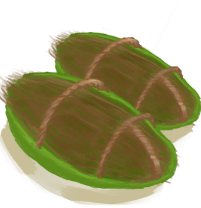
[Coconut Sandals(BluePrint)](Bp_CoconutSandals.md)](Bp_CoconutSandals.md)</td><td  style="text-align:left;vertical-align:top;"  >Craft BluePrint</td><td  style="text-align:left;vertical-align:top;"  >-10</td></tr><tr ><td  style="text-align:left;vertical-align:top;"  >[

[Copper Bottle(BluePrint)](Bp_CopperBottle.md)](Bp_CopperBottle.md)</td><td  style="text-align:left;vertical-align:top;"  >Craft BluePrint</td><td  style="text-align:left;vertical-align:top;"  >-10</td></tr><tr ><td  style="text-align:left;vertical-align:top;"  >[

[Copper Jar(BluePrint)](Bp_CopperJar.md)](Bp_CopperJar.md)</td><td  style="text-align:left;vertical-align:top;"  >Craft BluePrint</td><td  style="text-align:left;vertical-align:top;"  >-10</td></tr><tr ><td  style="text-align:left;vertical-align:top;"  >[

[Copper Necklace(BluePrint)](Bp_CopperNecklace.md)](Bp_CopperNecklace.md)</td><td  style="text-align:left;vertical-align:top;"  >Craft BluePrint</td><td  style="text-align:left;vertical-align:top;"  >-10</td></tr><tr ><td  style="text-align:left;vertical-align:top;"  >[

[Copper Needles(BluePrint)](Bp_CopperNeedles.md)](Bp_CopperNeedles.md)</td><td  style="text-align:left;vertical-align:top;"  >Craft BluePrint</td><td  style="text-align:left;vertical-align:top;"  >-10</td></tr><tr ><td  style="text-align:left;vertical-align:top;"  >[

[Copper Eating Utensils(BluePrint)](Bp_EatingUtensilsCopper.md)](Bp_EatingUtensilsCopper.md)</td><td  style="text-align:left;vertical-align:top;"  >Craft BluePrint</td><td  style="text-align:left;vertical-align:top;"  >-10</td></tr><tr ><td  style="text-align:left;vertical-align:top;"  >[

[Flower Necklace(BluePrint)](Bp_FlowerNecklace.md)](Bp_FlowerNecklace.md)</td><td  style="text-align:left;vertical-align:top;"  >Craft BluePrint</td><td  style="text-align:left;vertical-align:top;"  >-10</td></tr><tr ><td  style="text-align:left;vertical-align:top;"  >[

[Gas Mask(BluePrint)](Bp_GasMask.md)](Bp_GasMask.md)</td><td  style="text-align:left;vertical-align:top;"  >Craft BluePrint</td><td  style="text-align:left;vertical-align:top;"  >-10</td></tr><tr ><td  style="text-align:left;vertical-align:top;"  >[

[Hammock(BluePrint)](Bp_Hammock.md)](Bp_Hammock.md)</td><td  style="text-align:left;vertical-align:top;"  >Craft BluePrint</td><td  style="text-align:left;vertical-align:top;"  >-10</td></tr><tr ><td  style="text-align:left;vertical-align:top;"  >[

[Leaf Skirt(BluePrint)](Bp_LeafSkirt.md)](Bp_LeafSkirt.md)</td><td  style="text-align:left;vertical-align:top;"  >Craft BluePrint</td><td  style="text-align:left;vertical-align:top;"  >-10</td></tr><tr ><td  style="text-align:left;vertical-align:top;"  >[

[Leather Backpack(BluePrint)](Bp_LeatherBackpack.md)](Bp_LeatherBackpack.md)</td><td  style="text-align:left;vertical-align:top;"  >Craft BluePrint</td><td  style="text-align:left;vertical-align:top;"  >-10</td></tr><tr ><td  style="text-align:left;vertical-align:top;"  >[

[Leather Gloves(BluePrint)](Bp_LeatherGloves.md)](Bp_LeatherGloves.md)</td><td  style="text-align:left;vertical-align:top;"  >Craft BluePrint</td><td  style="text-align:left;vertical-align:top;"  >-10</td></tr><tr ><td  style="text-align:left;vertical-align:top;"  >[

[Leather Pants(BluePrint)](Bp_LeatherPants.md)](Bp_LeatherPants.md)</td><td  style="text-align:left;vertical-align:top;"  >Craft BluePrint</td><td  style="text-align:left;vertical-align:top;"  >-10</td></tr><tr ><td  style="text-align:left;vertical-align:top;"  >[

[Leather Shoes(BluePrint)](Bp_LeatherShoes.md)](Bp_LeatherShoes.md)</td><td  style="text-align:left;vertical-align:top;"  >Craft BluePrint</td><td  style="text-align:left;vertical-align:top;"  >-10</td></tr><tr ><td  style="text-align:left;vertical-align:top;"  >[

[Pearl Necklace(BluePrint)](Bp_PearlNecklace.md)](Bp_PearlNecklace.md)</td><td  style="text-align:left;vertical-align:top;"  >Craft BluePrint</td><td  style="text-align:left;vertical-align:top;"  >-10</td></tr><tr ><td  style="text-align:left;vertical-align:top;"  >[

[Quiver(BluePrint)](Bp_Quiver.md)](Bp_Quiver.md)</td><td  style="text-align:left;vertical-align:top;"  >Craft BluePrint</td><td  style="text-align:left;vertical-align:top;"  >-10</td></tr><tr ><td  style="text-align:left;vertical-align:top;"  >[

[Raincoat(BluePrint)](Bp_Raincoat.md)](Bp_Raincoat.md)</td><td  style="text-align:left;vertical-align:top;"  >Craft BluePrint</td><td  style="text-align:left;vertical-align:top;"  >-10</td></tr><tr ><td  style="text-align:left;vertical-align:top;"  >[
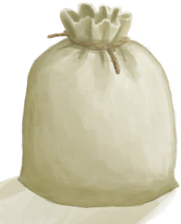
[Sack(BluePrint)](Bp_Sack.md)](Bp_Sack.md)</td><td  style="text-align:left;vertical-align:top;"  >Craft BluePrint</td><td  style="text-align:left;vertical-align:top;"  >-10</td></tr><tr ><td  style="text-align:left;vertical-align:top;"  >[

[Satchel(BluePrint)](Bp_Satchel.md)](Bp_Satchel.md)</td><td  style="text-align:left;vertical-align:top;"  >Craft BluePrint</td><td  style="text-align:left;vertical-align:top;"  >-10</td></tr><tr ><td  style="text-align:left;vertical-align:top;"  >[

[Seagull Charm(BluePrint)](Bp_SeagullCharm.md)](Bp_SeagullCharm.md)</td><td  style="text-align:left;vertical-align:top;"  >Craft BluePrint</td><td  style="text-align:left;vertical-align:top;"  >-10</td></tr><tr ><td  style="text-align:left;vertical-align:top;"  >[

[Seashell Necklace(BluePrint)](Bp_SeashellNecklace.md)](Bp_SeashellNecklace.md)</td><td  style="text-align:left;vertical-align:top;"  >Craft BluePrint</td><td  style="text-align:left;vertical-align:top;"  >-10</td></tr><tr ><td  style="text-align:left;vertical-align:top;"  >[

[Shark Headpiece(BluePrint)](Bp_SharkHeadpiece.md)](Bp_SharkHeadpiece.md)</td><td  style="text-align:left;vertical-align:top;"  >Craft BluePrint</td><td  style="text-align:left;vertical-align:top;"  >-10</td></tr><tr ><td  style="text-align:left;vertical-align:top;"  >[

[Shirt(BluePrint)](Bp_Shirt.md)](Bp_Shirt.md)</td><td  style="text-align:left;vertical-align:top;"  >Craft BluePrint</td><td  style="text-align:left;vertical-align:top;"  >-10</td></tr><tr ><td  style="text-align:left;vertical-align:top;"  >[

[Straw Cape(BluePrint)](Bp_StrawCape.md)](Bp_StrawCape.md)</td><td  style="text-align:left;vertical-align:top;"  >Craft BluePrint</td><td  style="text-align:left;vertical-align:top;"  >-10</td></tr><tr ><td  style="text-align:left;vertical-align:top;"  >[

[Waterskin(BluePrint)](Bp_Waterskin.md)](Bp_Waterskin.md)</td><td  style="text-align:left;vertical-align:top;"  >Craft BluePrint</td><td  style="text-align:left;vertical-align:top;"  >-10</td></tr><tr ><td  style="text-align:left;vertical-align:top;"  >[

[Wooden Needles(BluePrint)](Bp_WoodenNeedles.md)](Bp_WoodenNeedles.md)</td><td  style="text-align:left;vertical-align:top;"  >Craft BluePrint</td><td  style="text-align:left;vertical-align:top;"  >-10</td></tr><tr ><td  style="text-align:left;vertical-align:top;"  >[

[Weston(Special1e)(Event)](Event_WestonSpecial1e.md)](Event_WestonSpecial1e.md)</td><td  style="text-align:left;vertical-align:top;"  >Continue</td><td  style="text-align:left;vertical-align:top;"  >-10</td></tr><tr ><td  style="text-align:left;vertical-align:top;"  >[

[Coconut](Coconut.md)](Coconut.md)</td><td  style="text-align:left;vertical-align:top;"  >Perforate Coconut ** With：**[“Cutter”](tag_Cutter.md)</td><td  style="text-align:left;vertical-align:top;"  >-10</td></tr><tr ><td  style="text-align:left;vertical-align:top;"  >[

[Coconut](Coconut.md)](Coconut.md)</td><td  style="text-align:left;vertical-align:top;"  >Crack Coconut open ** With：**[“Hammer”](tag_Hammer.md)</td><td  style="text-align:left;vertical-align:top;"  >-10</td></tr><tr ><td  style="text-align:left;vertical-align:top;"  >[

[Coconut Husk](CoconutHusk.md)](CoconutHusk.md)</td><td  style="text-align:left;vertical-align:top;"  >Extract Fibers</td><td  style="text-align:left;vertical-align:top;"  >-10</td></tr><tr ><td  style="text-align:left;vertical-align:top;"  >[

[Husked Coconut](CoconutHusked.md)](CoconutHusked.md)</td><td  style="text-align:left;vertical-align:top;"  >Peel ** With：**[“Cutter”](tag_Cutter.md) , [“Spear T1”](tag_Spear.md)</td><td  style="text-align:left;vertical-align:top;"  >-10</td></tr><tr ><td  style="text-align:left;vertical-align:top;"  >[

[Husked Coconut](CoconutHusked.md)](CoconutHusked.md)</td><td  style="text-align:left;vertical-align:top;"  >Peel ** With：**[“Axe”](tag_Axe.md)</td><td  style="text-align:left;vertical-align:top;"  >-10</td></tr><tr ><td  style="text-align:left;vertical-align:top;"  >[

[Husked Coconut](CoconutHusked.md)](CoconutHusked.md)</td><td  style="text-align:left;vertical-align:top;"  >Peel ** With：**[“Hammer”](tag_Hammer.md)</td><td  style="text-align:left;vertical-align:top;"  >-10</td></tr><tr ><td  style="text-align:left;vertical-align:top;"  >[

[Copper Decoration](CopperDecoration_Mold.md)](CopperDecoration_Mold.md)</td><td  style="text-align:left;vertical-align:top;"  >Crack Open ** With：**[“Hammer”](tag_Hammer.md)</td><td  style="text-align:left;vertical-align:top;"  >-10</td></tr><tr ><td  style="text-align:left;vertical-align:top;"  >[

[Fibers](Fibers.md)](Fibers.md)</td><td  style="text-align:left;vertical-align:top;"  >Cord ** With：**[Fibers](Fibers.md)</td><td  style="text-align:left;vertical-align:top;"  >-10</td></tr><tr ><td  style="text-align:left;vertical-align:top;"  >[

[Unfinished  Bone Flute](FluteBone_Unfinished.md)](FluteBone_Unfinished.md)</td><td  style="text-align:left;vertical-align:top;"  >Carve ** With：**[“Cutter Advanced”](tag_CutterAdv.md)</td><td  style="text-align:left;vertical-align:top;"  >-10</td></tr><tr ><td  style="text-align:left;vertical-align:top;"  >[

[Unfinished  Wooden Flute](FluteWooden_Unfinished.md)](FluteWooden_Unfinished.md)</td><td  style="text-align:left;vertical-align:top;"  >Carve ** With：**[“Cutter Advanced”](tag_CutterAdv.md)</td><td  style="text-align:left;vertical-align:top;"  >-10</td></tr><tr ><td  style="text-align:left;vertical-align:top;"  >[

[Alien Nodule](AlienNodule.md)](AlienNodule.md)</td><td  style="text-align:left;vertical-align:top;"  >Eat</td><td  style="text-align:left;vertical-align:top;"  >-10</td></tr><tr ><td  style="text-align:left;vertical-align:top;"  >[

[Banana](Banana.md)](Banana.md)</td><td  style="text-align:left;vertical-align:top;"  >Eat</td><td  style="text-align:left;vertical-align:top;"  >-10</td></tr><tr ><td  style="text-align:left;vertical-align:top;"  >[

[Cooked Boar Meat](BoarMeatCooked.md)](BoarMeatCooked.md)</td><td  style="text-align:left;vertical-align:top;"  >Eat</td><td  style="text-align:left;vertical-align:top;"  >-10</td></tr><tr ><td  style="text-align:left;vertical-align:top;"  >[

[Smoked Boar Meat](BoarMeatSmoked.md)](BoarMeatSmoked.md)</td><td  style="text-align:left;vertical-align:top;"  >Eat</td><td  style="text-align:left;vertical-align:top;"  >-10</td></tr><tr ><td  style="text-align:left;vertical-align:top;"  >[

[Trapped Macaque](CageTrapMacaque.md)](CageTrapMacaque.md)</td><td  style="text-align:left;vertical-align:top;"  >Pet</td><td  style="text-align:left;vertical-align:top;"  >-10</td></tr><tr ><td  style="text-align:left;vertical-align:top;"  >[

[Trapped Macaque](CageTrapMacaque.md)](CageTrapMacaque.md)</td><td  style="text-align:left;vertical-align:top;"  >Feed ** With：**[Fish Slices](FishSlices.md) , [Cooked Fish Slices](FishSlicesCooked.md) , [Prawns](Prawns.md) , [Roasted Prawns](PrawnsCooked.md) , [Fish Scraps](FishScraps.md) , [Cooked Fish Scraps](FishScrapsCooked.md)</td><td  style="text-align:left;vertical-align:top;"  >-10</td></tr><tr ><td  style="text-align:left;vertical-align:top;"  >[

[Trapped Macaque](CageTrapMacaque.md)](CageTrapMacaque.md)</td><td  style="text-align:left;vertical-align:top;"  >Feed ** With：**[“Feed”](tag_Feed.md)</td><td  style="text-align:left;vertical-align:top;"  >-10</td></tr><tr ><td  style="text-align:left;vertical-align:top;"  >[

[Goat Cheese](Cheese.md)](Cheese.md)</td><td  style="text-align:left;vertical-align:top;"  >Eat</td><td  style="text-align:left;vertical-align:top;"  >-10</td></tr><tr ><td  style="text-align:left;vertical-align:top;"  >[

[Coconut Fish](CoconutFish.md)](CoconutFish.md)</td><td  style="text-align:left;vertical-align:top;"  >Eat</td><td  style="text-align:left;vertical-align:top;"  >-10</td></tr><tr ><td  style="text-align:left;vertical-align:top;"  >[

[Drunken Crab](DrunkenCrab.md)](DrunkenCrab.md)</td><td  style="text-align:left;vertical-align:top;"  >Eat</td><td  style="text-align:left;vertical-align:top;"  >-10</td></tr><tr ><td  style="text-align:left;vertical-align:top;"  >[

[Egg Fried Rice](EggFriedRice.md)](EggFriedRice.md)</td><td  style="text-align:left;vertical-align:top;"  >Eat</td><td  style="text-align:left;vertical-align:top;"  >-10</td></tr><tr ><td  style="text-align:left;vertical-align:top;"  >[

[Fried Puffballs](FriedPuffballs.md)](FriedPuffballs.md)</td><td  style="text-align:left;vertical-align:top;"  >Eat</td><td  style="text-align:left;vertical-align:top;"  >-10</td></tr><tr ><td  style="text-align:left;vertical-align:top;"  >[

[Island Chicken](IslandChicken.md)](IslandChicken.md)</td><td  style="text-align:left;vertical-align:top;"  >Eat</td><td  style="text-align:left;vertical-align:top;"  >-10</td></tr><tr ><td  style="text-align:left;vertical-align:top;"  >[

[Lizard Fry](LizardFry.md)](LizardFry.md)</td><td  style="text-align:left;vertical-align:top;"  >Eat</td><td  style="text-align:left;vertical-align:top;"  >-10</td></tr><tr ><td  style="text-align:left;vertical-align:top;"  >[

[Yam Curry](YamCurry.md)](YamCurry.md)</td><td  style="text-align:left;vertical-align:top;"  >Eat</td><td  style="text-align:left;vertical-align:top;"  >-10</td></tr><tr ><td  style="text-align:left;vertical-align:top;"  >[

[Cooked Goat Meat](GoatMeatCooked.md)](GoatMeatCooked.md)</td><td  style="text-align:left;vertical-align:top;"  >Eat</td><td  style="text-align:left;vertical-align:top;"  >-10</td></tr><tr ><td  style="text-align:left;vertical-align:top;"  >[

[Smoked Goat Meat](GoatMeatSmoked.md)](GoatMeatSmoked.md)</td><td  style="text-align:left;vertical-align:top;"  >Eat</td><td  style="text-align:left;vertical-align:top;"  >-10</td></tr><tr ><td  style="text-align:left;vertical-align:top;"  >[

[Kava Root](KavaRoot.md)](KavaRoot.md)</td><td  style="text-align:left;vertical-align:top;"  >Eat Root</td><td  style="text-align:left;vertical-align:top;"  >-10</td></tr><tr ><td  style="text-align:left;vertical-align:top;"  >[

[Ground Kava Root](KavaRootGround.md)](KavaRootGround.md)</td><td  style="text-align:left;vertical-align:top;"  >Eat Ground Root</td><td  style="text-align:left;vertical-align:top;"  >-10</td></tr><tr ><td  style="text-align:left;vertical-align:top;"  >[

[Sow](BoarEnclosureFemale.md)](BoarEnclosureFemale.md)</td><td  style="text-align:left;vertical-align:top;"  >Pet</td><td  style="text-align:left;vertical-align:top;"  >-10</td></tr><tr ><td  style="text-align:left;vertical-align:top;"  >[
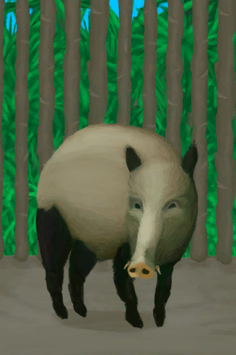
[Boar](BoarEnclosureMale.md)](BoarEnclosureMale.md)</td><td  style="text-align:left;vertical-align:top;"  >Pet</td><td  style="text-align:left;vertical-align:top;"  >-10</td></tr><tr ><td  style="text-align:left;vertical-align:top;"  >[

[Piglet](BoarEnclosurePiglet.md)](BoarEnclosurePiglet.md)</td><td  style="text-align:left;vertical-align:top;"  >Pet</td><td  style="text-align:left;vertical-align:top;"  >-10</td></tr><tr ><td  style="text-align:left;vertical-align:top;"  >[

[Dog Friend](DogFriend.md)](DogFriend.md)</td><td  style="text-align:left;vertical-align:top;"  >Feed ** With：**[Fish Slices](FishSlices.md) , [Cooked Fish Slices](FishSlicesCooked.md) , [Prawns](Prawns.md) , [Roasted Prawns](PrawnsCooked.md) , [Fish Scraps](FishScraps.md) , [Cooked Fish Scraps](FishScrapsCooked.md) , [Crab](Crab.md) , [Cooked Crab](CrabCooked.md)</td><td  style="text-align:left;vertical-align:top;"  >-10</td></tr><tr ><td  style="text-align:left;vertical-align:top;"  >[

[Dog Friend](DogFriend.md)](DogFriend.md)</td><td  style="text-align:left;vertical-align:top;"  >Feed ** With：**[“Feed”](tag_Meat.md) , [“Fish”](tag_Fish.md)</td><td  style="text-align:left;vertical-align:top;"  >-10</td></tr><tr ><td  style="text-align:left;vertical-align:top;"  >[

[Dog Friend](DogFriend.md)](DogFriend.md)</td><td  style="text-align:left;vertical-align:top;"  >Give Bones ** With：**[Bones](Bones.md)</td><td  style="text-align:left;vertical-align:top;"  >-10</td></tr><tr ><td  style="text-align:left;vertical-align:top;"  >[

[Goat](GoatEnclosureFemale.md)](GoatEnclosureFemale.md)</td><td  style="text-align:left;vertical-align:top;"  >Pet</td><td  style="text-align:left;vertical-align:top;"  >-10</td></tr><tr ><td  style="text-align:left;vertical-align:top;"  >[

[Juvenile Goat](GoatEnclosureKid.md)](GoatEnclosureKid.md)</td><td  style="text-align:left;vertical-align:top;"  >Pet</td><td  style="text-align:left;vertical-align:top;"  >-10</td></tr><tr ><td  style="text-align:left;vertical-align:top;"  >[

[Lactating Goat](GoatEnclosureLactating.md)](GoatEnclosureLactating.md)</td><td  style="text-align:left;vertical-align:top;"  >Pet</td><td  style="text-align:left;vertical-align:top;"  >-10</td></tr><tr ><td  style="text-align:left;vertical-align:top;"  >[

[Male Goat](GoatEnclosureMale.md)](GoatEnclosureMale.md)</td><td  style="text-align:left;vertical-align:top;"  >Pet</td><td  style="text-align:left;vertical-align:top;"  >-10</td></tr><tr ><td  style="text-align:left;vertical-align:top;"  >[

[Macaque Friend](MacaqueFriend.md)](MacaqueFriend.md)</td><td  style="text-align:left;vertical-align:top;"  >Feed ** With：**[Fish Slices](FishSlices.md) , [Cooked Fish Slices](FishSlicesCooked.md) , [Prawns](Prawns.md) , [Roasted Prawns](PrawnsCooked.md) , [Fish Scraps](FishScraps.md) , [Cooked Fish Scraps](FishScrapsCooked.md)</td><td  style="text-align:left;vertical-align:top;"  >-10</td></tr><tr ><td  style="text-align:left;vertical-align:top;"  >[

[Macaque Friend](MacaqueFriend.md)](MacaqueFriend.md)</td><td  style="text-align:left;vertical-align:top;"  >Feed ** With：**[“Feed”](tag_Feed.md)</td><td  style="text-align:left;vertical-align:top;"  >-10</td></tr><tr ><td  style="text-align:left;vertical-align:top;"  >[

[Cooked Macaque Meat](MacaqueMeatCooked.md)](MacaqueMeatCooked.md)</td><td  style="text-align:left;vertical-align:top;"  >Eat</td><td  style="text-align:left;vertical-align:top;"  >-10</td></tr><tr ><td  style="text-align:left;vertical-align:top;"  >[

[Smoked Macaque Meat](MacaqueMeatSmoked.md)](MacaqueMeatSmoked.md)</td><td  style="text-align:left;vertical-align:top;"  >Eat</td><td  style="text-align:left;vertical-align:top;"  >-10</td></tr><tr ><td  style="text-align:left;vertical-align:top;"  >[

[Wounded Macaque](MacaqueWounded.md)](MacaqueWounded.md)</td><td  style="text-align:left;vertical-align:top;"  >Pet</td><td  style="text-align:left;vertical-align:top;"  >-10</td></tr><tr ><td  style="text-align:left;vertical-align:top;"  >[

[Wounded Macaque](MacaqueWounded.md)](MacaqueWounded.md)</td><td  style="text-align:left;vertical-align:top;"  >Feed ** With：**[Fish Slices](FishSlices.md) , [Cooked Fish Slices](FishSlicesCooked.md) , [Prawns](Prawns.md) , [Roasted Prawns](PrawnsCooked.md) , [Fish Scraps](FishScraps.md) , [Cooked Fish Scraps](FishScrapsCooked.md)</td><td  style="text-align:left;vertical-align:top;"  >-10</td></tr><tr ><td  style="text-align:left;vertical-align:top;"  >[

[Wounded Macaque](MacaqueWounded.md)](MacaqueWounded.md)</td><td  style="text-align:left;vertical-align:top;"  >Feed ** With：**[“Feed”](tag_Feed.md)</td><td  style="text-align:left;vertical-align:top;"  >-10</td></tr><tr ><td  style="text-align:left;vertical-align:top;"  >[

[Mango](Mango.md)](Mango.md)</td><td  style="text-align:left;vertical-align:top;"  >Eat</td><td  style="text-align:left;vertical-align:top;"  >-10</td></tr><tr ><td  style="text-align:left;vertical-align:top;"  >[

[Butter Baked Oyster](OysterMeatBaked.md)](OysterMeatBaked.md)</td><td  style="text-align:left;vertical-align:top;"  >Eat</td><td  style="text-align:left;vertical-align:top;"  >-10</td></tr><tr ><td  style="text-align:left;vertical-align:top;"  >[

[Sago Flatbread](SagoFlatbread.md)](SagoFlatbread.md)</td><td  style="text-align:left;vertical-align:top;"  >Eat</td><td  style="text-align:left;vertical-align:top;"  >-10</td></tr><tr ><td  style="text-align:left;vertical-align:top;"  >[

[Sushi](Sushi.md)](Sushi.md)</td><td  style="text-align:left;vertical-align:top;"  >Eat</td><td  style="text-align:left;vertical-align:top;"  >-10</td></tr><tr ><td  style="text-align:left;vertical-align:top;"  >[

[Tropical Almond Kernels](TropicalAlmondKernels.md)](TropicalAlmondKernels.md)</td><td  style="text-align:left;vertical-align:top;"  >Eat</td><td  style="text-align:left;vertical-align:top;"  >-10</td></tr><tr ><td  style="text-align:left;vertical-align:top;"  >[

[Roasted Tropical Almond](TropicalAlmondsRoasted.md)](TropicalAlmondsRoasted.md)</td><td  style="text-align:left;vertical-align:top;"  >Eat</td><td  style="text-align:left;vertical-align:top;"  >-10</td></tr><tr ><td  style="text-align:left;vertical-align:top;"  >[

[Palm Fronds](PalmFronds.md)](PalmFronds.md)</td><td  style="text-align:left;vertical-align:top;"  >Weave ** With：**[Palm Fronds](PalmFronds.md)</td><td  style="text-align:left;vertical-align:top;"  >-10</td></tr><tr ><td  style="text-align:left;vertical-align:top;"  >[

[Phone(On)](PhoneOn.md)](PhoneOn.md)</td><td  style="text-align:left;vertical-align:top;"  >Check Pictures</td><td  style="text-align:left;vertical-align:top;"  >-10</td></tr><tr ><td  style="text-align:left;vertical-align:top;"  >[

[Phone](PhoneOnLight.md)](PhoneOnLight.md)</td><td  style="text-align:left;vertical-align:top;"  >Check Pictures</td><td  style="text-align:left;vertical-align:top;"  >-10</td></tr><tr ><td  style="text-align:left;vertical-align:top;"  >[

[Boar Tusk](Tusk.md)](Tusk.md)</td><td  style="text-align:left;vertical-align:top;"  >Carve ** With：**[“Cutter Advanced”](tag_CutterAdv.md)</td><td  style="text-align:left;vertical-align:top;"  >-10</td></tr><tr ><td  style="text-align:left;vertical-align:top;"  >[

[Weston](Weston.md)](Weston.md)</td><td  style="text-align:left;vertical-align:top;"  >Talk</td><td  style="text-align:left;vertical-align:top;"  >-10</td></tr><tr ><td  style="text-align:left;vertical-align:top;"  >[

[Unfinished Wood Carving](WoodCarving_Unfinished.md)](WoodCarving_Unfinished.md)</td><td  style="text-align:left;vertical-align:top;"  >Carve ** With：**[“Cutter Advanced”](tag_CutterAdv.md)</td><td  style="text-align:left;vertical-align:top;"  >-10</td></tr><tr ><td  style="text-align:left;vertical-align:top;"  >[

[China Rose Tea](LQ_ChinaRoseTea.md)](LQ_ChinaRoseTea.md)</td><td  style="text-align:left;vertical-align:top;"  >Drink</td><td  style="text-align:left;vertical-align:top;"  >-10</td></tr><tr ><td  style="text-align:left;vertical-align:top;"  >[

[Coconut Milk](LQ_CoconutMilk.md)](LQ_CoconutMilk.md)</td><td  style="text-align:left;vertical-align:top;"  >Drink</td><td  style="text-align:left;vertical-align:top;"  >-10</td></tr><tr ><td  style="text-align:left;vertical-align:top;"  >[

[Jasmine Tea](LQ_JasmineTea.md)](LQ_JasmineTea.md)</td><td  style="text-align:left;vertical-align:top;"  >Drink</td><td  style="text-align:left;vertical-align:top;"  >-10</td></tr><tr ><td  style="text-align:left;vertical-align:top;"  >[

[Kava](LQ_Kava.md)](LQ_Kava.md)</td><td  style="text-align:left;vertical-align:top;"  >Drink</td><td  style="text-align:left;vertical-align:top;"  >-10</td></tr><tr ><td  style="text-align:left;vertical-align:top;"  >[

[Mead](LQ_Mead.md)](LQ_Mead.md)</td><td  style="text-align:left;vertical-align:top;"  >Drink</td><td  style="text-align:left;vertical-align:top;"  >-10</td></tr><tr ><td  style="text-align:left;vertical-align:top;"  >[

[Palm Wine](LQ_PalmWine.md)](LQ_PalmWine.md)</td><td  style="text-align:left;vertical-align:top;"  >Drink</td><td  style="text-align:left;vertical-align:top;"  >-10</td></tr><tr ><td  style="text-align:left;vertical-align:top;"  >[

[Sugar Wine](LQ_SugarWine.md)](LQ_SugarWine.md)</td><td  style="text-align:left;vertical-align:top;"  >Drink</td><td  style="text-align:left;vertical-align:top;"  >-10</td></tr><tr ><td  style="text-align:left;vertical-align:top;"  >[

[Bat Cave](CaveBats.md)](CaveBats.md)</td><td  style="text-align:left;vertical-align:top;"  >Clean ** With：**[Broom](Broom.md)</td><td  style="text-align:left;vertical-align:top;"  >-10</td></tr><tr ><td  style="text-align:left;vertical-align:top;"  >[

[Grasslands Cave(Cave)](CaveGrasslands.md)](CaveGrasslands.md)</td><td  style="text-align:left;vertical-align:top;"  >Clean ** With：**[Broom](Broom.md)</td><td  style="text-align:left;vertical-align:top;"  >-10</td></tr><tr ><td  style="text-align:left;vertical-align:top;"  >[

[Sea Cave(Cave)](CaveSea.md)](CaveSea.md)</td><td  style="text-align:left;vertical-align:top;"  >Clean ** With：**[Broom](Broom.md)</td><td  style="text-align:left;vertical-align:top;"  >-10</td></tr><tr ><td  style="text-align:left;vertical-align:top;"  >[

[Crystal Chamber(High Chamber)](CrystalChamber.md)](CrystalChamber.md)</td><td  style="text-align:left;vertical-align:top;"  >Clean ** With：**[Broom](Broom.md)</td><td  style="text-align:left;vertical-align:top;"  >-10</td></tr><tr ><td  style="text-align:left;vertical-align:top;"  >[

[Damp Chamber](DampChamber.md)](DampChamber.md)</td><td  style="text-align:left;vertical-align:top;"  >Clean ** With：**[Broom](Broom.md)</td><td  style="text-align:left;vertical-align:top;"  >-10</td></tr><tr ><td  style="text-align:left;vertical-align:top;"  >[

[Darkness(Dark Chamber)](DarkChamber.md)](DarkChamber.md)</td><td  style="text-align:left;vertical-align:top;"  >Clean ** With：**[Broom](Broom.md)</td><td  style="text-align:left;vertical-align:top;"  >-10</td></tr><tr ><td  style="text-align:left;vertical-align:top;"  >[

[Flooded Chamber](FloodedChamber.md)](FloodedChamber.md)</td><td  style="text-align:left;vertical-align:top;"  >Clean ** With：**[Broom](Broom.md)</td><td  style="text-align:left;vertical-align:top;"  >-10</td></tr><tr ><td  style="text-align:left;vertical-align:top;"  >[

[High Chamber](HighChamber.md)](HighChamber.md)</td><td  style="text-align:left;vertical-align:top;"  >Clean ** With：**[Broom](Broom.md)</td><td  style="text-align:left;vertical-align:top;"  >-10</td></tr><tr ><td  style="text-align:left;vertical-align:top;"  >[

[Low Chamber(High Chamber)](LowChamber.md)](LowChamber.md)</td><td  style="text-align:left;vertical-align:top;"  >Clean ** With：**[Broom](Broom.md)</td><td  style="text-align:left;vertical-align:top;"  >-10</td></tr><tr ><td  style="text-align:left;vertical-align:top;"  >[

[Medium Chamber(High Chamber)](MidChamber.md)](MidChamber.md)</td><td  style="text-align:left;vertical-align:top;"  >Clean ** With：**[Broom](Broom.md)</td><td  style="text-align:left;vertical-align:top;"  >-10</td></tr><tr ><td  style="text-align:left;vertical-align:top;"  >[

[Narrow Tunnel(High Chamber)](NarrowTunnel.md)](NarrowTunnel.md)</td><td  style="text-align:left;vertical-align:top;"  >Clean ** With：**[Broom](Broom.md)</td><td  style="text-align:left;vertical-align:top;"  >-10</td></tr><tr ><td  style="text-align:left;vertical-align:top;"  >[

[Tunnel](Tunnel.md)](Tunnel.md)</td><td  style="text-align:left;vertical-align:top;"  >Clean ** With：**[Broom](Broom.md)</td><td  style="text-align:left;vertical-align:top;"  >-10</td></tr><tr ><td  style="text-align:left;vertical-align:top;"  >[

[Tidal Cave](CaveTidal.md)](CaveTidal.md)</td><td  style="text-align:left;vertical-align:top;"  >Clean ** With：**[Broom](Broom.md)</td><td  style="text-align:left;vertical-align:top;"  >-10</td></tr><tr ><td  style="text-align:left;vertical-align:top;"  >[

[Cellar](Cellar.md)](Cellar.md)</td><td  style="text-align:left;vertical-align:top;"  >Clean ** With：**[Broom](Broom.md)</td><td  style="text-align:left;vertical-align:top;"  >-10</td></tr><tr ><td  style="text-align:left;vertical-align:top;"  >[

[Dark Cave](DarkCave.md)](DarkCave.md)</td><td  style="text-align:left;vertical-align:top;"  >Clean ** With：**[Broom](Broom.md)</td><td  style="text-align:left;vertical-align:top;"  >-10</td></tr><tr ><td  style="text-align:left;vertical-align:top;"  >[

[Enclosure](Enclosure.md)](Enclosure.md)</td><td  style="text-align:left;vertical-align:top;"  >Clean ** With：**[Broom](Broom.md)</td><td  style="text-align:left;vertical-align:top;"  >-10</td></tr><tr ><td  style="text-align:left;vertical-align:top;"  >[

[Macaque Den](MacaqueDen.md)](MacaqueDen.md)</td><td  style="text-align:left;vertical-align:top;"  >Clean ** With：**[Broom](Broom.md)</td><td  style="text-align:left;vertical-align:top;"  >-10</td></tr><tr ><td  style="text-align:left;vertical-align:top;"  >[

[Mud Hut](MudHut.md)](MudHut.md)</td><td  style="text-align:left;vertical-align:top;"  >Clean ** With：**[Broom](Broom.md)</td><td  style="text-align:left;vertical-align:top;"  >-10</td></tr><tr ><td  style="text-align:left;vertical-align:top;"  >[

[Mud Hut](MudHutRuins.md)](MudHutRuins.md)</td><td  style="text-align:left;vertical-align:top;"  >Clean ** With：**[Broom](Broom.md)</td><td  style="text-align:left;vertical-align:top;"  >-10</td></tr><tr ><td  style="text-align:left;vertical-align:top;"  >[

[Plane Crash(Crashed Plane)](PlaneCrash.md)](PlaneCrash.md)</td><td  style="text-align:left;vertical-align:top;"  >Clean ** With：**[Broom](Broom.md)</td><td  style="text-align:left;vertical-align:top;"  >-10</td></tr><tr ><td  style="text-align:left;vertical-align:top;"  >[

[Shed](Shed.md)](Shed.md)</td><td  style="text-align:left;vertical-align:top;"  >Clean ** With：**[Broom](Broom.md)</td><td  style="text-align:left;vertical-align:top;"  >-10</td></tr><tr ><td  style="text-align:left;vertical-align:top;"  >[

[Stone Hut](StoneHut.md)](StoneHut.md)</td><td  style="text-align:left;vertical-align:top;"  >Clean ** With：**[Broom](Broom.md)</td><td  style="text-align:left;vertical-align:top;"  >-10</td></tr><tr ><td  style="text-align:left;vertical-align:top;"  >[
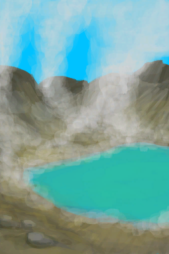
[Acid Lake(Volcano)](AcidLake.md)](AcidLake.md)</td><td  style="text-align:left;vertical-align:top;"  >Explore</td><td  style="text-align:left;vertical-align:top;"  >-10</td></tr><tr ><td  style="text-align:left;vertical-align:top;"  >[

[Bay](Bay.md)](Bay.md)</td><td  style="text-align:left;vertical-align:top;"  >Go for a Walk</td><td  style="text-align:left;vertical-align:top;"  >-10</td></tr><tr ><td  style="text-align:left;vertical-align:top;"  >[

[Beach](Beach.md)](Beach.md)</td><td  style="text-align:left;vertical-align:top;"  >Go for a Walk</td><td  style="text-align:left;vertical-align:top;"  >-10</td></tr><tr ><td  style="text-align:left;vertical-align:top;"  >[

[Bird Rock](BirdRock.md)](BirdRock.md)</td><td  style="text-align:left;vertical-align:top;"  >Explore</td><td  style="text-align:left;vertical-align:top;"  >-10</td></tr><tr ><td  style="text-align:left;vertical-align:top;"  >[

[Deep Jungle(Jungle)](DeepJungle.md)](DeepJungle.md)</td><td  style="text-align:left;vertical-align:top;"  >Explore</td><td  style="text-align:left;vertical-align:top;"  >-10</td></tr><tr ><td  style="text-align:left;vertical-align:top;"  >[

[Desolate Beach](DesolateBeach.md)](DesolateBeach.md)</td><td  style="text-align:left;vertical-align:top;"  >Explore</td><td  style="text-align:left;vertical-align:top;"  >-10</td></tr><tr ><td  style="text-align:left;vertical-align:top;"  >[

[Eastern Grasslands](GrasslandsE.md)](GrasslandsE.md)</td><td  style="text-align:left;vertical-align:top;"  >Explore</td><td  style="text-align:left;vertical-align:top;"  >-10</td></tr><tr ><td  style="text-align:left;vertical-align:top;"  >[

[Western Grasslands](GrasslandsW.md)](GrasslandsW.md)</td><td  style="text-align:left;vertical-align:top;"  >Explore</td><td  style="text-align:left;vertical-align:top;"  >-10</td></tr><tr ><td  style="text-align:left;vertical-align:top;"  >[

[Eastern Highlands](HighlandsEastern.md)](HighlandsEastern.md)</td><td  style="text-align:left;vertical-align:top;"  >Explore</td><td  style="text-align:left;vertical-align:top;"  >-10</td></tr><tr ><td  style="text-align:left;vertical-align:top;"  >[

[Western Highlands](HighlandsWestern.md)](HighlandsWestern.md)</td><td  style="text-align:left;vertical-align:top;"  >Explore</td><td  style="text-align:left;vertical-align:top;"  >-10</td></tr><tr ><td  style="text-align:left;vertical-align:top;"  >[

[Jungle](Jungle.md)](Jungle.md)</td><td  style="text-align:left;vertical-align:top;"  >Explore</td><td  style="text-align:left;vertical-align:top;"  >-10</td></tr><tr ><td  style="text-align:left;vertical-align:top;"  >[

[Jungle Highlands](JungleHighlands.md)](JungleHighlands.md)</td><td  style="text-align:left;vertical-align:top;"  >Explore</td><td  style="text-align:left;vertical-align:top;"  >-10</td></tr><tr ><td  style="text-align:left;vertical-align:top;"  >[

[Mangrove Forest](Mangroves.md)](Mangroves.md)</td><td  style="text-align:left;vertical-align:top;"  >Explore</td><td  style="text-align:left;vertical-align:top;"  >-10</td></tr><tr ><td  style="text-align:left;vertical-align:top;"  >[

[Jungle Outskirts(Outskirts)](Outskirts.md)](Outskirts.md)</td><td  style="text-align:left;vertical-align:top;"  >Explore</td><td  style="text-align:left;vertical-align:top;"  >-10</td></tr><tr ><td  style="text-align:left;vertical-align:top;"  >[

[Rocks](Rocks.md)](Rocks.md)</td><td  style="text-align:left;vertical-align:top;"  >Explore</td><td  style="text-align:left;vertical-align:top;"  >-10</td></tr><tr ><td  style="text-align:left;vertical-align:top;"  >[

[Secret Valley](SecretValley.md)](SecretValley.md)</td><td  style="text-align:left;vertical-align:top;"  >Explore</td><td  style="text-align:left;vertical-align:top;"  >-10</td></tr><tr ><td  style="text-align:left;vertical-align:top;"  >[

[Volcano](Volcano.md)](Volcano.md)</td><td  style="text-align:left;vertical-align:top;"  >Explore</td><td  style="text-align:left;vertical-align:top;"  >-10</td></tr><tr ><td  style="text-align:left;vertical-align:top;"  >[

[Wetland Jungle(Wetlands)](Wetlands.md)](Wetlands.md)</td><td  style="text-align:left;vertical-align:top;"  >Explore</td><td  style="text-align:left;vertical-align:top;"  >-10</td></tr><tr ><td  style="text-align:left;vertical-align:top;"  >[

[To Volcano](Path_AcidLakeToVolcano.md)](Path_AcidLakeToVolcano.md)</td><td  style="text-align:left;vertical-align:top;"  >Go</td><td  style="text-align:left;vertical-align:top;"  >-10</td></tr><tr ><td  style="text-align:left;vertical-align:top;"  >[

[To Beach(Bay)](Path_BayToBeach.md)](Path_BayToBeach.md)</td><td  style="text-align:left;vertical-align:top;"  >Go</td><td  style="text-align:left;vertical-align:top;"  >-10</td></tr><tr ><td  style="text-align:left;vertical-align:top;"  >[

[To Jungle Path(Bay)](Path_BayToJungle.md)](Path_BayToJungle.md)</td><td  style="text-align:left;vertical-align:top;"  >Go</td><td  style="text-align:left;vertical-align:top;"  >-10</td></tr><tr ><td  style="text-align:left;vertical-align:top;"  >[

[To Mangrove Forest](Path_BayToMangroves.md)](Path_BayToMangroves.md)</td><td  style="text-align:left;vertical-align:top;"  >Go</td><td  style="text-align:left;vertical-align:top;"  >-10</td></tr><tr ><td  style="text-align:left;vertical-align:top;"  >[

[To Bay](Path_BeachToBay.md)](Path_BeachToBay.md)</td><td  style="text-align:left;vertical-align:top;"  >Go</td><td  style="text-align:left;vertical-align:top;"  >-10</td></tr><tr ><td  style="text-align:left;vertical-align:top;"  >[

[To Jungle Outskirts(Beach)](Path_BeachToOutskirts.md)](Path_BeachToOutskirts.md)</td><td  style="text-align:left;vertical-align:top;"  >Go</td><td  style="text-align:left;vertical-align:top;"  >-10</td></tr><tr ><td  style="text-align:left;vertical-align:top;"  >[

[To Rocks(Beach)](Path_BeachToRocks.md)](Path_BeachToRocks.md)</td><td  style="text-align:left;vertical-align:top;"  >Go</td><td  style="text-align:left;vertical-align:top;"  >-10</td></tr><tr ><td  style="text-align:left;vertical-align:top;"  >[

[To Jungle Highlands(Secret Cove)](Path_CoveToJungleHighlands.md)](Path_CoveToJungleHighlands.md)</td><td  style="text-align:left;vertical-align:top;"  >Climb Up</td><td  style="text-align:left;vertical-align:top;"  >-10</td></tr><tr ><td  style="text-align:left;vertical-align:top;"  >[

[To Jungle Highlands(Jungle)](Path_DeepJungleToJungleHighlands.md)](Path_DeepJungleToJungleHighlands.md)</td><td  style="text-align:left;vertical-align:top;"  >Go</td><td  style="text-align:left;vertical-align:top;"  >-10</td></tr><tr ><td  style="text-align:left;vertical-align:top;"  >[

[To Secret Valley(Jungle)](Path_DeepJungleToValley.md)](Path_DeepJungleToValley.md)</td><td  style="text-align:left;vertical-align:top;"  >Go</td><td  style="text-align:left;vertical-align:top;"  >-10</td></tr><tr ><td  style="text-align:left;vertical-align:top;"  >[

[To Wetlands(Jungle)](Path_DeepJungleToWetlands.md)](Path_DeepJungleToWetlands.md)</td><td  style="text-align:left;vertical-align:top;"  >Go</td><td  style="text-align:left;vertical-align:top;"  >-10</td></tr><tr ><td  style="text-align:left;vertical-align:top;"  >[

[To Eastern Grasslands(Desolate Beach)](Path_DesolateBeachToGrasslandsE.md)](Path_DesolateBeachToGrasslandsE.md)</td><td  style="text-align:left;vertical-align:top;"  >Go</td><td  style="text-align:left;vertical-align:top;"  >-10</td></tr><tr ><td  style="text-align:left;vertical-align:top;"  >[

[To Mangrove Forest(Desolate Beach)](Path_DesolateBeachToMangroves.md)](Path_DesolateBeachToMangroves.md)</td><td  style="text-align:left;vertical-align:top;"  >Go</td><td  style="text-align:left;vertical-align:top;"  >-10</td></tr><tr ><td  style="text-align:left;vertical-align:top;"  >[

[To Volcano(Desolate Beach)](Path_DesolateBeachToVolcano.md)](Path_DesolateBeachToVolcano.md)</td><td  style="text-align:left;vertical-align:top;"  >Go</td><td  style="text-align:left;vertical-align:top;"  >-10</td></tr><tr ><td  style="text-align:left;vertical-align:top;"  >[

[To Desolate Beach(Eastern Grasslands)](Path_GrasslandsEToDesolateBeach.md)](Path_GrasslandsEToDesolateBeach.md)</td><td  style="text-align:left;vertical-align:top;"  >Go</td><td  style="text-align:left;vertical-align:top;"  >-10</td></tr><tr ><td  style="text-align:left;vertical-align:top;"  >[
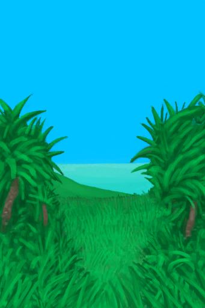
[To Western Grasslands(Eastern Grasslands)](Path_GrasslandsEToGrasslandsW.md)](Path_GrasslandsEToGrasslandsW.md)</td><td  style="text-align:left;vertical-align:top;"  >Go</td><td  style="text-align:left;vertical-align:top;"  >-10</td></tr><tr ><td  style="text-align:left;vertical-align:top;"  >[

[To Eastern Highlands(Eastern Grasslands)](Path_GrasslandsEToHighlandsE.md)](Path_GrasslandsEToHighlandsE.md)</td><td  style="text-align:left;vertical-align:top;"  >Go</td><td  style="text-align:left;vertical-align:top;"  >-10</td></tr><tr ><td  style="text-align:left;vertical-align:top;"  >[

[To Eastern Grasslands(Western Grasslands)](Path_GrasslandsWToGrasslandsE.md)](Path_GrasslandsWToGrasslandsE.md)</td><td  style="text-align:left;vertical-align:top;"  >Go</td><td  style="text-align:left;vertical-align:top;"  >-10</td></tr><tr ><td  style="text-align:left;vertical-align:top;"  >[

[To Western Highlands(Western Grasslands)](Path_GrasslandsWToHighlandsW.md)](Path_GrasslandsWToHighlandsW.md)</td><td  style="text-align:left;vertical-align:top;"  >Go</td><td  style="text-align:left;vertical-align:top;"  >-10</td></tr><tr ><td  style="text-align:left;vertical-align:top;"  >[

[To Jungle Path](Path_GrasslandsWToJungle.md)](Path_GrasslandsWToJungle.md)</td><td  style="text-align:left;vertical-align:top;"  >Go</td><td  style="text-align:left;vertical-align:top;"  >-10</td></tr><tr ><td  style="text-align:left;vertical-align:top;"  >[

[To Mangrove Forest(Western Grasslands)](Path_GrasslandsWToMangroves.md)](Path_GrasslandsWToMangroves.md)</td><td  style="text-align:left;vertical-align:top;"  >Go</td><td  style="text-align:left;vertical-align:top;"  >-10</td></tr><tr ><td  style="text-align:left;vertical-align:top;"  >[

[To Eastern Grasslands(Eastern Highlands)](Path_HighlandsEToGrasslandsE.md)](Path_HighlandsEToGrasslandsE.md)</td><td  style="text-align:left;vertical-align:top;"  >Go</td><td  style="text-align:left;vertical-align:top;"  >-10</td></tr><tr ><td  style="text-align:left;vertical-align:top;"  >[

[To Western Highlands](Path_HighlandsEToHighlandsW.md)](Path_HighlandsEToHighlandsW.md)</td><td  style="text-align:left;vertical-align:top;"  >Go</td><td  style="text-align:left;vertical-align:top;"  >-10</td></tr><tr ><td  style="text-align:left;vertical-align:top;"  >[

[To Volcano(Eastern Highlands)](Path_HighlandsEToVolcano.md)](Path_HighlandsEToVolcano.md)</td><td  style="text-align:left;vertical-align:top;"  >Go</td><td  style="text-align:left;vertical-align:top;"  >-10</td></tr><tr ><td  style="text-align:left;vertical-align:top;"  >[

[To Western Grasslands(Western Highlands)](Path_HighlandsWToGrasslandsW.md)](Path_HighlandsWToGrasslandsW.md)</td><td  style="text-align:left;vertical-align:top;"  >Go</td><td  style="text-align:left;vertical-align:top;"  >-10</td></tr><tr ><td  style="text-align:left;vertical-align:top;"  >[

[To Eastern Highlands(Western Highlands)](Path_HighlandsWToHighlandsE.md)](Path_HighlandsWToHighlandsE.md)</td><td  style="text-align:left;vertical-align:top;"  >Go</td><td  style="text-align:left;vertical-align:top;"  >-10</td></tr><tr ><td  style="text-align:left;vertical-align:top;"  >[

[To Jungle Highlands(Western Highlands)](Path_HighlandsWToJungleHighlands.md)](Path_HighlandsWToJungleHighlands.md)</td><td  style="text-align:left;vertical-align:top;"  >Go</td><td  style="text-align:left;vertical-align:top;"  >-10</td></tr><tr ><td  style="text-align:left;vertical-align:top;"  >[

[To Secret Cove(Jungle Highlands)](Path_JungleHighlandsToCove.md)](Path_JungleHighlandsToCove.md)</td><td  style="text-align:left;vertical-align:top;"  >Climb Down</td><td  style="text-align:left;vertical-align:top;"  >-10</td></tr><tr ><td  style="text-align:left;vertical-align:top;"  >[

[To Deep Jungle(Jungle Highlands)](Path_JungleHighlandsToDeepJungle.md)](Path_JungleHighlandsToDeepJungle.md)</td><td  style="text-align:left;vertical-align:top;"  >Go</td><td  style="text-align:left;vertical-align:top;"  >-10</td></tr><tr ><td  style="text-align:left;vertical-align:top;"  >[

[To Western Highlands(Jungle Highlands)](Path_JungleHighlandsToHighlandsW.md)](Path_JungleHighlandsToHighlandsW.md)</td><td  style="text-align:left;vertical-align:top;"  >Go</td><td  style="text-align:left;vertical-align:top;"  >-10</td></tr><tr ><td  style="text-align:left;vertical-align:top;"  >[

[To Valley Cliffs](Path_JungleHighlandsToValley.md)](Path_JungleHighlandsToValley.md)(未实装)</td><td  style="text-align:left;vertical-align:top;"  >Climb Down</td><td  style="text-align:left;vertical-align:top;"  >-10</td></tr><tr ><td  style="text-align:left;vertical-align:top;"  >[

[To Wetlands Cliff](Path_JungleHighlandsToWetlands.md)](Path_JungleHighlandsToWetlands.md)</td><td  style="text-align:left;vertical-align:top;"  >Climb</td><td  style="text-align:left;vertical-align:top;"  >-10</td></tr><tr ><td  style="text-align:left;vertical-align:top;"  >[

[To Bay(Jungle)](Path_JungleToBay.md)](Path_JungleToBay.md)</td><td  style="text-align:left;vertical-align:top;"  >Go</td><td  style="text-align:left;vertical-align:top;"  >-10</td></tr><tr ><td  style="text-align:left;vertical-align:top;"  >[

[To Western Grasslands(Jungle)](Path_JungleToGrasslandsW.md)](Path_JungleToGrasslandsW.md)</td><td  style="text-align:left;vertical-align:top;"  >Go</td><td  style="text-align:left;vertical-align:top;"  >-10</td></tr><tr ><td  style="text-align:left;vertical-align:top;"  >[

[To Jungle Outskirts(Jungle)](Path_JungleToOutskirts.md)](Path_JungleToOutskirts.md)</td><td  style="text-align:left;vertical-align:top;"  >Go</td><td  style="text-align:left;vertical-align:top;"  >-10</td></tr><tr ><td  style="text-align:left;vertical-align:top;"  >[

[To Wetlands(Jungle)](Path_JungleToWetlands.md)](Path_JungleToWetlands.md)</td><td  style="text-align:left;vertical-align:top;"  >Go</td><td  style="text-align:left;vertical-align:top;"  >-10</td></tr><tr ><td  style="text-align:left;vertical-align:top;"  >[

[To Bay](Path_MangrovesToBay.md)](Path_MangrovesToBay.md)</td><td  style="text-align:left;vertical-align:top;"  >Go</td><td  style="text-align:left;vertical-align:top;"  >-10</td></tr><tr ><td  style="text-align:left;vertical-align:top;"  >[

[To Desolate Beach](Path_MangrovesToDesolateBeach.md)](Path_MangrovesToDesolateBeach.md)</td><td  style="text-align:left;vertical-align:top;"  >Go</td><td  style="text-align:left;vertical-align:top;"  >-10</td></tr><tr ><td  style="text-align:left;vertical-align:top;"  >[

[To Grasslands(Mangrove Forest)](Path_MangrovesToGrasslandsW.md)](Path_MangrovesToGrasslandsW.md)</td><td  style="text-align:left;vertical-align:top;"  >Go</td><td  style="text-align:left;vertical-align:top;"  >-10</td></tr><tr ><td  style="text-align:left;vertical-align:top;"  >[

[To Beach(Outskirts)](Path_OutskirtsToBeach.md)](Path_OutskirtsToBeach.md)</td><td  style="text-align:left;vertical-align:top;"  >Go</td><td  style="text-align:left;vertical-align:top;"  >-10</td></tr><tr ><td  style="text-align:left;vertical-align:top;"  >[

[To Jungle Path](Path_OutskirtsToJungle.md)](Path_OutskirtsToJungle.md)</td><td  style="text-align:left;vertical-align:top;"  >Go</td><td  style="text-align:left;vertical-align:top;"  >-10</td></tr><tr ><td  style="text-align:left;vertical-align:top;"  >[
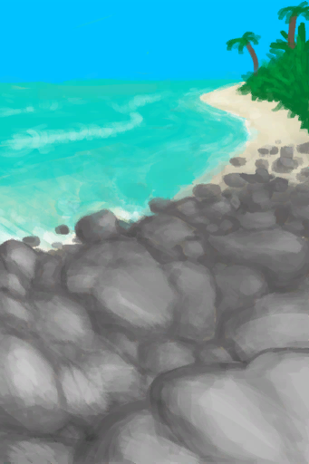
[To Beach(Rocks)](Path_RocksToBeach.md)](Path_RocksToBeach.md)</td><td  style="text-align:left;vertical-align:top;"  >Go</td><td  style="text-align:left;vertical-align:top;"  >-10</td></tr><tr ><td  style="text-align:left;vertical-align:top;"  >[

[To Deep Jungle(Secret Valley)](Path_ValleyToDeepJungle.md)](Path_ValleyToDeepJungle.md)</td><td  style="text-align:left;vertical-align:top;"  >Go</td><td  style="text-align:left;vertical-align:top;"  >-10</td></tr><tr ><td  style="text-align:left;vertical-align:top;"  >[

[To Jungle Highlands](Path_ValleyToJungleHighlands.md)](Path_ValleyToJungleHighlands.md)(未实装)</td><td  style="text-align:left;vertical-align:top;"  >Climb Up</td><td  style="text-align:left;vertical-align:top;"  >-10</td></tr><tr ><td  style="text-align:left;vertical-align:top;"  >[

[To Acid Lake(Volcano)](Path_VolcanoToAcidLake.md)](Path_VolcanoToAcidLake.md)</td><td  style="text-align:left;vertical-align:top;"  >Go</td><td  style="text-align:left;vertical-align:top;"  >-10</td></tr><tr ><td  style="text-align:left;vertical-align:top;"  >[

[To Desolate Beach(Volcano)](Path_VolcanoToDesolateBeach.md)](Path_VolcanoToDesolateBeach.md)</td><td  style="text-align:left;vertical-align:top;"  >Go</td><td  style="text-align:left;vertical-align:top;"  >-10</td></tr><tr ><td  style="text-align:left;vertical-align:top;"  >[

[To Eastern Highlands(Volcano)](Path_VolcanoToHighlandsE.md)](Path_VolcanoToHighlandsE.md)</td><td  style="text-align:left;vertical-align:top;"  >Go</td><td  style="text-align:left;vertical-align:top;"  >-10</td></tr><tr ><td  style="text-align:left;vertical-align:top;"  >[

[To Deep Jungle(Wetlands)](Path_WetlandsToDeepJungle.md)](Path_WetlandsToDeepJungle.md)</td><td  style="text-align:left;vertical-align:top;"  >Go</td><td  style="text-align:left;vertical-align:top;"  >-10</td></tr><tr ><td  style="text-align:left;vertical-align:top;"  >[

[To Jungle Path(Wetlands)](Path_WetlandsToJungle.md)](Path_WetlandsToJungle.md)</td><td  style="text-align:left;vertical-align:top;"  >Go</td><td  style="text-align:left;vertical-align:top;"  >-10</td></tr><tr ><td  style="text-align:left;vertical-align:top;"  >[

[To Jungle Highlands(Wetlands)](Path_WetlandsToJungleHighlands.md)](Path_WetlandsToJungleHighlands.md)</td><td  style="text-align:left;vertical-align:top;"  >Climb Up</td><td  style="text-align:left;vertical-align:top;"  >-10</td></tr><tr ><td  style="text-align:left;vertical-align:top;"  >[

[Chair](ChairPlaced.md)](ChairPlaced.md)</td><td  style="text-align:left;vertical-align:top;"  >Rest</td><td  style="text-align:left;vertical-align:top;"  >-12</td></tr><tr ><td  style="text-align:left;vertical-align:top;"  >[

[Seat](SeatAttached.md)](SeatAttached.md)</td><td  style="text-align:left;vertical-align:top;"  >Rest</td><td  style="text-align:left;vertical-align:top;"  >-12</td></tr><tr ><td  style="text-align:left;vertical-align:top;"  >[

[Seat](SeatPlaced.md)](SeatPlaced.md)</td><td  style="text-align:left;vertical-align:top;"  >Rest</td><td  style="text-align:left;vertical-align:top;"  >-12</td></tr><tr ><td  style="text-align:left;vertical-align:top;"  >[

[Macaque Skewers](MacaqueSkewers.md)](MacaqueSkewers.md)</td><td  style="text-align:left;vertical-align:top;"  >Eat</td><td  style="text-align:left;vertical-align:top;"  >-15</td></tr><tr ><td  style="text-align:left;vertical-align:top;"  >[
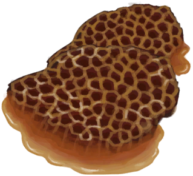
[Honeycomb](BeeHoneycomb.md)](BeeHoneycomb.md)</td><td  style="text-align:left;vertical-align:top;"  >Eat</td><td  style="text-align:left;vertical-align:top;"  >-20</td></tr><tr ><td  style="text-align:left;vertical-align:top;"  >[

[Fish N' Chips](FishNChips.md)](FishNChips.md)</td><td  style="text-align:left;vertical-align:top;"  >Eat</td><td  style="text-align:left;vertical-align:top;"  >-20</td></tr><tr ><td  style="text-align:left;vertical-align:top;"  >[

[Hearty Feast](HeartyFeast.md)](HeartyFeast.md)</td><td  style="text-align:left;vertical-align:top;"  >Eat</td><td  style="text-align:left;vertical-align:top;"  >-20</td></tr><tr ><td  style="text-align:left;vertical-align:top;"  >[

[Honey Glazed Pork](HoneyGlazedPork.md)](HoneyGlazedPork.md)</td><td  style="text-align:left;vertical-align:top;"  >Eat</td><td  style="text-align:left;vertical-align:top;"  >-20</td></tr><tr ><td  style="text-align:left;vertical-align:top;"  >[

[Sago Cake](SagoCake.md)](SagoCake.md)</td><td  style="text-align:left;vertical-align:top;"  >Eat</td><td  style="text-align:left;vertical-align:top;"  >-20</td></tr><tr ><td  style="text-align:left;vertical-align:top;"  >[

[Fried Banana](FriedBanana.md)](FriedBanana.md)</td><td  style="text-align:left;vertical-align:top;"  >Eat</td><td  style="text-align:left;vertical-align:top;"  >-20</td></tr><tr ><td  style="text-align:left;vertical-align:top;"  >[

[Sago Flatbread with Honey](SagoFlatbreadHoney.md)](SagoFlatbreadHoney.md)</td><td  style="text-align:left;vertical-align:top;"  >Eat</td><td  style="text-align:left;vertical-align:top;"  >-20</td></tr><tr ><td  style="text-align:left;vertical-align:top;"  >[

[Sago Flatbread with Jam](SagoFlatbreadJam.md)](SagoFlatbreadJam.md)</td><td  style="text-align:left;vertical-align:top;"  >Eat</td><td  style="text-align:left;vertical-align:top;"  >-20</td></tr><tr ><td  style="text-align:left;vertical-align:top;"  >[

[Sugar](Sugar.md)](Sugar.md)</td><td  style="text-align:left;vertical-align:top;"  >Eat</td><td  style="text-align:left;vertical-align:top;"  >-20</td></tr><tr ><td  style="text-align:left;vertical-align:top;"  >[

[Yam Jam](YamJam.md)](YamJam.md)</td><td  style="text-align:left;vertical-align:top;"  >Eat</td><td  style="text-align:left;vertical-align:top;"  >-20</td></tr><tr ><td  style="text-align:left;vertical-align:top;"  >[

[Drum(Event)](Event_DrumMenu.md)](Event_DrumMenu.md)(未实装)</td><td  style="text-align:left;vertical-align:top;"  >Practice</td><td  style="text-align:left;vertical-align:top;"  >-24</td></tr><tr ><td  style="text-align:left;vertical-align:top;"  >[

[Drum](Drum.md)](Drum.md)</td><td  style="text-align:left;vertical-align:top;"  >Practice</td><td  style="text-align:left;vertical-align:top;"  >-24</td></tr><tr ><td  style="text-align:left;vertical-align:top;"  >[

[Bone Flute](FluteBone.md)](FluteBone.md)</td><td  style="text-align:left;vertical-align:top;"  >Practice</td><td  style="text-align:left;vertical-align:top;"  >-24</td></tr><tr ><td  style="text-align:left;vertical-align:top;"  >[

[Bone Flute](FluteBone.md)](FluteBone.md)</td><td  style="text-align:left;vertical-align:top;"  >Compose</td><td  style="text-align:left;vertical-align:top;"  >-24</td></tr><tr ><td  style="text-align:left;vertical-align:top;"  >[

[Wooden Flute](FluteWooden.md)](FluteWooden.md)</td><td  style="text-align:left;vertical-align:top;"  >Practice</td><td  style="text-align:left;vertical-align:top;"  >-24</td></tr><tr ><td  style="text-align:left;vertical-align:top;"  >[

[Wooden Flute](FluteWooden.md)](FluteWooden.md)</td><td  style="text-align:left;vertical-align:top;"  >Compose</td><td  style="text-align:left;vertical-align:top;"  >-24</td></tr><tr ><td  style="text-align:left;vertical-align:top;"  >[

[Lizard Drum](LizardDrum.md)](LizardDrum.md)</td><td  style="text-align:left;vertical-align:top;"  >Practice</td><td  style="text-align:left;vertical-align:top;"  >-24</td></tr><tr ><td  style="text-align:left;vertical-align:top;"  >[

[Bookshelf(BluePrint)](Bp_Bookshelf.md)](Bp_Bookshelf.md)</td><td  style="text-align:left;vertical-align:top;"  >Craft BluePrint</td><td  style="text-align:left;vertical-align:top;"  >-25</td></tr><tr ><td  style="text-align:left;vertical-align:top;"  >[

[Dog Friend](DogFriend.md)](DogFriend.md)</td><td  style="text-align:left;vertical-align:top;"  >Pet</td><td  style="text-align:left;vertical-align:top;"  >-25</td></tr><tr ><td  style="text-align:left;vertical-align:top;"  >[

[Dog Friend](DogFriend.md)](DogFriend.md)</td><td  style="text-align:left;vertical-align:top;"  >Play</td><td  style="text-align:left;vertical-align:top;"  >-25</td></tr><tr ><td  style="text-align:left;vertical-align:top;"  >[

[Grandfather](Grandfather.md)](Grandfather.md)</td><td  style="text-align:left;vertical-align:top;"  >Hang Out</td><td  style="text-align:left;vertical-align:top;"  >-25</td></tr><tr ><td  style="text-align:left;vertical-align:top;"  >[

[Macaque Friend](MacaqueFriend.md)](MacaqueFriend.md)</td><td  style="text-align:left;vertical-align:top;"  >Pet</td><td  style="text-align:left;vertical-align:top;"  >-25</td></tr><tr ><td  style="text-align:left;vertical-align:top;"  >[

[Phone(On)](PhoneOn.md)](PhoneOn.md)</td><td  style="text-align:left;vertical-align:top;"  >Play Game</td><td  style="text-align:left;vertical-align:top;"  >-25 ~ 5</td></tr><tr ><td  style="text-align:left;vertical-align:top;"  >[

[Phone](PhoneOnLight.md)](PhoneOnLight.md)</td><td  style="text-align:left;vertical-align:top;"  >Play Game</td><td  style="text-align:left;vertical-align:top;"  >-25 ~ 5</td></tr><tr ><td  style="text-align:left;vertical-align:top;"  >[

[Candied Ginger](CandiedGinger.md)](CandiedGinger.md)</td><td  style="text-align:left;vertical-align:top;"  >Eat</td><td  style="text-align:left;vertical-align:top;"  >-30</td></tr><tr ><td  style="text-align:left;vertical-align:top;"  >[

[Chocolate](Chocolate.md)](Chocolate.md)</td><td  style="text-align:left;vertical-align:top;"  >Eat</td><td  style="text-align:left;vertical-align:top;"  >-30</td></tr><tr ><td  style="text-align:left;vertical-align:top;"  >[

[Honey Candy](HoneyCandy.md)](HoneyCandy.md)</td><td  style="text-align:left;vertical-align:top;"  >Eat</td><td  style="text-align:left;vertical-align:top;"  >-30</td></tr><tr ><td  style="text-align:left;vertical-align:top;"  >[

[Chair](ChairPlaced.md)](ChairPlaced.md)</td><td  style="text-align:left;vertical-align:top;"  >Meditate</td><td  style="text-align:left;vertical-align:top;"  >-48</td></tr><tr ><td  style="text-align:left;vertical-align:top;"  >[

[Seat](SeatAttached.md)](SeatAttached.md)</td><td  style="text-align:left;vertical-align:top;"  >Meditate</td><td  style="text-align:left;vertical-align:top;"  >-48</td></tr><tr ><td  style="text-align:left;vertical-align:top;"  >[

[Seat](SeatPlaced.md)](SeatPlaced.md)</td><td  style="text-align:left;vertical-align:top;"  >Meditate</td><td  style="text-align:left;vertical-align:top;"  >-48</td></tr><tr ><td  style="text-align:left;vertical-align:top;"  >[

[Anxiety is getting out of control!(Event)](Event_AnxietyAttack.md)](Event_AnxietyAttack.md)</td><td  style="text-align:left;vertical-align:top;"  >Continue</td><td  style="text-align:left;vertical-align:top;"  >-48</td></tr><tr ><td  style="text-align:left;vertical-align:top;"  >[

[Drum(Event)](Event_DrumMenu.md)](Event_DrumMenu.md)(未实装)</td><td  style="text-align:left;vertical-align:top;"  >Flowing Rythm</td><td  style="text-align:left;vertical-align:top;"  >-48</td></tr><tr ><td  style="text-align:left;vertical-align:top;"  >[

[Drum(Event)](Event_DrumMenu.md)](Event_DrumMenu.md)(未实装)</td><td  style="text-align:left;vertical-align:top;"  >Intense Rythm</td><td  style="text-align:left;vertical-align:top;"  >-48</td></tr><tr ><td  style="text-align:left;vertical-align:top;"  >[

[Drum](Drum.md)](Drum.md)</td><td  style="text-align:left;vertical-align:top;"  >Intense Rhythm</td><td  style="text-align:left;vertical-align:top;"  >-48</td></tr><tr ><td  style="text-align:left;vertical-align:top;"  >[

[Lizard Drum](LizardDrum.md)](LizardDrum.md)</td><td  style="text-align:left;vertical-align:top;"  >Intense Rhythm</td><td  style="text-align:left;vertical-align:top;"  >-48</td></tr><tr ><td  style="text-align:left;vertical-align:top;"  >[

[Lizard Drum](LizardDrum.md)](LizardDrum.md)</td><td  style="text-align:left;vertical-align:top;"  >Summoning Rhythm</td><td  style="text-align:left;vertical-align:top;"  >-48</td></tr><tr ><td  style="text-align:left;vertical-align:top;"  >[

[Darkness(Dark Chamber)](DarkChamber.md)](DarkChamber.md)</td><td  style="text-align:left;vertical-align:top;"  >Meditate</td><td  style="text-align:left;vertical-align:top;"  >-48</td></tr><tr ><td  style="text-align:left;vertical-align:top;"  >[

[Seawater(Flooded Chamber)](Sea_Cave.md)](Sea_Cave.md)</td><td  style="text-align:left;vertical-align:top;"  >Dive</td><td  style="text-align:left;vertical-align:top;"  >-48</td></tr><tr ><td  style="text-align:left;vertical-align:top;"  >[

[Sand(Atoll)](SandSource.md)](SandSource.md)</td><td  style="text-align:left;vertical-align:top;"  >Build a Sand Castle</td><td  style="text-align:left;vertical-align:top;"  >-48</td></tr><tr ><td  style="text-align:left;vertical-align:top;"  >[

[Sea(Atoll)](Sea_Atoll.md)](Sea_Atoll.md)</td><td  style="text-align:left;vertical-align:top;"  >Dive</td><td  style="text-align:left;vertical-align:top;"  >-48</td></tr><tr ><td  style="text-align:left;vertical-align:top;"  >[

[Sea(Bay)](Sea_Bay.md)](Sea_Bay.md)</td><td  style="text-align:left;vertical-align:top;"  >Dive</td><td  style="text-align:left;vertical-align:top;"  >-48</td></tr><tr ><td  style="text-align:left;vertical-align:top;"  >[

[Sea(Beach)](Sea_Beach.md)](Sea_Beach.md)</td><td  style="text-align:left;vertical-align:top;"  >Dive</td><td  style="text-align:left;vertical-align:top;"  >-48</td></tr><tr ><td  style="text-align:left;vertical-align:top;"  >[

[Sea(Secret Cove)](Sea_Cove.md)](Sea_Cove.md)</td><td  style="text-align:left;vertical-align:top;"  >Dive</td><td  style="text-align:left;vertical-align:top;"  >-48</td></tr><tr ><td  style="text-align:left;vertical-align:top;"  >[

[Sea(Desolate Beach)](Sea_DesolateBeach.md)](Sea_DesolateBeach.md)</td><td  style="text-align:left;vertical-align:top;"  >Dive</td><td  style="text-align:left;vertical-align:top;"  >-48</td></tr><tr ><td  style="text-align:left;vertical-align:top;"  >[

[Sea(Mangrove Forest)](Sea_Mangroves.md)](Sea_Mangroves.md)</td><td  style="text-align:left;vertical-align:top;"  >Dive</td><td  style="text-align:left;vertical-align:top;"  >-48</td></tr><tr ><td  style="text-align:left;vertical-align:top;"  >[

[Sea](Sea_Raft.md)](Sea_Raft.md)</td><td  style="text-align:left;vertical-align:top;"  >Dive</td><td  style="text-align:left;vertical-align:top;"  >-48</td></tr><tr ><td  style="text-align:left;vertical-align:top;"  >[

[Sea(Bird Rock)](Sea_Rocks.md)](Sea_Rocks.md)</td><td  style="text-align:left;vertical-align:top;"  >Dive</td><td  style="text-align:left;vertical-align:top;"  >-48</td></tr><tr ><td  style="text-align:left;vertical-align:top;"  >[

[Grandfather](GrandfatherHealthy.md)](GrandfatherHealthy.md)</td><td  style="text-align:left;vertical-align:top;"  >Hang Out</td><td  style="text-align:left;vertical-align:top;"  >-50</td></tr><tr ><td  style="text-align:left;vertical-align:top;"  >[

[Seawater(Flooded Chamber)](Sea_Cave.md)](Sea_Cave.md)</td><td  style="text-align:left;vertical-align:top;"  >Fish ** With：**[“Fishing Line”](tag_FishingLine.md)</td><td  style="text-align:left;vertical-align:top;"  >-50</td></tr><tr ><td  style="text-align:left;vertical-align:top;"  >[

[Seawater(Flooded Chamber)](Sea_Cave.md)](Sea_Cave.md)</td><td  style="text-align:left;vertical-align:top;"  >Fish ** With：**[“Fishing Line Bait”](tag_FishingLineBait.md)</td><td  style="text-align:left;vertical-align:top;"  >-50</td></tr><tr ><td  style="text-align:left;vertical-align:top;"  >[

[Sea(Atoll)](Sea_Atoll.md)](Sea_Atoll.md)</td><td  style="text-align:left;vertical-align:top;"  >Fish ** With：**[“Fishing Line”](tag_FishingLine.md)</td><td  style="text-align:left;vertical-align:top;"  >-50</td></tr><tr ><td  style="text-align:left;vertical-align:top;"  >[

[Sea(Atoll)](Sea_Atoll.md)](Sea_Atoll.md)</td><td  style="text-align:left;vertical-align:top;"  >Fish ** With：**[“Fishing Line Bait”](tag_FishingLineBait.md)</td><td  style="text-align:left;vertical-align:top;"  >-50</td></tr><tr ><td  style="text-align:left;vertical-align:top;"  >[

[Sea(Bay)](Sea_Bay.md)](Sea_Bay.md)</td><td  style="text-align:left;vertical-align:top;"  >Fish ** With：**[“Fishing Line”](tag_FishingLine.md)</td><td  style="text-align:left;vertical-align:top;"  >-50</td></tr><tr ><td  style="text-align:left;vertical-align:top;"  >[

[Sea(Bay)](Sea_Bay.md)](Sea_Bay.md)</td><td  style="text-align:left;vertical-align:top;"  >Fish ** With：**[“Fishing Line Bait”](tag_FishingLineBait.md)</td><td  style="text-align:left;vertical-align:top;"  >-50</td></tr><tr ><td  style="text-align:left;vertical-align:top;"  >[

[Sea(Beach)](Sea_Beach.md)](Sea_Beach.md)</td><td  style="text-align:left;vertical-align:top;"  >Fish ** With：**[“Fishing Line”](tag_FishingLine.md)</td><td  style="text-align:left;vertical-align:top;"  >-50</td></tr><tr ><td  style="text-align:left;vertical-align:top;"  >[

[Sea(Beach)](Sea_Beach.md)](Sea_Beach.md)</td><td  style="text-align:left;vertical-align:top;"  >Fish ** With：**[“Fishing Line Bait”](tag_FishingLineBait.md)</td><td  style="text-align:left;vertical-align:top;"  >-50</td></tr><tr ><td  style="text-align:left;vertical-align:top;"  >[

[Sea(Secret Cove)](Sea_Cove.md)](Sea_Cove.md)</td><td  style="text-align:left;vertical-align:top;"  >Fish ** With：**[“Fishing Line”](tag_FishingLine.md)</td><td  style="text-align:left;vertical-align:top;"  >-50</td></tr><tr ><td  style="text-align:left;vertical-align:top;"  >[

[Sea(Secret Cove)](Sea_Cove.md)](Sea_Cove.md)</td><td  style="text-align:left;vertical-align:top;"  >Fish ** With：**[“Fishing Line Bait”](tag_FishingLineBait.md)</td><td  style="text-align:left;vertical-align:top;"  >-50</td></tr><tr ><td  style="text-align:left;vertical-align:top;"  >[

[Sea(Desolate Beach)](Sea_DesolateBeach.md)](Sea_DesolateBeach.md)</td><td  style="text-align:left;vertical-align:top;"  >Fish ** With：**[“Fishing Line”](tag_FishingLine.md)</td><td  style="text-align:left;vertical-align:top;"  >-50</td></tr><tr ><td  style="text-align:left;vertical-align:top;"  >[

[Sea(Desolate Beach)](Sea_DesolateBeach.md)](Sea_DesolateBeach.md)</td><td  style="text-align:left;vertical-align:top;"  >Fish ** With：**[“Fishing Line Bait”](tag_FishingLineBait.md)</td><td  style="text-align:left;vertical-align:top;"  >-50</td></tr><tr ><td  style="text-align:left;vertical-align:top;"  >[

[Sea(Mangrove Forest)](Sea_Mangroves.md)](Sea_Mangroves.md)</td><td  style="text-align:left;vertical-align:top;"  >Fish ** With：**[“Fishing Line”](tag_FishingLine.md)</td><td  style="text-align:left;vertical-align:top;"  >-50</td></tr><tr ><td  style="text-align:left;vertical-align:top;"  >[

[Sea(Mangrove Forest)](Sea_Mangroves.md)](Sea_Mangroves.md)</td><td  style="text-align:left;vertical-align:top;"  >Fish ** With：**[“Fishing Line Bait”](tag_FishingLineBait.md)</td><td  style="text-align:left;vertical-align:top;"  >-50</td></tr><tr ><td  style="text-align:left;vertical-align:top;"  >[

[Sea](Sea_Raft.md)](Sea_Raft.md)</td><td  style="text-align:left;vertical-align:top;"  >Fish ** With：**[“Fishing Line”](tag_FishingLine.md)</td><td  style="text-align:left;vertical-align:top;"  >-50</td></tr><tr ><td  style="text-align:left;vertical-align:top;"  >[

[Sea](Sea_Raft.md)](Sea_Raft.md)</td><td  style="text-align:left;vertical-align:top;"  >Fish ** With：**[“Fishing Line Bait”](tag_FishingLineBait.md)</td><td  style="text-align:left;vertical-align:top;"  >-50</td></tr><tr ><td  style="text-align:left;vertical-align:top;"  >[

[Sea(Bird Rock)](Sea_Rocks.md)](Sea_Rocks.md)</td><td  style="text-align:left;vertical-align:top;"  >Fish ** With：**[“Fishing Line”](tag_FishingLine.md)</td><td  style="text-align:left;vertical-align:top;"  >-50</td></tr><tr ><td  style="text-align:left;vertical-align:top;"  >[

[Sea(Bird Rock)](Sea_Rocks.md)](Sea_Rocks.md)</td><td  style="text-align:left;vertical-align:top;"  >Fish ** With：**[“Fishing Line Bait”](tag_FishingLineBait.md)</td><td  style="text-align:left;vertical-align:top;"  >-50</td></tr><tr ><td  style="text-align:left;vertical-align:top;"  >[

[Page 1(Event)](Event_FluteTunes1.md)](Event_FluteTunes1.md)</td><td  style="text-align:left;vertical-align:top;"  >Simple Tune</td><td  style="text-align:left;vertical-align:top;"  >-60</td></tr><tr ><td  style="text-align:left;vertical-align:top;"  >[

[Page 1(Event)](Event_FluteTunes1.md)](Event_FluteTunes1.md)</td><td  style="text-align:left;vertical-align:top;"  >Happy Tune</td><td  style="text-align:left;vertical-align:top;"  >-60</td></tr><tr ><td  style="text-align:left;vertical-align:top;"  >[

[Page 1(Event)](Event_FluteTunes1.md)](Event_FluteTunes1.md)</td><td  style="text-align:left;vertical-align:top;"  >Sad Tune</td><td  style="text-align:left;vertical-align:top;"  >-60</td></tr><tr ><td  style="text-align:left;vertical-align:top;"  >[

[Page 2(Event)](Event_FluteTunes2.md)](Event_FluteTunes2.md)</td><td  style="text-align:left;vertical-align:top;"  >Lonely Tune</td><td  style="text-align:left;vertical-align:top;"  >-60</td></tr><tr ><td  style="text-align:left;vertical-align:top;"  >[

[Page 2(Event)](Event_FluteTunes2.md)](Event_FluteTunes2.md)</td><td  style="text-align:left;vertical-align:top;"  >Weston's Tune</td><td  style="text-align:left;vertical-align:top;"  >-60</td></tr><tr ><td  style="text-align:left;vertical-align:top;"  >[

[Page 2(Event)](Event_FluteTunes2.md)](Event_FluteTunes2.md)</td><td  style="text-align:left;vertical-align:top;"  >Advanced Tune</td><td  style="text-align:left;vertical-align:top;"  >-60</td></tr><tr ><td  style="text-align:left;vertical-align:top;"  >[

[Page 3(Event)](Event_FluteTunes3.md)](Event_FluteTunes3.md)</td><td  style="text-align:left;vertical-align:top;"  >Sea Tune</td><td  style="text-align:left;vertical-align:top;"  >-60</td></tr><tr ><td  style="text-align:left;vertical-align:top;"  >[

[Page 3(Event)](Event_FluteTunes3.md)](Event_FluteTunes3.md)</td><td  style="text-align:left;vertical-align:top;"  >Jungle Tune</td><td  style="text-align:left;vertical-align:top;"  >-60</td></tr><tr ><td  style="text-align:left;vertical-align:top;"  >[

[Page 3(Event)](Event_FluteTunes3.md)](Event_FluteTunes3.md)</td><td  style="text-align:left;vertical-align:top;"  >Cave Tune</td><td  style="text-align:left;vertical-align:top;"  >-60</td></tr><tr ><td  style="text-align:left;vertical-align:top;"  >[

[Drum](Drum.md)](Drum.md)</td><td  style="text-align:left;vertical-align:top;"  >Flowing Rhythm</td><td  style="text-align:left;vertical-align:top;"  >-60</td></tr><tr ><td  style="text-align:left;vertical-align:top;"  >[

[Drum](Drum.md)](Drum.md)</td><td  style="text-align:left;vertical-align:top;"  >Drum Trance</td><td  style="text-align:left;vertical-align:top;"  >-60</td></tr><tr ><td  style="text-align:left;vertical-align:top;"  >[

[Lizard Drum](LizardDrum.md)](LizardDrum.md)</td><td  style="text-align:left;vertical-align:top;"  >Flowing Rhythm</td><td  style="text-align:left;vertical-align:top;"  >-60</td></tr><tr ><td  style="text-align:left;vertical-align:top;"  >[

[Lizard Drum](LizardDrum.md)](LizardDrum.md)</td><td  style="text-align:left;vertical-align:top;"  >Drum Trance</td><td  style="text-align:left;vertical-align:top;"  >-60</td></tr><tr ><td  style="text-align:left;vertical-align:top;"  >[

[The Enemy has been defeated!(Event)](Event_EnemyFightSuccess.md)](Event_EnemyFightSuccess.md)</td><td  style="text-align:left;vertical-align:top;"  >Victory!</td><td  style="text-align:left;vertical-align:top;"  >-100</td></tr><tr ><td  style="text-align:left;vertical-align:top;"  >[

[The Hunter was defeated!(Event)](Event_HunterFightSuccess.md)](Event_HunterFightSuccess.md)</td><td  style="text-align:left;vertical-align:top;"  >Victory!</td><td  style="text-align:left;vertical-align:top;"  >-100</td></tr></tbody></table>  
  
## Required By  
<table class="table table-bordered" data-toggle="table"  ><thead style=""><tr ><th  style="text-align:left;vertical-align:top;"  >From</th><th  style="text-align:left;vertical-align:top;"  >Operation</th><th  style="text-align:left;vertical-align:top;"  data-sortable="true"  >Value</th></tr></thead><tr ><td  style="text-align:left;vertical-align:top;"  >[Anxiety is getting out of control!(Event)](Event_AnxietyAttack.md)</td><td  style="text-align:left;vertical-align:top;"  >Event</td><td  style="text-align:left;vertical-align:top;"  >240</td></tr><tr ><td  style="text-align:left;vertical-align:top;"  >[Nightmare!(Event)](Event_Nightmare.md)</td><td  style="text-align:left;vertical-align:top;"  >Event</td><td  style="text-align:left;vertical-align:top;"  >193 ~ 240</td></tr><tr ><td  style="text-align:left;vertical-align:top;"  >[The Enemy is here!(Event)](Event_EnemyFight.md)</td><td  style="text-align:left;vertical-align:top;"  >影响</td><td  style="text-align:left;vertical-align:top;"  >0 ~ 240</td></tr><tr ><td  style="text-align:left;vertical-align:top;"  >[The Hunter is here(Event)](Event_HunterFight.md)</td><td  style="text-align:left;vertical-align:top;"  >影响</td><td  style="text-align:left;vertical-align:top;"  >0 ~ 240</td></tr></tbody></table>  
  

