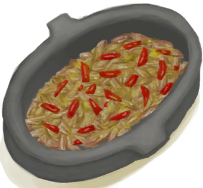
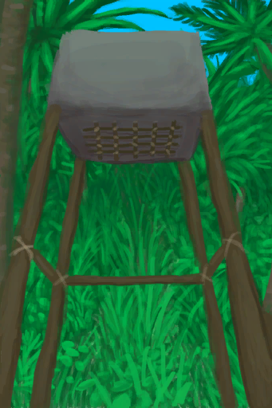

# Mental Structure  
> How predictable and stable your worldview feels. Stresses you and alters your mind state when it gets too low.  
> "This represents how predictable and stable your worldview feels.  Someone with a high mental structure feels confident in their predictions  
  

<b>Base Value: </b> 5000 
  

<b>Value Range: </b> 0 ~ 5000 
  

<b>Base Rate: </b> +1 / /TP 
  

<b>Staleness: </b>Staleness multiplier 50% in 1d(stack:2) 
  
## Statuses  

<table><tr style="height:2em;"><td style="background-color:#F0F0F0;text-align:center;width:180px;font-size:1.4em;font-weight:bold;vertical-align:middle;">
0 ～ 100

0% ～ 2%
</td><td colspan=2 style="font-size:1.1em;vertical-align:middle;background-color:#F9F9F9;">
<b>

Chaos</b>

</td></tr><tr><td colspan=2><b>Effect：</b>[

[Altered Mind State](MindState.md)](MindState.md)addition<b>+4</b>, [

[Mental Structure](Structure.md)](Structure.md)addition<b>+6</b>, [

[Derealization](Derealization.md)](Derealization.md)addition<b>+0.75</b>, [

[Mania](Mania.md)](Mania.md)addition<b>+0.75</b>, [

[Stress](Stress.md)](Stress.md)addition<b>+2</b></td></tr><tr><td colspan=2></td></tr><tr style="height:2em;"><td style="background-color:#F0F0F0;text-align:center;width:180px;font-size:1.4em;font-weight:bold;vertical-align:middle;">
101 ～ 750

2% ～ 15%
</td><td colspan=2 style="font-size:1.1em;vertical-align:middle;background-color:#F9F9F9;">
<b>

Low Structure</b>

</td></tr><tr><td colspan=2><b>Effect：</b>[

[Altered Mind State](MindState.md)](MindState.md)addition<b>+2</b>, [

[Mental Structure](Structure.md)](Structure.md)addition<b>+3</b>, [

[Derealization](Derealization.md)](Derealization.md)addition<b>+0.75</b>, [

[Mania](Mania.md)](Mania.md)addition<b>+0.75</b>, [

[Stress](Stress.md)](Stress.md)addition<b>+1</b></td></tr><tr><td colspan=2></td></tr></table>
  
## Related Cards  
[Morale](Morale.md)  |  [Stress](Stress.md)  |  [Wakefulness](Wakefulness.md)  |  [Alien Spots](AlienSpots.md)  |  [Loneliness](Loneliness.md)  |  [Alcohol](Alcohol.md)  |  [Analgesia](Analgesia.md)  |  [Caffeine](Caffeine.md)  |  [Captain Propinquity](CaptainPropinquity.md)  |  [Captain Company](CaptainCompany.md)  |  [Light](Light.md)  |  [Comfort](Comfort.md)  |  [Discomfort](Discomfort.md)  |  [God Insight](GodInsight.md)  |  [Hunter's Insight](HunterInsight.md)  |  [Weston Company](WestonCompany.md)  |  [Weston Propinquity](WestonPropinquity.md)  |  [Isolation](Isolation.md)  |  [Mourning](Mourning.md)  |  [Void Insight](VoidInsight.md)  |  [Watcher's Insight](WatcherInsight.md)  
## Addition Change By  
<table class="table table-bordered" data-toggle="table"  ><thead style=""><tr ><th  style="text-align:left;vertical-align:top;"  >From</th><th  style="text-align:left;vertical-align:top;"  >Operation</th><th  style="text-align:left;vertical-align:top;"  >Value</th></tr></thead><tr ><td  style="text-align:left;vertical-align:top;"  >

[Down To Earth](Pk_4_DownToEarth.md)</td><td  style="text-align:left;vertical-align:top;"  >Perk Effect</td><td  style="text-align:left;vertical-align:top;"  >addition+10</td></tr><tr ><td  style="text-align:left;vertical-align:top;"  >[Copper Necklace](CopperNecklace.md)</td><td  style="text-align:left;vertical-align:top;"  >Passive Effects</td><td  style="text-align:left;vertical-align:top;"  >addition+0.5</td></tr><tr ><td  style="text-align:left;vertical-align:top;"  >[Pearl Necklace](PearlNecklace.md)</td><td  style="text-align:left;vertical-align:top;"  >Passive Effects</td><td  style="text-align:left;vertical-align:top;"  >addition+0.5</td></tr><tr ><td  style="text-align:left;vertical-align:top;"  >[Flower Necklace](FlowerNecklace.md)</td><td  style="text-align:left;vertical-align:top;"  >Passive Effects</td><td  style="text-align:left;vertical-align:top;"  >addition+0.25</td></tr><tr ><td  style="text-align:left;vertical-align:top;"  >[Hawaiian Shirt](HawaiianShirt.md)</td><td  style="text-align:left;vertical-align:top;"  >Passive Effects</td><td  style="text-align:left;vertical-align:top;"  >addition+0.25</td></tr><tr ><td  style="text-align:left;vertical-align:top;"  >[Hoodie](HoodieRetromation.md)</td><td  style="text-align:left;vertical-align:top;"  >Passive Effects</td><td  style="text-align:left;vertical-align:top;"  >addition+0.25</td></tr><tr ><td  style="text-align:left;vertical-align:top;"  >[China Rose](ChinaRoseFlowers.md)</td><td  style="text-align:left;vertical-align:top;"  >Passive Effects</td><td  style="text-align:left;vertical-align:top;"  >addition+0.25</td></tr><tr ><td  style="text-align:left;vertical-align:top;"  >[Coconut Sandals](CoconutSandals.md)</td><td  style="text-align:left;vertical-align:top;"  >Passive Effects</td><td  style="text-align:left;vertical-align:top;"  >addition+0.1</td></tr><tr ><td  style="text-align:left;vertical-align:top;"  >[Flipflops](Flipflops.md)</td><td  style="text-align:left;vertical-align:top;"  >Passive Effects</td><td  style="text-align:left;vertical-align:top;"  >addition+0.1</td></tr><tr ><td  style="text-align:left;vertical-align:top;"  >[Foot Wrappings](FootWrappings.md)</td><td  style="text-align:left;vertical-align:top;"  >Passive Effects</td><td  style="text-align:left;vertical-align:top;"  >addition+0.1</td></tr><tr ><td  style="text-align:left;vertical-align:top;"  >[Glasses](Glasses.md)</td><td  style="text-align:left;vertical-align:top;"  >Passive Effects</td><td  style="text-align:left;vertical-align:top;"  >addition+0.1</td></tr><tr ><td  style="text-align:left;vertical-align:top;"  >[Hand Wrappings](HandWrappings.md)</td><td  style="text-align:left;vertical-align:top;"  >Passive Effects</td><td  style="text-align:left;vertical-align:top;"  >addition+0.1</td></tr><tr ><td  style="text-align:left;vertical-align:top;"  >[Survival Hat](HatSurvival.md)</td><td  style="text-align:left;vertical-align:top;"  >Passive Effects</td><td  style="text-align:left;vertical-align:top;"  >addition+0.1</td></tr><tr ><td  style="text-align:left;vertical-align:top;"  >[Woven Palm Hat](HatWoven.md)</td><td  style="text-align:left;vertical-align:top;"  >Passive Effects</td><td  style="text-align:left;vertical-align:top;"  >addition+0.1</td></tr><tr ><td  style="text-align:left;vertical-align:top;"  >[Leaf Skirt](LeafSKirt.md)</td><td  style="text-align:left;vertical-align:top;"  >Passive Effects</td><td  style="text-align:left;vertical-align:top;"  >addition+0.1</td></tr><tr ><td  style="text-align:left;vertical-align:top;"  >[Leather Gloves](LeatherGloves.md)</td><td  style="text-align:left;vertical-align:top;"  >Passive Effects</td><td  style="text-align:left;vertical-align:top;"  >addition+0.1</td></tr><tr ><td  style="text-align:left;vertical-align:top;"  >[Leather Pants](LeatherPants.md)</td><td  style="text-align:left;vertical-align:top;"  >Passive Effects</td><td  style="text-align:left;vertical-align:top;"  >addition+0.1</td></tr><tr ><td  style="text-align:left;vertical-align:top;"  >[Leather Shoes](LeatherShoes.md)</td><td  style="text-align:left;vertical-align:top;"  >Passive Effects</td><td  style="text-align:left;vertical-align:top;"  >addition+0.1</td></tr><tr ><td  style="text-align:left;vertical-align:top;"  >[Military Boots](MilitaryBoots.md)</td><td  style="text-align:left;vertical-align:top;"  >Passive Effects</td><td  style="text-align:left;vertical-align:top;"  >addition+0.1</td></tr><tr ><td  style="text-align:left;vertical-align:top;"  >[Military Pants](MilitaryPants.md)</td><td  style="text-align:left;vertical-align:top;"  >Passive Effects</td><td  style="text-align:left;vertical-align:top;"  >addition+0.1</td></tr><tr ><td  style="text-align:left;vertical-align:top;"  >[Cloth Pants](PantsCloth.md)</td><td  style="text-align:left;vertical-align:top;"  >Passive Effects</td><td  style="text-align:left;vertical-align:top;"  >addition+0.1</td></tr><tr ><td  style="text-align:left;vertical-align:top;"  >[Seagull Charm](SeagullCharm.md)</td><td  style="text-align:left;vertical-align:top;"  >Passive Effects</td><td  style="text-align:left;vertical-align:top;"  >addition+0.1</td></tr><tr ><td  style="text-align:left;vertical-align:top;"  >[Seashell Necklace](SeashellNecklace.md)</td><td  style="text-align:left;vertical-align:top;"  >Passive Effects</td><td  style="text-align:left;vertical-align:top;"  >addition+0.1</td></tr><tr ><td  style="text-align:left;vertical-align:top;"  >[Shirt](ShirtFiber.md)</td><td  style="text-align:left;vertical-align:top;"  >Passive Effects</td><td  style="text-align:left;vertical-align:top;"  >addition+0.1</td></tr><tr ><td  style="text-align:left;vertical-align:top;"  >[Shorts](Shorts.md)</td><td  style="text-align:left;vertical-align:top;"  >Passive Effects</td><td  style="text-align:left;vertical-align:top;"  >addition+0.1</td></tr><tr ><td  style="text-align:left;vertical-align:top;"  >[Sneakers](Sneakers.md)</td><td  style="text-align:left;vertical-align:top;"  >Passive Effects</td><td  style="text-align:left;vertical-align:top;"  >addition+0.1</td></tr><tr ><td  style="text-align:left;vertical-align:top;"  >[Socks](Socks.md)</td><td  style="text-align:left;vertical-align:top;"  >Passive Effects</td><td  style="text-align:left;vertical-align:top;"  >addition+0.1</td></tr><tr ><td  style="text-align:left;vertical-align:top;"  >[T-Shirt](T-Shirt.md)</td><td  style="text-align:left;vertical-align:top;"  >Passive Effects</td><td  style="text-align:left;vertical-align:top;"  >addition+0.1</td></tr><tr ><td  style="text-align:left;vertical-align:top;"  >[Underwear](Underwear.md)</td><td  style="text-align:left;vertical-align:top;"  >Passive Effects</td><td  style="text-align:left;vertical-align:top;"  >addition+0.1</td></tr><tr ><td  style="text-align:left;vertical-align:top;"  >[Hunter Mark](W_HunterMark.md)</td><td  style="text-align:left;vertical-align:top;"  >Passive</td><td  style="text-align:left;vertical-align:top;"  >addition-1</td></tr><tr ><td  style="text-align:left;vertical-align:top;"  >[Unravelling Mark](W_UnravellingMark.md)</td><td  style="text-align:left;vertical-align:top;"  >Passive</td><td  style="text-align:left;vertical-align:top;"  >addition-1</td></tr></tbody></table>  
  
## Change By  
<table class="table table-bordered" data-toggle="table"  ><thead style=""><tr ><th  style="text-align:left;vertical-align:top;"  >From</th><th  style="text-align:left;vertical-align:top;"  >Operation</th><th  style="text-align:left;vertical-align:top;"  >Value</th></tr></thead><tr ><td  style="text-align:left;vertical-align:top;"  >[

[Candied Ginger](CandiedGinger.md)](CandiedGinger.md)</td><td  style="text-align:left;vertical-align:top;"  >Eat</td><td  style="text-align:left;vertical-align:top;"  >30</td></tr><tr ><td  style="text-align:left;vertical-align:top;"  >[

[Fish N' Chips](FishNChips.md)](FishNChips.md)</td><td  style="text-align:left;vertical-align:top;"  >Eat</td><td  style="text-align:left;vertical-align:top;"  >30</td></tr><tr ><td  style="text-align:left;vertical-align:top;"  >[

[Hearty Feast](HeartyFeast.md)](HeartyFeast.md)</td><td  style="text-align:left;vertical-align:top;"  >Eat</td><td  style="text-align:left;vertical-align:top;"  >30</td></tr><tr ><td  style="text-align:left;vertical-align:top;"  >[

[Honey Glazed Pork](HoneyGlazedPork.md)](HoneyGlazedPork.md)</td><td  style="text-align:left;vertical-align:top;"  >Eat</td><td  style="text-align:left;vertical-align:top;"  >30</td></tr><tr ><td  style="text-align:left;vertical-align:top;"  >[

[Chocolate](Chocolate.md)](Chocolate.md)</td><td  style="text-align:left;vertical-align:top;"  >Eat</td><td  style="text-align:left;vertical-align:top;"  >25</td></tr><tr ><td  style="text-align:left;vertical-align:top;"  >[

[Sago Cake](SagoCake.md)](SagoCake.md)</td><td  style="text-align:left;vertical-align:top;"  >Eat</td><td  style="text-align:left;vertical-align:top;"  >25</td></tr><tr ><td  style="text-align:left;vertical-align:top;"  >[

[Honey Candy](HoneyCandy.md)](HoneyCandy.md)</td><td  style="text-align:left;vertical-align:top;"  >Eat</td><td  style="text-align:left;vertical-align:top;"  >25</td></tr><tr ><td  style="text-align:left;vertical-align:top;"  >[

[Macaque Skewers](MacaqueSkewers.md)](MacaqueSkewers.md)</td><td  style="text-align:left;vertical-align:top;"  >Eat</td><td  style="text-align:left;vertical-align:top;"  >20</td></tr><tr ><td  style="text-align:left;vertical-align:top;"  >[

[Fried Banana](FriedBanana.md)](FriedBanana.md)</td><td  style="text-align:left;vertical-align:top;"  >Eat</td><td  style="text-align:left;vertical-align:top;"  >20</td></tr><tr ><td  style="text-align:left;vertical-align:top;"  >[

[Goat Cheese](Cheese.md)](Cheese.md)</td><td  style="text-align:left;vertical-align:top;"  >Eat</td><td  style="text-align:left;vertical-align:top;"  >15</td></tr><tr ><td  style="text-align:left;vertical-align:top;"  >[

[Chicken Sandwich](ChickenSandwich.md)](ChickenSandwich.md)</td><td  style="text-align:left;vertical-align:top;"  >Eat</td><td  style="text-align:left;vertical-align:top;"  >15</td></tr><tr ><td  style="text-align:left;vertical-align:top;"  >[

[Coconut Fish](CoconutFish.md)](CoconutFish.md)</td><td  style="text-align:left;vertical-align:top;"  >Eat</td><td  style="text-align:left;vertical-align:top;"  >15</td></tr><tr ><td  style="text-align:left;vertical-align:top;"  >[

[Drunken Crab](DrunkenCrab.md)](DrunkenCrab.md)</td><td  style="text-align:left;vertical-align:top;"  >Eat</td><td  style="text-align:left;vertical-align:top;"  >15</td></tr><tr ><td  style="text-align:left;vertical-align:top;"  >[

[Egg Fried Rice](EggFriedRice.md)](EggFriedRice.md)</td><td  style="text-align:left;vertical-align:top;"  >Eat</td><td  style="text-align:left;vertical-align:top;"  >15</td></tr><tr ><td  style="text-align:left;vertical-align:top;"  >[

[Fish Omelette](FishOmelette.md)](FishOmelette.md)</td><td  style="text-align:left;vertical-align:top;"  >Eat</td><td  style="text-align:left;vertical-align:top;"  >15</td></tr><tr ><td  style="text-align:left;vertical-align:top;"  >[

[Fried Puffballs](FriedPuffballs.md)](FriedPuffballs.md)</td><td  style="text-align:left;vertical-align:top;"  >Eat</td><td  style="text-align:left;vertical-align:top;"  >15</td></tr><tr ><td  style="text-align:left;vertical-align:top;"  >[

[Island Chicken](IslandChicken.md)](IslandChicken.md)</td><td  style="text-align:left;vertical-align:top;"  >Eat</td><td  style="text-align:left;vertical-align:top;"  >15</td></tr><tr ><td  style="text-align:left;vertical-align:top;"  >[

[Jungle Salad](JungleSalad.md)](JungleSalad.md)</td><td  style="text-align:left;vertical-align:top;"  >Eat</td><td  style="text-align:left;vertical-align:top;"  >15</td></tr><tr ><td  style="text-align:left;vertical-align:top;"  >[

[Lizard Fry](LizardFry.md)](LizardFry.md)</td><td  style="text-align:left;vertical-align:top;"  >Eat</td><td  style="text-align:left;vertical-align:top;"  >15</td></tr><tr ><td  style="text-align:left;vertical-align:top;"  >[

[Yam Curry](YamCurry.md)](YamCurry.md)</td><td  style="text-align:left;vertical-align:top;"  >Eat</td><td  style="text-align:left;vertical-align:top;"  >15</td></tr><tr ><td  style="text-align:left;vertical-align:top;"  >[

[Fish Taco](FishTaco.md)](FishTaco.md)</td><td  style="text-align:left;vertical-align:top;"  >Eat</td><td  style="text-align:left;vertical-align:top;"  >15</td></tr><tr ><td  style="text-align:left;vertical-align:top;"  >[

[Yam Jam](YamJam.md)](YamJam.md)</td><td  style="text-align:left;vertical-align:top;"  >Eat</td><td  style="text-align:left;vertical-align:top;"  >15</td></tr><tr ><td  style="text-align:left;vertical-align:top;"  >[

[Wooden Bed](BedWooden.md)](BedWooden.md)</td><td  style="text-align:left;vertical-align:top;"  >Sleep</td><td  style="text-align:left;vertical-align:top;"  >6 / /TP</td></tr><tr ><td  style="text-align:left;vertical-align:top;"  >[

[Protein Bar](ProteinBar.md)](ProteinBar.md)</td><td  style="text-align:left;vertical-align:top;"  >Eat</td><td  style="text-align:left;vertical-align:top;"  >5</td></tr><tr ><td  style="text-align:left;vertical-align:top;"  >[

[Shower](Shower.md)](Shower.md)</td><td  style="text-align:left;vertical-align:top;"  >Take a Shower</td><td  style="text-align:left;vertical-align:top;"  >5</td></tr><tr ><td  style="text-align:left;vertical-align:top;"  >[

[Rustic Bed](BedRustic.md)](BedRustic.md)</td><td  style="text-align:left;vertical-align:top;"  >Sleep</td><td  style="text-align:left;vertical-align:top;"  >4 / /TP</td></tr><tr ><td  style="text-align:left;vertical-align:top;"  >[

[Hammock](Hammock.md)](Hammock.md)</td><td  style="text-align:left;vertical-align:top;"  >Sleep</td><td  style="text-align:left;vertical-align:top;"  >4 / /TP</td></tr><tr ><td  style="text-align:left;vertical-align:top;"  >[

[Wooden Bed](BedWooden.md)](BedWooden.md)</td><td  style="text-align:left;vertical-align:top;"  >Nap</td><td  style="text-align:left;vertical-align:top;"  >3 / /TP</td></tr><tr ><td  style="text-align:left;vertical-align:top;"  >[

[Bedroll](BedRoll.md)](BedRoll.md)</td><td  style="text-align:left;vertical-align:top;"  >Sleep</td><td  style="text-align:left;vertical-align:top;"  >2 / /TP</td></tr><tr ><td  style="text-align:left;vertical-align:top;"  >[

[Rustic Bed](BedRustic.md)](BedRustic.md)</td><td  style="text-align:left;vertical-align:top;"  >Nap</td><td  style="text-align:left;vertical-align:top;"  >2 / /TP</td></tr><tr ><td  style="text-align:left;vertical-align:top;"  >[

[Hammock](Hammock.md)](Hammock.md)</td><td  style="text-align:left;vertical-align:top;"  >Nap</td><td  style="text-align:left;vertical-align:top;"  >2 / /TP</td></tr><tr ><td  style="text-align:left;vertical-align:top;"  >[

[Leaf Bed](LeafBed.md)](LeafBed.md)</td><td  style="text-align:left;vertical-align:top;"  >Sleep</td><td  style="text-align:left;vertical-align:top;"  >2 / /TP</td></tr><tr ><td  style="text-align:left;vertical-align:top;"  >[

[Mermaid nest](MermaidNest.md)](MermaidNest.md)</td><td  style="text-align:left;vertical-align:top;"  >Sleep</td><td  style="text-align:left;vertical-align:top;"  >2 / /TP</td></tr><tr ><td  style="text-align:left;vertical-align:top;"  >[

[Shelter](Shelter.md)](Shelter.md)</td><td  style="text-align:left;vertical-align:top;"  >Sleep</td><td  style="text-align:left;vertical-align:top;"  >2 / /TP</td></tr><tr ><td  style="text-align:left;vertical-align:top;"  >[

[Sheltered Leaf Bed](ShelteredLeafBed.md)](ShelteredLeafBed.md)</td><td  style="text-align:left;vertical-align:top;"  >Sleep</td><td  style="text-align:left;vertical-align:top;"  >2 / /TP</td></tr><tr ><td  style="text-align:left;vertical-align:top;"  >[

[Tent](TentDeployed.md)](TentDeployed.md)</td><td  style="text-align:left;vertical-align:top;"  >Sleep</td><td  style="text-align:left;vertical-align:top;"  >2 / /TP</td></tr><tr ><td  style="text-align:left;vertical-align:top;"  >[

[Raft Shelter](RaftShelter.md)](RaftShelter.md)</td><td  style="text-align:left;vertical-align:top;"  >Sleep</td><td  style="text-align:left;vertical-align:top;"  >2 / /TP</td></tr><tr ><td  style="text-align:left;vertical-align:top;"  >[

[Bedroll](BedRoll.md)](BedRoll.md)</td><td  style="text-align:left;vertical-align:top;"  >Nap</td><td  style="text-align:left;vertical-align:top;"  >1 / /TP</td></tr><tr ><td  style="text-align:left;vertical-align:top;"  >[

[Leaf Bed](LeafBed.md)](LeafBed.md)</td><td  style="text-align:left;vertical-align:top;"  >Nap</td><td  style="text-align:left;vertical-align:top;"  >1 / /TP</td></tr><tr ><td  style="text-align:left;vertical-align:top;"  >[

[Mermaid nest](MermaidNest.md)](MermaidNest.md)</td><td  style="text-align:left;vertical-align:top;"  >Nap</td><td  style="text-align:left;vertical-align:top;"  >1 / /TP</td></tr><tr ><td  style="text-align:left;vertical-align:top;"  >[

[Shelter](Shelter.md)](Shelter.md)</td><td  style="text-align:left;vertical-align:top;"  >Nap</td><td  style="text-align:left;vertical-align:top;"  >1 / /TP</td></tr><tr ><td  style="text-align:left;vertical-align:top;"  >[

[Sheltered Leaf Bed](ShelteredLeafBed.md)](ShelteredLeafBed.md)</td><td  style="text-align:left;vertical-align:top;"  >Nap</td><td  style="text-align:left;vertical-align:top;"  >1 / /TP</td></tr><tr ><td  style="text-align:left;vertical-align:top;"  >[

[Tent](TentDeployed.md)](TentDeployed.md)</td><td  style="text-align:left;vertical-align:top;"  >Nap</td><td  style="text-align:left;vertical-align:top;"  >1 / /TP</td></tr><tr ><td  style="text-align:left;vertical-align:top;"  >[

[You fell asleep!(Event)](Event_FallingAsleep.md)](Event_FallingAsleep.md)</td><td  style="text-align:left;vertical-align:top;"  >Zzz...</td><td  style="text-align:left;vertical-align:top;"  >1 / /TP</td></tr><tr ><td  style="text-align:left;vertical-align:top;"  >[

[Raft Shelter](RaftShelter.md)](RaftShelter.md)</td><td  style="text-align:left;vertical-align:top;"  >Nap</td><td  style="text-align:left;vertical-align:top;"  >1 / /TP</td></tr><tr ><td  style="text-align:left;vertical-align:top;"  >[

[Bugs](Bugs.md)](Bugs.md)</td><td  style="text-align:left;vertical-align:top;"  >Eat</td><td  style="text-align:left;vertical-align:top;"  >-10</td></tr><tr ><td  style="text-align:left;vertical-align:top;"  >[

[Watcher(Event)](Event_WatchedExperience1a.md)](Event_WatchedExperience1a.md)</td><td  style="text-align:left;vertical-align:top;"  >Stare Back</td><td  style="text-align:left;vertical-align:top;"  >-100</td></tr><tr ><td  style="text-align:left;vertical-align:top;"  >[

[Watcher(Event)](Event_WatchedExperience1a.md)](Event_WatchedExperience1a.md)</td><td  style="text-align:left;vertical-align:top;"  >Scream in Horror</td><td  style="text-align:left;vertical-align:top;"  >-100</td></tr><tr ><td  style="text-align:left;vertical-align:top;"  >[

[Watcher(Event)](Event_WatchedExperience1b.md)](Event_WatchedExperience1b.md)</td><td  style="text-align:left;vertical-align:top;"  >Keep staring back</td><td  style="text-align:left;vertical-align:top;"  >-100</td></tr><tr ><td  style="text-align:left;vertical-align:top;"  >[

[Watcher(Event)](Event_WatchedExperience1b.md)](Event_WatchedExperience1b.md)</td><td  style="text-align:left;vertical-align:top;"  >Scream in Horror</td><td  style="text-align:left;vertical-align:top;"  >-100</td></tr><tr ><td  style="text-align:left;vertical-align:top;"  >[

[Watcher(Event)](Event_WatchedExperience1c.md)](Event_WatchedExperience1c.md)</td><td  style="text-align:left;vertical-align:top;"  >Hold that stare!</td><td  style="text-align:left;vertical-align:top;"  >-100</td></tr><tr ><td  style="text-align:left;vertical-align:top;"  >[

[Watcher(Event)](Event_WatchedExperience1c.md)](Event_WatchedExperience1c.md)</td><td  style="text-align:left;vertical-align:top;"  >Scream in Horror</td><td  style="text-align:left;vertical-align:top;"  >-100</td></tr><tr ><td  style="text-align:left;vertical-align:top;"  >[

[Watcher(Event)](Event_WatchedExperience1d.md)](Event_WatchedExperience1d.md)</td><td  style="text-align:left;vertical-align:top;"  >Keep staring!</td><td  style="text-align:left;vertical-align:top;"  >-100</td></tr><tr ><td  style="text-align:left;vertical-align:top;"  >[

[Watcher(Event)](Event_WatchedExperience1d.md)](Event_WatchedExperience1d.md)</td><td  style="text-align:left;vertical-align:top;"  >Scream in Horror</td><td  style="text-align:left;vertical-align:top;"  >-100</td></tr><tr ><td  style="text-align:left;vertical-align:top;"  >[

[Watcher(Event)](Event_WatchedExperience1e.md)](Event_WatchedExperience1e.md)</td><td  style="text-align:left;vertical-align:top;"  >Maintain your stare!</td><td  style="text-align:left;vertical-align:top;"  >-100</td></tr><tr ><td  style="text-align:left;vertical-align:top;"  >[

[Watcher(Event)](Event_WatchedExperience1e.md)](Event_WatchedExperience1e.md)</td><td  style="text-align:left;vertical-align:top;"  >Scream in Horror</td><td  style="text-align:left;vertical-align:top;"  >-100</td></tr><tr ><td  style="text-align:left;vertical-align:top;"  >[

[Watcher(Event)](Event_WatchedExperience1f.md)](Event_WatchedExperience1f.md)</td><td  style="text-align:left;vertical-align:top;"  >Unravel Yourself</td><td  style="text-align:left;vertical-align:top;"  >-100</td></tr><tr ><td  style="text-align:left;vertical-align:top;"  >[

[Watcher(Event)](Event_WatchedExperience1f.md)](Event_WatchedExperience1f.md)</td><td  style="text-align:left;vertical-align:top;"  >Smile with affection</td><td  style="text-align:left;vertical-align:top;"  >-100</td></tr><tr ><td  style="text-align:left;vertical-align:top;"  >[

[Watcher(Event)](Event_WatchedExperience1f.md)](Event_WatchedExperience1f.md)</td><td  style="text-align:left;vertical-align:top;"  >Scream in Horror</td><td  style="text-align:left;vertical-align:top;"  >-100</td></tr><tr ><td  style="text-align:left;vertical-align:top;"  >[

[Watcher(Event)](Event_WatchedExperience1gGod.md)](Event_WatchedExperience1gGod.md)</td><td  style="text-align:left;vertical-align:top;"  >Become the Watcher</td><td  style="text-align:left;vertical-align:top;"  >-100</td></tr><tr ><td  style="text-align:left;vertical-align:top;"  >[

[Watcher(Event)](Event_WatchedExperience1gVoid.md)](Event_WatchedExperience1gVoid.md)</td><td  style="text-align:left;vertical-align:top;"  >Nothing is watching you</td><td  style="text-align:left;vertical-align:top;"  >-100</td></tr><tr ><td  style="text-align:left;vertical-align:top;"  >[

[Anxiety is getting out of control!(Event)](Event_AnxietyAttack.md)](Event_AnxietyAttack.md)</td><td  style="text-align:left;vertical-align:top;"  >Continue</td><td  style="text-align:left;vertical-align:top;"  >-250</td></tr></tbody></table>  
  
## Required By  
<table class="table table-bordered" data-toggle="table"  ><thead style=""><tr ><th  style="text-align:left;vertical-align:top;"  >From</th><th  style="text-align:left;vertical-align:top;"  >Operation</th><th  style="text-align:left;vertical-align:top;"  data-sortable="true"  >Value</th></tr></thead><tr ><td  style="text-align:left;vertical-align:top;"  >[Watcher(Event)](Event_WatchedExperience1a.md)</td><td  style="text-align:left;vertical-align:top;"  >Stare Back</td><td  style="text-align:left;vertical-align:top;"  >101 ~ 5000</td></tr><tr ><td  style="text-align:left;vertical-align:top;"  >[Watcher(Event)](Event_WatchedExperience1b.md)</td><td  style="text-align:left;vertical-align:top;"  >Keep staring back</td><td  style="text-align:left;vertical-align:top;"  >101 ~ 5000</td></tr><tr ><td  style="text-align:left;vertical-align:top;"  >[Watcher(Event)](Event_WatchedExperience1c.md)</td><td  style="text-align:left;vertical-align:top;"  >Hold that stare!</td><td  style="text-align:left;vertical-align:top;"  >101 ~ 5000</td></tr><tr ><td  style="text-align:left;vertical-align:top;"  >[Watcher(Event)](Event_WatchedExperience1d.md)</td><td  style="text-align:left;vertical-align:top;"  >Keep staring!</td><td  style="text-align:left;vertical-align:top;"  >101 ~ 5000</td></tr><tr ><td  style="text-align:left;vertical-align:top;"  >[Watcher(Event)](Event_WatchedExperience1e.md)</td><td  style="text-align:left;vertical-align:top;"  >Maintain your stare!</td><td  style="text-align:left;vertical-align:top;"  >101 ~ 5000</td></tr><tr ><td  style="text-align:left;vertical-align:top;"  >[Watcher(Event)](Event_WatchedExperience1f.md)</td><td  style="text-align:left;vertical-align:top;"  >Unravel Yourself</td><td  style="text-align:left;vertical-align:top;"  >101 ~ 5000</td></tr><tr ><td  style="text-align:left;vertical-align:top;"  >[Watcher(Event)](Event_WatchedExperience1f.md)</td><td  style="text-align:left;vertical-align:top;"  >Smile with affection</td><td  style="text-align:left;vertical-align:top;"  >101 ~ 5000</td></tr><tr ><td  style="text-align:left;vertical-align:top;"  >[Watcher(Event)](Event_WatchedExperience1a.md)</td><td  style="text-align:left;vertical-align:top;"  >Scream in Horror</td><td  style="text-align:left;vertical-align:top;"  >0 ~ 5000</td></tr><tr ><td  style="text-align:left;vertical-align:top;"  >[Watcher(Event)](Event_WatchedExperience1b.md)</td><td  style="text-align:left;vertical-align:top;"  >Scream in Horror</td><td  style="text-align:left;vertical-align:top;"  >0 ~ 5000</td></tr><tr ><td  style="text-align:left;vertical-align:top;"  >[Watcher(Event)](Event_WatchedExperience1c.md)</td><td  style="text-align:left;vertical-align:top;"  >Scream in Horror</td><td  style="text-align:left;vertical-align:top;"  >0 ~ 5000</td></tr><tr ><td  style="text-align:left;vertical-align:top;"  >[Watcher(Event)](Event_WatchedExperience1d.md)</td><td  style="text-align:left;vertical-align:top;"  >Scream in Horror</td><td  style="text-align:left;vertical-align:top;"  >0 ~ 5000</td></tr><tr ><td  style="text-align:left;vertical-align:top;"  >[Watcher(Event)](Event_WatchedExperience1e.md)</td><td  style="text-align:left;vertical-align:top;"  >Scream in Horror</td><td  style="text-align:left;vertical-align:top;"  >0 ~ 5000</td></tr><tr ><td  style="text-align:left;vertical-align:top;"  >[Watcher(Event)](Event_WatchedExperience1f.md)</td><td  style="text-align:left;vertical-align:top;"  >Scream in Horror</td><td  style="text-align:left;vertical-align:top;"  >0 ~ 5000</td></tr></tbody></table>  
  

