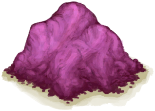

# Sugar  
> Palm Sugar. Tasty.  
  
<table class="table table-bordered" data-toggle="table"  data-show-header="false"><thead style="display:none"><tr ><th  style="width:50%;text-align:left;vertical-align:top;"  >title</th><th  style="width:50%;text-align:left;vertical-align:top;"  ></th></tr></thead><tr ><td  style="width:50%;text-align:left;vertical-align:top;"  >**Weight：**50  **Tag：**	[“Cookable”](tag_Cookable.md), [“Feed”](tag_Feed.md), [“Feed Rich”](tag_FeedRich.md), [“Rich Sugars”](tag_SugarsRich.md)</td><td  style="width:50%;text-align:left;vertical-align:top;"  >

<a href="Sugar.md" style="color:black">Sugar</a>

"Sugar can be made by simply boiling the rapidly fermenting <b>Sap</b> of Nipa Palms .  It is a rich food that can be used for multiple <b>Cooking Recipes</b> or mixed into <b>Sugar Water</b></td></tr></tbody></table>  
  
## Got From  

Boiling Sap

[Sap](LQ_Sap.md)

Boiling Sap

[Sap](LQ_Sap.md)

Boiling Sap

[Sap](LQ_Sap.md)

Boiling Sap

[Sap](LQ_Sap.md)

Boiling Sap

[Sap](LQ_Sap.md)

  
  
## Action  

<table><tr><td rowspan="2" style="width:200px;text-align:center;font-size:1.3em;font-weight:bold">

Eat

15m

</td><td>[“VegetarianAction(Group)”](VegetarianAction.md), [“EatingAction(Group)”](EatingAction.md)</td></tr><tr><td><b>Self：</b>→Dismiss</td></tr><tr><td colspan="2"><b>StatChange：</b>[

[Satiation](Satiation.md)](Satiation.md)<b>+30</b>, [

[Stomach](Stomach.md)](Stomach.md)<b>+30</b>, [

[Stress](Stress.md)](Stress.md)<b>-20</b>, [

[Morale](Morale.md)](Morale.md)<b>+1</b>, [

[Saturation Sugar](SaturationSugar.md)](SaturationSugar.md)<b>+200</b>, [

[Filth](Filth.md)](Filth.md)<b>+2</b></td></tr></table>
  
  
  
## Drag With  

<table style="margin-bottom:0px;"><tr><td style="width:40%;text-align:left; background-color:#FEFEFE"><b>With：</b>[“Water for Crops”](tag_WaterFresh.md)</td><td style="width:40%;font-size:1em;font-weight:bold;background-color:#FEFEFE">Soak  </td></tr><tr><td colspan="2"><b>Require：</b>LiquidQuantity: 150</td></tr><tr style="background-color:#FFFFFF"><td style=""><b>Receiving：</b>→ [

[Sugar Water](LQ_SugarWater.md)](LQ_SugarWater.md)</td><td style=""><b>Self：</b>→Dismiss</td></tr></table>
  
  
## Drag To  

[Boar Feeder](BoarFeeder.md)

[Boar Feeder(Empty)](BoarFeederEmpty.md)

[Compost Bin](CompostBin.md)

[Goat Feeder](GoatFeeder.md)

[Goat Feeder(Empty)](GoatFeederEmpty.md)

[Partridge Feeder](PartridgeFeeder.md)

[Partridge Feeder(Empty)](PartridgeFeederEmpty.md)

[Trapped Macaque](CageTrapMacaque.md)

[Sow](BoarEnclosureFemale.md)

[Boar](BoarEnclosureMale.md)

[Piglet](BoarEnclosurePiglet.md)

[Sow](BoarTiedFemale.md)

[Boar](BoarTiedMale.md)

[Piglet](BoarTiedPiglet.md)

[Goat](GoatEnclosureFemale.md)

[Juvenile Goat](GoatEnclosureKid.md)

[Lactating Goat](GoatEnclosureLactating.md)

[Male Goat](GoatEnclosureMale.md)

[Goat](GoatTiedFemale.md)

[Lactating Goat](GoatTiedFemaleLactating.md)

[Juvenile Goat](GoatTiedKid.md)

[Male Goat](GoatTiedMale.md)

[Macaque Friend](MacaqueFriend.md)

[Wounded Macaque](MacaqueWounded.md)

[Chick](PartridgeChick.md)

[Partridge](PartridgeFemaleEnclosure.md)

[Partridge](PartridgeFemaleLive.md)

[Male Partridge](PartridgeMaleEnclosure.md)

[Male Partridge](PartridgeMaleLive.md)

  
  
## Use In BluePrint  

<a href="Bp_CandiedGinger.md" style="color:black">Candied Ginger</a>

<a href="Bp_FriedBananas.md" style="color:black">Fried Bananas</a>

<a href="Bp_HoneyCandy.md" style="color:black">Honey Candy</a>

<a href="Bp_SagoCake.md" style="color:black">Sago Cake</a>

<a href="Bp_TonicWater.md" style="color:black">Tonic Water</a>

<a href="Bp_YamJam.md" style="color:black">Yam Jam</a>

  
  
  

