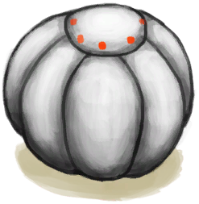

# Supply Capsule  
> Contains different supplies.  
  
<table class="table table-bordered" data-toggle="table"  data-show-header="false"><thead style="display:none"><tr ><th  style="width:50%;text-align:left;vertical-align:top;"  >title</th><th  style="width:50%;text-align:left;vertical-align:top;"  ></th></tr></thead><tr ><td  style="width:50%;text-align:left;vertical-align:top;"  >** Unique On Board **  ** DoseNotPile **  **Tag：**	[“Bag”](tag_Bag.md)</td><td  style="width:50%;text-align:left;vertical-align:top;"  >

<a href="TV_SupplyCapsule.md" style="color:black">Supply Capsule</a>

</td></tr></tbody></table>  
  
## Got From  

Explore

[Acid Lake(Volcano)](AcidLake.md)

Explore

[Bird Rock](BirdRock.md)

Explore

[Deep Jungle(Jungle)](DeepJungle.md)

Explore

[Desolate Beach](DesolateBeach.md)

Explore

[Eastern Grasslands](GrasslandsE.md)

Explore

[Western Grasslands](GrasslandsW.md)

Explore

[Eastern Highlands](HighlandsEastern.md)

Explore

[Western Highlands](HighlandsWestern.md)

Explore

[Jungle](Jungle.md)

Explore

[Jungle Highlands](JungleHighlands.md)

Explore

[Mangrove Forest](Mangroves.md)

Explore

[Rocks](Rocks.md)

Explore

[Secret Valley](SecretValley.md)

Explore

[Volcano](Volcano.md)

  
  
## Action  

<table><tr><td rowspan="2" style="width:200px;text-align:center;font-size:1.3em;font-weight:bold">

Open

</td><td></td></tr><tr><td><b>Self：</b>→Dismiss</td></tr><tr><td colspan="2"><b>StatChange：</b>[TV Stage](TV_Stage.md)<b>+1</b>, [

[TV - Wait](TV_CounterWait.md)](TV_CounterWait.md)<b>-287</b>, [

[TV - Package Timer](TV_CounterRush.md)](TV_CounterRush.md)<b>-288</b>, [

[TV Jungle](TV_Jungle.md)](TV_Jungle.md)<b>-1</b>, [TV Jungle - Explore](TV_JungleExplore.md)<b>-20</b>, [

[TV Mangroves](TV_Mangroves.md)](TV_Mangroves.md)<b>-1</b>, [TV Mangroves - Explore](TV_MangrovesExplore.md)<b>-20</b>, [

[TV Rocks](TV_Rocks.md)](TV_Rocks.md)<b>-1</b>, [TV Rocks - Explore](TV_RocksExplore.md)<b>-20</b>, [

[TV Highlands](TV_Highlands.md)](TV_Highlands.md)<b>-1</b>, [TV Highlands - Explore](TV_HighlandsExplore.md)<b>-20</b>, [

[TV Grasslands](TV_Grasslands.md)](TV_Grasslands.md)<b>-1</b>, [TV Grasslands - Explore](TV_GrasslandsExplore.md)<b>-20</b></td></tr><tr><td colspan="2">

<table style="margin-bottom:3px;"><tr><td rowspan=2 style="text-align:center" width="80px">
Base Weight

1
</td><td style="font-size:0.6em;line-height:0.6em;font-weight:bold">Food</td></tr><tr><td>[

[Food Rations](FoodRationsPackage.md)](FoodRationsPackage.md)(<b>+1</b>)</td></tr><tr><td colspan=2><li>[TV Stage](TV_Stage.md) in <b>8～10</b>, weight<b>-1</b></li></td></tr></table>

<table style="margin-bottom:3px;"><tr><td rowspan=2 style="text-align:center" width="80px">
Base Weight

1
</td><td style="font-size:0.6em;line-height:0.6em;font-weight:bold">Water</td></tr><tr><td>[

[Water Rations](WaterRationsPackage.md)](WaterRationsPackage.md)(<b>+1</b>)</td></tr><tr><td colspan=2><li>[TV Stage](TV_Stage.md) in <b>8～10</b>, weight<b>-1</b></li></td></tr></table>

<table style="margin-bottom:3px;"><tr><td rowspan=2 style="text-align:center" width="80px">
Base Weight

1
</td><td style="font-size:0.6em;line-height:0.6em;font-weight:bold">Painkillers</td></tr><tr><td>[

[Painkillers](Painkillers.md)](Painkillers.md)(<b>+1</b>)</td></tr><tr><td colspan=2><li>[TV Stage](TV_Stage.md) in <b>8～10</b>, weight<b>-1</b></li></td></tr></table>

<table style="margin-bottom:3px;"><tr><td rowspan=2 style="text-align:center" width="80px">
Base Weight

1
</td><td style="font-size:0.6em;line-height:0.6em;font-weight:bold">Antibiotics</td></tr><tr><td>[

[Antibiotics](Antibiotics.md)](Antibiotics.md)(<b>+1</b>)</td></tr><tr><td colspan=2><li>[TV Stage](TV_Stage.md) in <b>8～10</b>, weight<b>-1</b></li></td></tr></table>

<table style="margin-bottom:3px;"><tr><td rowspan=2 style="text-align:center" width="80px">
Base Weight

1
</td><td style="font-size:0.6em;line-height:0.6em;font-weight:bold">Antidiarrhoea</td></tr><tr><td>[

[Anti-Diarrhoea Pills](AntiDiarrhoeaPills.md)](AntiDiarrhoeaPills.md)(<b>+1</b>)</td></tr><tr><td colspan=2><li>[TV Stage](TV_Stage.md) in <b>8～10</b>, weight<b>-1</b></li></td></tr></table>

<table style="margin-bottom:3px;"><tr><td rowspan=2 style="text-align:center" width="80px">
Base Weight

1
</td><td style="font-size:0.6em;line-height:0.6em;font-weight:bold">Dressings</td></tr><tr><td>[

[Wound Dressing](WoundDressing.md)](WoundDressing.md)(<b>+2</b>)</td></tr><tr><td colspan=2><li>[TV Stage](TV_Stage.md) in <b>8～10</b>, weight<b>-1</b></li></td></tr></table>

<table style="margin-bottom:3px;"><tr><td rowspan=2 style="text-align:center" width="80px">
Base Weight

1
</td><td style="font-size:0.6em;line-height:0.6em;font-weight:bold">Trash</td></tr><tr><td>[

[Socks](Socks.md)](Socks.md)(<b>+2</b>), [

[Charcoal](Charcoal.md)](Charcoal.md)(<b>+2</b>)</td></tr><tr><td colspan=2><li>[TV Stage](TV_Stage.md) in <b>8～10</b>, weight<b>-1</b></li></td></tr></table>

<table style="margin-bottom:3px;"><tr><td rowspan=2 style="text-align:center" width="80px">
Base Weight

1
</td><td style="font-size:0.6em;line-height:0.6em;font-weight:bold">Gun</td></tr><tr><td>[

[Gun](Gun.md)](Gun.md)(<b>+1</b>)</td></tr><tr><td colspan=2><li>[TV Stage](TV_Stage.md) in <b>8～10</b>, weight<b>-1</b></li></td></tr></table>

<table style="margin-bottom:3px;"><tr><td rowspan=2 style="text-align:center" width="80px">
Base Weight

1
</td><td style="font-size:0.6em;line-height:0.6em;font-weight:bold">Knife</td></tr><tr><td>[

[Military Knife](KnifeMilitary.md)](KnifeMilitary.md)(<b>+1</b>)</td></tr><tr><td colspan=2><li>[TV Stage](TV_Stage.md) in <b>8～10</b>, weight<b>-1</b></li></td></tr></table>

<table style="margin-bottom:3px;"><tr><td rowspan=2 style="text-align:center" width="80px">
Base Weight

0
</td><td style="font-size:0.6em;line-height:0.6em;font-weight:bold">Victory</td></tr><tr><td>[

[Victory Leaflet](TV_Leaflet.md)](TV_Leaflet.md)(<b>+1</b>), [

[Victory Pills](VictoryPillsTV.md)](VictoryPillsTV.md)(<b>+1</b>)[

[TV - Wait](TV_CounterWait.md)](TV_CounterWait.md)<b>-1</b></td></tr><tr><td colspan=2><li>[TV Stage](TV_Stage.md) in <b>8～10</b>, weight<b>+1000</b></li></td></tr></table>
<button class="btn btn-secondary btn-sm" style="" data-toggle="modal" onclick="setCollectionDataBase64('eyJ0aXRsZSI6IlNpbXVsYXRvcjogT3BlbiAoU3VwcGx5IENhcHN1bGUpIiwiY29sbGVjdGlvbnMiOlt7ImRyb3AiOiI8ZGl2IHN0eWxlPVwid2lkdGg6MjVweDtkaXNwbGF5OmlubGluZS1ibG9jazt0ZXh0LWFsaWduOmNlbnRlclwiPjxpbWcgZGVjb2Rpbmc9XCJhc3luY1wiIHNyYz1cIlNwcml0ZS9Gb29kUmF0aW9uc1BhY2thZ2UucG5nXCIgaHJlZj1cImEubWRcIiBzdHlsZT1cIm1heC13aWR0aDoyNXB4O21heC1oZWlnaHQ6MjVweDtcIj48L2Rpdj5Gb29kIFJhdGlvbnMiLCJiYXNlIjoxLCJjb25kaXRpb24iOlt7ImtleSI6IlRWX1N0YWdlIiwidGl0bGUiOiJUViBTdGFnZSIsInR5cGUiOiJyYW5nZSIsIm1heCI6WzAsMTBdLCJyYW5nZSI6WzgsMTBdLCJ3ZWlnaHQiOlstMSwtMV0sImRlZmF1bHRWYWx1ZSI6MCwid2hlbk91dE9mUmFuZ2UiOjB9XX0seyJkcm9wIjoiPGRpdiBzdHlsZT1cIndpZHRoOjI1cHg7ZGlzcGxheTppbmxpbmUtYmxvY2s7dGV4dC1hbGlnbjpjZW50ZXJcIj48aW1nIGRlY29kaW5nPVwiYXN5bmNcIiBzcmM9XCJTcHJpdGUvV2F0ZXJSYXRpb25zUGFja2FnZS5wbmdcIiBocmVmPVwiYS5tZFwiIHN0eWxlPVwibWF4LXdpZHRoOjI1cHg7bWF4LWhlaWdodDoyNXB4O1wiPjwvZGl2PldhdGVyIFJhdGlvbnMiLCJiYXNlIjoxLCJjb25kaXRpb24iOlt7ImtleSI6IlRWX1N0YWdlIiwidGl0bGUiOiJUViBTdGFnZSIsInR5cGUiOiJyYW5nZSIsIm1heCI6WzAsMTBdLCJyYW5nZSI6WzgsMTBdLCJ3ZWlnaHQiOlstMSwtMV0sImRlZmF1bHRWYWx1ZSI6MCwid2hlbk91dE9mUmFuZ2UiOjB9XX0seyJkcm9wIjoiPGRpdiBzdHlsZT1cIndpZHRoOjI1cHg7ZGlzcGxheTppbmxpbmUtYmxvY2s7dGV4dC1hbGlnbjpjZW50ZXJcIj48aW1nIGRlY29kaW5nPVwiYXN5bmNcIiBzcmM9XCJTcHJpdGUvUGFpbmtpbGxlcnMucG5nXCIgaHJlZj1cImEubWRcIiBzdHlsZT1cIm1heC13aWR0aDoyNXB4O21heC1oZWlnaHQ6MjVweDtcIj48L2Rpdj5QYWlua2lsbGVycyIsImJhc2UiOjEsImNvbmRpdGlvbiI6W3sia2V5IjoiVFZfU3RhZ2UiLCJ0aXRsZSI6IlRWIFN0YWdlIiwidHlwZSI6InJhbmdlIiwibWF4IjpbMCwxMF0sInJhbmdlIjpbOCwxMF0sIndlaWdodCI6Wy0xLC0xXSwiZGVmYXVsdFZhbHVlIjowLCJ3aGVuT3V0T2ZSYW5nZSI6MH1dfSx7ImRyb3AiOiI8ZGl2IHN0eWxlPVwid2lkdGg6MjVweDtkaXNwbGF5OmlubGluZS1ibG9jazt0ZXh0LWFsaWduOmNlbnRlclwiPjxpbWcgZGVjb2Rpbmc9XCJhc3luY1wiIHNyYz1cIlNwcml0ZS9BbnRpYmlvdGljcy5wbmdcIiBocmVmPVwiYS5tZFwiIHN0eWxlPVwibWF4LXdpZHRoOjI1cHg7bWF4LWhlaWdodDoyNXB4O1wiPjwvZGl2PkFudGliaW90aWNzIiwiYmFzZSI6MSwiY29uZGl0aW9uIjpbeyJrZXkiOiJUVl9TdGFnZSIsInRpdGxlIjoiVFYgU3RhZ2UiLCJ0eXBlIjoicmFuZ2UiLCJtYXgiOlswLDEwXSwicmFuZ2UiOls4LDEwXSwid2VpZ2h0IjpbLTEsLTFdLCJkZWZhdWx0VmFsdWUiOjAsIndoZW5PdXRPZlJhbmdlIjowfV19LHsiZHJvcCI6IjxkaXYgc3R5bGU9XCJ3aWR0aDoyNXB4O2Rpc3BsYXk6aW5saW5lLWJsb2NrO3RleHQtYWxpZ246Y2VudGVyXCI+PGltZyBkZWNvZGluZz1cImFzeW5jXCIgc3JjPVwiU3ByaXRlL0FudGktRGlhcnJob2VhLnBuZ1wiIGhyZWY9XCJhLm1kXCIgc3R5bGU9XCJtYXgtd2lkdGg6MjVweDttYXgtaGVpZ2h0OjI1cHg7XCI+PC9kaXY+QW50aS1EaWFycmhvZWEgUGlsbHMiLCJiYXNlIjoxLCJjb25kaXRpb24iOlt7ImtleSI6IlRWX1N0YWdlIiwidGl0bGUiOiJUViBTdGFnZSIsInR5cGUiOiJyYW5nZSIsIm1heCI6WzAsMTBdLCJyYW5nZSI6WzgsMTBdLCJ3ZWlnaHQiOlstMSwtMV0sImRlZmF1bHRWYWx1ZSI6MCwid2hlbk91dE9mUmFuZ2UiOjB9XX0seyJkcm9wIjoiPGRpdiBzdHlsZT1cIndpZHRoOjI1cHg7ZGlzcGxheTppbmxpbmUtYmxvY2s7dGV4dC1hbGlnbjpjZW50ZXJcIj48aW1nIGRlY29kaW5nPVwiYXN5bmNcIiBzcmM9XCJTcHJpdGUvRHJlc3NpbmcucG5nXCIgaHJlZj1cImEubWRcIiBzdHlsZT1cIm1heC13aWR0aDoyNXB4O21heC1oZWlnaHQ6MjVweDtcIj48L2Rpdj5Xb3VuZCBEcmVzc2luZyIsImJhc2UiOjEsImNvbmRpdGlvbiI6W3sia2V5IjoiVFZfU3RhZ2UiLCJ0aXRsZSI6IlRWIFN0YWdlIiwidHlwZSI6InJhbmdlIiwibWF4IjpbMCwxMF0sInJhbmdlIjpbOCwxMF0sIndlaWdodCI6Wy0xLC0xXSwiZGVmYXVsdFZhbHVlIjowLCJ3aGVuT3V0T2ZSYW5nZSI6MH1dfSx7ImRyb3AiOiI8ZGl2IHN0eWxlPVwid2lkdGg6MjVweDtkaXNwbGF5OmlubGluZS1ibG9jazt0ZXh0LWFsaWduOmNlbnRlclwiPjxpbWcgZGVjb2Rpbmc9XCJhc3luY1wiIHNyYz1cIlNwcml0ZS9Tb2NrLnBuZ1wiIGhyZWY9XCJhLm1kXCIgc3R5bGU9XCJtYXgtd2lkdGg6MjVweDttYXgtaGVpZ2h0OjI1cHg7XCI+PC9kaXY+U29ja3M8ZGl2IHN0eWxlPVwid2lkdGg6MjVweDtkaXNwbGF5OmlubGluZS1ibG9jazt0ZXh0LWFsaWduOmNlbnRlclwiPjxpbWcgZGVjb2Rpbmc9XCJhc3luY1wiIHNyYz1cIlNwcml0ZS9DaGFyY29hbC5wbmdcIiBocmVmPVwiYS5tZFwiIHN0eWxlPVwibWF4LXdpZHRoOjI1cHg7bWF4LWhlaWdodDoyNXB4O1wiPjwvZGl2PkNoYXJjb2FsIiwiYmFzZSI6MSwiY29uZGl0aW9uIjpbeyJrZXkiOiJUVl9TdGFnZSIsInRpdGxlIjoiVFYgU3RhZ2UiLCJ0eXBlIjoicmFuZ2UiLCJtYXgiOlswLDEwXSwicmFuZ2UiOls4LDEwXSwid2VpZ2h0IjpbLTEsLTFdLCJkZWZhdWx0VmFsdWUiOjAsIndoZW5PdXRPZlJhbmdlIjowfV19LHsiZHJvcCI6IjxkaXYgc3R5bGU9XCJ3aWR0aDoyNXB4O2Rpc3BsYXk6aW5saW5lLWJsb2NrO3RleHQtYWxpZ246Y2VudGVyXCI+PGltZyBkZWNvZGluZz1cImFzeW5jXCIgc3JjPVwiU3ByaXRlL1Bpc3RvbC5wbmdcIiBocmVmPVwiYS5tZFwiIHN0eWxlPVwibWF4LXdpZHRoOjI1cHg7bWF4LWhlaWdodDoyNXB4O1wiPjwvZGl2Pkd1biIsImJhc2UiOjEsImNvbmRpdGlvbiI6W3sia2V5IjoiVFZfU3RhZ2UiLCJ0aXRsZSI6IlRWIFN0YWdlIiwidHlwZSI6InJhbmdlIiwibWF4IjpbMCwxMF0sInJhbmdlIjpbOCwxMF0sIndlaWdodCI6Wy0xLC0xXSwiZGVmYXVsdFZhbHVlIjowLCJ3aGVuT3V0T2ZSYW5nZSI6MH1dfSx7ImRyb3AiOiI8ZGl2IHN0eWxlPVwid2lkdGg6MjVweDtkaXNwbGF5OmlubGluZS1ibG9jazt0ZXh0LWFsaWduOmNlbnRlclwiPjxpbWcgZGVjb2Rpbmc9XCJhc3luY1wiIHNyYz1cIlNwcml0ZS9NaWxpdGFyeUtuaWZlLnBuZ1wiIGhyZWY9XCJhLm1kXCIgc3R5bGU9XCJtYXgtd2lkdGg6MjVweDttYXgtaGVpZ2h0OjI1cHg7XCI+PC9kaXY+TWlsaXRhcnkgS25pZmUiLCJiYXNlIjoxLCJjb25kaXRpb24iOlt7ImtleSI6IlRWX1N0YWdlIiwidGl0bGUiOiJUViBTdGFnZSIsInR5cGUiOiJyYW5nZSIsIm1heCI6WzAsMTBdLCJyYW5nZSI6WzgsMTBdLCJ3ZWlnaHQiOlstMSwtMV0sImRlZmF1bHRWYWx1ZSI6MCwid2hlbk91dE9mUmFuZ2UiOjB9XX0seyJkcm9wIjoiPGRpdiBzdHlsZT1cIndpZHRoOjI1cHg7ZGlzcGxheTppbmxpbmUtYmxvY2s7dGV4dC1hbGlnbjpjZW50ZXJcIj48aW1nIGRlY29kaW5nPVwiYXN5bmNcIiBzcmM9XCJTcHJpdGUvTGVhZmxldC5wbmdcIiBocmVmPVwiYS5tZFwiIHN0eWxlPVwibWF4LXdpZHRoOjI1cHg7bWF4LWhlaWdodDoyNXB4O1wiPjwvZGl2PlZpY3RvcnkgTGVhZmxldDxkaXYgc3R5bGU9XCJ3aWR0aDoyNXB4O2Rpc3BsYXk6aW5saW5lLWJsb2NrO3RleHQtYWxpZ246Y2VudGVyXCI+PGltZyBkZWNvZGluZz1cImFzeW5jXCIgc3JjPVwiU3ByaXRlL1NlYXNpY2tuZXNzLnBuZ1wiIGhyZWY9XCJhLm1kXCIgc3R5bGU9XCJtYXgtd2lkdGg6MjVweDttYXgtaGVpZ2h0OjI1cHg7XCI+PC9kaXY+VmljdG9yeSBQaWxscyIsImJhc2UiOjAsImNvbmRpdGlvbiI6W3sia2V5IjoiVFZfU3RhZ2UiLCJ0aXRsZSI6IlRWIFN0YWdlIiwidHlwZSI6InJhbmdlIiwibWF4IjpbMCwxMF0sInJhbmdlIjpbOCwxMF0sIndlaWdodCI6WzEwMDAsMTAwMF0sImRlZmF1bHRWYWx1ZSI6MCwid2hlbk91dE9mUmFuZ2UiOjB9XX1dfQ==')" data-target="#modelCollectionSimulator">Simulator</button>
</td></tr></table>
  
  
  
## Durability   

<table style="margin-bottom:0px;"><tr><td style="width:30%;text-align:left; background-color:#FEFEFE;font-size:1.3em;font-weight:bold;">Progress</td><td style="font-size:1em;background-color:#FEFEFE">Starting：1 , Max：1 -</td></tr><tr style="background-color:#FFFFFF"><td colspan=2>** On Zero：Self-Destruct ** Self: →Dismiss</td></tr></table>
  
## Trigger by Status  
<table class="table table-bordered" data-toggle="table"  ><thead style=""><tr ><th  style="text-align:left;vertical-align:top;"  >Name</th><th  style="text-align:left;vertical-align:top;"  >Condition</th><th  style="text-align:left;vertical-align:top;"  >Change</th></tr></thead><tr ><td  style="text-align:left;vertical-align:top;"  >Self-Destruct</td><td  style="text-align:left;vertical-align:top;"  >[TV Crate Killer](TV_CrateKiller.md): <b>1-1</b></td><td  style="text-align:left;vertical-align:top;"  >Charges  <b>-1</b></td></tr></tbody></table>  
  

