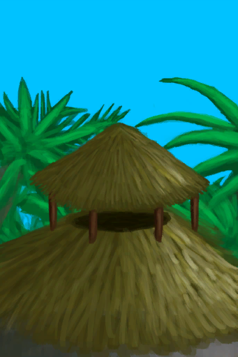
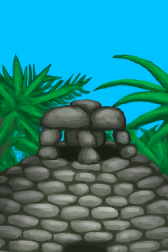

# Temperature  
> The approximate temperature your body is perceiving.  
  

<b>Base Value: </b> 0 
  

<b>Value Range: </b> -80 ~ 80 
  

<b>Base Rate: </b> - 
  

<b>17时 ~ 6时： </b>-4 
  

<b>12时 ~ 16时： </b>+4 
  
## Statuses  

<table><tr style="height:2em;"><td style="background-color:#F0F0F0;text-align:center;width:180px;font-size:1.4em;font-weight:bold;vertical-align:middle;">
60 ～ 80

75% ～ 100%
</td><td colspan=2 style="font-size:1.1em;vertical-align:middle;background-color:#F9F9F9;">
<b>

Scorching Hot</b>

&nbsp;&nbsp;I'm cooking alive...
</td></tr><tr><td colspan=2><b>Effect：</b>[

[Hyperthermia](Hyperthermia.md)](Hyperthermia.md)addition<b>+40</b>, [

[Wetness](Wetness.md)](Wetness.md)addition<b>-100</b>, [

[Hydration ](Hydration.md)](Hydration.md)addition<b>-6</b></td></tr><tr><td colspan=2></td></tr><tr style="height:2em;"><td style="background-color:#F0F0F0;text-align:center;width:180px;font-size:1.4em;font-weight:bold;vertical-align:middle;">
45 ～ 59

56% ～ 73%
</td><td colspan=2 style="font-size:1.1em;vertical-align:middle;background-color:#F9F9F9;">
<b>

Extremely Hot</b>

&nbsp;&nbsp;I'm melting...
</td></tr><tr><td colspan=2><b>Effect：</b>[

[Hyperthermia](Hyperthermia.md)](Hyperthermia.md)addition<b>+30</b>, [

[Wetness](Wetness.md)](Wetness.md)addition<b>-50</b>, [

[Hydration ](Hydration.md)](Hydration.md)addition<b>-3</b></td></tr><tr><td colspan=2></td></tr><tr style="height:2em;"><td style="background-color:#F0F0F0;text-align:center;width:180px;font-size:1.4em;font-weight:bold;vertical-align:middle;">
36 ～ 44

45% ～ 55%
</td><td colspan=2 style="font-size:1.1em;vertical-align:middle;background-color:#F9F9F9;">
<b>

Very Hot</b>

</td></tr><tr><td colspan=2><b>Effect：</b>[

[Hyperthermia](Hyperthermia.md)](Hyperthermia.md)addition<b>+26</b>, [

[Wetness](Wetness.md)](Wetness.md)addition<b>-25</b>, [

[Hydration ](Hydration.md)](Hydration.md)addition<b>-1.5</b></td></tr><tr><td colspan=2></td></tr><tr style="height:2em;"><td style="background-color:#F0F0F0;text-align:center;width:180px;font-size:1.4em;font-weight:bold;vertical-align:middle;">
28 ～ 35

35% ～ 43%
</td><td colspan=2 style="font-size:1.1em;vertical-align:middle;background-color:#F9F9F9;">
<b>

Hot</b>

</td></tr><tr><td colspan=2><b>Effect：</b>[

[Hyperthermia](Hyperthermia.md)](Hyperthermia.md)addition<b>+24</b>, [

[Wetness](Wetness.md)](Wetness.md)addition<b>-10</b>, [

[Hydration ](Hydration.md)](Hydration.md)addition<b>-0.75</b></td></tr><tr><td colspan=2></td></tr><tr style="height:2em;"><td style="background-color:#F0F0F0;text-align:center;width:180px;font-size:1.4em;font-weight:bold;vertical-align:middle;">
8 ～ 18

10% ～ 22%
</td><td colspan=2 style="font-size:1.1em;vertical-align:middle;background-color:#F9F9F9;">
<b>

Chilled</b>

</td></tr><tr><td colspan=2><b>Effect：</b>[

[Hypothermia](Hypothermia.md)](Hypothermia.md)addition<b>+15</b></td></tr><tr><td colspan=2></td></tr><tr style="height:2em;"><td style="background-color:#F0F0F0;text-align:center;width:180px;font-size:1.4em;font-weight:bold;vertical-align:middle;">
-2 ～ 7

-3% ～ 8%
</td><td colspan=2 style="font-size:1.1em;vertical-align:middle;background-color:#F9F9F9;">
<b>

Cold</b>

</td></tr><tr><td colspan=2><b>Effect：</b>[

[Hypothermia](Hypothermia.md)](Hypothermia.md)addition<b>+26</b></td></tr><tr><td colspan=2></td></tr><tr style="height:2em;"><td style="background-color:#F0F0F0;text-align:center;width:180px;font-size:1.4em;font-weight:bold;vertical-align:middle;">
-10 ～ -3

-13% ～ -4%
</td><td colspan=2 style="font-size:1.1em;vertical-align:middle;background-color:#F9F9F9;">
<b>

Very Cold</b>

</td></tr><tr><td colspan=2><b>Effect：</b>[

[Hypothermia](Hypothermia.md)](Hypothermia.md)addition<b>+28</b></td></tr><tr><td colspan=2></td></tr><tr style="height:2em;"><td style="background-color:#F0F0F0;text-align:center;width:180px;font-size:1.4em;font-weight:bold;vertical-align:middle;">
-35 ～ -11

-44% ～ -14%
</td><td colspan=2 style="font-size:1.1em;vertical-align:middle;background-color:#F9F9F9;">
<b>

Freezing</b>

</td></tr><tr><td colspan=2><b>Effect：</b>[

[Hypothermia](Hypothermia.md)](Hypothermia.md)addition<b>+32</b></td></tr><tr><td colspan=2></td></tr><tr style="height:2em;"><td style="background-color:#F0F0F0;text-align:center;width:180px;font-size:1.4em;font-weight:bold;vertical-align:middle;">
-80 ～ -36

-100% ～ -45%
</td><td colspan=2 style="font-size:1.1em;vertical-align:middle;background-color:#F9F9F9;">
<b>

Extremely Freezing</b>

</td></tr><tr><td colspan=2><b>Effect：</b>[

[Hypothermia](Hypothermia.md)](Hypothermia.md)addition<b>+40</b></td></tr><tr><td colspan=2></td></tr></table>
  
## Related Cards  
[Stamina](Stamina.md)  |  [Wetness](Wetness.md)  |  [Capsaicin](Capsaicin.md)  |  [Sleep Clock](SleepClock.md)  |  [Seasons](Seasons.md)  
## Addition Change By  
<table class="table table-bordered" data-toggle="table"  ><thead style=""><tr ><th  style="text-align:left;vertical-align:top;"  >From</th><th  style="text-align:left;vertical-align:top;"  >Operation</th><th  style="text-align:left;vertical-align:top;"  >Value</th></tr></thead><tr ><td  style="text-align:left;vertical-align:top;"  >[Coconut Sandals](CoconutSandals.md)</td><td  style="text-align:left;vertical-align:top;"  >Passive Effects</td><td  style="text-align:left;vertical-align:top;"  >addition+0</td></tr><tr ><td  style="text-align:left;vertical-align:top;"  >[Flipflops](Flipflops.md)</td><td  style="text-align:left;vertical-align:top;"  >Passive Effects</td><td  style="text-align:left;vertical-align:top;"  >addition+0</td></tr><tr ><td  style="text-align:left;vertical-align:top;"  >[Hawaiian Shirt](HawaiianShirt.md)</td><td  style="text-align:left;vertical-align:top;"  >Passive Effects</td><td  style="text-align:left;vertical-align:top;"  >addition+0</td></tr></tbody></table>  
  
## Change By  
<table class="table table-bordered" data-toggle="table"  ><thead style=""><tr ><th  style="text-align:left;vertical-align:top;"  >From</th><th  style="text-align:left;vertical-align:top;"  >Operation</th><th  style="text-align:left;vertical-align:top;"  data-sortable="true"  >Value</th></tr></thead><tr ><td  style="text-align:left;vertical-align:top;"  >[

[Calm](OpenSea_Calm.md)](OpenSea_Calm.md)</td><td  style="text-align:left;vertical-align:top;"  >Passive Effects</td><td  style="text-align:left;vertical-align:top;"  >40</td></tr><tr ><td  style="text-align:left;vertical-align:top;"  >[

[Calm](OpenSea_CalmInfinite.md)](OpenSea_CalmInfinite.md)</td><td  style="text-align:left;vertical-align:top;"  >Passive Effects</td><td  style="text-align:left;vertical-align:top;"  >40</td></tr><tr ><td  style="text-align:left;vertical-align:top;"  >[

[Favourable Wind](OpenSea_Favourable.md)](OpenSea_Favourable.md)</td><td  style="text-align:left;vertical-align:top;"  >Passive Effects</td><td  style="text-align:left;vertical-align:top;"  >35</td></tr><tr ><td  style="text-align:left;vertical-align:top;"  >[

[Unfavourable Wind](OpenSea_UnFavourable.md)](OpenSea_UnFavourable.md)</td><td  style="text-align:left;vertical-align:top;"  >Passive Effects</td><td  style="text-align:left;vertical-align:top;"  >35</td></tr><tr ><td  style="text-align:left;vertical-align:top;"  >[

[Clear](TropicalIsland_Clear.md)](TropicalIsland_Clear.md)</td><td  style="text-align:left;vertical-align:top;"  >Passive Effects</td><td  style="text-align:left;vertical-align:top;"  >35</td></tr><tr ><td  style="text-align:left;vertical-align:top;"  >[

[Clear](TropicalIsland_ClearInfinite.md)](TropicalIsland_ClearInfinite.md)</td><td  style="text-align:left;vertical-align:top;"  >Passive Effects</td><td  style="text-align:left;vertical-align:top;"  >35</td></tr><tr ><td  style="text-align:left;vertical-align:top;"  >[

[Clear](TropicalIsland_ClearStart.md)](TropicalIsland_ClearStart.md)(未实装)</td><td  style="text-align:left;vertical-align:top;"  >Passive Effects</td><td  style="text-align:left;vertical-align:top;"  >35</td></tr><tr ><td  style="text-align:left;vertical-align:top;"  >[

[Partially Cloudy](TropicalIsland_PartiallyCloudy.md)](TropicalIsland_PartiallyCloudy.md)</td><td  style="text-align:left;vertical-align:top;"  >Passive Effects</td><td  style="text-align:left;vertical-align:top;"  >32</td></tr><tr ><td  style="text-align:left;vertical-align:top;"  >[

[Cloudy](TropicalIsland_Cloudy.md)](TropicalIsland_Cloudy.md)</td><td  style="text-align:left;vertical-align:top;"  >Passive Effects</td><td  style="text-align:left;vertical-align:top;"  >30</td></tr><tr ><td  style="text-align:left;vertical-align:top;"  >[

[Cloudy](TropicalIsland_CloudyStart.md)](TropicalIsland_CloudyStart.md)(未实装)</td><td  style="text-align:left;vertical-align:top;"  >Passive Effects</td><td  style="text-align:left;vertical-align:top;"  >30</td></tr><tr ><td  style="text-align:left;vertical-align:top;"  >[

[Heavy Rain](TropicalIsland_HeavyRain.md)](TropicalIsland_HeavyRain.md)</td><td  style="text-align:left;vertical-align:top;"  >Passive Effects</td><td  style="text-align:left;vertical-align:top;"  >26</td></tr><tr ><td  style="text-align:left;vertical-align:top;"  >[

[Heavy Rain](TropicalIsland_HeavyRainInfinite.md)](TropicalIsland_HeavyRainInfinite.md)</td><td  style="text-align:left;vertical-align:top;"  >Passive Effects</td><td  style="text-align:left;vertical-align:top;"  >26</td></tr><tr ><td  style="text-align:left;vertical-align:top;"  >[

[Heavy Rain](TropicalIsland_HeavyRainLong.md)](TropicalIsland_HeavyRainLong.md)(未实装)</td><td  style="text-align:left;vertical-align:top;"  >Passive Effects</td><td  style="text-align:left;vertical-align:top;"  >26</td></tr><tr ><td  style="text-align:left;vertical-align:top;"  >[

[Heavy Rain](TropicalIsland_HeavyRainStart.md)](TropicalIsland_HeavyRainStart.md)(未实装)</td><td  style="text-align:left;vertical-align:top;"  >Passive Effects</td><td  style="text-align:left;vertical-align:top;"  >26</td></tr><tr ><td  style="text-align:left;vertical-align:top;"  >[

[Light Rain](TropicalIsland_LightRain.md)](TropicalIsland_LightRain.md)</td><td  style="text-align:left;vertical-align:top;"  >Passive Effects</td><td  style="text-align:left;vertical-align:top;"  >26</td></tr><tr ><td  style="text-align:left;vertical-align:top;"  >[

[Light Rain](TropicalIsland_LightRainStart.md)](TropicalIsland_LightRainStart.md)(未实装)</td><td  style="text-align:left;vertical-align:top;"  >Passive Effects</td><td  style="text-align:left;vertical-align:top;"  >26</td></tr><tr ><td  style="text-align:left;vertical-align:top;"  >[

[Very Favourable Wind](OpenSea_VeryFavourable.md)](OpenSea_VeryFavourable.md)</td><td  style="text-align:left;vertical-align:top;"  >Passive Effects</td><td  style="text-align:left;vertical-align:top;"  >22</td></tr><tr ><td  style="text-align:left;vertical-align:top;"  >[

[Very Favourable Wind](OpenSea_VeryFavourableInfinite.md)](OpenSea_VeryFavourableInfinite.md)</td><td  style="text-align:left;vertical-align:top;"  >Passive Effects</td><td  style="text-align:left;vertical-align:top;"  >22</td></tr><tr ><td  style="text-align:left;vertical-align:top;"  >[

[Very Unfavourable Wind](OpenSea_VeryUnFavourable.md)](OpenSea_VeryUnFavourable.md)</td><td  style="text-align:left;vertical-align:top;"  >Passive Effects</td><td  style="text-align:left;vertical-align:top;"  >22</td></tr><tr ><td  style="text-align:left;vertical-align:top;"  >[

[Storm](TropicalIsland_Storm.md)](TropicalIsland_Storm.md)</td><td  style="text-align:left;vertical-align:top;"  >Passive Effects</td><td  style="text-align:left;vertical-align:top;"  >20</td></tr><tr ><td  style="text-align:left;vertical-align:top;"  >[

[Storm](TropicalIsland_StormInfinite.md)](TropicalIsland_StormInfinite.md)</td><td  style="text-align:left;vertical-align:top;"  >Passive Effects</td><td  style="text-align:left;vertical-align:top;"  >20</td></tr><tr ><td  style="text-align:left;vertical-align:top;"  >[

[Storm](TropicalIsland_StormStart.md)](TropicalIsland_StormStart.md)(未实装)</td><td  style="text-align:left;vertical-align:top;"  >Passive Effects</td><td  style="text-align:left;vertical-align:top;"  >20</td></tr><tr ><td  style="text-align:left;vertical-align:top;"  >[

[Storm Behind](OpenSea_StormBehind.md)](OpenSea_StormBehind.md)</td><td  style="text-align:left;vertical-align:top;"  >Passive Effects</td><td  style="text-align:left;vertical-align:top;"  >18</td></tr><tr ><td  style="text-align:left;vertical-align:top;"  >[

[Storm Behind](OpenSea_StormBehindInfinite.md)](OpenSea_StormBehindInfinite.md)</td><td  style="text-align:left;vertical-align:top;"  >Passive Effects</td><td  style="text-align:left;vertical-align:top;"  >18</td></tr><tr ><td  style="text-align:left;vertical-align:top;"  >[

[Storm Front](OpenSea_StormFront.md)](OpenSea_StormFront.md)</td><td  style="text-align:left;vertical-align:top;"  >Passive Effects</td><td  style="text-align:left;vertical-align:top;"  >18</td></tr><tr ><td  style="text-align:left;vertical-align:top;"  >[

[Alembic(On)](AlembicOn.md)](AlembicOn.md)</td><td  style="text-align:left;vertical-align:top;"  >Passive</td><td  style="text-align:left;vertical-align:top;"  >10</td></tr><tr ><td  style="text-align:left;vertical-align:top;"  >[

[Campfire](Campfire.md)](Campfire.md)</td><td  style="text-align:left;vertical-align:top;"  >Passive</td><td  style="text-align:left;vertical-align:top;"  >10</td></tr><tr ><td  style="text-align:left;vertical-align:top;"  >[

[Clay Fire Pit](ClayFirePit.md)](ClayFirePit.md)</td><td  style="text-align:left;vertical-align:top;"  >Passive</td><td  style="text-align:left;vertical-align:top;"  >10</td></tr><tr ><td  style="text-align:left;vertical-align:top;"  >[

[Fire](Fire.md)](Fire.md)</td><td  style="text-align:left;vertical-align:top;"  >Passive</td><td  style="text-align:left;vertical-align:top;"  >10</td></tr><tr ><td  style="text-align:left;vertical-align:top;"  >[

[Volcano(Environment)](Env_AcidLake.md)](Env_AcidLake.md)</td><td  style="text-align:left;vertical-align:top;"  >Passive Effects</td><td  style="text-align:left;vertical-align:top;"  >10</td></tr><tr ><td  style="text-align:left;vertical-align:top;"  >[

[Volcano(Environment)](Env_Volcano.md)](Env_Volcano.md)</td><td  style="text-align:left;vertical-align:top;"  >Passive Effects</td><td  style="text-align:left;vertical-align:top;"  >10</td></tr><tr ><td  style="text-align:left;vertical-align:top;"  >[

[Bee Suit](BeeSuit.md)](BeeSuit.md)</td><td  style="text-align:left;vertical-align:top;"  >Passive Effects</td><td  style="text-align:left;vertical-align:top;"  >8</td></tr><tr ><td  style="text-align:left;vertical-align:top;"  >[

[Hoodie](HoodieRetromation.md)](HoodieRetromation.md)</td><td  style="text-align:left;vertical-align:top;"  >Passive Effects</td><td  style="text-align:left;vertical-align:top;"  >6</td></tr><tr ><td  style="text-align:left;vertical-align:top;"  >[

[Gas Cooker(On)](GasCookerOn.md)](GasCookerOn.md)</td><td  style="text-align:left;vertical-align:top;"  >Passive</td><td  style="text-align:left;vertical-align:top;"  >5</td></tr><tr ><td  style="text-align:left;vertical-align:top;"  >[

[Makeshift Mask](MaskMakeshift.md)](MaskMakeshift.md)</td><td  style="text-align:left;vertical-align:top;"  >Passive Effects</td><td  style="text-align:left;vertical-align:top;"  >5</td></tr><tr ><td  style="text-align:left;vertical-align:top;"  >

[Hyper Metabolism](Pk_4_HyperMetabolism.md)</td><td  style="text-align:left;vertical-align:top;"  >Perk Effect</td><td  style="text-align:left;vertical-align:top;"  >5</td></tr><tr ><td  style="text-align:left;vertical-align:top;"  >[

[Gas Mask](GasMaskRustic.md)](GasMaskRustic.md)</td><td  style="text-align:left;vertical-align:top;"  >Passive Effects</td><td  style="text-align:left;vertical-align:top;"  >3</td></tr><tr ><td  style="text-align:left;vertical-align:top;"  >[

[Leather Pants](LeatherPants.md)](LeatherPants.md)</td><td  style="text-align:left;vertical-align:top;"  >Passive Effects</td><td  style="text-align:left;vertical-align:top;"  >3</td></tr><tr ><td  style="text-align:left;vertical-align:top;"  >[

[Military Boots](MilitaryBoots.md)](MilitaryBoots.md)</td><td  style="text-align:left;vertical-align:top;"  >Passive Effects</td><td  style="text-align:left;vertical-align:top;"  >3</td></tr><tr ><td  style="text-align:left;vertical-align:top;"  >[

[Raincoat](Raincoat.md)](Raincoat.md)</td><td  style="text-align:left;vertical-align:top;"  >Passive Effects</td><td  style="text-align:left;vertical-align:top;"  >3</td></tr><tr ><td  style="text-align:left;vertical-align:top;"  >[

[Straw Cape](StrawCape.md)](StrawCape.md)</td><td  style="text-align:left;vertical-align:top;"  >Passive Effects</td><td  style="text-align:left;vertical-align:top;"  >3</td></tr><tr ><td  style="text-align:left;vertical-align:top;"  >[

[Leather Shoes](LeatherShoes.md)](LeatherShoes.md)</td><td  style="text-align:left;vertical-align:top;"  >Passive Effects</td><td  style="text-align:left;vertical-align:top;"  >2</td></tr><tr ><td  style="text-align:left;vertical-align:top;"  >[

[Sneakers](Sneakers.md)](Sneakers.md)</td><td  style="text-align:left;vertical-align:top;"  >Passive Effects</td><td  style="text-align:left;vertical-align:top;"  >2</td></tr><tr ><td  style="text-align:left;vertical-align:top;"  >[

[Foot Wrappings](FootWrappings.md)](FootWrappings.md)</td><td  style="text-align:left;vertical-align:top;"  >Passive Effects</td><td  style="text-align:left;vertical-align:top;"  >1</td></tr><tr ><td  style="text-align:left;vertical-align:top;"  >[

[Hand Wrappings](HandWrappings.md)](HandWrappings.md)</td><td  style="text-align:left;vertical-align:top;"  >Passive Effects</td><td  style="text-align:left;vertical-align:top;"  >1</td></tr><tr ><td  style="text-align:left;vertical-align:top;"  >[

[Leather Gloves](LeatherGloves.md)](LeatherGloves.md)</td><td  style="text-align:left;vertical-align:top;"  >Passive Effects</td><td  style="text-align:left;vertical-align:top;"  >1</td></tr><tr ><td  style="text-align:left;vertical-align:top;"  >[

[Socks](Socks.md)](Socks.md)</td><td  style="text-align:left;vertical-align:top;"  >Passive Effects</td><td  style="text-align:left;vertical-align:top;"  >1</td></tr><tr ><td  style="text-align:left;vertical-align:top;"  >

[Fast Metabolism](Pk_4_FastMetabolism.md)</td><td  style="text-align:left;vertical-align:top;"  >Perk Effect</td><td  style="text-align:left;vertical-align:top;"  >1</td></tr><tr ><td  style="text-align:left;vertical-align:top;"  >[

[Head Wrappings](HeadWrappings.md)](HeadWrappings.md)</td><td  style="text-align:left;vertical-align:top;"  >Passive Effects</td><td  style="text-align:left;vertical-align:top;"  >0.5</td></tr><tr ><td  style="text-align:left;vertical-align:top;"  >[

[Leaf Skirt](LeafSKirt.md)](LeafSKirt.md)</td><td  style="text-align:left;vertical-align:top;"  >Passive Effects</td><td  style="text-align:left;vertical-align:top;"  >0.5</td></tr><tr ><td  style="text-align:left;vertical-align:top;"  >[

[Military Pants](MilitaryPants.md)](MilitaryPants.md)</td><td  style="text-align:left;vertical-align:top;"  >Passive Effects</td><td  style="text-align:left;vertical-align:top;"  >0.5</td></tr><tr ><td  style="text-align:left;vertical-align:top;"  >[Cloth Pants](PantsCloth.md)</td><td  style="text-align:left;vertical-align:top;"  >Passive Effects</td><td  style="text-align:left;vertical-align:top;"  >0.5</td></tr><tr ><td  style="text-align:left;vertical-align:top;"  >[

[Shirt](ShirtFiber.md)](ShirtFiber.md)</td><td  style="text-align:left;vertical-align:top;"  >Passive Effects</td><td  style="text-align:left;vertical-align:top;"  >0.5</td></tr><tr ><td  style="text-align:left;vertical-align:top;"  >[

[Shorts](Shorts.md)](Shorts.md)</td><td  style="text-align:left;vertical-align:top;"  >Passive Effects</td><td  style="text-align:left;vertical-align:top;"  >0.5</td></tr><tr ><td  style="text-align:left;vertical-align:top;"  >[

[T-Shirt](T-Shirt.md)](T-Shirt.md)</td><td  style="text-align:left;vertical-align:top;"  >Passive Effects</td><td  style="text-align:left;vertical-align:top;"  >0.5</td></tr><tr ><td  style="text-align:left;vertical-align:top;"  >[

[Underwear](Underwear.md)](Underwear.md)</td><td  style="text-align:left;vertical-align:top;"  >Passive Effects</td><td  style="text-align:left;vertical-align:top;"  >0.25</td></tr><tr ><td  style="text-align:left;vertical-align:top;"  >[

[Wind Tower](Imp_WindcatcherMudHut.md)](Imp_WindcatcherMudHut.md)</td><td  style="text-align:left;vertical-align:top;"  >Passive Effects</td><td  style="text-align:left;vertical-align:top;"  >-1</td></tr><tr ><td  style="text-align:left;vertical-align:top;"  >[

[Wind Tower](Imp_WindcatcherStoneHut.md)](Imp_WindcatcherStoneHut.md)</td><td  style="text-align:left;vertical-align:top;"  >Passive Effects</td><td  style="text-align:left;vertical-align:top;"  >-1</td></tr><tr ><td  style="text-align:left;vertical-align:top;"  >[

[Mud Hut(Environment)](Env_MudHut.md)](Env_MudHut.md)</td><td  style="text-align:left;vertical-align:top;"  >Passive Effects</td><td  style="text-align:left;vertical-align:top;"  >-1</td></tr><tr ><td  style="text-align:left;vertical-align:top;"  >[

[Mud Hut(Environment)](Env_MudHutRuins.md)](Env_MudHutRuins.md)</td><td  style="text-align:left;vertical-align:top;"  >Passive Effects</td><td  style="text-align:left;vertical-align:top;"  >-1</td></tr><tr ><td  style="text-align:left;vertical-align:top;"  >[

[Stone Hut(Environment)](Env_StoneHut.md)](Env_StoneHut.md)</td><td  style="text-align:left;vertical-align:top;"  >Passive Effects</td><td  style="text-align:left;vertical-align:top;"  >-1</td></tr><tr ><td  style="text-align:left;vertical-align:top;"  >

[Slow Metabolism](Pk_4_SlowMetabolism.md)</td><td  style="text-align:left;vertical-align:top;"  >Perk Effect</td><td  style="text-align:left;vertical-align:top;"  >-1</td></tr><tr ><td  style="text-align:left;vertical-align:top;"  >[

[Tunnel(Environment)](Env_Tunnel.md)](Env_Tunnel.md)</td><td  style="text-align:left;vertical-align:top;"  >Passive Effects</td><td  style="text-align:left;vertical-align:top;"  >-4</td></tr><tr ><td  style="text-align:left;vertical-align:top;"  >[

[Bat Cave(Environment)](Env_CaveBats.md)](Env_CaveBats.md)</td><td  style="text-align:left;vertical-align:top;"  >Passive Effects</td><td  style="text-align:left;vertical-align:top;"  >-4</td></tr><tr ><td  style="text-align:left;vertical-align:top;"  >[

[Dark Cave(Environment)](Env_CaveDark.md)](Env_CaveDark.md)</td><td  style="text-align:left;vertical-align:top;"  >Passive Effects</td><td  style="text-align:left;vertical-align:top;"  >-4</td></tr><tr ><td  style="text-align:left;vertical-align:top;"  >[Cave(Environment)](Env_CaveGrasslands.md)</td><td  style="text-align:left;vertical-align:top;"  >Passive Effects</td><td  style="text-align:left;vertical-align:top;"  >-4</td></tr><tr ><td  style="text-align:left;vertical-align:top;"  >[Cave(Environment)](Env_CaveSea.md)</td><td  style="text-align:left;vertical-align:top;"  >Passive Effects</td><td  style="text-align:left;vertical-align:top;"  >-4</td></tr><tr ><td  style="text-align:left;vertical-align:top;"  >[Tidal Cave(Environment)](Env_CaveTidal.md)</td><td  style="text-align:left;vertical-align:top;"  >Passive Effects</td><td  style="text-align:left;vertical-align:top;"  >-4</td></tr><tr ><td  style="text-align:left;vertical-align:top;"  >[

[Cellar(Environment)](Env_Cellar.md)](Env_Cellar.md)</td><td  style="text-align:left;vertical-align:top;"  >Passive Effects</td><td  style="text-align:left;vertical-align:top;"  >-4</td></tr><tr ><td  style="text-align:left;vertical-align:top;"  >[Hole(Environment)](Env_HighlandHole.md)</td><td  style="text-align:left;vertical-align:top;"  >Passive Effects</td><td  style="text-align:left;vertical-align:top;"  >-4</td></tr><tr ><td  style="text-align:left;vertical-align:top;"  >[

[Macaque Den(Environment)](Env_MacaqueDen.md)](Env_MacaqueDen.md)</td><td  style="text-align:left;vertical-align:top;"  >Passive Effects</td><td  style="text-align:left;vertical-align:top;"  >-4</td></tr><tr ><td  style="text-align:left;vertical-align:top;"  >[

[Atoll(Environment)](Env_Atoll.md)](Env_Atoll.md)</td><td  style="text-align:left;vertical-align:top;"  >Passive Effects</td><td  style="text-align:left;vertical-align:top;"  >-5</td></tr><tr ><td  style="text-align:left;vertical-align:top;"  >[

[Bay(Environment)](Env_Bay.md)](Env_Bay.md)</td><td  style="text-align:left;vertical-align:top;"  >Passive Effects</td><td  style="text-align:left;vertical-align:top;"  >-5</td></tr><tr ><td  style="text-align:left;vertical-align:top;"  >[

[Beach(Environment)](Env_Beach.md)](Env_Beach.md)</td><td  style="text-align:left;vertical-align:top;"  >Passive Effects</td><td  style="text-align:left;vertical-align:top;"  >-5</td></tr><tr ><td  style="text-align:left;vertical-align:top;"  >[

[Bird Rock(Environment)](Env_BirdRock.md)](Env_BirdRock.md)</td><td  style="text-align:left;vertical-align:top;"  >Passive Effects</td><td  style="text-align:left;vertical-align:top;"  >-5</td></tr><tr ><td  style="text-align:left;vertical-align:top;"  >[

[Secret Cove(Environment)](Env_Cove.md)](Env_Cove.md)</td><td  style="text-align:left;vertical-align:top;"  >Passive Effects</td><td  style="text-align:left;vertical-align:top;"  >-5</td></tr><tr ><td  style="text-align:left;vertical-align:top;"  >[

[Desolate Beach(Environment)](Env_DesolateBeach.md)](Env_DesolateBeach.md)</td><td  style="text-align:left;vertical-align:top;"  >Passive Effects</td><td  style="text-align:left;vertical-align:top;"  >-5</td></tr><tr ><td  style="text-align:left;vertical-align:top;"  >[

[Rocks(Environment)](Env_Rocks.md)](Env_Rocks.md)</td><td  style="text-align:left;vertical-align:top;"  >Passive Effects</td><td  style="text-align:left;vertical-align:top;"  >-5</td></tr><tr ><td  style="text-align:left;vertical-align:top;"  >[

[High Chamber(Environment)](Env_CrystalChamber.md)](Env_CrystalChamber.md)</td><td  style="text-align:left;vertical-align:top;"  >Passive Effects</td><td  style="text-align:left;vertical-align:top;"  >-6</td></tr><tr ><td  style="text-align:left;vertical-align:top;"  >[

[Dark Chamber(Environment)](Env_DarkChamber.md)](Env_DarkChamber.md)</td><td  style="text-align:left;vertical-align:top;"  >Passive Effects</td><td  style="text-align:left;vertical-align:top;"  >-6</td></tr><tr ><td  style="text-align:left;vertical-align:top;"  >[

[High Chamber(Environment)](Env_MidChamber.md)](Env_MidChamber.md)</td><td  style="text-align:left;vertical-align:top;"  >Passive Effects</td><td  style="text-align:left;vertical-align:top;"  >-6</td></tr><tr ><td  style="text-align:left;vertical-align:top;"  >[

[Damp Chamber(Environment)](Env_DampChamber.md)](Env_DampChamber.md)</td><td  style="text-align:left;vertical-align:top;"  >Passive Effects</td><td  style="text-align:left;vertical-align:top;"  >-8</td></tr><tr ><td  style="text-align:left;vertical-align:top;"  >[

[High Chamber(Environment)](Env_LowChamber.md)](Env_LowChamber.md)</td><td  style="text-align:left;vertical-align:top;"  >Passive Effects</td><td  style="text-align:left;vertical-align:top;"  >-8</td></tr><tr ><td  style="text-align:left;vertical-align:top;"  >[

[High Chamber(Environment)](Env_NarrowTunnel.md)](Env_NarrowTunnel.md)</td><td  style="text-align:left;vertical-align:top;"  >Passive Effects</td><td  style="text-align:left;vertical-align:top;"  >-8</td></tr><tr ><td  style="text-align:left;vertical-align:top;"  >[

[Flooded Chamber(Environment)](Env_FloodedChamber.md)](Env_FloodedChamber.md)</td><td  style="text-align:left;vertical-align:top;"  >Passive Effects</td><td  style="text-align:left;vertical-align:top;"  >-10</td></tr></tbody></table>  
  

