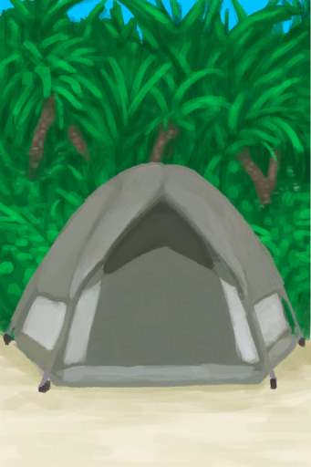

# Tent  
> "Provides me with a place to sleep  
  
<table class="table table-bordered" data-toggle="table"  data-show-header="false"><thead style="display:none"><tr ><th  style="width:50%;text-align:left;vertical-align:top;"  >title</th><th  style="width:50%;text-align:left;vertical-align:top;"  ></th></tr></thead><tr ><td  style="width:50%;text-align:left;vertical-align:top;"  >** Unique On Board **  ** Cannot Be Trashed **  **Slots：**11  **WeightCapacity：**2000  ** Effect: ** [

[Rain Protection](RainProtection.md)](RainProtection.md)<b>+5</b> [

[Sun Strength](SunStrength.md)](SunStrength.md)<b>-5</b> [

[Cold Insulation](InsulationCold.md)](InsulationCold.md)<b>+5</b> [

[Bug Population](BugPopulation.md)](BugPopulation.md)<b>-1</b></td><td  style="width:50%;text-align:left;vertical-align:top;"  >

<a href="TentDeployed.md" style="color:black">Tent</a>

</td></tr></tbody></table>  
  
## Got From  

Set Up Tent

[Packed Tent](TentPacked.md)

  
  
## Action  

<table><tr><td rowspan="2" style="width:200px;text-align:center;font-size:1.3em;font-weight:bold">

Nap

4h

</td><td>[“SleepAction(Group)”](SleepAction.md)</td></tr><tr><td></td></tr><tr><td colspan="2"><b>Require：</b>**不能处于以下状态**：, [Sleep Interrupt](SleepInterrupt.md): <b>1-1</b>, [

[Hydration ](Hydration.md)](Hydration.md): <b>0-30</b>, [

[Hyperthermia](Hyperthermia.md)](Hyperthermia.md): <b>51-200</b>, [

[Hypothermia](Hypothermia.md)](Hypothermia.md): <b>26-100</b>, [

[Blood Pressure](Blood.md)](Blood.md): <b>0-30</b>, [

[Nausea](Nausea.md)](Nausea.md): <b>20-24</b>, [

[Weight](Weight.md)](Weight.md): <b>0-74</b></td></tr><tr><td colspan="2"><b>StatChange：</b>[Sleep Interrupt](SleepInterrupt.md)<b>-1</b>, [Sleep Clock](SleepClock.md)<b>+15</b>, [

[Stress](Stress.md)](Stress.md)<b>-1.5</b> (/TP), [

[Mental Structure](Structure.md)](Structure.md)<b>+1</b> (/TP), [

[Morale](Morale.md)](Morale.md)<b>+1.25</b> (/TP), [

[Nausea](Nausea.md)](Nausea.md)<b>-1.5</b> (/TP), [

[Wakefulness](Wakefulness.md)](Wakefulness.md)<b>+6</b> (/TP), [

[Back Pain](BackPain.md)](BackPain.md)<b>+4</b> (/TP)</td></tr></table>
  

<table><tr><td rowspan="2" style="width:200px;text-align:center;font-size:1.3em;font-weight:bold">

Sleep

8h

</td><td>[“SleepAction(Group)”](SleepAction.md)</td></tr><tr><td></td></tr><tr><td colspan="2"><b>Require：</b>**不能处于以下状态**：, [Sleep Interrupt](SleepInterrupt.md): <b>1-1</b>, [

[Hydration ](Hydration.md)](Hydration.md): <b>0-30</b>, [

[Hyperthermia](Hyperthermia.md)](Hyperthermia.md): <b>51-200</b>, [

[Hypothermia](Hypothermia.md)](Hypothermia.md): <b>26-100</b>, [

[Blood Pressure](Blood.md)](Blood.md): <b>0-30</b>, [

[Nausea](Nausea.md)](Nausea.md): <b>20-24</b>, [

[Weight](Weight.md)](Weight.md): <b>0-74</b></td></tr><tr><td colspan="2"><b>StatChange：</b>[Sleep Interrupt](SleepInterrupt.md)<b>-1</b>, [Sleep Clock](SleepClock.md)<b>+31</b>, [

[Stress](Stress.md)](Stress.md)<b>-1</b> (/TP), [

[Mental Structure](Structure.md)](Structure.md)<b>+2</b> (/TP), [

[Morale](Morale.md)](Morale.md)<b>+1.25</b> (/TP), [

[Nausea](Nausea.md)](Nausea.md)<b>-1.5</b> (/TP), [

[Wakefulness](Wakefulness.md)](Wakefulness.md)<b>+6</b> (/TP), [

[Back Pain](BackPain.md)](BackPain.md)<b>+4</b> (/TP)</td></tr></table>
  

<table><tr><td rowspan="2" style="width:200px;text-align:center;font-size:1.3em;font-weight:bold">

Dismantle

45m

</td><td></td></tr><tr><td><b>Self：</b>→ [

[Packed Tent](TentPacked.md)](TentPacked.md)</td></tr><tr><td colspan="2"><b>Require：</b>[

[Light](Light.md)](Light.md): <b>10-100</b></td></tr></table>
  
  
  
## Drag With  

<table style="margin-bottom:0px;"><tr><td style="width:40%;text-align:left; background-color:#FEFEFE"><b>With：</b>[“Cutter”](tag_Cutter.md)</td><td style="width:40%;font-size:1em;font-weight:bold;background-color:#FEFEFE">Scavenge for Plastic (1h) </td></tr><tr><td colspan="2"><b>Require：</b>[

[Light](Light.md)](Light.md): <b>10-100</b></td></tr><tr style="background-color:#FFFFFF"><td style=""><b>Receiving：</b>Usage  <b>-1～+0(-0.67%～0%)</b></td><td style=""><b>Self：</b>→Dismiss</td></tr><tr><td colspan="2">[

[Plastic Sheet](PlasticSheet.md)](PlasticSheet.md)(<b>+2</b>)</td></tr></table>
  
  

