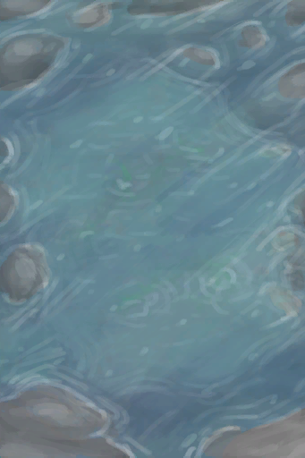
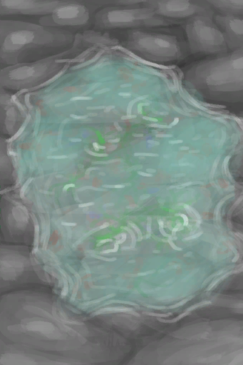

# Flooded Tide Pool  
> Can be foraged for food when the tides are low.  
  
<table class="table table-bordered" data-toggle="table"  data-show-header="false"><thead style="display:none"><tr ><th  style="width:50%;text-align:left;vertical-align:top;"  >title</th><th  style="width:50%;text-align:left;vertical-align:top;"  ></th></tr></thead><tr ><td  style="width:50%;text-align:left;vertical-align:top;"  >** DoseNotPile **  **Environment：**[Rocks(Environment)](Env_Rocks.md)  **Weight：**2500  **Usage：**6  ** Effect: ** [

[Discomfort](Discomfort.md)](Discomfort.md)<b>+100</b></td><td  style="width:50%;text-align:left;vertical-align:top;"  >

<a href="TidePoolFlooded.md" style="color:black">Flooded Tide Pool</a>

"On <b>Rocky Beaches</b></td></tr></tbody></table>  
  
## Got From  

Flood

[Tide Pool(Rocks)](TidePool.md)

探索

[Bird Rock](BirdRock.md)

探索

[Desolate Beach](DesolateBeach.md)

探索

[Rocks](Rocks.md)

  
  
## Action  

<table><tr><td rowspan="2" style="width:200px;text-align:center;font-size:1.3em;font-weight:bold">

Wash yourself

15m

</td><td>[“HandAction(Group)”](HandAction.md)</td></tr><tr><td></td></tr><tr><td colspan="2"><b>CardChanges：</b>装备中的[“Legs (Inner)”](tag_Clothing.md)

  <b>+12(100%)</b>, 所有[Cobra Spit](W_CobraSpit.md)Fuel  <b>-75</b></td></tr><tr><td colspan="2"><b>StatChange：</b>[

[Wetness](Wetness.md)](Wetness.md)<b>+100</b> (/TP), [

[Morale](Morale.md)](Morale.md)<b>+1</b>, [

[Filth](Filth.md)](Filth.md)<b>-150</b>, [

[Mud Protection](MudProtection.md)](MudProtection.md)<b>-50</b>, [

[Aloe Gel Protection](AloeVeraGelProtection.md)](AloeVeraGelProtection.md)<b>-50</b>, [

[Bug Repellent](BugRepellentApplied.md)](BugRepellentApplied.md)<b>-50</b>, [

[Sun Protection](SunProtection.md)](SunProtection.md)<b>-50</b></td></tr></table>
  

<table><tr><td rowspan="2" style="width:200px;text-align:center;font-size:1.3em;font-weight:bold">

Drink

</td><td></td></tr><tr><td></td></tr><tr><td colspan="2"><b>Require：</b>[if Kidneys](IfKidneys.md): <b>1-1</b></td></tr><tr><td colspan="2"><b>StatChange：</b>[

[Hydration ](Hydration.md)](Hydration.md)<b>+40</b>, [

[Sodium](Sodium.md)](Sodium.md)<b>+250</b></td></tr></table>
  
  
  
## Drag With  
  
## Drag To  

[Mermaid nest](MermaidNest.md)

  
  
## Durability   

<table style="margin-bottom:0px;"><tr><td style="width:30%;text-align:left; background-color:#FEFEFE;font-size:1.3em;font-weight:bold;">Food</td><td style="font-size:1em;background-color:#FEFEFE">Starting：6 , Max：6 -</td></tr><tr style="background-color:#FFFFFF"><td colspan=2></td></tr></table>
  
## Trigger by Status  
<table class="table table-bordered" data-toggle="table"  ><thead style=""><tr ><th  style="text-align:left;vertical-align:top;"  >Name</th><th  style="text-align:left;vertical-align:top;"  >Condition</th><th  style="text-align:left;vertical-align:top;"  >Change</th></tr></thead><tr ><td  style="text-align:left;vertical-align:top;"  >Unflood</td><td  style="text-align:left;vertical-align:top;"  >[Tides](Tides.md): <b>0-0</b></td><td  style="text-align:left;vertical-align:top;"  >→ [

[Tide Pool(Rocks)](TidePool.md)](TidePool.md) Usage  <b>+1～+3</b></td></tr></tbody></table>  
  

