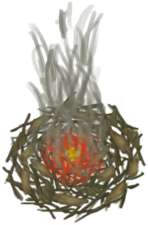

# Lit Tinder  
> Should place it in a campfire to light it.  
  
<table class="table table-bordered" data-toggle="table"  data-show-header="false"><thead style="display:none"><tr ><th  style="width:50%;text-align:left;vertical-align:top;"  >title</th><th  style="width:50%;text-align:left;vertical-align:top;"  ></th></tr></thead><tr ><td  style="width:50%;text-align:left;vertical-align:top;"  >**Weight：**25  **Tag：**	[“Fire Source”](tag_FireSource.md)</td><td  style="width:50%;text-align:left;vertical-align:top;"  >

<a href="TinderLit.md" style="color:black">Lit Tinder</a>

</td></tr></tbody></table>  
  
## Got From  

** With：**[“Tinder”](tag_Tinder.md)Light Tinder

[Alembic(On)](AlembicOn.md)

** With：**[“Tinder”](tag_Tinder.md)Light Tinder

[Campfire](Campfire.md)

** With：**[“Tinder”](tag_Tinder.md)Light Tinder

[Clay Fire Pit](ClayFirePit.md)

** With：**[“Tinder”](tag_Tinder.md)Light Tinder

[Fire](Fire.md)

** With：**[“Tinder”](tag_Tinder.md)Light Tinder

[Forge](Forge.md)

** With：**[“Tinder”](tag_Tinder.md)Light Tinder

[Gas Cooker(On)](GasCookerOn.md)

** With：**[“Tinder”](tag_Tinder.md)Light Tinder

[Kiln](Kiln.md)

** With：**[“Tinder”](tag_Tinder.md)Light Tinder

[Advanced Kiln](KilnAdvanced.md)

** With：**[“Tinder”](tag_Tinder.md)Light Tinder

[Stove](Stove.md)

** With：**[“Tinder”](tag_Tinder.md)Light Tinder

[Embers](Embers.md)

** With：**[Hand Drill](HandDrill.md)Light with Hand Drill

[Feathers](Feathers.md)

** With：**[Bow Drill](BowDrill.md)Light with Bow Drill

[Feathers](Feathers.md)

** With：**[“Fire Source”](tag_FireSource.md)Light Tinder

[Feathers](Feathers.md)

** With：**[Hand Drill](HandDrill.md)Light with Hand Drill

[Fibers](Fibers.md)

** With：**[Bow Drill](BowDrill.md)Light with Bow Drill

[Fibers](Fibers.md)

** With：**[“Fire Source”](tag_FireSource.md)Light Tinder

[Fibers](Fibers.md)

** With：**[Signaling Mirror](SignalingMirror.md) , [Glasses](Glasses.md)Light Tinder

[Fibers](Fibers.md)

** With：**[Hand Drill](HandDrill.md)Light with Hand Drill

[Dry Leaves](LeavesDry.md)

** With：**[Bow Drill](BowDrill.md)Light with Bow Drill

[Dry Leaves](LeavesDry.md)

** With：**[“Fire Source”](tag_FireSource.md)Light Tinder

[Dry Leaves](LeavesDry.md)

** With：**[Signaling Mirror](SignalingMirror.md) , [Glasses](Glasses.md)Light Tinder

[Dry Leaves](LeavesDry.md)

** With：**[Hand Drill](HandDrill.md)Light with Hand Drill

[Nest](Nest.md)

** With：**[Bow Drill](BowDrill.md)Light with Bow Drill

[Nest](Nest.md)

** With：**[“Fire Source”](tag_FireSource.md)Light Tinder

[Nest](Nest.md)

** With：**[Signaling Mirror](SignalingMirror.md) , [Glasses](Glasses.md)Light Tinder

[Nest](Nest.md)

** With：**[Hand Drill](HandDrill.md)Light with Hand Drill

[Papers](Papers.md)

** With：**[Bow Drill](BowDrill.md)Light with Bow Drill

[Papers](Papers.md)

** With：**[“Fire Source”](tag_FireSource.md)Light Tinder

[Papers](Papers.md)

** With：**[Signaling Mirror](SignalingMirror.md) , [Glasses](Glasses.md)Light Tinder

[Papers](Papers.md)

** With：**[“Tinder”](tag_Tinder.md)Light Tinder

[Hand Drill](FirePlow.md)(未实装)

** With：**[Hand Drill](HandDrill.md)Light with Hand Drill

[Wood Shavings](WoodShavings.md)

** With：**[Bow Drill](BowDrill.md)Light with Bow Drill

[Wood Shavings](WoodShavings.md)

** With：**[“Fire Source”](tag_FireSource.md)Light Tinder

[Wood Shavings](WoodShavings.md)

** With：**[Signaling Mirror](SignalingMirror.md) , [Glasses](Glasses.md)Light Tinder

[Wood Shavings](WoodShavings.md)

  
  
## Drag To  

[Alembic(Off)](AlembicOff.md)

[Campfire(Off)](CampfireExtinguished.md)

[Clay Fire Pit(Off)](ClayFirePitExtinguished.md)

[Fire(Off)](FireExtinguished.md)

[Forge(Off)](ForgeExtinguished.md)

[Advanced Kiln(Off)](KilnAdvancedExtinguished.md)

[Kiln(Off)](KilnExtinguished.md)

[Stove(Off)](StoveExtinguished.md)

[Smoker](Smoker.md)

[Smoker(Off)](SmokerExtinguished.md)

[Smoker](SmokerExtinguishedPlastic.md)

[Smoker](SmokerPlastic.md)

[Feathers](Feathers.md)

[Fibers](Fibers.md)

[Dry Leaves](LeavesDry.md)

[Nest](Nest.md)

[Papers](Papers.md)

[Bee Smoker(Off)](BeeSmokerOff.md)

[Citronella Candle(Off)](CandleCitronellaOff.md)

[Jasmine Candle(Off)](CandleJasmineOff.md)

[Candle(Off)](CandleOff.md)

[Dynamite(Off)](DynamiteOff.md)

[Torch(Off)](TorchOff.md)

[Wood Shavings](WoodShavings.md)

  
  
## Durability   

<table style="margin-bottom:0px;"><tr><td style="width:30%;text-align:left; background-color:#FEFEFE;font-size:1.3em;font-weight:bold;">Fuel</td><td style="font-size:1em;background-color:#FEFEFE">Starting：6 -1/TP , Duration ：1h30m</td></tr><tr style="background-color:#FFFFFF"><td colspan=2>** On Zero： ** Self: →Dismiss</td></tr></table>
  

