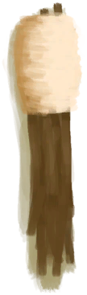
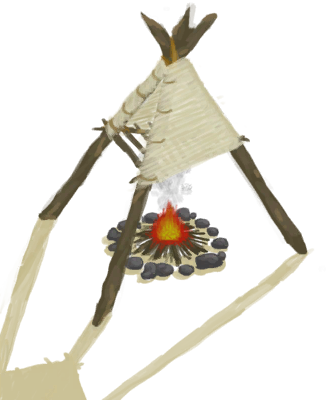

# Torch  
> A portable source of light.  
  
<table class="table table-bordered" data-toggle="table"  data-show-header="false"><thead style="display:none"><tr ><th  style="width:50%;text-align:left;vertical-align:top;"  >title</th><th  style="width:50%;text-align:left;vertical-align:top;"  ></th></tr></thead><tr ><td  style="width:50%;text-align:left;vertical-align:top;"  >**Weight：**150</td><td  style="width:50%;text-align:left;vertical-align:top;"  >

<a href="TorchOff.md" style="color:black">Torch</a>

"For travelling at night or exploring dark caves</td></tr></tbody></table>  
  
## Got From  

Craft BluePrint

[Torch(BluePrint)](Bp_Torch.md)

Extinguish

[Torch(On)](TorchOn.md)

  
  
## Drag With  

<table style="margin-bottom:0px;"><tr><td style="width:40%;text-align:left; background-color:#FEFEFE"><b>With：</b>[

[Lit Tinder](TinderLit.md)](TinderLit.md) | [

[Campfire](Campfire.md)](Campfire.md) | [

[Stove](Stove.md)](Stove.md) | [

[Smoker](Smoker.md)](Smoker.md) | [

[Gas Cooker(On)](GasCookerOn.md)](GasCookerOn.md) | [

[Burning Flare(On)](FlareHandOn.md)](FlareHandOn.md)</td><td style="width:40%;font-size:1em;font-weight:bold;background-color:#FEFEFE">Light  </td></tr><tr style="background-color:#FFFFFF"><td style=""><b>Receiving：</b></td><td style=""><b>Self：</b>→ [

[Torch(On)](TorchOn.md)](TorchOn.md)</td></tr></table>
  
  
## Durability   

<table style="margin-bottom:0px;"><tr><td style="width:30%;text-align:left; background-color:#FEFEFE;font-size:1.3em;font-weight:bold;">Fuel</td><td style="font-size:1em;background-color:#FEFEFE">Starting：16 , Max：16 -</td></tr><tr style="background-color:#FFFFFF"><td colspan=2>** On Zero： ** Self: →Dismiss</td></tr></table>
  

