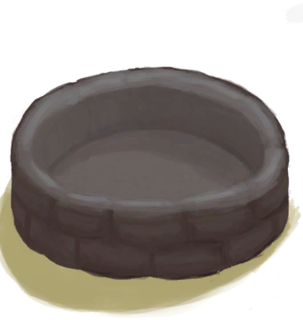
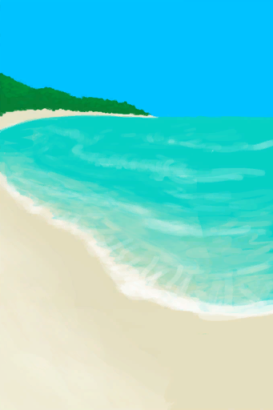
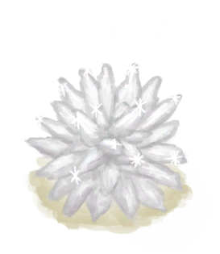
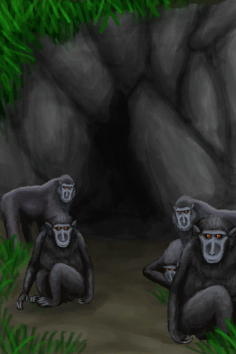

## Tourist  

<table style="margin-bottom:0px;"><tr><td rowspan=2 style="width:160px"></td><td style="font-size:1.8em"><b>Tourist</b></td><td style="width:50%">UnlockPrice：1🌙</td></tr><tr><td  colspan=2 style=""><i>"It was supposed to be the perfect holiday... but your plane had to crash in the middle of nowhere.

You are short sighted</i></td><tr><td colspan=2><b>Environment：</b>[

[Beach](Beach.md)](Beach.md)<td colspan=1><b>Weather：</b>[

[Clear](TropicalIsland_ClearStart.md)](TropicalIsland_ClearStart.md)</tr></tr><tr><td colspan=3><b>Perks：</b>

[Plane Crash](Pk_1_PlaneCrash.md)

[Tourist](Pk_2_Tourist.md)

[Obese](Pk_3_Obese.md)

[Gluttonous](Pk_4_Gluttonous.md)

[Bleeding](Pk_3_BleedingWound.md)

[Pale Skin](Pk_3_PaleSkin.md)

[Weak Immune System](Pk_4_ImmuneSystemWeak.md)

[Bug Attractant](Pk_4_BugAttractant.md)

[Shortsighted](Pk_3_Shortsighted.md)

[Fisher](Pk_5_Fisher.md)

[Macaque Curse](Pk_1_MacaqueCurse.md)

  
  
</tr><tr><td colspan=3><b>Clothes：</b> 

<a href="T-Shirt.md" style="color:black">T-Shirt</a>

<a href="Socks.md" style="color:black">Socks</a>

<a href="Underwear.md" style="color:black">Underwear</a>

<a href="Shorts.md" style="color:black">Shorts</a>

  
  
</tr><tr><td colspan=3><b>Starting Cards：</b> 

<a href="Trunk.md" style="color:black">Storage Trunk</a>

<a href="SeatAttached.md" style="color:black">Seatx6</a>

<a href="LuggageA.md" style="color:black">Luggage</a>

<a href="LuggageC.md" style="color:black">Luggage</a>

<a href="JerrycanFuel.md" style="color:black">Fuel Jerrycan</a>

<a href="SafetyKnife.md" style="color:black">Safety Knife</a>

<a href="FirstAidKitPlane.md" style="color:black">First Aid Kit</a>

<a href="Painkillers.md" style="color:black">Painkillers</a>

<a href="Antibiotics.md" style="color:black">Antibiotics</a>

<a href="WoundDressing.md" style="color:black">Wound Dressingx2</a>

<a href="Socks.md" style="color:black">Socksx5</a>

<a href="Underwear.md" style="color:black">Underwearx2</a>

<a href="Shorts.md" style="color:black">Shortsx2</a>

<a href="T-Shirt.md" style="color:black">T-Shirtx3</a>

<a href="Sneakers.md" style="color:black">Sneakers</a>

<a href="Papers.md" style="color:black">Papersx7</a>

<a href="Glasses.md" style="color:black">Glassesx2</a>

<a href="Chocolate.md" style="color:black">Chocolatex4</a>

<a href="BackpackTourist.md" style="color:black">Backpack</a>

<a href="HawaiianShirt.md" style="color:black">Hawaiian Shirt</a>

<a href="Flipflops.md" style="color:black">Flipflops</a>

<a href="SunScreen.md" style="color:black">Sun Screen</a>

<a href="ChickenSandwich.md" style="color:black">Chicken Sandwich</a>

<a href="PlasticBottleFull.md" style="color:black">Plastic Bottle</a>

<a href="W_ArmLacerationR.md" style="color:black">Arm Laceration</a>

<a href="Event_IntroTourist1.md" style="color:black">Plane Crash</a>

<a href="Camera.md" style="color:black">Camera</a>

<a href="BeltBag.md" style="color:black">Belt Bag</a>

<a href="W_Abrasion.md" style="color:black">Abrasionx2</a>

<a href="Passport.md" style="color:black">Passport</a>

  
  
</tr><tr><td colspan=3><b>初始蓝图：</b> 

<a href="Bp_FishingLine.md" style="color:black">Fishing Line</a>

<a href="Bp_FishingRod.md" style="color:black">Fishing Rod</a>

<a href="Bp_FishBait.md" style="color:black">Fish Bait</a>

<a href="Bp_Tourniquet.md" style="color:black">Tourniquet</a>

  
  
</tr></table>
    
  
## 目标  

<b>PRIORITIES</b>

<table style="margin-bottom:0px;"><tr><td rowSpan=3 style="width:50px;max-height:100px;text-align:center;vertical-align:top"></td><td colspan=2 >
<b>Take Painkillers</b>
<i>To stay sane and in control.</i></td></tr><tr style=""><td><b>Require：</b>Take [

[Painkillers](Painkillers.md)](Painkillers.md) </td></tr><tr style=""><td ><b>Reward：</b>[

[Stress](Stress.md)](Stress.md)<b>-48</b>&nbsp;&nbsp;&nbsp;&nbsp;[Holiday Satisfaction](HolidaySatisfaction.md)<b>+100</b></td></tr><tr style="border-bottom:2px solid #CCC;height:1px;"></tr><tr><td rowSpan=3 style="width:50px;max-height:100px;text-align:center;vertical-align:top"></td><td colspan=2 >
<b>Craft a Tourniquet</b>
<i>To stop your bloodloss.</i></td></tr><tr style=""><td><b>Require：</b>[

[Improvised Tourniquet](TourniquetRustic.md)](TourniquetRustic.md)x1&nbsp;&nbsp;&nbsp;&nbsp;[

[Tourniquet](Tourniquet.md)](Tourniquet.md)x1 </td></tr><tr style=""><td ><b>Reward：</b>[

[Stress](Stress.md)](Stress.md)<b>-48</b>&nbsp;&nbsp;&nbsp;&nbsp;[Holiday Satisfaction](HolidaySatisfaction.md)<b>+100</b></td></tr><tr style="border-bottom:2px solid #CCC;height:1px;"></tr><tr><td rowSpan=3 style="width:50px;max-height:100px;text-align:center;vertical-align:top"></td><td colspan=2 >
<b>Eat a Chicken Sandwitch</b>
<i>To fill your stomach and clear your mind.</i></td></tr><tr style=""><td><b>Require：</b>Eat [

[Chicken Sandwich](ChickenSandwich.md)](ChickenSandwich.md) </td></tr><tr style=""><td ><b>Reward：</b>[

[Stress](Stress.md)](Stress.md)<b>-48</b>&nbsp;&nbsp;&nbsp;&nbsp;[Holiday Satisfaction](HolidaySatisfaction.md)<b>+100</b></td></tr><tr style="border-bottom:2px solid #CCC;height:1px;"></tr></table>
 
<b>HYDRATION</b>

<table style="margin-bottom:0px;"><tr><td rowSpan=3 style="width:50px;max-height:100px;text-align:center;vertical-align:top"></td><td colspan=2 >
<b>Find a Puddle</b>
<i>To use as an emergency source of water.</i></td></tr><tr style=""><td><b>Require：</b>[

[Dry Puddle(Wetlands)](Puddle.md)](Puddle.md)x1 </td></tr><tr style=""><td ><b>Reward：</b>[

[Determination](Determination.md)](Determination.md)<b>+250</b>&nbsp;&nbsp;&nbsp;&nbsp;[

[Stress](Stress.md)](Stress.md)<b>-48</b></td></tr><tr style="border-bottom:2px solid #CCC;height:1px;"></tr><tr><td rowSpan=3 style="width:50px;max-height:100px;text-align:center;vertical-align:top"></td><td colspan=2 >
<b>Boil some Water</b>
<i>To purify it and make sure you don't get sick.</i></td></tr><tr style=""><td><b>Require：</b>[

[Boiling Water](LQ_WaterBoiling.md)](LQ_WaterBoiling.md)x1 </td></tr><tr style=""><td ><b>Reward：</b>[

[Stress](Stress.md)](Stress.md)<b>-48</b>&nbsp;&nbsp;&nbsp;&nbsp;[Holiday Satisfaction](HolidaySatisfaction.md)<b>+100</b></td></tr><tr style="border-bottom:2px solid #CCC;height:1px;"></tr><tr><td rowSpan=3 style="width:50px;max-height:100px;text-align:center;vertical-align:top"></td><td colspan=2 >
<b>Make some Clay Bowls</b>
<i>To use as extra water containers.</i></td></tr><tr style=""><td><b>Require：</b>[

[Clay Bowl](ClayBowl.md)](ClayBowl.md)x1 </td></tr><tr style=""><td ><b>Reward：</b>[

[Stress](Stress.md)](Stress.md)<b>-48</b>&nbsp;&nbsp;&nbsp;&nbsp;[Holiday Satisfaction](HolidaySatisfaction.md)<b>+100</b></td></tr><tr style="border-bottom:2px solid #CCC;height:1px;"></tr></table>
 
<b>SECURING SURVIVAL</b>

<table style="margin-bottom:0px;"><tr><td rowSpan=3 style="width:50px;max-height:100px;text-align:center;vertical-align:top"></td><td colspan=2 >
<b>Make some Sago Flour</b>
<i>That should keep me from starving for some time.</i></td></tr><tr style=""><td><b>Require：</b>[

[Sago Flour](SagoFlour.md)](SagoFlour.md)x1 </td></tr><tr style=""><td ><b>Reward：</b>[

[Stress](Stress.md)](Stress.md)<b>-48</b>&nbsp;&nbsp;&nbsp;&nbsp;[Holiday Satisfaction](HolidaySatisfaction.md)<b>+100</b></td></tr><tr style="border-bottom:2px solid #CCC;height:1px;"></tr><tr><td rowSpan=3 style="width:50px;max-height:100px;text-align:center;vertical-align:top"></td><td colspan=2 >
<b>Build a Stove</b>
<i>To cook proper meals without cooking yourself.</i></td></tr><tr style=""><td><b>Require：</b>[

[Stove(Off)](StoveExtinguished.md)](StoveExtinguished.md)x1 </td></tr><tr style=""><td ><b>Reward：</b>[

[Stress](Stress.md)](Stress.md)<b>-48</b>&nbsp;&nbsp;&nbsp;&nbsp;[Holiday Satisfaction](HolidaySatisfaction.md)<b>+100</b></td></tr><tr style="border-bottom:2px solid #CCC;height:1px;"></tr><tr><td rowSpan=3 style="width:50px;max-height:100px;text-align:center;vertical-align:top"></td><td colspan=2 >
<b>Build a Water Reservoir</b>
<i>In case I get unlucky with the rain.</i></td></tr><tr style=""><td><b>Require：</b>[

[Reservoir](WaterReservoir.md)](WaterReservoir.md)x1 </td></tr><tr style=""><td ><b>Reward：</b>[

[Stress](Stress.md)](Stress.md)<b>-48</b>&nbsp;&nbsp;&nbsp;&nbsp;[Holiday Satisfaction](HolidaySatisfaction.md)<b>+100</b></td></tr><tr style="border-bottom:2px solid #CCC;height:1px;"></tr></table>
 
<b>HOLIDAYS MUST GO ON!</b>

<table style="margin-bottom:0px;"><tr><td rowSpan=3 style="width:50px;max-height:100px;text-align:center;vertical-align:top"></td><td colspan=2 >
<b>Holidays must go on!</b>
<i>Don't let this small incident ruin your holidays. Let's have some fun!</i></td></tr><tr style=""></tr><tr style="border-bottom:2px solid #CCC;height:1px;"></tr><tr><td rowSpan=3 style="width:50px;max-height:100px;text-align:center;vertical-align:top"></td><td colspan=2 >
<b>DIY Resort</b>
</td></tr><tr style=""><td>
<table style="margin-bottom:0px;"><tr><td rowSpan=3 style="width:50px;max-height:100px;text-align:center;vertical-align:top"></td><td colspan=2 >
<b>Remove the Plane Seats</b>
<i>To free up some space and get useful materials.</i></td></tr><tr style=""><td><b>Require：</b>Detach [

[Seat](SeatAttached.md)](SeatAttached.md) </td></tr><tr style=""><td ><b>Reward：</b>[

[Stress](Stress.md)](Stress.md)<b>-48</b>&nbsp;&nbsp;&nbsp;&nbsp;[Holiday Satisfaction](HolidaySatisfaction.md)<b>+100</b></td></tr><tr style="border-bottom:2px solid #CCC;height:1px;"></tr><tr><td rowSpan=3 style="width:50px;max-height:100px;text-align:center;vertical-align:top"></td><td colspan=2 >
<b>Build a Hammock</b>
<i>To get some proper vacational rest.</i></td></tr><tr style=""><td><b>Require：</b>[

[Hammock](Hammock.md)](Hammock.md)x1 </td></tr><tr style=""><td ><b>Reward：</b>[

[Stress](Stress.md)](Stress.md)<b>-48</b>&nbsp;&nbsp;&nbsp;&nbsp;[Holiday Satisfaction](HolidaySatisfaction.md)<b>+100</b></td></tr><tr style="border-bottom:2px solid #CCC;height:1px;"></tr><tr><td rowSpan=3 style="width:50px;max-height:100px;text-align:center;vertical-align:top"></td><td colspan=2 >
<b>Build a Door</b>
<i>Because macaques aren't accepted in this hotel.</i></td></tr><tr style=""><td><b>Require：</b>[

[Door](Imp_Door.md)](Imp_Door.md)x1 </td></tr><tr style=""><td ><b>Reward：</b>[

[Stress](Stress.md)](Stress.md)<b>-48</b>&nbsp;&nbsp;&nbsp;&nbsp;[Holiday Satisfaction](HolidaySatisfaction.md)<b>+100</b></td></tr><tr style="border-bottom:2px solid #CCC;height:1px;"></tr></table>
  </td></tr><tr style=""><td ><b>Reward：</b>[

[Stress](Stress.md)](Stress.md)<b>-48</b>&nbsp;&nbsp;&nbsp;&nbsp;[Holiday Satisfaction](HolidaySatisfaction.md)<b>+100</b></td></tr><tr style="border-bottom:2px solid #CCC;height:1px;"></tr><tr><td rowSpan=3 style="width:50px;max-height:100px;text-align:center;vertical-align:top"></td><td colspan=2 >
<b>Party Time!</b>
</td></tr><tr style=""><td>
<table style="margin-bottom:0px;"><tr><td rowSpan=3 style="width:50px;max-height:100px;text-align:center;vertical-align:top"></td><td colspan=2 >
<b>Make a Macaque Friend</b>
<i>Some of them seem alright. Only some though!</i></td></tr><tr style=""><td><b>Require：</b>[

[Macaque Friend](MacaqueFriend.md)](MacaqueFriend.md)x1 </td></tr><tr style=""><td ><b>Reward：</b>[

[Stress](Stress.md)](Stress.md)<b>-48</b>&nbsp;&nbsp;&nbsp;&nbsp;[Holiday Satisfaction](HolidaySatisfaction.md)<b>+100</b></td></tr><tr style="border-bottom:2px solid #CCC;height:1px;"></tr><tr><td rowSpan=3 style="width:50px;max-height:100px;text-align:center;vertical-align:top"></td><td colspan=2 >
<b>Get Horribly drunk!</b>
<i>Oh yeah!!!</i></td></tr><tr style=""><td><b>Require：</b>[

[Alcohol](Alcohol.md)](Alcohol.md): <b>49～70</b> </td></tr><tr style=""><td ><b>Reward：</b>[

[Stress](Stress.md)](Stress.md)<b>-48</b>&nbsp;&nbsp;&nbsp;&nbsp;[Holiday Satisfaction](HolidaySatisfaction.md)<b>+100</b></td></tr><tr style="border-bottom:2px solid #CCC;height:1px;"></tr><tr><td rowSpan=3 style="width:50px;max-height:100px;text-align:center;vertical-align:top"></td><td colspan=2 >
<b>Play the Drums!</b>
<i>Something intense to annoy the neighbours!</i></td></tr><tr style=""><td><b>Require：</b>Intense Rhythm [

[Drum](Drum.md)](Drum.md) </td></tr><tr style=""><td ><b>Reward：</b>[

[Stress](Stress.md)](Stress.md)<b>-48</b>&nbsp;&nbsp;&nbsp;&nbsp;[Holiday Satisfaction](HolidaySatisfaction.md)<b>+100</b></td></tr><tr style="border-bottom:2px solid #CCC;height:1px;"></tr></table>
  </td></tr><tr style=""><td ><b>Reward：</b>[

[Stress](Stress.md)](Stress.md)<b>-48</b>&nbsp;&nbsp;&nbsp;&nbsp;[Holiday Satisfaction](HolidaySatisfaction.md)<b>+100</b></td></tr><tr style="border-bottom:2px solid #CCC;height:1px;"></tr><tr><td rowSpan=3 style="width:50px;max-height:100px;text-align:center;vertical-align:top"></td><td colspan=2 >
<b>A Holiday to Remember!</b>
</td></tr><tr style=""><td>
<table style="margin-bottom:0px;"><tr><td rowSpan=3 style="width:50px;max-height:100px;text-align:center;vertical-align:top"></td><td colspan=2 >
<b>Take some Cool Pictures</b>
<i>To store some memories for ever!</i></td></tr><tr style=""><td>
<table style="margin-bottom:0px;"><tr><td rowSpan=3 style="width:50px;max-height:100px;text-align:center;vertical-align:top"></td><td colspan=2 >
<b>A Beautiful Beach</b>
<i>I'll be the envy of everyone at home.</i></td></tr><tr style=""><td><b>Require：</b>Take Picture! [

[Beach](Beach.md)](Beach.md)&nbsp;&nbsp;&nbsp;&nbsp;Take Picture! [

[Bay](Bay.md)](Bay.md) </td></tr><tr style=""><td ><b>Reward：</b>[

[Stress](Stress.md)](Stress.md)<b>-48</b>&nbsp;&nbsp;&nbsp;&nbsp;[Holiday Satisfaction](HolidaySatisfaction.md)<b>+100</b></td></tr><tr style="border-bottom:2px solid #CCC;height:1px;"></tr><tr><td rowSpan=3 style="width:50px;max-height:100px;text-align:center;vertical-align:top"></td><td colspan=2 >
<b>A Dangerous Animal</b>
<i>It'll make me look good!</i></td></tr><tr style=""><td><b>Require：</b>Take Picture! [

[A Monitor Lizard!(Event)(Cave)](Event_MonitorFight.md)](Event_MonitorFight.md) </td></tr><tr style=""><td ><b>Reward：</b>[

[Stress](Stress.md)](Stress.md)<b>-48</b>&nbsp;&nbsp;&nbsp;&nbsp;[Holiday Satisfaction](HolidaySatisfaction.md)<b>+100</b></td></tr><tr style="border-bottom:2px solid #CCC;height:1px;"></tr><tr><td rowSpan=3 style="width:50px;max-height:100px;text-align:center;vertical-align:top"></td><td colspan=2 >
<b>A Real Friend</b>
<i>Not like those mean guys at home.</i></td></tr><tr style=""><td><b>Require：</b>Take Picture! [

[Weston](Weston.md)](Weston.md) </td></tr><tr style=""><td ><b>Reward：</b>[

[Stress](Stress.md)](Stress.md)<b>-48</b>&nbsp;&nbsp;&nbsp;&nbsp;[Holiday Satisfaction](HolidaySatisfaction.md)<b>+100</b></td></tr><tr style="border-bottom:2px solid #CCC;height:1px;"></tr></table>
  </td></tr><tr style=""><td ><b>Reward：</b>[

[Stress](Stress.md)](Stress.md)<b>-48</b>&nbsp;&nbsp;&nbsp;&nbsp;[Holiday Satisfaction](HolidaySatisfaction.md)<b>+100</b></td></tr><tr style="border-bottom:2px solid #CCC;height:1px;"></tr><tr><td rowSpan=3 style="width:50px;max-height:100px;text-align:center;vertical-align:top"></td><td colspan=2 >
<b>Collect some Souvenirs</b>
<i>Another nice way to keep memories from fading.</i></td></tr><tr style=""><td>
<table style="margin-bottom:0px;"><tr><td rowSpan=3 style="width:50px;max-height:100px;text-align:center;vertical-align:top"></td><td colspan=2 >
<b>Calcite Crystal</b>
<i>A very cool rock!</i></td></tr><tr style=""><td><b>Require：</b>[

[Calcite Crystal](Calcite.md)](Calcite.md)x1 </td></tr><tr style=""><td ><b>Reward：</b>[

[Stress](Stress.md)](Stress.md)<b>-48</b>&nbsp;&nbsp;&nbsp;&nbsp;[Holiday Satisfaction](HolidaySatisfaction.md)<b>+100</b></td></tr><tr style="border-bottom:2px solid #CCC;height:1px;"></tr><tr><td rowSpan=3 style="width:50px;max-height:100px;text-align:center;vertical-align:top"></td><td colspan=2 >
<b>A piece of Coral</b>
<i>Straight from the sea!</i></td></tr><tr style=""><td><b>Require：</b>[

[Coral](Coral.md)](Coral.md)x1 </td></tr><tr style=""><td ><b>Reward：</b>[

[Stress](Stress.md)](Stress.md)<b>-48</b>&nbsp;&nbsp;&nbsp;&nbsp;[Holiday Satisfaction](HolidaySatisfaction.md)<b>+100</b></td></tr><tr style="border-bottom:2px solid #CCC;height:1px;"></tr><tr><td rowSpan=3 style="width:50px;max-height:100px;text-align:center;vertical-align:top"></td><td colspan=2 >
<b>A Wooden Figurine</b>
<i>Carved by yours truly!</i></td></tr><tr style=""><td><b>Require：</b>[

[Goat Figure](WoodCarving_Goat.md)](WoodCarving_Goat.md)x1&nbsp;&nbsp;&nbsp;&nbsp;[

[Man Figure](WoodCarving_Man.md)](WoodCarving_Man.md)x1&nbsp;&nbsp;&nbsp;&nbsp;[

[Spirit Figure](WoodCarving_Monster.md)](WoodCarving_Monster.md)x1&nbsp;&nbsp;&nbsp;&nbsp;[

[Seagull Figure](WoodCarving_Seagull.md)](WoodCarving_Seagull.md)x1&nbsp;&nbsp;&nbsp;&nbsp;[

[Woman Figure](WoodCarving_Woman.md)](WoodCarving_Woman.md)x1 </td></tr><tr style=""><td ><b>Reward：</b>[

[Stress](Stress.md)](Stress.md)<b>-48</b>&nbsp;&nbsp;&nbsp;&nbsp;[Holiday Satisfaction](HolidaySatisfaction.md)<b>+100</b></td></tr><tr style="border-bottom:2px solid #CCC;height:1px;"></tr></table>
  </td></tr><tr style=""><td ><b>Reward：</b>[

[Stress](Stress.md)](Stress.md)<b>-48</b>&nbsp;&nbsp;&nbsp;&nbsp;[Holiday Satisfaction](HolidaySatisfaction.md)<b>+100</b></td></tr><tr style="border-bottom:2px solid #CCC;height:1px;"></tr><tr><td rowSpan=3 style="width:50px;max-height:100px;text-align:center;vertical-align:top"></td><td colspan=2 >
<b>Recover your Passport</b>
<i>It's a matter of pride. Those monkeys can't keep getting away with it.</i></td></tr><tr style=""><td><b>Require：</b>[

[Macaque Den(Environment)](Env_MacaqueDen.md)](Env_MacaqueDen.md)x1 </td></tr><tr style=""><td ><b>Reward：</b>[

[Stress](Stress.md)](Stress.md)<b>-48</b>&nbsp;&nbsp;&nbsp;&nbsp;[Holiday Satisfaction](HolidaySatisfaction.md)<b>+100</b></td></tr><tr style="border-bottom:2px solid #CCC;height:1px;"></tr></table>
  </td></tr><tr style=""><td ><b>Reward：</b>[

[Stress](Stress.md)](Stress.md)<b>-48</b>&nbsp;&nbsp;&nbsp;&nbsp;[Holiday Satisfaction](HolidaySatisfaction.md)<b>+100</b></td></tr><tr style="border-bottom:2px solid #CCC;height:1px;"></tr></table>
 
<b>FACING DESTINY</b>

<table style="margin-bottom:0px;"><tr><td rowSpan=3 style="width:50px;max-height:100px;text-align:center;vertical-align:top"></td><td colspan=2 >
<b>Achieve Holiday Satisfaction!</b>
<i>Maximum holiday satisfaction!</i></td></tr><tr style=""><td><b>Require：</b>[Holiday Satisfaction](HolidaySatisfaction.md): <b>2600</b> </td></tr><tr style="border-bottom:2px solid #CCC;height:1px;"></tr><tr><td rowSpan=3 style="width:50px;max-height:100px;text-align:center;vertical-align:top"></td><td colspan=2 >
<b>Escape from the Island</b>
</td></tr><tr style=""><td>
<table style="margin-bottom:0px;"><tr><td rowSpan=3 style="width:50px;max-height:100px;text-align:center;vertical-align:top"></td><td colspan=2 >
<b>Build a Raft</b>
<i>To escape the island and get back to work at the office</i></td></tr><tr style=""><td><b>Require：</b>[

[Raft](RaftEntrance.md)](RaftEntrance.md)x1 </td></tr><tr style="border-bottom:2px solid #CCC;height:1px;"></tr><tr><td rowSpan=3 style="width:50px;max-height:100px;text-align:center;vertical-align:top"></td><td colspan=2 >
<b>Return to Civilization</b>
<i>To put an end to these holidays</i></td></tr><tr style=""><td><b>Require：</b>[

[Distance](Distance.md)](Distance.md): <b>2016</b> </td></tr><tr style="border-bottom:2px solid #CCC;height:1px;"></tr></table>
  </td></tr><tr style="border-bottom:2px solid #CCC;height:1px;"></tr><tr><td rowSpan=3 style="width:50px;max-height:100px;text-align:center;vertical-align:top"></td><td colspan=2 >
<b>Make the Island your Home</b>
</td></tr><tr style=""><td>
<table style="margin-bottom:0px;"><tr><td rowSpan=3 style="width:50px;max-height:100px;text-align:center;vertical-align:top"></td><td colspan=2 >
<b>Survive in the Island for 120 days</b>
<i>to become familiar with it.</i></td></tr><tr style=""><td><b>Require：</b>[Counter](Counter.md): <b>11520～999999</b> </td></tr><tr style="border-bottom:2px solid #CCC;height:1px;"></tr><tr><td rowSpan=3 style="width:50px;max-height:100px;text-align:center;vertical-align:top"></td><td colspan=2 >
<b>Reach Maximum Comfort</b>
<i>To turn your small resort into a 5 star hotel!</i></td></tr><tr style=""><td><b>Require：</b>[

[Comfort](Comfort.md)](Comfort.md): <b>1751～2500</b> </td></tr><tr style="border-bottom:2px solid #CCC;height:1px;"></tr></table>
  </td></tr><tr style="border-bottom:2px solid #CCC;height:1px;"></tr></table>
   

