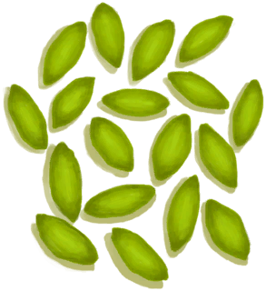

# Tropical Almond Tree  
> I could get tropical almonds from here.  
  
<table class="table table-bordered" data-toggle="table"  data-show-header="false"><thead style="display:none"><tr ><th  style="width:50%;text-align:left;vertical-align:top;"  >title</th><th  style="width:50%;text-align:left;vertical-align:top;"  ></th></tr></thead><tr ><td  style="width:50%;text-align:left;vertical-align:top;"  >**Usage：**6</td><td  style="width:50%;text-align:left;vertical-align:top;"  >

<a href="TropicalAlmondTree.md" style="color:black">Tropical Almond Tree</a>

</td></tr></tbody></table>  
  
## Got From  

Explore

[Western Grasslands](GrasslandsW.md)

Explore

[Western Highlands](HighlandsWestern.md)

Transform

[Tropical Almond Tree](TropicalAlmondTree.md)

Transform

[Cleared Tropical Almond Tree](TropicalAlmondTreeCleared.md)

  
  
## Action  

<table><tr><td rowspan="2" style="width:200px;text-align:center;font-size:1.3em;font-weight:bold">

Collect Tropical Almonds

15m

</td><td>[“HandAction(Group)”](HandAction.md)</td></tr><tr><td><b>Self：</b>Usage  <b>-1</b></td></tr><tr><td colspan="2"><b>Require：</b>[

[Light](Light.md)](Light.md): <b>10-100</b></td></tr><tr><td colspan="2">[

[Tropical Almonds](TropicalAlmonds.md)](TropicalAlmonds.md)(<b>+1</b>)</td></tr></table>
  
  
  
## Durability   

<table style="margin-bottom:0px;"><tr><td style="width:30%;text-align:left; background-color:#FEFEFE;font-size:1.3em;font-weight:bold;">Usage</td><td style="font-size:1em;background-color:#FEFEFE">Starting：6 -</td></tr><tr style="background-color:#FFFFFF"><td colspan=2>** On Zero： ** Self: → [

[Cleared Tropical Almond Tree](TropicalAlmondTreeCleared.md)](TropicalAlmondTreeCleared.md)</td></tr></table>
  

<table style="margin-bottom:0px;"><tr><td style="width:30%;text-align:left; background-color:#FEFEFE;font-size:1.3em;font-weight:bold;">

Almond Growth</td><td style="font-size:1em;background-color:#FEFEFE">Starting：0 , Max：2880 +1/TP , Duration ：30d</td></tr><tr style="background-color:#FFFFFF"><td colspan=2>** On Full： ** Self: → [

[Tropical Almond Tree](TropicalAlmondTree.md)](TropicalAlmondTree.md)</td></tr></table>
  

