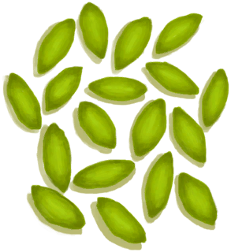
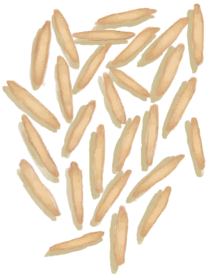

# Tropical Almonds  
> I need something to crack them open.  
  
<table class="table table-bordered" data-toggle="table"  data-show-header="false"><thead style="display:none"><tr ><th  style="width:50%;text-align:left;vertical-align:top;"  >title</th><th  style="width:50%;text-align:left;vertical-align:top;"  ></th></tr></thead><tr ><td  style="width:50%;text-align:left;vertical-align:top;"  >**Weight：**50</td><td  style="width:50%;text-align:left;vertical-align:top;"  >

<a href="TropicalAlmonds.md" style="color:black">Tropical Almonds</a>

</td></tr></tbody></table>  
  
## Got From  

Check Gift

[A gift!(Event)](Event_MacaqueFriendGift.md)

Collect Tropical Almonds

[Tropical Almond Tree](TropicalAlmondTree.md)

  
  
## Drag With  

<table style="margin-bottom:0px;"><tr><td style="width:40%;text-align:left; background-color:#FEFEFE"><b>With：</b>[“Hammer”](tag_Hammer.md)</td><td style="width:40%;font-size:1em;font-weight:bold;background-color:#FEFEFE">Crack Almond open (15m) [“HandAction(Group)”](HandAction.md)</td></tr><tr><td colspan="2"><b>Require：</b>[

[Light](Light.md)](Light.md): <b>10-100</b></td></tr><tr style="background-color:#FFFFFF"><td style=""><b>Receiving：</b></td><td style=""><b>Self：</b>→ [

[Tropical Almond Kernels](TropicalAlmondKernels.md)](TropicalAlmondKernels.md)</td></tr></table>
  
  
## Drag To  

[Empty Crop Plot(Empty)](CropPlotEmpty.md)

[Macaque Friend](MacaqueFriend.md)

  
  
## Use In BluePrint  

<a href="Bp_FeedBoar.md" style="color:black">Boar Feed</a>

  
  
  

