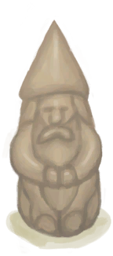

# Gnome Figurine  
> A little gnome carved out of a tusk.  
  
<table class="table table-bordered" data-toggle="table"  data-show-header="false"><thead style="display:none"><tr ><th  style="width:50%;text-align:left;vertical-align:top;"  >title</th><th  style="width:50%;text-align:left;vertical-align:top;"  ></th></tr></thead><tr ><td  style="width:50%;text-align:left;vertical-align:top;"  >**Weight：**150  **Tag：**	[“Decoration Advanced”](tag_DecorationAdv.md), [“Pretty”](tag_Pretty.md)</td><td  style="width:50%;text-align:left;vertical-align:top;"  >

<a href="TuskCarving_GnomeMale.md" style="color:black">Gnome Figurine</a>

</td></tr></tbody></table>  
  
## Got From  

** With：**[“Cutter Advanced”](tag_CutterAdv.md)Carve

[Boar Tusk](Tusk.md)

  
  

