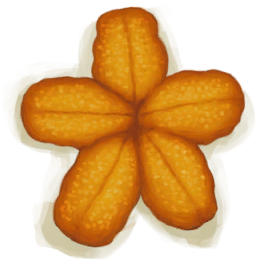
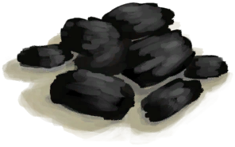

# Cooked Urchin  
> Very tasty.  
  
<table class="table table-bordered" data-toggle="table"  data-show-header="false"><thead style="display:none"><tr ><th  style="width:50%;text-align:left;vertical-align:top;"  >title</th><th  style="width:50%;text-align:left;vertical-align:top;"  ></th></tr></thead><tr ><td  style="width:50%;text-align:left;vertical-align:top;"  >**Weight：**25  **Tag：**	[“Cookable”](tag_Cookable.md), [“Feed”](tag_Feed.md), [“Feed”](tag_Meat.md), [“Human Food”](tag_HumanFood.md), [“Poor Proteins”](tag_ProteinsPoor.md), [“Salt can be added. ”](tag_Saltable.md), [“Chilli Powder can be added. ”](tag_Chilliable.md)</td><td  style="width:50%;text-align:left;vertical-align:top;"  >

<a href="UrchinMeatCooked.md" style="color:black">Cooked Urchin</a>

"Urchins are spiny animals related to starfish. They can be found in the <b>Rocky Coasts</b> of the island as well as in <b>Tidepools</b>.  It is recommended to wear some sort of foot protection when foraging in the areas where they live as stepping on one can cause a <b>Painful</b> wound that is prone to <b>Infections</b> and will make <b>Walking</b> more difficult. If you do happen to accidentally step on one</td></tr></tbody></table>  
  
## Got From  

Urchin

[Urchin Meat](UrchinMeat.md)

Urchin

[Urchin Meat](UrchinMeat.md)

Urchin

[Urchin Meat](UrchinMeat.md)

Urchin

[Urchin Meat](UrchinMeat.md)

Urchin

[Urchin Meat](UrchinMeat.md)

  
  
## Action  

<table><tr><td rowspan="2" style="width:200px;text-align:center;font-size:1.3em;font-weight:bold">

Eat

</td><td>[“ShellfishAction(Group)”](ShellfishAction.md), [“CarnivorousAction(Group)”](CarnivorousAction.md), [“EatingAction(Group)”](EatingAction.md)</td></tr><tr><td><b>Self：</b>→Dismiss</td></tr><tr><td colspan="2"><b>StatChange：</b>[

[Satiation](Satiation.md)](Satiation.md)<b>+15</b>, [

[Stomach](Stomach.md)](Stomach.md)<b>+8</b>, [

[Hydration ](Hydration.md)](Hydration.md)<b>+2</b>, [

[Saturation Mollusks](SaturationMollusks.md)](SaturationMollusks.md)<b>+15</b>, [

[Filth](Filth.md)](Filth.md)<b>+2</b>, [

[Morale](Morale.md)](Morale.md)<b>+4</b></td></tr></table>
  
  
  
## Drag To  

[Boar Feeder](BoarFeeder.md)

[Boar Feeder(Empty)](BoarFeederEmpty.md)

[Compost Bin](CompostBin.md)

[Partridge Feeder](PartridgeFeeder.md)

[Partridge Feeder(Empty)](PartridgeFeederEmpty.md)

[Trapped Macaque](CageTrapMacaque.md)

[Chilli Powder](ChiliPowder.md)

[Sow](BoarEnclosureFemale.md)

[Boar](BoarEnclosureMale.md)

[Piglet](BoarEnclosurePiglet.md)

[Sow](BoarTiedFemale.md)

[Boar](BoarTiedMale.md)

[Piglet](BoarTiedPiglet.md)

[Dog Friend](DogFriend.md)

[Grandfather](Grandfather.md)

[Grandfather](GrandfatherHealthy.md)

[Macaque Friend](MacaqueFriend.md)

[Wounded Macaque](MacaqueWounded.md)

[Chick](PartridgeChick.md)

[Partridge](PartridgeFemaleEnclosure.md)

[Partridge](PartridgeFemaleLive.md)

[Male Partridge](PartridgeMaleEnclosure.md)

[Male Partridge](PartridgeMaleLive.md)

[Salt](Salt.md)

  
  
## Use In BluePrint  

<a href="Bp_SeafoodCup.md" style="color:black">Seafood Cup</a>

  
  
  
## Use To Transform  
<table class="table table-bordered" data-toggle="table"  ><thead style=""><tr ><th  style="text-align:left;vertical-align:top;"  >Transform to</th><th  style="text-align:left;vertical-align:top;"  >Container</th></tr></thead><tr ><td  style="text-align:left;vertical-align:top;"  >[

[Charred Remains](CharredRemains.md)](CharredRemains.md)</td><td  style="text-align:left;vertical-align:top;"  >[

[Campfire](Campfire.md)](Campfire.md)</td></tr><tr ><td  style="text-align:left;vertical-align:top;"  >[

[Charred Remains](CharredRemains.md)](CharredRemains.md)</td><td  style="text-align:left;vertical-align:top;"  >[

[Clay Fire Pit](ClayFirePit.md)](ClayFirePit.md)</td></tr><tr ><td  style="text-align:left;vertical-align:top;"  >[

[Charred Remains](CharredRemains.md)](CharredRemains.md)</td><td  style="text-align:left;vertical-align:top;"  >[

[Fire](Fire.md)](Fire.md)</td></tr><tr ><td  style="text-align:left;vertical-align:top;"  >[

[Charred Remains](CharredRemains.md)](CharredRemains.md)</td><td  style="text-align:left;vertical-align:top;"  >[

[Gas Cooker(On)](GasCookerOn.md)](GasCookerOn.md)</td></tr><tr ><td  style="text-align:left;vertical-align:top;"  >[

[Charred Remains](CharredRemains.md)](CharredRemains.md)</td><td  style="text-align:left;vertical-align:top;"  >[

[Stove](Stove.md)](Stove.md)</td></tr></tbody></table>  
  
## Durability   

<table style="margin-bottom:0px;"><tr><td style="width:30%;text-align:left; background-color:#FEFEFE;font-size:1.3em;font-weight:bold;">Spoilage</td><td style="font-size:1em;background-color:#FEFEFE">Starting：192 -1/TP , Duration ：2d</td></tr><tr style="background-color:#FFFFFF"><td colspan=2>** On Zero： ** Self: → [

[Rotten Remains](RottenRemains.md)](RottenRemains.md)</td></tr></table>
  

<table style="margin-bottom:0px;"><tr><td style="width:30%;text-align:left; background-color:#FEFEFE;font-size:1.3em;font-weight:bold;">

</td><td style="font-size:1em;background-color:#FEFEFE">Starting：0 , Max：1 -</td></tr><tr style="background-color:#FFFFFF"><td colspan=2></td></tr></table>
  

<table style="margin-bottom:0px;"><tr><td style="width:30%;text-align:left; background-color:#FEFEFE;font-size:1.3em;font-weight:bold;">

</td><td style="font-size:1em;background-color:#FEFEFE">Starting：0 , Max：1 -</td></tr><tr style="background-color:#FFFFFF"><td colspan=2></td></tr></table>
  

