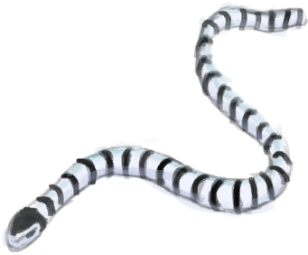

# Venom Krait - Injector  
  

<b>Base Value: </b> 0 
  

<b>Value Range: </b> 0 ~ 32 
  

<b>Base Rate: </b> -1 / /TP 
  
## Statuses  

<table><tr style="height:2em;"><td style="background-color:#F0F0F0;text-align:center;width:180px;font-size:1.4em;font-weight:bold;vertical-align:middle;">
1 ～ 32

3% ～ 100%
</td><td colspan=2 style="font-size:1.1em;vertical-align:middle;background-color:#F9F9F9;">
<b>

Envenomed</b>

</td></tr><tr><td colspan=2><b>Effect：</b>[

[Venom Krait](VenomKrait.md)](VenomKrait.md)addition<b>+5</b></td></tr><tr><td colspan=2></td></tr></table>
  
## Change By  
<table class="table table-bordered" data-toggle="table"  ><thead style=""><tr ><th  style="text-align:left;vertical-align:top;"  >From</th><th  style="text-align:left;vertical-align:top;"  >Operation</th><th  style="text-align:left;vertical-align:top;"  data-sortable="true"  >Value</th></tr></thead><tr ><td  style="text-align:left;vertical-align:top;"  >[

[A Sea Krait!!(Event)](Event_SeaKraitStep.md)](Event_SeaKraitStep.md)</td><td  style="text-align:left;vertical-align:top;"  >Continue...</td><td  style="text-align:left;vertical-align:top;"  >6 ~ 16</td></tr><tr ><td  style="text-align:left;vertical-align:top;"  >[

[A Sea Krait!!(Event)](Event_SeaKraitSwim.md)](Event_SeaKraitSwim.md)</td><td  style="text-align:left;vertical-align:top;"  >It bit me...</td><td  style="text-align:left;vertical-align:top;"  >6 ~ 16</td></tr></tbody></table>  
  

