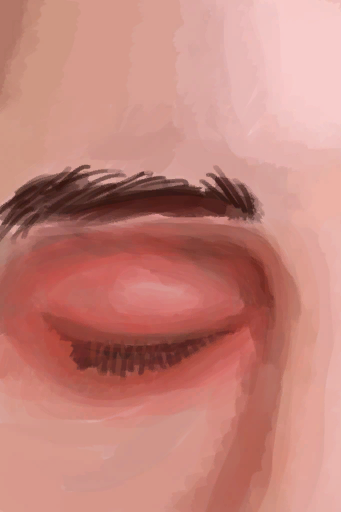
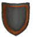

# Cobra Spit  
> "Hurts like hell  
  
<table class="table table-bordered" data-toggle="table"  data-show-header="false"><thead style="display:none"><tr ><th  style="width:50%;text-align:left;vertical-align:top;"  >title</th><th  style="width:50%;text-align:left;vertical-align:top;"  ></th></tr></thead><tr ><td  style="width:50%;text-align:left;vertical-align:top;"  >** Cannot Be Trashed **  **Equipped Cards：**[“Spit”](eTag_WCobraSpit.md)</td><td  style="width:50%;text-align:left;vertical-align:top;"  >

<a href="W_CobraSpit.md" style="color:black">Cobra Spit</a>

"These reptiles can be found on the <b>Grasslands and Highlands</b> of the island.  While not particularly dangerous</td></tr></tbody></table>  
  
## Got From  

Continue

[It got me...(Event)](Event_CobraFightBadFailure.md)

Continue

[The Cobra Spat!(Event)](Event_CobraFightFailedRetreat.md)

Continue

[Mixed Success(Event)](Event_CobraFightMixedSuccess.md)

  
  
## Drag With  

<table style="margin-bottom:0px;"><tr><td style="width:40%;text-align:left; background-color:#FEFEFE"><b>With：</b>[

[Salt Water](LQ_WaterSalt.md)](LQ_WaterSalt.md)</td><td style="width:40%;font-size:1em;font-weight:bold;background-color:#FEFEFE">Clean (seawater) (15m) </td></tr><tr><td colspan="2"><b>Require：</b>[

[Courage](Courage.md)](Courage.md): <b>0-4000</b></td></tr><tr style="background-color:#FFFFFF"><td style=""><b>Receiving：</b></td><td style=""><b>Self：</b>

  <b>-75(-52.08%)</b></td></tr><tr><td colspan="2"><b>StatChange：</b>[

[Morale](Morale.md)](Morale.md)</td></tr></table>
  

<table style="margin-bottom:0px;"><tr><td style="width:40%;text-align:left; background-color:#FEFEFE"><b>With：</b>[“Weak Cleaner”](tag_CleanerWeak.md)</td><td style="width:40%;font-size:1em;font-weight:bold;background-color:#FEFEFE">Clean (water) (15m) </td></tr><tr><td colspan="2"><b>Require：</b>[

[Courage](Courage.md)](Courage.md): <b>0-4000</b></td></tr><tr style="background-color:#FFFFFF"><td style=""><b>Receiving：</b></td><td style=""><b>Self：</b>

  <b>-75(-52.08%)</b></td></tr></table>
  
  
## Transform  

<table style="margin-bottom:0px;"><tr><td  colspan=2 style="font-size:1em;font-weight:bold;background-color:#FEFEFE">Dressing</td><td style="text-align:right; background-color:#FEFEFE"></td></tr><tr style="background-color:#FFFFFF"><td style="width:30%;font-size:1em;text-align:right;vertical-align:middle;">[“Dressing”](tag_Dressing.md)</td><td style="text-align:center;width:20%;vertical-align:middle;">
-

Dressing
</td><td style="text-align:left;vertical-align:middle;">Spoilage  <b>-1</b></td></tr></table>
  
## Durability   

<table style="margin-bottom:0px;"><tr><td style="width:30%;text-align:left; background-color:#FEFEFE;font-size:1.3em;font-weight:bold;">

</td><td style="font-size:1em;background-color:#FEFEFE">Starting：144 , Max：144 -1/TP , Duration ：1d12h</td></tr><tr style="background-color:#FFFFFF"><td colspan=2>** On Zero：Eyes Clear ** Self: →Dismiss</td></tr></table>
  
## Passive Effects  
<table class="table table-bordered" data-toggle="table"  ><thead style=""><tr ><th  style="text-align:left;vertical-align:top;"  >Name</th><th  style="text-align:left;vertical-align:top;"  >Condition</th><th  style="text-align:left;vertical-align:top;"  data-sortable="true"  >Change(Each TP)</th><th  style="text-align:left;vertical-align:top;"  >Status</th></tr></thead><tr ><td  style="text-align:left;vertical-align:top;"  >Minor Venom Dose</td><td  style="text-align:left;vertical-align:top;"  >** Require Durability：** 

: <b>0～100(0%～69.44%)</b></td><td  style="text-align:left;vertical-align:top;"  ></td><td  style="text-align:left;vertical-align:top;"  >[

[Pain](Pain.md)](Pain.md)<b>+100</b> [

[Eyesight](Myopia.md)](Myopia.md)<b>+1</b> [

[Eye Damage](EyeDamage.md)](EyeDamage.md)addition<b>+1</b></td></tr><tr ><td  style="text-align:left;vertical-align:top;"  >Minor Venom Dose</td><td  style="text-align:left;vertical-align:top;"  >** Require Durability：** 

: <b>101～200(70.14%～138.89%)</b></td><td  style="text-align:left;vertical-align:top;"  ></td><td  style="text-align:left;vertical-align:top;"  >[

[Pain](Pain.md)](Pain.md)<b>+200</b> [

[Eyesight](Myopia.md)](Myopia.md)<b>+2</b> [

[Light](Light.md)](Light.md)<b>-25</b> [

[Eye Damage](EyeDamage.md)](EyeDamage.md)addition<b>+1</b></td></tr><tr ><td  style="text-align:left;vertical-align:top;"  >Minor Venom Dose</td><td  style="text-align:left;vertical-align:top;"  >** Require Durability：** 

: <b>101～288(70.14%～200%)</b></td><td  style="text-align:left;vertical-align:top;"  ></td><td  style="text-align:left;vertical-align:top;"  >[

[Pain](Pain.md)](Pain.md)<b>+300</b> [

[Eyesight](Myopia.md)](Myopia.md)<b>+3</b> [

[Light](Light.md)](Light.md)<b>-50</b> [

[Eye Damage](EyeDamage.md)](EyeDamage.md)addition<b>+2</b></td></tr></tbody></table>  
  

