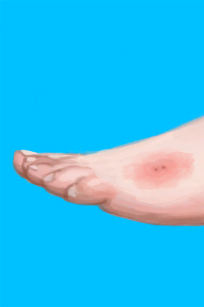

# Spider Bite  
> It hurts!  
  
<table class="table table-bordered" data-toggle="table"  data-show-header="false"><thead style="display:none"><tr ><th  style="width:50%;text-align:left;vertical-align:top;"  >title</th><th  style="width:50%;text-align:left;vertical-align:top;"  ></th></tr></thead><tr ><td  style="width:50%;text-align:left;vertical-align:top;"  >** Cannot Be Trashed **  **Equipped Cards：**[“Abrasion”](eTag_WAbrasion.md)  **Slots：**1  **过滤器：**[“Dressing”](tag_Dressing.md)  **Usage：**0</td><td  style="width:50%;text-align:left;vertical-align:top;"  >

<a href="W_SpiderBite.md" style="color:black">Spider Bite</a>

"Dangerous Spiders dwell in the jungles of tropical islands</td></tr></tbody></table>  
  
## Got From  

Check Wound

[A spider!!(Event)](Event_Spider.md)

Push Spider away!

[A Spider bit me!(Event)](Event_SpiderNight.md)

  
  
## Drag With  

<table style="margin-bottom:0px;"><tr><td style="width:40%;text-align:left; background-color:#FEFEFE"><b>With：</b>[

[Salt Water](LQ_WaterSalt.md)](LQ_WaterSalt.md)</td><td style="width:40%;font-size:1em;font-weight:bold;background-color:#FEFEFE">Clean (seawater) (15m) </td></tr><tr style="background-color:#FFFFFF"><td style=""><b>Receiving：</b></td><td style=""><b>Self：</b>

  <b>-32(-100%)</b>, 

  <b>-150(-52.08%)</b></td></tr><tr><td colspan="2"><b>StatChange：</b>[

[Morale](Morale.md)](Morale.md)<b>-5</b></td></tr></table>
  

<table style="margin-bottom:0px;"><tr><td style="width:40%;text-align:left; background-color:#FEFEFE"><b>With：</b>[“Weak Cleaner”](tag_CleanerWeak.md)</td><td style="width:40%;font-size:1em;font-weight:bold;background-color:#FEFEFE">Clean (water) (15m) [“HandAction(Group)”](HandAction.md)</td></tr><tr style="background-color:#FFFFFF"><td style=""><b>Receiving：</b></td><td style=""><b>Self：</b>

  <b>-32(-100%)</b>, 

  <b>-150(-52.08%)</b></td></tr></table>
  

<table style="margin-bottom:0px;"><tr><td style="width:40%;text-align:left; background-color:#FEFEFE"><b>With：</b>[

[Honey Water](LQ_HoneyWater.md)](LQ_HoneyWater.md)</td><td style="width:40%;font-size:1em;font-weight:bold;background-color:#FEFEFE">Clean (honeywater) (15m) [“HandAction(Group)”](HandAction.md)</td></tr><tr><td colspan="2"><b>Require：</b>[

[Courage](Courage.md)](Courage.md): <b>50-4000</b></td></tr><tr style="background-color:#FFFFFF"><td style=""><b>Receiving：</b>Spoilage  <b>-300(-22.32%)</b></td><td style=""><b>Self：</b>

  <b>-32(-100%)</b>, 

  <b>-250(-86.81%)</b></td></tr></table>
  

<table style="margin-bottom:0px;"><tr><td style="width:40%;text-align:left; background-color:#FEFEFE"><b>With：</b>[

[Lye](LQ_Lye.md)](LQ_Lye.md)</td><td style="width:40%;font-size:1em;font-weight:bold;background-color:#FEFEFE">Clean (lye) (15m) [“HandAction(Group)”](HandAction.md)</td></tr><tr style="background-color:#FFFFFF"><td style=""><b>Receiving：</b></td><td style=""><b>Self：</b>

  <b>-32(-100%)</b>, 

  <b>-500(-173.61%)</b></td></tr></table>
  

<table style="margin-bottom:0px;"><tr><td style="width:40%;text-align:left; background-color:#FEFEFE"><b>With：</b>[

[Wet Soap](SoapWet.md)](SoapWet.md)</td><td style="width:40%;font-size:1em;font-weight:bold;background-color:#FEFEFE">Clean (soap) (15m) </td></tr><tr style="background-color:#FFFFFF"><td style=""><b>Receiving：</b>Usage  <b>-1</b></td><td style=""><b>Self：</b>

  <b>-32(-100%)</b>, 

  <b>-500(-173.61%)</b></td></tr></table>
  

<table style="margin-bottom:0px;"><tr><td style="width:40%;text-align:left; background-color:#FEFEFE"><b>With：</b>[

[Aloe Vera Gel](AloeVeraGel.md)](AloeVeraGel.md) | [

[Brimstone Gel](BrimstoneGel.md)](BrimstoneGel.md)</td><td style="width:40%;font-size:1em;font-weight:bold;background-color:#FEFEFE">Apply (15m) </td></tr><tr style="background-color:#FFFFFF"><td style=""><b>Receiving：</b>→Dismiss</td><td style=""><b>Self：</b>

  <b>+16(50%)</b>, 

  <b>-150(-52.08%)</b></td></tr></table>
  

<table style="margin-bottom:0px;"><tr><td style="width:40%;text-align:left; background-color:#FEFEFE"><b>With：</b>[

[Honey](LQ_Honey.md)](LQ_Honey.md)</td><td style="width:40%;font-size:1em;font-weight:bold;background-color:#FEFEFE">Apply Honey (15m) [“HandAction(Group)”](HandAction.md)</td></tr><tr><td colspan="2"><b>Require：</b>[

[Courage](Courage.md)](Courage.md): <b>50-4000</b></td></tr><tr style="background-color:#FFFFFF"><td style=""><b>Receiving：</b></td><td style=""><b>Self：</b>

  <b>+16(50%)</b>, 

  <b>-150(-52.08%)</b></td></tr></table>
  
  
## Transform  

<table style="margin-bottom:0px;"><tr><td  colspan=2 style="font-size:1em;font-weight:bold;background-color:#FEFEFE">Dressing</td><td style="text-align:right; background-color:#FEFEFE"></td></tr><tr style="background-color:#FFFFFF"><td style="width:30%;font-size:1em;text-align:right;vertical-align:middle;">[“Dressing”](tag_Dressing.md)</td><td style="text-align:center;width:20%;vertical-align:middle;">
-

Dressing
</td><td style="text-align:left;vertical-align:middle;">Spoilage  <b>-1</b></td></tr></table>
  
## Durability   

<table style="margin-bottom:0px;"><tr><td style="width:30%;text-align:left; background-color:#FEFEFE;font-size:1.3em;font-weight:bold;">

</td><td style="font-size:1em;background-color:#FEFEFE">Starting：0 , Max：500 +1/TP , Duration ：5d5h</td></tr><tr style="background-color:#FFFFFF"><td colspan=2>** On Full：Abrasion ** Self: →Dismiss</td></tr></table>
  

<table style="margin-bottom:0px;"><tr><td style="width:30%;text-align:left; background-color:#FEFEFE;font-size:1.3em;font-weight:bold;">

</td><td style="font-size:1em;background-color:#FEFEFE">Starting：0 , Max：32 -1/TP , Duration ：8h</td></tr><tr style="background-color:#FFFFFF"><td colspan=2></td></tr></table>
  

<table style="margin-bottom:0px;"><tr><td style="width:30%;text-align:left; background-color:#FEFEFE;font-size:1.3em;font-weight:bold;">

</td><td style="font-size:1em;background-color:#FEFEFE">Starting：0 , Max：288 +1/TP , Duration ：3d</td></tr><tr style="background-color:#FFFFFF"><td colspan=2></td></tr></table>
  
## Passive Effects  
<table class="table table-bordered" data-toggle="table"  ><thead style=""><tr ><th  style="text-align:left;vertical-align:top;"  >Name</th><th  style="text-align:left;vertical-align:top;"  >Condition</th><th  style="text-align:left;vertical-align:top;"  >Change(Each TP)</th><th  style="text-align:left;vertical-align:top;"  >Status</th></tr></thead><tr ><td  style="text-align:left;vertical-align:top;"  >Dressing (weak)</td><td  style="text-align:left;vertical-align:top;"  >** 需要放入：** [Leaf Dressing](LeafDressing.md) [Improvised Dressing](ImprovisedDressing.md)</td><td  style="text-align:left;vertical-align:top;"  >

 +1(0.2%) 

 -0.5(-0.18%)</td><td  style="text-align:left;vertical-align:top;"  >[

[Skin Integrity](SkinIntegrity.md)](SkinIntegrity.md)<b>+1</b></td></tr><tr ><td  style="text-align:left;vertical-align:top;"  >Dressing (strong)</td><td  style="text-align:left;vertical-align:top;"  >** 需要放入：** [Wound Dressing](WoundDressing.md) [Ash Dressing](AshDressing.md)</td><td  style="text-align:left;vertical-align:top;"  >

 +1.5(0.3%) 

 -1(-0.35%)</td><td  style="text-align:left;vertical-align:top;"  >[

[Skin Integrity](SkinIntegrity.md)](SkinIntegrity.md)<b>+1</b></td></tr><tr ><td  style="text-align:left;vertical-align:top;"  >Surface Bacteria 1</td><td  style="text-align:left;vertical-align:top;"  >** Require Stat：** [

[Surface Bacteria](BacteriaSurface.md)](BacteriaSurface.md): <b>1-1</b></td><td  style="text-align:left;vertical-align:top;"  >

 +1(0.34%)</td><td  style="text-align:left;vertical-align:top;"  ></td></tr><tr ><td  style="text-align:left;vertical-align:top;"  >Surface Bacteria 2</td><td  style="text-align:left;vertical-align:top;"  >** Require Stat：** [

[Surface Bacteria](BacteriaSurface.md)](BacteriaSurface.md): <b>2-2</b></td><td  style="text-align:left;vertical-align:top;"  >

 +2(0.69%)</td><td  style="text-align:left;vertical-align:top;"  ></td></tr><tr ><td  style="text-align:left;vertical-align:top;"  >Surface Bacteria 3</td><td  style="text-align:left;vertical-align:top;"  >** Require Stat：** [

[Surface Bacteria](BacteriaSurface.md)](BacteriaSurface.md): <b>3-3</b></td><td  style="text-align:left;vertical-align:top;"  >

 +4(1.38%)</td><td  style="text-align:left;vertical-align:top;"  ></td></tr><tr ><td  style="text-align:left;vertical-align:top;"  >Surface Bacteria 4</td><td  style="text-align:left;vertical-align:top;"  >** Require Stat：** [

[Surface Bacteria](BacteriaSurface.md)](BacteriaSurface.md): <b>4-4</b></td><td  style="text-align:left;vertical-align:top;"  >

 +8(2.77%)</td><td  style="text-align:left;vertical-align:top;"  ></td></tr><tr ><td  style="text-align:left;vertical-align:top;"  >Surface Bacteria 5</td><td  style="text-align:left;vertical-align:top;"  >** Require Stat：** [

[Surface Bacteria](BacteriaSurface.md)](BacteriaSurface.md): <b>5-5</b></td><td  style="text-align:left;vertical-align:top;"  >

 +16(5.55%)</td><td  style="text-align:left;vertical-align:top;"  ></td></tr><tr ><td  style="text-align:left;vertical-align:top;"  >Gel Support</td><td  style="text-align:left;vertical-align:top;"  >** Require Durability：** 

: <b>1～32(3.13%～100%)</b></td><td  style="text-align:left;vertical-align:top;"  >

 +0.25(0.05%) 

 -0.25(-0.09%)</td><td  style="text-align:left;vertical-align:top;"  >[

[Pain](Pain.md)](Pain.md)<b>-25</b></td></tr><tr ><td  style="text-align:left;vertical-align:top;"  >Sepsis</td><td  style="text-align:left;vertical-align:top;"  >** Require Durability：** 

: <b>240～288(83.33%～100%)</b></td><td  style="text-align:left;vertical-align:top;"  >

 -2(-0.4%) 

 +1(0.34%)</td><td  style="text-align:left;vertical-align:top;"  >[

[Bacteria Fever](BacteriaFever.md)](BacteriaFever.md)addition<b>+10</b></td></tr><tr ><td  style="text-align:left;vertical-align:top;"  >Spider Bite</td><td  style="text-align:left;vertical-align:top;"  >** Require Durability：** 

: <b>0～250(0%～50%)</b></td><td  style="text-align:left;vertical-align:top;"  ></td><td  style="text-align:left;vertical-align:top;"  >[

[Pain](Pain.md)](Pain.md)<b>+100</b> [

[Skin Integrity](SkinIntegrity.md)](SkinIntegrity.md)<b>-1</b> [Leg Modifier](ModifierLeg.md)<b>+1</b> [

[Weight](Weight.md)](Weight.md)addition<b>-0.1</b> [

[Wounded](Wounds.md)](Wounds.md)<b>+100</b> [

[Bacteria Fever](BacteriaFever.md)](BacteriaFever.md)addition<b>+2</b></td></tr><tr ><td  style="text-align:left;vertical-align:top;"  >Healing Spider Bite</td><td  style="text-align:left;vertical-align:top;"  >** Require Durability：** 

: <b>251～500(50.2%～100%)</b></td><td  style="text-align:left;vertical-align:top;"  ></td><td  style="text-align:left;vertical-align:top;"  >[

[Pain](Pain.md)](Pain.md)<b>+50</b> [

[Skin Integrity](SkinIntegrity.md)](SkinIntegrity.md)<b>-1</b> [

[Wounded](Wounds.md)](Wounds.md)<b>+10</b></td></tr></tbody></table>  
  

