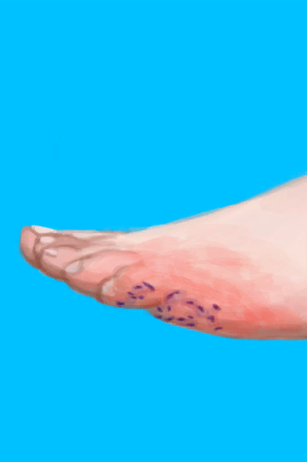

# Urchin Wound  
> I should remove the spines!  
  
<table class="table table-bordered" data-toggle="table"  data-show-header="false"><thead style="display:none"><tr ><th  style="width:50%;text-align:left;vertical-align:top;"  >title</th><th  style="width:50%;text-align:left;vertical-align:top;"  ></th></tr></thead><tr ><td  style="width:50%;text-align:left;vertical-align:top;"  >** Cannot Be Trashed **  **Weight：**1000  **Equipped Cards：**[“Abrasion”](eTag_WAbrasion.md)  **Usage：**0</td><td  style="width:50%;text-align:left;vertical-align:top;"  >

<a href="W_UrchinWoundSpines.md" style="color:black">Urchin Wound</a>

"Urchins are spiny animals related to starfish. They can be found in the <b>Rocky Coasts</b> of the island as well as in <b>Tidepools</b>.  It is recommended to wear some sort of foot protection when foraging in the areas where they live as stepping on one can cause a <b>Painful</b> wound that is prone to <b>Infections</b> and will make <b>Walking</b> more difficult. If you do happen to accidentally step on one</td></tr></tbody></table>  
  
## Got From  

Check Wound

[Urchin!!(Event)](Event_Urchin.md)

  
  
## Action  

<table><tr><td rowspan="2" style="width:200px;text-align:center;font-size:1.3em;font-weight:bold">

Remove Spines

15m

</td><td></td></tr><tr><td><b>Self：</b>

  <b>-4～-2(-50%～-25%)</b></td></tr><tr><td colspan="2"><b>StatChange：</b>[

[Morale](Morale.md)](Morale.md)<b>-10</b></td></tr></table>
  
  
  
## Durability   

<table style="margin-bottom:0px;"><tr><td style="width:30%;text-align:left; background-color:#FEFEFE;font-size:1.3em;font-weight:bold;">

</td><td style="font-size:1em;background-color:#FEFEFE">Starting：0 , Max：500 +1/TP , Duration ：5d5h</td></tr><tr style="background-color:#FFFFFF"><td colspan=2>** On Full：Abrasion ** Self: →Dismiss</td></tr></table>
  

<table style="margin-bottom:0px;"><tr><td style="width:30%;text-align:left; background-color:#FEFEFE;font-size:1.3em;font-weight:bold;">

</td><td style="font-size:1em;background-color:#FEFEFE">Starting：0 , Max：32 -1/TP , Duration ：8h</td></tr><tr style="background-color:#FFFFFF"><td colspan=2></td></tr></table>
  

<table style="margin-bottom:0px;"><tr><td style="width:30%;text-align:left; background-color:#FEFEFE;font-size:1.3em;font-weight:bold;">

</td><td style="font-size:1em;background-color:#FEFEFE">Starting：0 , Max：288 +1/TP , Duration ：3d</td></tr><tr style="background-color:#FFFFFF"><td colspan=2></td></tr></table>
  

<table style="margin-bottom:0px;"><tr><td style="width:30%;text-align:left; background-color:#FEFEFE;font-size:1.3em;font-weight:bold;">

</td><td style="font-size:1em;background-color:#FEFEFE">Starting：8 , Max：8 -</td></tr><tr style="background-color:#FFFFFF"><td colspan=2>** On Zero：Spines Removed! ** Self: → [

[Urchin Wound](W_UrchinWound.md)](W_UrchinWound.md)</td></tr></table>
  
## Passive Effects  
<table class="table table-bordered" data-toggle="table"  ><thead style=""><tr ><th  style="text-align:left;vertical-align:top;"  >Name</th><th  style="text-align:left;vertical-align:top;"  >Condition</th><th  style="text-align:left;vertical-align:top;"  >Change(Each TP)</th><th  style="text-align:left;vertical-align:top;"  >Status</th></tr></thead><tr ><td  style="text-align:left;vertical-align:top;"  >Surface Bacteria 1</td><td  style="text-align:left;vertical-align:top;"  >** Require Stat：** [

[Surface Bacteria](BacteriaSurface.md)](BacteriaSurface.md): <b>1-1</b></td><td  style="text-align:left;vertical-align:top;"  >

 +1(0.34%)</td><td  style="text-align:left;vertical-align:top;"  ></td></tr><tr ><td  style="text-align:left;vertical-align:top;"  >Surface Bacteria 2</td><td  style="text-align:left;vertical-align:top;"  >** Require Stat：** [

[Surface Bacteria](BacteriaSurface.md)](BacteriaSurface.md): <b>2-2</b></td><td  style="text-align:left;vertical-align:top;"  >

 +2(0.69%)</td><td  style="text-align:left;vertical-align:top;"  ></td></tr><tr ><td  style="text-align:left;vertical-align:top;"  >Surface Bacteria 3</td><td  style="text-align:left;vertical-align:top;"  >** Require Stat：** [

[Surface Bacteria](BacteriaSurface.md)](BacteriaSurface.md): <b>3-3</b></td><td  style="text-align:left;vertical-align:top;"  >

 +4(1.38%)</td><td  style="text-align:left;vertical-align:top;"  ></td></tr><tr ><td  style="text-align:left;vertical-align:top;"  >Surface Bacteria 4</td><td  style="text-align:left;vertical-align:top;"  >** Require Stat：** [

[Surface Bacteria](BacteriaSurface.md)](BacteriaSurface.md): <b>4-4</b></td><td  style="text-align:left;vertical-align:top;"  >

 +8(2.77%)</td><td  style="text-align:left;vertical-align:top;"  ></td></tr><tr ><td  style="text-align:left;vertical-align:top;"  >Surface Bacteria 5</td><td  style="text-align:left;vertical-align:top;"  >** Require Stat：** [

[Surface Bacteria](BacteriaSurface.md)](BacteriaSurface.md): <b>5-5</b></td><td  style="text-align:left;vertical-align:top;"  >

 +16(5.55%)</td><td  style="text-align:left;vertical-align:top;"  ></td></tr><tr ><td  style="text-align:left;vertical-align:top;"  >Sepsis</td><td  style="text-align:left;vertical-align:top;"  >** Require Durability：** 

: <b>240～288(83.33%～100%)</b></td><td  style="text-align:left;vertical-align:top;"  >

 -2(-0.4%) 

 +1(0.34%)</td><td  style="text-align:left;vertical-align:top;"  >[

[Bacteria Fever](BacteriaFever.md)](BacteriaFever.md)addition<b>+10</b></td></tr><tr ><td  style="text-align:left;vertical-align:top;"  >Urchin Wound</td><td  style="text-align:left;vertical-align:top;"  >** Require Durability：** 

: <b>0～250(0%～50%)</b></td><td  style="text-align:left;vertical-align:top;"  ></td><td  style="text-align:left;vertical-align:top;"  >[

[Pain](Pain.md)](Pain.md)<b>+300</b> [

[Skin Integrity](SkinIntegrity.md)](SkinIntegrity.md)<b>-1</b> [Leg Modifier](ModifierLeg.md)<b>+3</b> [

[Weight](Weight.md)](Weight.md)addition<b>-0.1</b> [

[Wounded](Wounds.md)](Wounds.md)<b>+100</b></td></tr></tbody></table>  
  

