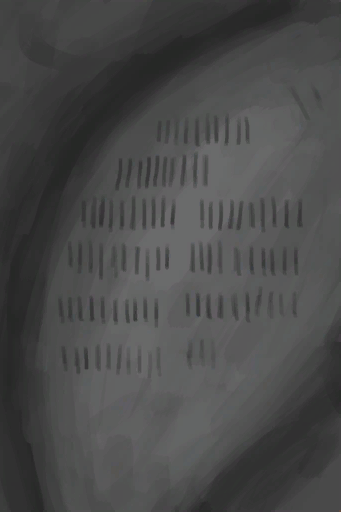

# Wall Scratchings  
> Someone has scratched markings on the walls of the cave. There are 96 scratches. Probably representing days...  
  
<table class="table table-bordered" data-toggle="table"  data-show-header="false"><thead style="display:none"><tr ><th  style="width:50%;text-align:left;vertical-align:top;"  >title</th><th  style="width:50%;text-align:left;vertical-align:top;"  ></th></tr></thead><tr ><td  style="width:50%;text-align:left;vertical-align:top;"  >** Unique On Board **  **Environment：**[Cave(Environment)](Env_CaveSea.md)</td><td  style="width:50%;text-align:left;vertical-align:top;"  >

<a href="WallScratchings.md" style="color:black">Wall Scratchings</a>

</td></tr></tbody></table>  
  

