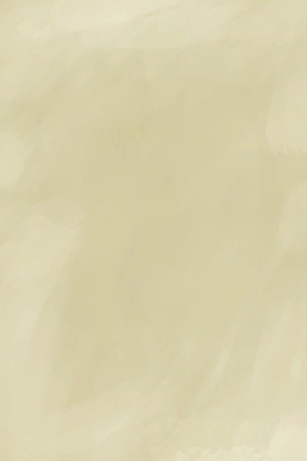
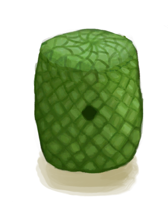

# Palm Weave  
> I could make different crafts with this.  
  
<table class="table table-bordered" data-toggle="table"  data-show-header="false"><thead style="display:none"><tr ><th  style="width:50%;text-align:left;vertical-align:top;"  >title</th><th  style="width:50%;text-align:left;vertical-align:top;"  ></th></tr></thead><tr ><td  style="width:50%;text-align:left;vertical-align:top;"  >**Weight：**150</td><td  style="width:50%;text-align:left;vertical-align:top;"  >

<a href="WeavePalm.md" style="color:black">Palm Weave</a>

"Fronds can be found in many places on tropical islands</td></tr></tbody></table>  
  
## Got From  

Dismantle

[Partridge Feeder](PartridgeFeeder.md)

Dismantle

[Partridge Feeder(Empty)](PartridgeFeederEmpty.md)

** With：**[Palm Fronds](PalmFronds.md)Weave

[Palm Fronds](PalmFronds.md)

  
  
## Drag To  

[Head (Outer)(BluePrint)](OuterHeadBlueprint.md)

  
  
## Use In BluePrint  

<a href="Bp_BeeSkepEmpty.md" style="color:black">Empty Skep</a>

<a href="Bp_Chest.md" style="color:black">Chest</a>

<a href="Bp_PartridgeFeeder.md" style="color:black">Partridge Feeder</a>

<a href="Bp_Shed.md" style="color:black">Shed</a>

<a href="Bp_SupplyChest.md" style="color:black">Supply Chest</a>

<a href="Bp_WovenBackpack.md" style="color:black">Woven Backpack</a>

<a href="Bp_WovenBasket.md" style="color:black">Woven Basket</a>

<a href="Bp_WovenHat.md" style="color:black">Woven Hat</a>

<a href="Bp_BeeSuit.md" style="color:black">Bee Suit</a>

  
  
  

