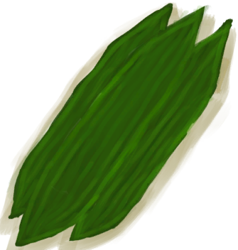
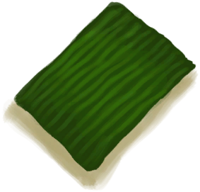

# Weevil Lily Leaves  
> I could make bandages with this  
  
<table class="table table-bordered" data-toggle="table"  data-show-header="false"><thead style="display:none"><tr ><th  style="width:50%;text-align:left;vertical-align:top;"  >title</th><th  style="width:50%;text-align:left;vertical-align:top;"  ></th></tr></thead><tr ><td  style="width:50%;text-align:left;vertical-align:top;"  >**Weight：**50  **Tag：**	[“Feed Herbivore”](tag_FeedHerb.md), [“Cookable”](tag_Cookable.md), [“Poor Fibers”](tag_FibersPoor.md)</td><td  style="width:50%;text-align:left;vertical-align:top;"  >

<a href="WeevilLilyLeaves.md" style="color:black">Weevil Lily Leaves</a>

A plant found in <b>Jungles</b>  Its large <b>Leaves</b> can be used as makeshift <b>Wound Dressings</b> to help wounds heal.  Plant its <b>Leaves in a Crop Plot.</b> to grow your own!</td></tr></tbody></table>  
  
## Got From  

Harvest Leaves

[Weevil Lily](WeevilLily.md)

  
  
## Action  

<table><tr><td rowspan="2" style="width:200px;text-align:center;font-size:1.3em;font-weight:bold">

Make bandage

15m

</td><td>[“HandAction(Group)”](HandAction.md)</td></tr><tr><td><b>Self：</b>→Dismiss</td></tr><tr><td colspan="2"><b>Require：</b>[

[Light](Light.md)](Light.md): <b>10-100</b></td></tr><tr><td colspan="2"><b>StatChange：</b>[

[Herbology(Skill)](Skill_Herbology.md)](Skill_Herbology.md)<b>+0.5</b></td></tr><tr><td colspan="2">[

[Leaf Dressing](LeafDressing.md)](LeafDressing.md)(<b>+1</b>)</td></tr></table>
  
  
  
## Drag To  

[Empty Crop Plot(Empty)](CropPlotEmpty.md)

[Goat Feeder](GoatFeeder.md)

[Goat Feeder(Empty)](GoatFeederEmpty.md)

[Goat](GoatEnclosureFemale.md)

[Juvenile Goat](GoatEnclosureKid.md)

[Lactating Goat](GoatEnclosureLactating.md)

[Male Goat](GoatEnclosureMale.md)

[Goat](GoatTiedFemale.md)

[Lactating Goat](GoatTiedFemaleLactating.md)

[Juvenile Goat](GoatTiedKid.md)

[Male Goat](GoatTiedMale.md)

  
  
## Durability   

<table style="margin-bottom:0px;"><tr><td style="width:30%;text-align:left; background-color:#FEFEFE;font-size:1.3em;font-weight:bold;">Spoilage</td><td style="font-size:1em;background-color:#FEFEFE">Starting：672 -1/TP , Duration ：7d</td></tr><tr style="background-color:#FFFFFF"><td colspan=2>** On Zero： ** Self: →Dismiss</td></tr></table>
  

