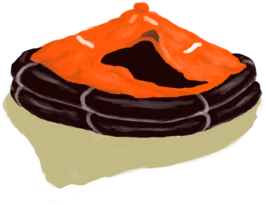

# Weight  
> Shows how much fat your body is storing. You will die if it reaches zero.  
> "Your weight will go down if you consume less calories than you are spending and vice versa.  If your weight gets too low  
  

<b>Base Value: </b> 2500 
  

<b>Value Range: </b> 0 ~ 15000 
  

<b>Base Rate: </b> - 
  
## Statuses  

<table><tr style="height:2em;"><td style="background-color:#F0F0F0;text-align:center;width:180px;font-size:1.4em;font-weight:bold;vertical-align:middle;">
6721 ～ 15000

44% ～ 100%
</td><td colspan=2 style="font-size:1.1em;vertical-align:middle;background-color:#F9F9F9;">
<b>

Obese</b>

</td></tr><tr><td colspan=2><b>Effect：</b>[

[Weight](Weight.md)](Weight.md)addition<b>-4</b>, [Leg Modifier](ModifierLeg.md)<b>+1</b></td></tr><tr><td colspan=2></td></tr><tr style="height:2em;"><td style="background-color:#F0F0F0;text-align:center;width:180px;font-size:1.4em;font-weight:bold;vertical-align:middle;">
4033 ～ 6720

26% ～ 44%
</td><td colspan=2 style="font-size:1.1em;vertical-align:middle;background-color:#F9F9F9;">
<b>

Overweight</b>

</td></tr><tr><td colspan=2><b>Effect：</b>[

[Weight](Weight.md)](Weight.md)addition<b>-3</b></td></tr><tr><td colspan=2></td></tr><tr style="height:2em;"><td style="background-color:#F0F0F0;text-align:center;width:180px;font-size:1.4em;font-weight:bold;vertical-align:middle;">
3001 ～ 4032

20% ～ 26%
</td><td colspan=2 style="font-size:1.1em;vertical-align:middle;background-color:#F9F9F9;">
<b>

Normal Weight</b>

</td></tr><tr><td colspan=2><b>Effect：</b>[

[Weight](Weight.md)](Weight.md)addition<b>-2</b></td></tr><tr><td colspan=2></td></tr><tr style="height:2em;"><td style="background-color:#F0F0F0;text-align:center;width:180px;font-size:1.4em;font-weight:bold;vertical-align:middle;">
2001 ～ 3000

13% ～ 20%
</td><td colspan=2 style="font-size:1.1em;vertical-align:middle;background-color:#F9F9F9;">
<b>

Normal Weight</b>

</td></tr><tr><td colspan=2><b>Effect：</b>[

[Weight](Weight.md)](Weight.md)addition<b>-1</b></td></tr><tr><td colspan=2></td></tr><tr style="height:2em;"><td style="background-color:#F0F0F0;text-align:center;width:180px;font-size:1.4em;font-weight:bold;vertical-align:middle;">
701 ～ 2000

4% ～ 13%
</td><td colspan=2 style="font-size:1.1em;vertical-align:middle;background-color:#F9F9F9;">
<b>

Normal Weight</b>

</td></tr><tr><td colspan=2><b>Effect：</b>[

[Weight](Weight.md)](Weight.md)addition<b>-0.5</b></td></tr><tr><td colspan=2></td></tr><tr style="height:2em;"><td style="background-color:#F0F0F0;text-align:center;width:180px;font-size:1.4em;font-weight:bold;vertical-align:middle;">
289 ～ 700

1% ～ 4%
</td><td colspan=2 style="font-size:1.1em;vertical-align:middle;background-color:#F9F9F9;">
<b>

Underweight</b>

&nbsp;&nbsp;I'm feeling weak
</td></tr><tr><td colspan=2><b>Effect：</b>[

[Wakefulness](Wakefulness.md)](Wakefulness.md)addition<b>-0.5</b>, [

[Appetite](Appetite.md)](Appetite.md)<b>+50</b>, [

[Weight](Weight.md)](Weight.md)addition<b>-0.25</b>, [

[Immune System](ImmuneSystem.md)](ImmuneSystem.md)<b>-50</b></td></tr><tr><td colspan=2></td></tr><tr style="height:2em;"><td style="background-color:#F0F0F0;text-align:center;width:180px;font-size:1.4em;font-weight:bold;vertical-align:middle;">
75 ～ 288

0% ～ 1%
</td><td colspan=2 style="font-size:1.1em;vertical-align:middle;background-color:#F9F9F9;">
<b>

Emaciated</b>

&nbsp;&nbsp;I'm feeling very weak
</td></tr><tr><td colspan=2><b>Effect：</b>[

[Immune System](ImmuneSystem.md)](ImmuneSystem.md)<b>-100</b>, [

[Wakefulness](Wakefulness.md)](Wakefulness.md)addition<b>-1</b>, [

[Appetite](Appetite.md)](Appetite.md)<b>+100</b>, [

[Weight](Weight.md)](Weight.md)addition<b>-0.1</b></td></tr><tr><td colspan=2></td></tr><tr style="height:2em;"><td style="background-color:#F0F0F0;text-align:center;width:180px;font-size:1.4em;font-weight:bold;vertical-align:middle;">
1 ～ 74

0% ～ 0%
</td><td colspan=2 style="font-size:1.1em;vertical-align:middle;background-color:#F9F9F9;">
<b>

On the Verge of Starvation</b>

&nbsp;&nbsp;I can barely move... I won't last long
</td></tr><tr><td colspan=2><b>Effect：</b>[

[Wakefulness](Wakefulness.md)](Wakefulness.md)addition<b>-1</b>, [

[Bacteria Fever](BacteriaFever.md)](BacteriaFever.md)addition<b>+4</b>, [

[Appetite](Appetite.md)](Appetite.md)<b>+100</b>, [

[Weight](Weight.md)](Weight.md)addition<b>-0.1</b></td></tr><tr><td colspan=2></td></tr><tr style="height:2em;"><td style="background-color:#F0F0F0;text-align:center;width:180px;font-size:1.4em;font-weight:bold;vertical-align:middle;">
0

0%
</td><td colspan=2 style="font-size:1.1em;vertical-align:middle;background-color:#F9F9F9;">
<b>

Dead of Starvation</b>

&nbsp;&nbsp;You died of starvation.
</td></tr><tr><td colspan=2></td></tr></table>
  
## Related Cards  
[Intestines](Intestines.md)  |  [Stamina](Stamina.md)  |  [Burns](Burns.md)  |  [Parasites](Parasites.md)  |  [Seahound Parasites](ParasitesSeahound.md)  |  [Blood Pressure](Blood.md)  |  [Chine Rose Effect](ChinaRoseEffect.md)  |  [Pregnancy](Pregnancy.md)  
## Addition Change By  
<table class="table table-bordered" data-toggle="table"  ><thead style=""><tr ><th  style="text-align:left;vertical-align:top;"  >From</th><th  style="text-align:left;vertical-align:top;"  >Operation</th><th  style="text-align:left;vertical-align:top;"  >Value</th></tr></thead><tr ><td  style="text-align:left;vertical-align:top;"  >

[Slow Metabolism](Pk_4_SlowMetabolism.md)</td><td  style="text-align:left;vertical-align:top;"  >Perk Effect</td><td  style="text-align:left;vertical-align:top;"  >addition+0.5</td></tr><tr ><td  style="text-align:left;vertical-align:top;"  >[Sprained Wrist](W_ArmSprainedL.md)</td><td  style="text-align:left;vertical-align:top;"  >Passive</td><td  style="text-align:left;vertical-align:top;"  >addition+0</td></tr><tr ><td  style="text-align:left;vertical-align:top;"  >[Sprained Wrist](W_ArmSprainedR.md)</td><td  style="text-align:left;vertical-align:top;"  >Passive</td><td  style="text-align:left;vertical-align:top;"  >addition+0</td></tr><tr ><td  style="text-align:left;vertical-align:top;"  >[Sprained Ankle](W_LegSprainedL.md)</td><td  style="text-align:left;vertical-align:top;"  >Passive</td><td  style="text-align:left;vertical-align:top;"  >addition+0</td></tr><tr ><td  style="text-align:left;vertical-align:top;"  >[Sprained Ankle](W_LegSprainedR.md)</td><td  style="text-align:left;vertical-align:top;"  >Passive</td><td  style="text-align:left;vertical-align:top;"  >addition+0</td></tr><tr ><td  style="text-align:left;vertical-align:top;"  >[Abrasion](W_Abrasion.md)</td><td  style="text-align:left;vertical-align:top;"  >Passive</td><td  style="text-align:left;vertical-align:top;"  >addition-0.1</td></tr><tr ><td  style="text-align:left;vertical-align:top;"  >[Arm Fracture](W_ArmFractureL.md)</td><td  style="text-align:left;vertical-align:top;"  >Passive</td><td  style="text-align:left;vertical-align:top;"  >addition-0.1</td></tr><tr ><td  style="text-align:left;vertical-align:top;"  >[Arm Fracture](W_ArmFractureR.md)</td><td  style="text-align:left;vertical-align:top;"  >Passive</td><td  style="text-align:left;vertical-align:top;"  >addition-0.1</td></tr><tr ><td  style="text-align:left;vertical-align:top;"  >[Sprained Wrist](W_ArmSprainedL.md)</td><td  style="text-align:left;vertical-align:top;"  >Passive</td><td  style="text-align:left;vertical-align:top;"  >addition-0.1</td></tr><tr ><td  style="text-align:left;vertical-align:top;"  >[Sprained Wrist](W_ArmSprainedR.md)</td><td  style="text-align:left;vertical-align:top;"  >Passive</td><td  style="text-align:left;vertical-align:top;"  >addition-0.1</td></tr><tr ><td  style="text-align:left;vertical-align:top;"  >[Dog Bite](W_DogBite.md)</td><td  style="text-align:left;vertical-align:top;"  >Passive</td><td  style="text-align:left;vertical-align:top;"  >addition-0.1</td></tr><tr ><td  style="text-align:left;vertical-align:top;"  >[Leg Fracture](W_LegFractureL.md)</td><td  style="text-align:left;vertical-align:top;"  >Passive</td><td  style="text-align:left;vertical-align:top;"  >addition-0.1</td></tr><tr ><td  style="text-align:left;vertical-align:top;"  >[Leg Fracture](W_LegFractureR.md)</td><td  style="text-align:left;vertical-align:top;"  >Passive</td><td  style="text-align:left;vertical-align:top;"  >addition-0.1</td></tr><tr ><td  style="text-align:left;vertical-align:top;"  >[Sprained Ankle](W_LegSprainedL.md)</td><td  style="text-align:left;vertical-align:top;"  >Passive</td><td  style="text-align:left;vertical-align:top;"  >addition-0.1</td></tr><tr ><td  style="text-align:left;vertical-align:top;"  >[Sprained Ankle](W_LegSprainedR.md)</td><td  style="text-align:left;vertical-align:top;"  >Passive</td><td  style="text-align:left;vertical-align:top;"  >addition-0.1</td></tr><tr ><td  style="text-align:left;vertical-align:top;"  >[Macaque Bite](W_MacaqueBite.md)</td><td  style="text-align:left;vertical-align:top;"  >Passive</td><td  style="text-align:left;vertical-align:top;"  >addition-0.1</td></tr><tr ><td  style="text-align:left;vertical-align:top;"  >[Minor Laceration](W_MinorLaceration.md)</td><td  style="text-align:left;vertical-align:top;"  >Passive</td><td  style="text-align:left;vertical-align:top;"  >addition-0.1</td></tr><tr ><td  style="text-align:left;vertical-align:top;"  >[Minor Laceration](W_MinorLacerationStitched.md)</td><td  style="text-align:left;vertical-align:top;"  >Passive</td><td  style="text-align:left;vertical-align:top;"  >addition-0.1</td></tr><tr ><td  style="text-align:left;vertical-align:top;"  >[Lizard Bite](W_MonitorBite.md)</td><td  style="text-align:left;vertical-align:top;"  >Passive</td><td  style="text-align:left;vertical-align:top;"  >addition-0.1</td></tr><tr ><td  style="text-align:left;vertical-align:top;"  >[Seahound Sting](W_SeahoundSting.md)</td><td  style="text-align:left;vertical-align:top;"  >Passive</td><td  style="text-align:left;vertical-align:top;"  >addition-0.1</td></tr><tr ><td  style="text-align:left;vertical-align:top;"  >[Shark Bite](W_SharkBite.md)</td><td  style="text-align:left;vertical-align:top;"  >Passive</td><td  style="text-align:left;vertical-align:top;"  >addition-0.1</td></tr><tr ><td  style="text-align:left;vertical-align:top;"  >[Spider Bite](W_SpiderBite.md)</td><td  style="text-align:left;vertical-align:top;"  >Passive</td><td  style="text-align:left;vertical-align:top;"  >addition-0.1</td></tr><tr ><td  style="text-align:left;vertical-align:top;"  >[Urchin Wound](W_UrchinWound.md)</td><td  style="text-align:left;vertical-align:top;"  >Passive</td><td  style="text-align:left;vertical-align:top;"  >addition-0.1</td></tr><tr ><td  style="text-align:left;vertical-align:top;"  >[Urchin Wound](W_UrchinWoundSpines.md)</td><td  style="text-align:left;vertical-align:top;"  >Passive</td><td  style="text-align:left;vertical-align:top;"  >addition-0.1</td></tr><tr ><td  style="text-align:left;vertical-align:top;"  >[Arm Fracture](W_ArmFractureL.md)</td><td  style="text-align:left;vertical-align:top;"  >Passive</td><td  style="text-align:left;vertical-align:top;"  >addition-0.25</td></tr><tr ><td  style="text-align:left;vertical-align:top;"  >[Arm Fracture](W_ArmFractureR.md)</td><td  style="text-align:left;vertical-align:top;"  >Passive</td><td  style="text-align:left;vertical-align:top;"  >addition-0.25</td></tr><tr ><td  style="text-align:left;vertical-align:top;"  >[Arm Laceration](W_ArmLacerationL.md)</td><td  style="text-align:left;vertical-align:top;"  >Passive</td><td  style="text-align:left;vertical-align:top;"  >addition-0.25</td></tr><tr ><td  style="text-align:left;vertical-align:top;"  >[Stitched Arm Laceration](W_ArmLacerationLStitched.md)</td><td  style="text-align:left;vertical-align:top;"  >Passive</td><td  style="text-align:left;vertical-align:top;"  >addition-0.25</td></tr><tr ><td  style="text-align:left;vertical-align:top;"  >[Arm Laceration](W_ArmLacerationR.md)</td><td  style="text-align:left;vertical-align:top;"  >Passive</td><td  style="text-align:left;vertical-align:top;"  >addition-0.25</td></tr><tr ><td  style="text-align:left;vertical-align:top;"  >[Arm Laceration](W_ArmLacerationRStitched.md)</td><td  style="text-align:left;vertical-align:top;"  >Passive</td><td  style="text-align:left;vertical-align:top;"  >addition-0.25</td></tr><tr ><td  style="text-align:left;vertical-align:top;"  >[Leg Fracture](W_LegFractureL.md)</td><td  style="text-align:left;vertical-align:top;"  >Passive</td><td  style="text-align:left;vertical-align:top;"  >addition-0.25</td></tr><tr ><td  style="text-align:left;vertical-align:top;"  >[Leg Fracture](W_LegFractureR.md)</td><td  style="text-align:left;vertical-align:top;"  >Passive</td><td  style="text-align:left;vertical-align:top;"  >addition-0.25</td></tr><tr ><td  style="text-align:left;vertical-align:top;"  >[Leg Laceration](W_LegLacerationL.md)</td><td  style="text-align:left;vertical-align:top;"  >Passive</td><td  style="text-align:left;vertical-align:top;"  >addition-0.25</td></tr><tr ><td  style="text-align:left;vertical-align:top;"  >[Leg Laceration](W_LegLacerationLStitched.md)</td><td  style="text-align:left;vertical-align:top;"  >Passive</td><td  style="text-align:left;vertical-align:top;"  >addition-0.25</td></tr><tr ><td  style="text-align:left;vertical-align:top;"  >[Leg Laceration](W_LegLacerationR.md)</td><td  style="text-align:left;vertical-align:top;"  >Passive</td><td  style="text-align:left;vertical-align:top;"  >addition-0.25</td></tr><tr ><td  style="text-align:left;vertical-align:top;"  >[Leg Laceration](W_LegLacerationRStitched.md)</td><td  style="text-align:left;vertical-align:top;"  >Passive</td><td  style="text-align:left;vertical-align:top;"  >addition-0.25</td></tr><tr ><td  style="text-align:left;vertical-align:top;"  >

[Fast Metabolism](Pk_4_FastMetabolism.md)</td><td  style="text-align:left;vertical-align:top;"  >Perk Effect</td><td  style="text-align:left;vertical-align:top;"  >addition-0.25</td></tr><tr ><td  style="text-align:left;vertical-align:top;"  >[Arm Fracture](W_ArmFractureL.md)</td><td  style="text-align:left;vertical-align:top;"  >Passive</td><td  style="text-align:left;vertical-align:top;"  >addition-0.5</td></tr><tr ><td  style="text-align:left;vertical-align:top;"  >[Arm Fracture](W_ArmFractureR.md)</td><td  style="text-align:left;vertical-align:top;"  >Passive</td><td  style="text-align:left;vertical-align:top;"  >addition-0.5</td></tr><tr ><td  style="text-align:left;vertical-align:top;"  >[Arm Laceration](W_ArmLacerationL.md)</td><td  style="text-align:left;vertical-align:top;"  >Passive</td><td  style="text-align:left;vertical-align:top;"  >addition-0.5</td></tr><tr ><td  style="text-align:left;vertical-align:top;"  >[Stitched Arm Laceration](W_ArmLacerationLStitched.md)</td><td  style="text-align:left;vertical-align:top;"  >Passive</td><td  style="text-align:left;vertical-align:top;"  >addition-0.5</td></tr><tr ><td  style="text-align:left;vertical-align:top;"  >[Arm Laceration](W_ArmLacerationR.md)</td><td  style="text-align:left;vertical-align:top;"  >Passive</td><td  style="text-align:left;vertical-align:top;"  >addition-0.5</td></tr><tr ><td  style="text-align:left;vertical-align:top;"  >[Arm Laceration](W_ArmLacerationRStitched.md)</td><td  style="text-align:left;vertical-align:top;"  >Passive</td><td  style="text-align:left;vertical-align:top;"  >addition-0.5</td></tr><tr ><td  style="text-align:left;vertical-align:top;"  >[Leg Fracture](W_LegFractureL.md)</td><td  style="text-align:left;vertical-align:top;"  >Passive</td><td  style="text-align:left;vertical-align:top;"  >addition-0.5</td></tr><tr ><td  style="text-align:left;vertical-align:top;"  >[Leg Fracture](W_LegFractureR.md)</td><td  style="text-align:left;vertical-align:top;"  >Passive</td><td  style="text-align:left;vertical-align:top;"  >addition-0.5</td></tr><tr ><td  style="text-align:left;vertical-align:top;"  >[Leg Laceration](W_LegLacerationL.md)</td><td  style="text-align:left;vertical-align:top;"  >Passive</td><td  style="text-align:left;vertical-align:top;"  >addition-0.5</td></tr><tr ><td  style="text-align:left;vertical-align:top;"  >[Leg Laceration](W_LegLacerationLStitched.md)</td><td  style="text-align:left;vertical-align:top;"  >Passive</td><td  style="text-align:left;vertical-align:top;"  >addition-0.5</td></tr><tr ><td  style="text-align:left;vertical-align:top;"  >[Leg Laceration](W_LegLacerationR.md)</td><td  style="text-align:left;vertical-align:top;"  >Passive</td><td  style="text-align:left;vertical-align:top;"  >addition-0.5</td></tr><tr ><td  style="text-align:left;vertical-align:top;"  >[Leg Laceration](W_LegLacerationRStitched.md)</td><td  style="text-align:left;vertical-align:top;"  >Passive</td><td  style="text-align:left;vertical-align:top;"  >addition-0.5</td></tr><tr ><td  style="text-align:left;vertical-align:top;"  >[Lizard Bite](W_MonitorBite.md)</td><td  style="text-align:left;vertical-align:top;"  >Passive</td><td  style="text-align:left;vertical-align:top;"  >addition-0.5</td></tr><tr ><td  style="text-align:left;vertical-align:top;"  >[Shark Bite](W_SharkBite.md)</td><td  style="text-align:left;vertical-align:top;"  >Passive</td><td  style="text-align:left;vertical-align:top;"  >addition-0.5</td></tr><tr ><td  style="text-align:left;vertical-align:top;"  >

[Hyper Metabolism](Pk_4_HyperMetabolism.md)</td><td  style="text-align:left;vertical-align:top;"  >Perk Effect</td><td  style="text-align:left;vertical-align:top;"  >addition-0.75</td></tr><tr ><td  style="text-align:left;vertical-align:top;"  >[Arm Laceration](W_ArmLacerationL.md)</td><td  style="text-align:left;vertical-align:top;"  >Passive</td><td  style="text-align:left;vertical-align:top;"  >addition-1</td></tr><tr ><td  style="text-align:left;vertical-align:top;"  >[Stitched Arm Laceration](W_ArmLacerationLStitched.md)</td><td  style="text-align:left;vertical-align:top;"  >Passive</td><td  style="text-align:left;vertical-align:top;"  >addition-1</td></tr><tr ><td  style="text-align:left;vertical-align:top;"  >[Arm Laceration](W_ArmLacerationR.md)</td><td  style="text-align:left;vertical-align:top;"  >Passive</td><td  style="text-align:left;vertical-align:top;"  >addition-1</td></tr><tr ><td  style="text-align:left;vertical-align:top;"  >[Arm Laceration](W_ArmLacerationRStitched.md)</td><td  style="text-align:left;vertical-align:top;"  >Passive</td><td  style="text-align:left;vertical-align:top;"  >addition-1</td></tr><tr ><td  style="text-align:left;vertical-align:top;"  >[Leg Laceration](W_LegLacerationL.md)</td><td  style="text-align:left;vertical-align:top;"  >Passive</td><td  style="text-align:left;vertical-align:top;"  >addition-1</td></tr><tr ><td  style="text-align:left;vertical-align:top;"  >[Leg Laceration](W_LegLacerationLStitched.md)</td><td  style="text-align:left;vertical-align:top;"  >Passive</td><td  style="text-align:left;vertical-align:top;"  >addition-1</td></tr><tr ><td  style="text-align:left;vertical-align:top;"  >[Leg Laceration](W_LegLacerationR.md)</td><td  style="text-align:left;vertical-align:top;"  >Passive</td><td  style="text-align:left;vertical-align:top;"  >addition-1</td></tr><tr ><td  style="text-align:left;vertical-align:top;"  >[Leg Laceration](W_LegLacerationRStitched.md)</td><td  style="text-align:left;vertical-align:top;"  >Passive</td><td  style="text-align:left;vertical-align:top;"  >addition-1</td></tr></tbody></table>  
  
## Change By  
<table class="table table-bordered" data-toggle="table"  ><thead style=""><tr ><th  style="text-align:left;vertical-align:top;"  >From</th><th  style="text-align:left;vertical-align:top;"  >Operation</th><th  style="text-align:left;vertical-align:top;"  data-sortable="true"  >Value</th></tr></thead><tr ><td  style="text-align:left;vertical-align:top;"  >[A Large Island in the distance...(Event)](Event_DistantIsland.md)(未实装)</td><td  style="text-align:left;vertical-align:top;"  >Use Raft to get to the island</td><td  style="text-align:left;vertical-align:top;"  >8</td></tr><tr ><td  style="text-align:left;vertical-align:top;"  >[

[Deflated Life Raft](LifeRaftDeflated.md)](LifeRaftDeflated.md)</td><td  style="text-align:left;vertical-align:top;"  >Cut plastic sheet ** With：**[“Cutter”](tag_Cutter.md)</td><td  style="text-align:left;vertical-align:top;"  >-1</td></tr><tr ><td  style="text-align:left;vertical-align:top;"  >[

[Deployed Parachute](ParachuteDeployed.md)](ParachuteDeployed.md)</td><td  style="text-align:left;vertical-align:top;"  >Cut plastic sheet ** With：**[“Cutter”](tag_Cutter.md)</td><td  style="text-align:left;vertical-align:top;"  >-1</td></tr><tr ><td  style="text-align:left;vertical-align:top;"  >[

[Ginger](Ginger.md)](Ginger.md)</td><td  style="text-align:left;vertical-align:top;"  >Grind Root ** With：**[“Hammer”](tag_Hammer.md)</td><td  style="text-align:left;vertical-align:top;"  >-1</td></tr><tr ><td  style="text-align:left;vertical-align:top;"  >[

[Dried Ginger](GingerDried.md)](GingerDried.md)</td><td  style="text-align:left;vertical-align:top;"  >Grind Root ** With：**[“Hammer”](tag_Hammer.md)</td><td  style="text-align:left;vertical-align:top;"  >-1</td></tr><tr ><td  style="text-align:left;vertical-align:top;"  >[

[Jasmine Flowers](JasmineFlowers.md)](JasmineFlowers.md)</td><td  style="text-align:left;vertical-align:top;"  >Grind ** With：**[“Hammer”](tag_Hammer.md)</td><td  style="text-align:left;vertical-align:top;"  >-1</td></tr><tr ><td  style="text-align:left;vertical-align:top;"  >[

[Kava Root](KavaRoot.md)](KavaRoot.md)</td><td  style="text-align:left;vertical-align:top;"  >Grind Root ** With：**[“Hammer”](tag_Hammer.md)</td><td  style="text-align:left;vertical-align:top;"  >-1</td></tr><tr ><td  style="text-align:left;vertical-align:top;"  >[

[Dried Kava Root](KavaRootDried.md)](KavaRootDried.md)</td><td  style="text-align:left;vertical-align:top;"  >Grind Root ** With：**[“Hammer”](tag_Hammer.md)</td><td  style="text-align:left;vertical-align:top;"  >-1</td></tr><tr ><td  style="text-align:left;vertical-align:top;"  >[

[Lemongrass](LemongrassStalks.md)](LemongrassStalks.md)</td><td  style="text-align:left;vertical-align:top;"  >Grind ** With：**[“Hammer”](tag_Hammer.md)</td><td  style="text-align:left;vertical-align:top;"  >-1</td></tr><tr ><td  style="text-align:left;vertical-align:top;"  >[

[Snake Grass](SnakeGrass.md)](SnakeGrass.md)</td><td  style="text-align:left;vertical-align:top;"  >Grind ** With：**[“Hammer”](tag_Hammer.md)</td><td  style="text-align:left;vertical-align:top;"  >-1</td></tr><tr ><td  style="text-align:left;vertical-align:top;"  >[

[Spider Lily Leaves](SpiderLilyLeaves.md)](SpiderLilyLeaves.md)</td><td  style="text-align:left;vertical-align:top;"  >Grind Leaves ** With：**[“Hammer”](tag_Hammer.md)</td><td  style="text-align:left;vertical-align:top;"  >-1</td></tr><tr ><td  style="text-align:left;vertical-align:top;"  >[

[Dried Spider Lily Leaves](SpiderLilyLeavesDried.md)](SpiderLilyLeavesDried.md)</td><td  style="text-align:left;vertical-align:top;"  >Grind Leaves ** With：**[“Hammer”](tag_Hammer.md)</td><td  style="text-align:left;vertical-align:top;"  >-1</td></tr><tr ><td  style="text-align:left;vertical-align:top;"  >[

[Cleared Banana Tree](BananaTreeCleared.md)](BananaTreeCleared.md)</td><td  style="text-align:left;vertical-align:top;"  >Cut Down Tree ** With：**[“Axe”](tag_Axe.md)</td><td  style="text-align:left;vertical-align:top;"  >-1</td></tr><tr ><td  style="text-align:left;vertical-align:top;"  >[

[Cleared Banana Tree](BananaTreeCleared.md)](BananaTreeCleared.md)</td><td  style="text-align:left;vertical-align:top;"  >Cut Down Tree ** With：**[Stone Axe](StoneAxe.md)</td><td  style="text-align:left;vertical-align:top;"  >-2</td></tr><tr ><td  style="text-align:left;vertical-align:top;"  >[

[Palm Tree](PalmTree_Unique.md)](PalmTree_Unique.md)(未实装)</td><td  style="text-align:left;vertical-align:top;"  >Climb for Coconuts</td><td  style="text-align:left;vertical-align:top;"  >-2 ~ -1</td></tr><tr ><td  style="text-align:left;vertical-align:top;"  >[

[Felled Sago Palm](SagoPalmFelled.md)](SagoPalmFelled.md)</td><td  style="text-align:left;vertical-align:top;"  >Split Log ** With：**[Stone Axe](StoneAxe.md)</td><td  style="text-align:left;vertical-align:top;"  >-4</td></tr><tr ><td  style="text-align:left;vertical-align:top;"  >[

[Felled Sago Palm](SagoPalmFelled.md)](SagoPalmFelled.md)</td><td  style="text-align:left;vertical-align:top;"  >Split Log ** With：**[“Axe”](tag_Axe.md)</td><td  style="text-align:left;vertical-align:top;"  >-4</td></tr><tr ><td  style="text-align:left;vertical-align:top;"  >[

[Split Log](SagoSplitLog.md)](SagoSplitLog.md)</td><td  style="text-align:left;vertical-align:top;"  >Extract Sawdust ** With：**[“Cutter”](tag_Cutter.md) , [“Axe”](tag_Axe.md)</td><td  style="text-align:left;vertical-align:top;"  >-4</td></tr><tr ><td  style="text-align:left;vertical-align:top;"  >[

[Baby](Baby.md)](Baby.md)</td><td  style="text-align:left;vertical-align:top;"  >Feed</td><td  style="text-align:left;vertical-align:top;"  >-5</td></tr><tr ><td  style="text-align:left;vertical-align:top;"  >[

[Half Log](HalfLog.md)](HalfLog.md)</td><td  style="text-align:left;vertical-align:top;"  >Cut into Wood ** With：**[“Axe”](tag_Axe.md)</td><td  style="text-align:left;vertical-align:top;"  >-6</td></tr><tr ><td  style="text-align:left;vertical-align:top;"  >[

[Log](Log.md)](Log.md)</td><td  style="text-align:left;vertical-align:top;"  >Split into two ** With：**[“Axe”](tag_Axe.md)</td><td  style="text-align:left;vertical-align:top;"  >-6</td></tr><tr ><td  style="text-align:left;vertical-align:top;"  >[

[Half Log](HalfLog.md)](HalfLog.md)</td><td  style="text-align:left;vertical-align:top;"  >Cut into Wood ** With：**[Stone Axe](StoneAxe.md)</td><td  style="text-align:left;vertical-align:top;"  >-8</td></tr><tr ><td  style="text-align:left;vertical-align:top;"  >[

[Log](Log.md)](Log.md)</td><td  style="text-align:left;vertical-align:top;"  >Split into two ** With：**[Stone Axe](StoneAxe.md)</td><td  style="text-align:left;vertical-align:top;"  >-8</td></tr><tr ><td  style="text-align:left;vertical-align:top;"  >[

[Palm Tree](PalmTree_IH.md)](PalmTree_IH.md)(未实装)</td><td  style="text-align:left;vertical-align:top;"  >Cut Down ** With：**[Stone Axe](StoneAxe.md)</td><td  style="text-align:left;vertical-align:top;"  >-8</td></tr><tr ><td  style="text-align:left;vertical-align:top;"  >[

[Palm Tree](PalmTree_IH.md)](PalmTree_IH.md)(未实装)</td><td  style="text-align:left;vertical-align:top;"  >Cut Down ** With：**[Copper Axe](AxeCopper.md)</td><td  style="text-align:left;vertical-align:top;"  >-8</td></tr><tr ><td  style="text-align:left;vertical-align:top;"  >[

[Palm Tree](PalmTree_Unique.md)](PalmTree_Unique.md)(未实装)</td><td  style="text-align:left;vertical-align:top;"  >Cut Down ** With：**[Stone Axe](StoneAxe.md)</td><td  style="text-align:left;vertical-align:top;"  >-8</td></tr><tr ><td  style="text-align:left;vertical-align:top;"  >[

[Palm Tree](PalmTree_Unique.md)](PalmTree_Unique.md)(未实装)</td><td  style="text-align:left;vertical-align:top;"  >Cut Down ** With：**[Copper Axe](AxeCopper.md)</td><td  style="text-align:left;vertical-align:top;"  >-8</td></tr><tr ><td  style="text-align:left;vertical-align:top;"  >[A Large Island in the distance...(Event)](Event_DistantIsland.md)(未实装)</td><td  style="text-align:left;vertical-align:top;"  >Swim to the Island</td><td  style="text-align:left;vertical-align:top;"  >-16</td></tr></tbody></table>  
  
## Required By  
<table class="table table-bordered" data-toggle="table"  ><thead style=""><tr ><th  style="text-align:left;vertical-align:top;"  >From</th><th  style="text-align:left;vertical-align:top;"  >Operation</th><th  style="text-align:left;vertical-align:top;"  data-sortable="true"  >Value</th></tr></thead><tr ><td  style="text-align:left;vertical-align:top;"  >[Bedroll](BedRoll.md)</td><td  style="text-align:left;vertical-align:top;"  >Nap</td><td  style="text-align:left;vertical-align:top;"  >0 ~ 74</td></tr><tr ><td  style="text-align:left;vertical-align:top;"  >[Bedroll](BedRoll.md)</td><td  style="text-align:left;vertical-align:top;"  >Sleep</td><td  style="text-align:left;vertical-align:top;"  >0 ~ 74</td></tr><tr ><td  style="text-align:left;vertical-align:top;"  >[Rustic Bed](BedRustic.md)</td><td  style="text-align:left;vertical-align:top;"  >Nap</td><td  style="text-align:left;vertical-align:top;"  >0 ~ 74</td></tr><tr ><td  style="text-align:left;vertical-align:top;"  >[Rustic Bed](BedRustic.md)</td><td  style="text-align:left;vertical-align:top;"  >Sleep</td><td  style="text-align:left;vertical-align:top;"  >0 ~ 74</td></tr><tr ><td  style="text-align:left;vertical-align:top;"  >[Wooden Bed](BedWooden.md)</td><td  style="text-align:left;vertical-align:top;"  >Nap</td><td  style="text-align:left;vertical-align:top;"  >0 ~ 74</td></tr><tr ><td  style="text-align:left;vertical-align:top;"  >[Wooden Bed](BedWooden.md)</td><td  style="text-align:left;vertical-align:top;"  >Sleep</td><td  style="text-align:left;vertical-align:top;"  >0 ~ 74</td></tr><tr ><td  style="text-align:left;vertical-align:top;"  >[Hammock](Hammock.md)</td><td  style="text-align:left;vertical-align:top;"  >Nap</td><td  style="text-align:left;vertical-align:top;"  >0 ~ 74</td></tr><tr ><td  style="text-align:left;vertical-align:top;"  >[Hammock](Hammock.md)</td><td  style="text-align:left;vertical-align:top;"  >Sleep</td><td  style="text-align:left;vertical-align:top;"  >0 ~ 74</td></tr><tr ><td  style="text-align:left;vertical-align:top;"  >[Leaf Bed](LeafBed.md)</td><td  style="text-align:left;vertical-align:top;"  >Nap</td><td  style="text-align:left;vertical-align:top;"  >0 ~ 74</td></tr><tr ><td  style="text-align:left;vertical-align:top;"  >[Leaf Bed](LeafBed.md)</td><td  style="text-align:left;vertical-align:top;"  >Sleep</td><td  style="text-align:left;vertical-align:top;"  >0 ~ 74</td></tr><tr ><td  style="text-align:left;vertical-align:top;"  >[Mermaid nest](MermaidNest.md)</td><td  style="text-align:left;vertical-align:top;"  >Nap</td><td  style="text-align:left;vertical-align:top;"  >0 ~ 74</td></tr><tr ><td  style="text-align:left;vertical-align:top;"  >[Mermaid nest](MermaidNest.md)</td><td  style="text-align:left;vertical-align:top;"  >Sleep</td><td  style="text-align:left;vertical-align:top;"  >0 ~ 74</td></tr><tr ><td  style="text-align:left;vertical-align:top;"  >[Shelter](Shelter.md)</td><td  style="text-align:left;vertical-align:top;"  >Nap</td><td  style="text-align:left;vertical-align:top;"  >0 ~ 74</td></tr><tr ><td  style="text-align:left;vertical-align:top;"  >[Shelter](Shelter.md)</td><td  style="text-align:left;vertical-align:top;"  >Sleep</td><td  style="text-align:left;vertical-align:top;"  >0 ~ 74</td></tr><tr ><td  style="text-align:left;vertical-align:top;"  >[Sheltered Leaf Bed](ShelteredLeafBed.md)</td><td  style="text-align:left;vertical-align:top;"  >Nap</td><td  style="text-align:left;vertical-align:top;"  >0 ~ 74</td></tr><tr ><td  style="text-align:left;vertical-align:top;"  >[Sheltered Leaf Bed](ShelteredLeafBed.md)</td><td  style="text-align:left;vertical-align:top;"  >Sleep</td><td  style="text-align:left;vertical-align:top;"  >0 ~ 74</td></tr><tr ><td  style="text-align:left;vertical-align:top;"  >[Tent](TentDeployed.md)</td><td  style="text-align:left;vertical-align:top;"  >Nap</td><td  style="text-align:left;vertical-align:top;"  >0 ~ 74</td></tr><tr ><td  style="text-align:left;vertical-align:top;"  >[Tent](TentDeployed.md)</td><td  style="text-align:left;vertical-align:top;"  >Sleep</td><td  style="text-align:left;vertical-align:top;"  >0 ~ 74</td></tr><tr ><td  style="text-align:left;vertical-align:top;"  >[Anxiety is getting out of control!(Event)](Event_AnxietyAttack.md)</td><td  style="text-align:left;vertical-align:top;"  >Continue</td><td  style="text-align:left;vertical-align:top;"  >0 ~ 74</td></tr><tr ><td  style="text-align:left;vertical-align:top;"  >[You fell asleep!(Event)](Event_FallingAsleep.md)</td><td  style="text-align:left;vertical-align:top;"  >Zzz...</td><td  style="text-align:left;vertical-align:top;"  >0 ~ 74</td></tr><tr ><td  style="text-align:left;vertical-align:top;"  >[Raft Shelter](RaftShelter.md)</td><td  style="text-align:left;vertical-align:top;"  >Nap</td><td  style="text-align:left;vertical-align:top;"  >0 ~ 74</td></tr><tr ><td  style="text-align:left;vertical-align:top;"  >[Raft Shelter](RaftShelter.md)</td><td  style="text-align:left;vertical-align:top;"  >Sleep</td><td  style="text-align:left;vertical-align:top;"  >0 ~ 74</td></tr><tr ><td  style="text-align:left;vertical-align:top;"  >[Death(Event)](Event_DeathNutrition.md)</td><td  style="text-align:left;vertical-align:top;"  >Event</td><td  style="text-align:left;vertical-align:top;"  >0</td></tr></tbody></table>  
  

