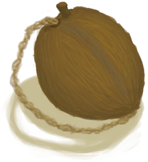

# Weston Special  
  

<b>Base Value: </b> 0 
  

<b>Value Range: </b> 0 ~ 3 
  

<b>Base Rate: </b> - 
  
## Change By  
<table class="table table-bordered" data-toggle="table"  ><thead style=""><tr ><th  style="text-align:left;vertical-align:top;"  >From</th><th  style="text-align:left;vertical-align:top;"  >Operation</th><th  style="text-align:left;vertical-align:top;"  data-sortable="true"  >Value</th></tr></thead><tr ><td  style="text-align:left;vertical-align:top;"  >[

[Weston(Special1e)(Event)](Event_WestonSpecial1e.md)](Event_WestonSpecial1e.md)</td><td  style="text-align:left;vertical-align:top;"  >Continue</td><td  style="text-align:left;vertical-align:top;"  >1</td></tr><tr ><td  style="text-align:left;vertical-align:top;"  >[

[Weston(Special2e)(Event)](Event_WestonSpecial2e.md)](Event_WestonSpecial2e.md)</td><td  style="text-align:left;vertical-align:top;"  >Uhm...</td><td  style="text-align:left;vertical-align:top;"  >1</td></tr><tr ><td  style="text-align:left;vertical-align:top;"  >[

[Ambrosia Flask](CoconutFlaskAmbrosia.md)](CoconutFlaskAmbrosia.md)(未实装)</td><td  style="text-align:left;vertical-align:top;"  >Drink</td><td  style="text-align:left;vertical-align:top;"  >1</td></tr></tbody></table>  
  
## Required By  
<table class="table table-bordered" data-toggle="table"  ><thead style=""><tr ><th  style="text-align:left;vertical-align:top;"  >From</th><th  style="text-align:left;vertical-align:top;"  >Operation</th><th  style="text-align:left;vertical-align:top;"  data-sortable="true"  >Value</th></tr></thead><tr ><td  style="text-align:left;vertical-align:top;"  >[Weston](Weston.md)</td><td  style="text-align:left;vertical-align:top;"  >Do I exist Wes?</td><td  style="text-align:left;vertical-align:top;"  >2</td></tr><tr ><td  style="text-align:left;vertical-align:top;"  >[Weston](Weston.md)</td><td  style="text-align:left;vertical-align:top;"  >Am I God Wes?</td><td  style="text-align:left;vertical-align:top;"  >2</td></tr><tr ><td  style="text-align:left;vertical-align:top;"  >[Weston](Weston.md)</td><td  style="text-align:left;vertical-align:top;"  >I'm ready Wes</td><td  style="text-align:left;vertical-align:top;"  >2</td></tr><tr ><td  style="text-align:left;vertical-align:top;"  >[Weston](Weston.md)</td><td  style="text-align:left;vertical-align:top;"  >Are you real?</td><td  style="text-align:left;vertical-align:top;"  >1</td></tr></tbody></table>  
  

