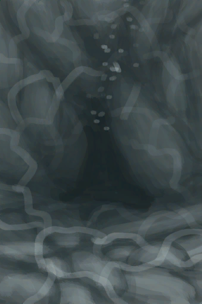
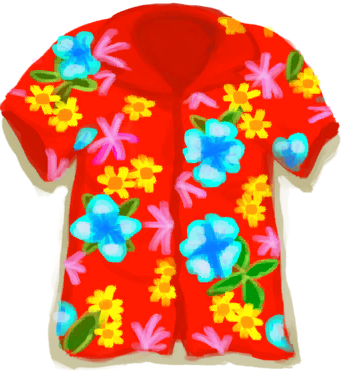

# Wetness  
> Shows how wet you are. Lowers your temperature and fever.  
  

<b>Base Value: </b> 0 
  

<b>Value Range: </b> 0 ~ 100 
  

<b>Base Rate: </b> -20 / /TP 
  
## Statuses  

<table><tr style="height:2em;"><td style="background-color:#F0F0F0;text-align:center;width:180px;font-size:1.4em;font-weight:bold;vertical-align:middle;">
0

0%
</td><td colspan=2 style="font-size:1.1em;vertical-align:middle;background-color:#F9F9F9;">
<b>Dry</b>

</td></tr><tr><td colspan=2></td></tr><tr style="height:2em;"><td style="background-color:#F0F0F0;text-align:center;width:180px;font-size:1.4em;font-weight:bold;vertical-align:middle;">
1 ～ 75

1% ～ 75%
</td><td colspan=2 style="font-size:1.1em;vertical-align:middle;background-color:#F9F9F9;">
<b>

Wet</b>

</td></tr><tr><td colspan=2><b>Effect：</b>[

[Temperature](TemperaturePerceived.md)](TemperaturePerceived.md)<b>-10</b>, [

[Sunburn](Sunburn.md)](Sunburn.md)addition<b>-1</b>, [

[Skin Humidity](SkinHumidity.md)](SkinHumidity.md)addition<b>+8</b></td></tr><tr><td colspan=2></td></tr><tr style="height:2em;"><td style="background-color:#F0F0F0;text-align:center;width:180px;font-size:1.4em;font-weight:bold;vertical-align:middle;">
76 ～ 100

76% ～ 100%
</td><td colspan=2 style="font-size:1.1em;vertical-align:middle;background-color:#F9F9F9;">
<b>

Soaked Wet</b>

</td></tr><tr><td colspan=2><b>Effect：</b>[

[Temperature](TemperaturePerceived.md)](TemperaturePerceived.md)<b>-20</b>, [

[Bacteria Fever](BacteriaFever.md)](BacteriaFever.md)addition<b>+4</b>, [

[Sunburn](Sunburn.md)](Sunburn.md)addition<b>-2</b>, [

[Fever](Fever.md)](Fever.md)<b>-100</b> addition<b>-1.5</b>, [

[Skin Humidity](SkinHumidity.md)](SkinHumidity.md)addition<b>+16</b></td></tr><tr><td colspan=2></td></tr></table>
  
## Related Cards  
[Temperature](TemperaturePerceived.md)  |  [Rain Exposure](RainExposure.md)  
## Addition Change By  
<table class="table table-bordered" data-toggle="table"  ><thead style=""><tr ><th  style="text-align:left;vertical-align:top;"  >From</th><th  style="text-align:left;vertical-align:top;"  >Operation</th><th  style="text-align:left;vertical-align:top;"  >Value</th></tr></thead><tr ><td  style="text-align:left;vertical-align:top;"  >[Tidal Cave](CaveTidal.md)</td><td  style="text-align:left;vertical-align:top;"  >Passive</td><td  style="text-align:left;vertical-align:top;"  >addition+50</td></tr><tr ><td  style="text-align:left;vertical-align:top;"  >[Stove](Stove.md)</td><td  style="text-align:left;vertical-align:top;"  >Passive Effects</td><td  style="text-align:left;vertical-align:top;"  >addition-1</td></tr><tr ><td  style="text-align:left;vertical-align:top;"  >[Smoker](Smoker.md)</td><td  style="text-align:left;vertical-align:top;"  >Passive Effects</td><td  style="text-align:left;vertical-align:top;"  >addition-1</td></tr><tr ><td  style="text-align:left;vertical-align:top;"  >[Smoker](SmokerPlastic.md)</td><td  style="text-align:left;vertical-align:top;"  >Passive Effects</td><td  style="text-align:left;vertical-align:top;"  >addition-1</td></tr><tr ><td  style="text-align:left;vertical-align:top;"  >[Alembic(On)](AlembicOn.md)</td><td  style="text-align:left;vertical-align:top;"  >Passive Effects</td><td  style="text-align:left;vertical-align:top;"  >addition-2</td></tr><tr ><td  style="text-align:left;vertical-align:top;"  >[Campfire](Campfire.md)</td><td  style="text-align:left;vertical-align:top;"  >Passive Effects</td><td  style="text-align:left;vertical-align:top;"  >addition-2</td></tr><tr ><td  style="text-align:left;vertical-align:top;"  >[Clay Fire Pit](ClayFirePit.md)</td><td  style="text-align:left;vertical-align:top;"  >Passive Effects</td><td  style="text-align:left;vertical-align:top;"  >addition-2</td></tr><tr ><td  style="text-align:left;vertical-align:top;"  >[Fire](Fire.md)</td><td  style="text-align:left;vertical-align:top;"  >Passive Effects</td><td  style="text-align:left;vertical-align:top;"  >addition-2</td></tr><tr ><td  style="text-align:left;vertical-align:top;"  >[Gas Cooker(On)](GasCookerOn.md)</td><td  style="text-align:left;vertical-align:top;"  >Passive Effects</td><td  style="text-align:left;vertical-align:top;"  >addition-2</td></tr></tbody></table>  
  
## Change By  
<table class="table table-bordered" data-toggle="table"  ><thead style=""><tr ><th  style="text-align:left;vertical-align:top;"  >From</th><th  style="text-align:left;vertical-align:top;"  >Operation</th><th  style="text-align:left;vertical-align:top;"  >Value</th></tr></thead><tr ><td  style="text-align:left;vertical-align:top;"  >[

[I'm not going to make it....(Event)](Event_SwimFail.md)](Event_SwimFail.md)</td><td  style="text-align:left;vertical-align:top;"  >Swim back</td><td  style="text-align:left;vertical-align:top;"  >200</td></tr><tr ><td  style="text-align:left;vertical-align:top;"  >[

[Secret Cove](Path_BirdRockToCove.md)](Path_BirdRockToCove.md)</td><td  style="text-align:left;vertical-align:top;"  >Swim</td><td  style="text-align:left;vertical-align:top;"  >200 / /TP</td></tr><tr ><td  style="text-align:left;vertical-align:top;"  >[

[Desolate Beach(Bird Rock)](Path_BirdRockToDesolateBeach.md)](Path_BirdRockToDesolateBeach.md)</td><td  style="text-align:left;vertical-align:top;"  >Swim</td><td  style="text-align:left;vertical-align:top;"  >200 / /TP</td></tr><tr ><td  style="text-align:left;vertical-align:top;"  >[

[Rocks(Bird Rock)](Path_BirdRockToRocks.md)](Path_BirdRockToRocks.md)</td><td  style="text-align:left;vertical-align:top;"  >Swim</td><td  style="text-align:left;vertical-align:top;"  >200 / /TP</td></tr><tr ><td  style="text-align:left;vertical-align:top;"  >[

[Bird Rock(Secret Cove)](Path_CoveToBirdRock.md)](Path_CoveToBirdRock.md)</td><td  style="text-align:left;vertical-align:top;"  >Swim</td><td  style="text-align:left;vertical-align:top;"  >200 / /TP</td></tr><tr ><td  style="text-align:left;vertical-align:top;"  >[

[Bird Rock(Desolate Beach)](Path_DesolateBeachToBirdRock.md)](Path_DesolateBeachToBirdRock.md)</td><td  style="text-align:left;vertical-align:top;"  >Swim</td><td  style="text-align:left;vertical-align:top;"  >200 / /TP</td></tr><tr ><td  style="text-align:left;vertical-align:top;"  >[

[Bird Rock](Path_RocksToBirdRock.md)](Path_RocksToBirdRock.md)</td><td  style="text-align:left;vertical-align:top;"  >Swim</td><td  style="text-align:left;vertical-align:top;"  >200 / /TP</td></tr><tr ><td  style="text-align:left;vertical-align:top;"  >[

[Underwater Cave](UnderwaterEntrance.md)](UnderwaterEntrance.md)</td><td  style="text-align:left;vertical-align:top;"  >Enter</td><td  style="text-align:left;vertical-align:top;"  >200</td></tr><tr ><td  style="text-align:left;vertical-align:top;"  >[

[Underwater Exit](UnderwaterExit.md)](UnderwaterExit.md)</td><td  style="text-align:left;vertical-align:top;"  >Exit</td><td  style="text-align:left;vertical-align:top;"  >200</td></tr><tr ><td  style="text-align:left;vertical-align:top;"  >[

[The wind is too strong!(Event)](Event_Flood.md)](Event_Flood.md)(未实装)</td><td  style="text-align:left;vertical-align:top;"  >Take Shelter</td><td  style="text-align:left;vertical-align:top;"  >100</td></tr><tr ><td  style="text-align:left;vertical-align:top;"  >[

[The wind is too strong!(Event)](Event_Storm.md)](Event_Storm.md)</td><td  style="text-align:left;vertical-align:top;"  >Take Shelter</td><td  style="text-align:left;vertical-align:top;"  >100</td></tr><tr ><td  style="text-align:left;vertical-align:top;"  >[

[Tide Pool(Rocks)](TidePool.md)](TidePool.md)</td><td  style="text-align:left;vertical-align:top;"  >Wash yourself</td><td  style="text-align:left;vertical-align:top;"  >100 / /TP</td></tr><tr ><td  style="text-align:left;vertical-align:top;"  >[

[Flooded Tide Pool(Rocks)](TidePoolFlooded.md)](TidePoolFlooded.md)</td><td  style="text-align:left;vertical-align:top;"  >Wash yourself</td><td  style="text-align:left;vertical-align:top;"  >100 / /TP</td></tr><tr ><td  style="text-align:left;vertical-align:top;"  >[

[Water](LQ_Water.md)](LQ_Water.md)</td><td  style="text-align:left;vertical-align:top;"  >Wash Yourself</td><td  style="text-align:left;vertical-align:top;"  >100 / /TP</td></tr><tr ><td  style="text-align:left;vertical-align:top;"  >[

[Salt Water](LQ_WaterSalt.md)](LQ_WaterSalt.md)</td><td  style="text-align:left;vertical-align:top;"  >Wash Yourself</td><td  style="text-align:left;vertical-align:top;"  >100 / /TP</td></tr><tr ><td  style="text-align:left;vertical-align:top;"  >[

[Toxic Water](LQ_WaterToxic.md)](LQ_WaterToxic.md)</td><td  style="text-align:left;vertical-align:top;"  >Wash Yourself</td><td  style="text-align:left;vertical-align:top;"  >100 / /TP</td></tr><tr ><td  style="text-align:left;vertical-align:top;"  >[

[Unsafe Water](LQ_WaterUnsafe.md)](LQ_WaterUnsafe.md)</td><td  style="text-align:left;vertical-align:top;"  >Wash Yourself</td><td  style="text-align:left;vertical-align:top;"  >100 / /TP</td></tr><tr ><td  style="text-align:left;vertical-align:top;"  >[

[Seawater(Flooded Chamber)](Sea_Cave.md)](Sea_Cave.md)</td><td  style="text-align:left;vertical-align:top;"  >Dive</td><td  style="text-align:left;vertical-align:top;"  >100</td></tr><tr ><td  style="text-align:left;vertical-align:top;"  >[

[Seawater(Flooded Chamber)](Sea_Cave.md)](Sea_Cave.md)</td><td  style="text-align:left;vertical-align:top;"  >Wash yourself</td><td  style="text-align:left;vertical-align:top;"  >100 / /TP</td></tr><tr ><td  style="text-align:left;vertical-align:top;"  >[

[Sea(Atoll)](Sea_Atoll.md)](Sea_Atoll.md)</td><td  style="text-align:left;vertical-align:top;"  >Dive</td><td  style="text-align:left;vertical-align:top;"  >100</td></tr><tr ><td  style="text-align:left;vertical-align:top;"  >[

[Sea(Atoll)](Sea_Atoll.md)](Sea_Atoll.md)</td><td  style="text-align:left;vertical-align:top;"  >Wash yourself</td><td  style="text-align:left;vertical-align:top;"  >100 / /TP</td></tr><tr ><td  style="text-align:left;vertical-align:top;"  >[

[Sea(Bay)](Sea_Bay.md)](Sea_Bay.md)</td><td  style="text-align:left;vertical-align:top;"  >Dive</td><td  style="text-align:left;vertical-align:top;"  >100</td></tr><tr ><td  style="text-align:left;vertical-align:top;"  >[

[Sea(Bay)](Sea_Bay.md)](Sea_Bay.md)</td><td  style="text-align:left;vertical-align:top;"  >Wash yourself</td><td  style="text-align:left;vertical-align:top;"  >100 / /TP</td></tr><tr ><td  style="text-align:left;vertical-align:top;"  >[

[Sea(Beach)](Sea_Beach.md)](Sea_Beach.md)</td><td  style="text-align:left;vertical-align:top;"  >Dive</td><td  style="text-align:left;vertical-align:top;"  >100</td></tr><tr ><td  style="text-align:left;vertical-align:top;"  >[

[Sea(Beach)](Sea_Beach.md)](Sea_Beach.md)</td><td  style="text-align:left;vertical-align:top;"  >Wash yourself</td><td  style="text-align:left;vertical-align:top;"  >100 / /TP</td></tr><tr ><td  style="text-align:left;vertical-align:top;"  >[

[Sea(Secret Cove)](Sea_Cove.md)](Sea_Cove.md)</td><td  style="text-align:left;vertical-align:top;"  >Dive</td><td  style="text-align:left;vertical-align:top;"  >100</td></tr><tr ><td  style="text-align:left;vertical-align:top;"  >[

[Sea(Secret Cove)](Sea_Cove.md)](Sea_Cove.md)</td><td  style="text-align:left;vertical-align:top;"  >Wash yourself</td><td  style="text-align:left;vertical-align:top;"  >100 / /TP</td></tr><tr ><td  style="text-align:left;vertical-align:top;"  >[

[Sea(Desolate Beach)](Sea_DesolateBeach.md)](Sea_DesolateBeach.md)</td><td  style="text-align:left;vertical-align:top;"  >Dive</td><td  style="text-align:left;vertical-align:top;"  >100</td></tr><tr ><td  style="text-align:left;vertical-align:top;"  >[

[Sea(Desolate Beach)](Sea_DesolateBeach.md)](Sea_DesolateBeach.md)</td><td  style="text-align:left;vertical-align:top;"  >Wash yourself</td><td  style="text-align:left;vertical-align:top;"  >100 / /TP</td></tr><tr ><td  style="text-align:left;vertical-align:top;"  >[

[Sea(Mangrove Forest)](Sea_Mangroves.md)](Sea_Mangroves.md)</td><td  style="text-align:left;vertical-align:top;"  >Dive</td><td  style="text-align:left;vertical-align:top;"  >100</td></tr><tr ><td  style="text-align:left;vertical-align:top;"  >[

[Sea(Mangrove Forest)](Sea_Mangroves.md)](Sea_Mangroves.md)</td><td  style="text-align:left;vertical-align:top;"  >Wash yourself</td><td  style="text-align:left;vertical-align:top;"  >100 / /TP</td></tr><tr ><td  style="text-align:left;vertical-align:top;"  >[

[Sea](Sea_Raft.md)](Sea_Raft.md)</td><td  style="text-align:left;vertical-align:top;"  >Dive</td><td  style="text-align:left;vertical-align:top;"  >100 / /TP</td></tr><tr ><td  style="text-align:left;vertical-align:top;"  >[

[Sea](Sea_Raft.md)](Sea_Raft.md)</td><td  style="text-align:left;vertical-align:top;"  >Wash yourself</td><td  style="text-align:left;vertical-align:top;"  >100 / /TP</td></tr><tr ><td  style="text-align:left;vertical-align:top;"  >[

[Sea(Bird Rock)](Sea_Rocks.md)](Sea_Rocks.md)</td><td  style="text-align:left;vertical-align:top;"  >Dive</td><td  style="text-align:left;vertical-align:top;"  >100</td></tr><tr ><td  style="text-align:left;vertical-align:top;"  >[

[Sea(Bird Rock)](Sea_Rocks.md)](Sea_Rocks.md)</td><td  style="text-align:left;vertical-align:top;"  >Wash yourself</td><td  style="text-align:left;vertical-align:top;"  >100 / /TP</td></tr><tr ><td  style="text-align:left;vertical-align:top;"  >[

[Shipwreck(Bird Rock)](Shipwreck.md)](Shipwreck.md)</td><td  style="text-align:left;vertical-align:top;"  >Explore the shipwreck</td><td  style="text-align:left;vertical-align:top;"  >100</td></tr><tr ><td  style="text-align:left;vertical-align:top;"  >[

[Shower](Shower.md)](Shower.md)</td><td  style="text-align:left;vertical-align:top;"  >Take a Shower</td><td  style="text-align:left;vertical-align:top;"  >100 / /TP</td></tr><tr ><td  style="text-align:left;vertical-align:top;"  >[

[Sea(Atoll)](Sea_Atoll.md)](Sea_Atoll.md)</td><td  style="text-align:left;vertical-align:top;"  >Spear Fish ** With：**[“Spear T1”](tag_Spear.md)</td><td  style="text-align:left;vertical-align:top;"  >60</td></tr><tr ><td  style="text-align:left;vertical-align:top;"  >[

[Sea(Bay)](Sea_Bay.md)](Sea_Bay.md)</td><td  style="text-align:left;vertical-align:top;"  >Spear Fish ** With：**[“Spear T1”](tag_Spear.md)</td><td  style="text-align:left;vertical-align:top;"  >60</td></tr><tr ><td  style="text-align:left;vertical-align:top;"  >[

[Sea(Beach)](Sea_Beach.md)](Sea_Beach.md)</td><td  style="text-align:left;vertical-align:top;"  >Spear Fish ** With：**[“Spear T1”](tag_Spear.md)</td><td  style="text-align:left;vertical-align:top;"  >60</td></tr><tr ><td  style="text-align:left;vertical-align:top;"  >[

[Sea(Secret Cove)](Sea_Cove.md)](Sea_Cove.md)</td><td  style="text-align:left;vertical-align:top;"  >Spear Fish ** With：**[“Spear T1”](tag_Spear.md)</td><td  style="text-align:left;vertical-align:top;"  >60</td></tr><tr ><td  style="text-align:left;vertical-align:top;"  >[

[Sea(Desolate Beach)](Sea_DesolateBeach.md)](Sea_DesolateBeach.md)</td><td  style="text-align:left;vertical-align:top;"  >Spear Fish ** With：**[“Spear T1”](tag_Spear.md)</td><td  style="text-align:left;vertical-align:top;"  >60</td></tr><tr ><td  style="text-align:left;vertical-align:top;"  >[

[Sea(Mangrove Forest)](Sea_Mangroves.md)](Sea_Mangroves.md)</td><td  style="text-align:left;vertical-align:top;"  >Spear Fish ** With：**[“Spear T1”](tag_Spear.md)</td><td  style="text-align:left;vertical-align:top;"  >60</td></tr><tr ><td  style="text-align:left;vertical-align:top;"  >[

[Sea](Sea_Raft.md)](Sea_Raft.md)</td><td  style="text-align:left;vertical-align:top;"  >Spear Fish ** With：**[Harpoon](HarpoonBone.md)</td><td  style="text-align:left;vertical-align:top;"  >60</td></tr><tr ><td  style="text-align:left;vertical-align:top;"  >[

[Sea(Bird Rock)](Sea_Rocks.md)](Sea_Rocks.md)</td><td  style="text-align:left;vertical-align:top;"  >Spear Fish ** With：**[“Spear T1”](tag_Spear.md)</td><td  style="text-align:left;vertical-align:top;"  >60</td></tr><tr ><td  style="text-align:left;vertical-align:top;"  >[

[Hoodie](HoodieRetromation.md)](HoodieRetromation.md)</td><td  style="text-align:left;vertical-align:top;"  >Passive</td><td  style="text-align:left;vertical-align:top;"  >50</td></tr><tr ><td  style="text-align:left;vertical-align:top;"  >[

[Shirt](ShirtFiber.md)](ShirtFiber.md)</td><td  style="text-align:left;vertical-align:top;"  >Passive</td><td  style="text-align:left;vertical-align:top;"  >50</td></tr><tr ><td  style="text-align:left;vertical-align:top;"  >[

[T-Shirt](T-Shirt.md)](T-Shirt.md)</td><td  style="text-align:left;vertical-align:top;"  >Passive</td><td  style="text-align:left;vertical-align:top;"  >50</td></tr><tr ><td  style="text-align:left;vertical-align:top;"  >[

[Hawaiian Shirt](HawaiianShirt.md)](HawaiianShirt.md)</td><td  style="text-align:left;vertical-align:top;"  >Passive</td><td  style="text-align:left;vertical-align:top;"  >40</td></tr><tr ><td  style="text-align:left;vertical-align:top;"  >[

[Leather Pants](LeatherPants.md)](LeatherPants.md)</td><td  style="text-align:left;vertical-align:top;"  >Passive</td><td  style="text-align:left;vertical-align:top;"  >40</td></tr><tr ><td  style="text-align:left;vertical-align:top;"  >[

[Military Pants](MilitaryPants.md)](MilitaryPants.md)</td><td  style="text-align:left;vertical-align:top;"  >Passive</td><td  style="text-align:left;vertical-align:top;"  >40</td></tr><tr ><td  style="text-align:left;vertical-align:top;"  >[Cloth Pants](PantsCloth.md)</td><td  style="text-align:left;vertical-align:top;"  >Passive</td><td  style="text-align:left;vertical-align:top;"  >40</td></tr><tr ><td  style="text-align:left;vertical-align:top;"  >[

[Underwear](Underwear.md)](Underwear.md)</td><td  style="text-align:left;vertical-align:top;"  >Passive</td><td  style="text-align:left;vertical-align:top;"  >40</td></tr><tr ><td  style="text-align:left;vertical-align:top;"  >[

[Bee Suit](BeeSuit.md)](BeeSuit.md)</td><td  style="text-align:left;vertical-align:top;"  >Passive</td><td  style="text-align:left;vertical-align:top;"  >20</td></tr><tr ><td  style="text-align:left;vertical-align:top;"  >[

[Foot Wrappings](FootWrappings.md)](FootWrappings.md)</td><td  style="text-align:left;vertical-align:top;"  >Passive</td><td  style="text-align:left;vertical-align:top;"  >20</td></tr><tr ><td  style="text-align:left;vertical-align:top;"  >[

[Hand Wrappings](HandWrappings.md)](HandWrappings.md)</td><td  style="text-align:left;vertical-align:top;"  >Passive</td><td  style="text-align:left;vertical-align:top;"  >20</td></tr><tr ><td  style="text-align:left;vertical-align:top;"  >[

[Survival Hat](HatSurvival.md)](HatSurvival.md)</td><td  style="text-align:left;vertical-align:top;"  >Passive</td><td  style="text-align:left;vertical-align:top;"  >20</td></tr><tr ><td  style="text-align:left;vertical-align:top;"  >[

[Head Wrappings](HeadWrappings.md)](HeadWrappings.md)</td><td  style="text-align:left;vertical-align:top;"  >Passive</td><td  style="text-align:left;vertical-align:top;"  >20</td></tr><tr ><td  style="text-align:left;vertical-align:top;"  >[

[Leather Gloves](LeatherGloves.md)](LeatherGloves.md)</td><td  style="text-align:left;vertical-align:top;"  >Passive</td><td  style="text-align:left;vertical-align:top;"  >20</td></tr><tr ><td  style="text-align:left;vertical-align:top;"  >[

[Makeshift Mask](MaskMakeshift.md)](MaskMakeshift.md)</td><td  style="text-align:left;vertical-align:top;"  >Passive</td><td  style="text-align:left;vertical-align:top;"  >20</td></tr><tr ><td  style="text-align:left;vertical-align:top;"  >[

[Shorts](Shorts.md)](Shorts.md)</td><td  style="text-align:left;vertical-align:top;"  >Passive</td><td  style="text-align:left;vertical-align:top;"  >20</td></tr><tr ><td  style="text-align:left;vertical-align:top;"  >[

[Sneakers](Sneakers.md)](Sneakers.md)</td><td  style="text-align:left;vertical-align:top;"  >Passive</td><td  style="text-align:left;vertical-align:top;"  >20</td></tr><tr ><td  style="text-align:left;vertical-align:top;"  >[

[Socks](Socks.md)](Socks.md)</td><td  style="text-align:left;vertical-align:top;"  >Passive</td><td  style="text-align:left;vertical-align:top;"  >20</td></tr><tr ><td  style="text-align:left;vertical-align:top;"  >[

[Dirt Pile](DirtPile.md)](DirtPile.md)</td><td  style="text-align:left;vertical-align:top;"  >Make Mud ** With：**[“Water”](tag_WaterAny.md)</td><td  style="text-align:left;vertical-align:top;"  >20</td></tr><tr ><td  style="text-align:left;vertical-align:top;"  >[

[Dry Puddle(Wetlands)](Puddle.md)](Puddle.md)</td><td  style="text-align:left;vertical-align:top;"  >Dig up Mud</td><td  style="text-align:left;vertical-align:top;"  >20</td></tr><tr ><td  style="text-align:left;vertical-align:top;"  >[

[Wet Soap](SoapWet.md)](SoapWet.md)</td><td  style="text-align:left;vertical-align:top;"  >Wash yourself</td><td  style="text-align:left;vertical-align:top;"  >15</td></tr><tr ><td  style="text-align:left;vertical-align:top;"  >[

[Leaf Skirt](LeafSKirt.md)](LeafSKirt.md)</td><td  style="text-align:left;vertical-align:top;"  >Passive</td><td  style="text-align:left;vertical-align:top;"  >10</td></tr></tbody></table>  
  
## Required By  
<table class="table table-bordered" data-toggle="table"  ><thead style=""><tr ><th  style="text-align:left;vertical-align:top;"  >From</th><th  style="text-align:left;vertical-align:top;"  >Operation</th><th  style="text-align:left;vertical-align:top;"  data-sortable="true"  >Value</th></tr></thead><tr ><td  style="text-align:left;vertical-align:top;"  >[Seagull Nest](SeagullNest.md)</td><td  style="text-align:left;vertical-align:top;"  >影响</td><td  style="text-align:left;vertical-align:top;"  >1 ~ 100</td></tr></tbody></table>  
  

