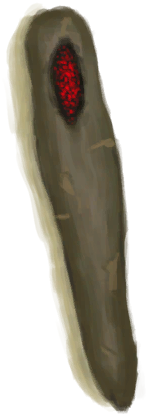
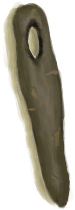

# Burning Wood  
> Embers are carving a hole on this piece of wood.  
  
<table class="table table-bordered" data-toggle="table"  data-show-header="false"><thead style="display:none"><tr ><th  style="width:50%;text-align:left;vertical-align:top;"  >title</th><th  style="width:50%;text-align:left;vertical-align:top;"  ></th></tr></thead><tr ><td  style="width:50%;text-align:left;vertical-align:top;"  >**Weight：**200</td><td  style="width:50%;text-align:left;vertical-align:top;"  >

<a href="WoodBurning.md" style="color:black">Burning Wood</a>

</td></tr></tbody></table>  
  
## Got From  

** With：**[Embers](Embers.md)Burn Hole

[Wood](Wood.md)

  
  
## Durability   

<table style="margin-bottom:0px;"><tr><td style="width:30%;text-align:left; background-color:#FEFEFE;font-size:1.3em;font-weight:bold;">Spoilage</td><td style="font-size:1em;background-color:#FEFEFE">Starting：6 , Max：6 -1/TP , Duration ：1h30m</td></tr><tr style="background-color:#FFFFFF"><td colspan=2>** On Zero：Wood Handle ready! ** Self: → [

[Wood Handle](HandleWood.md)](HandleWood.md)</td></tr></table>
  

