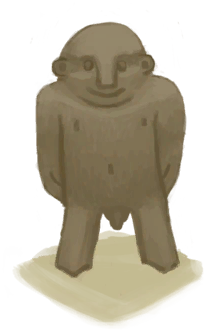

# Man Figure  
> A little wooden man.  
  
<table class="table table-bordered" data-toggle="table"  data-show-header="false"><thead style="display:none"><tr ><th  style="width:50%;text-align:left;vertical-align:top;"  >title</th><th  style="width:50%;text-align:left;vertical-align:top;"  ></th></tr></thead><tr ><td  style="width:50%;text-align:left;vertical-align:top;"  >**Weight：**150  **Tag：**	[“Decoration”](tag_Decoration.md), [“Fuel”](tag_Fuel.md)</td><td  style="width:50%;text-align:left;vertical-align:top;"  >

<a href="WoodCarving_Man.md" style="color:black">Man Figure</a>

Wood Carvings can be made from <b>Wood</b> provided you have enough <b>Woodworking Skill</b>.  Carving Sculptures is a great source of <b>Entertainment</b> and if your skill is high enough you can produce some nice <b>Decorations</b> to display on your shelves and increase your <b>Comfort</b>. </td></tr></tbody></table>  
  
## Got From  

Finished!

[Unfinished Wood Carving](WoodCarving_Unfinished.md)

  
  
## Drag To  

[Alembic(Off)](AlembicOff.md)

[Alembic(On)](AlembicOn.md)

[Campfire](Campfire.md)

[Campfire(Off)](CampfireExtinguished.md)

[Clay Fire Pit](ClayFirePit.md)

[Clay Fire Pit(Off)](ClayFirePitExtinguished.md)

[Fire](Fire.md)

[Fire(Off)](FireExtinguished.md)

[Forge](Forge.md)

[Forge(Off)](ForgeExtinguished.md)

[Kiln](Kiln.md)

[Advanced Kiln](KilnAdvanced.md)

[Advanced Kiln(Off)](KilnAdvancedExtinguished.md)

[Kiln(Off)](KilnExtinguished.md)

[Stove](Stove.md)

[Stove(Off)](StoveExtinguished.md)

  
  

