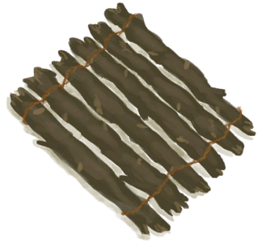

# Tied Wood(未实装)  
> I could make a raft with this.  
  
<table class="table table-bordered" data-toggle="table"  data-show-header="false"><thead style="display:none"><tr ><th  style="width:50%;text-align:left;vertical-align:top;"  >title</th><th  style="width:50%;text-align:left;vertical-align:top;"  ></th></tr></thead><tr ><td  style="width:50%;text-align:left;vertical-align:top;"  >**Weight：**250</td><td  style="width:50%;text-align:left;vertical-align:top;"  >

<a href="WoodTied.md" style="color:black">Tied Wood</a>

</td></tr></tbody></table>  
  
## Drag With  
  

