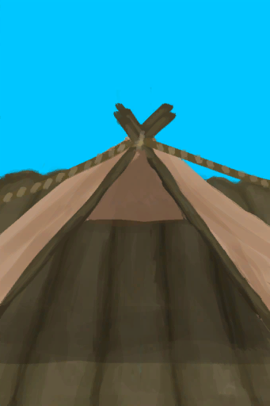
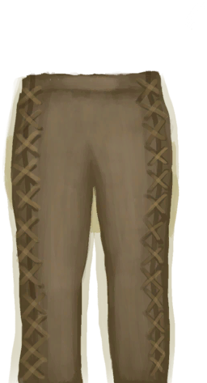
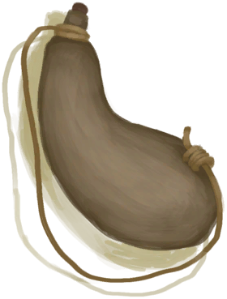

# Wooden Needle  
> Needed to craft more complex cloth and leather items.  
  
<table class="table table-bordered" data-toggle="table"  data-show-header="false"><thead style="display:none"><tr ><th  style="width:50%;text-align:left;vertical-align:top;"  >title</th><th  style="width:50%;text-align:left;vertical-align:top;"  ></th></tr></thead><tr ><td  style="width:50%;text-align:left;vertical-align:top;"  >**Weight：**10  **Usage：**3</td><td  style="width:50%;text-align:left;vertical-align:top;"  >

<a href="WoodenNeedle.md" style="color:black">Wooden Needle</a>

</td></tr></tbody></table>  
  
## Got From  

Craft BluePrint

[Wooden Needles(BluePrint)](Bp_WoodenNeedles.md)

Remove Cord

[Threaded Needle](WoodenNeedleThreaded.md)

Transform

[Threaded Needle](WoodenNeedleThreaded.md)

  
  
## Drag With  

<table style="margin-bottom:0px;"><tr><td style="width:40%;text-align:left; background-color:#FEFEFE"><b>With：</b>[

[Fiber Cord](CordFiber.md)](CordFiber.md)</td><td style="width:40%;font-size:1em;font-weight:bold;background-color:#FEFEFE">Thread (15m) [“HandAction(Group)”](HandAction.md)</td></tr><tr><td colspan="2"><b>Require：</b>[

[Light](Light.md)](Light.md): <b>10-100</b></td></tr><tr style="background-color:#FFFFFF"><td style=""><b>Receiving：</b>→Dismiss</td><td style=""><b>Self：</b>→ [

[Threaded Needle](WoodenNeedleThreaded.md)](WoodenNeedleThreaded.md)</td></tr></table>
  
  
## Use In BluePrint  

<a href="Bp_BedWooden.md" style="color:black">Wooden Bed</a>

<a href="Bp_Cellar.md" style="color:black">Cellar</a>

<a href="Bp_Raft.md" style="color:black">Raft</a>

<a href="Bp_RaftShelter.md" style="color:black">Raft Shelter</a>

<a href="Bp_BeeSuit.md" style="color:black">Bee Suit</a>

<a href="Bp_Bellows.md" style="color:black">Bellows</a>

<a href="Bp_GasMask.md" style="color:black">Gas Mask</a>

<a href="Bp_LeatherBackpack.md" style="color:black">Leather Backpack</a>

<a href="Bp_LeatherGloves.md" style="color:black">Leather Gloves</a>

<a href="Bp_LeatherPants.md" style="color:black">Leather Pants</a>

<a href="Bp_LeatherShoes.md" style="color:black">Leather Shoes</a>

<a href="Bp_Quiver.md" style="color:black">Quiver</a>

<a href="Bp_Raincoat.md" style="color:black">Raincoat</a>

<a href="Bp_Sack.md" style="color:black">Sack</a>

<a href="Bp_Satchel.md" style="color:black">Satchel</a>

<a href="Bp_Shirt.md" style="color:black">Shirt</a>

<a href="Bp_Waterskin.md" style="color:black">Waterskin</a>

  
  
  
## Durability   

<table style="margin-bottom:0px;"><tr><td style="width:30%;text-align:left; background-color:#FEFEFE;font-size:1.3em;font-weight:bold;">

</td><td style="font-size:1em;background-color:#FEFEFE">Starting：3 , Max：3 -</td></tr><tr style="background-color:#FFFFFF"><td colspan=2>** On Zero： ** Self: →Dismiss</td></tr></table>
  

