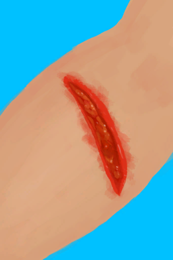

# Wounded  
  

<b>Base Value: </b> 0 
  

<b>Value Range: </b> 0 ~ 1500 
  

<b>Base Rate: </b> - 
  
## Statuses  

<table><tr style="height:2em;"><td style="background-color:#F0F0F0;text-align:center;width:180px;font-size:1.4em;font-weight:bold;vertical-align:middle;">
50 ～ 100

3% ～ 6%
</td><td colspan=2 style="font-size:1.1em;vertical-align:middle;background-color:#F9F9F9;">
<b>

Light Wounds</b>

</td></tr><tr><td colspan=2><b>Effect：</b>[

[Appetite](Appetite.md)](Appetite.md)<b>+25</b></td></tr><tr><td colspan=2></td></tr><tr style="height:2em;"><td style="background-color:#F0F0F0;text-align:center;width:180px;font-size:1.4em;font-weight:bold;vertical-align:middle;">
101 ～ 200

6% ～ 13%
</td><td colspan=2 style="font-size:1.1em;vertical-align:middle;background-color:#F9F9F9;">
<b>

Minor Wounds</b>

</td></tr><tr><td colspan=2><b>Effect：</b>[

[Appetite](Appetite.md)](Appetite.md)<b>+50</b></td></tr><tr><td colspan=2></td></tr><tr style="height:2em;"><td style="background-color:#F0F0F0;text-align:center;width:180px;font-size:1.4em;font-weight:bold;vertical-align:middle;">
201 ～ 600

13% ～ 40%
</td><td colspan=2 style="font-size:1.1em;vertical-align:middle;background-color:#F9F9F9;">
<b>

Moderate Wounds</b>

&nbsp;&nbsp;It hurts!
</td></tr><tr><td colspan=2><b>Effect：</b>[

[Appetite](Appetite.md)](Appetite.md)<b>+100</b></td></tr><tr><td colspan=2></td></tr><tr style="height:2em;"><td style="background-color:#F0F0F0;text-align:center;width:180px;font-size:1.4em;font-weight:bold;vertical-align:middle;">
601 ～ 1000

40% ～ 66%
</td><td colspan=2 style="font-size:1.1em;vertical-align:middle;background-color:#F9F9F9;">
<b>

Serious Wounds</b>

&nbsp;&nbsp;Hurts so much!
</td></tr><tr><td colspan=2><b>Effect：</b>[

[Appetite](Appetite.md)](Appetite.md)<b>+150</b></td></tr><tr><td colspan=2></td></tr><tr style="height:2em;"><td style="background-color:#F0F0F0;text-align:center;width:180px;font-size:1.4em;font-weight:bold;vertical-align:middle;">
1001 ～ 1500

66% ～ 100%
</td><td colspan=2 style="font-size:1.1em;vertical-align:middle;background-color:#F9F9F9;">
<b>

Extreme Wounds</b>

&nbsp;&nbsp;Arghhh!!!
</td></tr><tr><td colspan=2><b>Effect：</b>[

[Appetite](Appetite.md)](Appetite.md)<b>+200</b></td></tr><tr><td colspan=2></td></tr></table>
  
## Related Cards  
[Burns](Burns.md)  
## Change By  
<table class="table table-bordered" data-toggle="table"  ><thead style=""><tr ><th  style="text-align:left;vertical-align:top;"  >From</th><th  style="text-align:left;vertical-align:top;"  >Operation</th><th  style="text-align:left;vertical-align:top;"  data-sortable="true"  >Value</th></tr></thead><tr ><td  style="text-align:left;vertical-align:top;"  >[

[Arm Fracture](W_ArmFractureL.md)](W_ArmFractureL.md)</td><td  style="text-align:left;vertical-align:top;"  >Passive</td><td  style="text-align:left;vertical-align:top;"  >750</td></tr><tr ><td  style="text-align:left;vertical-align:top;"  >[

[Arm Fracture](W_ArmFractureR.md)](W_ArmFractureR.md)</td><td  style="text-align:left;vertical-align:top;"  >Passive</td><td  style="text-align:left;vertical-align:top;"  >750</td></tr><tr ><td  style="text-align:left;vertical-align:top;"  >[

[Arm Laceration](W_ArmLacerationL.md)](W_ArmLacerationL.md)</td><td  style="text-align:left;vertical-align:top;"  >Passive</td><td  style="text-align:left;vertical-align:top;"  >750</td></tr><tr ><td  style="text-align:left;vertical-align:top;"  >[

[Arm Laceration](W_ArmLacerationR.md)](W_ArmLacerationR.md)</td><td  style="text-align:left;vertical-align:top;"  >Passive</td><td  style="text-align:left;vertical-align:top;"  >750</td></tr><tr ><td  style="text-align:left;vertical-align:top;"  >[

[Arm Laceration](W_ArmLacerationRStitched.md)](W_ArmLacerationRStitched.md)</td><td  style="text-align:left;vertical-align:top;"  >Passive</td><td  style="text-align:left;vertical-align:top;"  >750</td></tr><tr ><td  style="text-align:left;vertical-align:top;"  >[

[Leg Fracture](W_LegFractureL.md)](W_LegFractureL.md)</td><td  style="text-align:left;vertical-align:top;"  >Passive</td><td  style="text-align:left;vertical-align:top;"  >750</td></tr><tr ><td  style="text-align:left;vertical-align:top;"  >[

[Leg Fracture](W_LegFractureR.md)](W_LegFractureR.md)</td><td  style="text-align:left;vertical-align:top;"  >Passive</td><td  style="text-align:left;vertical-align:top;"  >750</td></tr><tr ><td  style="text-align:left;vertical-align:top;"  >[

[Leg Laceration](W_LegLacerationL.md)](W_LegLacerationL.md)</td><td  style="text-align:left;vertical-align:top;"  >Passive</td><td  style="text-align:left;vertical-align:top;"  >750</td></tr><tr ><td  style="text-align:left;vertical-align:top;"  >[

[Leg Laceration](W_LegLacerationR.md)](W_LegLacerationR.md)</td><td  style="text-align:left;vertical-align:top;"  >Passive</td><td  style="text-align:left;vertical-align:top;"  >750</td></tr><tr ><td  style="text-align:left;vertical-align:top;"  >[

[Stitched Arm Laceration](W_ArmLacerationLStitched.md)](W_ArmLacerationLStitched.md)</td><td  style="text-align:left;vertical-align:top;"  >Passive</td><td  style="text-align:left;vertical-align:top;"  >500</td></tr><tr ><td  style="text-align:left;vertical-align:top;"  >[

[Arm Laceration](W_ArmLacerationRStitched.md)](W_ArmLacerationRStitched.md)</td><td  style="text-align:left;vertical-align:top;"  >Passive</td><td  style="text-align:left;vertical-align:top;"  >500</td></tr><tr ><td  style="text-align:left;vertical-align:top;"  >[

[Leg Laceration](W_LegLacerationLStitched.md)](W_LegLacerationLStitched.md)</td><td  style="text-align:left;vertical-align:top;"  >Passive</td><td  style="text-align:left;vertical-align:top;"  >500</td></tr><tr ><td  style="text-align:left;vertical-align:top;"  >[

[Leg Laceration](W_LegLacerationRStitched.md)](W_LegLacerationRStitched.md)</td><td  style="text-align:left;vertical-align:top;"  >Passive</td><td  style="text-align:left;vertical-align:top;"  >500</td></tr><tr ><td  style="text-align:left;vertical-align:top;"  >[

[Lizard Bite](W_MonitorBite.md)](W_MonitorBite.md)</td><td  style="text-align:left;vertical-align:top;"  >Passive</td><td  style="text-align:left;vertical-align:top;"  >400</td></tr><tr ><td  style="text-align:left;vertical-align:top;"  >[

[Shark Bite](W_SharkBite.md)](W_SharkBite.md)</td><td  style="text-align:left;vertical-align:top;"  >Passive</td><td  style="text-align:left;vertical-align:top;"  >400</td></tr><tr ><td  style="text-align:left;vertical-align:top;"  >[

[Stitched Arm Laceration](W_ArmLacerationLStitched.md)](W_ArmLacerationLStitched.md)</td><td  style="text-align:left;vertical-align:top;"  >Passive</td><td  style="text-align:left;vertical-align:top;"  >350</td></tr><tr ><td  style="text-align:left;vertical-align:top;"  >[

[Leg Laceration](W_LegLacerationLStitched.md)](W_LegLacerationLStitched.md)</td><td  style="text-align:left;vertical-align:top;"  >Passive</td><td  style="text-align:left;vertical-align:top;"  >350</td></tr><tr ><td  style="text-align:left;vertical-align:top;"  >[

[Leg Laceration](W_LegLacerationRStitched.md)](W_LegLacerationRStitched.md)</td><td  style="text-align:left;vertical-align:top;"  >Passive</td><td  style="text-align:left;vertical-align:top;"  >350</td></tr><tr ><td  style="text-align:left;vertical-align:top;"  >[

[Arm Fracture](W_ArmFractureL.md)](W_ArmFractureL.md)</td><td  style="text-align:left;vertical-align:top;"  >Passive</td><td  style="text-align:left;vertical-align:top;"  >250</td></tr><tr ><td  style="text-align:left;vertical-align:top;"  >[

[Arm Fracture](W_ArmFractureR.md)](W_ArmFractureR.md)</td><td  style="text-align:left;vertical-align:top;"  >Passive</td><td  style="text-align:left;vertical-align:top;"  >250</td></tr><tr ><td  style="text-align:left;vertical-align:top;"  >[

[Arm Laceration](W_ArmLacerationL.md)](W_ArmLacerationL.md)</td><td  style="text-align:left;vertical-align:top;"  >Passive</td><td  style="text-align:left;vertical-align:top;"  >250</td></tr><tr ><td  style="text-align:left;vertical-align:top;"  >[

[Arm Laceration](W_ArmLacerationR.md)](W_ArmLacerationR.md)</td><td  style="text-align:left;vertical-align:top;"  >Passive</td><td  style="text-align:left;vertical-align:top;"  >250</td></tr><tr ><td  style="text-align:left;vertical-align:top;"  >[

[Arm Laceration](W_ArmLacerationRStitched.md)](W_ArmLacerationRStitched.md)</td><td  style="text-align:left;vertical-align:top;"  >Passive</td><td  style="text-align:left;vertical-align:top;"  >250</td></tr><tr ><td  style="text-align:left;vertical-align:top;"  >[

[Sprained Wrist](W_ArmSprainedL.md)](W_ArmSprainedL.md)</td><td  style="text-align:left;vertical-align:top;"  >Passive</td><td  style="text-align:left;vertical-align:top;"  >250</td></tr><tr ><td  style="text-align:left;vertical-align:top;"  >[

[Sprained Wrist](W_ArmSprainedR.md)](W_ArmSprainedR.md)</td><td  style="text-align:left;vertical-align:top;"  >Passive</td><td  style="text-align:left;vertical-align:top;"  >250</td></tr><tr ><td  style="text-align:left;vertical-align:top;"  >[

[Leg Fracture](W_LegFractureL.md)](W_LegFractureL.md)</td><td  style="text-align:left;vertical-align:top;"  >Passive</td><td  style="text-align:left;vertical-align:top;"  >250</td></tr><tr ><td  style="text-align:left;vertical-align:top;"  >[

[Leg Fracture](W_LegFractureR.md)](W_LegFractureR.md)</td><td  style="text-align:left;vertical-align:top;"  >Passive</td><td  style="text-align:left;vertical-align:top;"  >250</td></tr><tr ><td  style="text-align:left;vertical-align:top;"  >[

[Leg Laceration](W_LegLacerationL.md)](W_LegLacerationL.md)</td><td  style="text-align:left;vertical-align:top;"  >Passive</td><td  style="text-align:left;vertical-align:top;"  >250</td></tr><tr ><td  style="text-align:left;vertical-align:top;"  >[

[Leg Laceration](W_LegLacerationR.md)](W_LegLacerationR.md)</td><td  style="text-align:left;vertical-align:top;"  >Passive</td><td  style="text-align:left;vertical-align:top;"  >250</td></tr><tr ><td  style="text-align:left;vertical-align:top;"  >[

[Sprained Ankle](W_LegSprainedL.md)](W_LegSprainedL.md)</td><td  style="text-align:left;vertical-align:top;"  >Passive</td><td  style="text-align:left;vertical-align:top;"  >250</td></tr><tr ><td  style="text-align:left;vertical-align:top;"  >[

[Sprained Ankle](W_LegSprainedR.md)](W_LegSprainedR.md)</td><td  style="text-align:left;vertical-align:top;"  >Passive</td><td  style="text-align:left;vertical-align:top;"  >250</td></tr><tr ><td  style="text-align:left;vertical-align:top;"  >[

[Seahound Sting](W_SeahoundSting.md)](W_SeahoundSting.md)</td><td  style="text-align:left;vertical-align:top;"  >Passive</td><td  style="text-align:left;vertical-align:top;"  >250</td></tr><tr ><td  style="text-align:left;vertical-align:top;"  >[

[Lizard Bite](W_MonitorBite.md)](W_MonitorBite.md)</td><td  style="text-align:left;vertical-align:top;"  >Passive</td><td  style="text-align:left;vertical-align:top;"  >150</td></tr><tr ><td  style="text-align:left;vertical-align:top;"  >[

[Shark Bite](W_SharkBite.md)](W_SharkBite.md)</td><td  style="text-align:left;vertical-align:top;"  >Passive</td><td  style="text-align:left;vertical-align:top;"  >150</td></tr><tr ><td  style="text-align:left;vertical-align:top;"  >[

[Stitched Arm Laceration](W_ArmLacerationLStitched.md)](W_ArmLacerationLStitched.md)</td><td  style="text-align:left;vertical-align:top;"  >Passive</td><td  style="text-align:left;vertical-align:top;"  >125</td></tr><tr ><td  style="text-align:left;vertical-align:top;"  >[

[Leg Laceration](W_LegLacerationLStitched.md)](W_LegLacerationLStitched.md)</td><td  style="text-align:left;vertical-align:top;"  >Passive</td><td  style="text-align:left;vertical-align:top;"  >125</td></tr><tr ><td  style="text-align:left;vertical-align:top;"  >[

[Leg Laceration](W_LegLacerationRStitched.md)](W_LegLacerationRStitched.md)</td><td  style="text-align:left;vertical-align:top;"  >Passive</td><td  style="text-align:left;vertical-align:top;"  >125</td></tr><tr ><td  style="text-align:left;vertical-align:top;"  >[

[Abrasion](W_Abrasion.md)](W_Abrasion.md)</td><td  style="text-align:left;vertical-align:top;"  >Passive</td><td  style="text-align:left;vertical-align:top;"  >100</td></tr><tr ><td  style="text-align:left;vertical-align:top;"  >[

[Sprained Wrist](W_ArmSprainedL.md)](W_ArmSprainedL.md)</td><td  style="text-align:left;vertical-align:top;"  >Passive</td><td  style="text-align:left;vertical-align:top;"  >100</td></tr><tr ><td  style="text-align:left;vertical-align:top;"  >[

[Sprained Wrist](W_ArmSprainedR.md)](W_ArmSprainedR.md)</td><td  style="text-align:left;vertical-align:top;"  >Passive</td><td  style="text-align:left;vertical-align:top;"  >100</td></tr><tr ><td  style="text-align:left;vertical-align:top;"  >[

[Dog Bite](W_DogBite.md)](W_DogBite.md)</td><td  style="text-align:left;vertical-align:top;"  >Passive</td><td  style="text-align:left;vertical-align:top;"  >100</td></tr><tr ><td  style="text-align:left;vertical-align:top;"  >[

[Sprained Ankle](W_LegSprainedL.md)](W_LegSprainedL.md)</td><td  style="text-align:left;vertical-align:top;"  >Passive</td><td  style="text-align:left;vertical-align:top;"  >100</td></tr><tr ><td  style="text-align:left;vertical-align:top;"  >[

[Sprained Ankle](W_LegSprainedR.md)](W_LegSprainedR.md)</td><td  style="text-align:left;vertical-align:top;"  >Passive</td><td  style="text-align:left;vertical-align:top;"  >100</td></tr><tr ><td  style="text-align:left;vertical-align:top;"  >[

[Macaque Bite](W_MacaqueBite.md)](W_MacaqueBite.md)</td><td  style="text-align:left;vertical-align:top;"  >Passive</td><td  style="text-align:left;vertical-align:top;"  >100</td></tr><tr ><td  style="text-align:left;vertical-align:top;"  >[

[Minor Laceration](W_MinorLaceration.md)](W_MinorLaceration.md)</td><td  style="text-align:left;vertical-align:top;"  >Passive</td><td  style="text-align:left;vertical-align:top;"  >100</td></tr><tr ><td  style="text-align:left;vertical-align:top;"  >[

[Seahound Sting](W_SeahoundSting.md)](W_SeahoundSting.md)</td><td  style="text-align:left;vertical-align:top;"  >Passive</td><td  style="text-align:left;vertical-align:top;"  >100</td></tr><tr ><td  style="text-align:left;vertical-align:top;"  >[

[Spider Bite](W_SpiderBite.md)](W_SpiderBite.md)</td><td  style="text-align:left;vertical-align:top;"  >Passive</td><td  style="text-align:left;vertical-align:top;"  >100</td></tr><tr ><td  style="text-align:left;vertical-align:top;"  >[

[Urchin Wound](W_UrchinWound.md)](W_UrchinWound.md)</td><td  style="text-align:left;vertical-align:top;"  >Passive</td><td  style="text-align:left;vertical-align:top;"  >100</td></tr><tr ><td  style="text-align:left;vertical-align:top;"  >[

[Urchin Wound](W_UrchinWoundSpines.md)](W_UrchinWoundSpines.md)</td><td  style="text-align:left;vertical-align:top;"  >Passive</td><td  style="text-align:left;vertical-align:top;"  >100</td></tr><tr ><td  style="text-align:left;vertical-align:top;"  >[

[Minor Laceration](W_MinorLacerationStitched.md)](W_MinorLacerationStitched.md)</td><td  style="text-align:left;vertical-align:top;"  >Passive</td><td  style="text-align:left;vertical-align:top;"  >50</td></tr><tr ><td  style="text-align:left;vertical-align:top;"  >[

[Abrasion](W_Abrasion.md)](W_Abrasion.md)</td><td  style="text-align:left;vertical-align:top;"  >Passive</td><td  style="text-align:left;vertical-align:top;"  >25</td></tr><tr ><td  style="text-align:left;vertical-align:top;"  >[

[Dog Bite](W_DogBite.md)](W_DogBite.md)</td><td  style="text-align:left;vertical-align:top;"  >Passive</td><td  style="text-align:left;vertical-align:top;"  >25</td></tr><tr ><td  style="text-align:left;vertical-align:top;"  >[

[Macaque Bite](W_MacaqueBite.md)](W_MacaqueBite.md)</td><td  style="text-align:left;vertical-align:top;"  >Passive</td><td  style="text-align:left;vertical-align:top;"  >25</td></tr><tr ><td  style="text-align:left;vertical-align:top;"  >[

[Minor Laceration](W_MinorLaceration.md)](W_MinorLaceration.md)</td><td  style="text-align:left;vertical-align:top;"  >Passive</td><td  style="text-align:left;vertical-align:top;"  >25</td></tr><tr ><td  style="text-align:left;vertical-align:top;"  >[

[Urchin Wound](W_UrchinWound.md)](W_UrchinWound.md)</td><td  style="text-align:left;vertical-align:top;"  >Passive</td><td  style="text-align:left;vertical-align:top;"  >25</td></tr><tr ><td  style="text-align:left;vertical-align:top;"  >[

[Minor Laceration](W_MinorLacerationStitched.md)](W_MinorLacerationStitched.md)</td><td  style="text-align:left;vertical-align:top;"  >Passive</td><td  style="text-align:left;vertical-align:top;"  >10</td></tr><tr ><td  style="text-align:left;vertical-align:top;"  >[

[Spider Bite](W_SpiderBite.md)](W_SpiderBite.md)</td><td  style="text-align:left;vertical-align:top;"  >Passive</td><td  style="text-align:left;vertical-align:top;"  >10</td></tr></tbody></table>  
  

