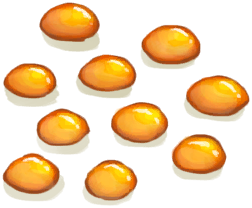
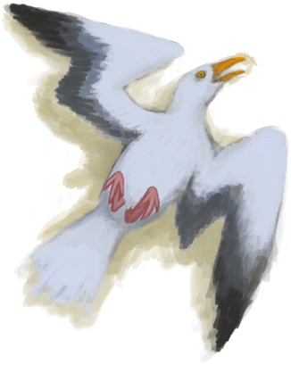
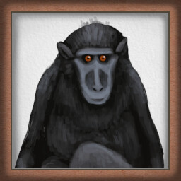
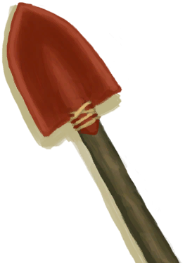
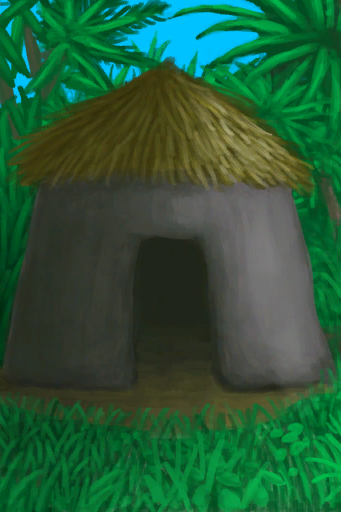
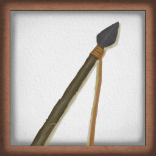
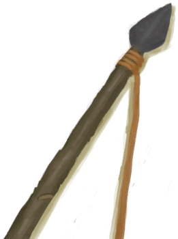

# Achievement  
  

<table style="margin-bottom:0px;"><tr><td rowspan=3 style="width:120px"></td><td style="font-size:1.3em"><b>Irresistible</b></td></tr><tr><td>"Get bitten by a shark</tr><tr><td><b>Require：</b>

[

[Shark Bite](W_SharkBite.md)](W_SharkBite.md)x1&nbsp;&nbsp;&nbsp;&nbsp;[

[Macaque Bite](W_MacaqueBite.md)](W_MacaqueBite.md)x1&nbsp;&nbsp;&nbsp;&nbsp;[

[Lizard Bite](W_MonitorBite.md)](W_MonitorBite.md)x1

  
  
</td></tr></table>
  

<table style="margin-bottom:0px;"><tr><td rowspan=3 style="width:120px"></td><td style="font-size:1.3em"><b>Not The Bees!</b></td></tr><tr><td>Get swarmed by bees</tr><tr><td><b>Require：</b>

Not the Bees! [

[A Bee Swarm!(Event)](Event_BeesSwarming.md)](Event_BeesSwarming.md)

  
  
</td></tr></table>
  

<table style="margin-bottom:0px;"><tr><td rowspan=3 style="width:120px"></td><td style="font-size:1.3em"><b>Complete Collection</b></td></tr><tr><td>Carve 5 different wooden figurines</tr><tr><td><b>Require：</b>

[

[Goat Figure](WoodCarving_Goat.md)](WoodCarving_Goat.md)x1&nbsp;&nbsp;&nbsp;&nbsp;[

[Man Figure](WoodCarving_Man.md)](WoodCarving_Man.md)x1&nbsp;&nbsp;&nbsp;&nbsp;[

[Spirit Figure](WoodCarving_Monster.md)](WoodCarving_Monster.md)x1&nbsp;&nbsp;&nbsp;&nbsp;[

[Seagull Figure](WoodCarving_Seagull.md)](WoodCarving_Seagull.md)x1&nbsp;&nbsp;&nbsp;&nbsp;[

[Woman Figure](WoodCarving_Woman.md)](WoodCarving_Woman.md)x1

  
  
</td></tr></table>
  

<table style="margin-bottom:0px;"><tr><td rowspan=3 style="width:120px"></td><td style="font-size:1.3em"><b>I Don't Feel So Good...</b></td></tr><tr><td>Catch a fever</tr><tr><td><b>Require：</b>

[

[Fever](Fever.md)](Fever.md): <b>301～999999</b>

  
  
</td></tr></table>
  

<table style="margin-bottom:0px;"><tr><td rowspan=3 style="width:120px"></td><td style="font-size:1.3em"><b>Survivor A La Carte</b></td></tr><tr><td>Create a custom character</tr></table>
  

<table style="margin-bottom:0px;"><tr><td rowspan=3 style="width:120px"></td><td style="font-size:1.3em"><b>Spiritual Victory</b></td></tr><tr><td>Defeat the Hunter</tr><tr><td><b>Require：</b>

[

[The Hunter was defeated!(Event)](Event_HunterFightSuccess.md)](Event_HunterFightSuccess.md)x1

  
  
</td></tr></table>
  

<table style="margin-bottom:0px;"><tr><td rowspan=3 style="width:120px"></td><td style="font-size:1.3em"><b>All Is Love</b></td></tr><tr><td>Get insight from the divine</tr><tr><td><b>Require：</b>

[

[Divine Insight(Event)](Event_GodExperience1a.md)](Event_GodExperience1a.md)x1

  
  
</td></tr></table>
  

<table style="margin-bottom:0px;"><tr><td rowspan=3 style="width:120px"></td><td style="font-size:1.3em"><b>BOOM!</b></td></tr><tr><td>Use Dynamite!</tr><tr><td><b>Require：</b>

Boom! [

[Copper Vein(High Chamber)](CopperVein.md)](CopperVein.md)&nbsp;&nbsp;&nbsp;&nbsp;Boom! [

[Narrow Passage(High Chamber)](CrystalChamberEntranceClosed.md)](CrystalChamberEntranceClosed.md)&nbsp;&nbsp;&nbsp;&nbsp;Boom! [

[Narrow Passage(Damp Chamber)](DarkCaveCaveEntranceClosed.md)](DarkCaveCaveEntranceClosed.md)&nbsp;&nbsp;&nbsp;&nbsp;Boom! [

[Narrow Passage(High Chamber)](DarkChamberCaveEntranceClosed.md)](DarkChamberCaveEntranceClosed.md)&nbsp;&nbsp;&nbsp;&nbsp;Boom! [

[Narrow Passage(High Chamber)](FloodedChamberEntranceClosed.md)](FloodedChamberEntranceClosed.md)&nbsp;&nbsp;&nbsp;&nbsp;Boom! [

[Narrow Passage(Tunnel)](HighChamberEntranceClosed.md)](HighChamberEntranceClosed.md)&nbsp;&nbsp;&nbsp;&nbsp;Boom! [

[Collapsed Tunnel Entrance(Eastern Highlands)](TunnelEntranceClosed.md)](TunnelEntranceClosed.md)&nbsp;&nbsp;&nbsp;&nbsp;Boom! [

[Sea(Atoll)](Sea_Atoll.md)](Sea_Atoll.md)&nbsp;&nbsp;&nbsp;&nbsp;Boom! [

[Sea(Bay)](Sea_Bay.md)](Sea_Bay.md)&nbsp;&nbsp;&nbsp;&nbsp;Boom! [

[Sea(Beach)](Sea_Beach.md)](Sea_Beach.md)&nbsp;&nbsp;&nbsp;&nbsp;Boom! [

[Seawater(Flooded Chamber)](Sea_Cave.md)](Sea_Cave.md)&nbsp;&nbsp;&nbsp;&nbsp;Boom! [

[Sea(Secret Cove)](Sea_Cove.md)](Sea_Cove.md)&nbsp;&nbsp;&nbsp;&nbsp;Boom! [

[Sea(Desolate Beach)](Sea_DesolateBeach.md)](Sea_DesolateBeach.md)&nbsp;&nbsp;&nbsp;&nbsp;Boom! [

[Sea(Mangrove Forest)](Sea_Mangroves.md)](Sea_Mangroves.md)&nbsp;&nbsp;&nbsp;&nbsp;Boom! [

[Sea](Sea_Raft.md)](Sea_Raft.md)&nbsp;&nbsp;&nbsp;&nbsp;Boom! [

[Sea(Bird Rock)](Sea_Rocks.md)](Sea_Rocks.md)&nbsp;&nbsp;&nbsp;&nbsp;Revenge! [

[Macaque Den(Jungle Highlands)](MacaqueDenEntrance.md)](MacaqueDenEntrance.md)

  
  
</td></tr></table>
  

<table style="margin-bottom:0px;"><tr><td rowspan=3 style="width:120px"></td><td style="font-size:1.3em"><b>Island Gourmet</b></td></tr><tr><td>Eat a prepared meal</tr><tr><td><b>Require：</b>

Eat [

[Island Chicken](IslandChicken.md)](IslandChicken.md)&nbsp;&nbsp;&nbsp;&nbsp;Eat [

[Butter Baked Oyster](OysterMeatBaked.md)](OysterMeatBaked.md)&nbsp;&nbsp;&nbsp;&nbsp;Eat [

[Candied Ginger](CandiedGinger.md)](CandiedGinger.md)&nbsp;&nbsp;&nbsp;&nbsp;Eat [

[Fish N' Chips](FishNChips.md)](FishNChips.md)&nbsp;&nbsp;&nbsp;&nbsp;Eat [

[Fish Omelette](FishOmelette.md)](FishOmelette.md)&nbsp;&nbsp;&nbsp;&nbsp;Eat [

[Fried Banana](FriedBanana.md)](FriedBanana.md)&nbsp;&nbsp;&nbsp;&nbsp;Eat [

[Goat Stew](GoatStew.md)](GoatStew.md)&nbsp;&nbsp;&nbsp;&nbsp;Eat [

[Hearty Feast](HeartyFeast.md)](HeartyFeast.md)&nbsp;&nbsp;&nbsp;&nbsp;Eat [

[Honey Candy](HoneyCandy.md)](HoneyCandy.md)&nbsp;&nbsp;&nbsp;&nbsp;Eat [

[Honey Glazed Pork](HoneyGlazedPork.md)](HoneyGlazedPork.md)&nbsp;&nbsp;&nbsp;&nbsp;Eat [

[Lizard Fry](LizardFry.md)](LizardFry.md)&nbsp;&nbsp;&nbsp;&nbsp;Eat [

[Macaque Skewers](MacaqueSkewers.md)](MacaqueSkewers.md)&nbsp;&nbsp;&nbsp;&nbsp;Eat [

[Protein Bar](ProteinBar.md)](ProteinBar.md)&nbsp;&nbsp;&nbsp;&nbsp;Eat [

[Sago Cake](SagoCake.md)](SagoCake.md)&nbsp;&nbsp;&nbsp;&nbsp;Drink [

[Bone Broth](BoneBroth.md)](BoneBroth.md)&nbsp;&nbsp;&nbsp;&nbsp;Eat [

[Yam Curry](YamCurry.md)](YamCurry.md)&nbsp;&nbsp;&nbsp;&nbsp;Eat [

[Yam Jam](YamJam.md)](YamJam.md)&nbsp;&nbsp;&nbsp;&nbsp;Eat [

[Coconut Fish](CoconutFish.md)](CoconutFish.md)

  
  
</td></tr></table>
  

<table style="margin-bottom:0px;"><tr><td rowspan=3 style="width:120px"></td><td style="font-size:1.3em"><b>Welcome to the Island!</b></td></tr><tr><td>Drink and eat from a Coconut</tr><tr><td><b>Require：</b>

Eat [

[Coconut Meat](CoconutMeat.md)](CoconutMeat.md)&nbsp;&nbsp;&nbsp;&nbsp;Drink [

[Coconut Water](LQ_CoconutWater.md)](LQ_CoconutWater.md)

  
  
</td></tr></table>
  

<table style="margin-bottom:0px;"><tr><td rowspan=3 style="width:120px"></td><td style="font-size:1.3em"><b>True Spelunker</b></td></tr><tr><td>Explore the cave system</tr><tr><td><b>Require：</b>

[

[Flooded Chamber(Environment)](Env_FloodedChamber.md)](Env_FloodedChamber.md)x1&nbsp;&nbsp;&nbsp;&nbsp;[

[High Chamber(Environment)](Env_CrystalChamber.md)](Env_CrystalChamber.md)x1&nbsp;&nbsp;&nbsp;&nbsp;[

[High Chamber(Environment)](Env_HighChamber.md)](Env_HighChamber.md)x1&nbsp;&nbsp;&nbsp;&nbsp;[

[Tunnel(Environment)](Env_Tunnel.md)](Env_Tunnel.md)x1&nbsp;&nbsp;&nbsp;&nbsp;[

[High Chamber(Environment)](Env_MidChamber.md)](Env_MidChamber.md)x1&nbsp;&nbsp;&nbsp;&nbsp;[

[Dark Chamber(Environment)](Env_DarkChamber.md)](Env_DarkChamber.md)x1&nbsp;&nbsp;&nbsp;&nbsp;[

[High Chamber(Environment)](Env_LowChamber.md)](Env_LowChamber.md)x1&nbsp;&nbsp;&nbsp;&nbsp;[

[High Chamber(Environment)](Env_NarrowTunnel.md)](Env_NarrowTunnel.md)x1&nbsp;&nbsp;&nbsp;&nbsp;[

[Damp Chamber(Environment)](Env_DampChamber.md)](Env_DampChamber.md)x1&nbsp;&nbsp;&nbsp;&nbsp;[

[Dark Cave(Environment)](Env_CaveDark.md)](Env_CaveDark.md)x1

  
  
</td></tr></table>
  

<table style="margin-bottom:0px;"><tr><td rowspan=3 style="width:120px"></td><td style="font-size:1.3em"><b>True Explorer</b></td></tr><tr><td>Explore the Island</tr><tr><td><b>Require：</b>

[

[Area Explored(Event)](Event_AcidLakeExplored.md)](Event_AcidLakeExplored.md)x1&nbsp;&nbsp;&nbsp;&nbsp;[

[Area Explored(Event)(Bay)](Event_BayExplored.md)](Event_BayExplored.md)x1&nbsp;&nbsp;&nbsp;&nbsp;[

[Area Explored(Event)(Beach)](Event_BeachExplored.md)](Event_BeachExplored.md)x1&nbsp;&nbsp;&nbsp;&nbsp;[

[Area Explored(Event)(Bird Rock)](Event_BirdRockExplored.md)](Event_BirdRockExplored.md)x1&nbsp;&nbsp;&nbsp;&nbsp;[

[Area Explored(Event)](Event_CoveExplored.md)](Event_CoveExplored.md)x1&nbsp;&nbsp;&nbsp;&nbsp;[

[Area Explored(Event)(Jungle)](Event_DeepJungleExplored.md)](Event_DeepJungleExplored.md)x1&nbsp;&nbsp;&nbsp;&nbsp;[

[Area Explored(Event)(Desolate Beach)](Event_DesolateBeachExplored.md)](Event_DesolateBeachExplored.md)x1&nbsp;&nbsp;&nbsp;&nbsp;[

[Area Explored(Event)(Eastern Grasslands)](Event_GrasslandsEExplored.md)](Event_GrasslandsEExplored.md)x1&nbsp;&nbsp;&nbsp;&nbsp;[

[Area Explored(Event)(Western Grasslands)](Event_GrasslandsWExplored.md)](Event_GrasslandsWExplored.md)x1&nbsp;&nbsp;&nbsp;&nbsp;[

[Area Explored(Event)(Eastern Highlands)](Event_HighlandsEExplored.md)](Event_HighlandsEExplored.md)x1&nbsp;&nbsp;&nbsp;&nbsp;[

[Area Explored(Event)(Western Highlands)](Event_HighlandsWExplored.md)](Event_HighlandsWExplored.md)x1&nbsp;&nbsp;&nbsp;&nbsp;[

[Area Explored(Event)](Event_JungleExplored.md)](Event_JungleExplored.md)x1&nbsp;&nbsp;&nbsp;&nbsp;[

[Area Explored(Event)(Jungle Highlands)](Event_JungleHighlandsExplored.md)](Event_JungleHighlandsExplored.md)x1&nbsp;&nbsp;&nbsp;&nbsp;[

[Area Explored(Event)(Mangrove Forest)](Event_MangrovesExplored.md)](Event_MangrovesExplored.md)x1&nbsp;&nbsp;&nbsp;&nbsp;[

[Area Explored(Event)](Event_OutskirtsExplored.md)](Event_OutskirtsExplored.md)x1&nbsp;&nbsp;&nbsp;&nbsp;[

[Area Explored(Event)](Event_RocksExplored.md)](Event_RocksExplored.md)x1&nbsp;&nbsp;&nbsp;&nbsp;[

[Area Explored(Event)(Secret Valley)](Event_SecretValleyExplored.md)](Event_SecretValleyExplored.md)x1&nbsp;&nbsp;&nbsp;&nbsp;[

[Area Explored(Event)](Event_VolcanoExplored.md)](Event_VolcanoExplored.md)x1&nbsp;&nbsp;&nbsp;&nbsp;[

[Area Explored(Event)(Wetlands)](Event_WetlandsExplored.md)](Event_WetlandsExplored.md)x1

  
  
</td></tr></table>
  

<table style="margin-bottom:0px;"><tr><td rowspan=3 style="width:120px"></td><td style="font-size:1.3em"><b>Reflection</b></td></tr><tr><td>Face the Watcher</tr><tr><td><b>Require：</b>

[

[Watcher(Event)](Event_WatchedExperience1gGod.md)](Event_WatchedExperience1gGod.md)x1&nbsp;&nbsp;&nbsp;&nbsp;[

[Watcher(Event)](Event_WatchedExperience1gVoid.md)](Event_WatchedExperience1gVoid.md)x1

  
  
</td></tr></table>
  

<table style="margin-bottom:0px;"><tr><td rowspan=3 style="width:120px"></td><td style="font-size:1.3em"><b>Treasure Hunting</b></td></tr><tr><td>Find a shipwreck</tr><tr><td><b>Require：</b>

[

[Shipwreck(Bird Rock)](Shipwreck.md)](Shipwreck.md)x1

  
  
</td></tr></table>
  

<table style="margin-bottom:0px;"><tr><td rowspan=3 style="width:120px"></td><td style="font-size:1.3em"><b>RIP</b></td></tr><tr><td>Die for the first time</tr><tr><td><b>Require：</b>

Lose a game

  
  
</td></tr></table>
  

<table style="margin-bottom:0px;"><tr><td rowspan=3 style="width:120px"></td><td style="font-size:1.3em"><b>Goat Farmer</b></td></tr><tr><td>Have a goat give birth</tr><tr><td><b>Require：</b>

[

[Juvenile Goat](GoatEnclosureKid.md)](GoatEnclosureKid.md)x1

  
  
</td></tr></table>
  

<table style="margin-bottom:0px;"><tr><td rowspan=3 style="width:120px"></td><td style="font-size:1.3em"><b>Partridge Farmer</b></td></tr><tr><td>Hatch a partridge egg</tr><tr><td><b>Require：</b>

[

[Chick](PartridgeChick.md)](PartridgeChick.md)x1

  
  
</td></tr></table>
  

<table style="margin-bottom:0px;"><tr><td rowspan=3 style="width:120px"></td><td style="font-size:1.3em"><b>Big Game</b></td></tr><tr><td>Hunt a big game animal</tr><tr><td><b>Require：</b>

[

[Boar Carcass](BoarCarcass.md)](BoarCarcass.md)x1&nbsp;&nbsp;&nbsp;&nbsp;[

[Lizard Carcass](MonitorCarcass.md)](MonitorCarcass.md)x1&nbsp;&nbsp;&nbsp;&nbsp;[

[Goat Carcass](GoatCarcassFemale.md)](GoatCarcassFemale.md)x1&nbsp;&nbsp;&nbsp;&nbsp;[

[Goat Carcass](GoatCarcassMale.md)](GoatCarcassMale.md)x1&nbsp;&nbsp;&nbsp;&nbsp;[

[Goat](GoatTiedFemale.md)](GoatTiedFemale.md)x1&nbsp;&nbsp;&nbsp;&nbsp;[

[Male Goat](GoatTiedMale.md)](GoatTiedMale.md)x1

  
  
</td></tr></table>
  

<table style="margin-bottom:0px;"><tr><td rowspan=3 style="width:120px"></td><td style="font-size:1.3em"><b>Small Game</b></td></tr><tr><td>Hunt a small game animal</tr><tr><td><b>Require：</b>

[

[Dead Cobra](CobraDead.md)](CobraDead.md)x1&nbsp;&nbsp;&nbsp;&nbsp;[

[Dead Partridge](PartridgeDead.md)](PartridgeDead.md)x1&nbsp;&nbsp;&nbsp;&nbsp;[

[Dead Seagull](SeagullDead.md)](SeagullDead.md)x1&nbsp;&nbsp;&nbsp;&nbsp;[

[Partridge](PartridgeFemaleLive.md)](PartridgeFemaleLive.md)x1&nbsp;&nbsp;&nbsp;&nbsp;[

[Male Partridge](PartridgeMaleLive.md)](PartridgeMaleLive.md)x1

  
  
</td></tr></table>
  

<table style="margin-bottom:0px;"><tr><td rowspan=3 style="width:120px"></td><td style="font-size:1.3em"><b>Monkey Business</b></td></tr><tr><td>Make a Macaque Friend</tr><tr><td><b>Require：</b>

[

[Macaque Friend](MacaqueFriend.md)](MacaqueFriend.md)x1

  
  
</td></tr></table>
  

<table style="margin-bottom:0px;"><tr><td rowspan=3 style="width:120px"></td><td style="font-size:1.3em"><b>Secret of Fire</b></td></tr><tr><td>Make a Campfire</tr><tr><td><b>Require：</b>

[

[Campfire(Off)](CampfireExtinguished.md)](CampfireExtinguished.md)x1

  
  
</td></tr></table>
  

<table style="margin-bottom:0px;"><tr><td rowspan=3 style="width:120px"></td><td style="font-size:1.3em"><b>Bronze Age</b></td></tr><tr><td>Make a Copper Tool</tr><tr><td><b>Require：</b>

[

[Copper Axe](AxeCopper.md)](AxeCopper.md)x1&nbsp;&nbsp;&nbsp;&nbsp;[

[Copper Knife](KnifeCopper.md)](KnifeCopper.md)x1&nbsp;&nbsp;&nbsp;&nbsp;[

[Copper Shovel](ShovelCopper.md)](ShovelCopper.md)x1

  
  
</td></tr></table>
  

<table style="margin-bottom:0px;"><tr><td rowspan=3 style="width:120px"></td><td style="font-size:1.3em"><b>Homo Habilis</b></td></tr><tr><td>Make a Flint Tool</tr><tr><td><b>Require：</b>

[

[Flint Axe](AxeFlint.md)](AxeFlint.md)x1&nbsp;&nbsp;&nbsp;&nbsp;[

[Flint Knife](KnifeFlint.md)](KnifeFlint.md)x1

  
  
</td></tr></table>
  

<table style="margin-bottom:0px;"><tr><td rowspan=3 style="width:120px"></td><td style="font-size:1.3em"><b>Home Sweet Home</b></td></tr><tr><td>Make a Mud Hut</tr><tr><td><b>Require：</b>

[

[Mud Hut](MudHutEntrance.md)](MudHutEntrance.md)x1

  
  
</td></tr></table>
  

<table style="margin-bottom:0px;"><tr><td rowspan=3 style="width:120px"></td><td style="font-size:1.3em"><b>High Fashion</b></td></tr><tr><td>Make a Pearl Necklace</tr><tr><td><b>Require：</b>

[

[Pearl Necklace](PearlNecklace.md)](PearlNecklace.md)x1

  
  
</td></tr></table>
  

<table style="margin-bottom:0px;"><tr><td rowspan=3 style="width:120px"></td><td style="font-size:1.3em"><b>BFF</b></td></tr><tr><td>Make a friend</tr><tr><td><b>Require：</b>

[

[Weston](Weston.md)](Weston.md)x1

  
  
</td></tr></table>
  

<table style="margin-bottom:0px;"><tr><td rowspan=3 style="width:120px"></td><td style="font-size:1.3em"><b>Master Archer</b></td></tr><tr><td>Max out your archery skill</tr><tr><td><b>Require：</b>

[

[Archery(Skill)](Skill_Archery.md)](Skill_Archery.md): <b>150～999999</b>

  
  
</td></tr></table>
  

<table style="margin-bottom:0px;"><tr><td rowspan=3 style="width:120px"></td><td style="font-size:1.3em"><b>Master Climber</b></td></tr><tr><td>Max out your climbing skill</tr><tr><td><b>Require：</b>

[

[Climbing(Skill)](Skill_Climbing.md)](Skill_Climbing.md): <b>150～999999</b>

  
  
</td></tr></table>
  

<table style="margin-bottom:0px;"><tr><td rowspan=3 style="width:120px"></td><td style="font-size:1.3em"><b>Master Chef</b></td></tr><tr><td>Max out your cooking skill</tr><tr><td><b>Require：</b>

[

[Cooking(Skill)](Skill_Cooking.md)](Skill_Cooking.md): <b>150～999999</b>

  
  
</td></tr></table>
  

<table style="margin-bottom:0px;"><tr><td rowspan=3 style="width:120px"></td><td style="font-size:1.3em"><b>Master Craftsman</b></td></tr><tr><td>Max out your crafting skill</tr><tr><td><b>Require：</b>

[

[Crafting(Skill)](Skill_Crafting.md)](Skill_Crafting.md): <b>150～999999</b>

  
  
</td></tr></table>
  

<table style="margin-bottom:0px;"><tr><td rowspan=3 style="width:120px"></td><td style="font-size:1.3em"><b>Explosive Diarrhoea</b></td></tr><tr><td>Max out your diarrhea stat</tr><tr><td><b>Require：</b>

[

[Stool Liquidity](Diarrhoea.md)](Diarrhoea.md): <b>300～999999</b>

  
  
</td></tr></table>
  

<table style="margin-bottom:0px;"><tr><td rowspan=3 style="width:120px"></td><td style="font-size:1.3em"><b>Master Percussionist</b></td></tr><tr><td>Max out your skill with the drums</tr><tr><td><b>Require：</b>

[

[Percussion(Skill)](Skill_Percussion.md)](Skill_Percussion.md): <b>150～999999</b>

  
  
</td></tr></table>
  

<table style="margin-bottom:0px;"><tr><td rowspan=3 style="width:120px"></td><td style="font-size:1.3em"><b>Master Fisherman</b></td></tr><tr><td>Max out your fishing skill</tr><tr><td><b>Require：</b>

[

[Fishing(Skill)](Skill_Fishing.md)](Skill_Fishing.md): <b>150～999999</b>

  
  
</td></tr></table>
  

<table style="margin-bottom:0px;"><tr><td rowspan=3 style="width:120px"></td><td style="font-size:1.3em"><b>Master Herbologist</b></td></tr><tr><td>Max out your herbology skill</tr><tr><td><b>Require：</b>

[

[Herbology(Skill)](Skill_Herbology.md)](Skill_Herbology.md): <b>150～999999</b>

  
  
</td></tr></table>
  

<table style="margin-bottom:0px;"><tr><td rowspan=3 style="width:120px"></td><td style="font-size:1.3em"><b>Master Knapper</b></td></tr><tr><td>Max out your knapping skill</tr><tr><td><b>Require：</b>

[

[Knapping(Skill)](Skill_Knapping.md)](Skill_Knapping.md): <b>150～999999</b>

  
  
</td></tr></table>
  

<table style="margin-bottom:0px;"><tr><td rowspan=3 style="width:120px"></td><td style="font-size:1.3em"><b>Master Spearman</b></td></tr><tr><td>Max out your spear fighting skill</tr><tr><td><b>Require：</b>

[

[Spear Fighting(Skill)](Skill_SpearFighting.md)](Skill_SpearFighting.md): <b>150～999999</b>

  
  
</td></tr></table>
  

<table style="margin-bottom:0px;"><tr><td rowspan=3 style="width:120px"></td><td style="font-size:1.3em"><b>Master Spearfisher</b></td></tr><tr><td>Max out your spear fishing skill</tr><tr><td><b>Require：</b>

[

[Spear Fishing(Skill)](Skill_SpearFishing.md)](Skill_SpearFishing.md): <b>150～999999</b>

  
  
</td></tr></table>
  

<table style="margin-bottom:0px;"><tr><td rowspan=3 style="width:120px"></td><td style="font-size:1.3em"><b>Master Swimmer</b></td></tr><tr><td>Max out your swimming skill</tr><tr><td><b>Require：</b>

[

[Swimming(Skill)](Skill_Swimming.md)](Skill_Swimming.md): <b>150～999999</b>

  
  
</td></tr></table>
  

<table style="margin-bottom:0px;"><tr><td rowspan=3 style="width:120px"></td><td style="font-size:1.3em"><b>Master Tailor</b></td></tr><tr><td>Max out your tailoring skill</tr><tr><td><b>Require：</b>

[

[Tailoring(Skill)](Skill_Tailoring.md)](Skill_Tailoring.md): <b>150～999999</b>

  
  
</td></tr></table>
  

<table style="margin-bottom:0px;"><tr><td rowspan=3 style="width:120px"></td><td style="font-size:1.3em"><b>Master Trapper</b></td></tr><tr><td>Max out your trapping skill</tr><tr><td><b>Require：</b>

[

[Trapping(Skill)](Skill_Trapping.md)](Skill_Trapping.md): <b>150～999999</b>

  
  
</td></tr></table>
  

<table style="margin-bottom:0px;"><tr><td rowspan=3 style="width:120px"></td><td style="font-size:1.3em"><b>Master Carpenter</b></td></tr><tr><td>Max out your woodworking skill</tr><tr><td><b>Require：</b>

[

[Woodworking(Skill)](Skill_Woodworking.md)](Skill_Woodworking.md): <b>150～999999</b>

  
  
</td></tr></table>
  

<table style="margin-bottom:0px;"><tr><td rowspan=3 style="width:120px"></td><td style="font-size:1.3em"><b>Plants For The Future</b></td></tr><tr><td>Plant a crop</tr><tr><td><b>Require：</b>

[

[Almond Tree Crop Plot](CropPlotAlmondTree.md)](CropPlotAlmondTree.md)x1&nbsp;&nbsp;&nbsp;&nbsp;[

[Aloe Vera Crop Plot](CropPlotAloeVera.md)](CropPlotAloeVera.md)x1&nbsp;&nbsp;&nbsp;&nbsp;[

[Banana Crop Plot](CropPlotBananaTree.md)](CropPlotBananaTree.md)x1&nbsp;&nbsp;&nbsp;&nbsp;[

[Chili Crop Plot](CropPlotChilies.md)](CropPlotChilies.md)x1&nbsp;&nbsp;&nbsp;&nbsp;[

[China Rose Crop Plot](CropPlotChinaRose.md)](CropPlotChinaRose.md)x1&nbsp;&nbsp;&nbsp;&nbsp;[

[Cinchona Crop Plot](CropPlotCinchonaTree.md)](CropPlotCinchonaTree.md)x1&nbsp;&nbsp;&nbsp;&nbsp;[

[Coffee Crop Plot](CropPlotCoffee.md)](CropPlotCoffee.md)x1&nbsp;&nbsp;&nbsp;&nbsp;[

[Ginger Crop Plot](CropPlotGinger.md)](CropPlotGinger.md)x1&nbsp;&nbsp;&nbsp;&nbsp;[

[Jasmine Crop Plot](CropPlotJasmine.md)](CropPlotJasmine.md)x1&nbsp;&nbsp;&nbsp;&nbsp;[

[Kava Crop Plot](CropPlotKava.md)](CropPlotKava.md)x1&nbsp;&nbsp;&nbsp;&nbsp;[

[Lemon Grass Crop Plot](CropPlotLemonGrass.md)](CropPlotLemonGrass.md)x1&nbsp;&nbsp;&nbsp;&nbsp;[

[Mango Crop Plot](CropPlotMangoTree.md)](CropPlotMangoTree.md)x1&nbsp;&nbsp;&nbsp;&nbsp;[

[Nipa Palm Crop Plot](CropPlotNipaPalm.md)](CropPlotNipaPalm.md)x1&nbsp;&nbsp;&nbsp;&nbsp;[

[Palm Bush Crop Plot](CropPlotPalmBush.md)](CropPlotPalmBush.md)x1&nbsp;&nbsp;&nbsp;&nbsp;[

[Palm Tree Crop Plot](CropPlotPalmTree.md)](CropPlotPalmTree.md)x1&nbsp;&nbsp;&nbsp;&nbsp;[

[Rice Crop Plot](CropPlotRice.md)](CropPlotRice.md)x1&nbsp;&nbsp;&nbsp;&nbsp;[

[Sago Palm Crop Plot](CropPlotSagoPalm.md)](CropPlotSagoPalm.md)x1&nbsp;&nbsp;&nbsp;&nbsp;[

[Snake Grass Crop Plot](CropPlotSnakeGrass.md)](CropPlotSnakeGrass.md)x1&nbsp;&nbsp;&nbsp;&nbsp;[

[Spider Lily Crop Plot](CropPlotSpiderLily.md)](CropPlotSpiderLily.md)x1&nbsp;&nbsp;&nbsp;&nbsp;[

[Weevil Lily Crop Plot](CropPlotWeevilLily.md)](CropPlotWeevilLily.md)x1&nbsp;&nbsp;&nbsp;&nbsp;[

[Wild Jujube Crop Plot](CropPlotWildJujube.md)](CropPlotWildJujube.md)x1&nbsp;&nbsp;&nbsp;&nbsp;[

[Yam Crop Plot](CropPlotYam.md)](CropPlotYam.md)x1

  
  
</td></tr></table>
  

<table style="margin-bottom:0px;"><tr><td rowspan=3 style="width:120px"></td><td style="font-size:1.3em"><b>Return To Monke</b></td></tr><tr><td>Get 6 macaque friends and max comfort in the macaque den</tr><tr><td><b>Require：</b>

[

[Comfort](Comfort.md)](Comfort.md): <b>1751～999999</b>

[

[Macaque Friend](MacaqueFriend.md)](MacaqueFriend.md)x6

  
  
</td></tr></table>
  

<table style="margin-bottom:0px;"><tr><td rowspan=3 style="width:120px"></td><td style="font-size:1.3em"><b>Speedrun</b></td></tr><tr><td>Finish a run in less than 60 days</tr><tr><td><b>Require：</b>

[Counter](Counter.md): <b>0～5760</b>

Win a game

  
  
</td></tr></table>
  

<table style="margin-bottom:0px;"><tr><td rowspan=3 style="width:120px"></td><td style="font-size:1.3em"><b>Day 1</b></td></tr><tr><td>Survive for 1 Day</tr><tr><td><b>Require：</b>

[Counter](Counter.md): <b>96～999999</b>

  
  
</td></tr></table>
  

<table style="margin-bottom:0px;"><tr><td rowspan=3 style="width:120px"></td><td style="font-size:1.3em"><b>Day 30</b></td></tr><tr><td>Survive for 1 Month</tr><tr><td><b>Require：</b>

[Counter](Counter.md): <b>2880～999999</b>

  
  
</td></tr></table>
  

<table style="margin-bottom:0px;"><tr><td rowspan=3 style="width:120px"></td><td style="font-size:1.3em"><b>Day 7</b></td></tr><tr><td>Survive for 1 Week</tr><tr><td><b>Require：</b>

[Counter](Counter.md): <b>672～999999</b>

  
  
</td></tr></table>
  

<table style="margin-bottom:0px;"><tr><td rowspan=3 style="width:120px"></td><td style="font-size:1.3em"><b>Hard Mode</b></td></tr><tr><td>Win a game with a custom character of at least 10000 difficulty</tr><tr><td><b>Require：</b>

Win a game

  
  
</td></tr></table>
  

<table style="margin-bottom:0px;"><tr><td rowspan=3 style="width:120px"></td><td style="font-size:1.3em"><b>Farmer Victory</b></td></tr><tr><td>Win a game with the Farmer</tr><tr><td><b>Require：</b>

Use [Farmer](Farmer.md)

Win a game

  
  
</td></tr></table>
  

<table style="margin-bottom:0px;"><tr><td rowspan=3 style="width:120px"></td><td style="font-size:1.3em"><b>Hunter Victory</b></td></tr><tr><td>Win a game with the Hunter</tr><tr><td><b>Require：</b>

Use [Hunter](Hunter.md)

Win a game

  
  
</td></tr></table>
  

<table style="margin-bottom:0px;"><tr><td rowspan=3 style="width:120px"></td><td style="font-size:1.3em"><b>Mermaid Victory</b></td></tr><tr><td>Win a game with the Mermaid</tr><tr><td><b>Require：</b>

Use [Mermaid](Mermaid.md)

Win a game

  
  
</td></tr></table>
  

<table style="margin-bottom:0px;"><tr><td rowspan=3 style="width:120px"></td><td style="font-size:1.3em"><b>Tourist Victory</b></td></tr><tr><td>Win a game with the Tourist</tr><tr><td><b>Require：</b>

Use [Tourist](Tourist.md)

Win a game

  
  
</td></tr></table>
  

<table style="margin-bottom:0px;"><tr><td rowspan=3 style="width:120px"></td><td style="font-size:1.3em"><b>All Is Nothing</b></td></tr><tr><td>Get insight from the void</tr><tr><td><b>Require：</b>

[

[Void Insight(Event)](Event_VoidExperience1a.md)](Event_VoidExperience1a.md)x1

  
  
</td></tr></table>
  

<table style="margin-bottom:0px;"><tr><td rowspan=3 style="width:120px"></td><td style="font-size:1.3em"><b>What Just Happened?</b></td></tr><tr><td>Have Weston talk back to you</tr><tr><td><b>Require：</b>

[

[Weston(Special1a)(Event)](Event_WestonSpecial1a.md)](Event_WestonSpecial1a.md)x1

  
  
</td></tr></table>
  

